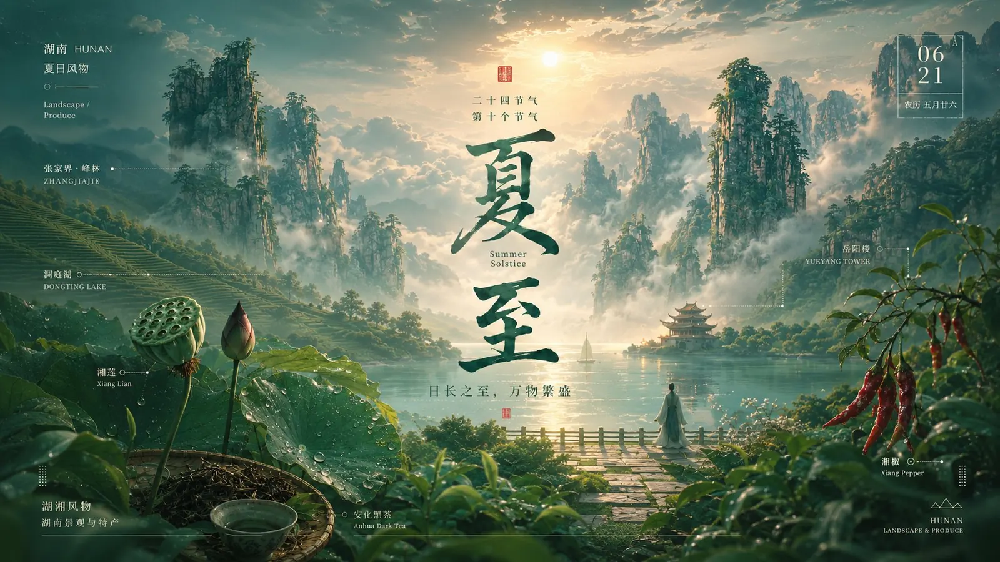
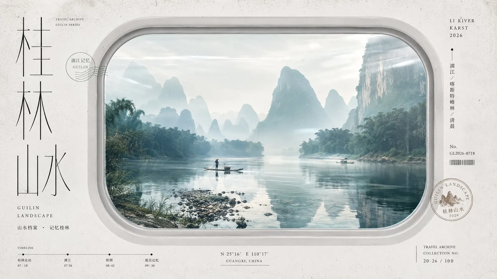
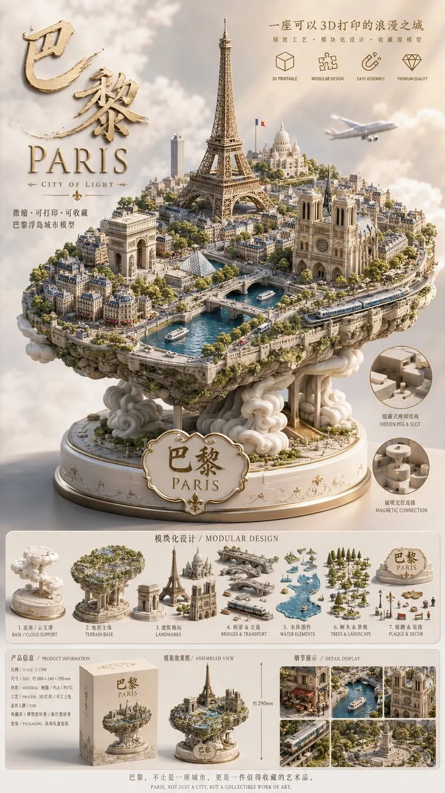

# YUSyntra

### AI 视觉提示词与案例知识库

从海报、知识图解到产品概念与插画：这里收录经过整理与公开发布清理的视觉案例、完整提示词和可复用创作方法。

> **649+ 张案例图 · 9 个视觉分类 · 中文结构化提示词 · 持续更新**

这个仓库不只展示“生成结果”，还尽量保留结果背后的创作逻辑：主题分析、构图、色彩、材质、光影、排版、画面比例和负面约束。你可以直接浏览，也可以把其中的变量替换成自己的主题，建立个人视觉工作流。

## 经典案例

点击案例名称，可进入对应分类查看完整提示词与更多同系列图片。

| 二十四节气 × 景深美学 | 旅行档案感视觉海报 | 中国风知识图鉴 |
|---|---|---|
| [](docs/02-posters.md#二十四节气-x-景深美学) | [](docs/02-posters.md#旅行档案感视觉海报) | [](docs/09-knowledge-infographics.md#中国风x知识图鉴) |
| **[查看节气海报提示词](docs/02-posters.md#二十四节气-x-景深美学)** | **[查看旅行海报提示词](docs/02-posters.md#旅行档案感视觉海报)** | **[查看知识图鉴提示词](docs/09-knowledge-infographics.md#中国风x知识图鉴)** |

| 剖面科普图解绘本 | 城市微型比例模型 | 原创产品概念提案 |
|---|---|---|
| [](docs/09-knowledge-infographics.md#剖面科普图解绘本) | [](docs/10-illustrations.md#城市微型比例模型) | [](docs/04-product-concepts.md#原创ip商品化提案) |
| **[查看科普图解提示词](docs/09-knowledge-infographics.md#剖面科普图解绘本)** | **[查看微缩城市提示词](docs/10-illustrations.md#城市微型比例模型)** | **[查看产品提案提示词](docs/04-product-concepts.md#原创ip商品化提案)** |

## 你可以用它做什么？

- **寻找视觉方向**：按类别快速查看成套案例，而不是面对空白画布。
- **拆解优秀画面**：学习主体、环境、镜头、光影、配色、材质和排版如何协同。
- **复用提示词骨架**：替换主题变量，快速生成自己的海报、图解或插画。
- **建立个人知识库**：使用统一模板继续补充案例、版本和生成经验。

## 分类导航

| 分类 | 案例图 | 适合创作 | 入口 |
|---|---:|---|---|
| LOGO | 45 | 标志探索、字体标、符号系统 | [进入](docs/01-logo.md) |
| 海报 | 135 | 节气、城市、旅行、活动与视觉封面 | [进入](docs/02-posters.md) |
| 原创产品 | 65 | 包装、VI、展位与商品概念提案 | [进入](docs/04-product-concepts.md) |
| 风景人文 | 5 | 自然景观、地域气质与文化氛围 | [进入](docs/06-landscape-humanities.md) |
| 广告创意 | 4 | 概念广告与视觉传播 | [进入](docs/07-advertising.md) |
| 知识信息 | 42 | 知识图鉴、科普图解与信息架构 | [进入](docs/09-knowledge-infographics.md) |
| 插画 | 301 | 手绘、拼贴、微缩模型与叙事插画 | [进入](docs/10-illustrations.md) |
| 设计 | 11 | 版式、视觉系统与设计实验 | [进入](docs/11-design.md) |
| 城市 | 41 | 城市名片、建筑与地域视觉 | [进入](docs/12-cities.md) |

## 三步开始使用

1. 在上方选择一个分类或经典案例。
2. 阅读案例图片下方的完整提示词，找到其中的主题、主体、风格和比例变量。
3. 将变量替换成自己的内容，先生成构图草案，再逐步调整文字、细节与质感。

推荐的最小输入结构：

```text
主题：你要表达什么
主体：画面中最重要的对象
场景：时间、地点、环境与氛围
视觉：风格、构图、色彩、光影与材质
输出：横竖比例、清晰度、文字要求和避免事项
```

新增案例时，可以直接复制 [提示词条目模板](templates/prompt-entry-template.md)。

## 关于这个项目

YUSyntra 整理自个人视觉学习资料。公开版本优先保留通用、原创、可复用的方法，并已移除人物隐私、成人化题材、真实品牌及明显第三方 IP 内容。详细处理范围见 [公开版清理报告](SANITIZATION-REPORT.md)。

AI 生成结果可能出现错字、错误结构、虚构标志或近似风格。图片和提示词适合作为学习与创意参考，正式发布或商业使用前，请人工复核事实、文字、人物、商标、字体和素材授权。

> 当前仓库尚未添加开源许可证。公开可见不等于自动允许复制、再发布或商业使用。

## 参与补充

如果你希望添加新的视觉案例，请阅读 [贡献说明](CONTRIBUTING.md)，并保持“案例图、提示词、变量说明、风险检查”四项完整。

如果这个知识库对你有帮助，欢迎收藏或 Star。后续将继续补充更清晰的索引、经典案例和提示词版本记录。
