# LOGO类

> 从《ChatGPT image2 提示词》导入并转换为适合 GitHub 浏览的版本。

## 人物肖像品牌Logo

| 预览 | 预览 | 预览 | 预览 |
| --- | --- | --- | --- |
| 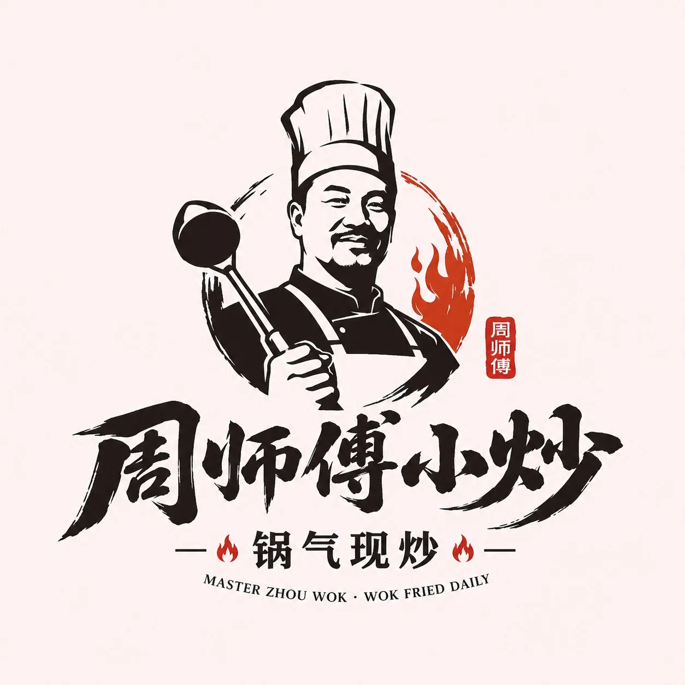 | 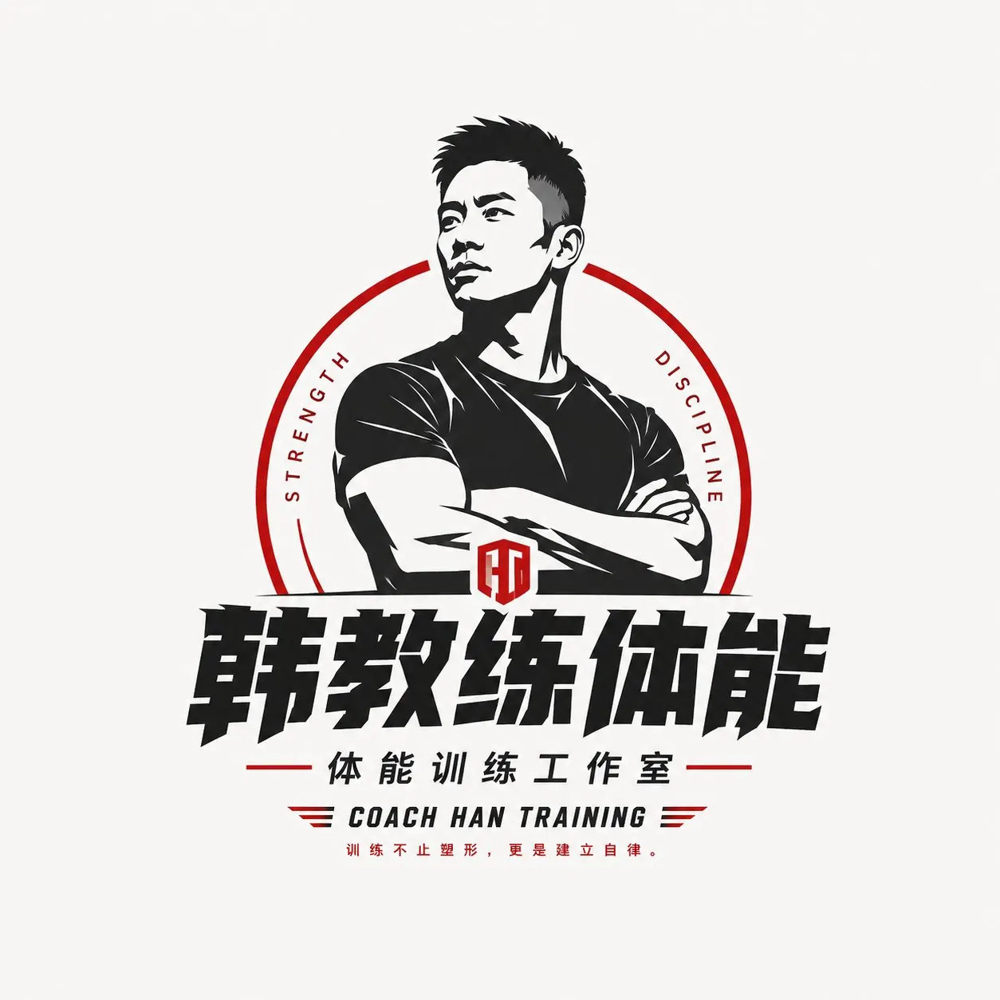 | 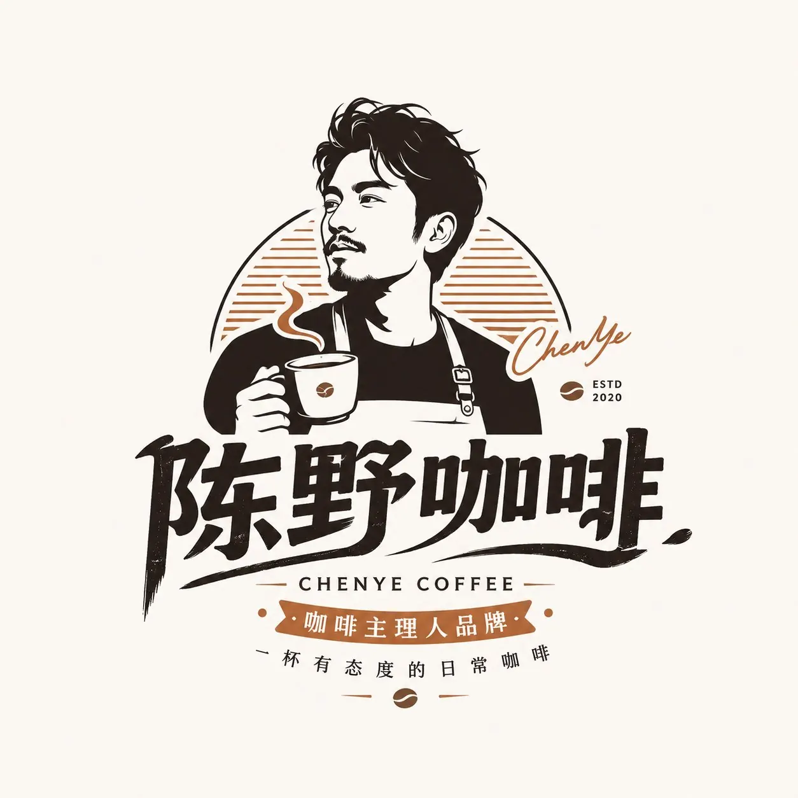 | 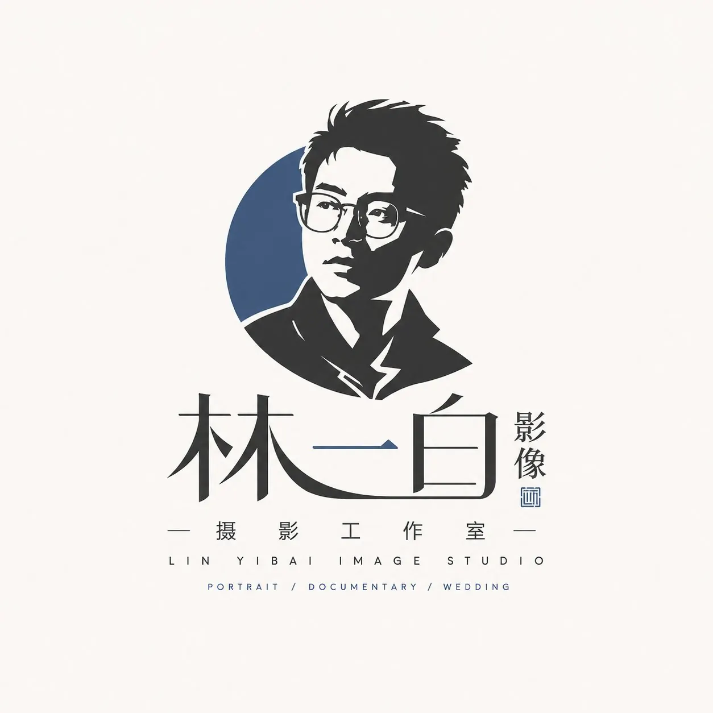 |

《人物肖像品牌》Logo提示词：

请根据用户输入的【品牌名 / 人名】【副标题 / 产品名】【类型 / 行业】【品牌定位】【人物身份】【人物特征】【职业属性】【情绪气质】【字标风格】【主色调】【辅助色】【画幅比例】，设计一个高完成度的「人物肖像品牌字标 Logo / Portrait Brand Wordmark Logo」。

### 用户输入

品牌名 / 人名：【品牌名 / 人名】

副标题 / 产品名：【副标题 / 产品名】

类型 / 行业：【摄影工作室 / 咖啡主理人 / 健身教练 / 餐饮主理人 / 设计工作室 / 顾问品牌 / 医生个人品牌 / 自媒体IP / 潮流工作室等】

品牌定位：【品牌定位】

人物身份：【摄影师 / 咖啡主理人 / 教练 / 厨师 / 设计师 / 顾问 / 老师 / 医生 / 内容主理人等】

人物特征：【发型 / 眼镜 / 胡子 / 帽子 / 脸型 / 穿着 / 姿态 / 工具 / 气质特征】

职业属性：【专业 / 潮流 / 亲切 / 主理人感 / 服务感 / 可信度 / 手艺感等】

情绪气质：【专业、稳重、亲切、有态度、潮流、可信、温暖、干练、烟火气、主理人气质等】

字标风格：【现代理性 / 复古主理人 / 力量运动 / 手写招牌 / 街头潮流 / 专业工作室等】

主色调：【主色调】

辅助色：【辅助色】

画幅比例：【画幅比例】

### 重要规则：如果用户上传了人物肖像 / 个人照片

若用户提供了人物参考图，请将该参考图作为人物形象依据进行创作。

要求：

保留人物的核心识别特征，包括但不限于：脸型、发型、发际线、眼镜、胡子、帽子、五官比例、穿着轮廓、整体气质；

不要把参考图直接照搬成写实插画，也不要做成普通照片转插画；

必须将参考人物进行 Logo 化、块面化、符号化、艺术化处理；

目标是“保留人物辨识度 + 提升品牌感”，而不是机械复刻；

若人物有明显职业特征或个人风格，也应保留并强化；

如果上传图中人物姿态不适合做 Logo，可在保留人物识别特征的前提下，调整为更适合 Logo 的半身像 / 头像构图。

### 如果没有上传人物图片

若用户没有提供人物参考图，则根据用户输入的人物身份、人物特征、职业属性与情绪气质，原创设计一个符合品牌定位的人物肖像 Logo。

### 核心目标

这次要设计的是一个真正具有设计师感和品牌识别度的「人物肖像品牌字标 Logo」。

它不是普通头像插画，也不是简单“头像 + 打字”的拼接图，而是要把“人物肖像、定制字标、职业身份、品牌气质和少量结构元素”整合成一个完整、可商用、可传播、可缩放的个人品牌 Logo。

最终效果应像一个真实个人品牌、工作室品牌、主理人品牌或职业服务品牌可以直接使用的品牌主标。

### 设计本质

这类 Logo 的重点不是把人物画得写实，而是把人物转化成品牌人格符号：

人物肖像负责记忆点；

品牌字标负责识别度；

职业特征负责定位；

字体设计负责风格；

构图结构负责完整度。

### 最重要的原则

人物必须是主识别点，但不能像普通插画头像；

人物必须进行艺术化、块面化、符号化处理；

品牌名 / 人名必须清晰醒目，并具备定制字标感；

字标不能使用普通标准字体直接排字，要有行业气质和设计变化；

人物和字标必须形成一个整体，不是上下机械拼接；

整体要有品牌感、风格感和商业完成度；

不要太正、太模板、太普通，要有设计师作品感。

### 人物肖像要求

请围绕【人物身份】与【人物特征】设计一个高辨识度的人物头像或半身像。

人物表现方式应偏 Logo 化，可使用：

黑白块面肖像；

扁平线稿肖像；

版画感肖像；

丝印海报感肖像；

半身职业人物图形；

圆形 / 半圆 / 色块底托中的人物头像。

人物要求：

保留最关键的人物特征，例如发型、眼镜、胡子、帽子、服装轮廓、脸型、姿态；

不追求完全写实，要进行强概括和艺术化提炼；

强化黑白明暗块面，形成更强视觉识别；

允许人物有轻微夸张、角度变化和姿态表达；

可加入职业工具，例如相机、咖啡杯、锅铲、哑铃、书本、钢笔、耳机等；

人物轮廓要清晰，适合缩小后仍能识别；

人物应像品牌符号，而不是普通头像。

### 字标设计要求

品牌名 / 人名必须被设计成有风格的字标，而不是普通排版。请根据行业选择对应的字标语言。

### 人物与字标关系

人物和文字不能分离，要有结构关系：

人像可以压在字标上方；

字标可以承托人物；

半圆 / 色块底托可以把人物和文字连接起来；

工具、横线、ribbon、小章可以作为连接结构；

整体要像一个完整 Logo，而不是头像图 + 标题字。

### 构图结构要求

可根据品牌选择以下结构：

人物头像在上，定制字标在下，副标题辅助；

半圆 / 圆章人物底托 + 主字标 + 小副标；

人物半身像 + 大字标 + 横线 / ribbon / 小标签；

人物在左，字标在右，适合更现代专业品牌；

人物与字标形成整体徽章感，适合教练、餐饮、咖啡主理人。

整体要求：

主次清晰；

人物有记忆点；

字标有设计感；

留白适中；

适合缩小使用；

不能海报化。

### 色彩要求

建议以黑白灰为主体，搭配 1 个强调色。

要求：

色彩克制但有记忆点；

强调色用于底托、横线、ribbon、小章、辅助图形；

不要颜色太多；

不要廉价渐变；

不要像普通卡通头像。

### 辅助元素要求

可加入少量设计结构元素增强完整度：

半圆底托；

圆形徽章；

横线；

小印章；

ribbon；

ESTD 年份；

英文副标题；

slogan；

小职业图标；

签名感笔迹；

小红章 / 小色块。

辅助元素必须服务整体构图，不能变成堆装饰。

### 画面呈现要求

这是独立 Logo 展示图，不是海报；

背景干净，建议白底、米白底、浅灰底；

Logo 主体清晰完整；

肖像有艺术化处理；

字标有定制设计感；

人物、文字和职业属性统一；

适合用于头像、名片、门头、社交媒体、品牌包装、工服、贴纸等场景。

### 风格关键词

人物肖像品牌字标 Logo、Portrait Brand Wordmark Logo、personal branding logo、stylized portrait logo、custom wordmark、portrait identity design、founder logo、studio logo、designer-style logo、black and white block portrait、brand personality mark。

### 风格关键词

人物肖像品牌字标 Logo、肖像品牌字标、个人品牌标志、风格化肖像标志、定制文字标记、肖像身份设计、创始人标志、工作室标志、设计师风格标志、黑白块头肖像、品牌个性标志。

### 验收标准

请确保最终结果满足：

一眼能识别人是主角；

一眼能看出品牌名；

如果有参考图，人物形象应与参考图保持明显识别关联；

人像有艺术化处理，不是普通头像；

字标有定制感，不是普通排字；

人物和字标形成完整 Logo；

配色克制但有品牌记忆点；

能体现职业身份；

适合商用和社交传播。

### 输出要求

请最终输出一个高完成度的「人物肖像品牌字标 Logo」。

如果用户上传了人物照片，请在保留人物核心识别特征的前提下进行 Logo 化与艺术化重构；

如果没有上传照片，则根据文本设定原创设计人物形象。

最终成品必须是一个简洁、专业、有记忆点、有设计师作品感的完整 Logo。

## 风土手作图文logo

| 预览 | 预览 | 预览 | 预览 |
| --- | --- | --- | --- |
| 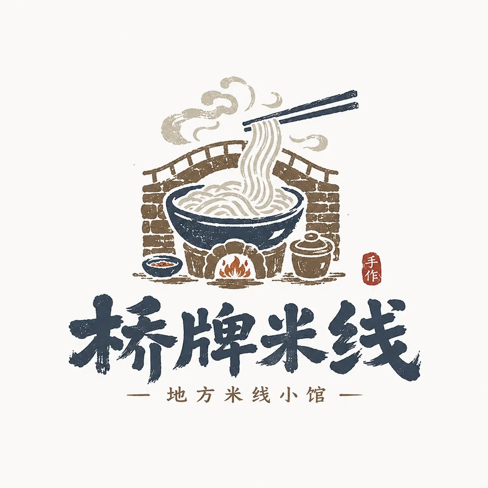 | 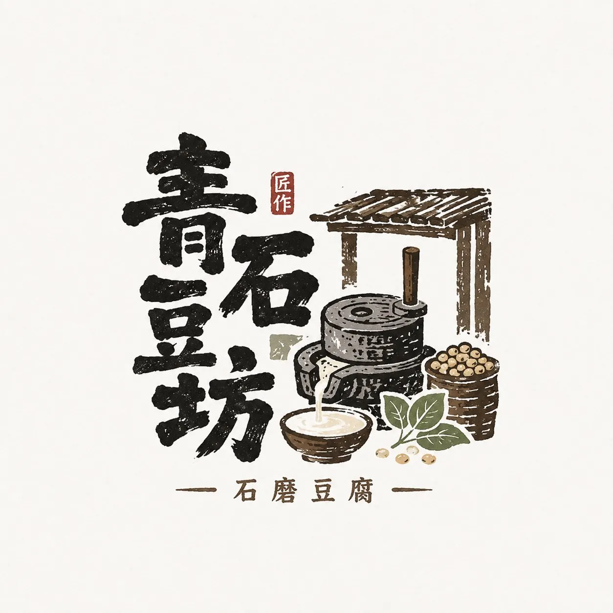 | 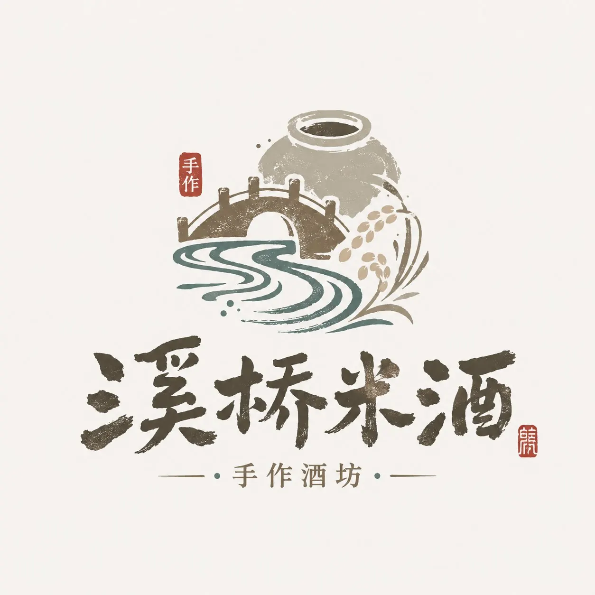 | 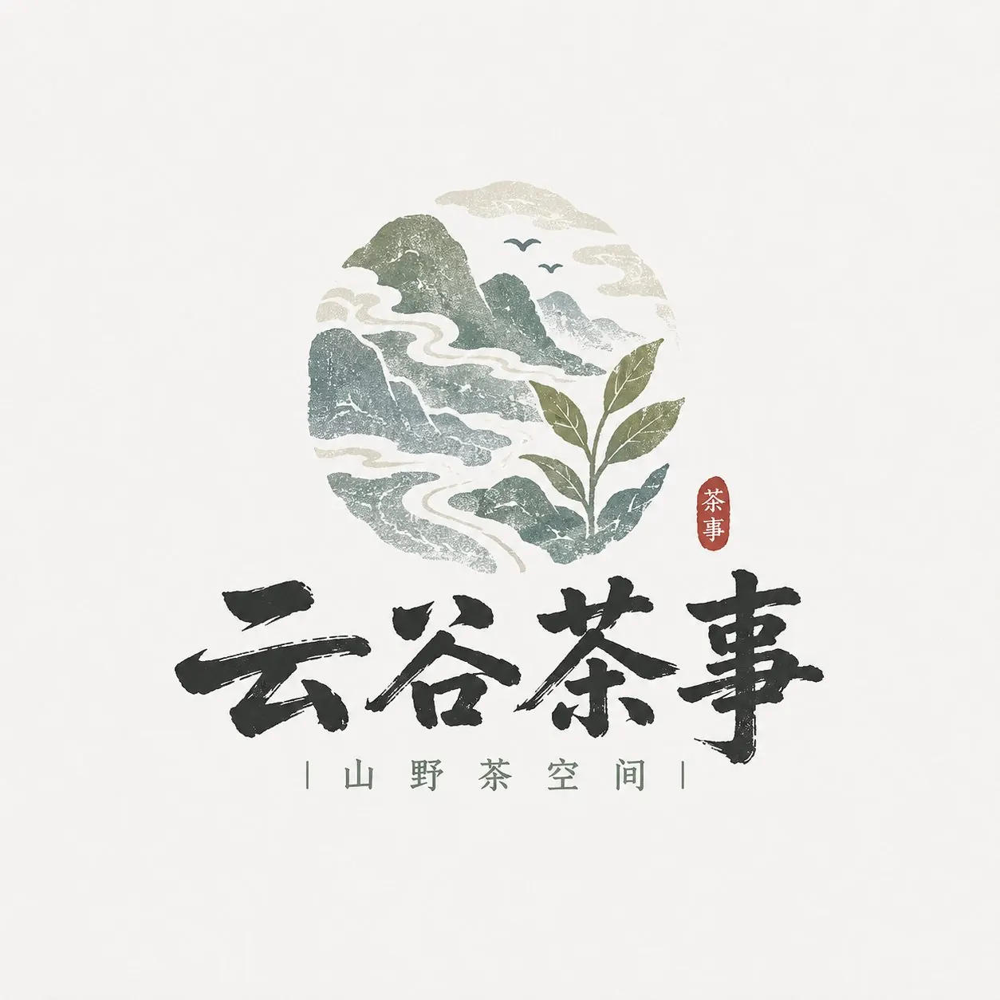 |

《风土手作图文logo》提示词：

请根据用户输入的【品牌名 / 项目名】【副标题 / 产品名】【类型 / 行业】【品牌定位】【核心关键词】【核心图形】【风土信息】【情绪气质】【主色调】【辅助色】【画幅比例】，设计一个高完成度的「风土手作图文 Logo / Local Craft Illustrated Wordmark Logo」。

### 用户输入

品牌名 / 项目名：【】

副标题 / 产品名：【】

类型 / 行业：【】

品牌定位：【】

核心关键词：【】

核心图形：【】

风土信息：【】

情绪气质：【】

主色调：【】

辅助色：【】

画幅比例：【】

### 核心目标

这次要设计的是一个真正具有地方气息与手作质感的「风土手作图文 Logo」。

### 设计本质

这类 Logo 的重点不在“做得很炸”，而在“做得有味道、有地方气、有手作感”。

请完成以下整合：

以中文品牌名为主识别；

用小型图形补充风土信息；

用低饱和自然配色建立山野 / 食物 / 工艺气质；

用轻版画、轻印刷、轻手作质感增强品牌温度；

整体形成一个适合小店、地方品牌、文创品牌使用的图文标志。

### 最重要的原则

中文品牌名必须是主角，清晰、好认、有书写感或小店招牌感；

图形要小而准，用来表达地方信息、食物属性或工艺特征；

不要做成大商业徽章，不要做成重国潮餐饮商标；

不要做成高饱和潮玩卡通；

不要只写字，也不要只画图，必须是“字 + 图”融合；

要有手作感、朴拙感，但不能粗糙失控；

要保留自然、安静、真实的品牌气质；

必须避免直接复制任何现成品牌或参考图的具体山形、构图、人物、边框、符号组合方式，只借鉴风格方法，不借用具体图案。

### 字体 / 字标要求

以中文品牌名为主体；

字标应有手写感、毛笔感、民间招牌感、小店书写感或轻版画感；

可以略带稚拙、朴拙、民艺气质，但必须清晰可读；

不要做成现代企业无衬线字体，也不要过于几何化；

不要做成特别炸裂的狂草书法；

需要像“这个地方品牌自己长出来的名字”，而不是生硬套字体。

### 图形系统要求

请围绕【核心图形】与【风土信息】设计小型图文元素，图形可包括但不限于：

山、水、云、桥、田野、古道、村落、门窗、拱景；

茶叶、米粒、酒坛、石磨、豆腐、碗、筷子、蒸汽、面条；

小鸟、树枝、枝叶、小兽、乡村动物；

工匠、手工场景、版画感小人物；

地方纹样、印章、小标签。

图形要求：

图形应辅助品牌识别，而不是喧宾夺主；

图形要简洁、有信息量、有地方气；

图形可偏手绘、版画、木刻、印刷感；

不要做成复杂写实插画；

图形必须与行业和品牌气质有明确关系；

不要与参考图中的具体图案、山形、人物姿态、门窗造型一模一样，要在元素选择和构图关系上进行明显重组和创新。

### 构图要求

可根据品牌类型选择更合适的构图方式：

山野风土型：中文字标 + 小山水图形 + 留白；

手作食肆型：中文字标 + 食物器物图形 + 小副标题；

版画匠作型：中文字标 + 工匠 / 木刻框小图 + 竖排小字；

风土器物型：中文字标 + 酒坛 / 石磨 / 茶器 / 门景等象征物。

### 配色要求

整体配色以低饱和、自然、质朴为主

要求：

色彩数量不宜过多，建议 2~5 个主色；

颜色应像自然物、旧印刷、食材或手工材料；

不要使用过于荧光、艳丽、潮玩式高饱和配色；

红色只能少量点缀，不可滥用。

### 质感要求

请适度表现：

轻木刻感；

轻版画感；

轻印刷颗粒感；

轻纸面感；

手绘边缘感；

手作温度感。

### 辅助元素要求

可加入少量辅助信息：

小副标题

小印章

小圆点

小口号

产地 / 手作 / 匠作说明

拼音或英文极小辅助

但必须克制，重点仍然是 Logo 主体。

### 画面呈现要求

这是独立 Logo 展示图，不是海报；

背景干净，建议浅灰白、米白或纸白色；

Logo 主体清晰完整居中；

整体像一个成熟的小品牌主标；

适合包装、门头、杯贴、标签、社媒头像、品牌主图使用。

### 风格关键词

风土手作图文 Logo、Local Craft Illustrated Wordmark Logo、地方感、小店气、山野风土、手作食肆、版画匠作、自然配色、图文融合、中文书写字标、轻印刷感、民艺气质、文创小店品牌。

### 验收标准

请确保最终结果满足：

一眼能读出品牌名；

一眼能感受到地方气息或食物 / 工艺属性；

有小店品牌感，而不是大企业商标感；

字与图结合自然；

配色自然耐看；

风格统一但不过度模仿参考图；

能作为真实品牌 Logo 成立。

### 输出要求

请最终输出一个高完成度的「风土手作图文 Logo」，它必须以中文品牌名为核心，结合风土图形、自然配色和轻手作印刷质感，形成一个既有地方气息、又有品牌识别度、还能真实落地使用的小店系标志。

## 潮玩怪趣IP Logo

| 预览 | 预览 | 预览 | 预览 |
| --- | --- | --- | --- |
| 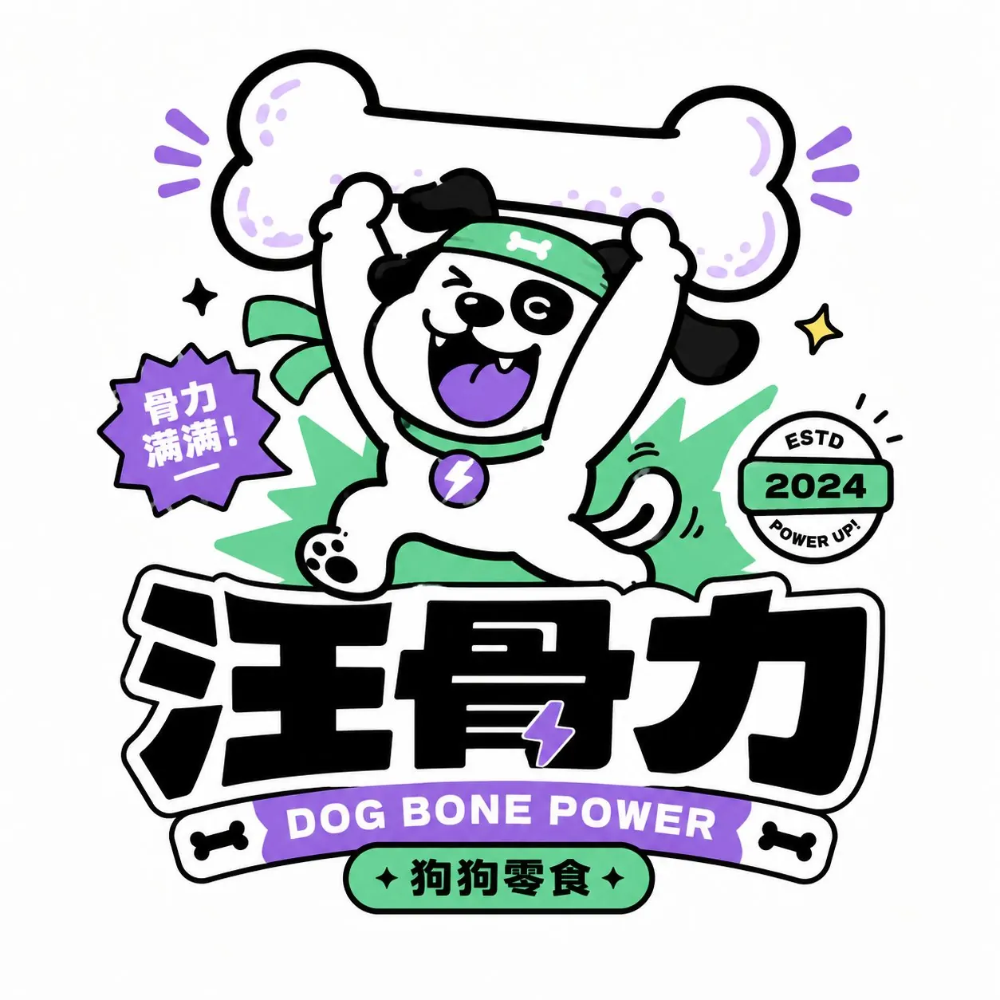 | 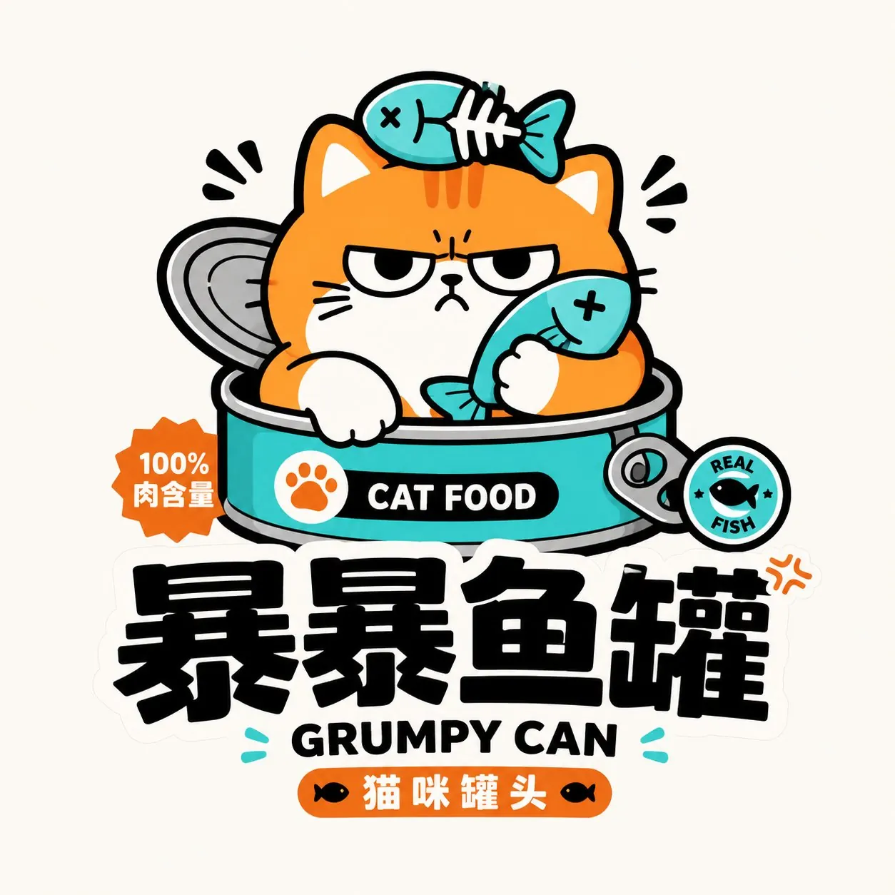 | 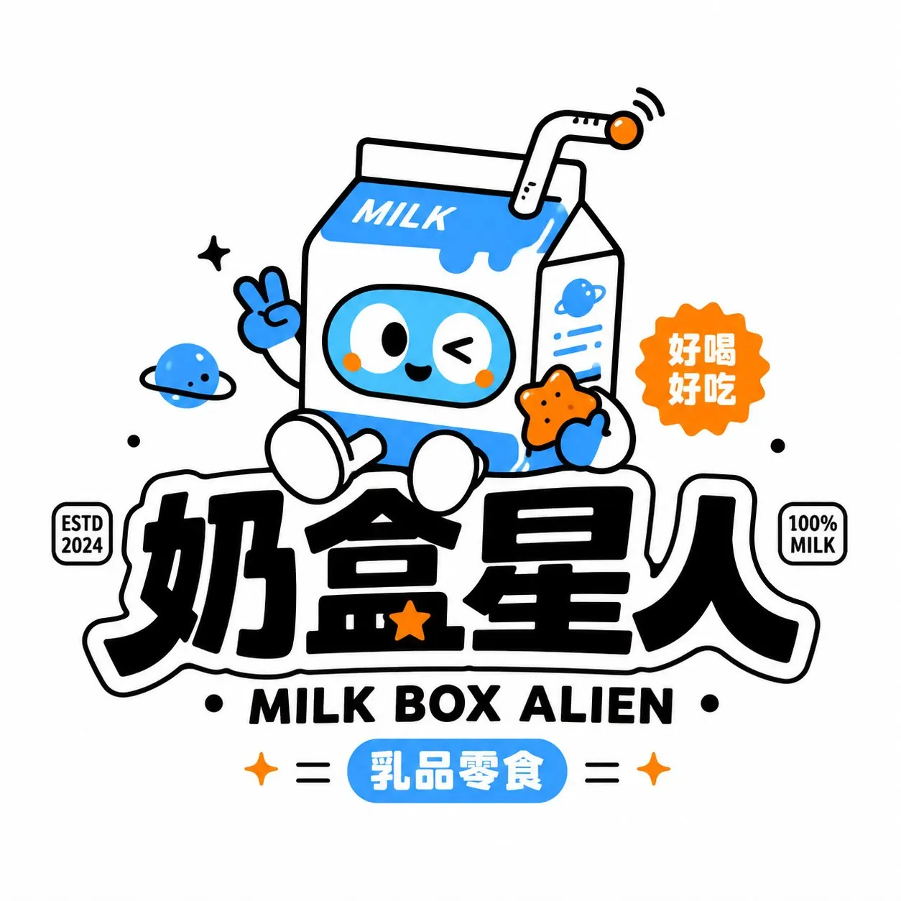 | 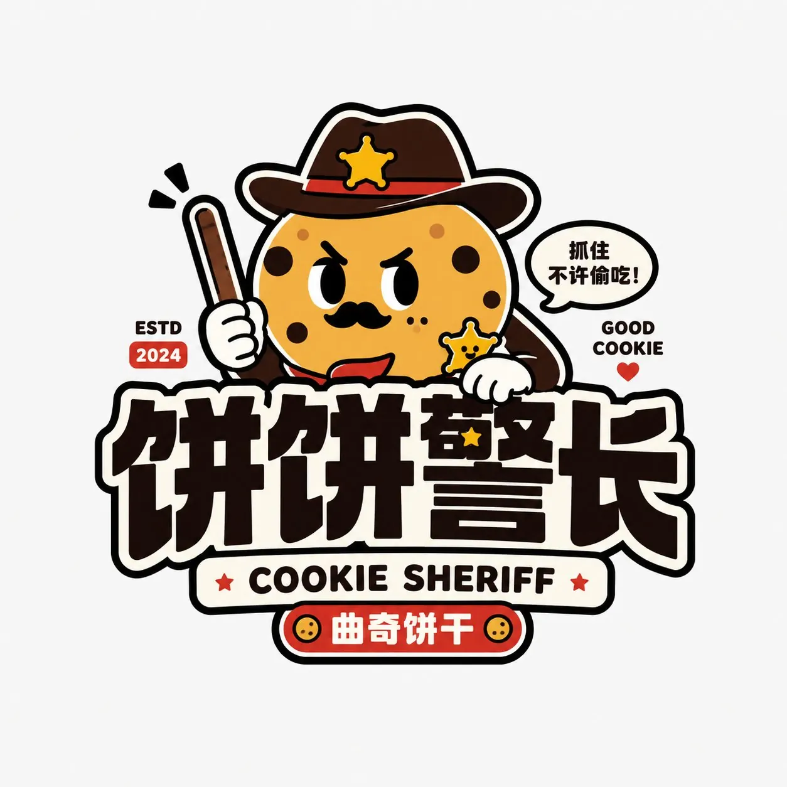 |

《潮玩怪趣IP 》Logo提示词：

请根据用户输入的【品牌名 / 项目名】【副标题 / 产品名】【类型 / 行业】【品牌定位】【核心关键词】【角色设定】【情绪气质】【主色调】【辅助色】【画幅比例】，设计一个高完成度的「潮玩怪趣 IP 字标 Logo」。

### 用户输入

品牌名 / 项目名：【品牌名 / 项目名】

副标题 / 产品名：【副标题 / 产品名】

类型 / 行业：【类型 / 行业】

品牌定位：【品牌定位】

核心关键词：【可爱、怪趣、潮玩、贴纸感、年轻、IP感、搞怪、脑洞、呆萌、品牌感等】

角色设定：【动物 / 拟物 / 怪趣角色 / 食物角色 / 宇宙角色 / 潮玩角色等】

情绪气质：【呆萌、暴躁萌、傻萌、神经质、快乐、懒懒的、嘴硬可爱、无厘头、轻潮流等】

主色调：【主色调】

辅助色：【辅助色】

画幅比例：【画幅比例】

### 核心目标

这次要设计的是一个真正具有品牌识别度的「潮玩怪趣 IP 字标 Logo」。它不是普通儿童卡通，也不是单纯插画，而是要把“角色 + 字标 + 色彩 + 贴纸感构图”整合成一个完整 Logo。最终效果应像一个可以直接用于包装、贴纸、社交头像、门店招牌、周边商品和品牌视觉主标的年轻化潮玩 Logo。

### 设计本质

这类 Logo 的重点不是只画一个可爱角色，而是要完成以下整合：

一个高辨识度、怪趣可爱的核心角色；

一个醒目、粗黑、有冲击力的中文字标；

辅助英文标题或副标题，增强潮玩包装感；

高饱和扁平配色和黑色粗描边；

整体像贴纸、潮玩包装、IP品牌标志，而不是普通插画。

### 最重要的原则

角色必须是主记忆点，但不能只是装饰插画；

文字必须清晰，具备 Logo 性质；

角色与字标必须有互动关系，形成一个整体，而不是上下拼接；

风格必须年轻、怪趣、可传播，不能低幼或土气；

要有“贴纸感、潮玩感、IP感”，而不是传统企业 Logo；

配色要明快、大胆、有记忆点；

画面要清晰、简洁、完整，适合小尺寸传播；

可以中英混排，但中文或品牌名必须清楚醒目。

### 角色系统要求

请围绕【角色设定】设计一个怪趣、呆萌、有观众缘的卡通角色。角色可以是：

动物拟人：猫、狗、熊、猴、兔、鱼、鳄鱼等；

拟物角色：奶盒、饼干、饮料、牙膏、蛋糕、飞船、武器、工具等；

混合角色：动物+食物、动物+物件、食物+表情、怪物+玩具等。

角色要求：

造型简洁、夸张、可爱、有趣；

表情必须有记忆点，例如呆、拽、傻、懒、坏笑、暴躁萌；

要有强轮廓，适合做品牌标志；

要有一点脑洞或反差感；

线条尽量简洁，偏扁平，不要写实；

角色可以抱着、举着、坐在、靠着、探出、压住字标；

角色应直接参与 Logo 构图，而不是独立站在旁边。

### 字标系统要求

中文品牌名或主标题必须醒目；

字体要粗、黑、有重量感，像包装标题字或潮玩品牌字；

可以有轻微变形，但不要过度花哨；

适合与角色进行穿插、叠压、环绕或组合；

英文可用于弧形标题、辅助标题、副说明、小口号、年份等；

英文风格可偏粗体、大写、玩具包装感、贴纸感；

整体应形成“角色 + 中文大字 + 英文辅助”的完整层级。

### 构图要求

整体构图应具有明显的“潮玩贴纸 Logo”感。可参考以下结构：

角色在上，中文字标在下，英文小字辅助；

角色压在字上或从字中探出；

上方弧形英文 + 中间角色 + 下方中文字标；

角色与字形成整体轮廓，像一枚品牌贴纸；

可加小标签、小年份、小符号、小印章增强包装感。

整体要求：

主体集中；

结构清晰；

角色和文字关系明确；

缩小后依然容易识别。

### 视觉风格要求

使用扁平化色块；

使用明显粗黑描边；

配色高饱和、有冲击力；

整体有潮玩感、贴纸感、包装感；

画面可以有一点无厘头和搞怪感；

线条干净利落，不要复杂阴影；

不要真实材质，不要 3D 写实感。

### 色彩要求

建议使用 2~5 个主色，整体高饱和、年轻化。

### 辅助元素要求

可加入少量潮玩包装式辅助元素，但必须克制，不能让画面变成海报。

### 画面呈现要求

这是独立 Logo 展示图，不是海报；

背景干净，建议白底、浅灰底、米白底；

主体清晰完整，角色与字标一体化；

风格统一，辨识度高；

适合用于包装、头像、贴纸、门头、周边和社交媒体传播。

### 验收标准

请确保最终结果满足：

一眼能记住角色；

一眼能看清品牌名；

角色和字标是一个整体；

整体有贴纸感、潮玩感、IP感；

配色鲜明、年轻、有观众缘；

适合做品牌主 Logo，而不是单纯插画；

有传播感和社交媒体友好度。

### 输出要求

请最终输出一个高完成度的「潮玩怪趣 IP 字标 Logo」，它必须以怪趣可爱的角色为核心，以粗黑字标为结构，以高饱和扁平配色和贴纸感构成为表现方式，形成一个年轻化、潮玩化、可传播、可品牌化的完整 Logo。

## 国潮风餐饮徽章Logo

| 预览 | 预览 | 预览 | 预览 |
| --- | --- | --- | --- |
| 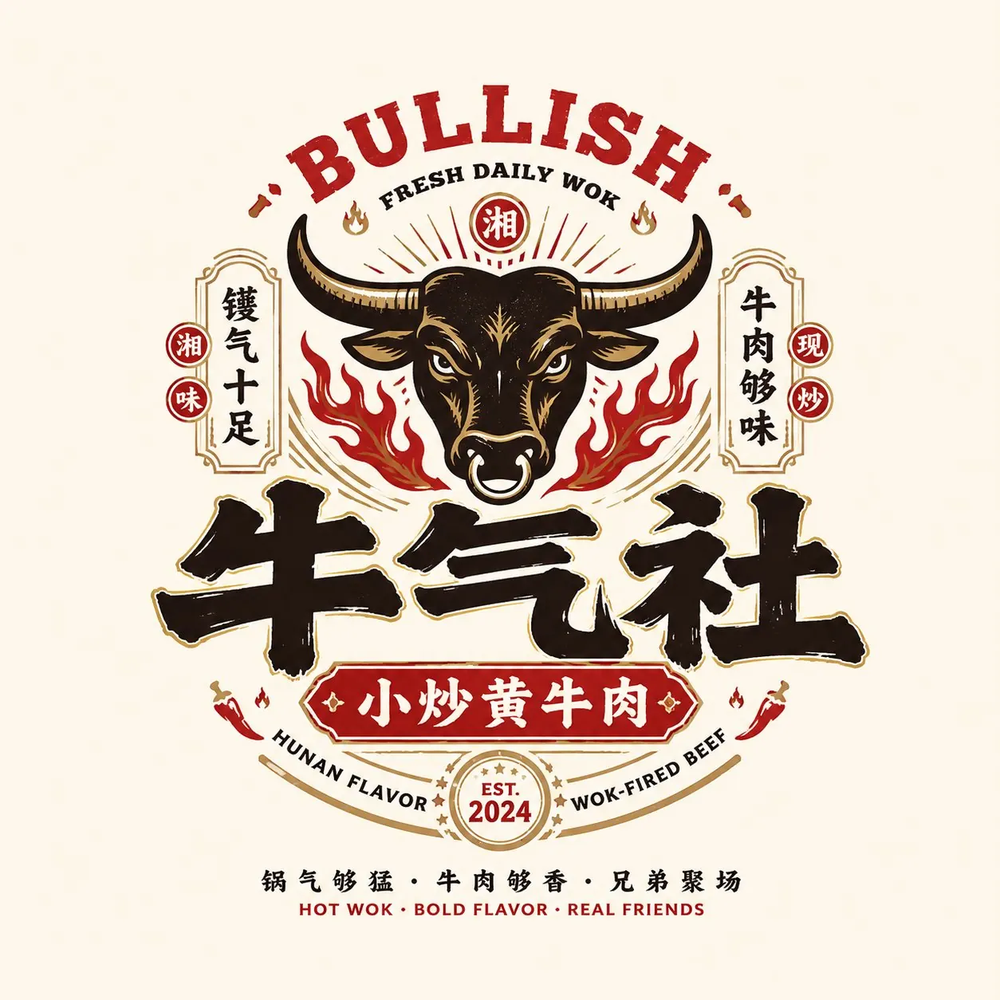 | 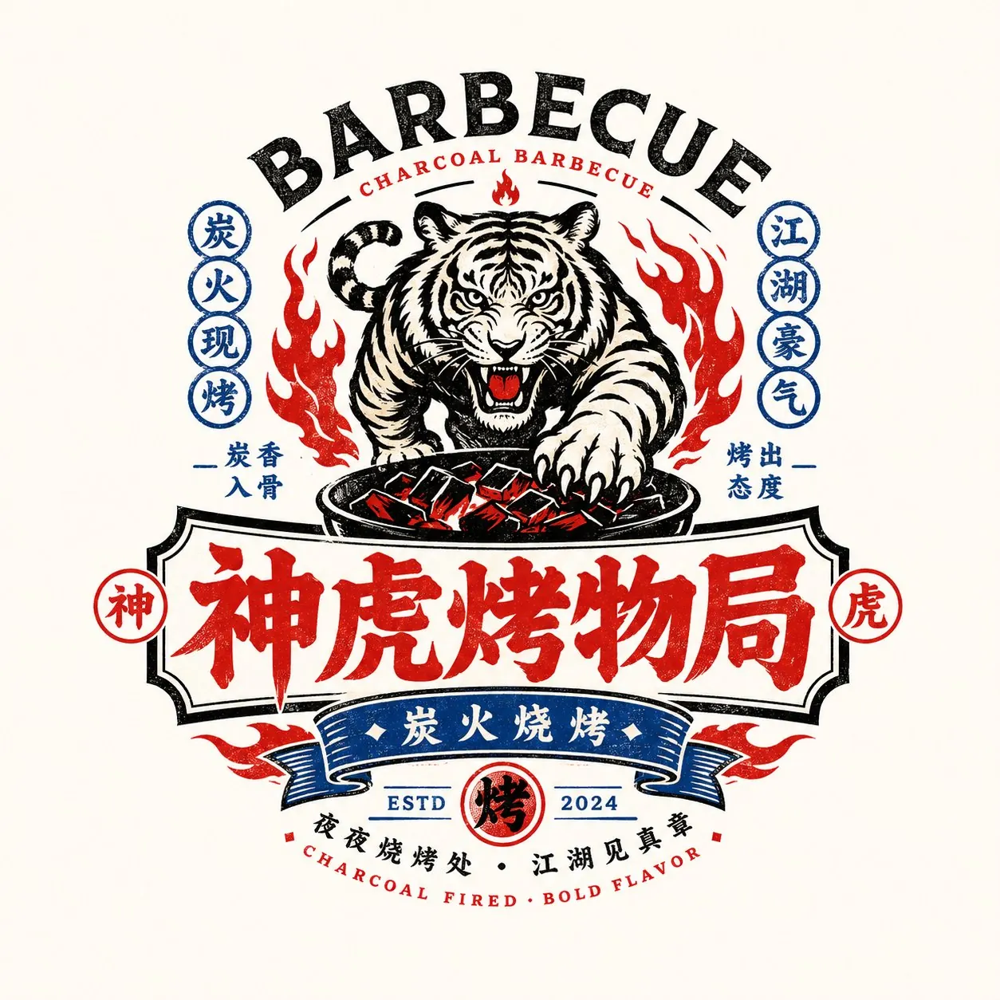 | 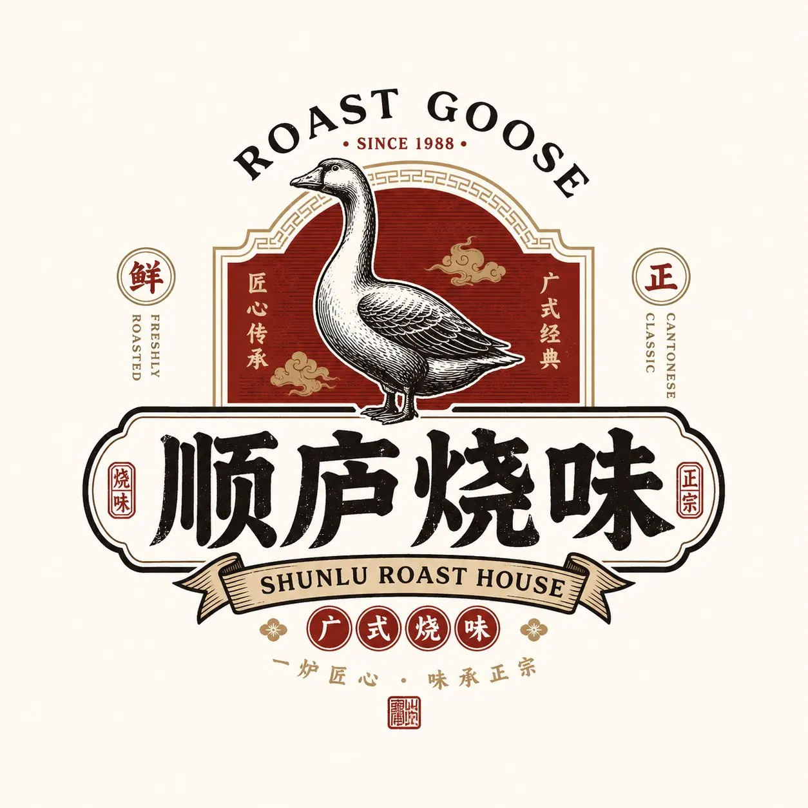 | 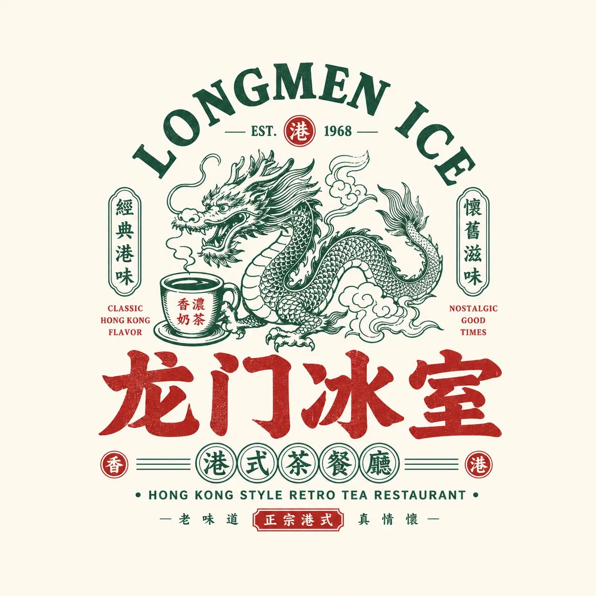 |

《国潮风餐饮徽章》Logo提示词：

请根据用户输入的【品牌名 / 项目名】【副标题 / 产品名】【类型 / 行业】【地域风味】【品牌定位】【核心关键词】【核心图形】【核心食物 / 品类元素】【情绪气质】【主色调】【辅助色】【画幅比例】，设计一个高完成度的「国潮复古餐饮徽章 Logo / Chinese Retro Food Emblem Logo」。

### 用户输入

品牌名 / 项目名：【品牌名 / 项目名】

副标题 / 产品名：【副标题 / 产品名】

类型 / 行业：【类型 / 行业】

地域风味：【港式 / 粤式 / 湘味 / 川味 / 炭火 / 夜宵 / 茶餐厅 / 烧味 / 海鲜 / 小酒馆等】

品牌定位：【品牌定位】

核心关键词：【复古、国潮、招牌感、老字号感、烟火气、江湖感、新消费感等】

核心图形：【龙 / 凤 / 鹤 / 虎 / 牛 / 蛙 / 鹅 / 鱼 / 龙虾 / 器具 / 图腾 / 吉祥纹样等】

核心食物 / 品类元素：【烧鹅 / 烧烤 / 茶饮 / 龙虾 / 面食 / 牛肉 / 冰室 / 酒馆等】

情绪气质：【热闹、霸气、复古、经典、地方感、烟火气、江湖感、年轻化等】

主色调：【主色调】

辅助色：【辅助色】

画幅比例：【画幅比例】

### 核心目标

这次要设计的是一个真正可用于餐饮品牌的「国潮复古餐饮徽章 Logo」。它不是普通海报，也不是简单卡通插画，更不是只写几个字。请以中文主字标为核心，融合强识别图形、餐饮品类符号、复古中英文排版和完整徽章式结构，打造一个具有门头感、包装感、品牌系统感和传播感的餐饮 Logo。

最终结果应让人一眼感受到：

这是一个餐饮品牌；

它有明确品类和个性；

它像一个成熟的品牌主标，而不是一张装饰性图案。

### 设计本质

这类 Logo 的核心不是单一图形或单一字体，而是以下五层整合：

中文主字标：负责品牌识别；

图形符号：负责记忆点与品类联想；

徽章结构：负责整体完整性；

中英文排版：负责层次感与复古品牌氛围；

颜色系统：负责强化餐饮调性和品类情绪。

### 最重要的原则

中文品牌名必须醒目、清楚、具有招牌感；

Logo 必须是一个完整标识，而不是零散元素拼贴；

图形必须与品牌名或品类相关，不能为了装饰而装饰；

英文为辅助，中文为主，英文不能喧宾夺主；

整体必须有餐饮品牌属性，适合门头、菜单、包装和社媒头像；

画面必须有复古感，但不能老气、脏乱或失去现代品牌完成度；

必须有“国潮复古餐饮徽章”的味道，而不是美式卡通或日式商铺字标。

### 中文主字标要求

中文品牌名为绝对主角；

字体要有复古餐饮招牌感、老包装感或国潮标题感；

可以厚重、粗壮、有黑体 / 宋黑 / 商业手写感；

可以做适度变体，但必须清晰可读；

不要极简细字体，不要弱，不要像普通系统字；

需具备门头感和品牌标识感。

### 图形系统要求

请根据【核心图形】与【品类元素】设计一个与品牌高度相关的主图形。

可选方向包括：

动物 / 神兽：龙、凤、虎、牛、鹅、鱼、蛙、鹤等；

食材 / 菜品：龙虾、烧鹅、牛肉、面碗、火焰、茶杯等；

传统图腾：章印、纹样、牌匾、吉祥图案；

器具 / 场景符号：烤架、火焰、碗筷、冰室元素等。

图形要求：

要有记忆点；

要与品类和名字有明确关系；

不要做得太复杂写实；

要适合与字标整合为徽章；

可以偏复古插画、版画感、老商标感、国潮线描感。

### 徽章结构要求

请把整体设计成一个完整的“餐饮品牌徽章 Logo”，而不是简单横排。

结构可参考以下方式：

上方英文拱形 + 中央图形 + 下方中文主字标；

中央大图形 + 左右小标签 + 下方副标题；

圆章 / 椭圆章 / 牌匾式构图；

中心主图 + 上下分层文字；

对称排版 + 小图章 + 小圆标系统；

老招牌 / 老商标 / 包装主标式版式。

### 中英文排版要求

中文为主，英文为辅；

英文可用于拱形主标题、品类名、店型说明、口号、年份、ESTD 等；

英文参与构图，增强复古商标感；

英文不需要过多，但要精致、清晰、服务整体结构；

可以使用如：

HOUSE

TAVERN

BARBECUE

ROAST GOOSE

TEA RESTAURANT

LOBSTER HOUSE

ESTD / SINCE / CLASSIC / SPECIALTY

不要让英文压过中文，也不要变成纯英文品牌。

### 辅助元素要求

可以加入少量增强品牌系统感的小元素，例如：

ESTD 年份

小圆章

小图标

小标签

小印章

地域说明

品类说明

横线 / 点阵 / 小边框

slogan 小字

但必须克制，不能把画面做成复杂海报。

### 色彩要求

请根据品牌品类选择更合适的国潮复古餐饮色彩系统，例如：

黑 + 红：烧烤、卤味、烧味、小酒馆；

黑 + 金 / 棕金：老字号、熟食、烧鹅、粤式餐饮；

绿 + 红 + 米白：港式冰室、茶餐厅；

蓝 + 红 + 白：海鲜、龙虾、年轻夜宵餐饮；

黑 + 蓝：更年轻、更理性一点的夜宵或酒馆；

红 + 米白：老长沙粉面、传统小吃等。

要求：

色彩有餐饮招牌感；

颜色不宜过多，2~4 个主色最稳；

高饱和点缀可以增强吸睛度，但必须控制统一性。

### 画面呈现要求

这是独立 Logo 展示图，不是菜单海报；

背景简洁，建议浅灰白、米白、纸白或纯净浅底；

Logo 主体完整、清晰、居中；

结构完整、信息有层次；

整体看起来像一个成熟餐饮品牌的主 Logo 提案。

### 风格关键词

国潮复古餐饮徽章 Logo、Chinese Retro Food Emblem Logo、餐饮品牌、复古商标、老招牌、品牌徽章、中英混排、国潮字标、餐饮主标、门头感、包装感、老字号感、新消费餐饮。

### 验收标准

请确保最终结果满足：

一眼看出是餐饮品牌；

中文主字标醒目好认；

图形与品牌名 / 品类有明确关系；

徽章结构完整；

中英文排版有层次；

配色有餐饮品牌气质；

适合门头、菜单、包装、贴纸、外卖头像和社媒主图使用；

整体有“国潮复古餐饮徽章”的成熟商业感。

### 输出要求

请最终输出一个高完成度的「国潮复古餐饮徽章 Logo」。它必须以中文品牌名为核心，结合复古图形、中英文辅助系统、徽章式构图和明确的品类属性，形成一个真正可品牌化、可传播、可落地的餐饮品牌标识。

《烟墨流体意象字标 》Logo完整提示词：

请根据用户输入的【品牌名 / 项目名】【副标题 / 产品名】【类型 / 行业】【品牌定位】【核心关键词】【情绪气质】【核心意象】【流体语言】【构图方式】【主色调】【辅助色】【画幅比例】，设计一个高完成度的「烟墨流体意象字标 Logo / Ink Smoke Flow Ideographic Wordmark Logo」。

请根据用户输入的【品牌名 / 项目名】【副标题 / 产品名】【类型 / 行业】【品牌定位】【核心关键词】【情绪气质】【核心意象】【流体语言】【构图方式】【主色调】【辅助色】【画幅比例】，设计一个高完成度的「烟墨流体意象字标 Logo / Ink Smoke Flow 意图文字标记 Logo」。

### 用户输入

品牌名 / 项目名：【品牌名 / 项目名】

副标题 / 产品名：【副标题 / 产品名】

类型 / 行业：【类型 / 行业】

品牌定位：【品牌定位】

核心关键词：【核心关键词】

情绪气质：【空灵、神秘、诗性、冷感、妖气、静谧、流动、克制、开阔、东方幻想等】

核心意象：【雾 / 灯 / 涧 / 水 / 羽 / 雀 / 潮 / 山 / 风 / 云 / 香 / 夜 / 波纹等】

流体语言：【烟雾缠绕 / 水脉流动 / 潮汐翻涌 / 羽烟扩散 / 云气聚散 / 微光凝结 / 墨液旋涡】

构图方式：【横向铺展 / 竖向修长 / 紧凑团块 / 上下结构 / 中心聚焦 / 疏朗留白】

主色调：【主色调】

辅助色：【辅助色】

画幅比例：【画幅比例】

### 核心目标

这次要设计的是一个真正具有东方艺术气质的「烟墨流体意象字标 Logo」。它不是普通毛笔字，不是传统书法作品，也不是现代运动毛笔 Logo，而是以中文品牌名为主体，通过烟、墨、水、雾、潮、羽等自然意象，将文字做成一个兼具可读性、意象感、流动感和图像化特征的艺术字标。

最终效果必须首先是一个可以独立成立的字标 Logo，其次才是书法气质与艺术表现。画面应像一个成熟的视觉标志，而不是一张普通海报。

最终效果必须首先是一个可以独立成立的字标 Logo，其次才是书法气质与艺术表现。 画面应像一个成熟的视觉标志，而不是一张普通海报。

### 设计本质

这类 Logo 的重点不是单纯把字写得好看，而是：

用汉字骨架建立识别；

用自然意象驱动字形变化；

用烟墨流体感塑造情绪；

让笔画内部产生纹理和层次；

让字既能被认出，又像一幅由墨气凝成的画面；

让整体具有清晰的 Logo 性质，而不是散乱的艺术涂写。

### 最重要的原则

品牌名必须是绝对主角；

字形必须可辨认，但可以进行高质量艺术化变形；

每个字的变形必须服务于品牌本身的意象与气质，而不是随意扭曲；

不能只是普通毛笔字加喷墨效果；

不能只是抽象图案，必须保留文字识别；

不能做成现代运动感、火焰感或普通国潮标题字；

要有明显留白、呼吸感和艺术展陈感；

红色印章应根据主题定制，不要机械重复。

### 主体字形要求

以中文品牌名为主体；

字形应保留书法骨架，但做明显的流体化、意象化设计；

笔画可以出现缠绕、拖尾、旋涡、留白、分岔、聚散、波纹、羽化等变化；

字与字之间可相互呼应、贯通、叠合、牵引，形成统一整体；

字形不应像标准印刷字体，也不应像传统完整书法作品，而应更像经过设计的东方艺术字标；

整体应达到“第一眼像图形，第二眼能读字”的高级状态。

### 意象驱动要求

请根据品牌主题，把对应意象自然融入字形内部，而不是额外加一个插画图标：

如果主题偏“雾、夜、香、光”，字应更轻、更散、更朦胧，并有聚散与光芯感；

如果主题偏“涧、水、泉、流”，字应更修长、更清、更有水脉和回旋感；

如果主题偏“羽、雀、玄、妖”，字应更冷、更锐、更有羽化边缘和妖气；

如果主题偏“潮、生、海、波”，字应更翻涌、更铺展，具有潮汐推进和生长感；

如果主题偏“山、云、风、雾”，字应更开阔、更呼吸，具有层叠与漂移感。

### 流体纹理要求

请重点表现以下质感：

液态墨迹的流动感；

烟雾般的缠绕感；

内部白色流纹、旋涡纹、波纹状肌理；

局部飞白、干笔、颗粒飞溅；

笔画边缘自然散开，但仍然受控；

黑色主体内部要有层次，不是大面积纯实心黑块；

纹理要细腻、耐看、有意境。

### 构图要求

可根据品牌选择最合适的版式：

横向铺展：适合“潮生、雾灯、玄雀”等较有扩张感的主题；

竖向修长：适合“听涧”这类有山水、题字、卷轴感的主题；

紧凑团块：适合气场更强、更像视觉符号的主题；

疏朗留白：适合空灵、诗性、香气、山水感更强的主题。

整体构图必须有：

清晰主次

足够留白

稳定视觉重心

可独立作为 Logo 展示

### 印章系统要求

红色印章不是固定模板，而要根据主题创新设计：

可做文字章，例如“夜印”“涧记”“海记”“羽朱”等；

可做图形章，例如波纹章、羽形章、水滴章、小灯章；

可做异形章，例如细长竖章、圆章、残边章、椭圆章；

印章位置要服务构图平衡，可嵌入字边、留白处、尾部、下方，不必固定；

印章只能作为点睛，不可压过主字。

### 辅助元素要求

可加入极少量辅助痕迹来增强个性，但必须克制：

小墨点

极轻的波纹残线

微弱环形气迹

少量拖尾

极细小落款感文字

轻微印泥晕染感

禁止加入大量英文副标题、现代编号、现代图标、过强装饰线、复杂背景故事画面。

### 色彩要求

整体以黑白为主；

背景建议白色、米白、浅灰、宣纸白；

主体为墨黑、浓黑、炭黑；

辅助色只建议少量朱红 / 赤红用于印章；

不建议大面积彩色；

高级感应来自墨韵、构图和字形，而不是丰富配色。

### 画面呈现要求

像独立的艺术字标展示图；

主体清晰、完整、集中；

细节丰富但不过度杂乱；

黑白对比强烈；

留白充足；

整体像“一个能成立的东方艺术 Logo”；

不能像普通海报、普通字体练习或普通书法作品。

### 明确禁止

请严格避免以下问题：

不要做成普通毛笔字；

不要做成传统书法作品排版；

不要做成现代运动毛笔 Logo；

不要做成海报标题字；

不要过度抽象到无法辨认；

不要只靠喷墨、墨点制造效果；

不要所有作品都长得一模一样；

不要让印章始终是同一种方章模板；

不要让字形变形与品牌意象无关；

不要廉价、脏乱、失控。

### 风格关键词

烟墨流体意象字标、Ink Smoke Flow Ideographic Wordmark Logo、东方艺术字标、液态墨迹、烟雾流线、流体书法、意象汉字、图像化字标、黑白强对比、红印点睛、艺术展陈感、自然意象驱动。

### 验收标准

请确保最终结果满足：

一眼看出是汉字字标；

第二眼能感受到对应的自然意象；

字与意象之间有内在关系；

黑白主调统一，红印章点睛恰当；

既像字，也像图，也像标志；

每张都有独特的“第二语言”，而不是同一模板换词；

最终能够作为一个独立的东方艺术 Logo 成立。

### 输出要求

请最终输出一个高完成度的「烟墨流体意象字标 Logo」，它必须以中文品牌名为核心，通过烟墨流动、意象融合、书法骨架、纹理层次和定制印章，形成一个兼具识别性、艺术性、气质感与系列辨识度的视觉标志。

《烟墨流体意象字标 》Logo完整提示词：

请根据用户输入的【品牌名 / 项目名】【副标题 / 产品名】【类型 / 行业】【品牌定位】【核心关键词】【情绪气质】【核心意象】【流体语言】【构图方式】【主色调】【辅助色】【画幅比例】，设计一个高完成度的「烟墨流体意象字标 Logo / Ink Smoke Flow Ideographic Wordmark Logo」。

请根据用户输入的【品牌名 / 项目名】【副标题 / 产品名】【类型 / 行业】【品牌定位】【核心关键词】【情绪气质】【核心意象】【流体语言】【构图方式】【主色调】【辅助色】【画幅比例】，设计一个高完成度的「烟墨流体意象字标 Logo / Ink Smoke Flow 意图文字标记 Logo」。

### 用户输入

品牌名 / 项目名：【品牌名 / 项目名】

副标题 / 产品名：【副标题 / 产品名】

类型 / 行业：【类型 / 行业】

品牌定位：【品牌定位】

核心关键词：【核心关键词】

情绪气质：【空灵、神秘、诗性、冷感、妖气、静谧、流动、克制、开阔、东方幻想等】

核心意象：【雾 / 灯 / 涧 / 水 / 羽 / 雀 / 潮 / 山 / 风 / 云 / 香 / 夜 / 波纹等】

流体语言：【烟雾缠绕 / 水脉流动 / 潮汐翻涌 / 羽烟扩散 / 云气聚散 / 微光凝结 / 墨液旋涡】

构图方式：【横向铺展 / 竖向修长 / 紧凑团块 / 上下结构 / 中心聚焦 / 疏朗留白】

主色调：【主色调】

辅助色：【辅助色】

画幅比例：【画幅比例】

### 核心目标

这次要设计的是一个真正具有东方艺术气质的「烟墨流体意象字标 Logo」。它不是普通毛笔字，不是传统书法作品，也不是现代运动毛笔 Logo，而是以中文品牌名为主体，通过烟、墨、水、雾、潮、羽等自然意象，将文字做成一个兼具可读性、意象感、流动感和图像化特征的艺术字标。

最终效果必须首先是一个可以独立成立的字标 Logo，其次才是书法气质与艺术表现。画面应像一个成熟的视觉标志，而不是一张普通海报。

最终效果必须首先是一个可以独立成立的字标 Logo，其次才是书法气质与艺术表现。 画面应像一个成熟的视觉标志，而不是一张普通海报。

### 设计本质

这类 Logo 的重点不是单纯把字写得好看，而是：

用汉字骨架建立识别；

用自然意象驱动字形变化；

用烟墨流体感塑造情绪；

让笔画内部产生纹理和层次；

让字既能被认出，又像一幅由墨气凝成的画面；

让整体具有清晰的 Logo 性质，而不是散乱的艺术涂写。

### 最重要的原则

品牌名必须是绝对主角；

字形必须可辨认，但可以进行高质量艺术化变形；

每个字的变形必须服务于品牌本身的意象与气质，而不是随意扭曲；

不能只是普通毛笔字加喷墨效果；

不能只是抽象图案，必须保留文字识别；

不能做成现代运动感、火焰感或普通国潮标题字；

要有明显留白、呼吸感和艺术展陈感；

红色印章应根据主题定制，不要机械重复。

### 主体字形要求

以中文品牌名为主体；

字形应保留书法骨架，但做明显的流体化、意象化设计；

笔画可以出现缠绕、拖尾、旋涡、留白、分岔、聚散、波纹、羽化等变化；

字与字之间可相互呼应、贯通、叠合、牵引，形成统一整体；

字形不应像标准印刷字体，也不应像传统完整书法作品，而应更像经过设计的东方艺术字标；

整体应达到“第一眼像图形，第二眼能读字”的高级状态。

### 意象驱动要求

请根据品牌主题，把对应意象自然融入字形内部，而不是额外加一个插画图标：

如果主题偏“雾、夜、香、光”，字应更轻、更散、更朦胧，并有聚散与光芯感；

如果主题偏“涧、水、泉、流”，字应更修长、更清、更有水脉和回旋感；

如果主题偏“羽、雀、玄、妖”，字应更冷、更锐、更有羽化边缘和妖气；

如果主题偏“潮、生、海、波”，字应更翻涌、更铺展，具有潮汐推进和生长感；

如果主题偏“山、云、风、雾”，字应更开阔、更呼吸，具有层叠与漂移感。

### 流体纹理要求

请重点表现以下质感：

液态墨迹的流动感；

烟雾般的缠绕感；

内部白色流纹、旋涡纹、波纹状肌理；

局部飞白、干笔、颗粒飞溅；

笔画边缘自然散开，但仍然受控；

黑色主体内部要有层次，不是大面积纯实心黑块；

纹理要细腻、耐看、有意境。

### 构图要求

可根据品牌选择最合适的版式：

横向铺展：适合“潮生、雾灯、玄雀”等较有扩张感的主题；

竖向修长：适合“听涧”这类有山水、题字、卷轴感的主题；

紧凑团块：适合气场更强、更像视觉符号的主题；

疏朗留白：适合空灵、诗性、香气、山水感更强的主题。

整体构图必须有：

清晰主次

足够留白

稳定视觉重心

可独立作为 Logo 展示

### 印章系统要求

红色印章不是固定模板，而要根据主题创新设计：

可做文字章，例如“夜印”“涧记”“海记”“羽朱”等；

可做图形章，例如波纹章、羽形章、水滴章、小灯章；

可做异形章，例如细长竖章、圆章、残边章、椭圆章；

印章位置要服务构图平衡，可嵌入字边、留白处、尾部、下方，不必固定；

印章只能作为点睛，不可压过主字。

### 辅助元素要求

可加入极少量辅助痕迹来增强个性，但必须克制：

小墨点

极轻的波纹残线

微弱环形气迹

少量拖尾

极细小落款感文字

轻微印泥晕染感

禁止加入大量英文副标题、现代编号、现代图标、过强装饰线、复杂背景故事画面。

### 色彩要求

整体以黑白为主；

背景建议白色、米白、浅灰、宣纸白；

主体为墨黑、浓黑、炭黑；

辅助色只建议少量朱红 / 赤红用于印章；

不建议大面积彩色；

高级感应来自墨韵、构图和字形，而不是丰富配色。

### 画面呈现要求

像独立的艺术字标展示图；

主体清晰、完整、集中；

细节丰富但不过度杂乱；

黑白对比强烈；

留白充足；

整体像“一个能成立的东方艺术 Logo”；

不能像普通海报、普通字体练习或普通书法作品。

### 明确禁止

请严格避免以下问题：

不要做成普通毛笔字；

不要做成传统书法作品排版；

不要做成现代运动毛笔 Logo；

不要做成海报标题字；

不要过度抽象到无法辨认；

不要只靠喷墨、墨点制造效果；

不要所有作品都长得一模一样；

不要让印章始终是同一种方章模板；

不要让字形变形与品牌意象无关；

不要廉价、脏乱、失控。

### 风格关键词

烟墨流体意象字标、Ink Smoke Flow Ideographic Wordmark Logo、东方艺术字标、液态墨迹、烟雾流线、流体书法、意象汉字、图像化字标、黑白强对比、红印点睛、艺术展陈感、自然意象驱动。

### 验收标准

请确保最终结果满足：

一眼看出是汉字字标；

第二眼能感受到对应的自然意象；

字与意象之间有内在关系；

黑白主调统一，红印章点睛恰当；

既像字，也像图，也像标志；

每张都有独特的“第二语言”，而不是同一模板换词；

最终能够作为一个独立的东方艺术 Logo 成立。

### 输出要求

请最终输出一个高完成度的「烟墨流体意象字标 Logo」，它必须以中文品牌名为核心，通过烟墨流动、意象融合、书法骨架、纹理层次和定制印章，形成一个兼具识别性、艺术性、气质感与系列辨识度的视觉标志。

## 烟墨流体意象字标

| 预览 | 预览 | 预览 | 预览 |
| --- | --- | --- | --- |
| 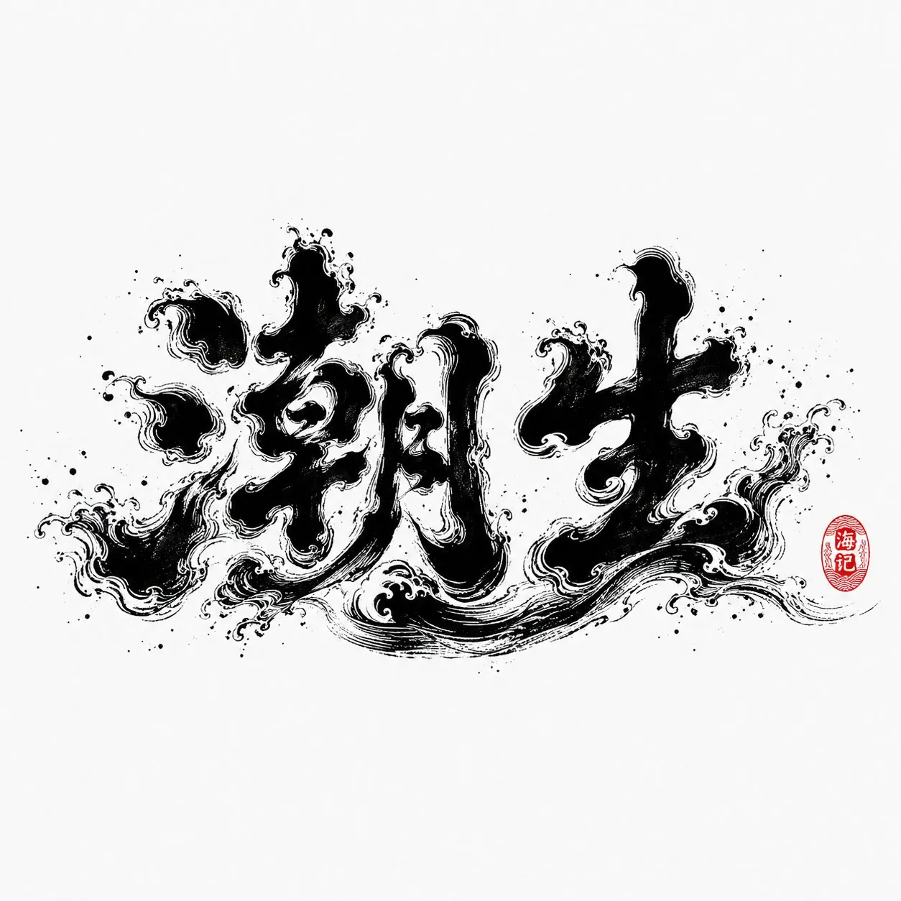 | 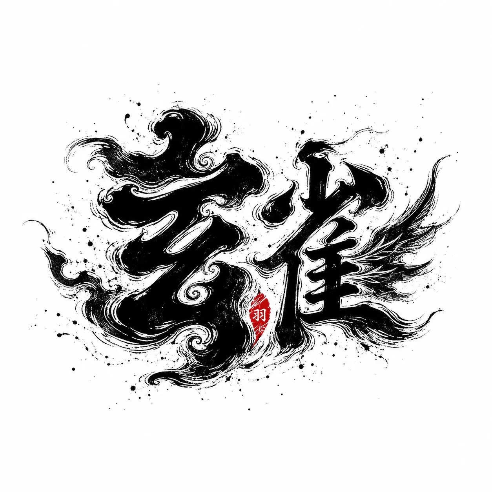 | 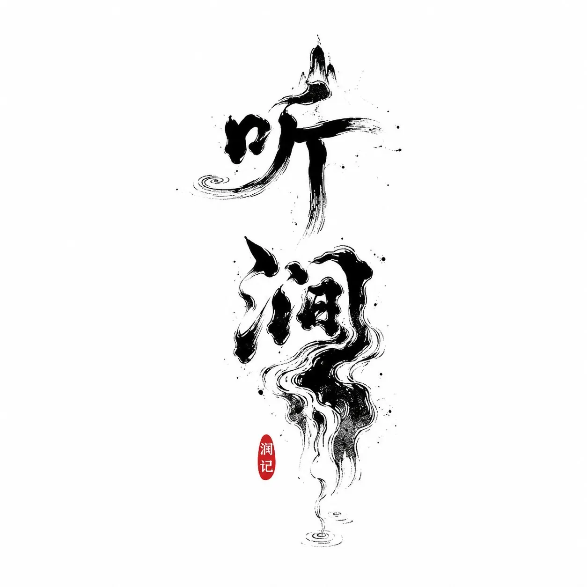 | 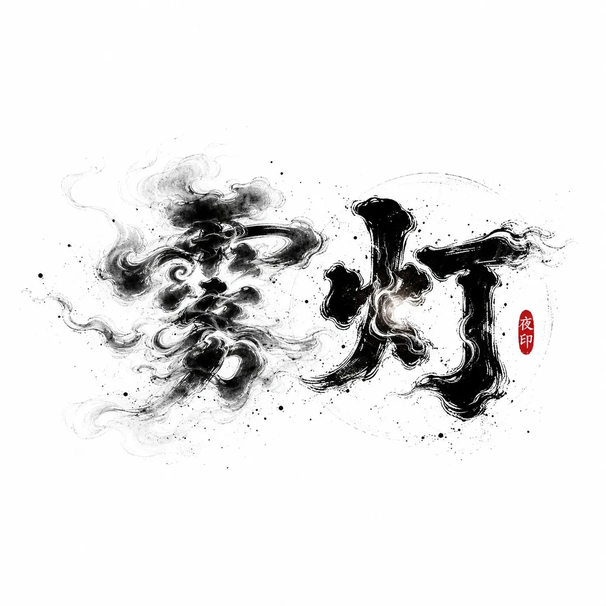 |

《烟墨流体意象字标 》Logo完整提示词：

请根据用户输入的【品牌名 / 项目名】【副标题 / 产品名】【类型 / 行业】【品牌定位】【核心关键词】【情绪气质】【核心意象】【流体语言】【构图方式】【主色调】【辅助色】【画幅比例】，设计一个高完成度的「烟墨流体意象字标 Logo / Ink Smoke Flow Ideographic Wordmark Logo」。

请根据用户输入的【品牌名 / 项目名】【副标题 / 产品名】【类型 / 行业】【品牌定位】【核心关键词】【情绪气质】【核心意象】【流体语言】【构图方式】【主色调】【辅助色】【画幅比例】，设计一个高完成度的「烟墨流体意象字标 Logo / Ink Smoke Flow 意图文字标记 Logo」。

### 用户输入

品牌名 / 项目名：【品牌名 / 项目名】

副标题 / 产品名：【副标题 / 产品名】

类型 / 行业：【类型 / 行业】

品牌定位：【品牌定位】

核心关键词：【核心关键词】

情绪气质：【空灵、神秘、诗性、冷感、妖气、静谧、流动、克制、开阔、东方幻想等】

核心意象：【雾 / 灯 / 涧 / 水 / 羽 / 雀 / 潮 / 山 / 风 / 云 / 香 / 夜 / 波纹等】

流体语言：【烟雾缠绕 / 水脉流动 / 潮汐翻涌 / 羽烟扩散 / 云气聚散 / 微光凝结 / 墨液旋涡】

构图方式：【横向铺展 / 竖向修长 / 紧凑团块 / 上下结构 / 中心聚焦 / 疏朗留白】

主色调：【主色调】

辅助色：【辅助色】

画幅比例：【画幅比例】

### 核心目标

这次要设计的是一个真正具有东方艺术气质的「烟墨流体意象字标 Logo」。它不是普通毛笔字，不是传统书法作品，也不是现代运动毛笔 Logo，而是以中文品牌名为主体，通过烟、墨、水、雾、潮、羽等自然意象，将文字做成一个兼具可读性、意象感、流动感和图像化特征的艺术字标。

最终效果必须首先是一个可以独立成立的字标 Logo，其次才是书法气质与艺术表现。画面应像一个成熟的视觉标志，而不是一张普通海报。

最终效果必须首先是一个可以独立成立的字标 Logo，其次才是书法气质与艺术表现。 画面应像一个成熟的视觉标志，而不是一张普通海报。

### 设计本质

这类 Logo 的重点不是单纯把字写得好看，而是：

用汉字骨架建立识别；

用自然意象驱动字形变化；

用烟墨流体感塑造情绪；

让笔画内部产生纹理和层次；

让字既能被认出，又像一幅由墨气凝成的画面；

让整体具有清晰的 Logo 性质，而不是散乱的艺术涂写。

### 最重要的原则

品牌名必须是绝对主角；

字形必须可辨认，但可以进行高质量艺术化变形；

每个字的变形必须服务于品牌本身的意象与气质，而不是随意扭曲；

不能只是普通毛笔字加喷墨效果；

不能只是抽象图案，必须保留文字识别；

不能做成现代运动感、火焰感或普通国潮标题字；

要有明显留白、呼吸感和艺术展陈感；

红色印章应根据主题定制，不要机械重复。

### 主体字形要求

以中文品牌名为主体；

字形应保留书法骨架，但做明显的流体化、意象化设计；

笔画可以出现缠绕、拖尾、旋涡、留白、分岔、聚散、波纹、羽化等变化；

字与字之间可相互呼应、贯通、叠合、牵引，形成统一整体；

字形不应像标准印刷字体，也不应像传统完整书法作品，而应更像经过设计的东方艺术字标；

整体应达到“第一眼像图形，第二眼能读字”的高级状态。

### 意象驱动要求

请根据品牌主题，把对应意象自然融入字形内部，而不是额外加一个插画图标：

如果主题偏“雾、夜、香、光”，字应更轻、更散、更朦胧，并有聚散与光芯感；

如果主题偏“涧、水、泉、流”，字应更修长、更清、更有水脉和回旋感；

如果主题偏“羽、雀、玄、妖”，字应更冷、更锐、更有羽化边缘和妖气；

如果主题偏“潮、生、海、波”，字应更翻涌、更铺展，具有潮汐推进和生长感；

如果主题偏“山、云、风、雾”，字应更开阔、更呼吸，具有层叠与漂移感。

### 流体纹理要求

请重点表现以下质感：

液态墨迹的流动感；

烟雾般的缠绕感；

内部白色流纹、旋涡纹、波纹状肌理；

局部飞白、干笔、颗粒飞溅；

笔画边缘自然散开，但仍然受控；

黑色主体内部要有层次，不是大面积纯实心黑块；

纹理要细腻、耐看、有意境。

### 构图要求

可根据品牌选择最合适的版式：

横向铺展：适合“潮生、雾灯、玄雀”等较有扩张感的主题；

竖向修长：适合“听涧”这类有山水、题字、卷轴感的主题；

紧凑团块：适合气场更强、更像视觉符号的主题；

疏朗留白：适合空灵、诗性、香气、山水感更强的主题。

整体构图必须有：

清晰主次

足够留白

稳定视觉重心

可独立作为 Logo 展示

### 印章系统要求

红色印章不是固定模板，而要根据主题创新设计：

可做文字章，例如“夜印”“涧记”“海记”“羽朱”等；

可做图形章，例如波纹章、羽形章、水滴章、小灯章；

可做异形章，例如细长竖章、圆章、残边章、椭圆章；

印章位置要服务构图平衡，可嵌入字边、留白处、尾部、下方，不必固定；

印章只能作为点睛，不可压过主字。

### 辅助元素要求

可加入极少量辅助痕迹来增强个性，但必须克制：

小墨点

极轻的波纹残线

微弱环形气迹

少量拖尾

极细小落款感文字

轻微印泥晕染感

禁止加入大量英文副标题、现代编号、现代图标、过强装饰线、复杂背景故事画面。

### 色彩要求

整体以黑白为主；

背景建议白色、米白、浅灰、宣纸白；

主体为墨黑、浓黑、炭黑；

辅助色只建议少量朱红 / 赤红用于印章；

不建议大面积彩色；

高级感应来自墨韵、构图和字形，而不是丰富配色。

### 画面呈现要求

像独立的艺术字标展示图；

主体清晰、完整、集中；

细节丰富但不过度杂乱；

黑白对比强烈；

留白充足；

整体像“一个能成立的东方艺术 Logo”；

不能像普通海报、普通字体练习或普通书法作品。

### 明确禁止

请严格避免以下问题：

不要做成普通毛笔字；

不要做成传统书法作品排版；

不要做成现代运动毛笔 Logo；

不要做成海报标题字；

不要过度抽象到无法辨认；

不要只靠喷墨、墨点制造效果；

不要所有作品都长得一模一样；

不要让印章始终是同一种方章模板；

不要让字形变形与品牌意象无关；

不要廉价、脏乱、失控。

### 风格关键词

烟墨流体意象字标、Ink Smoke Flow Ideographic Wordmark Logo、东方艺术字标、液态墨迹、烟雾流线、流体书法、意象汉字、图像化字标、黑白强对比、红印点睛、艺术展陈感、自然意象驱动。

### 验收标准

请确保最终结果满足：

一眼看出是汉字字标；

第二眼能感受到对应的自然意象；

字与意象之间有内在关系；

黑白主调统一，红印章点睛恰当；

既像字，也像图，也像标志；

每张都有独特的“第二语言”，而不是同一模板换词；

最终能够作为一个独立的东方艺术 Logo 成立。

### 输出要求

请最终输出一个高完成度的「烟墨流体意象字标 Logo」，它必须以中文品牌名为核心，通过烟墨流动、意象融合、书法骨架、纹理层次和定制印章，形成一个兼具识别性、艺术性、气质感与系列辨识度的视觉标志。

## 治愈手绘字标

| 预览 | 预览 | 预览 | 预览 |
| --- | --- | --- | --- |
| 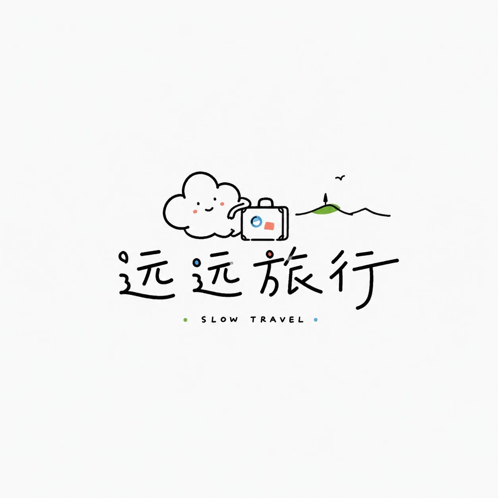 | 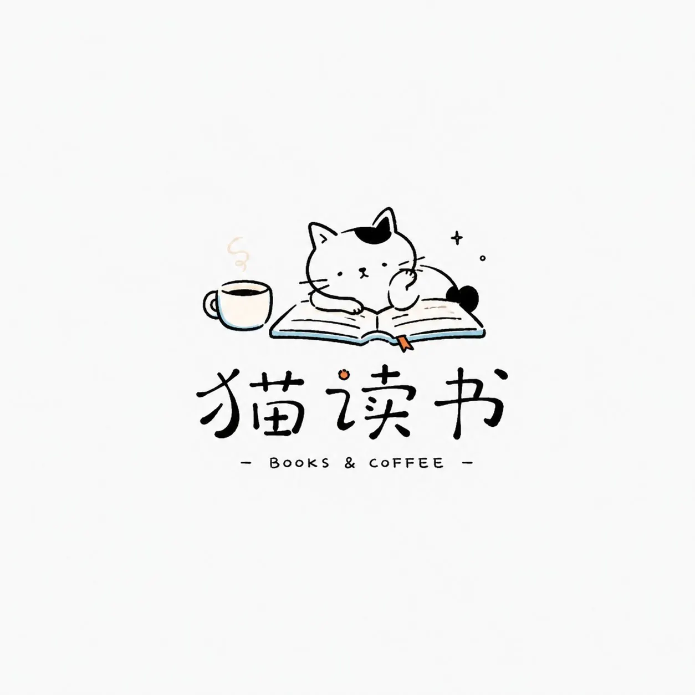 | 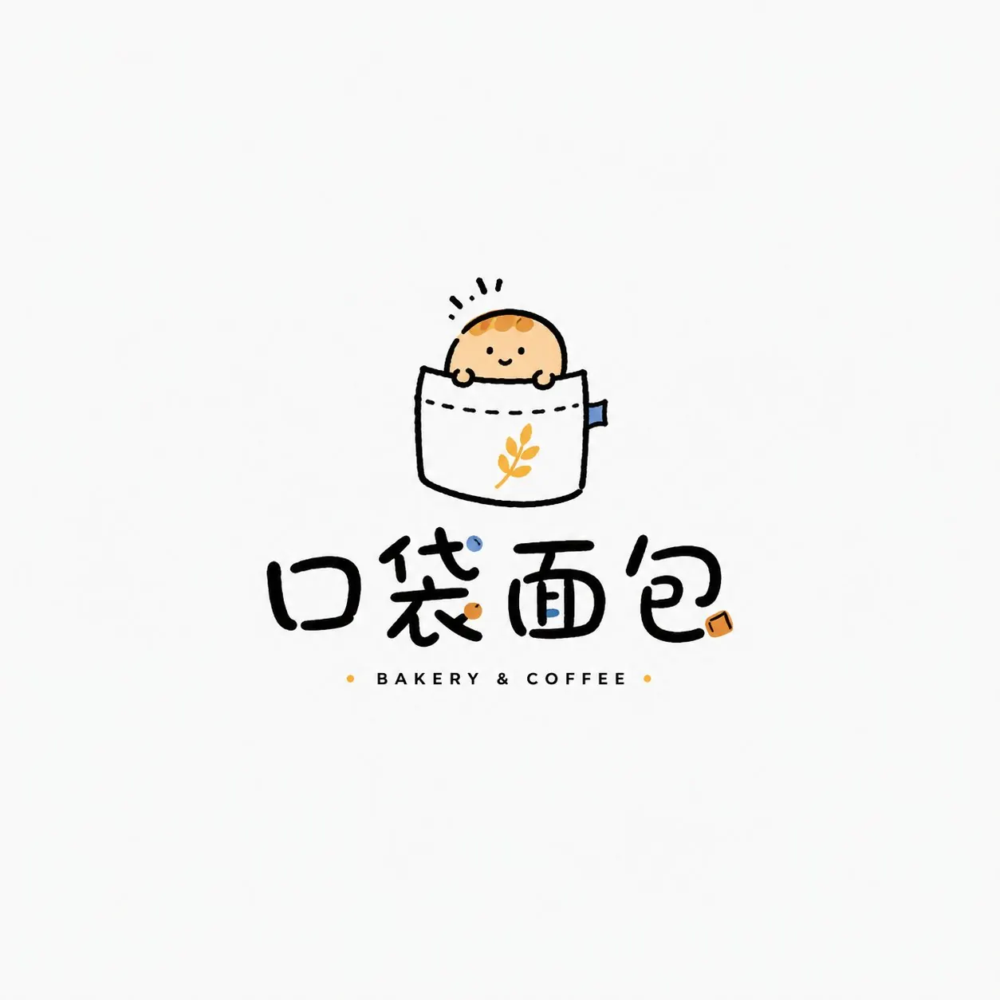 | 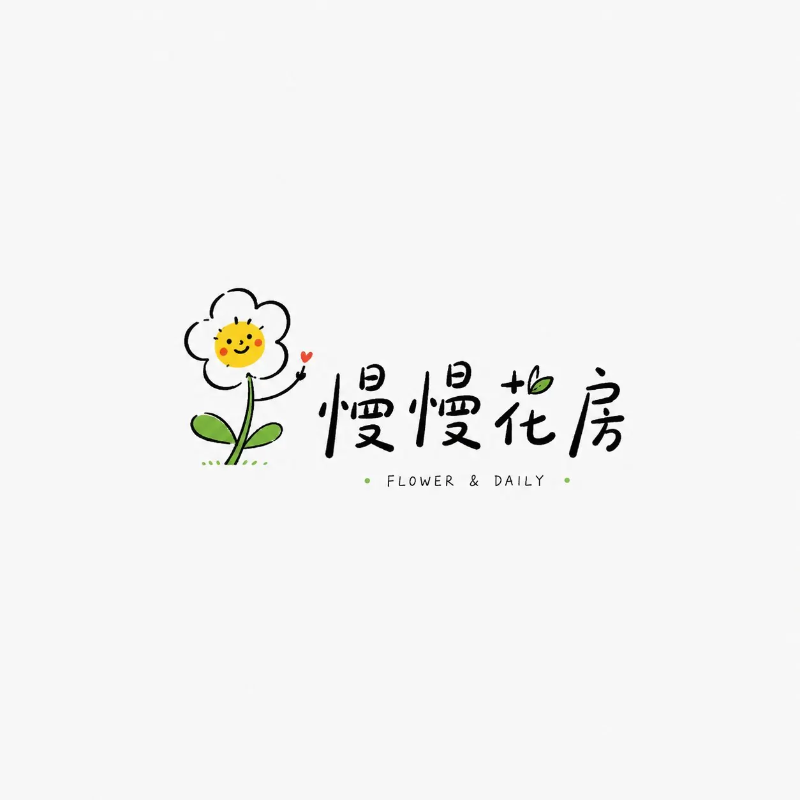 |

《治愈系手绘趣味字标》Logo提示词：

请根据用户输入的【品牌名 / 项目名】【副标题 / 产品名】【类型 / 行业】【品牌定位】【核心意象】【角色 / 图形设定】【情绪气质】【主色调】【辅助色】【画幅比例】，设计一个高完成度的「治愈系手绘趣味字标 Logo / Healing Hand-drawn Playful Wordmark Logo」。

### 用户输入

品牌名 / 项目名：【品牌名 / 项目名】

副标题 / 产品名：【副标题 / 产品名】

类型 / 行业：【咖啡 / 面包 / 花艺 / 书店 / 杂货 / 民宿 / 旅行 / 文创 / 家居 / 选物店 / 儿童品牌 / 生活方式品牌等】

品牌定位：【品牌定位】

核心意象：【花 / 鸟 / 猫 / 云 / 太阳 / 面包 / 书 / 手 / 小怪物 / 杯子 / 气球 / 家居小物等】

角色 / 图形设定：【一个轻手绘小角色 / 小物件 / 小图形 / 拟人化意象】

情绪气质：【治愈、松弛、温柔、可爱、发呆、幽默、小浪漫、轻怪趣、生活感等】

主色调：【主色调】

辅助色：【辅助色】

画幅比例：【画幅比例】

### 核心目标

这次要设计的是一个「治愈系手绘趣味字标 Logo」。它不是商业感很重的品牌徽章，也不是高饱和潮玩 IP，不是复杂卡通插画，而是以一个轻巧、有记忆点的小手绘图形为核心，搭配松弛的品牌字标和少量英文 / 小标注，形成一个适合小众品牌、主理人小店、生活方式品牌和文创品牌使用的轻量 Logo。

最终效果应当轻松、干净、有呼吸感、有好感，像一个真实独立小店或生活品牌可以直接使用的 Logo。

### 设计本质

这类 Logo 的重点不是做得复杂，而是做得有情绪、有巧思、有亲和力：

用一个小手绘意象建立第一记忆点；

用松弛自然的字标建立品牌识别；

用大量留白建立轻盈感；

用少量亮色点缀建立温度；

用不完美但有控制的线条建立手绘感；

整体传达治愈、松弛、小众、有生活气息的品牌调性。

### 最重要的原则

图形要简单，但必须有巧思；

文字要轻松自然，不能像普通系统字体直接打字；

整体要有 Logo 性质，不能只是插画；

留白要多，画面不要塞满；

配色要克制，通常以黑色线条为主，搭配 1～2 个点缀色；

风格要松弛，但不能粗糙；

不能低幼，不能像儿童涂鸦，也不能像普通表情包；

要有独立品牌、小店、主理人品牌的审美气质。

### 图形 / 角色要求

请围绕【核心意象】设计一个轻手绘的小图形或小角色。

图形要求：

轮廓简洁，线条轻松；

不追求精密矢量感，允许轻微手绘不规则；

表情或动作要有记忆点；

图形不要太大，不要压过文字；

可以带一点拟人化、幽默感或生活气息；

不要画成复杂插画，不要做成厚重吉祥物。

### 字标要求

品牌名 / 项目名必须清晰可读；

字标应有轻手写感、松弛感、独立小店感；

可以是中文、英文或中英混排；

字距、大小、位置可以略有变化，形成自然节奏；

可以加入少量英文小字、拼音、小 slogan、年份、符号；

文字不能太工业化、太严肃、太厚重；

文字要像和图形一起被设计出来，而不是后期随便打上去。

### 构图要求

整体构图应轻盈、有呼吸感：

图形可以在字标上方、旁边、穿插在字中，或与文字形成小互动；

保持大量留白；

主体不要过满，不要复杂背景；

可以加入极少量小点、短线、弧线、小星星、小手写标注；

整体应像一个独立 Logo，而不是海报或贴纸集合。

### 色彩要求

整体色彩应克制、清爽、有好感：

通常以黑色线稿为主体；

搭配 1～2 个小面积点缀色；

可使用浅黄、天蓝、草绿、番茄红、淡粉、橙色、薄荷绿等；

点缀色要小而准，不要大面积铺满；

避免厚重渐变、复杂阴影、高饱和满版配色；

颜色应像“轻轻点一下”，而不是强行制造冲击。

### 质感要求

线条有手绘感；

形状略带稚拙但可控；

整体干净；

可以有少量不规则笔触；

不要太精密，不要太商业模板化；

不要过度粗糙或凌乱。

### 风格关键词

治愈系手绘趣味字标 Logo、Healing Hand-drawn Playful Wordmark Logo、松弛感手绘图文 Logo、独立小店 Logo、生活方式品牌 Logo、轻手绘、小意象、童趣但不低幼、治愈、可爱、松弛、留白、少量点缀色、手写字标。

### 验收标准

请确保最终结果满足：

图形简单但有巧思；

品牌名清晰可读；

整体有手绘松弛感；

留白充足；

配色克制但有记忆点；

不低幼、不杂乱、不商业模板化；

像真实小众品牌可以使用的 Logo；

具备治愈、趣味、生活方式气质。

### 输出要求

请最终输出一个高完成度的「治愈系手绘趣味字标 Logo」。它必须以轻手绘图形为核心识别，以松弛字标为辅助结构，以少量点缀色和大量留白形成清爽、可爱、治愈、有生活感的品牌标志。

## 日式扁平化动物品牌 LOGO

| 预览 | 预览 | 预览 | 预览 |
| --- | --- | --- | --- |
| 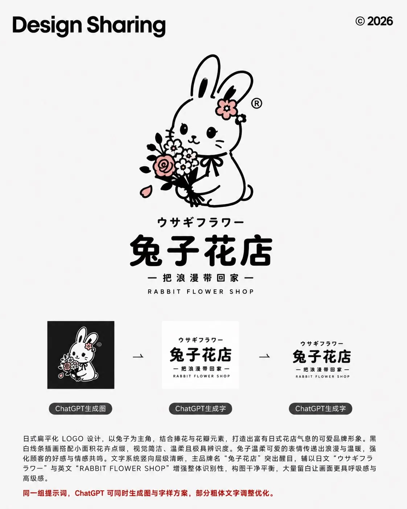 | 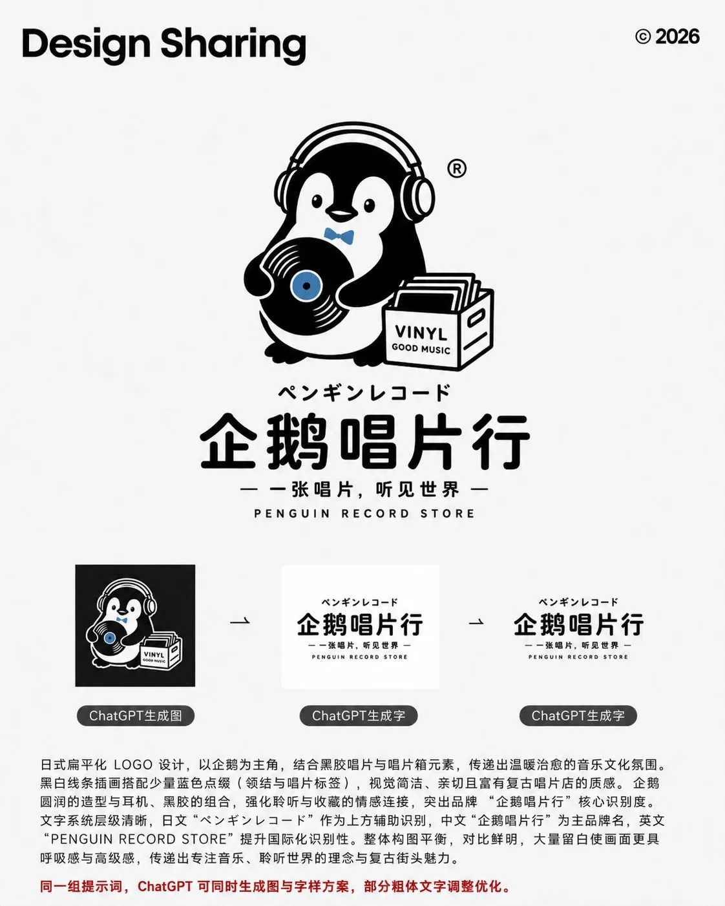 | 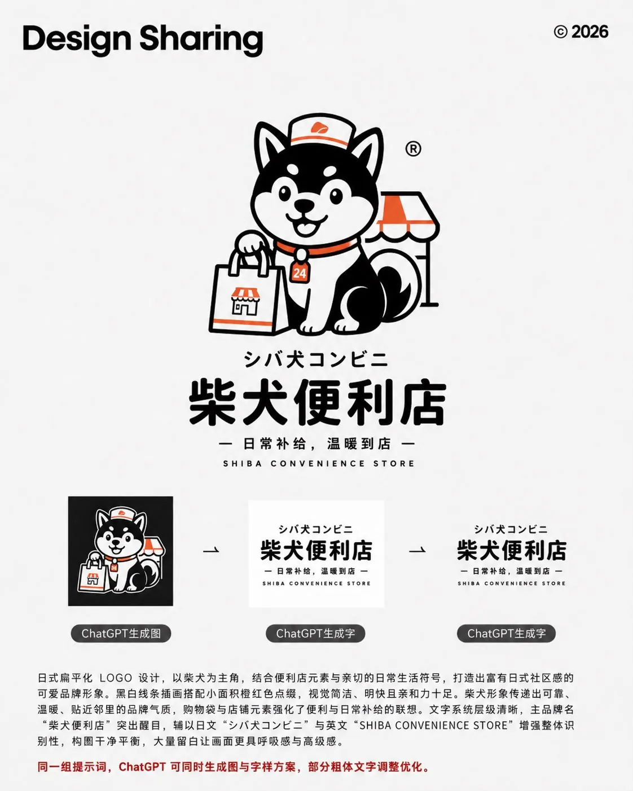 | 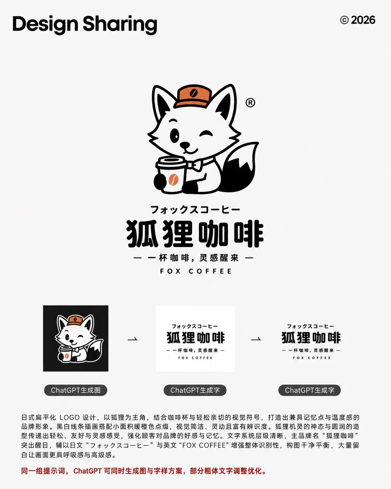 |

提示词：

生成一张 日式扁平化动物品牌 LOGO 设计解析海报，画面为竖版社交媒体设计分享版式，整体干净、高级、留白充足，适合发 X / 小红书 / 设计分享平台。

海报顶部左侧写大标题：

Design Sharing

设计共享

右上角写：

© 2026

© 2026年

整体背景为浅灰白色纸感背景，带轻微颗粒质感和柔和阴影，版面简洁、现代、干净。

⸻

主视觉 LOGO

画面上半部分居中展示一个可爱动物品牌 LOGO，采用 日式扁平化插画风格 / 黑白粗线条 / 极简卡通吉祥物 / 小动物品牌形象设计。

主体为：

【动物名称：狐狸 / 柴犬 / 企鹅 / 兔子 / 鳄鱼 / 猫咪 / 章鱼 / 鸭子 / 熊猫 / 老虎 / 小熊 / 小鹿】

品牌类型为：

【咖啡店 / 便利店 / 唱片行 / 花店 / 汉堡店 / 书房 / 酒馆 / 面包铺 / 拉面店 / 甜品店 / 茶屋】

动物需要结合品牌行业元素，例如：

咖啡店：动物拿着咖啡杯，戴小店员帽

便利店：动物拿购物袋，身后有小店铺图标

唱片行：动物戴耳机，拿黑胶唱片

花店：动物抱着花束，旁边有花瓣

汉堡店：动物抱着汉堡，戴棒球帽

书房：动物戴眼镜，趴在书本旁

酒馆：动物拿酒杯或酒瓶，有轻松微醺感

面包铺：动物戴厨师帽，抱着面包

拉面店：动物端着拉面碗，戴日式头巾

LOGO 风格要求：

黑白线条为主，线条圆润粗实，造型可爱但不幼稚，局部加入少量品牌主题色点缀，例如橙色、蓝色、粉色、红色、黄色或深绿色。整体视觉要像真实品牌吉祥物 LOGO，简洁、亲切、易识别。

LOGO 右侧可加入一个小的 ® 符号。

⸻

品牌文字系统

LOGO 下方居中排版三层文字：

第一层：日文片假名小字

### 品牌日文名，例如：フォックスコーヒー / シバ犬コンビニ / ペンギンレコード

第一层：日语片假名小字符

[日本品牌名，例如：Fox Coffee / Shiba Inu 便利店 / 企鹅唱片]

第二层：中文主品牌名，使用粗黑圆润字体

### 中文品牌名，例如：狐狸咖啡 / 柴犬便利店 / 企鹅唱片行 / 兔子花店

第三层：中文 slogan，小字横排，两侧短横线装饰

### 一句品牌标语，例如：一杯咖啡，灵感醒来 / 日常补给，温暖到店 / 一张唱片，听见世界

第四层：英文品牌名，字母间距加大

【英文名，例如：FOX COFFEE / SHIBA CONVENIENCE STORE / PENGUIN RECORD STORE】

文字排版要求：

层级清晰，黑白对比强，中文主标题醒目，日文和英文作为辅助识别信息，整体具有日式品牌视觉系统感。

⸻

中部流程展示

海报中下部横向展示三步流程：

左侧：黑底方形卡片，展示完整动物 LOGO 图标

下方灰色圆角标签写：ChatGPT生成图

中间：白底方形卡片，展示品牌文字组合

下方灰色圆角标签写：ChatGPT生成字

中间：白底方形卡片，展示品牌文字组合

下方灰色圆角标签写：ChatGPT 生成字

右侧：最终文字方案展示

下方灰色圆角标签写：ChatGPT生成字

三者之间用细黑箭头连接，表现从图形生成到字体方案优化的设计流程。

⸻

## 底部品牌解析文字

海报底部放置一段中文设计解析，黑色小字，排版整齐：

日式扁平化 LOGO 设计，以【动物名称】为主角，结合【行业元素】与【品牌场景元素】，打造出富有日式【行业氛围】的可爱品牌形象。黑白线条勾勒出【动物特征】与【动作特点】，搭配【主题色】点缀，视觉简洁、亲切且具有识别度。

【动物】的造型传递出【品牌情绪：温暖 / 松弛 / 治愈 / 快乐 / 复古 / 安静 / 俏皮】的品牌气质，强化顾客的好感与记忆点。文字系统层级清晰，主品牌名“【中文品牌名】”突出醒目，辅以日文“【日文名】”与英文“【英文名】”增强整体识别性与国际感。整体构图干净平衡，大量留白让画面更具呼吸感与高级感，适合用于门店招牌、包装、社交媒体、贴纸和品牌物料延展。

底部最后一行红色加粗文字：

同一组提示词，ChatGPT 可同时生成图与字样方案，部分粗体文字调整优化。

## ⸻

## 画面风格关键词

Japanese flat logo design，cute animal mascot logo，minimal black and white line art，bold rounded typography，brand identity poster，design sharing layout，clean editorial poster，large white space，soft paper texture，2026 design presentation，ChatGPT generated image and typography workflow，cute commercial mascot branding，Japanese bakery coffee shop visual identity，high-end minimal layout，social media design poster

## 东方侘寂意象 Logo

| 预览 | 预览 | 预览 | 预览 |
| --- | --- | --- | --- |
| 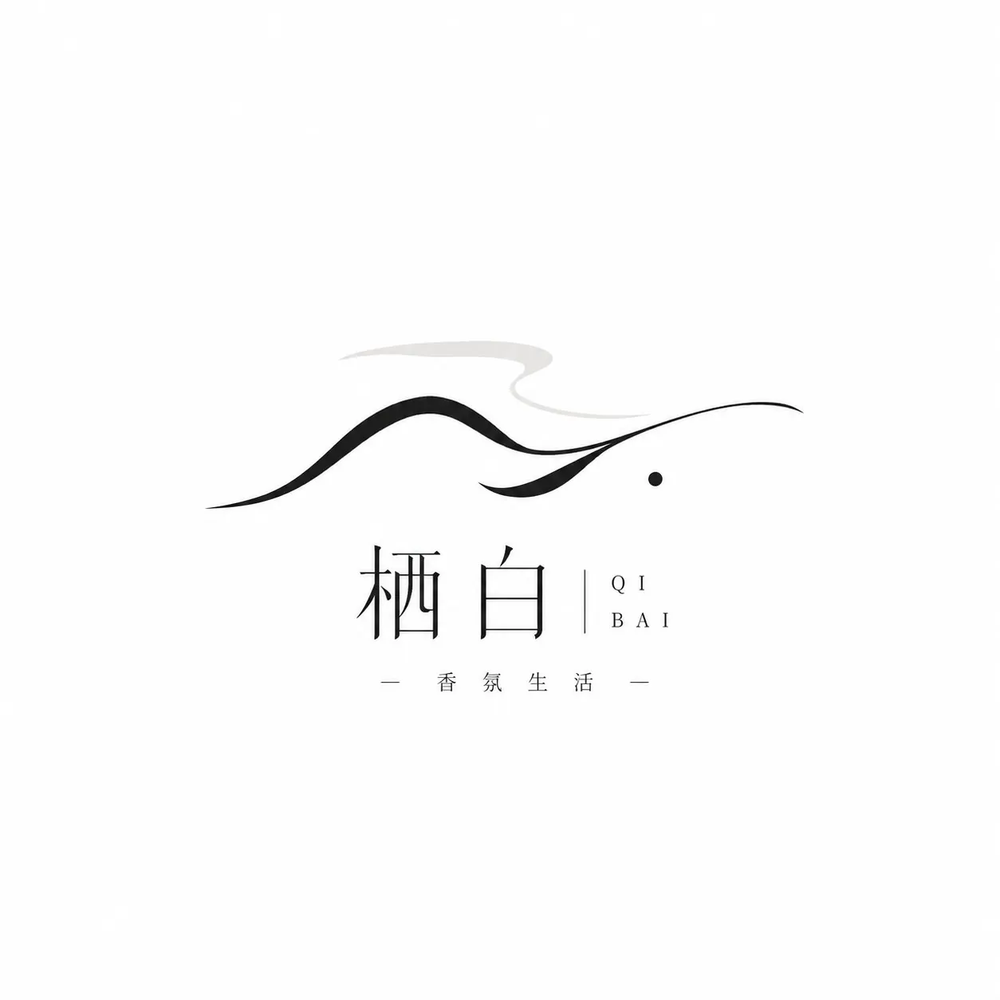 | 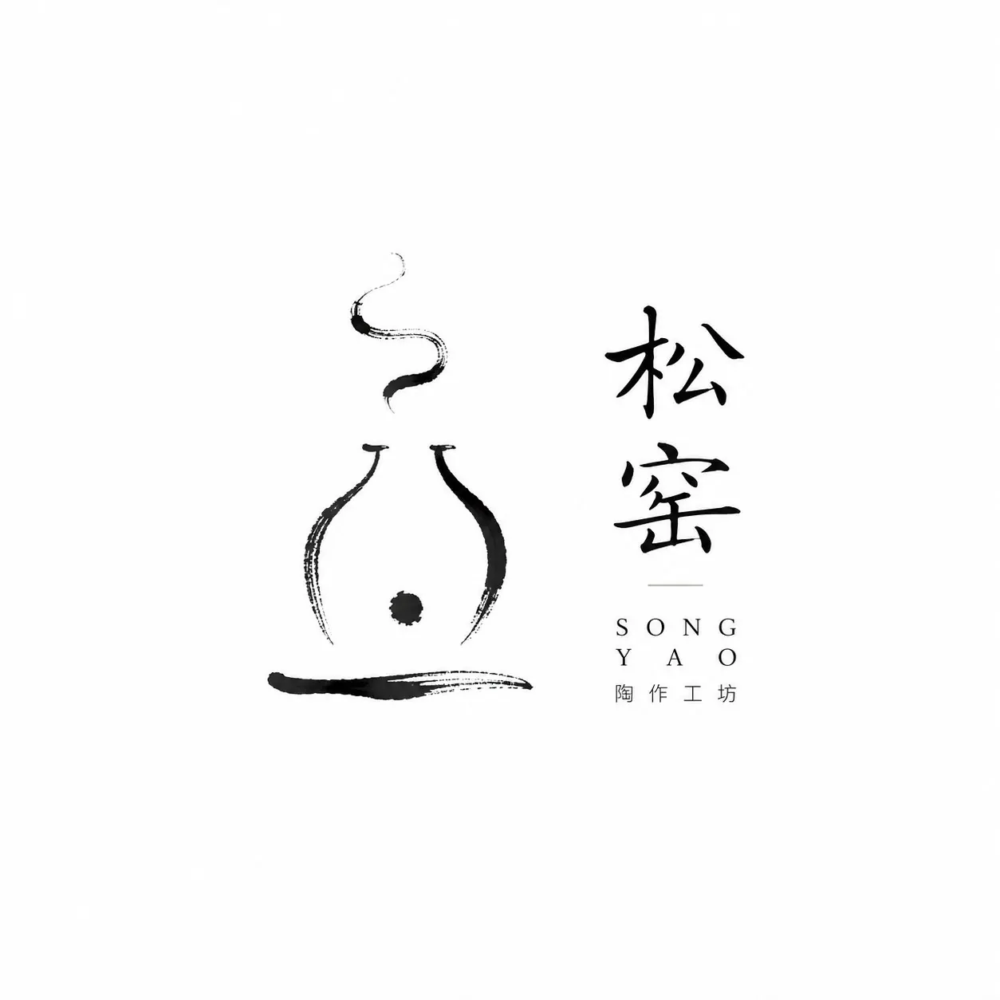 | 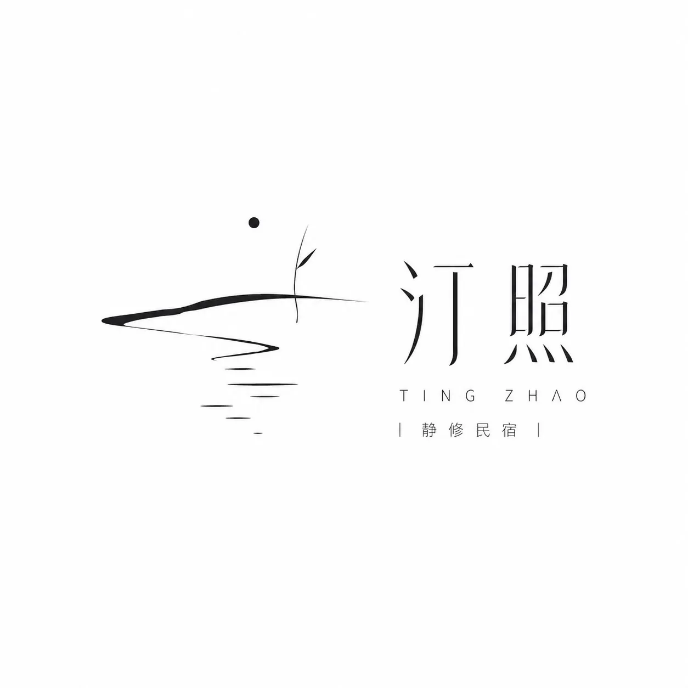 | 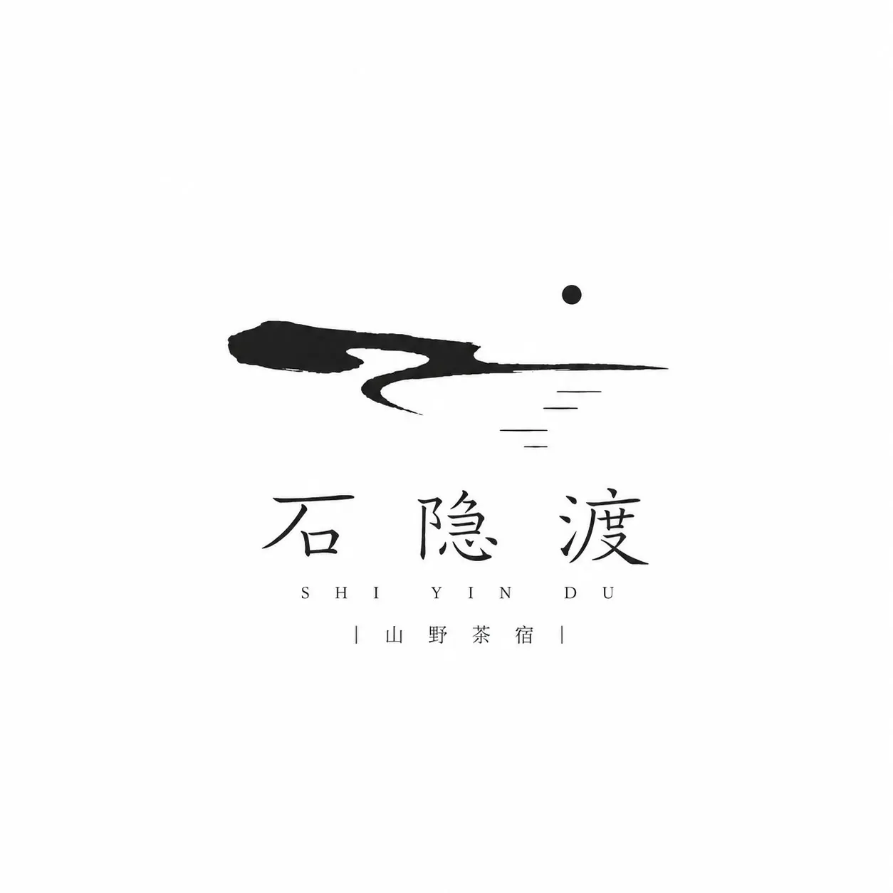 |

《东方侘寂意象》Logo提示词：

请生成一张「东方侘寂意象 Logo」风格的品牌标识图。

这类 Logo 的核心不是复杂装饰，也不是普通企业图标，而是用极少的笔触、极大的留白、东方自然意象和有设计感的中文文字，形成一个安静、克制、雅致、有余味的品牌标识。

### 品牌信息

品牌名：{{品牌名}}

副标题：{{副标题 / 行业说明}}

行业类型：{{茶空间 / 民宿 / 陶作 / 香氛 / 器物 / 文创 / 东方生活方式品牌等}}

品牌定位：{{品牌定位}}

核心关键词：{{关键词1、关键词2、关键词3}}

核心意象：{{山、水、月、岸、石、雾、香气、器物、陶痕、松烟、留白、风痕等}}

画幅比例：1:1

背景：纯白色背景

### 风格定位

请设计一枚具有「东方侘寂意象 Logo」气质的品牌标识。

整体要安静、克制、留白、诗意、疏朗、有东方气韵。不要热闹，不要满版，不要廉价新中式，不要做成传统厚重牌匾，也不要做成复杂插画。

### 图形要求

图形必须高度概括，用极少笔触表达品牌意象。

可以从山、水、岸、石、月、雾、香气、器物、陶痕、松烟等东方自然或生活意象中提炼符号。

图形不要太具象，不要画完整山水画、完整器物或复杂场景。

可以使用干笔、断笔、墨痕、细线、留白、点、弧线、残缺面等方式形成意境。

图形要有原创性，不能直接复制任何参考图中的图案、山形、水线、月亮、竹子或器物轮廓。

图形应像品牌符号，而不是装饰画或插画。

### 文字要求

中文品牌名必须是视觉核心之一，不能只是普通字体打字。

中文字标要有设计感，可以进行轻度字形变体、笔画简化、疏密变化、局部留白、细微断笔或结构重组。

文字要清晰可读，但不能太常规、太系统字体、太普通。

拼音 / 英文 / 副标题可以作为辅助小字，要求轻、细、疏、克制，字距适当拉开。

文字与图形要互相借意，不能只是“上面一个图案，下面打一行字”的机械拼接。

可以让某些笔画呼应水线、岸线、月影、烟气、器物轮廓或风痕。

### 构图要求

大量留白，主体不要撑满画面。

构图可以是非对称、上下错落、左右疏朗、图文分散排布，但整体必须平衡。

图形、主标题、副标题之间要有呼吸感。

整体像高级东方生活方式品牌 Logo，而不是海报、插画或普通书法字。

### 色彩要求

以黑、墨黑、深灰、炭灰为主。

背景必须纯白色。

可以有极少量浅灰墨痕，但不要使用大面积彩色。

不要渐变，不要高饱和配色，不要花哨。

### 适用气质

适合茶空间、山野茶宿、静修民宿、陶作工坊、东方香氛、器物店、文创品牌、东方生活方式品牌。

### 避免事项

请避免：

普通企业 Logo 感

厚重书法牌匾感

复杂国画插画

廉价新中式

图案照抄参考图

字体过于常规

文字和图形机械拼接

画面太满

装饰过多

彩色太重

### 最终目标

输出一张纯白背景上的高审美东方侘寂意象 Logo。它应该同时具备：极简笔触、东方意境、留白美学、文字设计感、品牌识别度和真实可用性。

## 现代几何企业字标Logo

| 预览 | 预览 | 预览 | 预览 |
| --- | --- | --- | --- |
| 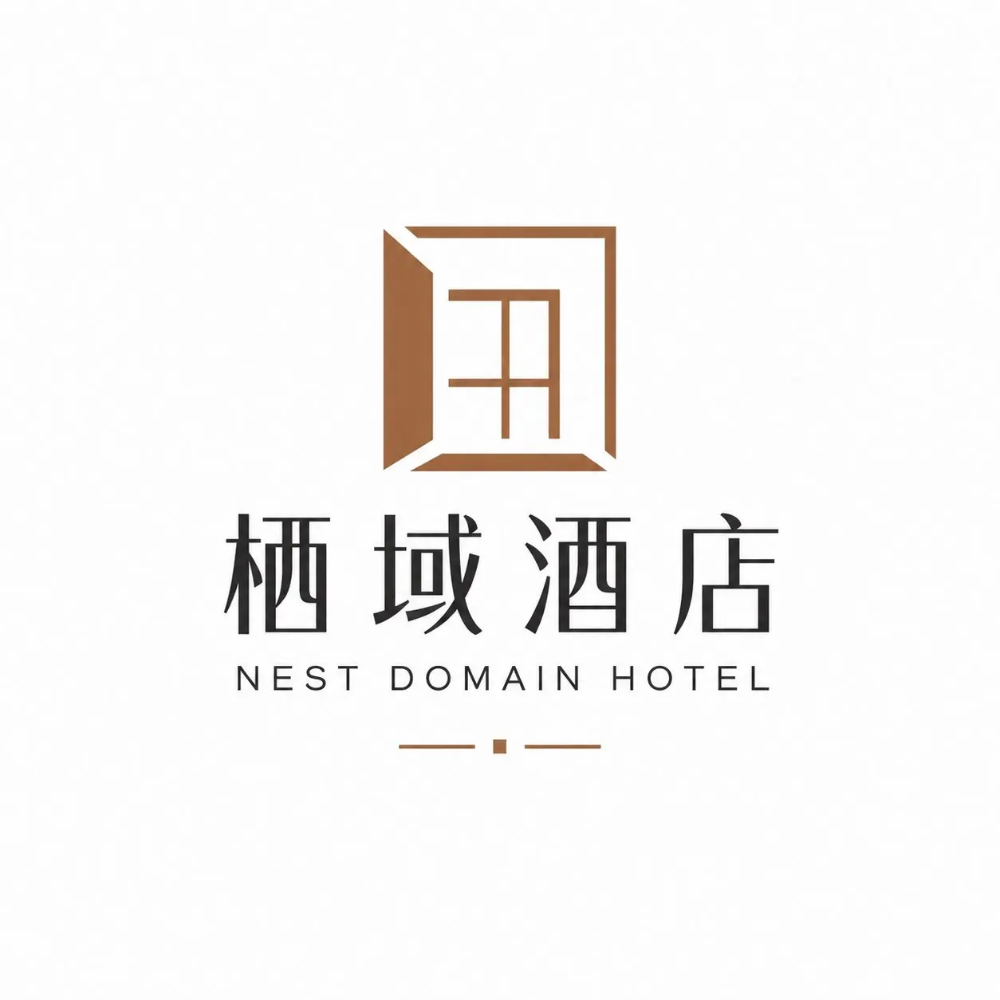 | 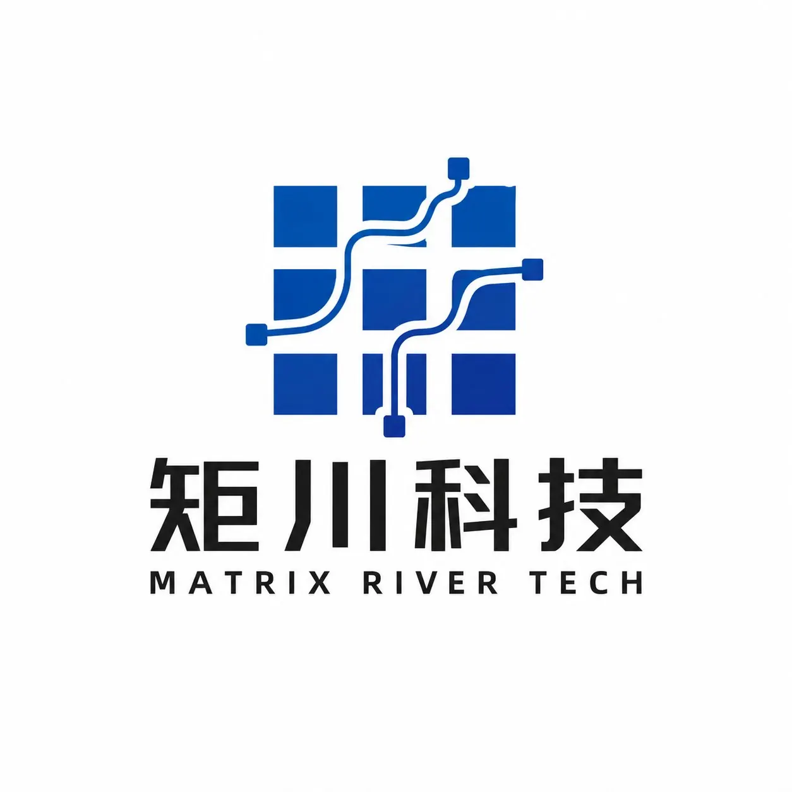 | 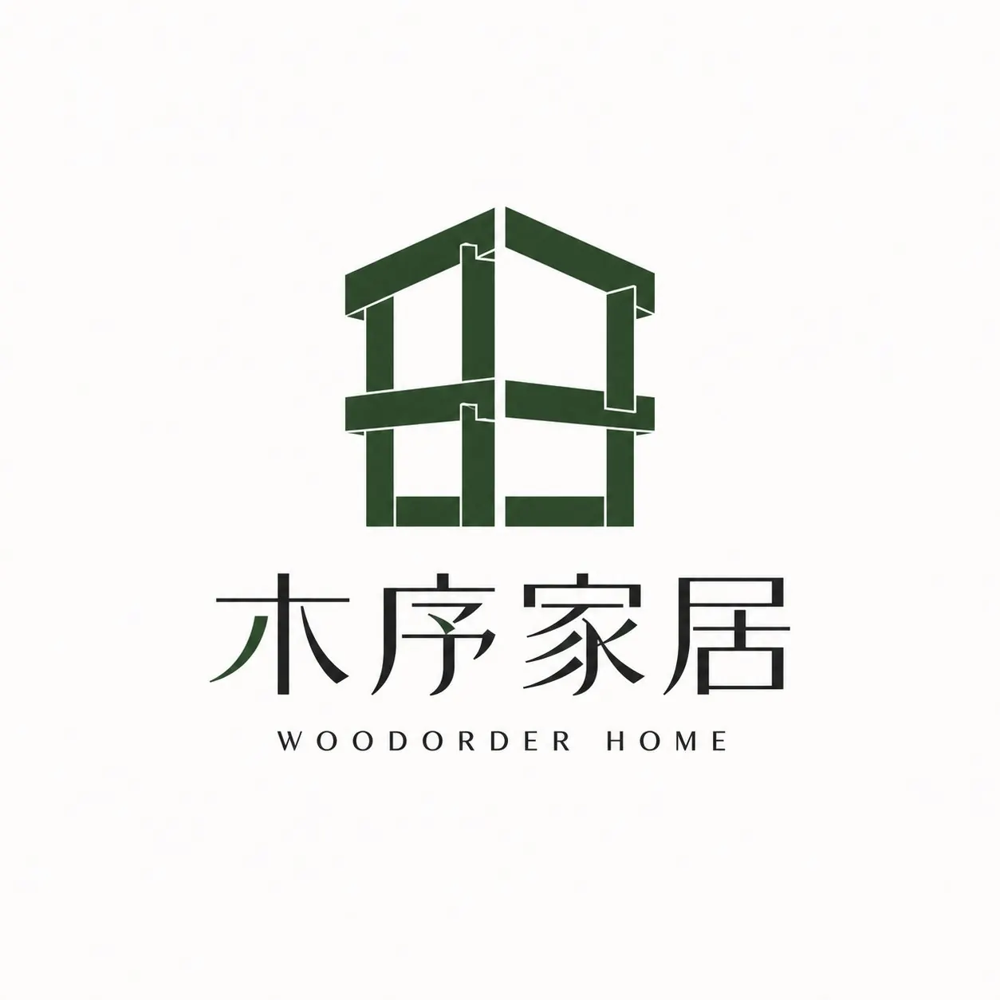 |  |

《现代几何企业字标》Logo提示词：

请根据以下用户输入，创作一款高完成度的「现代几何企业字标 Logo / Modular Geometric Corporate Wordmark Logo」。

### 用户输入

品牌名 / 项目名：【填写】

英文名 / 英文辅助名：【填写】

副标题 / 行业说明：【填写】

类型 / 行业：【科技 / 传媒 / 家具 / 酒店 / 建筑 / 咨询 / 教育 / 影像 / 空间 / 制造 / 商业服务等】

品牌定位：【填写】

核心关键词：【填写，例如：秩序 / 模块 / 连接 / 稳定 / 空间 / 结构 / 专业 / 现代 / 系统化 / 品质】

核心图形意象：【填写，例如：窗格 / 方块 / 矩阵 / 榫卯 / 门框 / 晶体 / 框架 / 波形 / 节点 / 交织线条 / 网格 / 层叠结构】

主色调：【填写，例如：深蓝 / 墨绿 / 炭黑 / 棕金 / 青灰 / 橙红】

辅助色：【填写，可选】

画幅比例：【1:1】

### 创作目标

生成一款现代、专业、企业级的几何字标 Logo。整体应体现“结构清晰、识别稳定、现代简洁、可商业落地”的特征。不是手绘插画风，不是可爱卡通风，不是复古徽章风，也不是过于艺术化的观念海报式 Logo。

### 核心要求

Logo 必须由“几何符号 + 中英文字标”构成，形成完整的品牌识别系统。

核心符号要具有明显的几何结构感，可由方形、圆形、菱形、线条、网格、模块拼接、对称构成、负形关系等方式生成。

几何符号应尽量与品牌行业或关键词形成抽象关联，不要做成无意义的普通图标。

图形需要简洁、稳定、现代，具有企业级品牌感，适合用于真实商业项目。

品牌中文名与英文名的排版要专业、协调，形成一个完整的 Logo 组合。

可以加入少量副标题、行业说明、年份、slogan 小字，但只能作为辅助信息，不能喧宾夺主。

整体版式可采用“图形在上文字在下”或“图形在左文字在右”的现代企业标志结构。

配色应克制，建议 1 个主色 + 黑灰文字，或单色系统，不要花哨。

画面要干净，突出 Logo 本体，不要做成海报，不要加入复杂场景。

最终效果要像一款真实可落地的企业基础标志，适合延展为 VI 系统。

### 风格方向

整体风格偏：

现代几何

企业品牌感

模块化构成

结构化图形

中英组合字标

专业、稳重、清晰、易识别

可用于科技、空间、酒店、家居、传媒、咨询等行业

### 可参考的设计语言

模块重复

对称构成

几何抽象

负形利用

网格逻辑

建筑感 / 结构感

简练字标排版

企业级标识系统

### 输出要求

输出一张高质量的 Logo 图，背景干净简洁，突出核心 Logo 本体。Logo 应具备企业级专业感、几何识别性和真实品牌落地价值。

## 观念叙事型极简 Logo

| 预览 | 预览 | 预览 | 预览 |
| --- | --- | --- | --- |
| 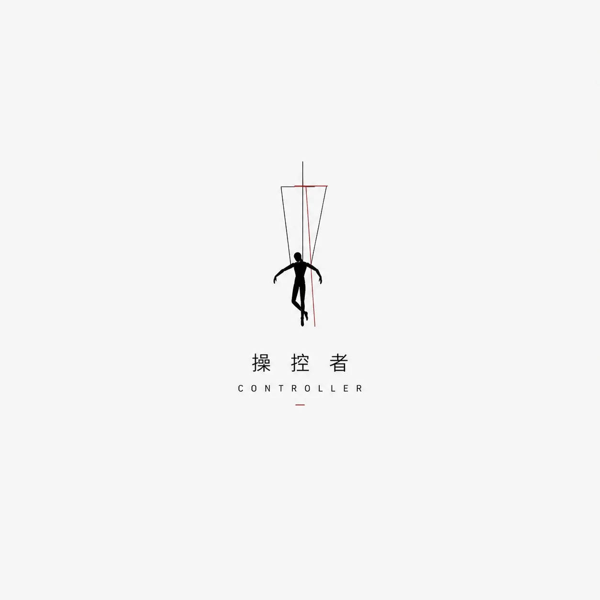 | 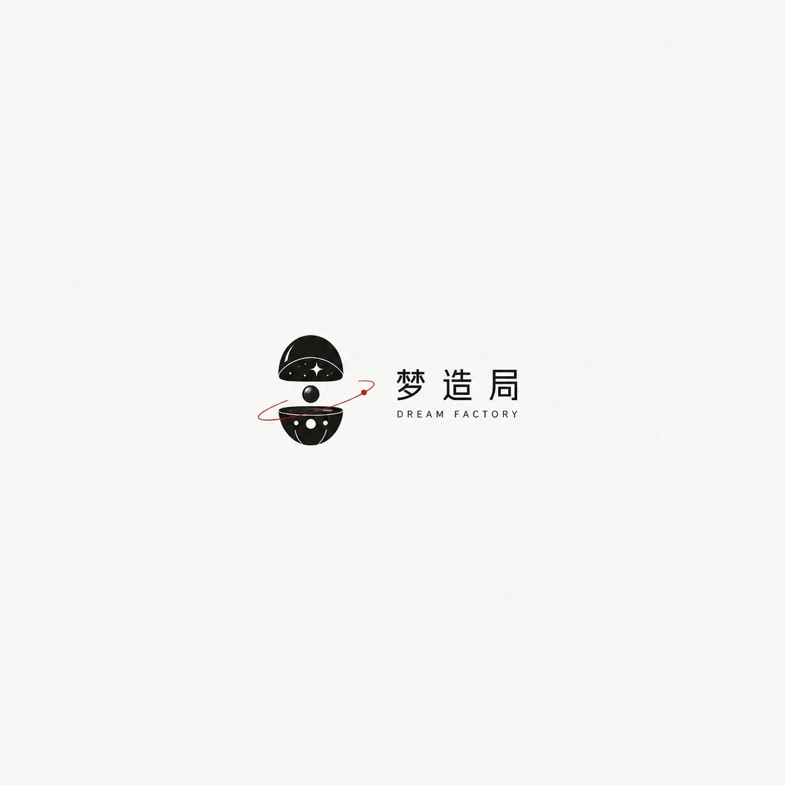 | 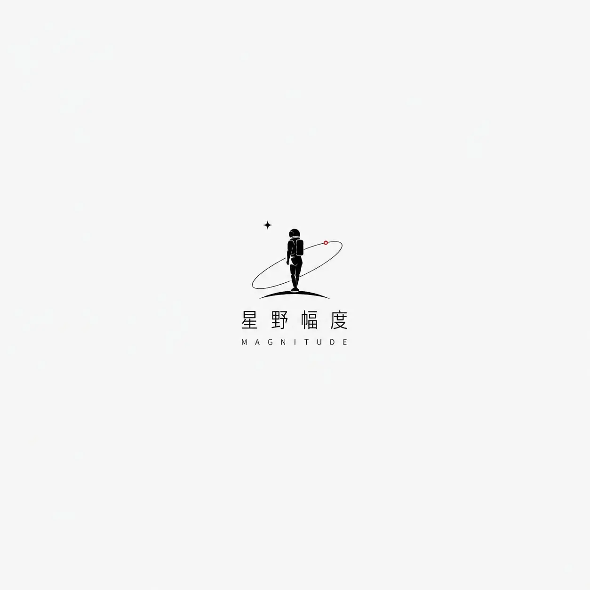 | 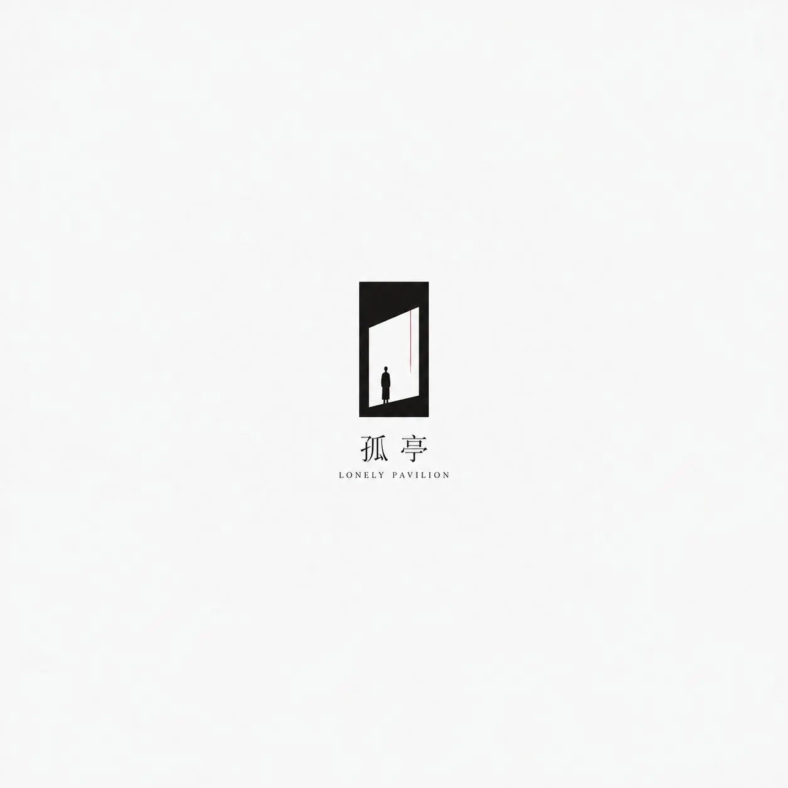 |

《观念叙事型》极简Logo提示词：

请根据用户输入的信息设计一个高完成度的「观念叙事型极简 Logo」。

### 用户输入

品牌名 / 项目名：【品牌名 / 项目名】

副标题 / 产品名：【副标题 / 产品名】

类型 / 行业：【设计工作室 / 影像工作室 / 创意厂牌 / 艺术展览 / 独立服饰 / 音乐品牌 / 建筑空间 / 创意出版 / 文化项目 / 小众品牌等】

品牌定位：【品牌定位】

核心概念：【梦境 / 控制 / 距离 / 孤独 / 探索 / 未来 / 想象 / 对话 / 结构 / 自由 / 叙事 / 精神性等】

隐喻意象：【宇航员 / 兔耳朵 / 剪影 / 木偶 / 手 / 盒子 / 星球 / 门 / 眼睛 / 绳线 / 月亮 / 装置 / 几何结构 / 人物与空间关系等】

情绪气质：【克制、冷静、先锋、神秘、实验、疏离、艺术感、诗性、理性、未来感等】

主色调：【黑 / 白 / 灰 / 深褐 / 墨黑等】

辅助色：【少量红色 / 暗红 / 极少量强调色】

画幅比例：【1:1】

### 核心目标

这次要设计的不是普通企业 Logo，也不是单纯图形标，而是一个具有“观念表达、叙事张力和极简气质”的品牌标志。它需要通过极少的元素，传达一个概念、一种情绪、一段隐喻关系，形成一个像“小型视觉作品”一样的 Logo。

### 核心目标

这次要设计的不是普通企业 Logo，也不是单纯图形标，而是一个具有“观念表达、叙事张力和极简气质”的品牌标志。 它需要通过极少的元素，传达一个概念、一种情绪、一段隐喻关系，形成一个像“小型视觉作品”一样的 Logo。

最终效果应当具备：

极简但不空洞；

留白很多但不单薄；

图形很少但有意味；

文字克制但有设计感；

整体像独立设计师品牌、创意工作室或艺术项目的识别符号。

### 设计本质

这类 Logo 的核心不是直接“说明品牌做什么”，而是通过图形隐喻、场景关系和视觉诗意，去间接表达品牌的精神气质。

请优先考虑：

一个图形是否有观念；

图形与文字之间是否形成一种叙事关系；

留白是否增强了作品感；

整体是否像一件小型艺术化识别装置。

### 最重要的原则

图形必须简洁，但不能普通；

图形必须带有隐喻、象征或观念性；

不要把画面塞满，必须保持大量留白；

Logo 主体可以偏小，像被放置在安静空间中的一个小型符号；

文字必须克制、简洁、有排版意识；

不要做成传统厚重商业徽章；

不要做成热闹卡通 Logo；

不要做成普通几何极简标；

整体要有实验感、先锋感、艺术感和独立品牌气质。

### 图形设计要求

请围绕【核心概念】和【隐喻意象】，设计一个“具有叙事意味的小型主图形 / 小场景 / 小装置”。

图形要求：

不能只是普通插画；

不能只是常规图标；

需要有隐喻感；

需要有轻微叙事性；

可以有黑白剪影、细线结构、几何框架、少量红线、局部留白等形式；

图形整体应简洁，不宜太复杂；

图形要有“被观看”的价值，而不是仅仅功能化。

### 文字设计要求

文字部分应极其克制，但不能敷衍。

要求：

品牌名 / 项目名清晰可读；

英文可偏简洁、细线、全大写、现代感；

中文可偏理性、冷静、少量使用；

文字可作为图形的注释、对位、分列、标题或支撑结构；

允许中英混排，但整体必须克制；

不要使用过于花哨的字体；

不要让文字成为主视觉堆积；

文字与图形之间要形成冷静的设计关系，而不是随便摆放。

### 排版与构图要求

整体构图应偏“展览感 / 提案感 / 作品集感”：

大量留白；

主体较小；

可以偏居中，也可以偏左 / 偏右，但要有设计平衡；

图与字的关系可分列、对置、上下悬置或横向对位；

可加入极细线、极少量小标记、小编号、小副标题；

画面不能像海报，也不能像包装正稿，而应像一个独立展示的品牌识别方案。

### 色彩要求

色彩要克制。

推荐方案：

黑白灰为主体；

辅助以少量红色、暗红色、深褐色或一点点冷灰蓝；

红色可以作为：切线、轨迹、连接线、警示点、局部结构线、强调关系；

不要使用高饱和多彩配色；

不要大面积渐变；

不要热闹。

### 适用气质

整体应呈现：

先锋

冷静

神秘

诗性

概念性

设计师感

## 小众品牌感

## 独立工作室感

### 风格关键词

观念叙事型极简 Logo、Conceptual Narrative Minimal Logo、experimental logo、symbolic minimal logo、narrative mark、art-directed logo、independent studio branding、editorial-style brand mark、concept-driven brand identity、poetic visual metaphor。

### 风格关键词

观念叙事型极简 Logo、概念叙事极简标志、实验标志、象征极简标志、叙事标记、艺术指导标志、独立工作室品牌、编辑风格品牌标志、概念驱动品牌识别、诗意视觉隐喻。

### 验收标准

请确保最终结果满足：

图形很少但有意味；

画面很空但不单薄；

有一个清晰的观念或隐喻；

品牌名字体克制但有设计感；

整体像一件小型品牌视觉作品；

带有独立、先锋、设计师气质；

与传统商业 Logo 有明显区别；

适合创意、艺术、实验性品牌场景使用。

### 输出要求

请最终输出一个高完成度的「观念叙事型极简 Logo」，强调隐喻、叙事、小场景、极简构图、大留白、冷静文字与小众先锋气质。

概念叙事极简标志

| 预览 | 预览 | 预览 | 预览 |
| --- | --- | --- | --- |
| 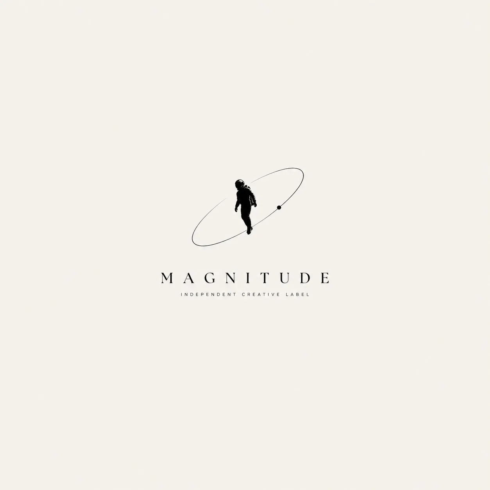 | 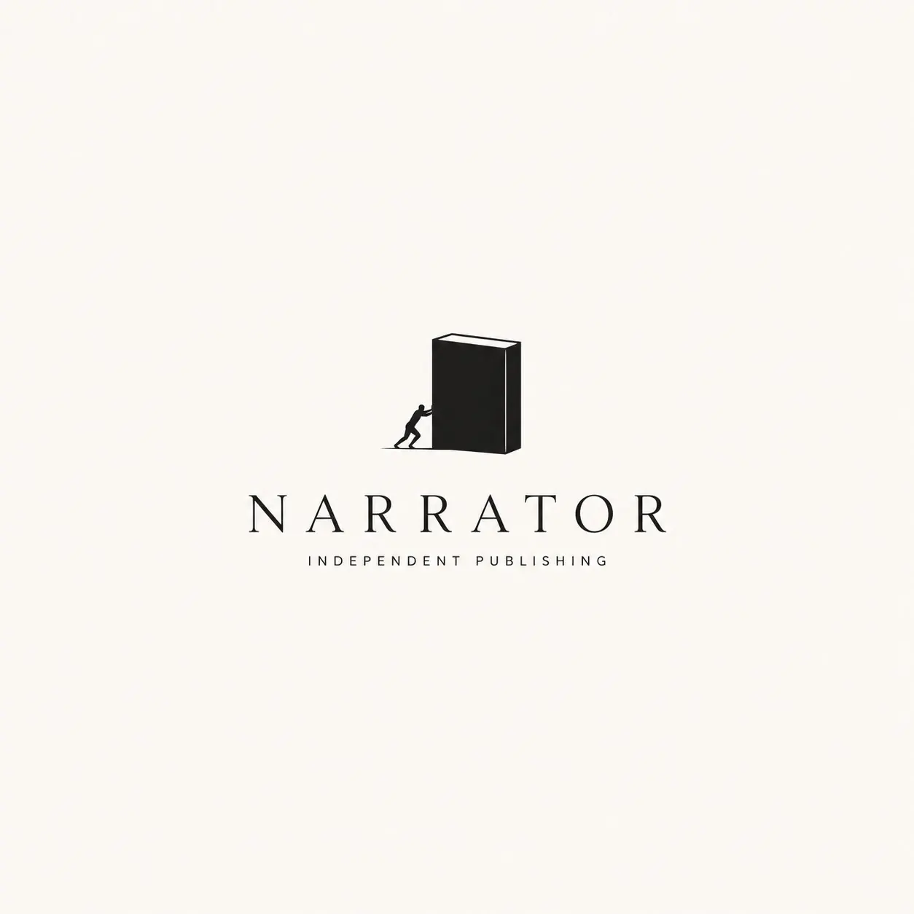 | 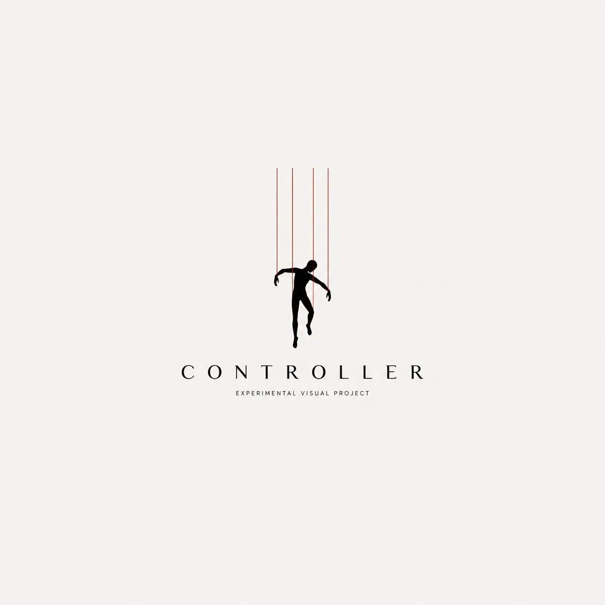 | 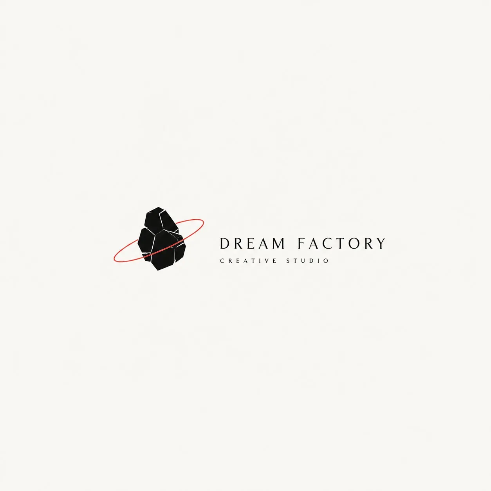 |

请根据以下用户输入创建高质量的“概念叙事极简标志”：

[品牌名 / 项目名]

[字幕 / 产品名称]

[行业 / 类别]

[品牌定位]

### 核心概念

[隐喻主题]

[情绪化的语气]

[原色]

[重音色]

[宽高比]

### 用户输入

品牌名 / 项目名称：[__________]

字幕 / 产品名称：[__________]

行业 / 类别：[创意工作室 / 视觉实验室 / 编辑项目 / 独立时尚品牌 / 艺术空间 / 出版 / 建筑 / 音乐厂牌 / 文化品牌 / 实验项目 / 等]

品牌定位：[__________]

核心概念：[梦境/控制/距离/隔离/轨道/自由/结构/记忆/叙事/想象力/紧张/未来/等]

隐喻主题：[宇航员/轨道/兔耳朵/剪影/木偶/盒子/线/月亮/手/几何结构/虚空/物体/等]

情感基调：[安静/克制/诗意/冷峻/实验/神秘/聪明/未来感/极简/概念性/等]

原色：[黑色/白色/灰色/深棕色/炭灰色/等]

点缀色：[少量红色/柔和红色/淡红色/淡淡高光/无]

画面比例：[1：1 / 4：3 / 3：2]

### 创意目标

设计一个“概念叙事极简标志”。

这不是传统的商业标志，不是装饰性徽章，也不是通用的几何图标。

目标是打造一个感觉像是小巧视觉理念的标志：极简、安静且以概念为驱动。

结果应表达“少即是多”的理念：

少装饰，多些意义;

少些噪音，多点概念;

减少视觉杂乱，增加叙事张力。

### 核心定义

这种类型的标志应使用：

极少数视觉元素，

负空间感强烈，

明确的象征或隐喻关系，

克制的排版，

以及一个微妙的叙事或概念层。

它应该像是一个属于独立创意工作室、艺术指导品牌、实验项目或以设计为主导的身份体系的标志。

### 基本原则

标志必须极简，但不能空虚。

图形必须简单，但不能泛泛而谈。

符号应承载隐喻、暗示或概念意义。

构图应使用大量呼吸空间和负空间。

标志应显得安静、有意图且艺术导向。

排版应克制、智能且布局谨慎。

整体设计应当像一个小小的视觉表达，而非喧闹的广告。

避免不必要的装饰。

### 图形指导

基于[核心概念]和[隐喻主题]，创建一个极简的象征图形或小型叙事视觉场景。

该图表可能包括：

简化的人体轮廓，

象征对象，

人物与结构之间的超现实关系，

一个小轨道或轨迹，

一种抽象的装置状形式，

具有叙事含义的几何场景，

一种暗示思想而非直接说明的隐喻性构图。

图形应当：

简单且高度提炼;

避免过多细节;

具有象征性或诗意意义;

提出故事、关系或情感状态;

感觉具有概念性，而不仅仅是装饰性。

### 排版方向

字体必须极简且受控。

要求：

品牌名称应清晰易读。

字体应当显得平静、现代且深思熟虑。

它可以是大写字母、小写字母、窄型无衬线字体，或其他克制的现代风格。

文字应支持符号，而非压倒符号。

文本与图形之间的关系应显得有意图且经过精心策划。

如有需要，可少量添加字幕/辅助文本。

避免过于表达、爱玩或喧闹的类型。

### 作曲指导

整体构图应强调静止和空间感。

要求：

利用大量空旷空间。

保持主标志在画面中相对较小。

符号可以位于左、中或右，但整体平衡必须显得精致。

构图应当像身份展示或画廊式展示。

如果有帮助，可以使用小注释、细线或细微的结构对齐。

避免让它看起来像海报、贴纸或广告。

### 色彩方向

保持调色板的克制。

推荐的方法：

主色调为黑色、白色、灰色、炭灰色或深中性色调;

可选地加入极少量的红色、柔和红色或其他细腻的点缀色;

点缀色应作为张力、切割、轨道、线条或信号点;

绝不让点缀色主导设计;

避免浓郁的渐变和高饱和度的色彩方案。

### 情绪与美学

最终的标志应该有以下感觉：

极小

概念性

叙事

诗意

约束

聪明

艺术指导

独立

实验性

少即是多

### 应避免的事项

请严格避免：

通用企业标志;

装饰性徽章标志;

可爱的吉祥物标志;

过于几何化且无意义的抽象标记;

装饰性较重;

拥挤的构图;

海报式布局;

色彩鲜艳或嘈杂的设计;

任何感觉泛泛、嘈杂或商业解释过度的内容。

### 输出需求

制作一个高质量的“概念叙事极简标志”，通过极简形式、强烈的负空间和安静但有意义的象征性姿态传达清晰的理念。

最终效果应该是这样的：

一个带有故事的标志，

一个充满张力的象征，

以及建立在“少即是多”原则上的视觉身份。

云标志系列

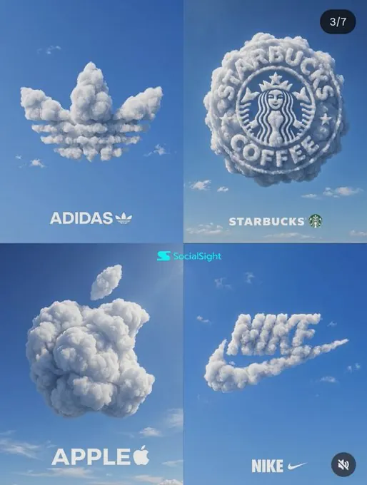

提示：
