# 海报类

> 从《ChatGPT image2 提示词》导入并转换为适合 GitHub 浏览的版本。

## 半写实手绘打卡海报

| 预览 | 预览 | 预览 | 预览 |
| --- | --- | --- | --- |
| 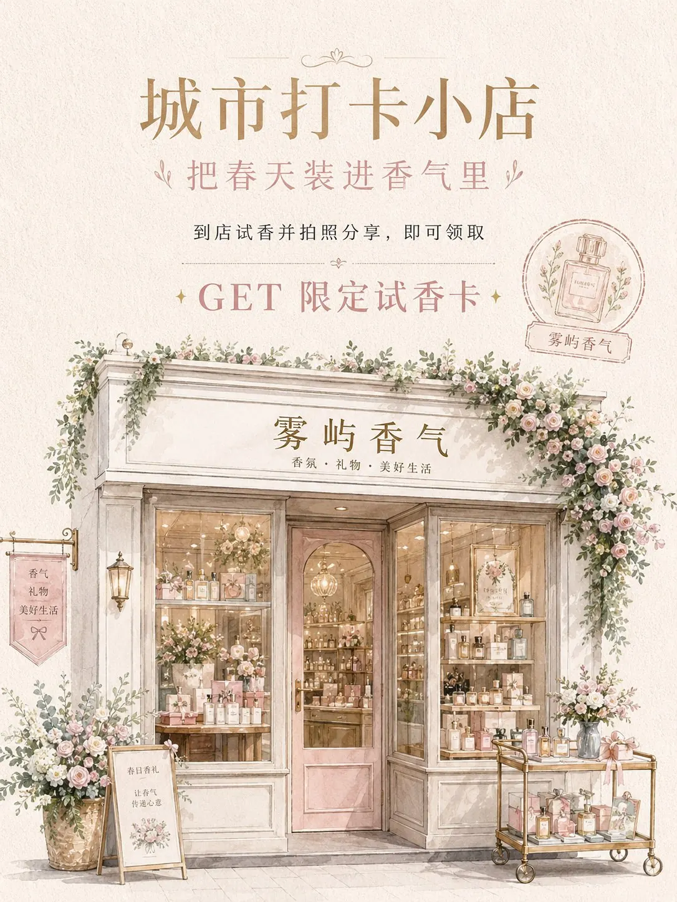 | 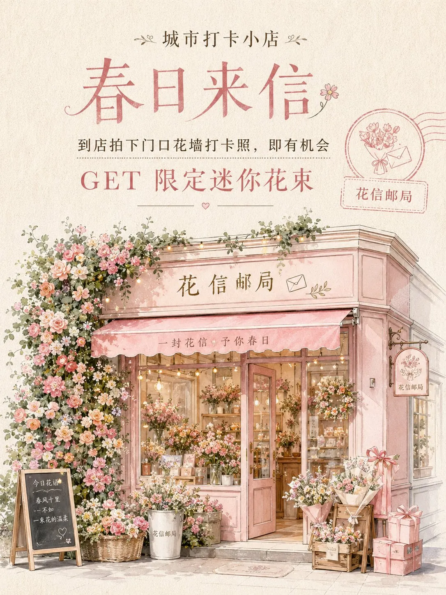 | 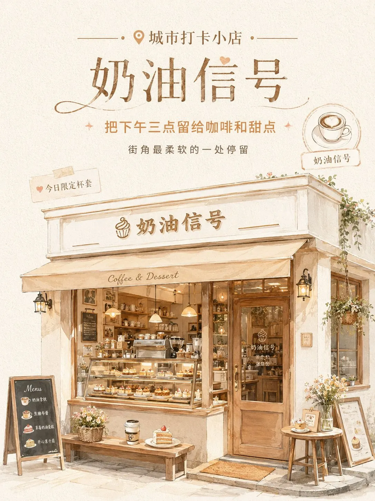 | 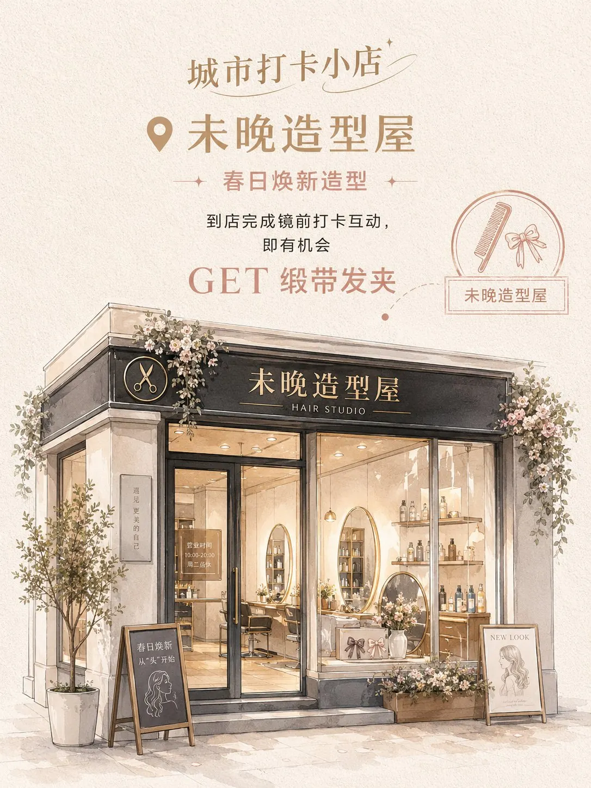 |

《半写实手绘打卡海报》提示词：

请根据我上传的门店照片，生成一张竖版 3:4 的《半写实手绘打卡门店海报》。

品牌 / 系列标题：【__________】

店名：【__________】

门店类型：【__________】

海报模式：【活动引流版 / 氛围展示版】

门店主题：【__________】

主文案：【__________】

权益 / 礼品 / 体验内容：【__________】

主色：【__________】

辅色：【__________】

点缀色：【__________】

门店风格方向：【__________】

行业装饰元素：【__________】

请以我上传的真实门店照片作为核心参考，不要重新虚构一家店。需要保留原门店的主要识别特征，包括门店外立面、门头招牌位置、门窗结构、入口关系、橱窗位置和整体建筑比例。可以适度美化门面、优化配色、增加装饰、改善橱窗陈列和门口氛围，但不能把门店改成完全不同的建筑。

整体风格为半写实手绘 + 精致水彩建筑插画 + 门店活动海报。画面不是普通照片滤镜，也不是潦草草稿，而是将真实门店改造成温柔、精致、适合打卡传播的手绘海报。

画面采用“上方信息区 + 下方门店主视觉”的竖版结构。顶部放品牌 / 系列标题，中上部放店名、主题文案和活动信息。若为活动引流版，突出“GET + 礼品 / 权益”；若为氛围展示版，则弱化营销信息，突出门店气质。

右侧或局部可加入圆形印章、小图标、地图点位虚线、标签框或手写注释，增强打卡海报感。

下半部分为基于上传照片改造后的门店主视觉。门店要保留真实结构，同时变得更精致、更温柔、更有打卡感。门头、招牌、橱窗、玻璃门、室内陈列和门口装饰要清楚。

配色不要固定成单一粉色，而要根据门店类型选择浅色、时尚、柔和的配色。整体低到中低饱和、明度偏高，有女性向、小资、年轻化、生活方式感。背景使用米白、奶白、暖灰或浅卡其纸张纹理。

装饰元素必须符合门店类型：

花店可用花束、藤蔓、花篮、丝带；

造型屋可用发夹、梳子、镜子、护发产品；

咖啡甜品店可用咖啡杯、蛋糕、面包、菜单黑板；

香氛店可用香水瓶、蜡烛、礼盒、试香台；

美甲美睫店可用甲油瓶、睫毛刷、色卡、小镜子；

轻珠宝店可用首饰托盘、耳饰架、戒指盒、珍珠；

女装买手店可用衣架、包包、试衣镜、橱窗陈列。

最终效果应像一张温柔、精致、半现实、适合社交媒体传播的真实门店打卡海报。门店是主角，文字简洁清楚，整体不要硬广告感，要有“想去打卡、想进店、想拍照”的吸引力。

## 极简几何装置风产品海报

| 预览 | 预览 | 预览 | 预览 |
| --- | --- | --- | --- |
| 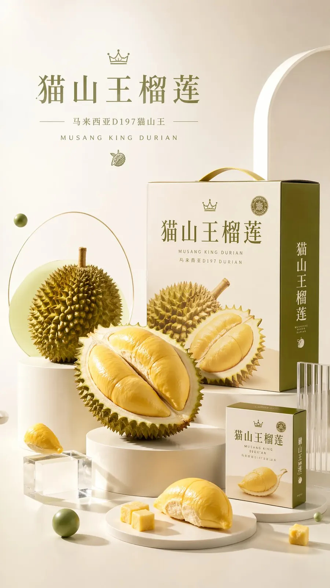 | 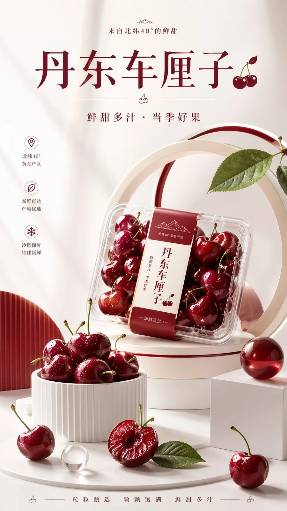 | 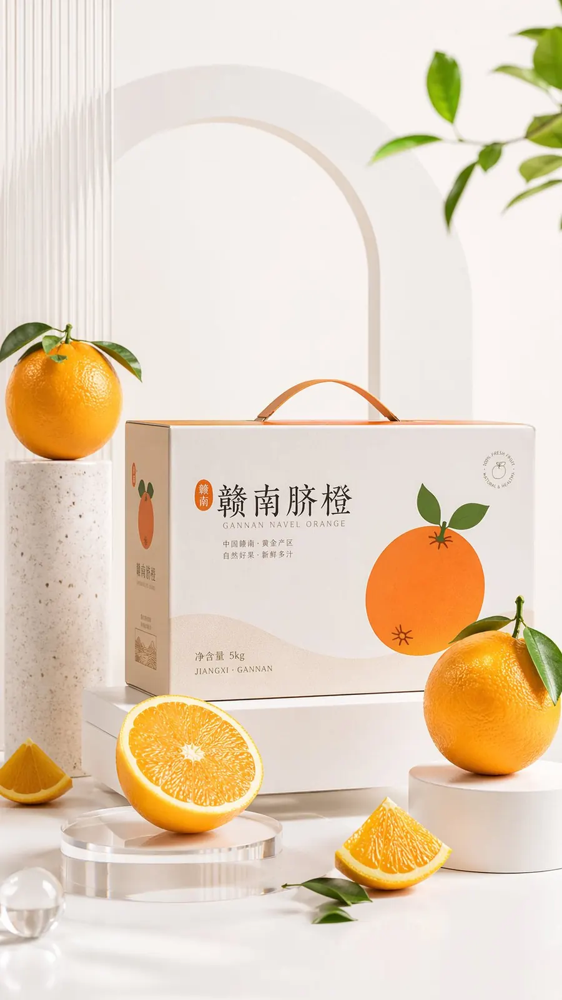 | 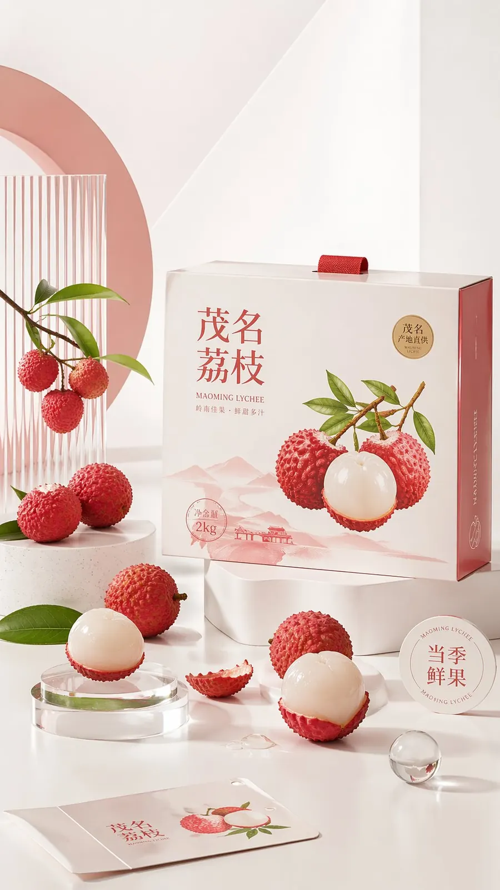 |

提示词：

请为【主题产品】创作一张“极简几何装置风产品海报”。

如果我提供了产品图片，请以该图片为主要参考，保留产品的核心外观特征、包装形态、颜色、材质、品牌识别和整体气质，并优先沿用产品图中的主色调与配色关系进行设计。

如果我没有提供产品图片，请根据【主题产品】自动生成符合该产品定位的产品外观与包装设计，并根据产品属性、品类特征和气质，自动匹配自然合理的主色、辅助色、道具造型与展示方式。

海报整体风格要求：

画面采用高键白色或暖白色摄影棚背景，整体干净、通透、柔和、明亮，具有高级商业感与现代品牌视觉气质。构图不是普通电商棚拍，而是像品牌视觉提案、艺术静物摄影与3D产品陈列结合的概念海报。

画面主体应包含：

【主题产品】本体

## 产品包装

## 与产品相关的原料、切片、部件、功能元素或材质细节

三者共同构成完整的视觉链路，使观者一眼就能理解“这是什么产品、内容是什么、卖点或来源是什么”。

场景中加入简洁且具有设计感的几何装置道具，例如：圆柱、方块、长条块、圆环、球体、半圆、平台、堆叠积木、亚克力支架、玩具感结构体等，用于承托、悬置、围绕或衬托产品主体，形成富有秩序感、节奏感和层次感的艺术陈列构图。

整体配色应围绕产品本身自然展开，以产品关联色为主视觉核心，搭配白色、奶油色、浅灰色等中性色，必要时加入少量辅助点缀色，使画面颜色统一、克制、舒适、清爽，不杂乱、不花哨。不同产品应自动适配不同配色，不固定使用某一种背景色。

材质表现要细腻真实，具有高质量商业渲染质感。透明塑料、亚克力、磨砂材质、纸质标签、玻璃、金属、光滑塑胶、果肉纹理、食材纹理或产品表面细节都应自然可信。可以有轻微反射与柔和阴影，但不要过重、不要脏乱。

构图要求留白充足，主体明确，画面平衡，视觉整洁，具有轻松、温和、现代、精致、亲和、带一点童趣但不幼稚的品牌气质。整体感觉像一张高审美的品牌产品KV海报，非常适合电商主视觉、社交媒体种草图、产品展示图。

输出要求：

竖版构图

比例

## 单张海报

## 高级感、简洁感、品牌感强

## 虚实交融城市画报

| 预览 | 预览 | 预览 | 预览 |
| --- | --- | --- | --- |
| 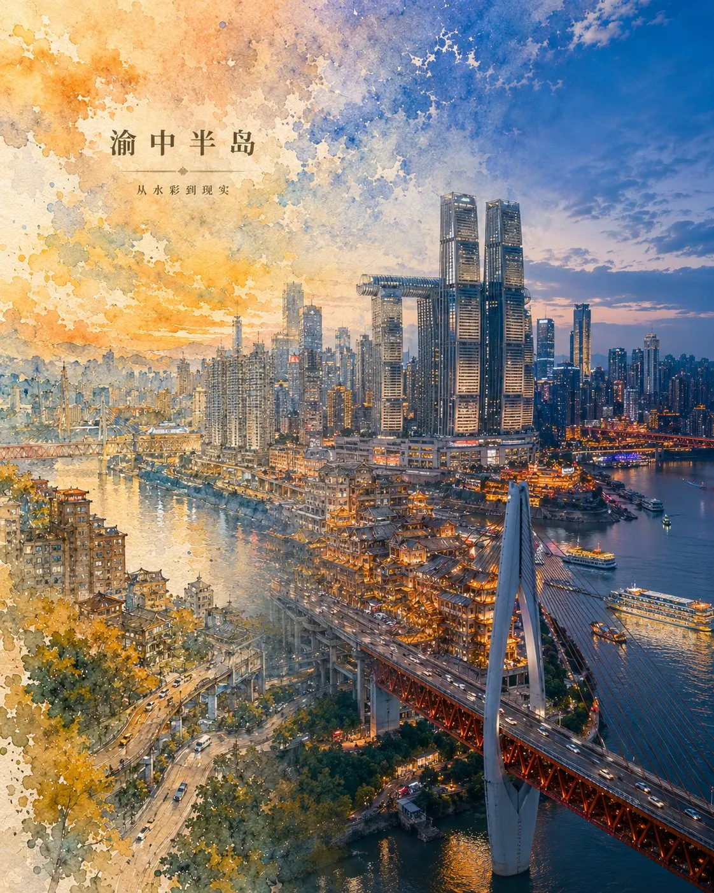 | 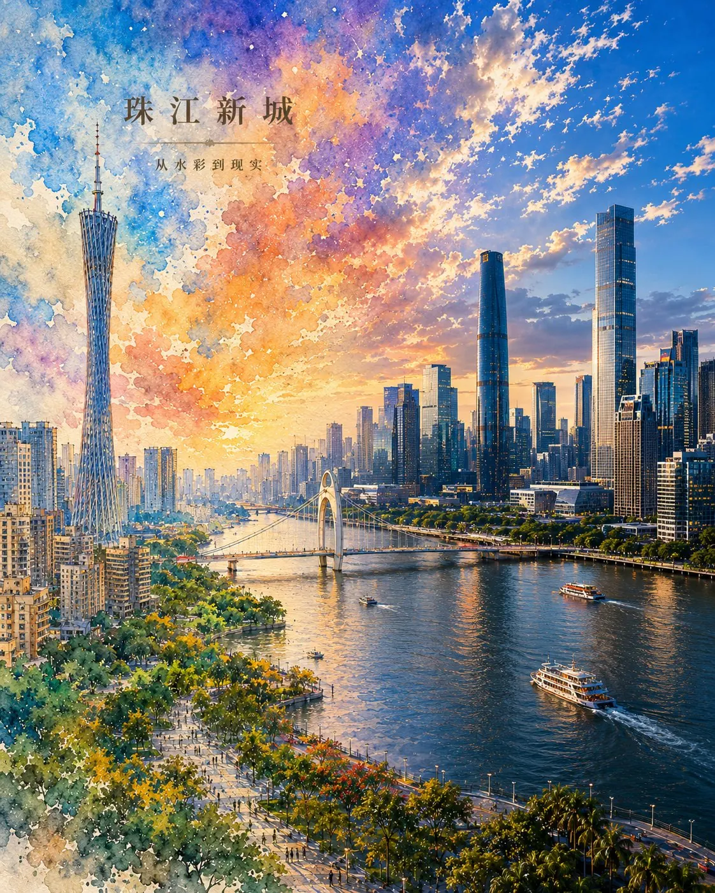 | 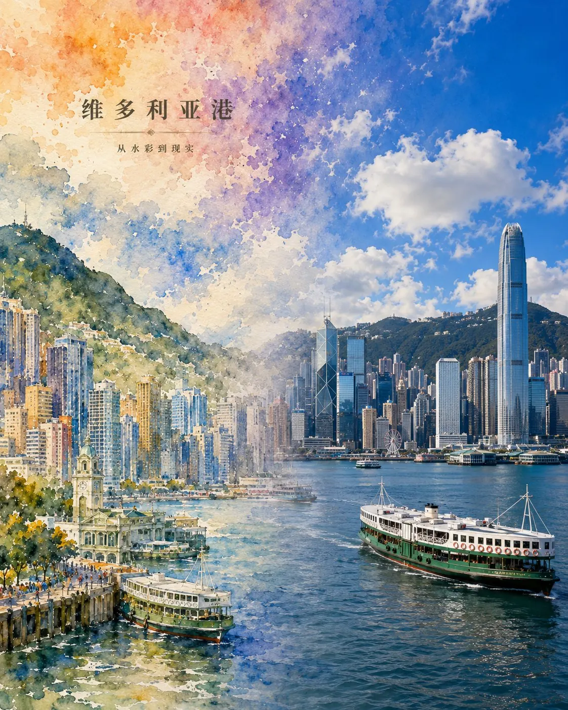 | 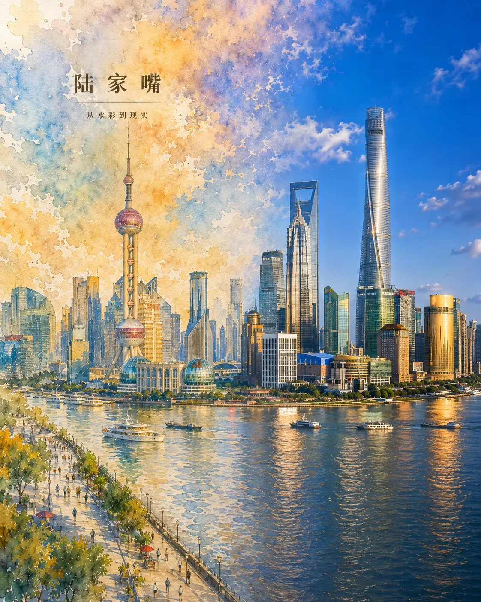 |

《虚实交融城市画报》提示词：

请生成一张「虚实交融 · 城市印象」风格的竖版城市海报，主题为【城市标题】。

核心概念：

整张画面从左到右呈现“高完成度写实水彩 → 虚实融合 → 高清真实城市风景”的自然过渡效果。画面不是左右两张图简单拼接，而是同一座城市在同一个空间中，从水彩画意逐渐走向真实世界。

画面构图：

竖版 4:5 构图，单张图片独立生成，不要四宫格，不要拼图。

整张画面全铺满，不要大面积空白纸张背景。

左侧约三分之一为写实型水彩城市景观，必须有完整的建筑、道路、水面、树木、桥梁、城市空间与远近层次。

左侧水彩不能只是淡淡的颜料晕染或空白背景，要像一座真正被水彩细致画出来的城市。

中间区域为自然融合带，让建筑、天空、水面、树木、桥梁、道路一起参与材质过渡。

过渡要连续、柔和、有层次，不能像一刀切，不能像两张图硬拼。

右侧约三分之一为高清真实城市风景，光影自然，细节丰富，具有强烈现实感。

整体要让人感觉城市正在从画中慢慢醒来，从想象进入现实。

视觉风格：

左侧水彩要偏写实、细节丰富、结构清楚，同时保留纸张肌理、笔触感、颜料晕染和手绘质感。

右侧真实部分要清晰、通透、现代、有真实摄影感。

整体气质清亮、干净、高级、克制，有艺术感和城市现代感。

色彩以天空蓝、城市灰、植被绿、水面蓝为主，可加入柔和暖色光影，增强画面层次。

不要低幼卡通感，不要传统旅游宣传页风格，不要过度复古泛黄。

文字要求：

文字尽量少，直接叠加在画面上，不做复杂排版。

只保留主标题：【城市标题】。

副标题使用：“从水彩到现实”。

字体简洁、优雅、克制，不要抢画面。

不要大量说明性小字，不要信息堆砌。

城市内容：

请准确呈现【城市标题】最具辨识度的城市景观，包括【核心地标】、【河流/海港/山体/道路/桥梁特征】。要求整体城市识别度强，即使不看标题，也能大致认出这座城市。

避免出现：

不要大面积留白；不要只有水彩颜料没有城市内容；不要中间硬切割；不要左右拼贴感；不要错误到离谱的地标；不要乱码文字；不要过多装饰；不要低清晰度；不要画面脏乱。

非遗新国风海报风格

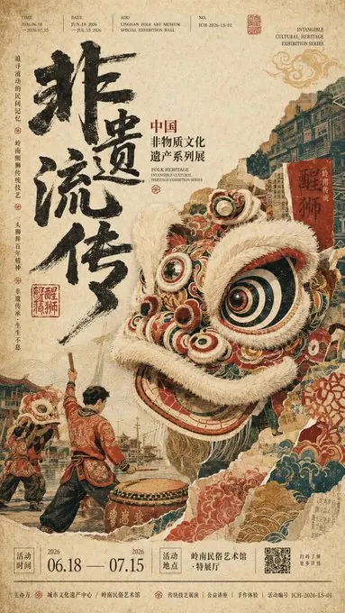

生成一张竖版 9:16 非遗文化系列海报，海报主体必须铺满整个画面，不要出现外层展板

背景、不要出现缩小内框海报、不要四周留出大面积空白。画面比例为 9:16，完整满版

海报设计。

主题为：【非遗主题】

主标题为：【主标题】

副标题为：【副标题】

活动时间为：【活动时间】

活动地点为：【活动地点】

主办方为：【主办方】

底部信息为：【底部补充信息】

整体风格为非遗文化展览海报，低饱和国风审美，纸感拼贴 + 民俗插画 + 旧印刷质感。

背景为米白、旧纸黄、浅赭、暖褐、沙金色调的旧宣纸/手工纸质感，带细腻纸纤维、轻

微泛黄、印刷颗粒、柔和漫射光和复古纸本质感。

版式严格为满版竖向海报：顶部保留小型信息区，放置 TIME、DATE、ADD、活动编号等极

小英文/数字信息；左侧或右侧边缘保留一列细窄竖排中文说明文字；主标题位于画面左

上或中上区域，与主视觉发生层叠遮挡；中部为核心非遗主视觉；底部设置固定信息栏，

横向置于画面底端，包含活动时间、地点、二维码占位、主办方/赞助方小字、编号信

息，排版整齐克制。

主视觉内容围绕【非遗主题】展开，可包含：【主视觉元素】。画面主体由民俗人物、非

遗器物、传统服饰、戏曲脸谱、剪纸纹样、年画图形、刺绣图案、陶瓷纹饰、祥云、波

纹、印章等组成，表现为纸张剪贴、旧杂志拼贴、复古版画、手工印刷叠色的综合视觉。

主视觉不能孤立居中，必须与标题、印章、纹样、图案互相遮挡穿插，形成丰富但克制的

层叠关系。

标题使用大号毛笔书法中文，墨黑或深褐色，笔触有飞白、顿挫和手写质感；副标题和说

明文字使用小号宋体/黑体混排，文字密度适中，信息层级清晰。整体配色以米白、旧纸

黄、浅赭、暖褐、沙金、墨黑为主，辅以少量【点缀色】。画面具有系列化、展陈感、传

统文化展示感、高级、静谧、克制、复古印刷质感。

## 纸质拼贴海报、民间插画、复古印刷质感、编辑版画

展览设计、中国非物质文化遗产、完整海报布局，

9：16竖版海报

负向提示词：

不要缩小海报贴在背景上，不要外层展板场景，不要画中画，不要四周大留白，不要满版

纯插画，不要纯水墨写意，不要现代商业促销风，不要高饱和，不要霓虹色，不要赛博科

技感，不要3D塑料感，不要摄影海报风，不要标题单独悬浮，不要主视觉完全居中且孤

立，不要缺少顶部信息区，不要缺少边缘竖排文字，不要缺少底部信息栏，不要缺少二维

码/主办方小字区域，不要强烈科技渐变，不要金属镜面感，不要玻璃拟态，不要卡通

化，不要粗糙乱字，不要乱码，不要水印，不要低清模糊

变量示例：

【非遗主题】：醒狮 / 皮影戏 / 剪纸 / 京剧脸谱 / 青花瓷 / 苏绣 / 木版年画 / 油

纸伞 / 风筝 / 花灯 / 昆曲 / 陶艺 / 漆器

【主标题】：时间里的国家宝藏 / 非遗流传 / 匠心传承 / 古韵新生

【副标题】：中国非物质文化遗产系列展 / 传统技艺文化展 / 东方民俗艺术展

【主视觉元素】：醒狮、鼓槌、祥云、朱砂印章、岭南纹样

【点缀色】：朱砂红 / 黛青 / 青绿 / 孔雀蓝 / 淡金

## 二十四节气 x 景深美学

| 预览 | 预览 |
| --- | --- |
|  | 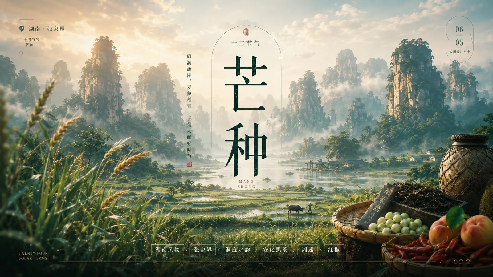 |

请创作一张兼具东方气韵、现代信息设计感与沉浸式空间纵深的视觉作品。画面不要只是单纯插画或普通海报，而应像一个完整的视觉场域：有呼吸、有留白、有层次、有被光照亮的秩序，也有自然生长出来的细节。整体应服务于信息表达，让它既能成为 PPT 封面、信息图、自媒体封面、文章头图、品牌卡片或专题视觉，也能在第一眼就建立审美上的信任感。

先以一个主色建立全画面的情绪与秩序，不追求杂色丰富，而追求同色系内部的丰盛变化。让主色在高光、中间调、阴影、薄雾、反光与透明叠色里自然展开，可辅以极少量点睛色作为视觉锚点。色彩要有空气感、湿度感、光照感，能让人感到画面不是平的，而是有呼吸深度的。避免廉价艳丽，避免拼贴式杂乱，避免每个元素都在争抢注意力。

构图上建立清晰而不僵硬的视觉流。让画面拥有前景、中景、远景与核心信息区：前景可以用植物、器物、图形边框、局部裁切的结构物、微型人物或带有质感的局部元素形成包裹感；中景承载主要氛围与核心图像；远景负责拉开空间与意境；中心或偏中心位置要自然形成一条可容纳标题与关键信息的视觉通道。让视线能缓慢进入，而不是被粗暴地推向某一处。保留足够留白，让“空”参与叙事。

将信息设计语言融入画面，而不是生硬叠加。允许出现细线、点阵、半透明几何面、轻量框线、数据标记、小型图示、微型肖像、注释标签、编号、章节分隔、局部高亮、关键词锚点等元素，但这些元素必须与主画面气质一致，像从同一套视觉系统里生长出来。它们既能帮助理解内容，也能构成节奏。尤其适合把复杂内容整理成可被快速感知的层级：主标题最强，副标题次之，关键信息再次之，补充说明最轻。不要把所有字都做得一样重要。

将信息设计语言融入画面，而不是生硬叠加。 允许出现细线、点阵、半透明几何面、轻量框线、数据标记、小型图示、微型肖像、注释标签、编号、章节分隔、局部高亮、关键词锚点等元素，但这些元素必须与主画面气质一致，像从同一套视觉系统里生长出来。 它们既能帮助理解内容，也能构成节奏。 尤其适合把复杂内容整理成可被快速感知的层级：主标题最强，副标题次之，关键信息再次之，补充说明最轻。 不要把所有字都做得一样重要。

文本排版要像在经营呼吸，而不是在填空。标题应有精神性与凝聚力，可大可静；副标题与说明文字应克制、清楚、可读；关键词可以被单独提亮、放大、拉开或收紧，以形成阅读停顿与节奏变化。文字与图像之间不要相互挤压，而应彼此成全。若内容较多，应先提炼核心观点，再围绕核心观点布置信息层次；若内容较少，则让文字更像视觉中的题眼。让读者在短时间内抓住重点，同时愿意停留。

图像处理上，不要过分写实，也不要过分扁平。应在真实感、设计感与象征感之间取得平衡。允许自然景观、器物、人物、建筑、图标、纹理、抽象图形彼此交织，但都需服从同一审美方向。微型人物或小人像不要喧宾夺主，而应成为尺度参照、情绪引导或知识叙事的伏笔。图形元素可以借自然形态的边缘、走势、光影与节律来组织，形成一种既沉静又丰沛的画面张力。

最终作品应显得完整、克制、精致、通透，有较高的审美密度，但不过度解释；有明确的信息效率，但不失气韵；有现代设计的理性，也保留某种含蓄、安静、丰盛的流动感。它不是把元素堆在一起，而是让一切在同一气息中各归其位。

请根据以下输入内容，自主判断题材、构图重心、主色倾向、图文层级、图形语言、微型人物是否需要出现，以及整体适合更偏海报、PPT 封面、信息图、自媒体封面还是卡片式版面，并生成最终画面：

——————

主题 ：十二节气 夏至

用途：朋友圈海报

融合湖南 景观和特产， 有电影级质感，中心构图， 有很好的景深效果

美学上有收藏价值， 电影级光影。

比例3:4

二十四节气x纪念碑谷

| 预览 | 预览 |
| --- | --- |
| 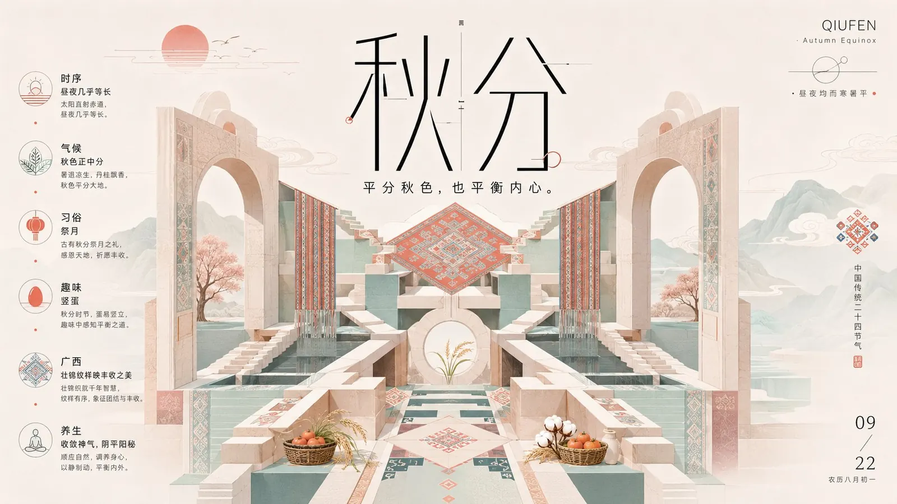 | 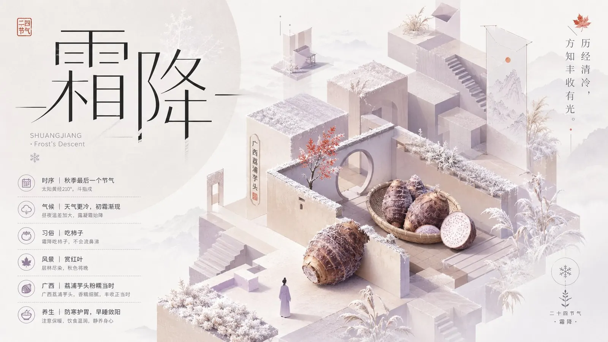 |

| 预览 | 预览 |
| --- | --- |
| 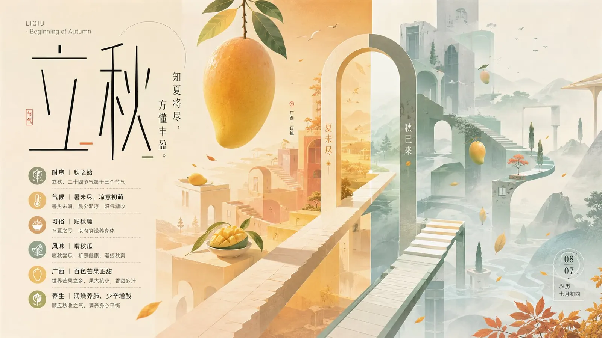 | 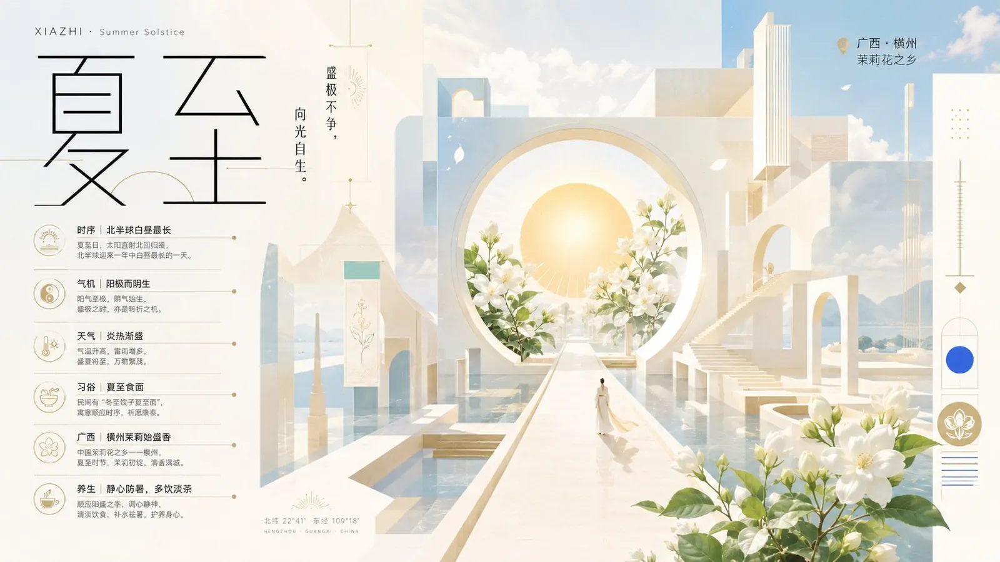 |

提示词

请根据用户最后输入的【主题 / 单词 / 短句】，生成一张「纪念碑谷气质」的极简超现实主义 3D 艺术海报。

核心逻辑（关键）：

不要将中文文字强行转成立体建筑。

先理解主题语义，用“空间结构”表达情绪与隐喻；再用“中文排版”作为视觉主标题，两者协同，而不是融合变形。

空间设计：

构建纪念碑谷式几何空间（平台 / 台阶 / 门洞 / 通道 / 悬浮结构），采用等距视角。

空间必须服务主题表达，例如通过高低差、路径、遮挡、孤立、连接等关系隐喻情绪，而不是纯造型堆叠。

中文设计（重点）：

中文必须作为清晰、可读的主标题出现，并成为版面视觉核心之一。

采用“平面设计化处理”，而不是立体化：

可使用极简无衬线 / 细黑体 / 几何结构字形

可做轻微拉伸、切割、错位、留白设计

可与空间产生遮挡、穿插或叠加关系（而不是变成建筑）

保持高级、克制、可读

辅助文字：

可加入少量英文或数字信息（如 vol. / 年份 / 编号），作为版式平衡元素，但权重明显低于中文主标题。

色彩系统（优化重点）：

采用“纪念碑谷式动态配色”，但适配印刷：

以明亮、柔和、低饱和为基础（奶白、雾粉、浅蓝、薄荷绿、砂岩、浅灰等）

避免大面积深色与死黑

使用同色系明度变化建立空间层级（前 / 中 / 后）

点缀1–2处高纯度色，用于引导视觉焦点（门洞 / 边缘 / 转折处）

整体色彩需“通透、有空气感、有层次”，而不是固定配色方案。

构图与层次：

主体明确，但画面不能空：

在四周加入少量“同源结构的弱化延展”

使用重复几何、远处体块、边缘切片等方式形成构图闭环

建立前景 / 中景 / 后景关系，让画面有深度但不过度复杂

氛围控制：

仅允许极少量意境元素（如淡月、微光、细枝、轻雾或几何符号），点到为止，不堆砌。

人物：

可选极小比例人物（≤8%），作为尺度与情绪锚点，动作安静克制。

最终效果：

一张“空间表达主题 + 中文主导版式”的高端设计海报，具有纪念碑谷式空间语言、清晰视觉层级、克制配色与强设计感，可直接用于艺术展或设计年鉴。

用户输入主题：

本次任务：

生成 小满 之后 10个二十四节气对应的卡片

注意每张卡片， 彼此创意和配色独立，排版独立，没有序列号关联，每张都有排版上的巧思，还有设计思路上的动态变化节奏。

要求每个元素，至少5个不同层次信息点or知识点， 中心元素是 广西代表性特产or风格元素+融合节气元素, 二级标题 都是对应节气的 哲理金句

特别强调：一共10个图片，每个图片都是16:9尺寸

美学价值：收藏级别

## 情绪图

| 预览 | 预览 |
| --- | --- |
| 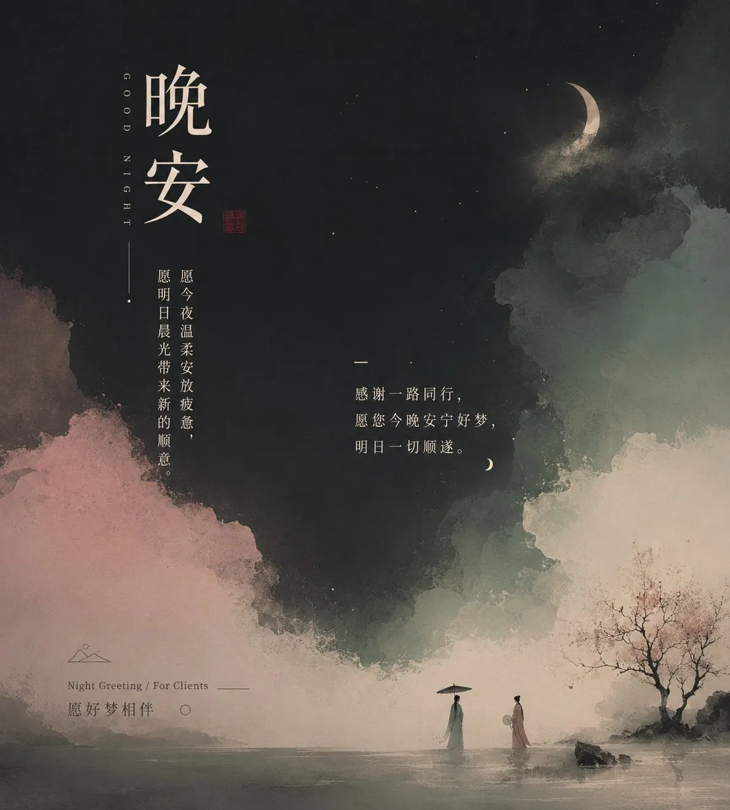 | 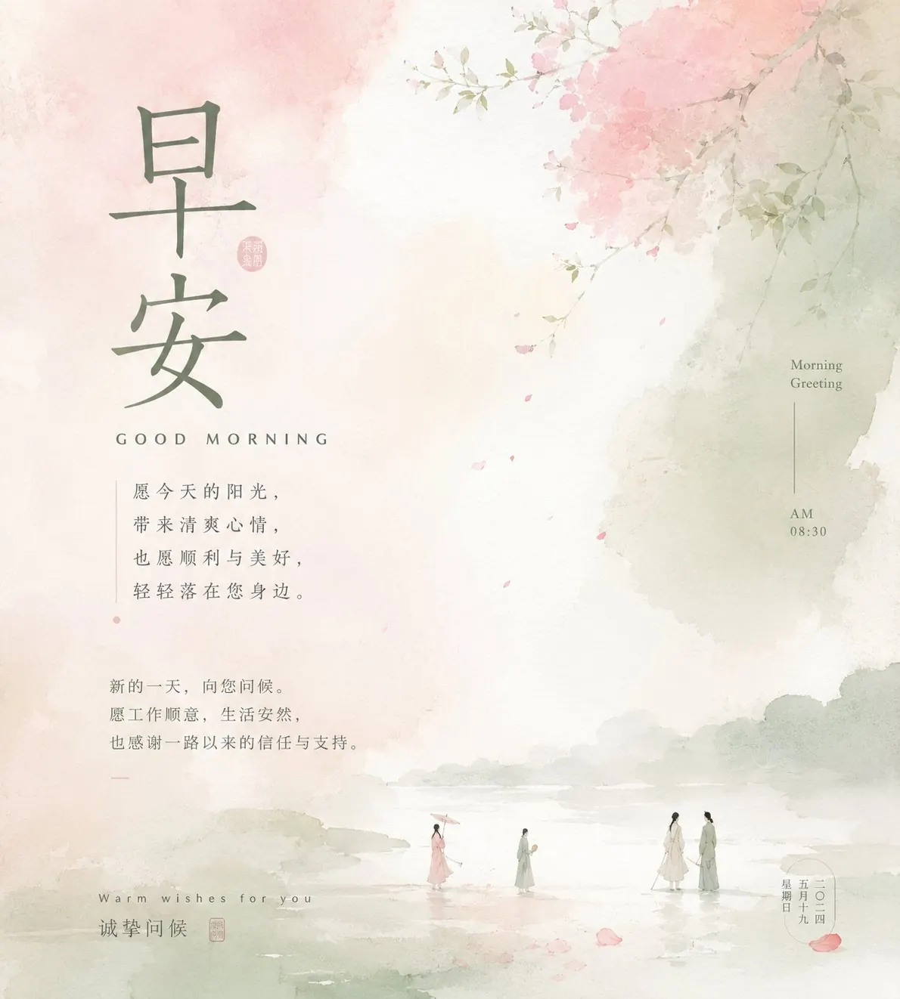 |

请生成一张具有东方气韵与现代版式意识的视觉画面，整体以柔和水彩语感展开，强调轻盈、留白、呼吸感与若即若离的秩序。画面以大面积低饱和粉色、浅绿色、米白色为主，色块像被水汽晕开般自然游移，不要机械对称，也不要边界清晰，应呈现柔化、渗透、半透明叠加的状态，带有轻微颗粒感与纸面纹理，像落在宣纸与水彩纸之间的一层薄雾。构图要开阔、疏朗、安静，留白不是空，而是气息的一部分；色块之间要形成流动关系，彼此牵引，仿佛画面内部有隐约的节奏在缓慢发生。

画面中加入少量低位小人物，人物比例小，姿态克制而自然，具有东方人物剪影气质，可穿中式服饰、持伞、执扇、缓行、停驻、对望或静立，不必刻画五官，重点是意态、节奏和彼此之间的呼应。人物不应喧宾夺主，而应像空间中的轻声注脚，与大色块共同构成画面的情绪与尺度关系。

文字排版是画面的一部分，而不只是信息附着。请将中文与英文视作两种节奏：中文可采用竖排、疏朗、带有书卷式停顿感；英文可采用横排，简洁、克制、留有间距。文字不要生硬居中堆放，而应围绕画面气流自然安置，与色块、留白、人物共同呼吸。标题、副标题、说明文字、日期或信息模块之间要有层次，但不要做成标准化商务模板，应让信息像从画面中长出来，既清晰可读，又保有审美余韵。整体适合用于信息图、PPT封面、自媒体视觉、文化类标题页、品牌卡片等场景，兼顾传播性与观感。

请特别注意：不要把画面做得太满，不要过度装饰，不要使用强烈冲突色，不要让文字排版过于规整僵硬，也不要把人物做得过大或叙事过重。重点不在“讲明白一切”，而在于营造一种温柔、含蓄、自由、安静、带有春意与人文气息的视觉场。画面应显得有文化感、有现代感，也有一点点抽象性和未完成感，像一页介于设计、诗意与信息之间的视觉纸面。

请根据用户输入的主题与用途，自然调整文字内容、信息层级、人物关系、色块方向与版面呼吸，使每次生成都保持同一审美血统，但呈现出不同的发生方式与构图结果。

本次主题： 早安问候语

用途：销售人员，给客户发送的早安问候图片

比例：9:10

本次主题： 早安问候语

用途：销售人员，给客户发送的早安问候图片

比例：9:10

## 文学类破窗海报

| 预览 | 预览 |
| --- | --- |
| 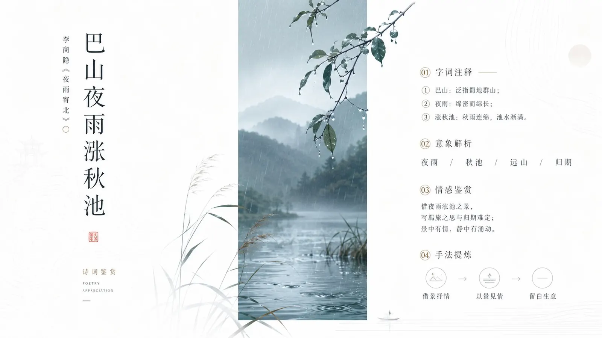 | 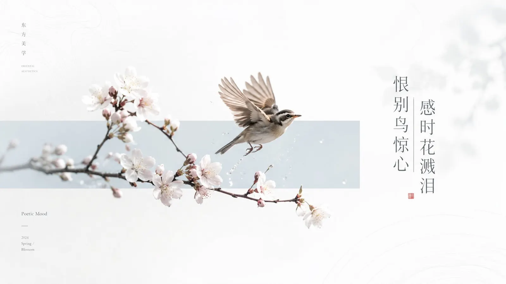 |

| 预览 | 预览 |
| --- | --- |
| 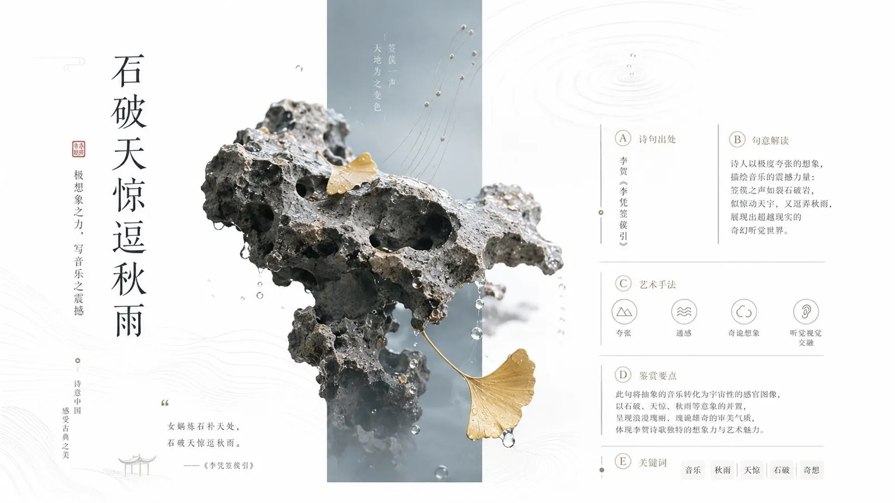 | 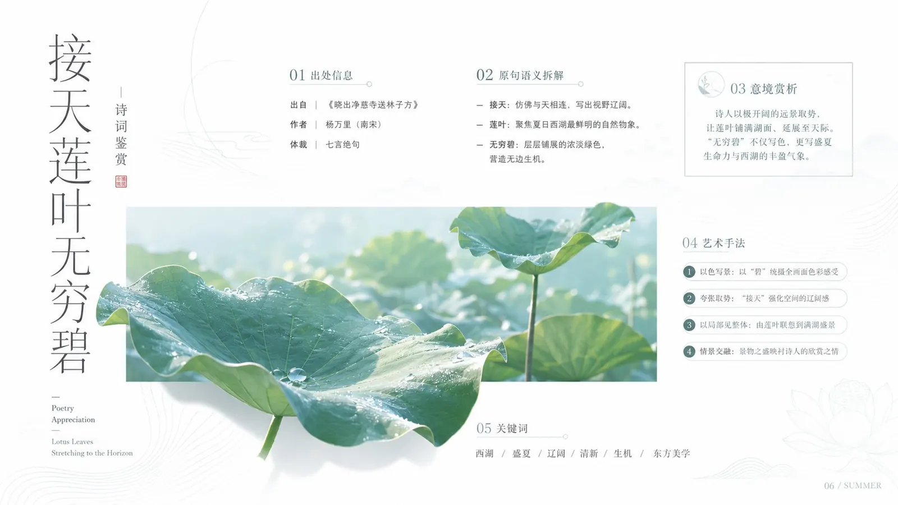 |

设计一张具有高级商业审美的极简海报，核心视觉语言是“真实物象穿越几何情绪窗口”。画面中设置一个窄长的低饱和色块，作为视觉锚点和空间容器，色块颜色根据主题选择柔和浅色，如雾蓝、浅青、米白、淡粉、暖灰或浅金。将【核心物象】以真实摄影质感或精细写实方式置入色块之中，但不要完全困在色块内，要让主体局部越界、破框、延伸到留白区域，形成自然生长感和空间穿透感。背景保持极简，使用大面积白色或浅灰留白，加入几乎透明的文化纹样、线性图形、地形线、水波线、光影轮廓或抽象符号，作为若隐若现的视觉细节。整体排版要像高端地产、奢侈品、美学杂志或节气海报，文字细长、克制、字距舒展，标题可竖排，辅助信息用小字号规整排列。画面需要有东方留白、现代秩序、自然生命力、轻奢品质感。避免杂乱、避免高饱和、避免厚重阴影、避免廉价模板感。

本次主题：接天莲叶无穷碧

主视觉元素：顶级日系摄影风格，ins滤镜质感，电影级光影、明亮通透

其他要求：画面至少4个不同层级 不同逻辑和不同呈现方案的知识点

用途：诗词鉴赏

背景：白色

比例16:9

## 现代极简食品广告美学海报

| 预览 | 预览 |
| --- | --- |
| 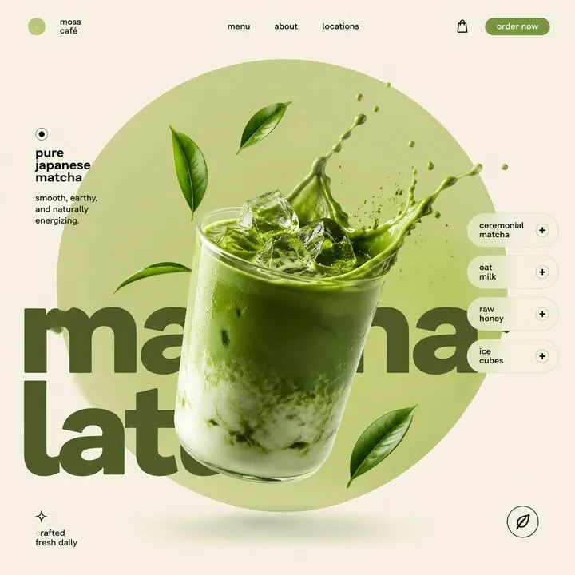 | 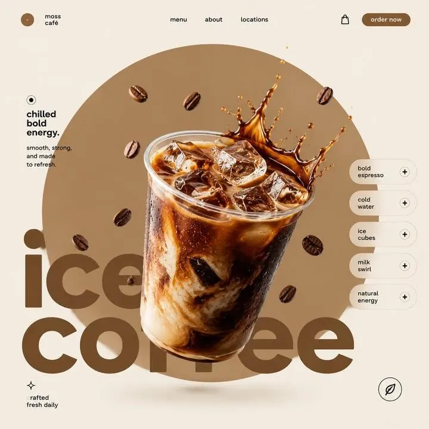 |

[抹茶拿铁]风格与艺术指导：现代极简食品广告美学、瑞士风格广告构图、高端餐厅社交媒体品牌、快速消费品广告编辑设计、初创食品品牌视觉、Pinterest 风格美食海报美学、俏皮几何广告结构、现代应用内品牌风格、极简奢华餐厅营销。主要物品：置于构图中央的超写实美食英雄，引人注目的高端美食摄影设计，漂浮或悬挂的呈现，逼真的光泽质感，新鲜食材的细节处理，令人垂涎的商业展示，工作室级菜肴渲染，高级餐厅广告氛围。 布局与构成：保持采样中的精确构图结构：大型圆润有机奶油色背景，置于鲜艳全彩背景中央，大号小写字体置于主角身后，英雄的食物物品置于中心，重叠的小型品牌/导航条排在顶部，短编辑文字块位于左侧，界面中垂直排列的圆形成分或口味标签，垂直排列于右侧。 极简装饰性微型图标，干净的不对称间距，大型分组讨论室，高端极简风格的层级结构，社交媒体海报构图。排版：大字体，粗体，圆润小写字母，现代几何无衬线字体系统，简约的辅助文字，新兴品牌的字体层级清晰，商业字体柔和圆润，大型字体处理隐藏在物体后面。  深度与光线：柔和的高端工作室灯光，高品质美食高光，逼真的柔和阴影，细腻的光泽反射，电影般的商业灯光，高度细致的纹理渲染，高质量的深度分离。附加设计细节：圆润的药丸形标签、小的加号图标、界面中极少的漂浮元素、类似应用的构图、新鲜配料装饰、柔和的阴影晕染、现代化的外卖品牌系统、简洁的视觉效果、极少的几何平衡。色彩搭配：[主品牌色]，奶油色/米白色，温暖的点缀色调，高对比度的食用色，极简的黑色字体点缀，现代高端商业调色板。 质量：超高分辨率，Behance 级食品广告质量，8K 商业渲染，Pinterest 风格餐厅广告设计，高端快速消费品品牌美学，专业艺术指导，高品质编辑食品海报。

高级艺术海报（破窗）

| 预览 | 预览 |
| --- | --- |
| 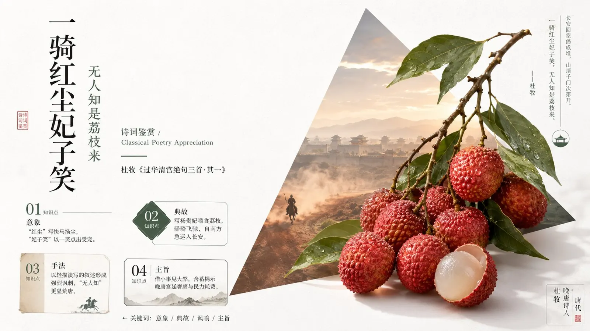 | 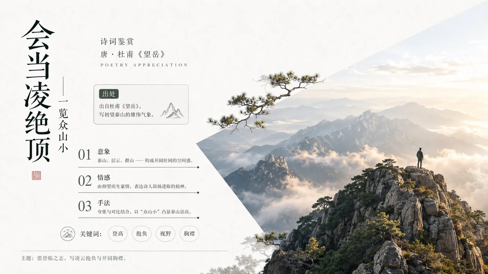 |

| 预览 | 预览 |
| --- | --- |
| 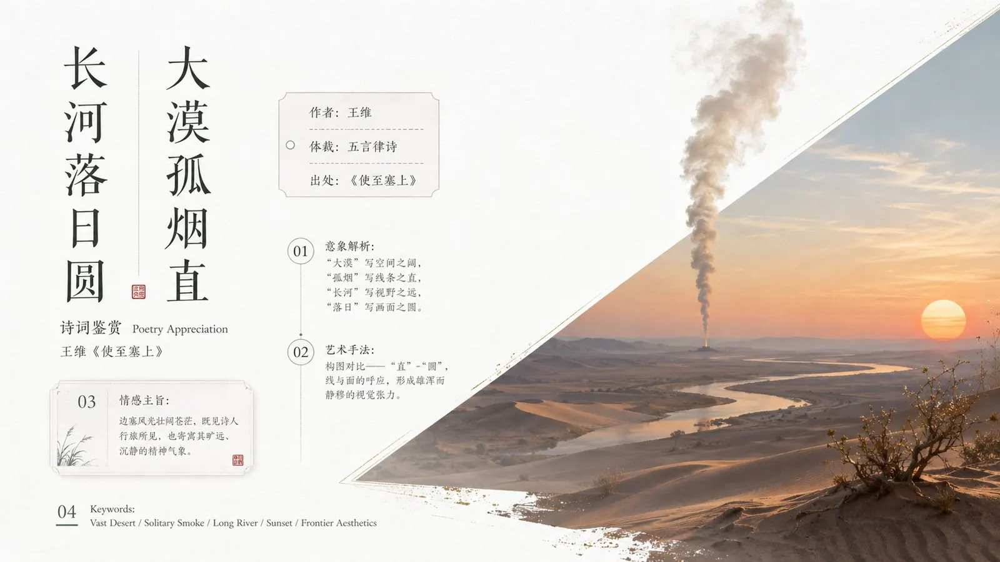 | 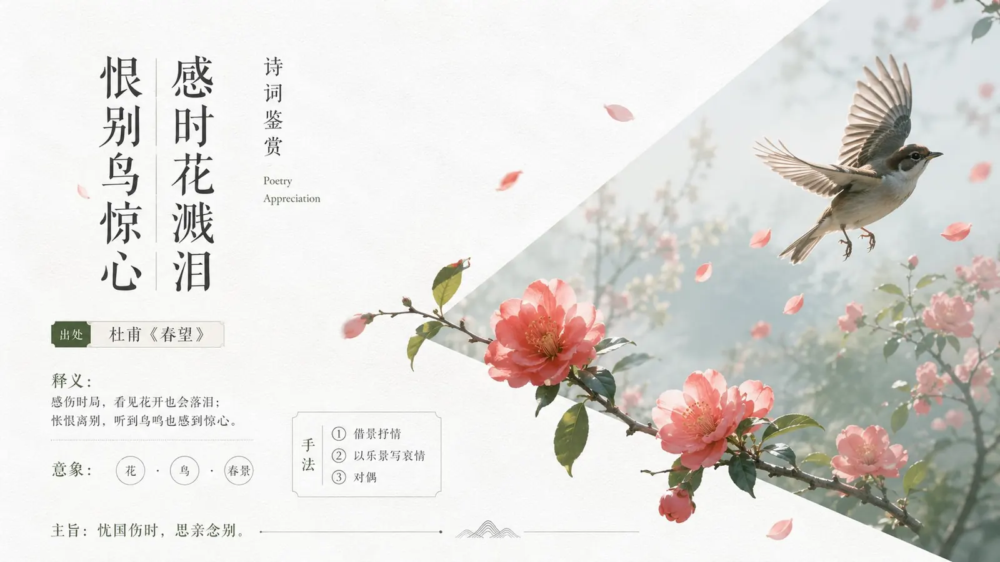 |

为【主题/用途】设计一张高级艺术海报/封面/主视觉，整体具有美术馆展览海报气质，画面以大面积暖米白留白为主，背景带有轻微纸张纹理和柔和印刷质感。

在画面右侧或斜向区域构建一个大型几何色块窗口，默认形状为斜切三角形，也可以根据主题变为不规则多边形、梯形、扇形或折纸般的几何切面。这个几何区域不是普通装饰色块，而是承载画面世界的“景窗”：内部使用低饱和、轻雾感、矿物色系渐变，包含【场景氛围/背景元素】，色彩克制、清透、有空气感。

将【核心物象】以真实摄影质感或精细写实方式置入几何色块之中，主体应与色块产生自然融合，但不要完全被困在色块内。让【核心物象】的局部轮廓、顶部、边缘、枝叶、烟雾、布料、光影或结构自然越过几何边界，延伸到米白留白区域，形成破框、生长、空间穿透和画面呼吸感。

构图保持非对称平衡，左侧或上方保留大量留白用于标题排版。文字采用克制的展览级排版，可使用竖排大标题、细字说明、极简英文副标题或馆藏标签式信息层级。文字颜色以墨黑、深灰或暗绿色为主，避免商业广告感。

整体风格：高级、安静、留白充足、东方审美、现代美术馆、精致印刷、低饱和色彩、几何裁切、真实物象破框、自然生长感、空间穿透感、极简但有张力。

核心物象的配色要鲜活突出，有生命力。

——————

本次主题：一骑红尘妃子笑，无人知是荔枝来

用途：诗词鉴赏

主视觉元素：顶级日系摄影风格，ins滤镜质感，电影级光影、明亮通透

其他要求：画面至少4个知识点，不同层级 不同逻辑和不同呈现方案的展示

用途： 诗词鉴赏

本次窗口形状：等边三角形

背景色： 纯白色patters纹理

每次输出，都在排版、创意、色相上富有变化

比例16：9

用途 课件ppt  第一张

比例16：9

用途 课件 ppt  第一张

高级东方文化视觉海报

| 预览 | 预览 |
| --- | --- |
| 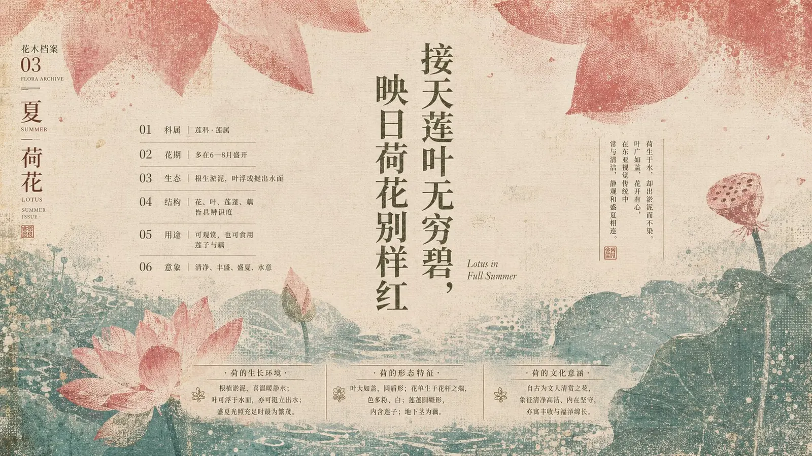 | 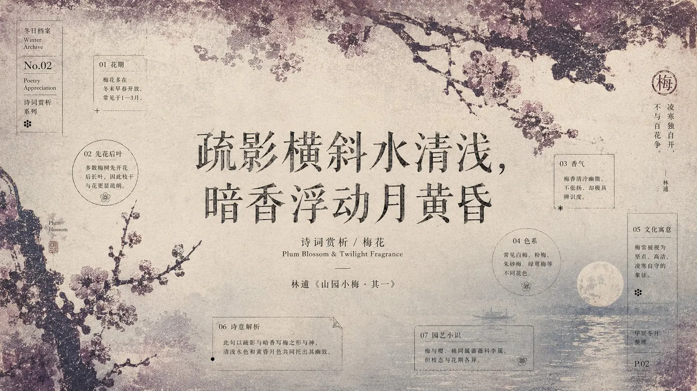 |

| 预览 | 预览 |
| --- | --- |
| 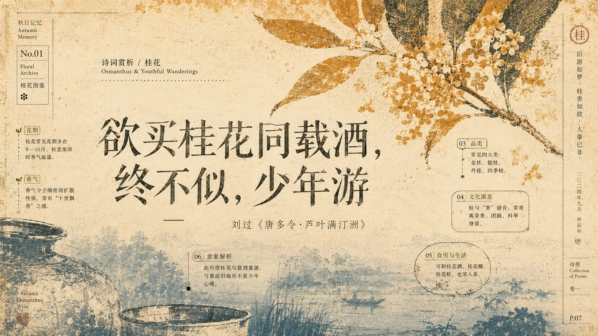 | 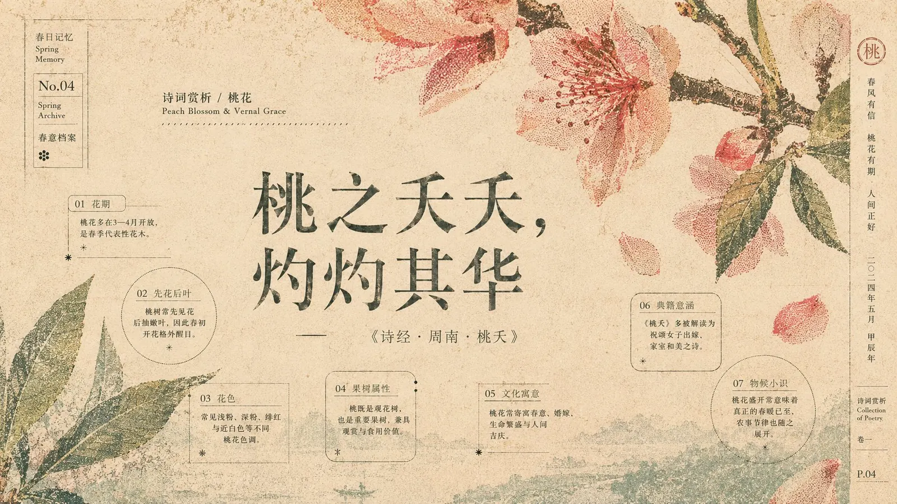 |

为【主题】设计一张高级东方编辑海报 / 文化视觉海报 / 节气海报 / 文学封面式海报。整体不要做成普通干净插画，而要做成一种“被时间、纸张、空气和旧印刷共同留下的视觉残影”。

画面的核心亮点是：使用与【主题】相关的巨大象征物剪影，例如【主题象征物】，让这些剪影从画面上方、下方或边缘大幅度裁切进入画面。不要完整展示物体，而是只展示局部、边缘、轮廓和被截断的形态，让图形像从画面之外自然侵入，产生高级、克制、留白丰富的构图张力。

这些剪影不能是干净的矢量图，也不能是普通插画。必须把它们处理成半调网点、丝网印刷颗粒、旧报纸网纹、risograph 复古印刷质感、破损油墨、漏印、错位套色、纸纤维侵蚀、边缘毛糙、局部褪色、局部断裂的效果。图形要像被印在旧纸上很多年后留下的残影，而不是刚刚画出来的图案。

构图采用“上下气候分层”的方式。画面上半部分使用偏暖色的图形处理，例如锈红、赭石、枯叶橙、旧朱砂、焦糖棕、暗橘色，用来表现【主题】中的外在情绪、热度、记忆、生命力、成熟感或历史感。画面下半部分使用偏冷色的图形处理，例如浅青、雾蓝、灰绿、冷青灰、淡水蓝、稀释蓝，用来表现【主题】中的内在情绪、空气、水汽、距离、寂静、梦境、回声或精神性。

背景不能是纯白。背景必须是温润旧纸质感，使用米白、象牙白、浅米黄、亚麻白、旧书页色作为底色，带有细微纸纹、横向纤维、轻微污痕、褪色颗粒、印刷压痕、旧海报磨损感。所有颜色都要像被纸张吸收过，低饱和、柔和、干燥、略微褪色，不能鲜艳发光，不能有现代数码渐变感。

画面中央或视觉重心处保留大面积呼吸感留白，用来放置【主题】主标题。主标题要成为画面的精神锚点，字体可以根据主题选择：东方题材使用宋体、碑刻感字体、书法感字体或现代中文刊物标题字体；现代题材可使用克制的衬线体、编辑杂志字体或极简标题字体。文字颜色不要纯黑，使用墨绿、灰绿、深茶色、旧墨色、褪色棕色，使文字也像印刷在纸上。

文字排版要有编辑设计感：主标题大而克制，副标题小而精致，可加入英文译名、日期、短句说明、竖排文字、边栏信息、编号、脚注式说明、图鉴式小字。小字不要喧宾夺主，要像旧书页、植物档案、诗集封面、展览海报上的说明文字。文字与图形之间要形成呼吸关系，不能拥挤。

画面需要有“纸上气候”的感觉：图形不是装饰，而是空气、温度、时间、记忆、情绪在纸上的沉积。暖色部分像阳光、火焰、秋叶、历史、生命余温；冷色部分像露水、雾气、河流、夜色、沉默、内心回声。上下色彩之间不需要硬分割，而是通过留白、纸纹、半调网点密度和色彩稀释自然过渡。

整体风格参考：东亚节气海报、复古丝网印刷、risograph 海报、旧书封面、植物档案图谱、诗集装帧、民艺印刷、旧报纸半调网点、日式季节海报、现代东方编辑设计。画面要有高级设计感、收藏感、文化感、纸张触感、时间感和克制的诗意。

避免：不要做成普通商业插画，不要干净矢量图，不要过度写实，不要塑料质感，不要霓虹色，不要高饱和渐变，不要卡通风，不要过度复杂背景，不要把主体完整居中摆放，不要让文字像后期贴上去。

最终画面应该像一张被时间保存下来的主题印刷物：巨大裁切的象征物在上下边缘形成冷暖对照，中间留白承托标题，纸纹、网点、漏印和褪色让整张画具有旧纸、气候、记忆和诗意残影的高级质感。

——————

本次是诗词赏析主题：欲买桂花同载酒，终不似少年游

你要给出对应花知识点 至少5个 相关不同存在逻辑和样式的信息点

同样逻辑给出 一共4次，每次都是不同的关于花朵的知名诗句

每张图片配色色相截然不同

比例16:9

## 旅行档案感视觉海报

| 预览 | 预览 |
| --- | --- |
|  | 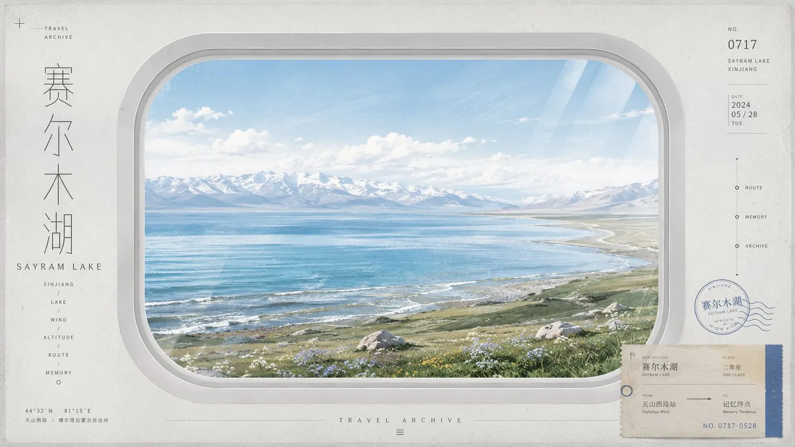 |

| 预览 | 预览 |
| --- | --- |
| 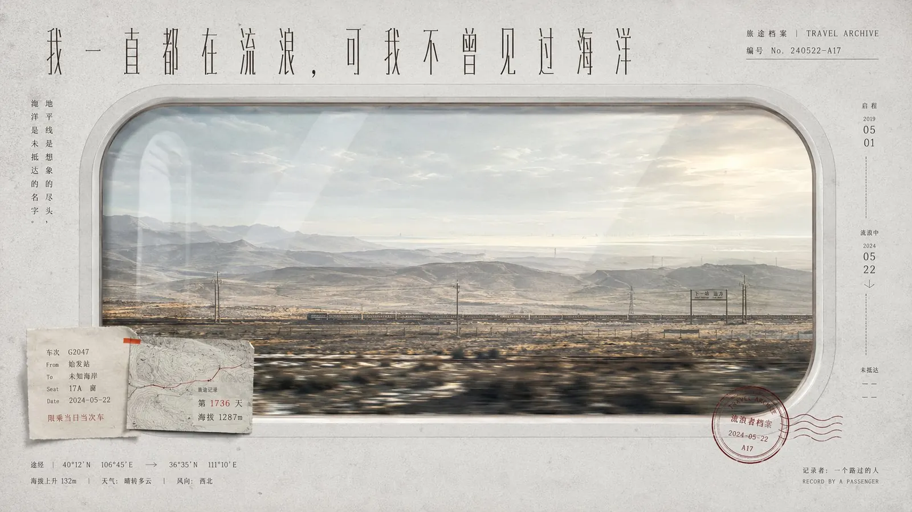 | 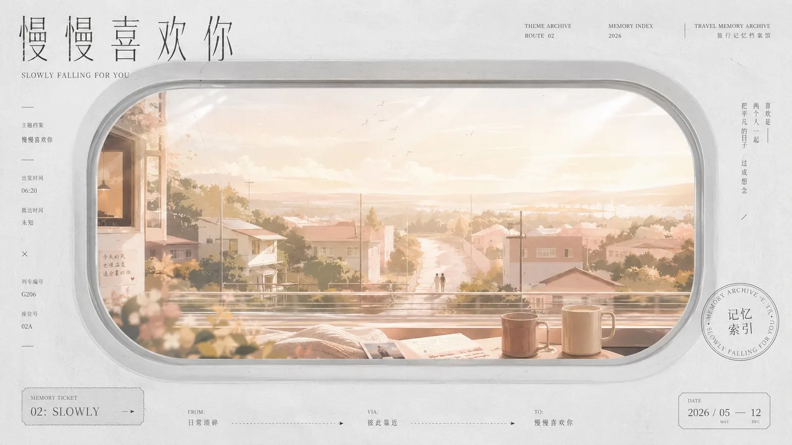 |

围绕具体主题内容生成一张竖版旅行档案感视觉海报。画面以巨大圆角高铁车窗式窗洞作为主结构，厚浅灰半透明窗框带轻微阴影，把外部灰白纸质海报壳和窗内主题视觉场清楚分开。外层保持冷灰、雾白、低饱和的纸面质感，带细微纤维颗粒、扫描噪点和大面积留白，只承载必要信息，不生成额外景物。窗外风景必须由主题自身推导，不从固定景物模板取材；先提炼主题的空间关系、材料质感、时间方向、情绪温度和核心符号，再转译为窗内三层视觉场：上层负责空气、光感与距离，中层负责结构轮廓与远近秩序，下层负责最高情绪密度和主要材质纹理。三层之间以横向过渡连接，形成从近处经过、向远处展开的移动观看感。窗内运动线必须从主题逻辑中生成，作为视线组织、时间流向和抵达感的共同线索。主题对象不作为孤立贴片出现，而被压缩为柔边色块、清楚剪影、局部结构、材质片段和符号性锚点，嵌入三层视觉场；近处保留细碎真实纹理，远处降低细节和饱和度，形成半扁平拼贴与局部真实肌理的混合。窗景表面叠加低透明玻璃斜光和淡白高光，轻轻覆盖主题场景，让观者明确是在隔着车窗观看。色彩保持外冷内亮、外静内开的关系：灰白纸面和浅灰窗框负责结构，深褐黑文字负责秩序，窗内主色从主题的情绪温度和材料属性中生成，强调色只作为记忆标记。文字像票据和展览索引一样参与版面，主标题使用极细、高挑、窄宽、宽字距的字骨，并与窗框边缘形成轻微压叠；时间轴、说明文字和细线圆章共同构成边缘信息系统。整体完成感是纸质海报、移动窗景、旅行凭证和主题记忆的融合，画面安静、清透、克制，窗内视觉场明亮、开阔、可被一眼记住。

——————

本次主题：慢慢喜欢你

注意：窗外的画面要体现这个主题

比例：

16:9 横板

## 城市高级海报

| 预览 | 预览 | 预览 |
| --- | --- | --- |
| 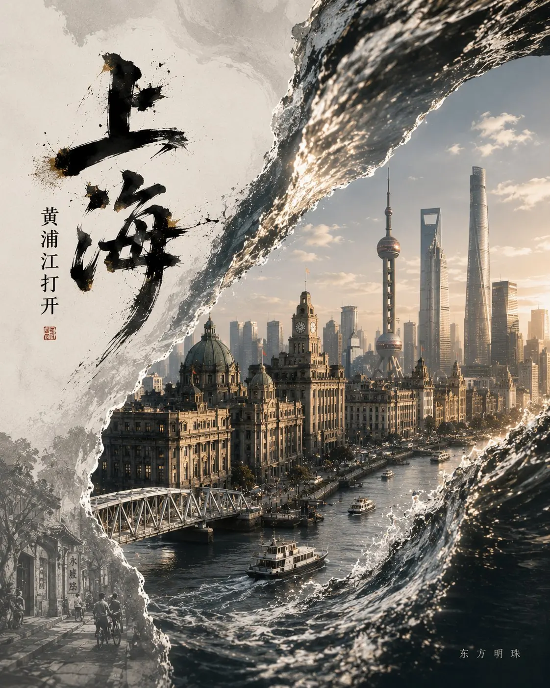 | 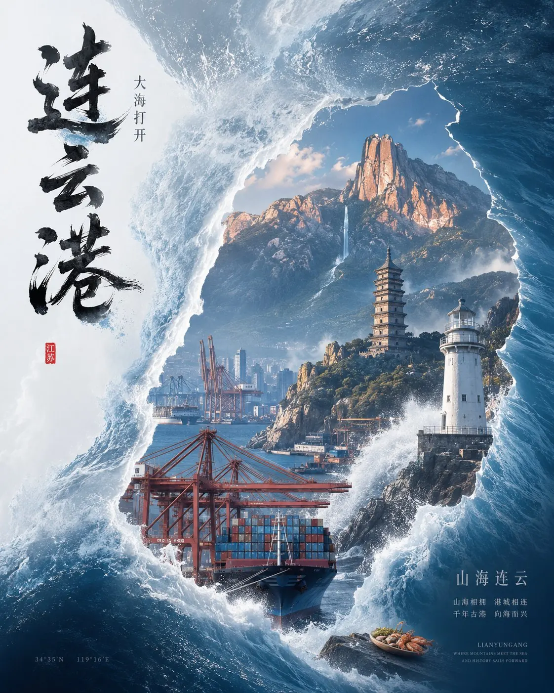 | 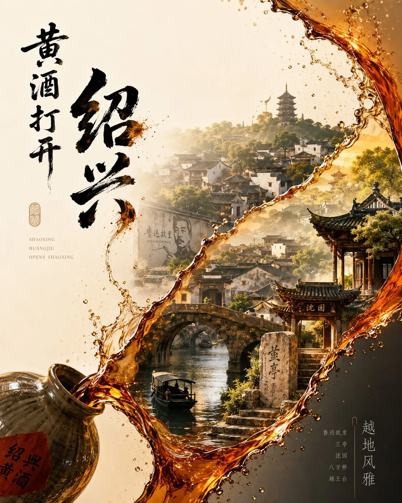 |

提示词如下，如果要换成其他城市，可以加入这句仿写的话在提示词前：根据这个提示词，把城市变量成（城市名），结构不变

提示词：

创作一张具有高级设计感的海报，比例4:5。以"黄酒打开绍兴"为创意核心，用绍兴黄酒作为视觉上的"打开"动作，揭示并呈现绍兴的城市面貌。画面整体采用克制而精确的现代设计语言，构图干净有力，具有高级感和概念深度。

### 创意核心

绍兴黄酒不再是单纯的背景元素，而是作为"打开者"存在。它像一条动态的琥珀色光裂、一道浸润的力量，或一次视觉上的揭示，把绍兴的越地与文脉、古朴与风雅"打开"并呈现出来。酒水与建筑之间要产生明显的互动关系和张力。

### 构图与设计语言

采用高级现代设计构图，强调秩序、分割与呼吸感。黄酒流淌的轨迹作为贯穿画面的动态元素，承担"打开"与分割画面的功能。建筑与酒水的关系需经过设计处理，既有真实感，又服务于整体的图形秩序和高级设计感。避免元素堆积，保持画面干净且有张力。

### 空间与穿透感

画面需营造清晰的空间层次。绍兴经典地标（鲁迅故里、兰亭、沈园、八字桥、越王台）作为被"打开"的核心主体，要具有强烈的真实体积感、光影和材质质感。部分建筑结构应产生明显的向前突出和"穿透屏幕"的真实存在感，仿佛正被黄酒的力量推向前方或从画面中突破出来。这种穿透感要自然且有力量。

### 视觉元素处理

绍兴经典地标（鲁迅故里、兰亭、沈园、八字桥、越王台等）为主要被打开的对象，真实质感 + 体积感 + 穿透感。

黄酒作为"打开"的动态力量，可结合琥珀色酒液流淌、光影折射或浸润感来强化概念。

其他元素（乌篷船、青石板老街、越剧水袖轮廓等）可作为辅助，适度融入被打开的结构中。

特色食物仅作为极小面积的点缀出现，位置克制且经过设计处理，不喧宾夺主。

### 文字与排版

标题文字采用中国传统毛笔行楷书法风格，"绍兴"二字纵向书写，墨色浓淡自然，笔触苍劲有力，墨迹飞白效果明显，墨迹边缘带轻微浸润晕染效果，与酒液流淌产生呼应。文字置于画面左上角黄金分割位，纯黑墨色为主，笔锋飞白处辅以微量琥珀色光泽点缀，字体尺寸约占画面1/4高度，视觉重量感强。右下角副标题"越地风雅"采用纤细仿宋体小字，灰白色系，与主标题形成粗与细、古与今的张力对比。

### 氛围要求

高级设计感、概念性、克制而有力量、黄酒作为打开动作、建筑具有真实体积与穿透感、精致的空间层次、光影自然且富有表现力。

最终画面应同时具备：清晰的高级设计语言 + "黄酒打开绍兴"的概念张力 + 绍兴地标的真实体积感和穿透屏幕的存在感 + 毛笔字标题的古韵力量感。

城市文旅海报

| 预览 | 预览 | 预览 | 预览 |
| --- | --- | --- | --- |
| 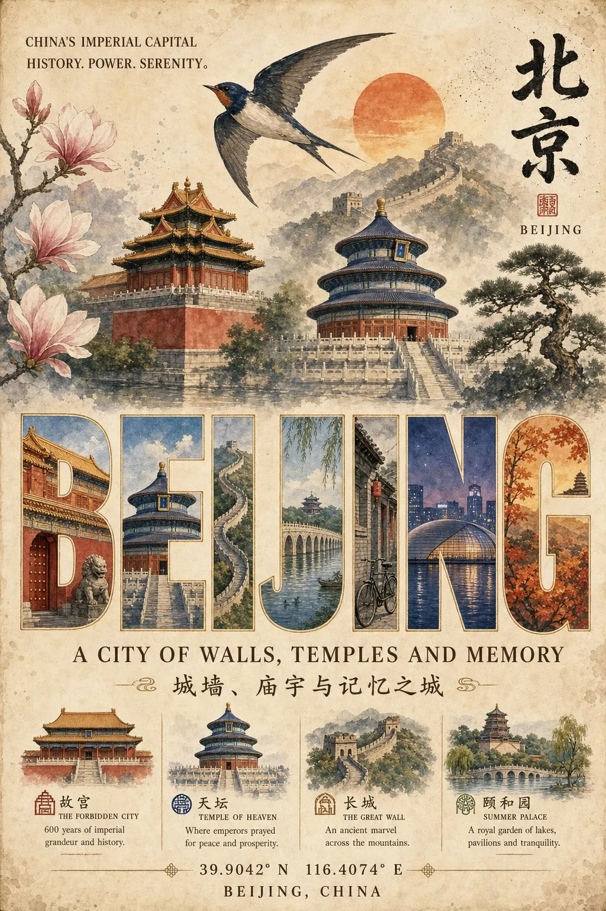 | 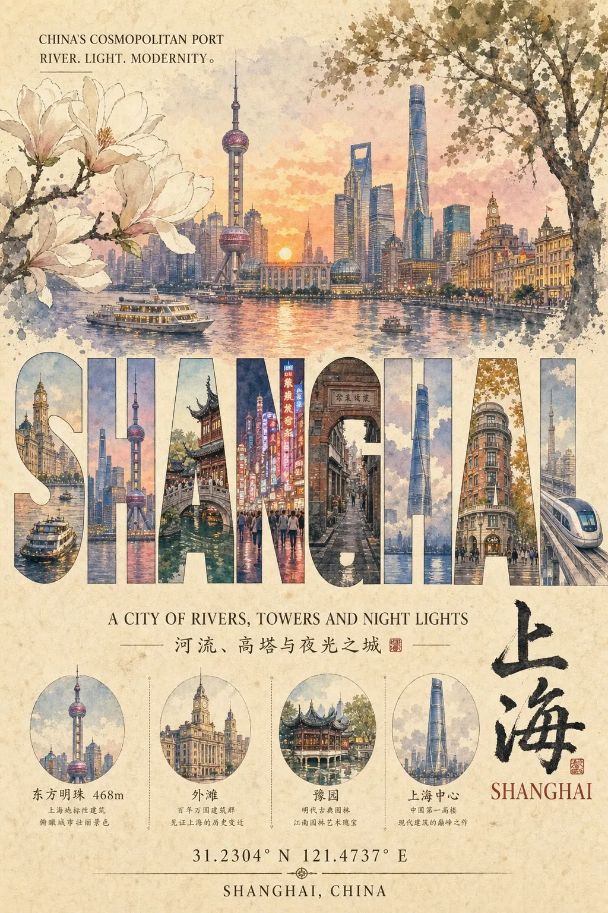 | 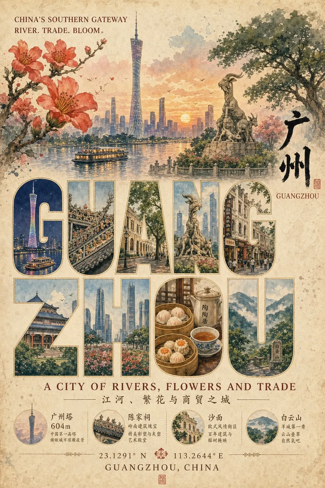 | 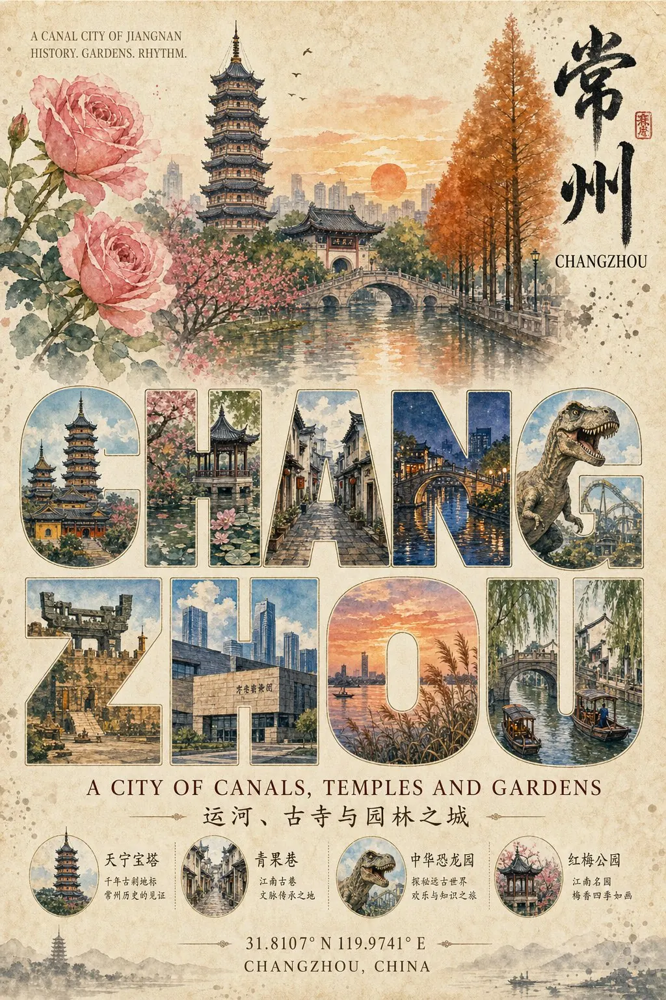 |
| 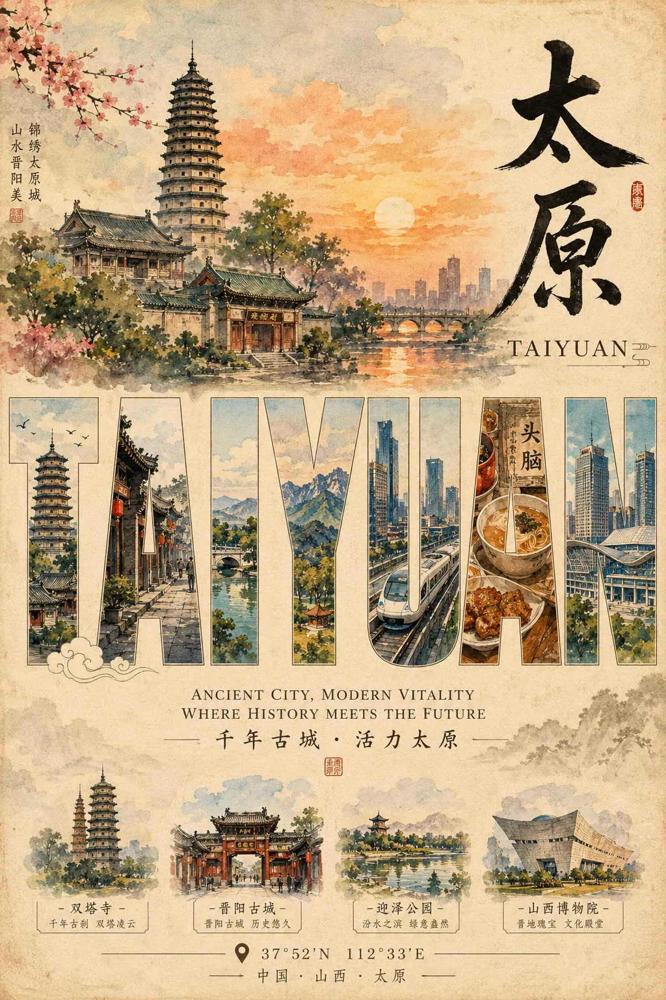 | 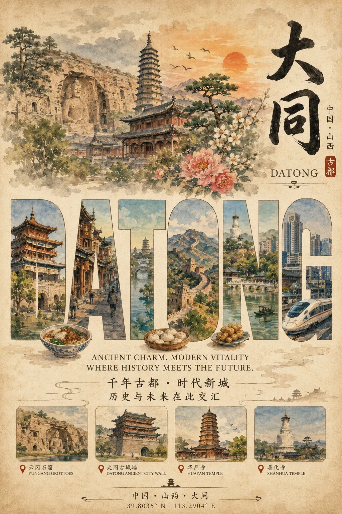 |  |  |

市地标 + 复古纸张 + 水彩墨水 + 大字母分镜。

[城市中文名]，[国家/地区]的水彩与墨水旅行海报，复古纹理纸张背景。上方展示城市代表地标、自然景观、日落、花卉和树木元素。右侧加入大型竖排中文书法“[城市中文名]”，下方写“[城市英文名]”。

中间用“[城市英文名大写]”作为主视觉文字，每个字母内部填充不同城市场景，包括地标建筑、老街、河流、山景、公园、交通、美食与现代建筑。

底部加入城市标语、中文翻译、四个地标小图标标签和城市坐标。柔和的水彩画，水墨插图，柔和的色调，复古的纸张质感，旅行海报，构图精细，竖向 2:3.

## 赛博朋克漫画角色海报

| 预览 | 预览 | 预览 | 预览 |
| --- | --- | --- | --- |
| 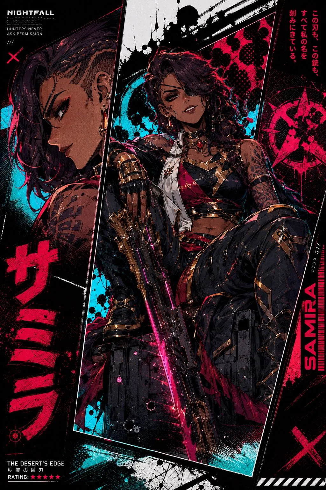 | 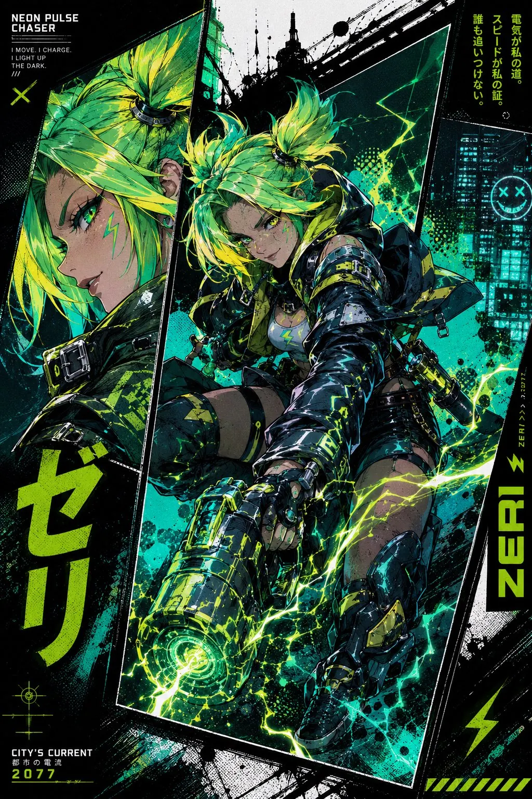 | 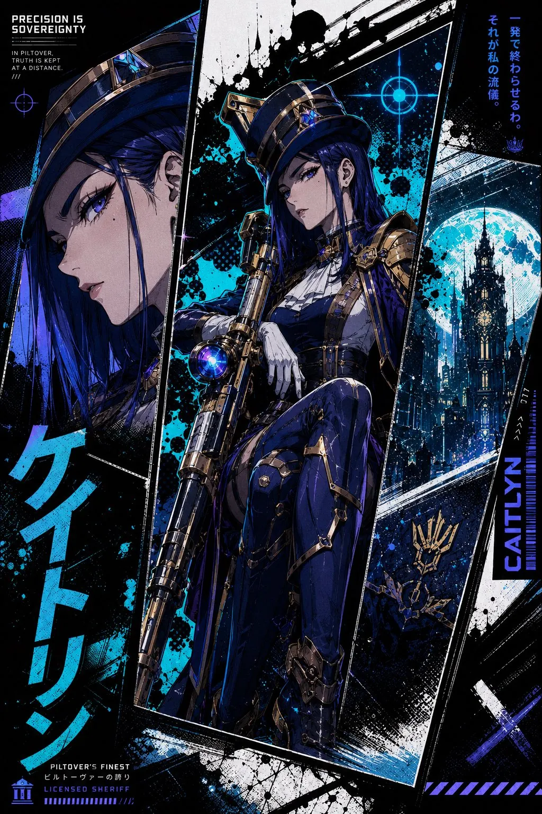 | 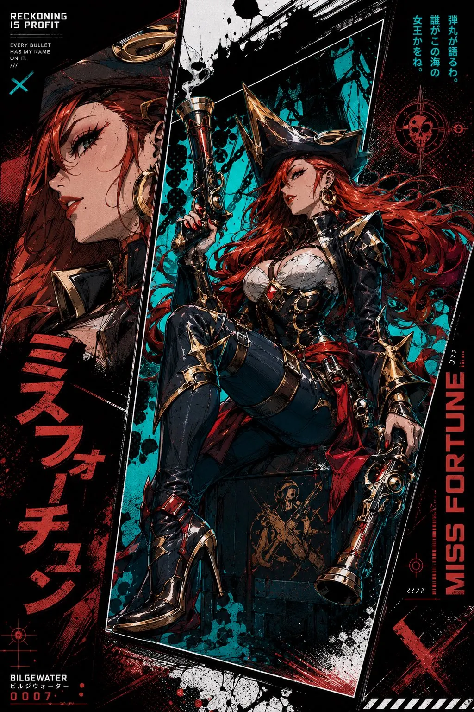 |

提示词:

生成一张 2:3 竖版赛博朋克漫画角色海报，整体风格为高完成度日漫 / 美漫融合的角色视觉企划海报。

画面采用多分镜斜切构图：左侧是一块竖向倾斜人物侧脸特写面板，中间是主角色半身或全身动态姿态，右侧加入窄条信息栏、角色英文名、日文竖排文字、编号、条形码、图标符号等视觉元素。整体像一张高级角色档案海报 / 赛博漫画封面 / 游戏角色宣传图。

主体角色为【角色名称 / 原创人物 / 上传参考人物】，需要保留角色最有辨识度的特征：

发型：【角色发型】

发色：【角色发色】

眼神：【冷静 / 疯狂 / 张扬 / 性感 / 坚定 / 狡黠】

服装：【角色标志服装 + 赛博朋克改造】

武器或道具：【枪械 / 长枪 / 双枪 / 电能武器 / 刀剑 / 机械装置】

角色气质：【精准优雅 / 疯狂叛逆 / 高速电流 / 危险张扬 / 海盗女王感】

画面中央角色姿态要有强烈视觉冲击，可以是坐在破损金属箱上、半蹲蓄势、手持武器俯视镜头、靠在机械装置旁、准备发动攻击等。动作自然、有压迫感，不要僵硬摆拍。

画面风格：

高对比黑色背景，霓虹青色、蓝紫色、荧光绿、猩红色、金属金作为主色调之一，根据角色性格调整配色。大量漫画网点、油墨飞溅、刮擦纹理、速度线、碎裂边框、涂鸦符号、半色调颗粒、故障风字体、HUD 标注、条形码、编号、日文排版。

左侧特写面板展示同一角色的侧脸或半侧脸，表情更克制、更有故事感。中间主画面展示角色完整造型和武器。背景可以加入城市夜景、巨大月亮、霓虹灯、工业废墟、海盗徽章、电流、瞄准镜、子弹轨迹、能量爆发等与角色相关的元素。

文字排版：

顶部加入一句英文短句：

【例如：PRECISION IS SOVEREIGNTY / NEON PULSE CHASER / NIGHTFALL / RECKONING IS PROFIT】

右侧竖排加入角色英文名：

【CAITLYN / ZERI / SAMIRA / MISS FORTUNE / JINX / 自定义角色名】

左侧加入大型日文片假名字体，做成粗糙喷墨质感。

底部加入地点或身份标签：

【PILTOVER / ZAUN / BILGEWATER / NIGHT CITY / DESERT EDGE / 自定义地点】

整体要求：

超清细节，强烈漫画线稿，赛博朋克霓虹光影，复杂但有秩序的海报排版，角色辨识度强，同系列统一视觉语言，不要普通插画感，不要干净空背景，不要低细节，不要拼图。

## 高级赛博故障艺术人像海报

| 预览 | 预览 | 预览 | 预览 |
| --- | --- | --- | --- |
|  |  |  |  |

提示词：

生成一张竖版 4:5 高级赛博故障艺术人像海报。

画面主体是一位年轻成年女性，坐在浅色沙发边缘，身体微微侧坐，姿态优雅自信。一只手轻扶透明或银色细框眼镜，另一只手自然撑在沙发扶手上。人物拥有长卷发、精致五官、清冷眼神，表情安静克制，带一点神秘感和高级时尚感。她穿着白色修身吊带上衣与白色短裙 / 短裤，整体造型干净、轻盈、现代。

整体风格为 赛博武士故障艺术 / 数字像素撕裂 / 青橙撞色海报 / 高级人像视觉实验。画面以白色留白背景为主，大量青蓝色、湖蓝色、橙红色的像素块、扫描线、数据碎片、几何矩形、泼墨颗粒和水平故障条纹从人物身体周围扩散开来。人物与沙发局部被数字碎片分解，形成半真实半抽象的视觉效果。

构图强调人物中心视觉，背景干净但层次丰富。左侧与下方使用深青蓝色大面积像素碎片增强厚重感，右上方加入橙色东方文字 / 武士感符号作为装饰元素，增强海报氛围。整体画面既有真实摄影质感，又有数字绘画和现代平面设计感。

光影为高级棚拍质感，皮肤细腻自然，面部清晰，眼镜反光轻微，头发细节丰富。色彩以青蓝、橙红、白色为主，形成强烈对比。画面干净、锐利、时尚、未来感强，像一张高端 AI 艺术账号封面或赛博人像视觉海报。

关键词：

赛博故障艺术，glitch art，pixel fragmentation，digital distortion，cyan and orange color palette，fashion portrait，white negative space，abstract geometry，scanline texture，cyber samurai aesthetic，editorial poster，high-end digital art，cinematic lighting，sharp details，4:5 vertical poster

## 醉意刚好

## 夜色未央

## 危险又迷人

排版要求：大号红色中文标题占据画面上方或左侧，英文标题使用优雅衬线字体穿插在中文旁边，局部加入红色故障扫描线、手写签名线条、条形码、细小信息栏、杂志封面式排版元素。文字需要有艺术价值，飘逸、破碎、流动，不要死板，不要淘宝风，不要廉价赛博风。

排版要求：大号红色中文标题占据画面上方或左侧，英文标题使用优雅衬线字体穿插在中文旁边，局部加入红色故障扫描线、手写签名线条、条形码、细小信息栏、杂志封面式排版元素。 文字需要有艺术价值，飘逸、破碎、流动，不要死板，不要淘宝风，不要廉价赛博风。

整体画面要像一组高级夜色时尚摄影海报：黑裙、眼镜、酒杯、红字、微醺情绪、电影感酒吧、红黑视觉系统。人物真实自然融入场景，不要像P图，不要脸崩，不要手部畸形，不要多余人物，不要低清晰度，不要廉价滤镜。

## 建筑蓝图海报

| 预览 | 预览 | 预览 | 预览 |
| --- | --- | --- | --- |
|  |  |  |  |

## 提示

创建一个高度精细的建筑蓝图海报集，包含四个标志性地标：莲花寺、伊丽莎白塔（伦敦大本钟/钟楼）、白宫和哈利法塔。使用复古工程蓝图美学风格，以深青蓝色背景、白色技术绘图线、尺寸标注、建筑图、平面图、荷载流子图、剖面图、立面图和结构细节为特色。每个地标都应包含：建筑物的大型逼真中心图像；周围的技术蓝图草图；工程注释和尺寸；材料和结构信息；平面图和地基图；简洁的网格状信息图布局；建筑制图风格的白色字体标签；带有柔和云朵的电影级天空；超精细的纹理和逼真的光照。地标：莲花寺——未来主义的莲花瓣几何形状和大理石结构；伊丽莎白塔（大本钟）——哥特式钟楼细节和钟体结构；白宫——带有立面图的新古典主义总统府；哈利法塔——带有高度对比图的未来主义摩天大楼。风格：建筑蓝图海报、工程信息图、技术绘图美学、超精细、简洁的构图、逼真的摄影与白色示意图线条艺术的结合、电影感、8K、博物馆级设计、蓝图纹理、复古绘图纸风格。

鲜艳马克笔旅行海报

| 预览 | 预览 | 预览 | 预览 |
| --- | --- | --- | --- |
|  |  |  |  |
|  |  |  |  |

| 预览 | 预览 | 预览 | 预览 |
| --- | --- | --- | --- |
|  |  |  |  |

请根据以下用户输入，创作一幅高品质的“活力四溢的旅行海报”

主题和主体（核心内容）

一张以“太原”为主题的充满活力的马克笔风格旅行海报，

包括：

[地标1]

[地标2]

[地标3]

等待具有代表性的地标和城市视觉元素的出现。

屏幕样式（样式）

总体采用率：

鲜艳的标记插图风格

粗标记图示

手绘旅行海报的美学

复古旅行宣传海报

涂色书视觉效果

草图式等高线

手工制作的艺术感

现代平面设计融入了复古字体设计

图像特征：

强烈的视觉冲击力

高度饱和的配色方案

手绘纹理

自由感和旅行氛围

城市探索感

线条与笔触

线条表示法：

粗马克笔笔迹

用粗黑墨水勾勒轮廓

手绘草图的感觉

富有表现力的阴影线

手绘草图边缘

不完美手工痕迹

俏皮的小瑕疵

墨水线条叠加和晕染效果

纹理表示：

记号笔分层色彩纹理

纸张的颗粒感

手绘涂抹痕迹

彩色油墨的渗透效果

4.调色板

整体颜色：

色彩高度饱和且鲜艳

鲜艳的对比色

旅行海报的色调

温暖而阳光的感觉

彩色记号笔的颜色匹配

常见颜色：

橙红色

湖蓝

柠檬黄

珊瑚粉

绿松石

紫色

奶油白色背景

重点：

色彩鲜艳，充满活力

视觉节奏

大面积纯色块

颜色边缘溢出效果

组合设计

组成方法：

动态城市风光拼贴图

多个地标的组合

层级式空间布局

海报式视觉中心

前景、中景和背景的层次结构

留白与图形之间的平衡

屏幕元素包括：

建筑学

街道

云

飞翔的鸟

树木

星期日

交通

城市标志

整体构成：

现代旅行海报设计

时尚的编辑布局

平衡而不失活力

强调视觉流程

6.排版

标题：

“【城市/地点】”

字体样式：

复古旅行海报字体

标题布局

手绘英文字体

时尚旅游杂志的感觉

现代与复古风格的结合

文本特征：

醒目且引人注目

强大的视觉识别能力

海报级布局设计

灯光与氛围

氛围关键词：

阳光明媚的旅行感受

自由探索的氛围

夏季城市活力

充满年轻时尚的旅行氛围

活力与艺术感的结合

视觉效果：

景深较浅

本地亮点

温暖的阳光照耀

纸张表面的漫反射

细节增强

地址：

超高细节

精细的建筑纹理

城市信息密度

丰富的小元素

手绘贴纸质感

旅行日记视觉呈现

艺术书籍封面的质感

9.  质量关键词

极其详细

高度详细

杰作

充满活力的旅行海报

标记图示

写生本美学

复古旅游海报

手绘纹理

图形设计构图

色彩斑斓的城市插画

富有表现力的墨水线条

俏皮的不完美之处

10.  参数建议（可选）

--ar 9:16

海报构图

景深较浅

## 鲜艳的色彩

## 高对比度

## 超写实UE5影视级竖版角色海报

| 预览 | 预览 | 预览 | 预览 |
| --- | --- | --- | --- |
|  |  |  |  |

## 人物真实细节（去二次元、极致真人CG写实）

人体解剖结构100%精准真实，肩颈、胸腔、手臂肌肉线条流畅自然，肌肉起伏符合人体发力逻辑，不夸张不畸形。皮肤为真实人类肌肤质感：细腻毛孔、淡淡皮肤绒毛、清晰自然的皮下血管纹路、轻微肌肤肌理、真实肤色通透感，无磨皮、无塑料感、无光滑假皮。

面部五官立体深邃，比例真实协调，尼卡形态标志性锐利眼神，瞳孔光影通透、眼神坚定霸气，情绪张力饱满。发丝根根分明、蓬松有层次、光影贴合头发生长结构，自然飘逸不僵硬。

服饰面料极致写实：尼卡形态标志性纯白+鎏金服装，布料纹理、针织肌理、轻微褶皱、垂坠感真实自然，金边描边质感立体，金属磨蚀、微光鎏金真实材质，面料光影过渡细腻，无平涂色块、无廉价贴图感。

## 光影氛围（电影棚拍真实质感）

专业影视棚布光：主光柔和塑形，强对比冷暖双光勾勒，人物边缘高亮轮廓光，分离主体与背景；细腻体积光、空气微尘光束、浅景深虚化效果。明暗层次高级，暗部不死黑、亮部不过曝，光影贴合人体结构，立体厚重、真实高级。

画面视觉文案与科技UI排版

画面左侧竖排超大艺术字：GEAR 5 / NIKA，字体硬朗粗粝，自带复古印刷做旧质感：自然斑驳墨迹、不规则细微划痕、锋利切割边缘、复古海报颗粒磨损纹理，立体浮雕质感，不突兀、贴合整体影视调性。

文字下方搭配极简科技风角色档案UI面板，包含：专属ID编号、人物基础资料、战斗数值参数、条码标识、细微警告小字、极简伪科技数据文本，排版规整高级，赛博军事档案风格，极简不杂乱，点缀画面层次。

整体色调与氛围

以尼卡形态标志性纯白、暖金、淡暖黄为主色调，搭配低饱和深阴影对比，色调干净通透、高级治愈又充满战力压迫感，整体风格：超写实真人CG、暗黑轻奢、热血高级、电影海报质感。

严格规避（防AI瑕疵）

杜绝畸形手脚、错误透视、错乱解剖、模糊纹理、油画糊感、二次元塑料感、过度锐化、色彩脏污、文字乱码、UI错位、画面空洞、光影虚假、面部崩坏、对称僵硬、模板感。

## 古典人物 MBTI 高端国风信息海报

| 预览 | 预览 |
| --- | --- |
|  |  |

提示词：

请生成一张【中国古典人物 MBTI 高端国风信息海报】。

### 人物

人物名称：{人物名}

### 前置分析要求

请先基于该人物在中国古典文学、历史叙事或民间文化中的主流形象，完成并应用以下信息：

人物拼音：使用规范汉语拼音，带声调优先

MBTI 类型：选择最符合人物核心性格的类型

MBTI 英文称号：使用常见 MBTI 称号，如 The Commander / The Logistician / The Advocate

中文人格标签：用 8—14 字概括人物气质

人物特征提取：身份定位

核心价值

性格关键词 4—6 个

标志造型元素

代表性道具 / 兵器 / 坐骑

经典故事元素 1—3 个

人物结局或历史评价

若资料存在争议，采用最符合大众认知的版本；不确定的信息不得编造；经典语录若无法确认出处，则改写为符合人物精神的原创短句，并避免伪造名言。

### 整体风格

竖版 3:4 构图，4K 超清，高端国风人物设定海报。

画面融合：中国水墨、淡彩工笔、宣纸肌理、传统中式纹样、现代精品信息图排版。

背景为温润米白宣纸色，带淡墨云烟、回纹、窗棂格栅、朱砂印章点缀。

整体气质：典雅、庄重、收藏级、文化感强、干净高级。

### 核心视觉：3D 夺框而出

人物主体必须具有强烈的“3D 破框而出 / 夺框而出 / 从画中跃出”半写实效果。

人物上半身或全身位于中央主视觉区，形成明显前后景深。

人物的衣袖、兵器、飘带、发须、坐骑、云雾或标志道具可突破中式边框，产生立体浮雕式出框感。

视觉重点必须是人物，不得被文字、背景或装饰抢占。

保持东方古典审美，不要现代游戏 UI，不要赛博朋克，不要西式奇幻盔甲，不要夸张动漫脸。

### 人物造型

根据 {人物名} 的主流形象设计：

保留最具辨识度的服饰、面部特征、姿态、道具与时代气质

神态需符合人物性格：威严、沉静、悲壮、儒雅、桀骜、仁厚或智谋，由人物设定决定

动作应具有叙事感，体现人物命运与人格力量

背景可淡化加入经典情节场景，但不得喧宾夺主

### 版式结构

海报分为三大区域：

一、顶部标题区

主标题：{人物名}（{拼音}）

大字号 MBTI：{MBTI 类型}

英文称号：{MBTI 英文称号}

中文人格标签：{中文人格标签}

使用传统窗棂 / 格栅边框包裹标题区

标题清晰、端正、醒目，具有书法感与现代排版平衡

二、中部主视觉区

人物占画面核心位置

3D 夺框而出效果最明显

水墨淡彩渲染，衣纹、面部、兵器细节精致

背景融入人物代表性故事元素，如战场云烟、楼台、江水、山河、宫阙、竹林、月色等

整体具有东方史诗感与人物命运感

三、底部信息区

设计为 4 个整齐模块，像高级国风 MBTI 信息图：

模块一｜人物介绍

用 40—60 字介绍人物出处、身份、核心形象与文化地位。

模块二｜性格特质

列出 4—6 个关键词，每个关键词配 4—8 字短说明。

格式示例：忠义｜重诺守信

模块三｜经典语录

放置 1 句短语，要求不超过 18 字。

若真实名言不确定，使用符合人物精神的概括性表达，不伪造出处。

模块四｜人物档案

包含：时代 / 阵营 / 身份 / 标志道具 / 经典情节 / 结局或评价。

信息必须短、准、可读。

### 文字要求

全图使用简体中文。

中文文字必须清晰、端正、无乱码、无错别字。

正文短句化，避免长段文字。

标题层级清楚：人物名最大，MBTI 次之，模块标题清晰。

底部模块留白充足，不拥挤，不堆字。

### 色彩

主色：宣纸米白、淡墨灰、朱砂红、沉金色。

辅色根据人物气质调整，如青绿、玄黑、赤红、玉白、赭石。

色彩克制，高级，不艳俗。

### 负面约束

不要现代街头服装。

不要科幻机甲。

不要欧美奇幻风。

不要过度卡通。

不要低清晰度。

不要乱码文字。

不要错误拼音。

不要错误人物身份。

不要把人物画成无关角色。

不要让底部信息区遮挡人物主体。

不要杂乱背景。

不要廉价游戏宣传页质感。

### 最终输出

直接生成完整海报画面：

竖版 3:4，4K Ultra HD，中国水墨淡彩，高级国风信息图，人物 3D 夺框而出，MBTI 信息完整，文字清晰，排版精致，收藏级视觉效果。

人物：潘金莲

## 春季美学剪贴簿海报

| 预览 | 预览 |
| --- | --- |
|  |  |

可爱的韩国春季美学剪贴簿海报，梦幻的韩时尚肖像，柔和的金发女孩站在盛开的花园里，淡蓝色的天空背景，奶油色花卉衬衫叠加在针织象牙色毛衣背心下，浅蓝色高腰牛仔裤，自然微笑，光泽白皙的皮肤，柔和妆容，樱花树，色彩斑斓的春花，温馨的乡村花园，明亮的自然阳光，可爱的涂鸦叠加层， 手绘白色爱心、笑脸、星星、闪光、彩虹、俏皮手写字体、宝丽来相框、遮蔽胶带贴纸、剪贴簿拼贴版面、Pinterest 美学、韩国杂志社论、乡村风时尚、梦幻春天氛围、健康氛围、柔和的粉彩调色板、干净的构图、美感社交媒体海报、极细致、照片级写实、高品质、可爱迷人的氛围、细腻散景、生活方式摄影、Instagram 短片封面， 时尚情绪板，千禧年剪贴簿设计，主题周围白色轮廓，花卉主题装饰，8K 杰作

Plain Text【画面比例】9:16 竖构图 / Instagram 短视频封面 / 小红书海报构图【主题】{春日少女写真 / 海边旅行 / 校园时尚 / 森系治愈 / 夏日杂志 / 樱花氛围 / 法式复古 / 千禧年拼贴}【整体视觉风格】梦幻剪贴簿美学、Pinterest 美学、时尚情绪板、INS 风杂志社论、生活方式摄影、少女感社交媒体海报、千禧年拼贴设计、韩系氛围感、柔和空气感、治愈系视觉、手账拼贴风格、杂志封面感、轻盈呼吸感画面【人物主体】一位{甜美少女 / 文艺女孩 / 韩系女生 / 日系少年 / 法式少女}，{柔顺浅棕长发 / 金色卷发 / 黑色短发 / 空气刘海}，白皙透亮肌肤，轻薄自然妆容，清透裸感妆面，自然微笑，温柔眼神，站在画面中央，身体微微侧身，动作自然放松，服装具有强烈时尚杂志感【服装穿搭】上身穿着：{奶油色花卉衬衫 + 象牙白针织背心}或{宽松奶白毛衣 + 浅色格纹短裙}或{法式碎花连衣裙}下身：{浅蓝高腰牛仔裤 / 百褶裙 / 白色长裙 / 牛仔短裤}整体配色柔和统一，低饱和奶油色系，具有韩系穿搭氛围【场景环境】人物站在：{春日花园 / 樱花街道 / 海边小镇 / 森林草地 / 乡村庭院 / 日落花海}，周围有：盛开的樱花树、彩色春花、小雏菊、郁金香、草坪、木质围栏、飘落花瓣、柔软云朵，背景是干净通透的淡蓝天空，环境充满温暖春天气息，具有梦幻电影感【光影氛围】明亮自然阳光，柔和晨间光线，轻微逆光，空气中带有淡淡发光感，柔和高光，细腻散景，胶片摄影氛围，生活方式摄影质感，梦幻电影级光影，整体画面通透明亮【拼贴装饰元素】画面叠加：白色手绘爱心、笑脸、星星、彩虹、闪光、小花、箭头、可爱 doodle 涂鸦，加入：宝丽来相框、遮蔽胶带贴纸、便利贴、手账贴纸、撕纸边缘、白色描边轮廓、杂志拼贴版面、纸张纹理、千禧年剪贴簿设计元素，整体具有强烈 Pinterest 拼贴感【文字排版元素】加入：韩系手写字体、可爱手账标题、杂志感英文排版、贴纸式文字设计、社交媒体封面标题，文字布局自然分散在画面四周，增强时尚杂志感【色彩系统】整体采用：奶油白、樱花粉、天空蓝、蜜桃粉、浅鼠尾草绿、低饱和粉彩色调，色彩轻盈柔和，具有空气感与高级感，避免高饱和商业广告感【摄影与构图】时尚杂志摄影构图，主体突出，前中后景层次明显，留白干净，画面具有呼吸感，微广角镜头，轻微景深虚化，高级生活方式摄影，Instagram Reel 封面构图，小红书爆款封面视觉【画质细节】超精细细节，照片级写实，极致细腻皮肤，高品质纹理，电影级画面，真实服装褶皱，真实花卉细节，柔和头发光泽，高级杂志封面质感，8K 超清画质，大师级视觉效果【万能替换主题】只替换以下内容即可快速生成不同风格：主题：{春日 / 夏日 / 秋日 / 冬日 / 海边 / 校园 / 森林 / 城市 / 咖啡馆 / 旅行}人物：{少女 / 男生 / 情侣 / 二次元角色 / 模特}风格：{韩系 / 日系 / 法式 / 美式复古 / 千禧年 / 森系}场景：{樱花 / 海边 / 草地 / 城市夜景 / 雨天 / 花海}【最终强化词】梦幻氛围、治愈感、少女感、时尚杂志感、Pinterest 美学、INS 风、高级拼贴设计、轻盈空气感、社交媒体爆款视觉、超高审美、电影级摄影、极致细节、8K、大师级作品

## 玻璃雾化封面秩序的视觉

| 预览 | 预览 |
| --- | --- |
|  |  |

以具体主题内容为核心生成一张具有作品集封面秩序的视觉作品。核心对象不要完整陈列，而是先被压缩成一个偏离中轴的主质量，沉入半透明雾化表层与低饱和背景场之间；对象的完整轮廓、次要细节和普通说明都被压花玻璃颗粒、细小折射位移、乳白雾化和低对比模糊吞没，只在最能承载主题识别的位置切出一条干净清晰的窄窗，让该局部保留真实质感、较高对比和必要色彩，其余部分化为暗部质量、柔化轮廓、破碎边缘和被背景吃掉的过渡。清晰窄窗要像从材料表面擦开的精确缝隙，尺寸克制但语义准确，成为观者进入主题的唯一强入口。背景由主题的空间关系、材料属性、时间方向和情绪温度推导成大面积低噪声色场，上部或外侧保留轻空气感，一侧形成淡色呼吸区，主体所在区域压入更低明度；背景不承担普通场景叙事，而承担吞没边缘、承载白色文字、制造距离和记忆感的结构功能。色彩保持大面积低饱和结构色、低明度主体色、少量集中真实色和白色信息色之间的比例，色相随主题改变，明度层级、饱和度克制和局部色彩价值保持稳定。画面使用清晰、半清晰、失焦三层：清晰窄窗负责主题识别，短促粗白标题和编号保持半清晰可读，主体大部、背景和底部微型信息进入雾化失焦。文字采用现代无衬线字体，白色或近白，粗标题短促、厚重、像印在玻璃上并被表层轻微咬边；角落标识、边缘日期、编号和底部微型注释组成元数据坐标系，像作品编号、档案记录和制作参数，文字服务于阅读路线而不遮盖清晰窄窗。整体表面保留可见的颗粒压花玻璃触感，纹理随底层明暗改变密度，暗部更密集，亮部更乳白，边缘出现细碎折射和轻微位移，所有图像、对象和文字都像被同一块材料统一压住。最终画面应呈现冷静、克制、带技术档案感的视觉封面：信息被有意识地隐藏，只有最关键的局部被释放。

本次主题：疯狂星期四 KFC

比例：9:10

## 复古印刷

| 预览 | 预览 |
| --- | --- |
|  |  |

围绕具体主题内容生成一张竖版印刷海报，先把主题转译为一个放大的触感主标本或主物质团块，放在画面中心或中下部，让它拥有清楚的识别边缘、柔软体积、局部高密度细节和可触摸的材质变化。主体不孤立展示，而是被巨型标题、边缘文字、硬边棋盘模块和低对比说明文字共同夹持；标题使用有重量、有明确骨架的字体，成为顶部、底部或侧边的边缘建筑，像墙面、底座或侧栏一样参与构图，文字先形成结构，再承载语义。让主体的轮廓、附属片段、材质边缘或象征性碎片局部压过标题、竖排字和几何块，形成清楚但克制的前后层次，使图像与版式互相穿插而不是彼此回避。背景是一整张温暖、低噪声、可印刷的纸场，带细微纸纹、纤维、颗粒和轻微吸墨感，用来统一写实主体、平面文字和几何色块；背景保持呼吸和媒介感，不制造真实空间。色彩按职责分层，纸底占最大面积，主体保留最细腻的情绪色、柔和渐变和局部饱和，标题、边缘字或棋盘格使用更平、更稳定的结构色，正文和注释以低对比退入纸面，整体有明确面积差、明度秩序和甜度被结构压住的平衡。边角放置一到两个硬边棋盘模块作为平面节奏锚，它们无透视、无投影，直接印在纸上，用来平衡主体曲线、标题体量和空白压力。小正文不要像独立说明卡，而要压缩成紧凑的信息纹理，嵌入主体周围的空白缝隙，保持短行距、克制颜色和编辑说明感。主体的细节只集中在最能传达触感和主题身份的位置，其余附属边缘允许被裁切、遮挡、轻微柔化，让画面保持主次。最终表面带复古印刷钝化，文字边缘略柔，色块有油墨沉积，纸纹穿过所有图层但不糊掉主体细节，整体呈现经过精心排印的编辑海报、包装图版和标本说明混合体。

本次主题：苹果促销海报

比例9:10

Plain Text

## 3D 微型旅游邮票立体模型

| 预览 | 预览 | 预览 | 预览 |
| --- | --- | --- | --- |
|  |  |  |  |

超细致的 3D 微型旅游邮票立体模型，标志性世界地标从逼真的邮票中浮现，漂浮在鲜艳的橙色工作室背景上，等角视角，微小人物漫步，蓬松漂浮的云朵投下柔和阴影，电影般的灯光，逼真建筑，复杂的城市细节，晶莹剔透的水面倒影，奢华旅游广告，收藏微缩世界，倾斜摄影，超写实纹理，高端旅游海报设计， 旅行明信片美学，简洁的排版融入邮票边框，目的地名称用粗体现代，标语下方，深度与比例错觉，全球探险者主题，获奖 3D 渲染，Octane Render，虚幻引擎 5，全局光照，光线追踪，超锐利焦点，鲜艳色彩，8K 杰作

## 高端极简主义汽车海报

| 预览 | 预览 | 预览 | 预览 |
| --- | --- | --- | --- |
|  |  |  |  |

提示：为[汽车名称/型号]创作一张高端极简主义汽车海报，灵感来自豪华汽车杂志广告。

使用简洁的竖屏 9:16 比例 Instagram Reels/Stories 构图，并搭配醒目的纯色背景（背景色为 [BACKGROUND COLOR]）。背景色应与汽车的个性、品牌形象、时代背景和整体氛围相符。

将汽车作为画面中下方的主要主体。汽车应看起来逼真、高级、线条清晰、光泽亮丽且细节丰富，比例准确，反射清晰，边缘锐利，采用影棚级照明，并在车底营造出自然的阴影。

在车后添加巨大的超大字体，显示汽车型号名称：[大字]”。

字体排印方向：

选择与汽车的个性、时代和设计语言相匹配的字体风格。不要总是使用同一种粗体高挑的字体。

随机选择或智能选择一种字体样式：

适用于豪华轿车、SUV 和经典高档汽车的高挑粗体字体

适用于超级跑车、电动汽车和概念车的宽大未来主义字体

适用于跑车和高性能汽车的动感锐利字体

复古衬线字体或复古海报字体，适用于经典汽车

优雅纤细的奢华衬线字体，适用于高端豪华汽车

适用于时尚生活方式汽车或经典复古车型的创意草书/手写字体

适用于赛博朋克、电动、未来主义或改装汽车的故障/扭曲数字字体

适用于越野SUV和探险车辆的坚固耐用的工业风镂空字体

适用于赛道用车、拉力赛车和超级跑车的赛车贴纸风格字体

简约简洁的几何无衬线字体，适用于现代电动汽车和清洁型豪华汽车。

背景中的大字体应该体现出汽车的独特风格，而不是千篇一律的通用字体。

根据汽车主题的不同，它可以是超大尺寸、拉伸、堆叠、倾斜、部分裁剪、透明、轮廓化、浮雕、阴影、分层或与背景融合。

在顶部添加间距较小的品牌文字：[品牌名称]。顶部和两侧留出足够的空白，以营造简洁高端的布局。

风格：豪华汽车海报，极简主义编辑布局，高端汽车杂志美学，逼真的汽车渲染，干净的阴影，大胆的色彩对比，优质的字体，没有多余的物体，没有人，没有杂乱的画面。

宽高比：9:16

## 城市味觉档案海报

| 预览 | 预览 | 预览 | 预览 |
| --- | --- | --- | --- |
|  |  |  |  |
|  |  |  |  |

《城市味觉档案》海报简版提示词：

生成一张《城市味觉档案 》系列海报，主题为“One City, One Dish / 一城一菜”。

城市：【城市名】

代表菜：【菜品名】

品牌名：【品牌名】根据代表菜，自行添加

主标题：【城市名】你好

口号：【口号文案】根据代表处，自行添加

印章文字：【印章文字】根据城市自行添加

英文辅助：HELLO 【城市英文名】 / ONE CITY ONE DISH

画幅比例：4:5 竖版

画面要求：

前景放置一道真实、有食欲、清晰明亮的【菜品名】，作为画面最大视觉主体，占据下半部分，食材、酱汁、热气、配料和器皿质感要明显，菜品要比背景更鲜明。

背景使用【城市名】代表性地标建筑群，采用“主地标 + 半透明副地标 + 城市远景”的层叠结构，形成城市旧影和地标群氛围。背景带有旧纸张、旧墙面、半调网点、颗粒印刷、斑驳肌理和复古海报质感，但这些质感主要作用于背景，不要压暗菜品。

文字只保留核心信息：大标题“【城市名】你好”、菜品名、品牌名、手写体口号、小红印章、少量英文辅助。不要出现日期，不要堆满小字。大标题要用亮米白或暖白书法字，和背景形成强对比。

整体风格：高级餐饮品牌海报、城市风味视觉档案、地方文化、复古印刷、地标叠影、真实美食摄影、时尚专业、有层次感。不要做成菜单、廉价促销图、卡通图、四宫格或多图合并。

高端现代艺术杂志封面感插画

| 预览 | 预览 |
| --- | --- |
|  |  |

高端现代艺术杂志封面感插画，主体为【猫】。

极简现代数字艺术风格。

采用森林绿、鼠尾草绿、苔藓绿、奶油白作为核心配色体系。

大面积留白与负空间设计。

柔和自然光从侧上方照射，形成干净明确的大色块光影关系。

以简洁几何面与流畅轮廓塑造主体。

细节高度概括，但造型准确优雅。

画面保持极高统一性与秩序感。

背景干净纯粹，无复杂环境。

整体具有国际艺术杂志封面、北欧设计年鉴、精品生活方式品牌广告与现代美术馆海报融合气质。

宁静、克制、高级、富有呼吸感。

无文字、无Logo、无水印。

超高审美。

手工3D 纸质拼贴植物旅行海报

| 预览 | 预览 | 预览 |
| --- | --- | --- |
|  |  |  |

## 粉彩纸拼贴植物园旅行海报

创作一幅博物馆级别的纯手工 3D 纸拼贴植物旅行海报，描绘 [城市/地点]、[国家]，将其重新构想为一个梦幻般的 [植物主题] 花园天堂。

核心概念：通过[地点]著名的[植物特征]、迷人的花园氛围以及2-3种标志性植物元素，展现[地点]的[季节/文化]精神。每片重叠的[叶子/花瓣/植物元素]都创造出独特的剪纸层次，强调植物拼贴艺术的自然深度。

风格 - 极简粉彩纸拼贴插画 - 层叠剪纸艺术，着重表现重叠的植物元素 - 纸质立体模型美学，带有微妙的3D浮雕效果 - 扁平的几何色块，轮廓清晰 - 触感柔软的纸张纹理，可见纸张颗粒，哑光水粉效果 - 柔和的剪纸阴影 - 童话般的植物海报氛围 - 高端编辑插画 - 充满奇思妙想的花园氛围 - 非照片级写实，非电脑生成图像，非光泽渲染

构图 - 宽阔的风景或人像格式 - 大片开阔的柔和色调天空（占画面的 35-45%） - 清晰的前景、中景、背景层次 - 充足的留白，均衡的负空间 - 轻松、优雅、欢快的构图（绝不拥挤）

前景（占画面的35-40%）：放置2-3个具有代表性的植物特征作为主要对象：

【植物景观 1】= 【主要花卉/植物区，花瓣/叶片层叠交错】【植物景观 2】= 【花园市场摊位/温室/植物展示区】【植物景观 3】= 【次要植物元素 - 香草园/树林/水景】

添加特定地点的花园物品： - [文化花园物品：例如，花卉市场摊位、园艺工具、陶器、自行车、浇水壶、长椅等。]

中景：打造一个简化的[地点]主题植物园环境： - 蜿蜒的园中小径 - 层叠的纸树，配以应季的树叶 - 小小的纸人（家庭、情侣、儿童、园丁） - 节日彩旗 - 装饰性围栏 - 如有需要，可添加水道 所有元素均需保持简洁、图形化、干净、纸艺化。

背景特色：简化的剪纸版本，包括：[主要地标] = [主要标志性地标] [次要地标] = [辅助地标 - 2-4 个]

地标建筑应服务于植物景观叙事，而非喧宾夺主。保持建筑风格优雅、简洁、易于辨识。

天空 - 大片柔和色调的天空 - 2-5朵简单的纸云 - 小巧的纸鸟/蝴蝶 - 可选的漂浮小纸片 - 平静、轻盈、欢快的氛围

配色方案：基础色：柔和天蓝色、暖奶油色、浅米色、灰白色、薄荷绿、鼠尾草绿、灰珊瑚色、柔和蜜桃色、浅石灰色、奶油黄

此外，还需添加特定地点的强调色：[城市强调色] = [3-5 种该地点的标志性颜色]

植物色彩：使用柔和的、灵感源自花园的粉彩色调（切勿过饱和）。保持色彩精致、怀旧、时尚。每片花瓣/叶子都是单独的纸张层，边缘清晰可见。

排版 左上角：[城市英文名称] 下方：[当地语言名称] · [英文名称] 下方：[植物园系列名称]

白色几何无衬线字体，宽字母间距，简约、优雅、海报风格

涂鸦文字：添加 3-5 条自然融入画面的手写白色涂鸦文字，例如：【问候】！，【你好，【城市】！，【植物元素】梦想！，【季节/主题】魔法！，【花开日】

采用活泼的手写白色涂鸦风格。涂鸦要小巧、轻盈、迷人（不要过于拥挤）。

照明：明亮柔和的[时间]日光；温暖的环境光；洁净的氛围，柔和的阴影，淡淡的纸张深度；乐观的[季节/氛围]花园氛围

氛围：梦幻、值得收藏、旅行灵感、有品位、乐观、奇趣、精致、高端、时尚、植物、怀旧、适合全家

避免使用照片级写实风格、拥挤的花园场景、粗线条轮廓、广告、品牌标识、水印、霓虹色、昏暗的光线和杂乱的细节。

## 未来与传统城市旅游海报

| 预览 | 预览 |
| --- | --- |
|  |  |

这是一张极具病毒式传播效果的东京旅游海报，设计精美绝伦，堪称旅游杰作。背景中，一轮巨大的、纹理丰富的深红色旭日熠熠生辉，在壮丽的日落时分，东京的天际线在金色的夕阳映衬下熠熠生辉。天空中飘满了绚丽的橙色、粉色、紫色和蓝色云朵，营造出梦幻而充满活力的氛围。醒目的白色字体“TOKYO”横跨画面顶部，下方是优雅的日文汉字“東京”，再往下是标语“Where Tomorrow Meets Tradition”（未来与传统的交融）。画面将东京最具标志性的地标无缝拼接成一幅全景拼贴画。远处，富士山巍峨耸立，白雪皑皑的山顶在温暖的夕阳余晖中熠熠生辉。橙色的东京塔在画面中心附近格外醒目，而充满未来感的东京晴空塔则耸立在天际线的右侧。左侧，一座美丽的传统日式宝塔和寺庙建筑群俯瞰着整座城市，象征着日本丰富的文化遗产。四周盛开的樱花树环绕四周，粉色的花瓣在空中飘舞。前景中，一列线条流畅的白色新干线子弹头列车沿着高架轨道疾驰而来，为画面增添了速度、动感和现代气息。下方，一条风景如画的运河倒映着城市灯光和樱花，一艘小小的传统船只在水面上静静漂流。熙熙攘攘的涩谷街道灯火辉煌，巨型电子广告牌、霓虹灯招牌、灯火通明的摩天大楼以及熙熙攘攘的人群穿梭于繁忙的十字路口。温暖的城市灯光与落日的色彩交相辉映，完美融合了传统与未来都市生活。超细节、超逼真、HDR摄影风格，电影级光照，鲜艳色彩，水晶般清晰的细节，大气深度，立体阳光，专业旅游广告美学，旅游宣传海报，获奖构图，值得在Pinterest上分享，在Instagram上爆红，杂志封面品质，8K分辨率，清晰对焦，史诗级规模，惊艳的反射，动态视角，旅游艺术杰作。

## 高端时尚商品宣传海报

| 预览 | 预览 | 预览 |
| --- | --- | --- |
|  |  |  |

为一个以“[品牌名称]”为灵感的现代生活方式服装品牌创作一张高端时尚商品宣传海报。设计一幅简洁、优雅、商业化的时尚拼贴画，以奢华零售广告的布局展示真实的服装和配饰。展示精选系列，包括： - 折叠的超大号T恤 - 连帽衫 - 手提袋 - 帽子 - 运动鞋 - 休闲牛仔单品 - 简约配饰 风格方向：现代土耳其-欧洲时尚美学、价格适中的奢华、简洁的生活方式品牌形象、年轻都市时尚、舒适的日常穿着、优雅的商场品牌展示、简约的高端零售宣传。 配色方案：柔和的米色、奶油色、白色、柔和的大地色系、牛仔蓝、橄榄绿、黑色点缀、温暖的中性色。保持色调柔和、时尚、现代且高度协调。字体：采用优雅醒目的时尚字体，类似于高端零售广告：- 顶部醒目的大号时尚品牌名称 - 简洁的标签 - 现代无衬线时尚字体 - 精致的杂志风格 主标题：“[品牌] 时尚系列”或“日常时尚必备单品” 视觉氛围：简洁的购物广告美学，柔和的影棚灯光，高端商业摄影质感，逼真的面料纹理，优雅的光影，流畅的褶皱，营造舒适时尚的生活方式氛围。 背景：简约的米色纹理背景，精致的时尚杂志风格，柔和的纸张质感，优雅的装饰线条，小巧的几何元素，以及干净的留白。设计风格：- Zara x LC Waikiki 联名款 - 现代商场时尚宣传 - Pinterest 热门时尚板块 - Instagram 高端零售广告 - 时尚且价格亲民的时尚品牌形象 - 适合全家穿着的现代服装品牌 构图：- 均衡的产品陈列 - 以中心为中心的视觉层级 - 层次分明的时尚样机展示 - 高端零售目录风格 - 时尚杂志式布局 产品外观：- 照片级逼真 - 高级质感 - 柔软天然面料 - 整齐折叠 - 逼真的刺绣和印花 - 现代时尚摄影风格 整体感受：一个精致的国际时尚品牌宣传活动，融合了优雅、亲民、现代街头风和简约生活方式美学。超精细、逼真的商业样机，高端时尚品牌形象，高端零售宣传风格，杂志式构图，电影级柔和光线，逼真纹理，现代 Instagram 广告美学，高度统一的视觉形象，4K 高清画质，杰作品质。

## 节日情绪海报

| 预览 | 预览 | 预览 | 预览 |
| --- | --- | --- | --- |
|  |  |  |  |

ABAP提示生成一张9:16垂直高级版海报，主题为「端午」，但必须彻底跳出传统节日海报框架。不要做粽子、卡通龙舟、红金喜庆、祥祥、安康祝福模板，也不要过度概念化的设计师海报。整张图要像Pinterest高收藏视觉、古代人会立刻喜欢并保存的夏日情绪海报。核心表达是：端午不是活跃过节，而是夏天来临时，人们从喧闹中慢下来、重新寻找呼吸和节奏。空气流动的感觉。 出现一位年轻亚洲人物，可以穿白衬衫或浅色礼服夏装，作为情绪点，人物必须强调五官，而要突出整体整体与活动感。 场景可结合极简水边空间、现代东方帐篷、白墙、窗边、自然光影、绿色植物等元素。端午元素必须被高级转译：艾草/ 菖蒲转化为修长的绿色植物符号，龙舟转化为流动线条、匀称和排列感，水作为视觉材质以清透反光、水波纹、镜面感流动高光载体，粽叶转化为绿色叶形、折叠结构或布料包裹感，但不要直接画粽子。整体构图要留白质、呼吸感强、像时尚杂志封面与文艺活动色彩以雾白、米白、浅灰、苔绿、鼠浅青尾草绿、水蓝、浅青尾草绿、水蓝、浅青绿色为主，少量深墨绿或深靛蓝色压住画面，可极少量扩展浅金或温和橘红。其上不适自然光、轻微纸张颗粒、印刷感、轻海报纸张质感，避免过度光滑的AI感。文字排版极简高级，中文主标题「端午」，可搭配文案得「夏天，过慢一点」或「慢进」夏天。」，整体像高端品牌海报、Pinterest高赞图片、小红书高审美封面。

## 父亲节主题海报

| 预览 | 预览 | 预览 | 预览 |
| --- | --- | --- | --- |
|  |  |  |  |
|  |  |  |  |

ABAP父亲节主题海报｜主题版通用提示词请生成一张 竖版 3:4 的父亲节主题海报。一、用户只需要填写这里主题：【父亲的旧烟斗】例如：【父亲的旧烟斗】【父亲的旧手表】【那辆旧自行车】【陪我长大的背影】【父亲的肩膀】【沉默的爱】【旧藤椅上的夏天】【小时候的那双手】【他没说出口的话】二、生成目标请根据我输入的【主题】，自动生成一张最匹配主题气质的 父亲节高级情绪海报。这不是普通节日促销海报，也不是卡通海报，而是一张融合：父亲节情绪表达亲子关系夏日光影回忆感陪伴感高级杂志排版东方留白审美的高完成度海报。三、自动理解规则（核心）请根据【主题】自动理解并决定以下内容，不要机械重复固定模板：1）自动理解主题含义根据主题判断它更偏向：某件旧物引发的回忆父亲与孩子的关系片段某个成长瞬间沉默但深沉的父爱守护、陪伴、教导、成长夏日里的温暖记忆生活化、日常化、带时间感的情绪表达2）自动匹配画面内容根据主题自动决定：父亲和孩子的互动动作场景环境旧物是否出现在画面中画面更偏“回忆”还是“陪伴”光影氛围留白位置文案气质海报整体节奏3）人物动作自动匹配请根据主题，自行选择最适合的亲子剪影互动场景，例如但不限于：父亲牵着孩子走路父亲帮孩子系鞋带父亲推着孩子骑车父亲背着孩子父亲抱着孩子看远处父亲和孩子并肩坐着父亲陪孩子玩耍父亲站着，孩子依偎在身边父亲把旧物递给孩子父亲与孩子在某个夏日傍晚安静相处动作必须自然、克制、真实，重点表现：父爱、陪伴、守护、成长、记忆。四、画面主体要求画面主体为 父亲和孩子的剪影互动场景人物以轮廓表现为主不强调五官细节重点表现姿态、关系、距离和情绪父亲形象要有稳定感、保护感孩子形象要自然、依赖、轻松或信任如主题涉及“旧物”，可让旧物合理出现在画面中，作为记忆线索或情绪象征五、背景与氛围要求背景整体为：夏季氛围柔焦光影空气感轻微颗粒温暖治愈安静克制带时间流动感高级留白不要促销感不要廉价节日模板感场景可以根据主题自动选择，例如：夏日傍晚的院子安静的小路树影下的黄昏老房子门前旧街道河边乡间小路窗边 / 屋檐下带有回忆感的家庭角落整体要有：温暖、安静、陪伴、回忆感。六、版式要求（自动生成完整文案版式）整张海报必须具有完整排版，包含以下信息，并根据主题自动生成相应文案：1）顶部主标题顶部放 大号中文手写标题标题内容直接使用用户输入的【主题】例如：【父亲的旧烟斗】2）标题旁英文标题旁加入小号英文：Father’s Day3）左侧竖排短句左侧加入一列 竖排中文短句。请根据【主题】自动生成一句简洁、克制、富有情绪的父亲节短句。风格参考：沉默的爱，陪我长大他不多说，却一直都在有些陪伴，从来不喧哗那些旧时光，都是他的爱他站在身后，岁月就很安稳4）中部情绪文案画面中部留白处加入一句 情绪文案。请根据【主题】自动生成一句更完整、更有画面感和回忆感的文案。风格参考：有些旧物留下的是时光，有些陪伴留在一生里。他不擅长表达，却把爱都放进了岁月里。长大以后才明白，那些沉默里藏着最深的守护。很多回忆都已经模糊了，只有他的背影依然温暖。5）底部英文主标题底部放大号英文衬线标题：HAPPY FATHER’S DAY6）底部日期与祝福底部加入：06/21以及小号中文：父亲节快乐七、整体风格要求整体视觉风格统一为：父亲节主题海报亲子剪影夏日光影柔焦摄影感节气海报审美高级杂志排版温暖治愈低饱和色彩东方留白情绪化视觉表达有回忆感的静态叙事八、色彩要求整体色彩需低饱和、柔和、高级，偏自然与怀旧感：可采用：米白浅卡其暖灰柔和棕色旧木色淡金色阳光浅绿色植物影子轻微暖黄调避免过艳、过花、过节庆红金感。重点是：温暖、克制、安静、高级。九、文字要求所有中文文字必须：清晰准确不要乱码不要错字不要模糊难辨与画面风格统一像高级海报排版，不要像促销广告十、负面要求不要生成：廉价节日促销风红金电商模板感卡通风低幼插画风复杂杂乱背景过高饱和色彩商业广告横幅感五官细节过强的人物正脸情绪太热闹、太浮夸Logo水印二维码乱码文字排版脏乱十一、输出目标总结请根据用户输入的【主题】，自动创作一张：竖版 3:4父亲节主题高级情绪海报夏日柔焦氛围亲子剪影互动自动匹配动作、场景与文案温暖、安静、回忆感强版式完整、文字清晰、适合直接发布的完整海报。

情绪视觉封面海报

| 预览 | 预览 | 预览 |
| --- | --- | --- |
|  |  |  |

| 预览 | 预览 | 预览 |
| --- | --- | --- |
|  |  |  |

ABAP情绪视觉封面海报｜低速快门梦境电影风｜通用提示词请根据我输入的【主题】，生成一张 情绪视觉封面海报。这不是普通摄影图，不是商业广告，不是清晰写真，而是一张具有 独立电影感、梦境感、记忆残影感、低速快门运动模糊感 的高级情绪海报。一、用户只需要填写这里主题：【孤独】可替换主题示例：【逃离】【重逢】【失忆】【青春终章】【城市夜行】【梦境】【时间循环】【爱情消失】【平行世界】【末日前夜】【一个人的旅程】【没人记得我】【我们曾经来过这里】【醒不来的夏天】【离开之前】【世界尽头的黄昏】二、生成目标请根据我输入的【主题】，自动理解其情绪含义，并生成一张 3:4 竖版情绪视觉封面海报。画面必须严格呈现以下风格：低速快门摄影感长曝光运动模糊人物残影梦境失焦独立电影封面气质黄昏与夜色交界冷蓝与暮粉色调霓虹光线拖影孤独、疏离、迷幻、失重的情绪整体像一张已经遗失的电影封面，像梦里闪过的一帧画面。三、画面内容自动匹配规则请根据【主题】自动生成最匹配的画面，不要机械重复固定场景。可选择但不限于以下场景：空旷海边黄昏公路深夜地铁站城市人行道雨后的街口天桥隧道出口废弃游乐场夜晚公交站机场走廊海边草坡空旷广场霓虹街道高速列车旁无人的校园操场梦境般的边境小镇画面中必须有一个核心人物，人物可以是：独自行走的人站在人群中不动的人正在奔跑的人背对镜头走远的人转身回望的人站在黄昏海边的人被霓虹灯照亮的人在人群模糊中保持静止的人像要消失一样的人人物不需要清晰露脸，可以轻微失焦、模糊、残影化，但必须有强烈情绪。四、风格要求整体风格必须接近：art house film posterdreamlike cinematic photographyslow shutter speed photographylong exposure motion blursoft focusblurred silhouetteethereal atmospherememory fragmentmelancholic visual coverindependent film stillsurreal emotional poster中文理解为：艺术电影海报感梦境电影摄影低速快门运动模糊长曝光残影柔焦失真人物轮廓模糊记忆碎片感孤独疏离感迷幻情绪视觉非商业化高级封面画面不要过度清晰，不要锐化，不要精修大片感。要有轻微胶片颗粒、暗角、色散、光晕、拖影、轻微失焦。五、色彩要求主色调必须采用低饱和电影色彩。推荐色彩组合：冷青蓝深海蓝暗绿色阴影暮色粉落日橙霓虹红雾紫色灰蓝色黑色剪影整体色彩氛围：冷色为主暖色作为远处光源黄昏与夜晚交界梦境渐变天空城市霓虹拖影人物处在冷暖光交界处禁止高饱和赛博朋克。禁止鲜艳电商色。禁止明亮可爱插画色。禁止糖果色。禁止普通风景摄影色。六、镜头与构图要求画布比例：竖版 3:4。构图要求：人物不要太大人物可以放在画面中央、偏下、偏右或远处画面需要有明显空间感允许大面积天空、海面、街道、墙面或夜色留白画面边缘可以有强烈运动拖影背景可以比人物更模糊人物和环境之间要有距离感镜头语言：低速快门长曝光手持摄影轻微晃动失焦镜头拖影光轨柔焦人物半剪影轮廓电影感暗角胶片颗粒画面要像“错过的一瞬间”，而不是摆拍写真。七、文字设计要求画面中需要自动加入适合主题的文字。文字包括：中文主标题根据【主题】生成，必须简短、有电影片名感。英文副标题根据主题生成一句短英文，可以是主题英文，也可以是情绪化短句。一句中文短句像电影旁白一样，克制、诗意、留白。文字排版要求：中文主标题放在画面上方或中下方英文副标题放在中文标题附近中文短句可以放在画面底部或角落整体像电影海报字幕字体使用细黑体、窄体无衬线、轻微胶片颗粒质感文字颜色使用灰白、雾白、淡蓝白或低饱和暖白不要使用花字不要使用卡通字体不要使用电商促销字体不要使用大红大黄强刺激字体文字必须清晰可读，但不能破坏画面情绪。八、文字生成规则请根据主题自动生成画面文字。例如：主题【孤独】中文主标题：孤独的人会经过海英文副标题：ALONE BY THE BLUE HOUR短句：后来，风替我说完了那句话。主题【逃离】中文主标题：逃离之前英文副标题：BEFORE I DISAPPEAR短句：我只是在天亮前，离开了自己。主题【重逢】中文主标题：我们在雾里重逢英文副标题：MEET ME IN THE FOG短句：有些人走散以后，才真正靠近。主题【失忆】中文主标题：我忘了你的名字英文副标题：A MEMORY WITHOUT YOU短句：可那片海，我好像来过。主题【青春终章】中文主标题：青春终章英文副标题：THE LAST SUMMER FRAME短句：我们没有告别，只是慢慢走远。主题【城市夜行】中文主标题：夜行城市英文副标题：WALKING THROUGH THE NEON短句：人群很近，我却像隔着一场雨。主题【梦境】中文主标题：梦里见过你英文副标题：I SAW YOU IN A DREAM短句：醒来以后，光还停在窗边。主题【时间循环】中文主标题：今天重复昨天英文副标题：LOOP OF THE BLUE HOUR短句：我一次次路过，同一个黄昏。主题【爱情消失】中文主标题：爱情消失以后英文副标题：AFTER LOVE VANISHED短句：城市还亮着，我们却不再相认。主题【平行世界】中文主标题：另一个我正在爱你英文副标题：A PARALLEL GOODBYE短句：在另一条时间线里，我们没有错过。主题【末日前夜】中文主标题：末日前夜英文副标题：THE NIGHT BEFORE THE END短句：最后一班车开走时，天空还是蓝的。主题【一个人的旅程】中文主标题：一个人的旅程英文副标题：A JOURNEY WITHOUT WITNESS短句：后来我才知道，远方也是一种回声。九、画面细节要求可以加入以下视觉元素增强氛围：模糊人群远处车灯霓虹灯轨地铁灯箱海边风声黄昏天光雨后反光地面玻璃倒影人物重影拖拽的光线虚化的城市轮廓空旷地平线暗色大衣白衬衫被风吹动的衣角无法辨认的背影即将消失的轮廓但元素不能太多，画面必须克制。十、禁止项不要清晰商业写真不要网红写真不要电商海报不要高饱和赛博朋克不要二次元动漫不要Q版不要3D渲染感不要AI塑料皮肤不要清晰棚拍光不要过度锐化不要可爱风不要治愈插画风不要人物摆拍感不要复杂背景不要过多装饰文字不要巨大标题遮挡画面不要做成拼图不要九宫格不要多张图合成不要出现明显品牌Logo不要出现低级霓虹夜店感

复古暗绿色胶片电影剧照风

| 预览 | 预览 | 预览 | 预览 |
| --- | --- | --- | --- |
|  |  |  |  |
|  |  |  |  |

| 预览 | 预览 | 预览 | 预览 |
| --- | --- | --- | --- |
|  |  |  |  |
|  |  |  |  |

请生成一张横版 3：4 的电影感情绪海报。

整体风格参考：复古暗绿色胶片电影剧照风，低饱和红绿对比，艺术电影海报感，A24式孤独叙事氛围，35mm胶片质感，强烈光影，暗部欠曝，大面积留白，克制高级，不要商业广告感。

主标题：红色失眠

英文：RED INSOMNIA

副标题：她站在房间尽头，像一场没有醒来的梦。

红色锚点：红色大衣

场景：空房间，窗影打在墙上。

画面要求：

画面采用横版电影宽银幕构图，人物不要居中放满，主体可以偏左或偏右，保留大面积背景和阴影。整体色调以暗绿色、青灰绿、橄榄绿、墨绿色为主，加入少量暖黄色光线。画面中必须有一个醒目的红色视觉锚点，形成红绿互补色冲突。

光影要求：

使用低照度电影光、斜射硬光、窗影、长阴影、强烈明暗对比。允许人物部分隐藏在阴影中，不要全脸打亮。画面要有神秘、孤独、安静、疏离的情绪。

质感要求：

35mm film still，cinematic film grain，analog photography，vintage color grading，soft focus，faded colors，underexposed shadows，slightly blurred edges，subtle halation，真实胶片颗粒，不要数码过度锐化。

文字要求：

画面中加入主标题【填写主标题】，标题可以放在左下角、右上角或空白墙面区域。字体使用极简电影海报字体、细宋体、细黑体或复古字幕感字体。字号克制，不要电商大标题。

加入小号副标题【填写副标题】，再加入少量装饰文字，例如：A FILM STILL FROM A QUIET MEMORY / CHAPTER 01 / SHOT ON 35MM FILM / 无声放映中 / 第01幕。

文字必须清晰可读，但不要破坏电影感。

禁止：

不要高饱和，不要赛博朋克，不要商业广告，不要可爱卡通，不要3D，不要厚涂，不要过度精修人像，不要明亮清新风，不要复杂装饰，不要大字报，不要电商海报，不要堆满文字，不要把人物画得像网红写真。

## 竖版实验设计海报

| 预览 | 预览 | 预览 | 预览 |
| --- | --- | --- | --- |
|  |  |  |  |

创作一张竖版实验设计海报，主题为【主体】。整体风格结合超近景微距摄影、日系实验平面设计、瑞士网格排版、Y2K几何数字字体、独立杂志封面感、印刷海报。 【主体】采用极近局部主题。方式呈现，不追求完整展示，而是选择最有识别度的局部进入画面，如风景、鼻尖、嘴部、下巴、表面、表面纹理、边缘或结构细节。镜头采用超低机位近距离仰拍或贴近式广角微距视角，制造明显的近大远小视角和“近视视角被拍成近距离景观”的视野效果。画面为9:16垂直版构图。外围保留清晰的 大白色已知，内部主体区域像一张被嵌入纸面的纵向海报。主体从画面一大幅切入，并超发布面边缘，形成强烈裁切感和体量感。主体通常将画面下半部和右侧的大部分空间，另一侧保留大面积遗白与动态海报，形成举报的画面留白与动态平衡。采用高海关清理边界底，优先使用明亮天蓝、青蓝、冰蓝、电蓝等颜色，与主体形成冷对比。主体若具有暖色皮肤、皮肤、金属、细腻或表面纹理，应在蓝色背景衬托下视野更加突出。整体保留简洁、光泽、克制，以1个主色+主体本身颜色+白色纸面为核心。版式中加入大尺寸几何展示文字，暖文字不仅仅是信息，也是一种图形结构。字形应具有图形结构 超粗无衬线、几何切角、水平笔画、数字感、未来感、建筑感，以大面积块状方式贯穿画面上方或中上区域，与主体局部发生穿插、重叠、切割和叠压关系。文字可采用标题、缩写、字母、数字、日期、短词等形式，重点是视觉造型感，而不是信息量。左上角或上方加入一组小型日期/编号/星期/期号信息，使用窄体科技感字体。下角可放增量的风格词或词。右下角关系加入极小号信息排版，例如海报编号、设计署名、系列名或短句说明。整体文字系统形成整体文字标题+小型辅助信息+十字排版的格式。视觉上强调照片与印刷结合的感觉。画面表面增加稀疏纹理、图纸纹理、稀疏纹理、图纸纹理、稀疏色、稀疏不均、旧样式网格标题、丝网印刷感、左一个Risograph 背景色块不是绝对数字平涂，而是带有轻微驳斥与颗粒。主体保留细节足够清晰，尤其是尖端、表皮、边缘、胡须、纤维、反光等。整体应呈现冷幽默、青年文化、独立设计、实验视觉、可爱与硬核并存的感觉。画面明亮平面设计感，又保留摄影对象的真实触感。最终效果像一张独立设计海报/潮流杂志封面/宠物艺术海报/实验 海报。

创作一张 竖版实验设计海报，主题为 【主体】。整体风格结合 超近景微距摄影、日系实验平面设计、瑞士网格排版、Y2K 几何数字字体、独立杂志封面感、印刷海报质感。

【主体】采用 极近距离局部特写 方式呈现，不追求完整展示，而是选择最有识别度的局部进入画面，例如脸部、鼻尖、嘴部、下巴、毛发、表面纹理、边缘轮廓或结构细节。镜头使用 超低机位近距离仰拍 或 贴近式广角微距视角，制造明显的 近大远小透视 和“日常物体被拍成巨型景观”的视觉效果。

画面为 9:16 竖版构图。外围保留干净的 大面积白色边框，内部主体区域像一张被嵌入纸面的纵向海报。主体从画面一侧大幅切入，并超出版面边缘，形成强烈裁切感和体量压迫感。主体通常占据画面下半部和右侧的大部分空间，另一侧保留大面积纯净背景色块，形成鲜明的视觉留白与动态平衡。

背景采用 高饱和纯净单色底，优先使用 明亮天蓝、青蓝、冰蓝、电蓝 等颜色，与主体形成鲜明冷暖对比。主体如果具有暖色毛发、皮肤、金属、木质或表面纹理，应在蓝色背景衬托下显得更加突出。整体配色保持 简洁、鲜明、克制，以 1 个主色 + 主体本身颜色 + 白色纸面 为核心。

版式中加入 大尺寸几何展示文字，文字不只是信息，也是一种图形结构。字形应具有 超粗无衬线、几何切角、模块化笔画、数字感、未来感、建筑感，以大面积块状方式横跨画面上方或中上区域，与主体局部发生穿插、遮挡、切割和叠压关系。文字可采用 标题、缩写、字母、数字、日期、短词 等形式，重点是视觉造型感，而不是信息量。

左上角或上方加入一组 小型日期 / 编号 / 星期 / 期号 信息，使用 窄体科技感字体。左下角可放一个较大的风格词或标题词。右下角加入极小号信息排版，例如海报编号、设计署名、系列名或短句说明。整体文字系统形成 巨型标题 + 小型辅助信息 + 微型角落排版 的层级关系。

成像质感强调 照片与印刷结合 的感觉。画面表面加入 细腻颗粒、纸张纹理、轻微磨损、划痕、褪色、油墨不均、旧海报摩擦痕迹、丝网印刷感、Risograph 气息、轻微复印海报质感。背景色块不是绝对数字平涂，而是带有轻微斑驳与颗粒。主体细节保持足够清晰，尤其是毛发、表皮、边缘、胡须、纤维、反光等微观质感。

整体氛围应呈现 冷幽默、青年文化、独立设计、实验视觉、可爱与硬核并存 的感觉。画面既有强烈平面设计感，又保留摄影对象的真实触感。最终效果像一张 独立设计海报 / 潮流杂志封面 / 宠物艺术海报 / 实验视觉 poster。
