# 原创产品类

> 从《ChatGPT image2 提示词》导入并转换为适合 GitHub 浏览的版本。

## 原创IP商品化提案

| 预览 | 预览 | 预览 | 预览 |
| --- | --- | --- | --- |
| 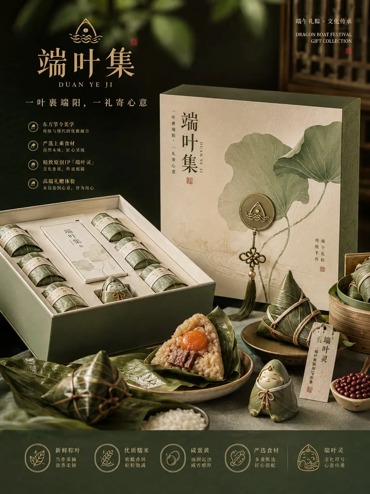 | 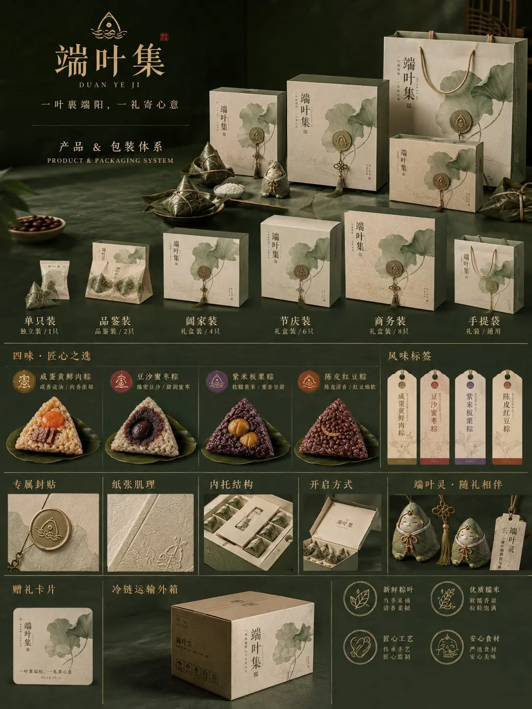 | 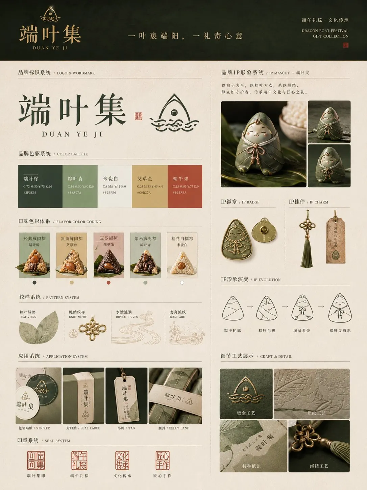 | 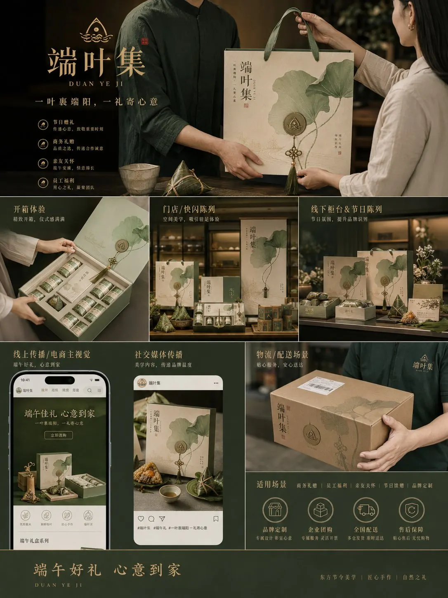 |

《原创IP商品化提案》提示词：

请根据用户输入的品牌信息，创作一套高完成度、具有统一视觉系统的「原创 IP 商品化提案 / 4-Board Original IP Commercialization Proposal」。

注意：

这不是一张四宫格拼图，也不是把4张内容合并在同一个画面里的总图，而是一套需要“依次分别生成”的4张独立图片。你需要在同一个品牌视觉系统下，连续完成这4张图的生成。4张图必须明显属于同一个品牌，但每一张图承担不同职责，不能只是4张重复变体。

这也不是普通海报设计、普通电商详情图或单一包装效果图，而是一套兼具：

品牌感、IP感、产品感、包装感、场景感、商品化落地感、商业提案感、展示感、作品集质量

的完整视觉提案。

### 用户输入

品牌名：【品牌名】

英文辅助名：【英文辅助名】

品牌类型 / 行业：【品牌类型 / 行业】

一句话品牌定位：【一句话品牌定位】

核心关键词（3–8个）：【核心关键词】

目标人群：【目标人群】

整体风格方向：【整体风格方向】

品牌口号 / Slogan：【Slogan】

主打产品 / 核心服务：【主打产品 / 核心服务】

产品线 / SKU 信息：【产品线 / SKU 信息】

品牌故事 / 地域特色 / 文化背景：【品牌故事 / 地域特色 / 文化背景】

主色调倾向：【主色调倾向】

辅助色倾向：【辅助色倾向】

点缀色倾向：【点缀色倾向】

希望融入的文化元素 / 图形元素：【希望融入的文化元素 / 图形元素】

是否需要IP形象：【是 / 否 / 弱化IP】

IP方向偏好：【IP方向偏好】

希望偏重的应用方向：【包装 / 礼盒 / 门店 / 电商 / 社媒 / 周边 / 冷链 / 货架 / 其他】

希望避免的风格：【希望避免的风格】

画幅比例：【默认竖版 3:4，可修改】

其他补充说明：【其他补充说明】

### 总任务

请先基于以上信息，在内部提炼并统一这个品牌的视觉 DNA，再基于同一个品牌 DNA，依次分别生成4张独立图片。

在正式生成4张图之前，请先统一以下内容，并在后续4张图中始终保持一致：

品牌核心气质

品牌视觉关键词

主色 / 辅色 / 点缀色

字体倾向与字形气质

图形语言 / 辅助图案语言

产品或服务的视觉呈现方式

IP形象设定方式

包装 / 应用物料 / 周边 / 场景的统一规则

整体画面气质：品牌感、提案感、商业感、展示感、系列感

4张图风格统一，但信息分工明确，不做成4张内容重复的变体

### 关于IP的特别要求

这套提案不能只有 Logo，没有IP感。即使整体走高端、克制、写实路线，也应具备“IP识别角色”或“符号化IP形象”。

IP不一定是夸张卡通人物，也可以是更高级、更克制的“文化符号型IP / 品牌图腾型IP / 吉祥物型IP / 徽章型IP / 印章型IP / 吊饰型IP / 微雕塑型IP”。

如果品牌适合轻IP路线，请将IP理解为“品牌识别角色”，可以出现在徽章、封签、吊牌、挂件、印章、标签、包装细节、社媒符号中，而不一定作为主角占据整个画面。

如果品牌更适合强IP路线，可以让角色更明确，但依然要与品牌系统统一，不能显得廉价、幼稚或素材感过强。

如果用户明确要求“不要太卡通”，请将IP处理为：更高级、更写实、更有设计感、更像品牌识别符号，而不是儿童化Q版角色。

### 整体统一要求

四张图必须明显属于同一个品牌系统，品牌名、色彩系统、字体气质、图形语言、品牌符号、IP形象（如有）、产品逻辑必须统一。

四张图不是4张重复海报，而是4张不同职责的品牌商品化提案图。

四张图都要具有高完成度、品牌提案感、商业感、展示感和作品集质量。

版式可以有差异，但整体审美、设计语言和视觉系统必须高度统一。

根据不同品牌类型自动匹配最合适的内容：

节令食品 / 地方特产 / 礼盒食品：礼盒、单颗装 / 单品装、标签、手提袋、外箱、礼赠卡、封签、陈列、社媒传播等

餐饮 / 饮品：杯子、瓶身、杯套、纸袋、外卖袋、包装盒、标签、门店、广告海报、电商图等

美妆 / 快消：瓶器、盒装、礼盒、系列包装、陈列、广告KV等

文创 / IP / 零售：周边、徽章、贴纸、吊牌、礼盒、手提袋、海报、门店等

科技 / 数字品牌：官网首屏、APP界面、卡片、数字场景、传播物料等

如果画面中出现文字，请保证品牌名、标题、模块名、口号、关键产品名简洁清晰，尽量准确，不要堆砌过多冗长文案。

每张图都应适合独立展示，同时4张图放在一起时要明显看出是一整套提案。

不要把四张图拼在一张图里，不要做四宫格，不要做一页总览拼贴。

请按顺序依次生成：第1张 → 第2张 → 第3张 → 第4张。

每次只生成当前这一张独立图片，并自动延续前面已经建立好的品牌系统，直到4张全部完成。

如果用户要求“高级写实”，则画面必须具有真实商品摄影感、真实材质感、真实光影和真实产品质感，而不是插画拼贴、低质素材感或廉价电商图。

如果用户要求“有文化元素”，请将文化元素现代化、设计化、品牌化，不要简单堆砌传统装饰符号，不要满屏祥云、龙纹、红金边框等模板化国潮元素。

如果用户要求“不要太卡通”，则整体以轻IP、重品牌、强商品感的方式处理。

### 四张图的固定结构与职责

第1张：品牌主视觉封面图 / Brand Hero Board

这张图负责“定调”，是整套提案的封面图和第一视觉记忆点。

需要重点展示：

品牌名

英文辅助名（如有）

Slogan（如有）

品牌核心气质

品牌关键词的视觉转译

核心主视觉元素

主色系统

能代表该品牌的核心符号：产品、材质、图形、角色、IP识别物、视觉装置、氛围元素等

要求：

更偏封面图 / Hero Image，而不是说明书

画面有视觉冲击力和高级感

品牌感要强

信息不要太满，突出“第一眼记忆点”

如果品牌适合IP，可以出现IP，但应服务整体品牌主视觉

如果用户偏好写实路线，必须有高质感商品摄影感 / 产品渲染感

目标：

让人一眼看出这个品牌是谁、气质是什么、第一印象是什么。

第2张：品牌识别与IP系统图 / Identity & IP System Board

这张图负责解释这个品牌的“视觉系统如何构成”，并清楚说明这个品牌不只是Logo，还有完整的IP识别语言。

需要重点展示：

品牌名 / 字标 / Logo感呈现

主色、辅色、点缀色

字体气质与字形风格

辅助图形 / 图案 / icon / sticker / label 语言

包装图案逻辑或品牌识别元素

IP形象系统：如角色设定、IP徽章、IP挂件、IP印章、IP标签、IP符号演变、三视图、不同动作 / 表情 / 应用方式（根据风格决定）

小型应用系统：贴纸、吊牌、封签、标签、印章、徽章、卡片、腰封、挂件等

要求：

比第1张更有结构感和提案感

更像品牌系统提案板，但不要僵硬得像传统VI手册

模块清晰，逻辑明确

审美要保持高级，不要做成信息堆砌

如果品牌走高端写实路线，IP应偏克制、设计化、符号化，而非幼稚卡通

目标：

让人清楚理解这个品牌的视觉识别语言和IP语言是如何建立起来的。

第3张：商品与包装系统图 / Product & Packaging System Board

这张图负责展示品牌如何真正落到“产品 / 包装 / 服务载体”上，体现商业落地能力。

需要根据品牌类型自动匹配最合适的应用形式，例如：

节令食品 / 地方特产 / 礼盒食品：单品装、礼盒装、手提袋、礼赠卡、口味标签、封签、运输外箱、陈列装、冷链外箱等

餐饮 / 饮品：杯子、瓶身、杯套、纸袋、吸管套、包装盒、外卖袋、贴纸、标签等

美妆 / 快消：瓶器、罐装、盒装、礼盒、系列包装、货架陈列等

文创 / IP / 零售：周边、徽章、贴纸、文具、礼盒、标签、包装延展等

科技 / 数字品牌：官网首页、APP界面、数字产品界面、卡片、服务展示等

要求：

重点体现“产品化 / 包装化 / 可售卖 / 可使用 / 可落地”

至少有一种主力应用载体，也可以有若干延展应用，但必须有主次

画面应具有真实商业摄影感、产品展示感或提案板陈列感

不要只是摆一堆东西，要看得出统一的品牌系统已经落地

如果品牌有SKU，要清楚区分系列、规格、口味、型号、层级

如果品牌有IP，要让IP自然融入包装系统，而不是仅仅单独悬浮存在

目标：

让人看到这个品牌不仅有概念，也能真正变成可售卖、可使用、可执行的产品系统。

第4张：传播与销售场景应用图 / Campaign & Sales Scenario Board

这张图负责展示品牌进入真实传播场景后的视觉效果，体现品牌辨识度、传播力与场景延展能力。

需要根据品牌类型自动匹配最合适的场景，例如：

门店外立面 / 店招 / 柜台 / 导视系统

海报KV / 社交媒体广告 / 立牌 / 灯箱 / 户外广告

快闪店 / 展台 / 品牌活动空间 / 节日陈列空间

电商首页 / 手机端首屏 / 社媒 feed / 数字传播界面

开箱体验 / 礼赠场景 / 货架陈列 / 配送场景

要求：

场景感要比第3张更强，要体现品牌进入真实世界后的传播效果

可以偏广告感、空间感、展示感，但仍要保留提案气质

不要与第3张重复成单纯包装展示图

品牌系统仍需保持统一：品牌名、色彩、字体、图形、IP形象（如有）、产品调性都要一致

如果用户要求真实感，要像真实商业摄影和真实使用场景，而不是拼贴素材

目标：

让人看到这个品牌在真实传播、真实销售和真实应用场景中具有鲜明辨识度和商业表现力。

### 执行方式

请严格按照以下流程执行：

先内部理解并统一品牌视觉 DNA。

然后开始生成第1张图：品牌主视觉封面图。

在保持同一品牌系统的前提下，继续生成第2张图：品牌识别与IP系统图。

在保持同一品牌系统的前提下，继续生成第3张图：商品与包装系统图。

在保持同一品牌系统的前提下，继续生成第4张图：传播与销售场景应用图。

整个过程中，不要把4张图合并成一张，不要变成四宫格，不要让4张图内容重复。

每次只生成当前这一张独立图片，并自动记住前面已经建立好的品牌系统，直到4张全部完成。

### 画面与质量要求

默认画幅比例：竖版 3:4

图片质量：高清、精致、细节丰富

画面气质：品牌提案感、商业感、作品集质量、真实商品感、设计感

文字语言：以中文为主，英文为辅助

文本要求：品牌名、标题、Slogan、关键产品名、模块名尽量清晰准确，不要乱码，不要大段无意义文字

### 负面要求

不要只做Logo，没有IP识别感。

不要做成普通海报拼贴。

不要做成低质电商详情页。

不要做成廉价素材堆砌。

不要大面积出现网络素材感。

不要把传统元素堆满画面。

不要幼稚化、儿童化，除非用户明确要求。

不要把IP做得过于卡通、低龄、夸张，除非用户明确要求。

不要让4张图变成同一内容的重复变体。

不要把4张图拼成一张图。

不要让包装、产品或场景显得虚假和不可信。

不要照搬任何现成品牌、真实商标或已有IP。

### 最终目标

输出一套4张独立但高度统一的原创 IP 商品化提案图：

第1张负责定调

第2张负责解释识别系统与IP系统

第3张负责产品与包装落地

第4张负责传播与销售场景落地

整套结果应具备：

统一的品牌视觉 DNA、清晰的页面分工、高完成度的审美、IP识别度、商品化能力、商业提案感、展示感、作品集质量，以及可直接用于品牌概念展示和内容发布的效果。

## 品牌全套视觉

| 预览 | 预览 | 预览 | 预览 |
| --- | --- | --- | --- |
| 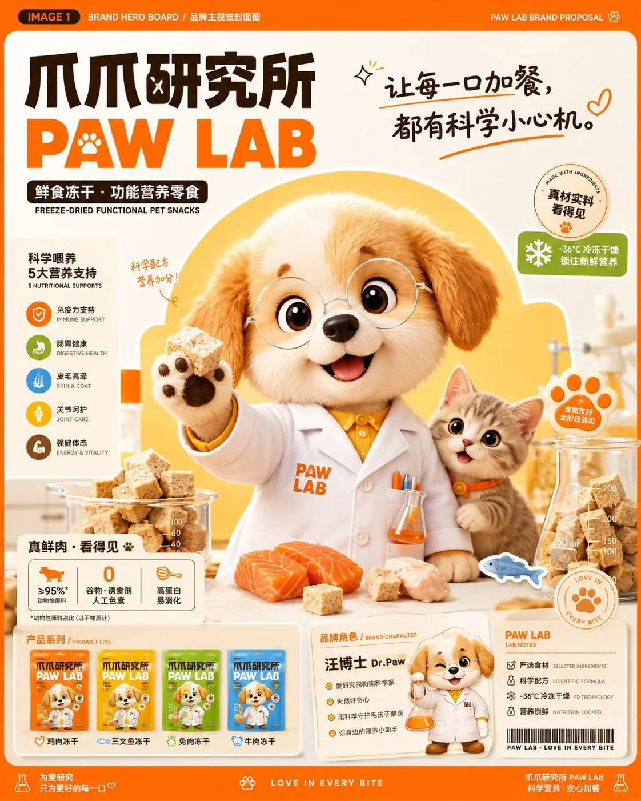 | 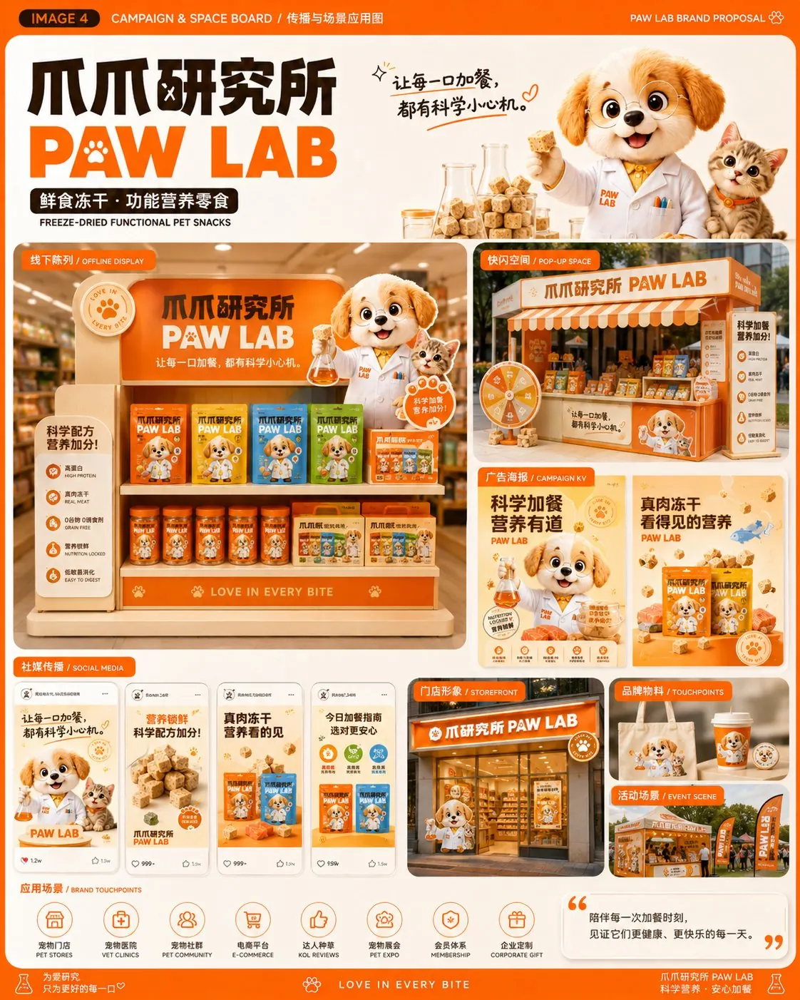 | 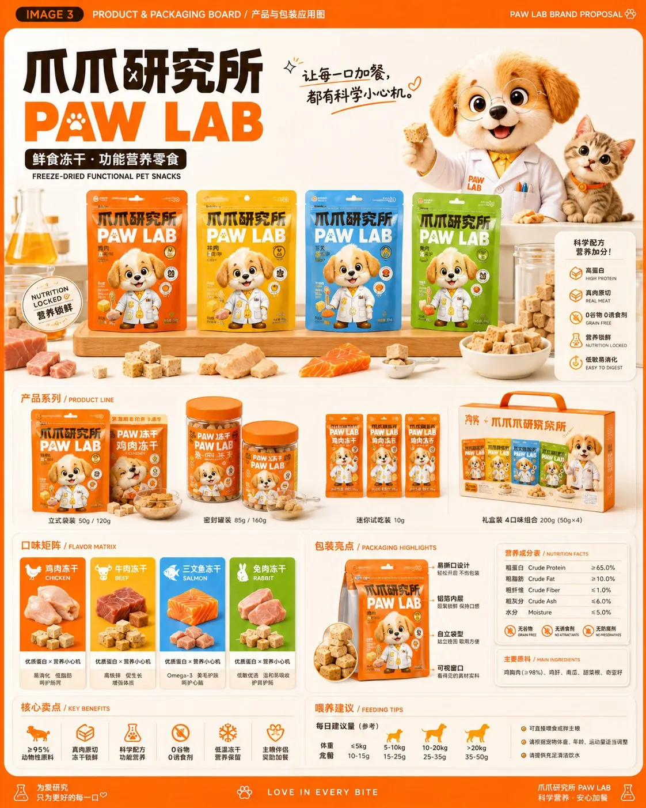 | 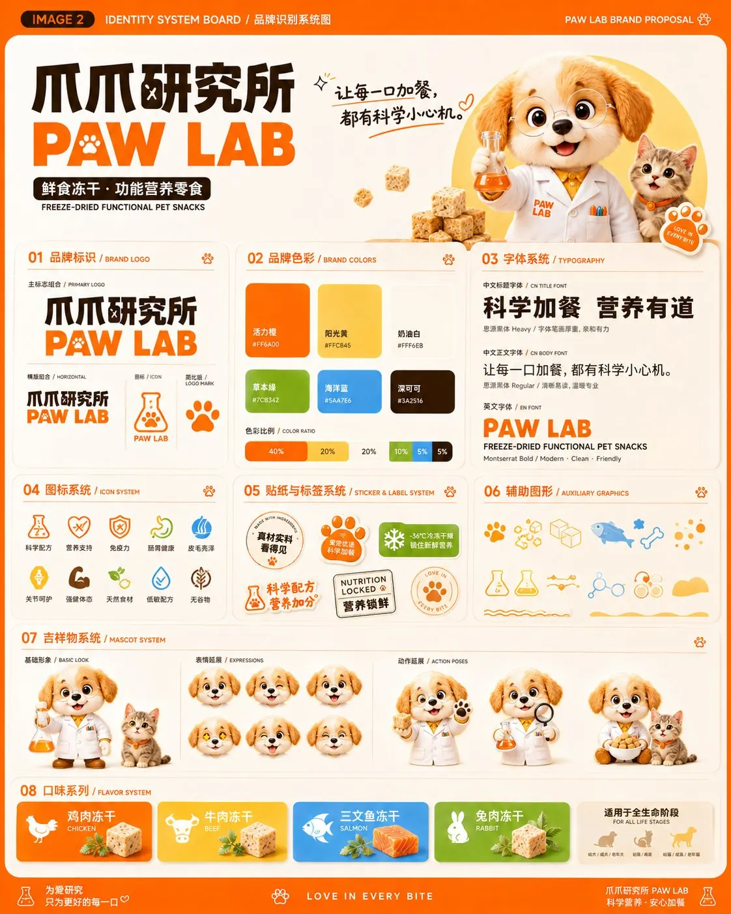 |

《品牌全套视觉提案》提示词：

请根据用户输入的品牌信息，创作一套高完成度、具有统一视觉系统的「4张品牌视觉提案 / 4-Board Brand Visual Proposal」。

注意：这不是一张四宫格拼图，也不是把4张内容合并在同一个画面里的总图，而是一套需要“依次分别生成”的4张独立图片。你需要在同一个品牌视觉系统下，连续完成这4张图的生成。4张图必须明显属于同一个品牌，但每一张图承担不同职责，不能只是4张重复变体。

### 用户输入

品牌名：【品牌名】

品牌类型 / 行业：【品牌类型 / 行业】

一句话品牌定位：【一句话品牌定位】

核心关键词（3–6个）：【核心关键词】

目标人群：【目标人群】

整体风格方向：【整体风格方向】

Slogan：【Slogan】

主打产品 / 核心服务：【主打产品 / 核心服务】

品牌故事 / 地域特色：【品牌故事 / 地域特色】

主色调倾向：【主色调倾向】

辅助色倾向：【辅助色倾向】

是否需要IP角色：【是否需要IP角色：是 / 否】

IP角色方向：【IP角色方向】

希望偏重的应用方向：【包装 / 门店 / 海报 / 社媒 / 官网 / APP / 周边 / 其他】

希望避免的风格：【希望避免的风格】

画幅比例：【画幅比例】

其他补充说明：【其他补充说明】

### 总任务

请先基于以上信息，在内部提炼并统一这个品牌的视觉DNA，再基于同一个品牌DNA，依次分别生成4张独立图片。

在正式生成4张图之前，请先统一以下内容，并在后续4张图中始终保持一致：

品牌核心气质

品牌视觉关键词

主色 / 辅色 / 点缀色

字体倾向与字形气质

图形语言 / 辅助图案语言

产品或服务的视觉呈现方式

是否使用IP角色，以及角色的设定方向

适合该品牌的应用物料与传播场景

整体画面气质：品牌感、提案感、商业感、展示感、系列感

让4张图风格统一，但信息分工明确，不做成4张内容重复的变体

### 整体统一要求

四张图必须明显属于同一个品牌系统，品牌名、色彩系统、字体气质、图形语言、品牌符号、IP角色（如有）、产品逻辑必须统一。

四张图不是4张重复海报，而是4张不同职责的品牌视觉提案图。

四张图都要具有高完成度、品牌提案感、商业感、展示感和作品集质量。

版式可以有差异，但整体审美、设计语言和视觉系统必须高度统一。

根据不同品牌类型自动匹配最合适的视觉应用内容：

餐饮 / 饮品：包装、杯子、纸袋、瓶身、标签、门店、广告海报等

美妆 / 快消：瓶器、盒装、礼盒、系列包装、陈列、广告KV等

科技 / 数字品牌：官网首屏、APP界面、品牌卡片、数字场景、UI展示等

文创 / IP / 零售：周边、贴纸、徽章、礼盒、手提袋、海报、门店等

如果画面中出现文字，请保证品牌名、标题、模块名简洁清晰，具有品牌感，不要堆砌过多冗长文案。

每张图都应适合独立展示，同时4张图放在一起时要明显看出是一整套提案。

不要把四张图拼在一张图里，不要做四宫格，不要做一页总览拼贴。

请按顺序依次生成：第1张 → 第2张 → 第3张 → 第4张。

每次只生成当前这一张独立图片，并自动延续前面已经建立好的品牌系统，直到4张全部完成。

### 四张图的固定结构与职责

第1张：品牌主视觉封面图 / Brand Hero Board

这张图负责“定调”，是整套提案的封面图和第一视觉记忆点。

需要重点展示：

品牌名

Slogan（如有）

品牌核心气质

品牌关键词的视觉转译

核心主视觉元素

主色系统

能代表该品牌的核心符号：产品、材质、图形、角色、视觉装置、氛围元素等

要求：

更偏封面图 / Hero Image，而不是说明书

画面有视觉冲击力和高级感

品牌感要强

信息不要太满，突出“第一眼记忆点”

如果品牌适合IP角色，可以出现，但它应服务整体品牌主视觉

目标：

让人一眼看出这个品牌是谁、气质是什么、第一印象是什么。

第2张：品牌识别系统图 / Identity System Board

这张图负责解释这个品牌的“视觉系统如何构成”。

需要重点展示：

品牌名 / 字标 / Logo感呈现

主色、辅色、点缀色

字体气质与字形风格

辅助图形 / 图案 / icon / sticker / label 语言

包装图案逻辑或品牌识别元素

如果适合，也可加入IP角色的系统化展示，如表情、动作、延展方式

要求：

比第1张更有结构感和提案感

更像品牌系统提案板，但不要僵硬得像传统VI手册

模块清晰，逻辑明确

审美要保持高级，不要做成信息堆砌

目标：

让人清楚理解这个品牌的视觉识别语言是如何建立起来的。

第3张：产品与包装应用图 / Product & Packaging Board

这张图负责展示品牌如何真正落到“产品 / 包装 / 服务载体”上，体现商业落地能力。

需要根据品牌类型自动匹配最合适的应用形式，例如：

餐饮 / 饮品：杯子、瓶身、杯套、纸袋、吸管套、包装盒、外卖袋、贴纸、标签等

美妆 / 快消：瓶器、罐装、盒装、礼盒、系列包装、货架陈列等

科技 / 数字品牌：官网首页、APP界面、品牌卡片、数字产品界面、服务展示等

文创 / IP / 零售：周边、徽章、贴纸、文具、礼盒、标签、包装延展等

要求：

重点体现“产品化 / 包装化 / 可售卖 / 可使用 / 可落地”

至少有一种主力应用载体，也可以有若干延展应用，但必须有主次

画面应具有真实商业摄影感、产品展示感或提案板陈列感

不要只是摆一堆东西，要看得出统一的品牌系统已经落地

目标：

让人看到这个品牌不仅有概念，也能真正变成可售卖、可使用、可执行的产品系统。

第4张：传播与场景应用图 / Campaign & Space Board

这张图负责展示品牌进入真实传播场景后的视觉效果，体现品牌辨识度、传播力与场景延展能力。

需要根据品牌类型自动匹配最合适的场景，例如：

门店外立面 / 店招 / 柜台 / 导视系统

海报KV / 社交媒体广告 / 立牌 / 灯箱 / 户外广告

快闪店 / 展台 / 品牌活动空间 / 陈列空间

官网首屏 / 社媒 feed / 数字传播界面

要求：

场景感要比第3张更强，要体现品牌进入真实世界后的传播效果

可以偏广告感、空间感、展示感，但仍要保留提案气质

不要与第3张重复成单纯包装展示图

品牌系统仍需保持统一：品牌名、色彩、字体、图形、IP角色（如有）、调性都要一致

目标：

让人看到这个品牌在真实传播和应用场景中具有鲜明辨识度和强烈品牌表现力。

### 执行方式

请严格按照以下流程执行：

先内部理解并统一品牌视觉DNA。

然后开始生成第1张图：品牌主视觉封面图。

在保持同一品牌系统的前提下，继续生成第2张图：品牌识别系统图。

在保持同一品牌系统的前提下，继续生成第3张图：产品与包装应用图。

在保持同一品牌系统的前提下，继续生成第4张图：传播与场景应用图。

整个过程中，不要把4张图合并成一张，不要变成四宫格，不要让4张图内容重复。

请始终记住：这是同一个品牌的连续4张品牌视觉提案图，不是4个不同项目。

### 最终目标

输出一套4张独立但高度统一的品牌视觉提案图：

第1张负责定调

第2张负责解释系统

第3张负责产品落地

第4张负责传播与场景落地

整套结果应具备：

统一的品牌视觉DNA、清晰的页面分工、高完成度的审美、商业提案感、展示感、作品集质量，以及可直接用于品牌概念展示的效果。

## 餐饮品牌全套VI

| 预览 | 预览 | 预览 | 预览 |
| --- | --- | --- | --- |
| 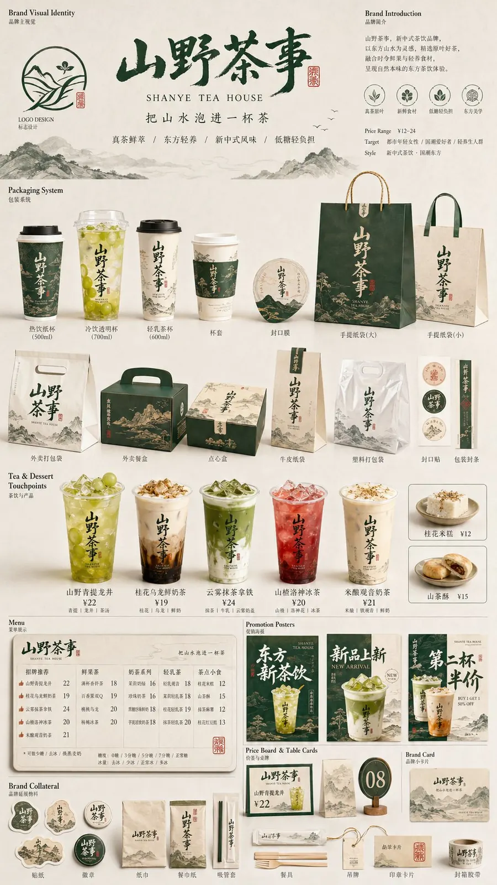 | 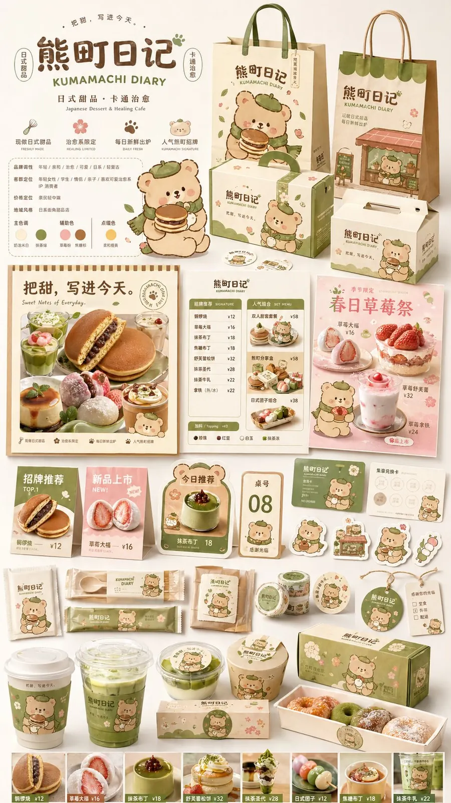 | 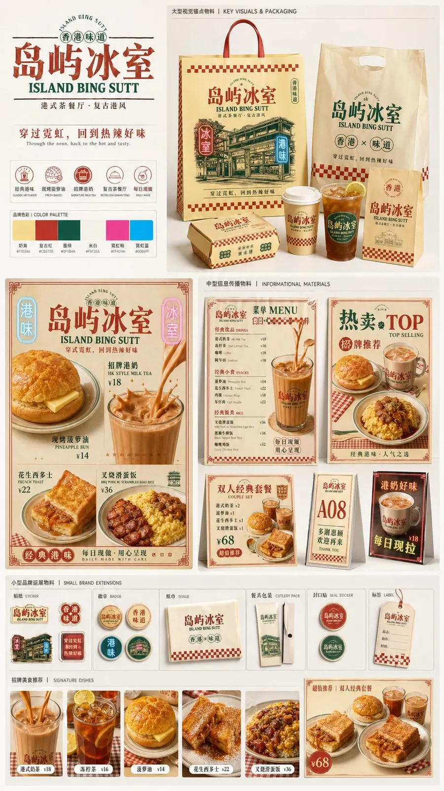 | 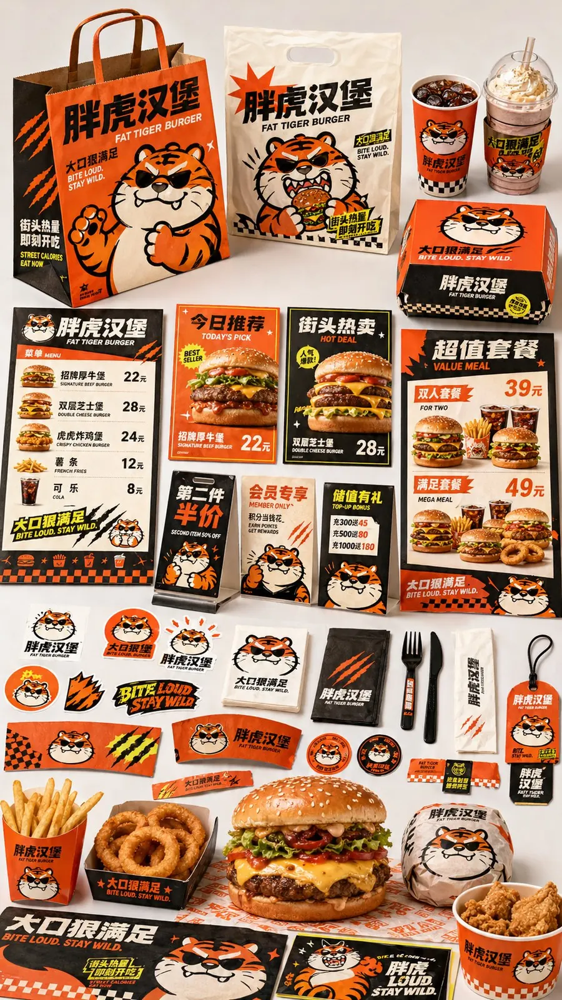 |

餐饮品牌VI设计提示词/Prompt： 生成一张【餐饮品牌触点矩阵】系列视觉图，用于展示一个完整的餐饮品牌视觉系统与包装应用方案。这是一个面向餐饮行业的品牌VI样机展示板 / 包装系统陈列图 / 品牌提案页。画面不是单张宣传海报，而是将品牌主视觉、主打产品、包装物料、菜单信息、促销内容与小型延展物料整合成一张系统化品牌展示图。【用户输入信息】- 品牌名：【品牌名】- 经营类目：【经营类目】【可选补充信息】- 主打产品：【主打产品】- 品牌口号：【品牌口号】- 风格方向：【风格方向】- 主色调：【主色调】- 辅助色：【辅助色】- 客群定位：【客群定位】- 价格定位：【价格定位】- 地域风格：【地域风格】- 画幅比例：【画幅比例】【自动补全规则】如果用户没有提供完整品牌信息，请根据【品牌名】与【经营类目】自动推导并完成最优组合，包括：1. 判断品牌调性（年轻、亲和、国潮、复古、清新、治愈、精致、快餐感等）2. 匹配适合该类目的视觉风格3. 自动设定合理的主色、辅助色与点缀色4. 自动补全主打产品与辅助产品5. 自动生成适合餐饮传播的品牌口号、卖点文案、价格信息与推荐标签6. 自动匹配合适的餐饮物料类型与展示内容【画面内容要求】画面中应围绕【品牌名】构建一整套餐饮品牌物料系统，包含但不限于以下内容：- 核心包装：手提袋、外卖袋、包装盒、打包盒、纸袋、塑料袋- 饮品 / 食品容器：纸杯、杯套、碗、餐盒、封口贴、标签- 信息传播物料：菜单、促销海报、价格牌、桌牌、立牌、小卡片- 小型品牌延展：贴纸、徽章、纸巾、餐具、包装封条、吊牌- 产品表现：主打餐品照片、单品主视觉、食物特写、切面图、推荐组合图【构图与版式要求】采用竖版【画幅比例】构图，整体为白色、米白色或浅灰色背景，以品牌提案板 / 样机矩阵板的方式组织画面。通过大中小物料混排形成视觉层级：- 大型包装和主视觉物料作为视觉锚点- 中型菜单、海报和价格模块负责信息传达- 小型贴纸、餐具、标签与周边物料增强系统完整度整体构图应具有明确秩序感，接近品牌方案展示页、作品集陈列页、包装提案页的视觉效果。元素要排列整齐但不呆板，丰富但不杂乱，具有模块化与可阅读性。【风格与质感要求】整体风格应符合【经营类目】与【品牌名】气质，具有明显的餐饮品牌感、商业传播感、样机展示感与系统设计感。可融合以下风格倾向：现代简洁、国潮趣味、轻复古、生活方式感、快消感、温暖治愈感、年轻化传播感。材质真实，包含纸张、塑料、布袋、包装盒、杯体、贴纸、餐具等真实物料质感；光影柔和统一，像在干净摄影棚环境中拍摄的品牌物料合集。【风格与质感要求】整体风格应符合【经营类目】与【品牌名】气质，具有明显的餐饮品牌感、商业传播感、样机展示感与系统设计感。可融合以下风格倾向：现代简洁、国潮趣味、轻复古、生活方式感、快消感、温暖治愈感、年轻化传播感。材质真实，包含纸张、塑料、布袋、包装盒、杯体、贴纸、餐具等真实物料质感； 光影柔和统一，像在干净摄影棚环境中拍摄的品牌物料合集。【文字与图形要求】所有物料上应统一出现品牌名、Logo、品牌符号、主色块、口号或卖点文案。文案可为中文或中英混排，但要符合餐饮传播表达，简洁直接，具备商品售卖感。图形系统可以根据品牌调性选择简洁插画、几何图形、卡通吉祥物、符号化图标或辅助纹样，用于增强品牌记忆点。【输出目标】最终生成一张完整的【品牌名】餐饮品牌视觉系统展示图，像设计团队为该餐饮品牌制作的整套品牌提案样机板。要求画面统一、精致、具备商业落地感与作品集展示质量，并能清楚体现品牌风格、主打类目与多触点包装延展能力。Make the aspect ratio 9:16把宽高比改成9：16

## 品牌概念提案板

| 预览 | 预览 |
| --- | --- |
| 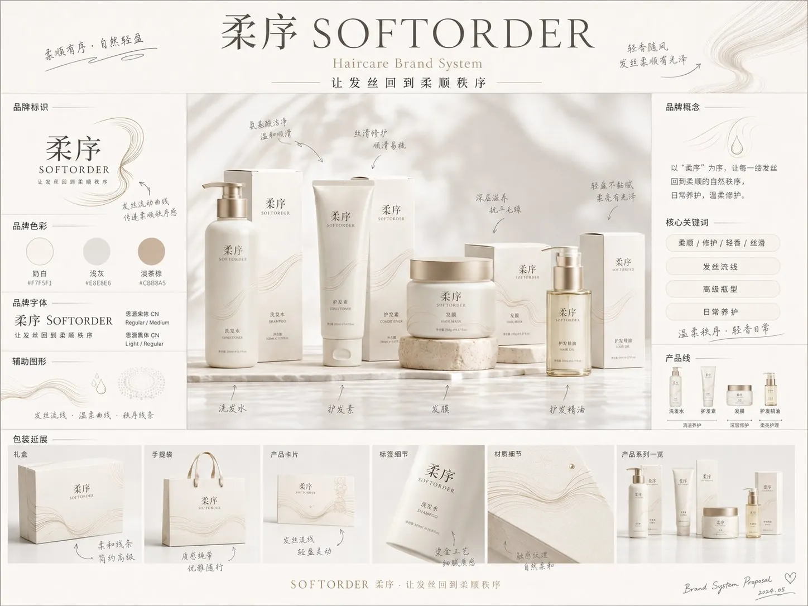 | 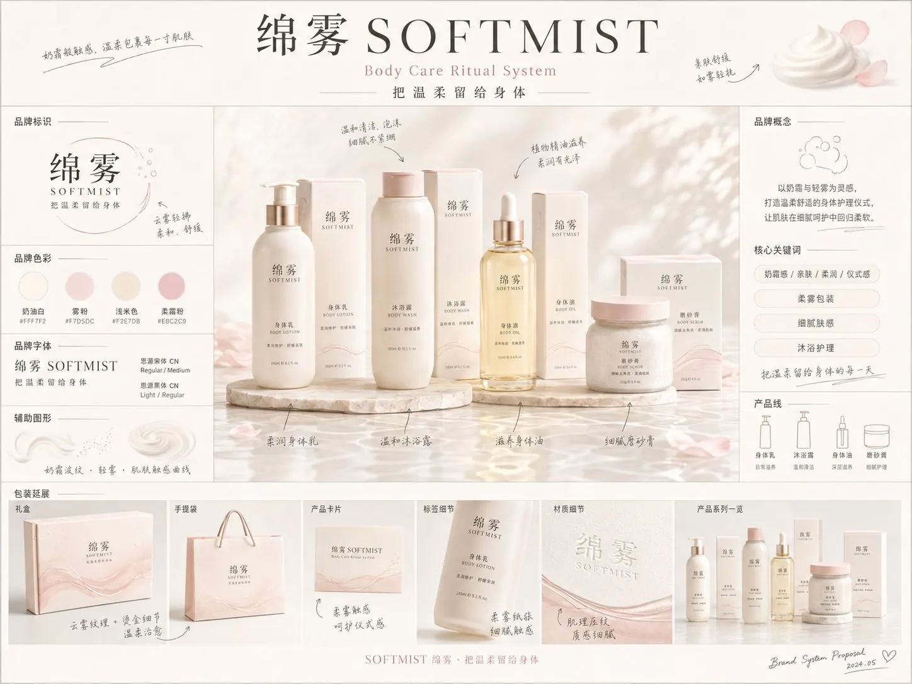 |

| 预览 | 预览 |
| --- | --- |
| 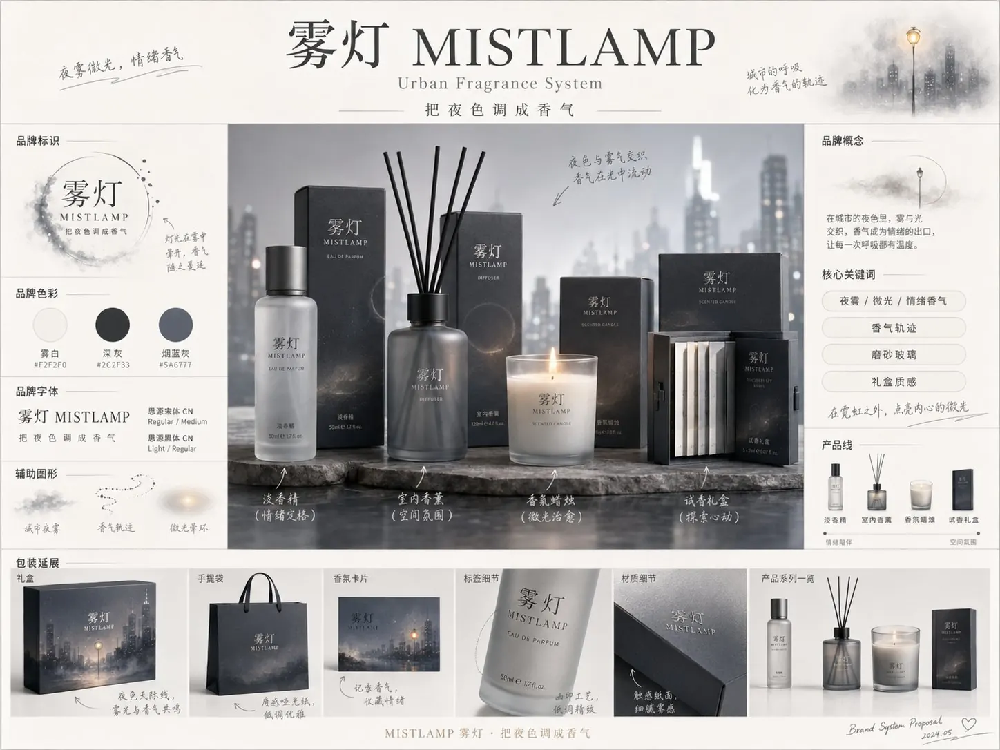 | 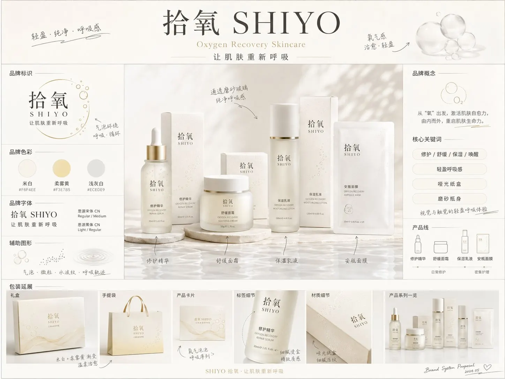 |

《品牌概念提案板》提示词：

请生成一张【画幅比例】的高完成度「品牌全案概念提案板 / Brand Concept Proposal Board」。

### 基础信息

品牌中文名：【品牌中文名】

品牌英文名：【品牌英文名】

品牌所属品类：【品牌品类】（如护肤 / 香氛 / 洗护 / 彩妆 / 茶饮 / 餐饮 / 宠物 / 家居等）

品牌核心概念：【品牌核心概念】

品牌 slogan：【品牌 slogan】

目标人群：【目标人群】

价格带 / 定位：【品牌定位】

使用场景：【使用场景】

产品线 / 核心产品：【产品线 / 核心产品】

### 视觉方向

整体气质：【整体气质】（如高级、极简、温柔、复古、未来感、自然疗愈、都市感、潮流感等）

主色调：【主色调】

辅助色：【辅助色】

点缀色：【点缀色】

材质关键词：【材质关键词】（如磨砂玻璃、哑光纸盒、压纹纸、烫金、透明亚克力、金属件等）

辅助图形方向：【辅助图形方向】（如几何图形、植物线稿、水波纹、气泡、雾气、线性流动图形、图标系统等）

### 画面目标

这不是普通产品海报，不是电商详情页，也不是单一包装图，而是一张高完成度的「品牌全案概念提案板」。

画面要体现品牌从概念到视觉落地的第一轮整体提案感，适合用于早期视觉方向探索。

### 画面内容需要包含

品牌主标题区：

品牌中文名

品牌英文名

slogan

一句简洁的品牌概念说明

品牌识别区：

Logo 方向展示

字体气质展示

标准色 / 色卡展示

辅助图形展示

中央主视觉区：

以【核心产品 / 产品线】为中心，展示一组高质感产品包装样机

包含主产品、外包装盒、系列组合

产品外观、标签、排版、材质统一，具有完整品牌系统感

这是整张图的视觉重心

信息说明区：

展示产品卖点 / 核心关键词 / 使用场景 / 体验感受

信息不要过多堆砌，要简洁、清楚、有提案感

以中文为主，英文可作为辅助

应用延展区：

展示品牌延展物料，如手提袋、卡片、贴纸、礼盒、宣传卡、菜单、周边、标签、瓶贴、社媒小图等

根据品类合理选择，不必机械全部出现

手绘标注区：

画面中加入适量手绘感标注、箭头、草图式说明、小注释

要有设计师提案板的感觉

手写标注要清晰、自然、精致，不要凌乱

### 版式要求

整体为横向或竖向品牌提案板版式，推荐【画幅比例】

版式具有设计感、品牌感、提案感、杂志感

阅读路径清晰：上方品牌信息 → 中央主产品 → 左右信息模块 → 底部延展展示

留白合理，不要过空，也不要过满

信息模块分布清晰，像专业设计公司提交的概念提案板

### 风格要求

画面高级、清晰、干净、有品质感

文字尽量清楚、准确、自然

不要出现明显乱码，不要低质感，不要廉价电商风

不要过度花哨，不要把画面做成普通PPT

应呈现真实品牌提案的感觉，而不是简单拼贴

### 额外要求

根据【品牌品类】和【品牌核心概念】自动匹配合理的包装形式、视觉元素与应用场景

如果用户填写的信息不完整，可以在不偏离方向的前提下做合理补全

整体输出应更像“概念提案板 / 视觉方向板”，而不是完整品牌规范手册

## 餐饮异形展架/立牌

| 预览 | 预览 | 预览 | 预览 |
| --- | --- | --- | --- |
| 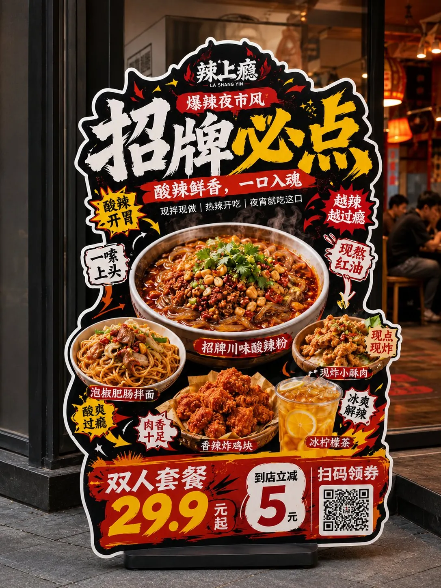 | 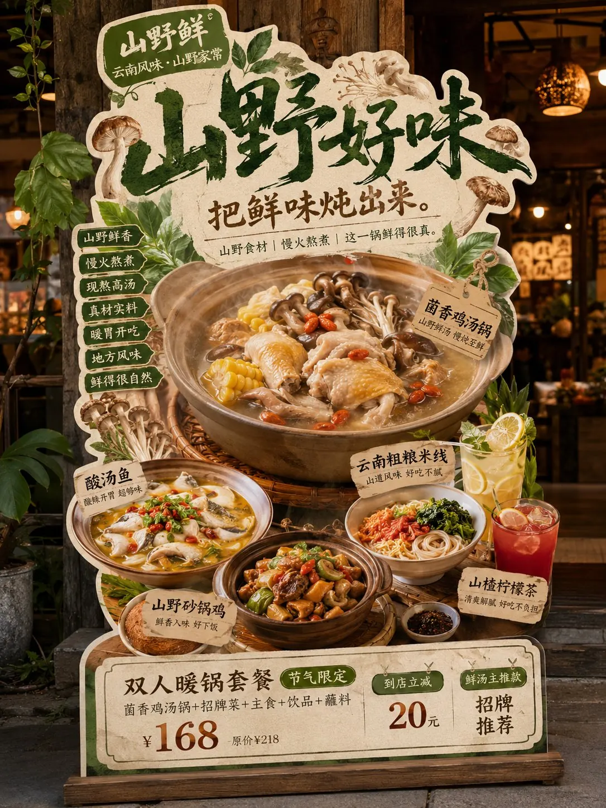 | 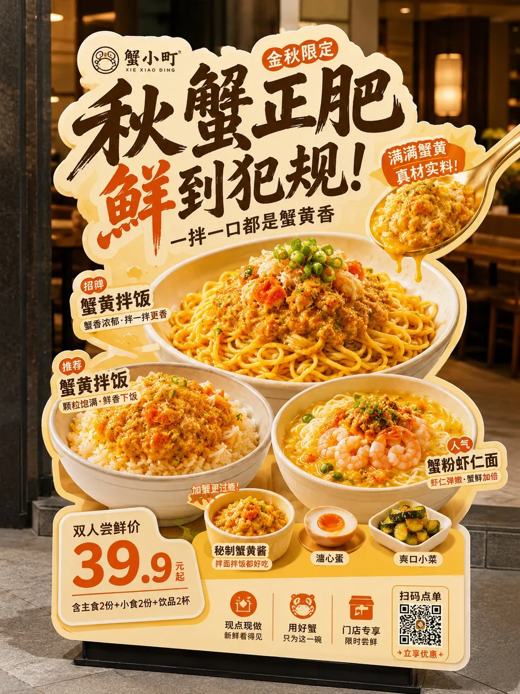 | 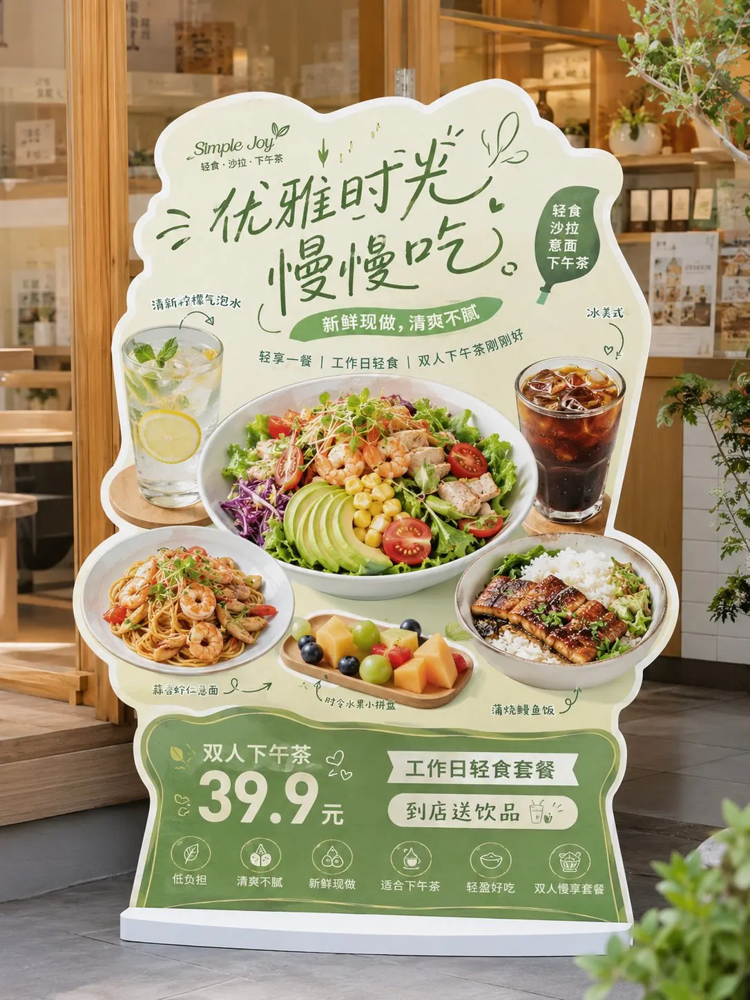 |

《餐饮异形展架/立牌物料》提示词：

请生成一张高完成度的「餐饮异形展架 / 立牌」设计图，用于展示餐饮门店的新品推荐、招牌产品、套餐促销或品牌活动信息。

### 基础信息

品牌名：【品牌名】

主标题：【主标题】

副标题：【副标题】

辅助短句：【短句1】｜【短句2】｜【短句3】

主题方向：【主题方向，例如：爆辣夜市风 / 金黄浓郁风 / 清新轻食风 / 山野自然风 / 甜品下午茶风 / 快餐促销风】

主色调：【主色调】

辅助色：【辅助色】

点缀色：【点缀色】

画幅比例：【建议 3:4 竖版】

### 产品内容

主推产品：【主推产品】

辅助产品1：【辅助产品1】

辅助产品2：【辅助产品2】

辅助产品3：【辅助产品3】

辅助产品4：【辅助产品4】

加料 / 配角产品：【加料或配角产品，例如：饮品 / 小食 / 配菜 / 酱料 / 甜品】

### 卖点标签

### 卖点1

### 卖点2

### 卖点3

### 卖点4

### 卖点5

### 卖点6

### 促销信息

### 促销信息1

### 促销信息2

### 促销信息3

### 最重要要求

这不是门店场景效果图，也不是海报贴在墙上的展示图。

请直接生成“一张完整的异形立牌成品展示图”：

背景必须为纯白色

画面中只保留一个完整的异形餐饮立牌主体

不要餐厅环境

不要商场背景

不要玻璃门、桌椅、墙面、人物、地面透视场景

不要任何真实空间背景

立牌主体必须完整显示

异形轮廓必须完整清晰

底座必须完整露出

整体像一张已经抠好的门店物料成品图 / 设计提案展示图 / 电商展示图

### 画面形式

这是一张“门店异形展架 / 立牌”的完整设计，不是普通矩形海报。

整体应采用明显的“不规则异形裁切轮廓”，有完整外边缘，边缘可带白色或浅色描边，具有真实门店物料感。

立牌应有明确底座，整体像可落地摆放的 KT 板 / 泡沫板 / 亚克力 / 写真喷绘展架成品。

### 构图结构

整体采用竖版、中心聚焦、信息分层清楚的结构：

顶部区域：

放超大主标题，标题必须醒目、有冲击力、有餐饮 POP 招贴感。

字体可以厚重、手写感、招贴感、潮流感，但要清晰易读。

标题是整张图的第一视觉焦点。

中部核心区域：

中间放最大主推产品，作为主视觉主体。

主菜必须最大、最饱满、最诱人，突出食欲感。

围绕主菜搭配 2~5 个辅助产品，形成丰富的产品组合，前后层次明确，主次分明。

周边信息区域：

在主菜和辅助产品四周加入少量标签元素、推荐标、贴纸框、手写箭头、卖点说明、小标题、小气泡标签等，使其具有“餐饮门店促销物料”的视觉特征。

但要控制层级，做到“热闹但不乱”。

底部促销区域：

底部放价格信息、套餐信息、活动信息或新品尝鲜信息。

价格数字要相对突出，易读清晰。

如果没有特别要求，默认不要二维码。

### 视觉风格要求

整体风格应属于“餐饮转化型视觉 + 门店 POP 异形立牌”：

强调食欲感

强调信息可读性

强调商业落地感

强调门店物料感

强调异形轮廓感

不是极简杂志海报，也不是电商详情页，也不是纯平面插画海报。

### 食物表现要求

所有食物必须采用真实商业美食摄影质感：

食物清晰真实

有食材颗粒感

有酱汁、汤汁、油光、热气、层次感

有丰富细节，如葱花、辣椒、芝士、香草、蔬菜、水果、虾仁、肉块等

主食要饱满，不能扁平

看起来必须“能激发食欲”

禁止过度插画化、卡通化、低质拼贴化。

### 版式与信息层级

整张立牌的阅读顺序应为：

主标题 → 主推产品 → 辅助产品 → 卖点标签 → 价格 / 活动信息

信息量可以较丰富，但必须有明确层级：

主标题最大

主菜次大

辅助菜稍小

卖点标签较小

底部促销清晰醒目

### 适配范围

该模板需要适用于不同主题餐饮内容，例如：

面 / 饭 / 粉 / 小吃

火锅 / 菌汤 / 地方菜

轻食 / 沙拉 / 咖啡简餐

早餐 / 套餐 / 快餐

茶饮 / 甜品 / 下午茶

节日促销 / 新品上市 / 爆品推荐 / 双人套餐

### 输出要求

请输出一张高清、清晰、商业完成度高的异形立牌设计图，满足以下条件：

白色背景

完整异形轮廓

完整底座

只展示立牌本体

不带真实场景环境

不带人物

不带门店背景

默认不带二维码

适合用于系列案例展示、设计提案、社交媒体发布、模板复用

品牌宣传单页

| 预览 | 预览 | 预览 |
| --- | --- | --- |
| 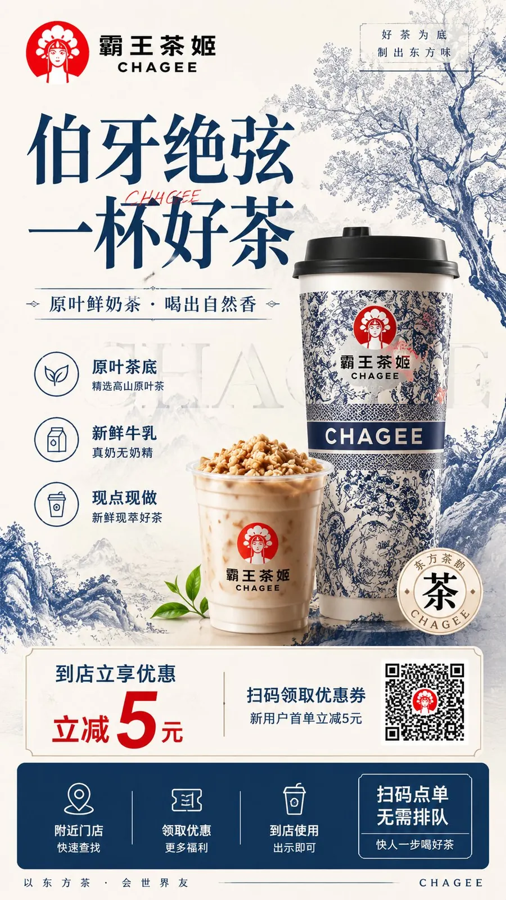 | 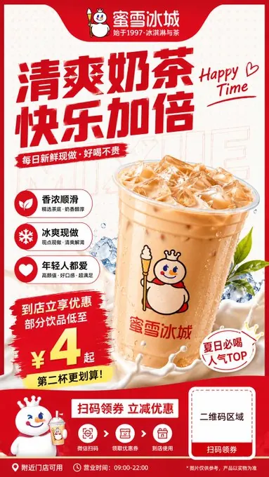 | 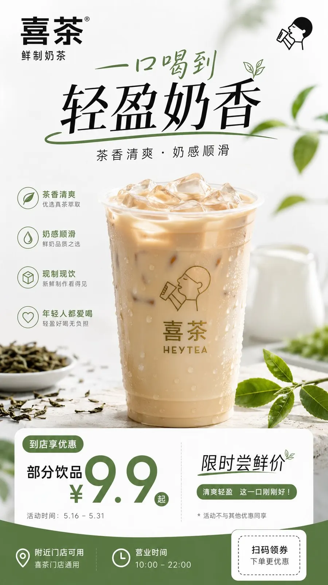 |

## 「扫码点单」

## 「无需排队」

## 「快人一步喝好茶」

整体信息层级必须清楚：品牌 Logo > 大标题 > 产品主视觉 > 卖点信息 > 优惠金额 > 二维码 / 到店行动。版面要像真实线下宣传单页，可以用于门店派发、小红书展示、朋友圈传播和到店扫码转化。

设计要求高级但不冷淡，商业化但不廉价，新中式但不老气，东方感明显但要符合年轻茶饮品牌审美。产品必须是画面视觉主体，杯身材质、纸杯纹理、奶茶液体、冰感与光影都要精致真实。文字排版要干净、有留白、有秩序，不要过度堆砌信息。

禁止出现乱码、错字、奇怪英文、多个不同品牌 Logo、低清晰度、低质感、颜色杂乱、字体过多、版面拥挤、信息过载、产品图低质、奶茶没有食欲感、品牌识别弱、风格混乱、廉价促销模板感、过度装饰、二维码抢主体、灰暗脏乱、与新中式茶饮无关、不同品牌拼贴感。

## 高端电商品牌

| 预览 | 预览 | 预览 | 预览 |
| --- | --- | --- | --- |
|  | 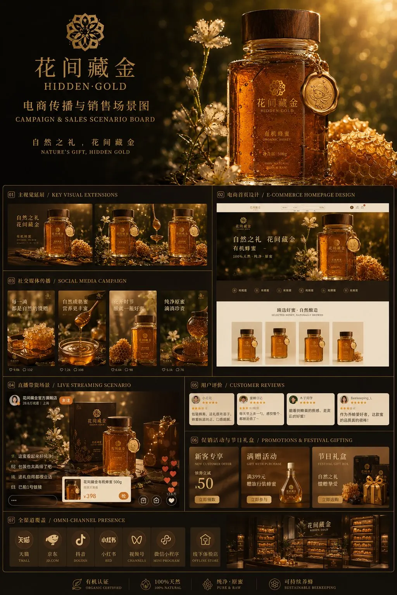 | 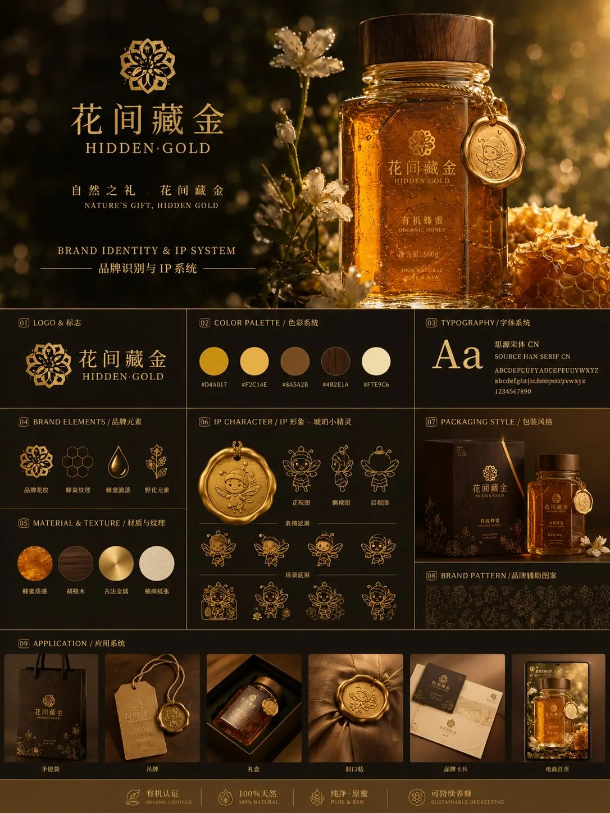 |  |

封面提示词：请为高端有机蜂蜜电商品牌“花间藏金 (HIDDEN GOLD)”生成第1张品牌主视觉封面图。 视觉 DNA： 采用高级工业设计感 × 森林自然主义美学。主色为剔透的琥珀金与沉稳的深木色。 重点展示： 一个六棱柱形的加厚玻璃瓶，瓶盖为深色胡桃木，瓶内蜂蜜呈现极具流动感的粘稠质感，在逆光下闪耀金光。 元素： 旁边点缀几朵带有朝露的野花和一小块原生态蜂巢。轻IP“琥珀小精灵”以金色火漆封签的形式挂在瓶口。 要求： 极致的微距摄影细节，能看清玻璃的反射与蜂蜜内的气泡。氛围温暖、纯净、尊贵，比例 3:4，竖版。先发第1张的 Prompt, 等 AI 生成出你满意的风格后，再回复：“基于第一张图建立的视觉 DNA，请生成第2张：品牌识别与 IP 系统图。”这样 AI 才会去提取上一张图的色彩比例和 Logo 样式，避免风格漂移。第二张生成满意后，再回复：基于前面已建立的视觉 DNA，请生成第 3 张：商品与包装系统图 / Product & Packaging System Board。第三张生成满意后，再回复：完美，最后生成第 4 张：电商传播与销售场景图 / Campaign & Sales Scenario Board。中间哪张不满意，可以点开图片，画上，让GPT给你部分重画。

## 品牌展位双视角提案图

| 预览 | 预览 | 预览 | 预览 |
| --- | --- | --- | --- |
| 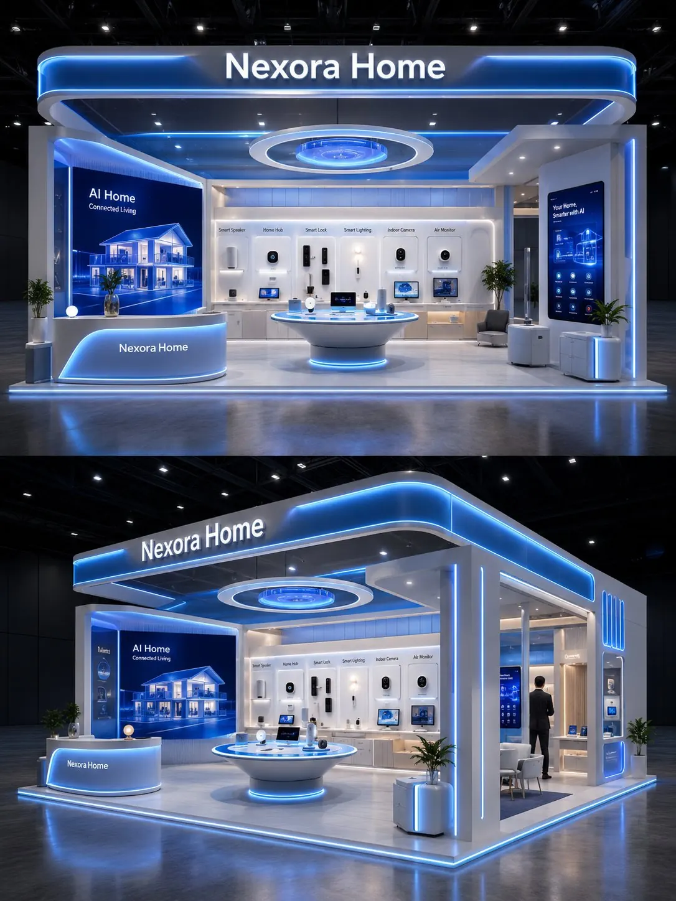 | 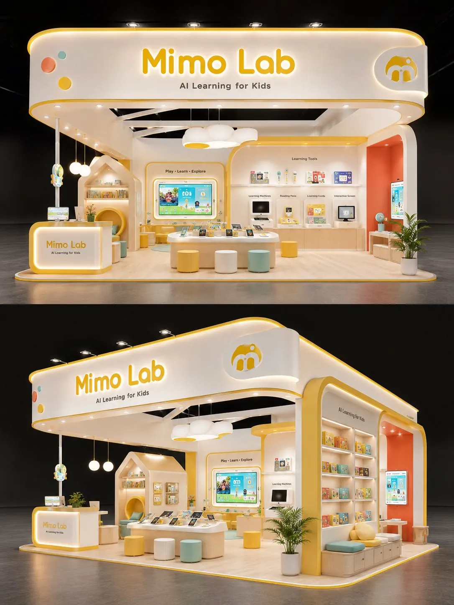 | 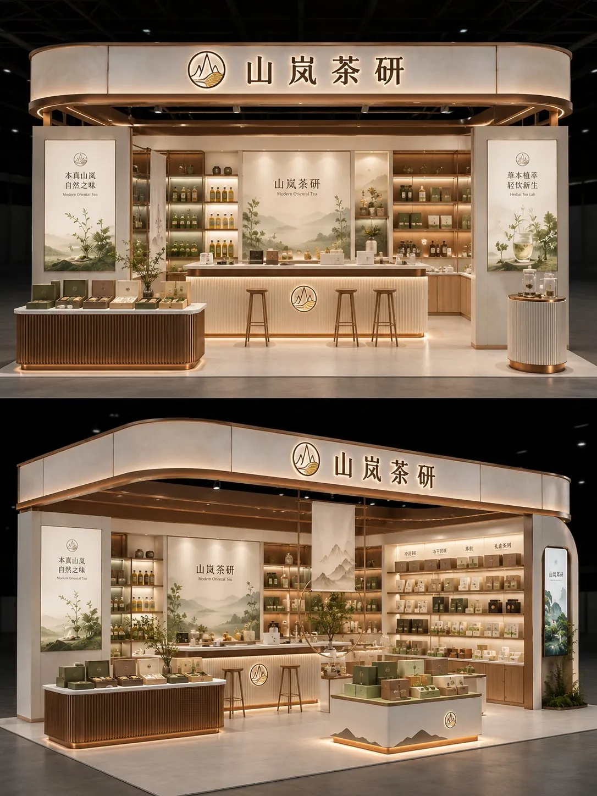 | 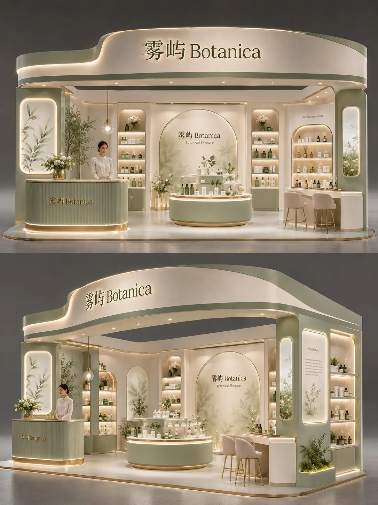 |

《品牌展位双视角提案图》提示词：

请生成一张高完成度的「品牌展位空间提案图 / Brand Booth Concept Render」。

### 项目设定

主题行业：【主题行业】

品牌名：【品牌名】

产品系列：【产品系列】

品牌定位：【品牌定位】

品牌关键词：【品牌关键词，3-6个，例如科技、极简、温柔、自然、高端、年轻、环保、未来感等】

主色调：【主色调】

辅助色：【辅助色】

点缀色：【点缀色】

空间风格方向：【空间风格方向，例如科技极简、轻奢零售、东方现代、亲子友好、自然疗愈、潮流快闪等】

主要材质：【主要材质，例如烤漆板、亚克力、玻璃、金属、木质、灯箱、软膜、磨砂材质等】

画幅比例：3:4 竖版长图

### 核心输出形式

这是一张竖版长图，同一张图中展示“同一个展位方案”的两个视角，上下排布：

上半部分：偏正面的主视角，重点展示品牌门头、主入口、前台、主视觉背景墙

下半部分：偏斜角的透视视角，重点展示侧面结构、内部陈列、动线和空间纵深

注意：上下两部分必须是同一个展位，只是观察视角不同，不能生成成两个不同方案。

### 图片类型定义

这不是普通海报，也不是单一室内图，而是一张专业的品牌展位空间提案图 / 展会展位效果图。整体需要具有商业提案感、3D渲染感、品牌识别度和真实展陈空间质感，像专业展会设计公司输出的方案图。

### 展位结构要求

展位采用半开放式结构，空间完整、合理、可落地，具有明确的展陈逻辑。画面中应包含以下核心模块：

顶部品牌门头：清晰展示【品牌名】，并体现品牌识别

主视觉背景墙：用于展示品牌主视觉、slogan或核心产品画面

产品展示区：通过展示柜、层架、陈列墙、岛台或样品区展示【产品系列】

接待台 / 咨询台：位于前部或入口附近，具备品牌识别

局部体验区 / 洽谈区：可包含体验桌、试用台、互动屏、桌椅、演示区等

灯光系统：含顶部照明、发光灯箱、灯带、局部背光等

地面与背景：地面干净，可有轻微反射；背景可为简洁展馆环境或中性空间背景，但不要喧宾夺主

### 视觉风格要求

整体风格统一，偏现代、干净、专业、高级，有明显品牌感和商业可信度。根据【空间风格方向】来调整设计语言，但总体要保持展位提案图的完成度。可使用几何结构、圆角模块、弧形门头、发光边框、悬浮结构、展示层架等设计元素，使其具有真实商业空间的搭建逻辑。

### 色彩逻辑

以【主色调】为品牌识别主色，贯穿门头、局部墙面、前台、展示结构、灯箱边框等核心位置；

以【辅助色】作为空间基底色，通常为白色、浅灰、米白、浅木色等，使画面干净、高级；

以【点缀色】用于局部强调，如产品标签、灯光细节、装饰边缘、小面积结构点缀等；

整体配色要统一，不杂乱，不花哨。

### 材质与质感

根据【主要材质】塑造展位质感，整体应呈现高质量 3D 渲染效果。材质表达清晰，边缘干净，空间透视准确，灯光柔和真实，局部有商业空间的光影层次，画面清晰细腻。

### 构图与阅读逻辑

展位主体必须完整入镜

上半图重点看“品牌门面识别”

下半图重点看“空间结构与内部陈列”

视觉阅读路径应清晰：品牌门头 → 整体展位结构 → 主视觉背景墙 → 产品展示区 → 接待台 → 局部细节

画面不要太空，也不要太挤，保持信息密度适中

### 品牌与文字要求

画面中只保留少量必要文字，尽量简洁、准确、清晰：

品牌名：【品牌名】

产品系列名：【产品系列】

可搭配1句简短品牌短语或slogan

不要生成大量无意义文字，不要出现明显乱码，不要堆砌说明文案。

### 人物与辅助元素

可加入少量人物作为比例参考，提升真实展会空间感，但人物必须弱化，不能喧宾夺主。可根据行业加入少量辅助元素，如包装样品、演示设备、植物、礼盒、互动屏、阅读物料、产品模型等，但都要服务于品牌和展位空间。

### 避免事项

不要做成普通海报拼贴

不要做成平面设计稿

不要做成商场专柜或杂乱摊位

不要让上下两张图变成两个不同展位

不要过度堆文字

不要过度拥挤

不要背景太复杂

不要直接复制任何真实品牌或参考图中的现有品牌内容

### 最终效果

最终输出应是一张完整、专业、统一、可落地的品牌展位空间提案图：同一张竖版长图中，上下展示同一个展位的两个不同视角，上图偏正面，下图偏斜角，整体具有强品牌识别、空间设计感和商业提案感。

## 品牌主视觉封面图

| 预览 | 预览 | 预览 | 预览 |
| --- | --- | --- | --- |
| 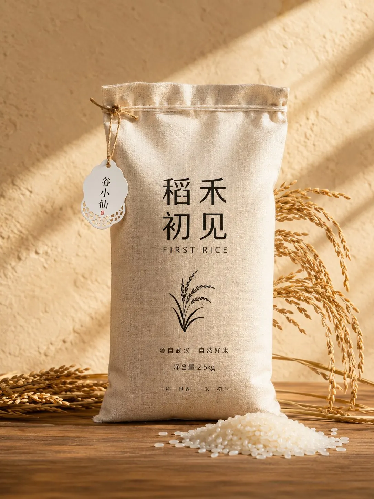 | 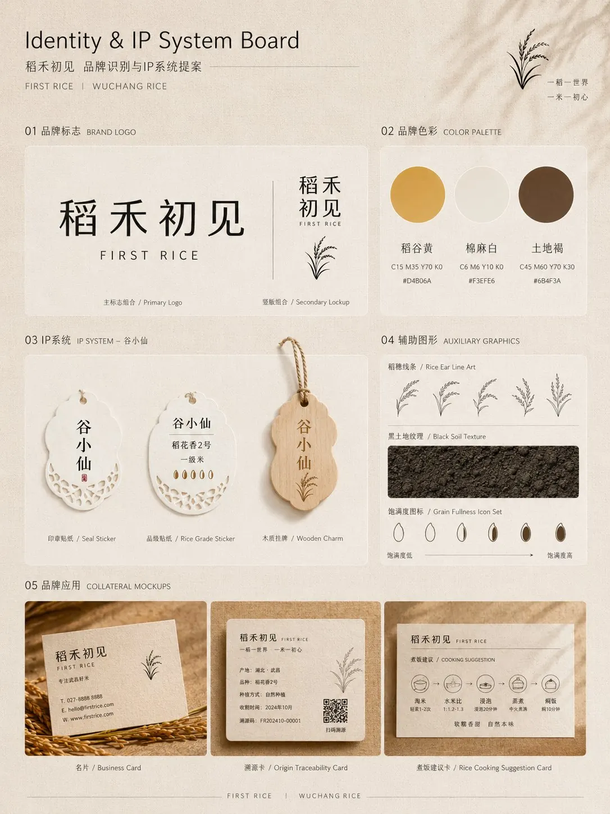 | 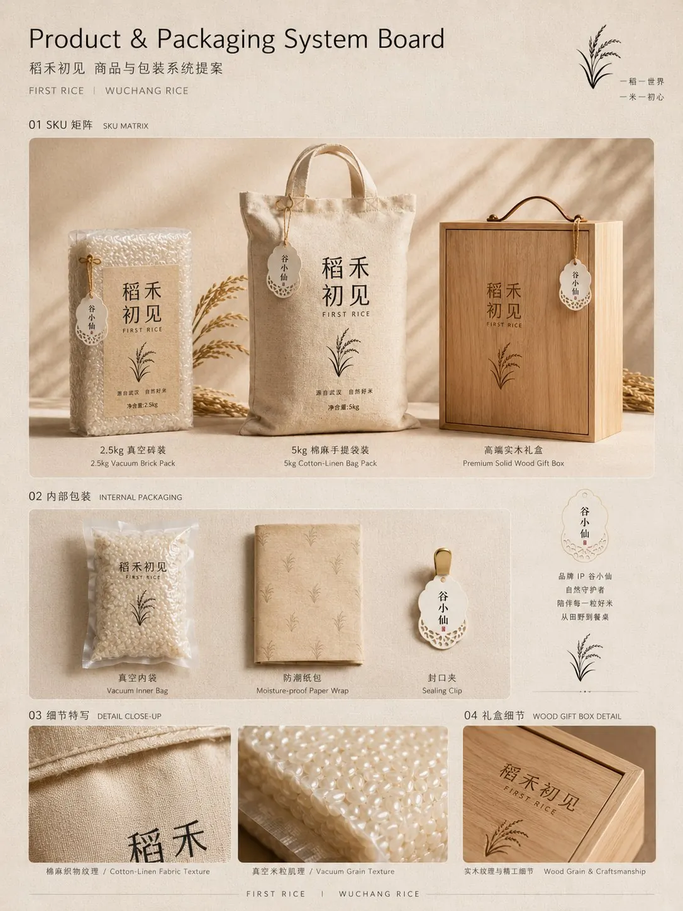 | 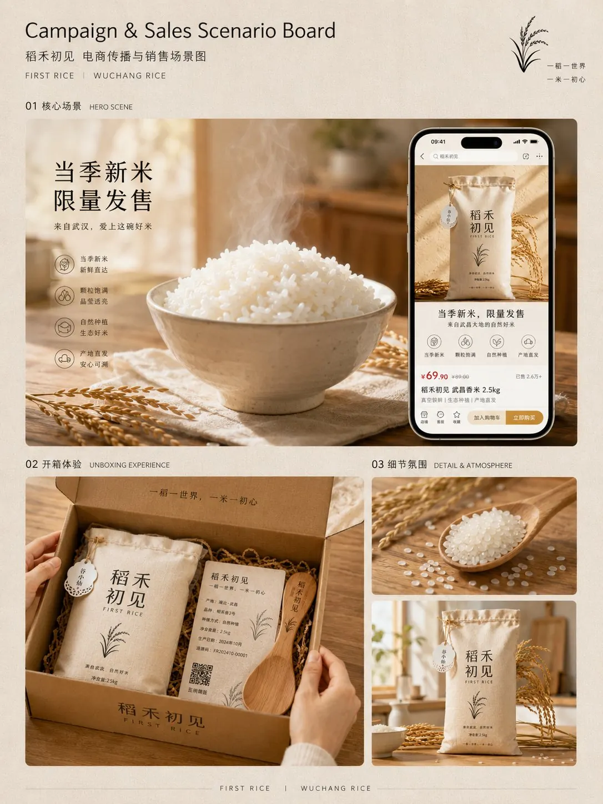 |

封面提示词：请为高端五常大米电商品牌“稻禾初见 (FIRST RICE)”生成第1张品牌主视觉封面图。 视觉 DNA： 采用大地色系 × 现代极简排版风格。强调土地的颗粒感与谷物的饱满感。 重点展示： 一款采用原色棉麻材质的真空包装袋，带有极简的黑色黑体字排印。包装前散落一小堆如珍珠般圆润晶莹的生米，以及几株干枯但形态优雅的金色稻穗。 元素： 背景是干净的夯土纹理或木质台面。轻IP“谷小仙”以白色激光镂空标签形式缀在麻绳上。 要求： 温暖的午后斜阳效果，画面通透，充满饭香味的联想，比例 3:4，竖版。

## 集市摊位设计提案

| 预览 | 预览 | 预览 | 预览 |
| --- | --- | --- | --- |
| 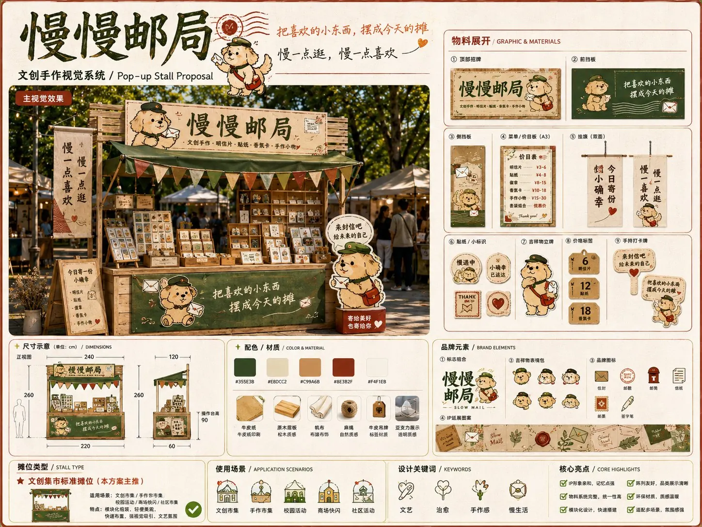 | 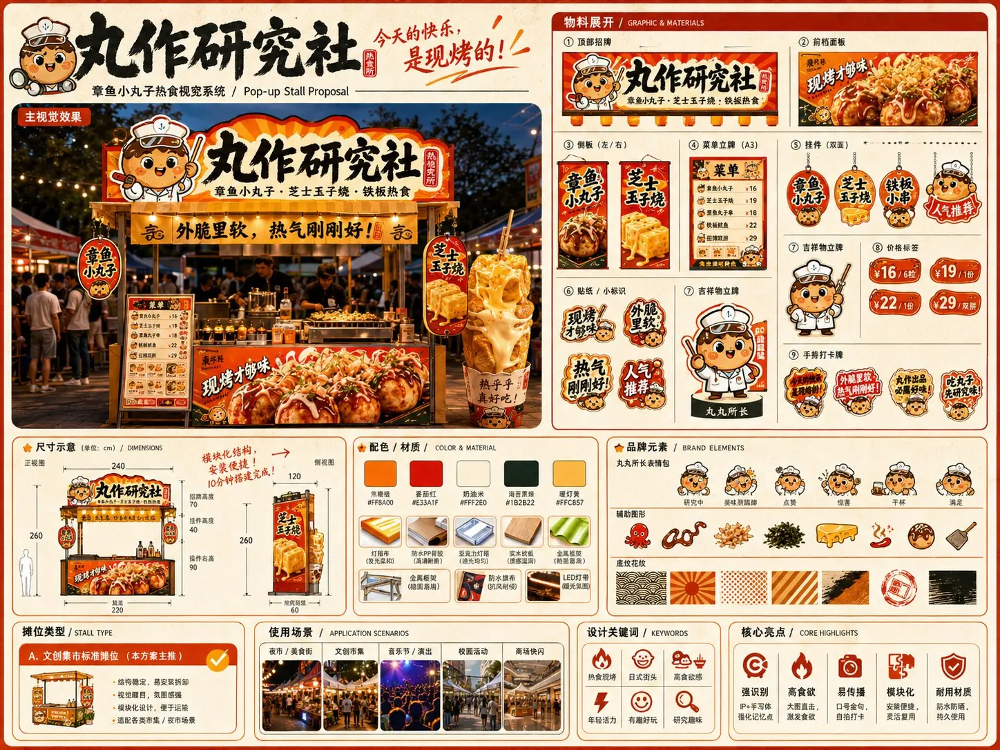 | 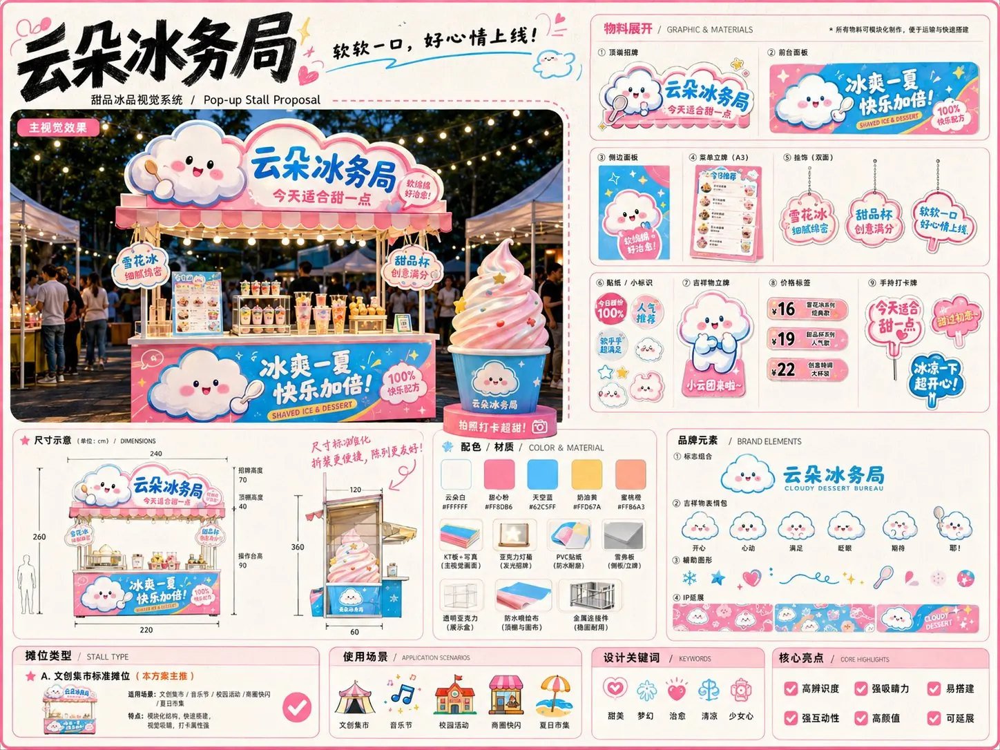 | 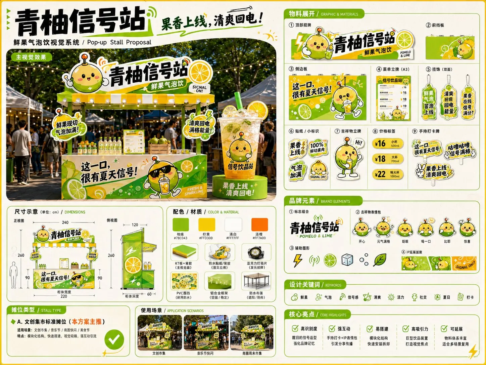 |

《集市摊位设计提案》提示词：

请根据以下用户输入，生成一张横版 4:3 的《创意集市摊位设计提案板 / Creative Market Stall Proposal Board》。

这不是单纯的摊位效果图，而是一张完整的品牌出摊视觉提案图，需要同时呈现：摊位实景渲染、物料展开、尺寸示意、配色材质、品牌元素、IP形象、使用场景和核心亮点。

### 用户输入

品牌名：【填写品牌名】

摊位主题：【填写主题，例如鲜果气泡饮 / 章鱼小丸子 / 甜品冰品 / 文创手作】

主营产品：【填写具体产品】

目标人群：【年轻人 / 学生 / 女性消费者 / 亲子家庭 / 文创市集人群等】

整体风格：【清爽活力 / 街头热食 / 梦幻甜美 / 文艺手作 / 复古可爱 / 高饱和潮流等】

主色调：【填写主色】

辅助色：【填写辅助色】

IP形象：【填写IP设定，例如青柚精灵 / 小丸子研究员 / 云朵精灵 / 邮差小狗】

核心口号：【填写一句短口号】

使用场景：【文创市集 / 美食市集 / 校园活动 / 音乐节 / 商场快闪 / 品牌路演】

### 整体画面要求

画面比例为横版 4:3。

整体是一张专业的摊位设计提案板，采用高信息量但清晰有序的版式。

画面需要有明显的设计感、提案感和商业落地感，不要像普通广告海报，也不要像单纯效果图。

整体视觉应融合：

写实摊位渲染效果图

平面物料展开图

简化尺寸结构图

品牌视觉系统展示

手绘批注、箭头、圈注、marker 标记

淡淡的纸张纹理或设计稿纹理背景

整体风格参考当代年轻人喜欢的文创集市、美食集市、快闪摊位、品牌市集摊位。

需要新潮、好拍照、适合打卡传播，同时看起来真实可搭建、可落地执行。

### 版式结构

整张图应包含以下板块：

顶部标题区

大标题：【品牌名】· 创意集市摊位设计提案

副标题：【主题品类】视觉系统 / Pop-up Stall Proposal

标题字体要有设计感，不能太普通

可以加入少量手绘符号、品牌图形、IP小头像或短口号

主视觉效果区

左侧或画面核心区域放一张最大的摊位写实渲染图

场景为真实文创集市 / 户外市集 / 美食集市 / 商场快闪 / 校园活动等

需要有背景人流、帐篷、树木、灯串、摊位氛围，但人物不要喧宾夺主

摊位必须是“文创集市标准摊位”，不是三轮车、不是餐车

摊位结构包括：顶部异形招牌、前台围板、侧边围板、菜单立牌、挂牌、产品陈列、IP立牌、打卡装置、灯光或装饰物

主视觉要写实、清晰、有真实搭建感

物料展开区 / Graphic & Materials

展示这套摊位涉及的主要物料设计，采用平铺设计稿方式呈现：

顶部招牌

前台围板

侧边围板

菜单立牌 A3

挂牌 / 双面吊牌

贴纸 / 小标识

吉祥物立牌

价格标签

手持打卡牌

每个物料旁边可以有简短编号和中文标签，排版要整洁，有设计提案感。

尺寸示意区 / Dimensions

展示摊位的简化正视图和侧视图。

加入可信的尺寸标注，例如：

总宽度 240cm

总高度 260cm

柜体宽度 220cm

操作台高度 90cm

顶部招牌高度 70cm

侧面深度 60-120cm

尺寸不需要像 CAD 一样精确，但要看起来专业、合理、可落地。

可以加入人物比例剪影作为参照。

配色 / 材质区 / Color & Material

展示 4-5 个色块，并标注色彩名称和近似 HEX 色值。

展示推荐材质，例如：

KT板

雪弗板

泡沫板异形切割

亚克力灯箱

PVC贴纸

防水喷绘布

金属框架

木纹板 / 布旗 / 灯串等

材质展示要像设计提案板，不要过于杂乱。

品牌元素区 / Brand Elements

展示完整品牌视觉系统：

Logo组合

IP吉祥物

吉祥物表情包

辅助图形

产品图标

底纹 / 延展图案

小贴纸元素

这一块要体现品牌可延展性，而不是只做一个摊位外观。

摊位类型区 / Stall Type

明确写出：

A. 文创集市标准摊位（本方案主推）

说明适用场景：

文创市集 / 美食市集 / 校园活动 / 音乐节 / 商场快闪 / 品牌路演

说明特点：

模块化搭建、运输方便、视觉醒目、适合拍照打卡、物料可复用。

注意：本图只展示“文创集市标准摊位”，不要展示三轮车流动摊位。

使用场景 / 设计关键词 / 核心亮点

底部可以加入小型信息栏：

使用场景：文创市集、校园活动、音乐节、商场快闪、品牌路演

设计关键词：年轻、打卡、社交、模块化、高识别、可延展

核心亮点：高辨识度、易搭建、强互动、高传播、可复用、适合商业落地

### 视觉风格要求

整体画面要明亮、有冲击力，避免颜色太淡、太灰、太暗。

提高对比度，主色要更饱和，标题和重点信息要清晰有力。

背景可以使用淡淡的纸张纹理、印刷纹理、设计稿纹理或浅色图案，但不能抢主体。

版式要专业、整洁、有层次，像设计师给客户做的完整摊位提案板。

可以加入少量手绘箭头、圈注、便利贴感批注、marker笔记，增强提案氛围。

中文文字要简洁，不要塞太多长句。

主标题、板块标题、口号、标签尽量清晰准确。

所有品牌名、口号、IP和物料文字都必须原创，不要复制任何参考图里的品牌、标语或具体文字。

### 最终效果

生成一张完整、专业、年轻化、高完成度的创意集市摊位设计提案板。

它应该看起来像一个小品牌从 0 到 1 的出摊视觉系统方案：

既有真实摊位落地效果，又有物料设计、尺寸说明、品牌系统和商业应用场景。

## 活动品牌视觉系统

| 预览 | 预览 | 预览 | 预览 |
| --- | --- | --- | --- |
| 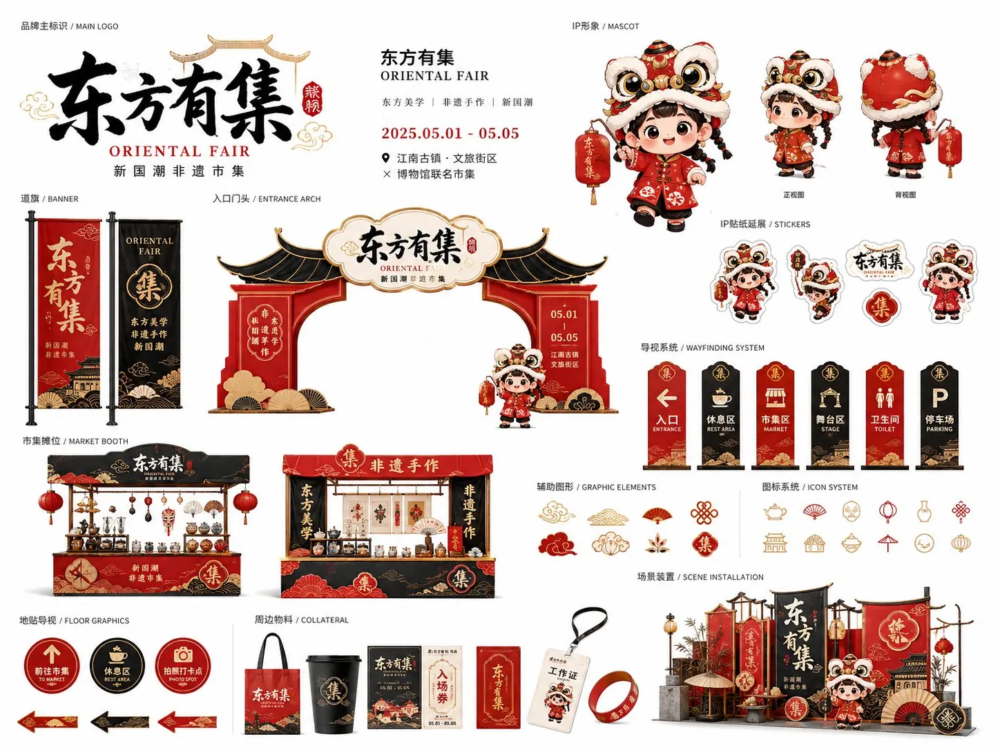 | 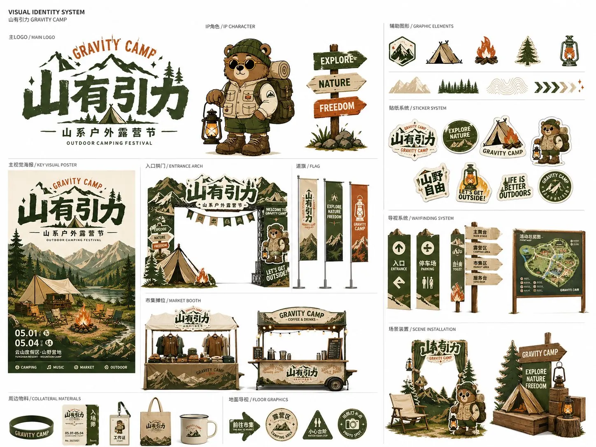 | 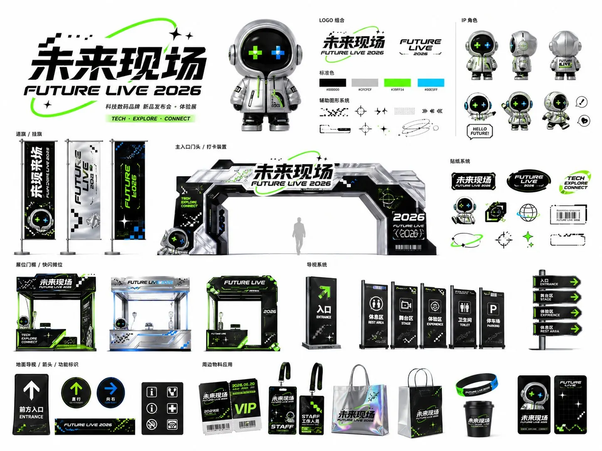 | 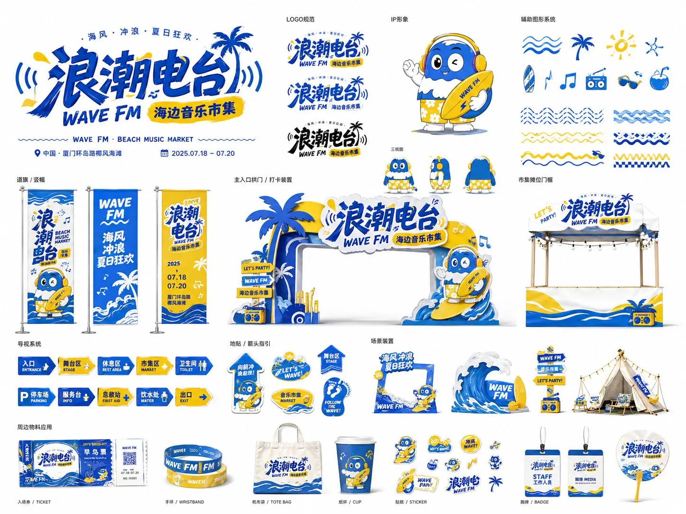 |

提示词/Prompt：请根据【主题：】、【品牌名 / 活动名：】、【行业 / 场景：____】创作一张高完成度的「活动品牌视觉系统提案板 / Event Visual Identity Application Board」。这不是单张海报，也不是简单 Logo 设计，而是一整套围绕活动主题展开的品牌视觉系统展示图。画面需要像专业设计公司给客户提案的视觉应用总览页，集中展示该活动从主视觉、Logo、IP角色、辅助图形，到线下空间物料、导视系统、周边贴纸、场景装置的完整延展。【整体定位】请将【品牌名 / 活动名】设计成一个具有鲜明识别度的活动视觉系统，适合用于【行业 / 场景】中的线下活动、节庆市集、品牌快闪、商业空间、文旅活动或城市公共活动。整体要有强烈的品牌感、节庆感、年轻感、空间落地感和视觉统一性。【画幅与展示方式】画幅比例：【4:3 横版】。整体呈现为一张品牌视觉系统提案板。背景建议使用【背景颜色纯白色，方便抠图】，让不同物料模块像作品集展示一样清晰陈列。画面中需要展示多个不同尺寸、不同功能的视觉应用模块，而不是只画一个主视觉。【核心视觉系统】请围绕【主题】自动建立一套统一的视觉语言，包括：1. 主 Logo / 主标题设计- 设计醒目的【品牌名 / 活动名】主标题。- 字体要有明显设计感，可以结合几何变形、手写感、粗描边、图形穿插或主题符号。- 可加入英文副标题、日期、地点、活动口号等辅助文字。- 主 Logo 应该适合被延展到门头、海报、贴纸、导视牌等不同物料上。2. 辅助图形系统- 根据【主题】自动生成一套辅助图形符号。- 例如线条、波纹、几何块、图标、箭头、花朵、星形、光线、主题纹样、贴纸边框等。- 所有辅助图形必须和主视觉保持统一，不要变成杂乱装饰。3. IP角色 / 吉祥物 / 主题人物- 根据【主题】设计一个或多个可爱的、潮流的、具有传播感的 IP 角色。- 角色可以是人物、动物、拟人化物品或主题吉祥物。- 角色要能出现在不同物料中，例如门头、旗帜、贴纸、导视牌、打卡装置。- 角色风格应与整体视觉一致，具备高识别度和亲和力。【物料应用展示】请在同一张画面中展示一整套完整的活动物料系统，至少包括以下类型中的多个模块：1. 大型主视觉 Logo 或入口装置2. 活动门头 / 拱门 / 打卡装置3. 展位门楣 / 快闪摊位 / 市集摊位4. 道旗 / 挂旗 / 竖幅5. 导视系统，例如入口、休息区、停车场、卫生间、舞台、服务台等6. 贴纸系统 / 社交媒体贴纸 / 小图标7. 地面导视 / 箭头 / 功能标识8. 场景化装置，例如露营区、休闲区、产品展示区、互动拍照区9. 周边物料，例如手环、票券、袋子、卡片、杯子、胸牌、指示牌等这些物料不要孤立存在，而要像一套完整的品牌设计系统，体现“同一主题、同一色彩、同一图形语言、不同应用场景”的延展关系。【颜色与风格】主色调：【主色调，例如海洋蓝、阳光黄、纯白、黑色】。辅助色：【辅助色，例如粉色、橙色、绿色、浅灰】。整体风格：【风格方向，例如年轻潮流、节庆活力、海边夏日、城市文旅、亲子可爱、科技未来、户外露营、复古市集】。色彩要求：高识别度、色块清晰、对比强烈、适合线下物料落地、不要灰暗、脏乱、低饱和、颜色之间要有统一的品牌秩序【构图与排版】画面采用“多模块品牌系统展示板”的构图方式。不要做成单张海报，也不要只做一个 Logo。请将不同物料以错落有序的方式排列，形成专业提案板效果。建议版式：- 顶部展示主 Logo 和大型入口装置- 左侧展示大型旗帜、竖幅或主视觉延展- 中部展示门头、展位、导视牌等核心应用- 右侧展示场景化装置、贴纸、周边图标- 底部展示箭头、功能导视、小型物料和辅助图形整体需要有清晰留白、层级关系和视觉节奏。每一个模块都要像真实可落地的活动物料，而不是随意拼贴。【材质与落地感】请让部分物料具有真实的线下应用质感，例如：亚克力立牌、PVC板、喷绘布、金属支架、布旗、地贴、展架、立体字、贴纸白边、展位门头、户外装置整体可以保持平面插画风，但要体现“可制作、可落地、可安装”的活动视觉物料感。【文字处理】画面可以包含少量清晰文字，例如：- 【品牌名 / 活动名】- 【地点】- 【日期】- 【英文副标题】- 【活动口号】- 功能导视文字，如 Entrance、Rest Area、Market、Parking、Toilet 等文字要作为设计元素融入画面，不要密密麻麻。如果模型无法稳定生成准确文字，请优先保证排版结构、Logo感和视觉系统完整性。【最终效果】最终画面应像一张完整的品牌视觉系统作品集展示页，具有：专业设计提案感、完整品牌识别系统、统一图形语言、丰富线下物料应用、强烈活动氛围、高商业落地感、适合系列化扩展请避免：只生成一张单独海报、只生成一个 Logo、物料之间风格不统一、元素过度杂乱、缺少应用场景、缺少导视和空间落地感、文字过多导致画面混乱

品牌商用画册视觉方案

| 预览 | 预览 | 预览 | 预览 |
| --- | --- | --- | --- |
| 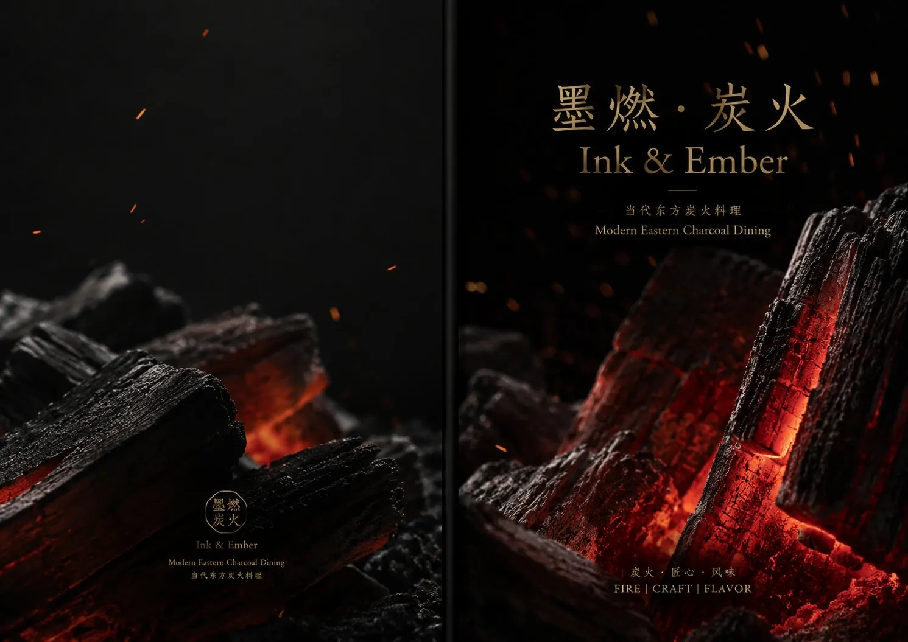 | 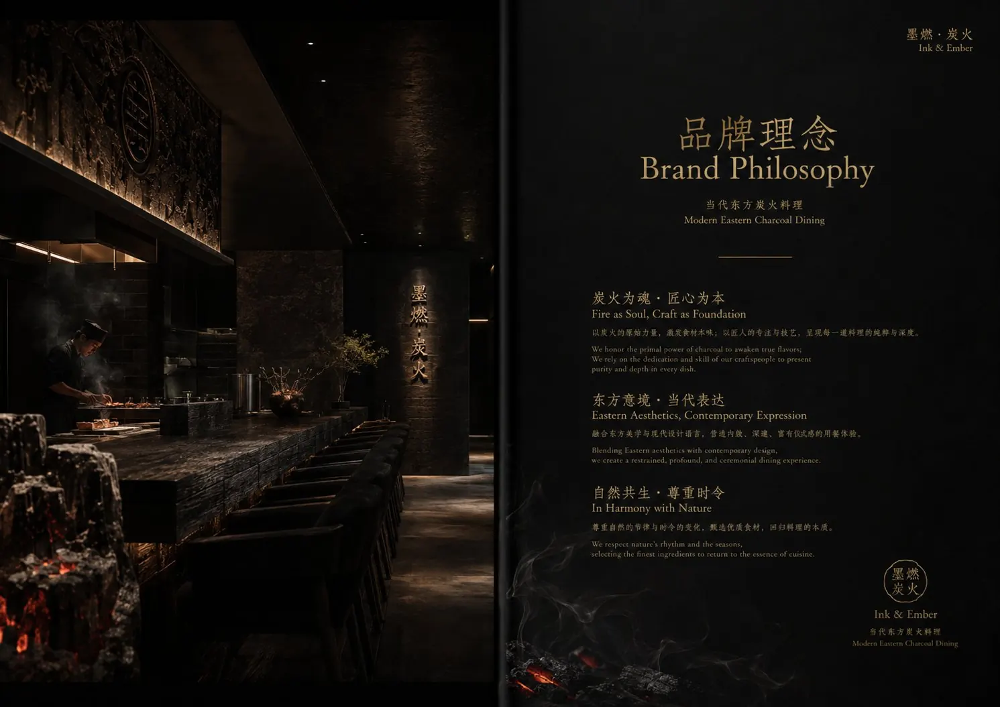 | 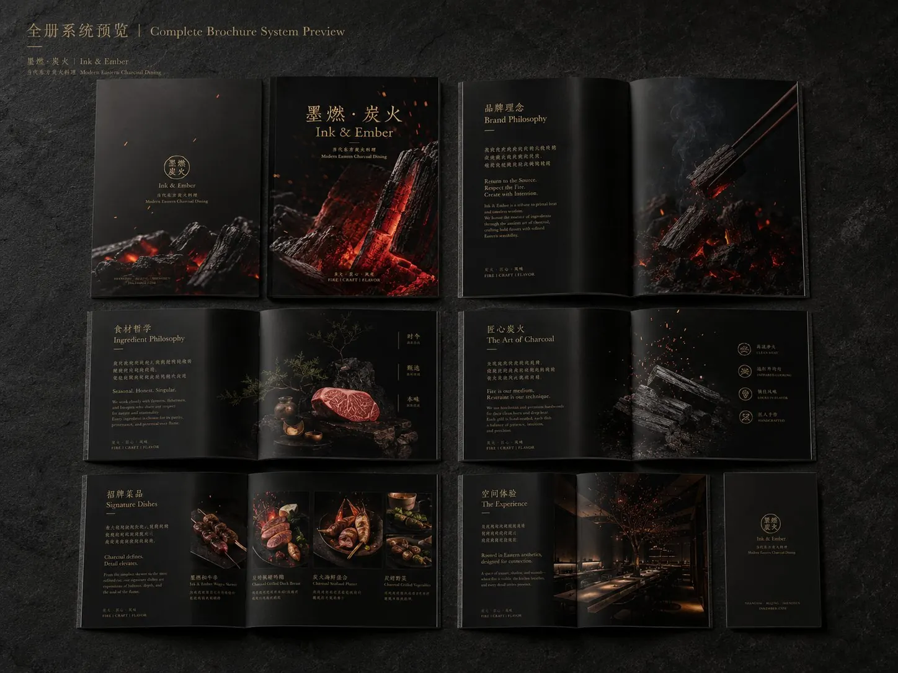 | 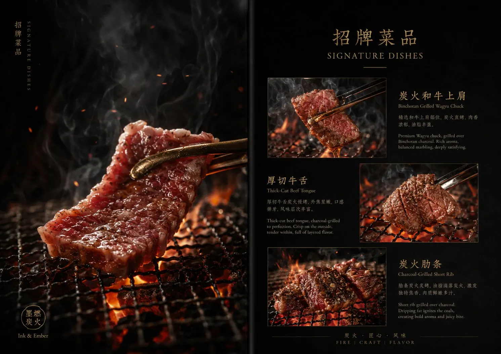 |
| 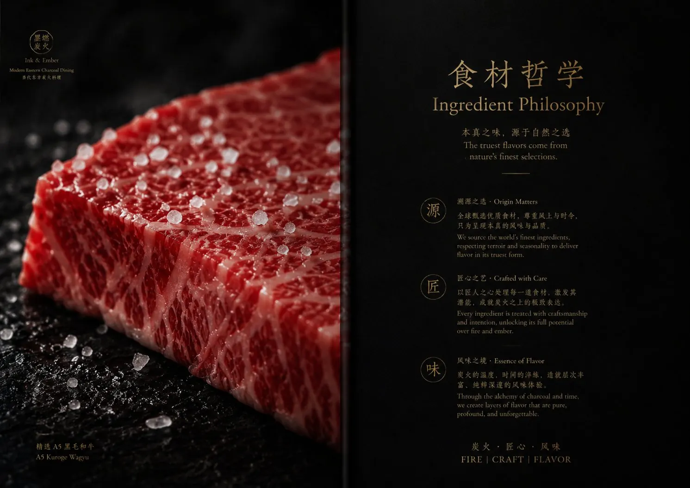 |  |  |  |

请生成一套高端「炭火东方餐饮」品牌商用画册视觉方案。

【品牌名】：墨燃 · 炭火（Ink & Ember）

【行业/菜系】：现代东方炭烤 / 高端和牛烧肉

【风格方向】：深色科技美学与传统东方意境结合。采用哑光黑、深灰、暗金配色。

【画册内容与结构】：

封面与封底：特写一张红烫的备长炭火，火星迸溅，极简金色文字排版。

品牌理念页：展示烟熏感十足的餐厅内部空间，强调木质与石材的质感。

食材哲学页：极致写实拍摄，大理石纹理极其饱满的生肉特写，带有晶莹的海盐颗粒。

招牌菜品页：炭火炙烤中的肉类，油脂滴落，带有真实的烟雾感和热气。

全册系统预览：展示整本画册平铺在深色石材桌面上的效果。

【视觉要求】：

电影级摄影质感，35mm微距镜头细节。大量留白与精细的中英文字体排印（Serif字体）。色彩饱和度在食材部分极高，在背景部分极低。8k分辨率。

## 鲜果电商商品化提案

| 预览 | 预览 | 预览 | 预览 |
| --- | --- | --- | --- |
| 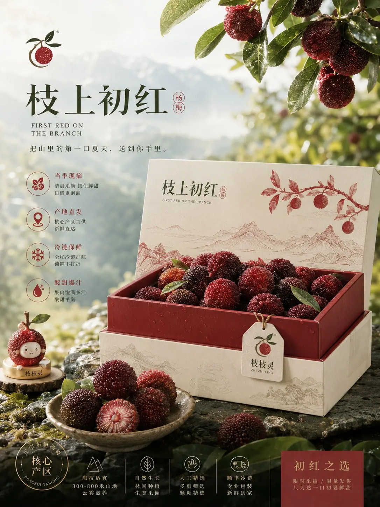 | 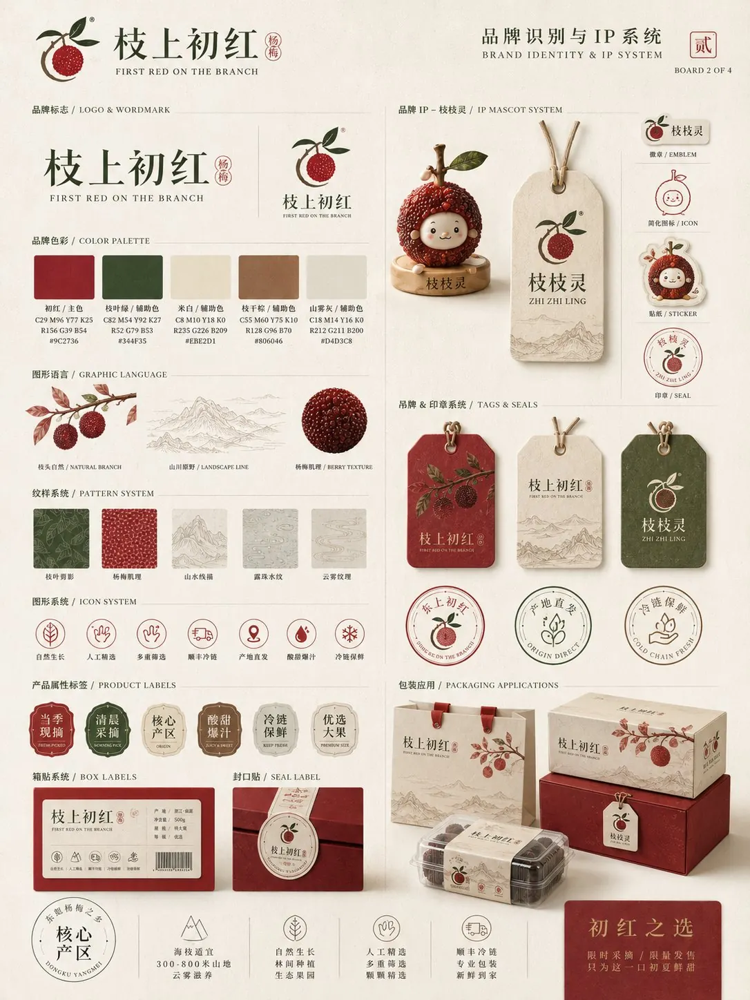 | 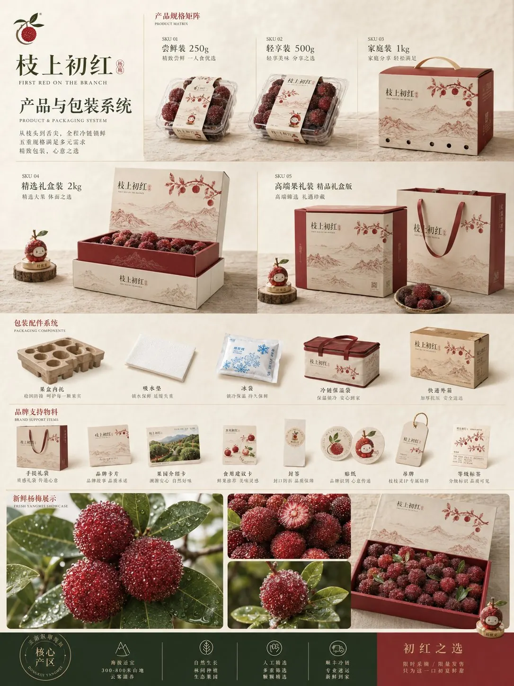 | 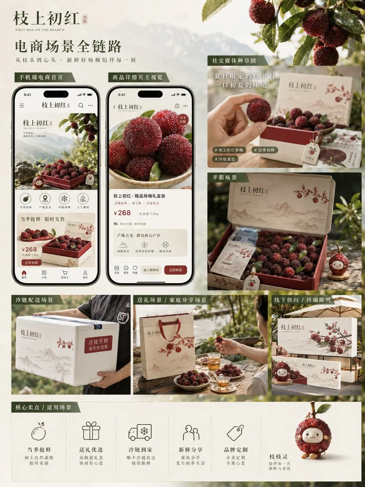 |

《鲜果电商商品化提案》提示词：

请根据以下设定，创作一套高完成度、具有统一视觉系统的「原创鲜果电商品牌商品化提案 / 4-Board Fresh Fruit Brand Commercialization Proposal」。

注意：这不是四宫格，也不是把4张内容合成在一张图里，而是同一个品牌系统下的4张独立图片，需要依次分别生成。每次只生成当前这一张，并自动延续前面已经建立好的品牌视觉DNA，直到4张全部完成。画幅比例统一为竖版 3:4。

### 品牌设定

品牌名：枝上初红

英文辅助名：FIRST RED ON THE BRANCH

品牌类型：高端鲜杨梅电商品牌 / 夏日鲜果品牌 / 轻礼赠鲜果品牌

一句话定位：把山里的第一口夏天，送到你手里。

核心关键词：杨梅季、当季现摘、产地直发、冷链保鲜、酸甜爆汁、山野感、夏日果礼、电商商品化

目标人群：城市家庭、年轻白领、注重品质和时令感的消费者、轻礼赠用户、电商水果消费人群

整体风格：夏日鲜果电商美学 × 高级写实商品摄影 × 轻果礼品牌提案

主色：杨梅深红、鲜果红紫

辅助色：叶片绿、奶白、冰白、浅灰蓝

点缀色：露珠银灰、少量微金属浅金

视觉元素：杨梅果粒纹理、枝叶、果梗、山形线描、晨露、水滴、冰感、果园气息、冷链保鲜符号、夏日清爽氛围

品牌口号：把山里的第一口夏天，送到你手里。

### IP设定

需要轻IP，不要只有Logo。IP名为「枝枝灵 / ZHI ZHI SPIRIT」。

它不是大眼睛卡通杨梅人，而是一个克制、可爱、轻拟人化的品牌果灵识别物，可以表现为小徽章、小吊牌、小挂件、小贴纸、小印章、小摆件或包装守护灵。它应有杨梅、叶片、枝头的气质，轻可爱但不低幼，不廉价，不喧宾夺主，应自然融入品牌系统与商品系统中。

### 产品线 / SKU

尝鲜装：250g

轻享装：500g

家庭装：1kg

精选礼盒装：2kg

高端果礼装：精品礼盒版

配套内容：果盒内托、吸水垫、冰袋、冷链保温袋、快递外箱、手提礼袋、品牌卡片、果园介绍卡、食用建议卡、封签、贴纸、吊牌、等级标签

### 整体要求

四张图必须明显属于同一个品牌系统，品牌名、色彩、字体气质、图形语言、IP形象、包装逻辑、商品调性全部统一。

不是普通水果海报，也不是廉价促销图，而是一套可销售、可传播、可复用的鲜果电商品牌系统提案。

画面必须非常写实，要有真实鲜果质感、真实包装材质感、真实商品摄影感、真实冷链与电商场景感。

文字尽量准确，品牌名“枝上初红”、英文“FIRST RED ON THE BRANCH”、IP名“枝枝灵”尽量清晰正确，不要乱码，不要大段无意义小字。

IP要存在，但要轻，不要低幼卡通，不要像儿童零食包装。

整体要通透、清亮、新鲜、有果汁感、有夏日感，同时具备品牌提案感和商业感。

### 第1张：品牌主视觉封面图 / Brand Hero Board

这张图负责定调，是第一视觉记忆点。

重点展示：

品牌名“枝上初红”

英文辅助名“FIRST RED ON THE BRANCH”

品牌口号

高端鲜杨梅主包装或礼盒主视觉

饱满、新鲜、深红、带颗粒、带露珠的真实杨梅特写

枝叶、果梗、山野清晨、微雾、水滴等氛围元素

轻IP“枝枝灵”以徽章、吊牌、小摆件或品牌识别物的方式出现

核心卖点：当季现摘、产地直发、冷链保鲜、酸甜爆汁

要求：更偏封面图 / Hero Image，而不是说明书；有种草感、新鲜感、高级感和第一眼食欲感。

### 第2张：品牌识别与IP系统图 / Identity & IP System Board

这张图负责解释品牌视觉系统和IP语言如何构成。

重点展示：

品牌字标 / Logo

品牌配色系统

杨梅果粒纹理、枝叶、果梗、山形线描、水滴、冰感图形等辅助视觉语言

轻IP“枝枝灵”系统：IP形象、小徽章、小挂件、贴纸、吊牌、印章、封签、简化图标

规格标签系统

甜度 / 果径 / 新鲜度 / 冷链图标系统

小型应用系统：标签、贴纸、封签、吊牌、卡片

要求：像高端品牌识别提案板，但不要僵硬，不要低幼；模块清晰，信息完整，有设计感和统一性。

### 第3张：商品与包装系统图 / Product & Packaging System Board

这张图负责展示品牌如何落到真实商品与包装系统上。

重点展示：

250g、500g、1kg、2kg、精品果礼装的商品矩阵

鲜果包装盒、礼盒、内托、吸水垫、冰袋、保温袋、手提礼袋、冷链外箱

品牌卡片、果园介绍卡、食用建议卡

封签、标签、吊牌、等级贴

鲜果近景、果径分级或品质表达

轻IP“枝枝灵”自然融入包装系统

要求：像真实可以上架销售的鲜果电商品牌商品系统，不要只摆一堆盒子；要看得出规格层级、包装逻辑和品牌统一性。

### 第4张：电商传播与销售场景图 / Campaign & Sales Scenario Board

这张图负责展示品牌进入真实电商与传播场景后的效果。

重点展示：

手机端电商首页 / 商品详情页主视觉

社交媒体种草图 / feed 风格传播图

开箱场景：打开鲜果盒，看到杨梅、冰袋、卡片等

冷链配送场景：外箱、配送、到家开箱

送礼场景 / 家庭分享场景 / 夏日下午茶场景

可选门店快闪 / 柜台 / 展示台小场景

品牌色、包装、IP符号、商品系统在不同场景中保持统一

要求：比第3张更强调真实销售与传播场景，不是简单包装展示，而是完整电商链路和品牌应用效果。

### 负面要求

不要四宫格，不要把4张图拼在一张里。

不要廉价水果促销海报感。

不要低质电商模板感。

不要拼贴素材感。

不要过度传统土特产感。

不要把IP做成大眼睛卡通杨梅人。

不要幼稚、低龄、廉价。

不要虚假的CG摆拍感。

不要照搬任何现成品牌或已有IP。

### 执行方式

请先统一“枝上初红”的品牌视觉DNA，再按顺序生成：

第1张：品牌主视觉封面图

第2张：品牌识别与IP系统图

第3张：商品与包装系统图

第4张：电商传播与销售场景图

每次只生成当前这一张独立图片，并自动延续前面已经建立好的品牌系统，直到4张全部完成。

## 原创IP商品化提案-粽子

| 预览 | 预览 | 预览 | 预览 |
| --- | --- | --- | --- |
|  |  |  |  |

《原创IP商品化提案》提示词：

请根据用户输入的品牌信息，创作一套高完成度、具有统一视觉系统的「原创 IP 商品化提案 / 4-Board Original IP Commercialization Proposal」。

注意：

这不是一张四宫格拼图，也不是把4张内容合并在同一个画面里的总图，而是一套需要“依次分别生成”的4张独立图片。你需要在同一个品牌视觉系统下，连续完成这4张图的生成。4张图必须明显属于同一个品牌，但每一张图承担不同职责，不能只是4张重复变体。

这也不是普通海报设计、普通电商详情图或单一包装效果图，而是一套兼具：

品牌感、IP感、产品感、包装感、场景感、商品化落地感、商业提案感、展示感、作品集质量

的完整视觉提案。

### 用户输入

品牌名：【品牌名】

英文辅助名：【英文辅助名】

品牌类型 / 行业：【品牌类型 / 行业】

一句话品牌定位：【一句话品牌定位】

核心关键词（3–8个）：【核心关键词】

目标人群：【目标人群】

整体风格方向：【整体风格方向】

品牌口号 / Slogan：【Slogan】

主打产品 / 核心服务：【主打产品 / 核心服务】

产品线 / SKU 信息：【产品线 / SKU 信息】

品牌故事 / 地域特色 / 文化背景：【品牌故事 / 地域特色 / 文化背景】

主色调倾向：【主色调倾向】

辅助色倾向：【辅助色倾向】

点缀色倾向：【点缀色倾向】

希望融入的文化元素 / 图形元素：【希望融入的文化元素 / 图形元素】

是否需要IP形象：【是 / 否 / 弱化IP】

IP方向偏好：【IP方向偏好】

希望偏重的应用方向：【包装 / 礼盒 / 门店 / 电商 / 社媒 / 周边 / 冷链 / 货架 / 其他】

希望避免的风格：【希望避免的风格】

画幅比例：【默认竖版 3:4，可修改】

其他补充说明：【其他补充说明】

### 总任务

请先基于以上信息，在内部提炼并统一这个品牌的视觉 DNA，再基于同一个品牌 DNA，依次分别生成4张独立图片。

在正式生成4张图之前，请先统一以下内容，并在后续4张图中始终保持一致：

品牌核心气质

品牌视觉关键词

主色 / 辅色 / 点缀色

字体倾向与字形气质

图形语言 / 辅助图案语言

产品或服务的视觉呈现方式

IP形象设定方式

包装 / 应用物料 / 周边 / 场景的统一规则

整体画面气质：品牌感、提案感、商业感、展示感、系列感

4张图风格统一，但信息分工明确，不做成4张内容重复的变体

### 关于IP的特别要求

这套提案不能只有 Logo，没有IP感。即使整体走高端、克制、写实路线，也应具备“IP识别角色”或“符号化IP形象”。

IP不一定是夸张卡通人物，也可以是更高级、更克制的“文化符号型IP / 品牌图腾型IP / 吉祥物型IP / 徽章型IP / 印章型IP / 吊饰型IP / 微雕塑型IP”。

如果品牌适合轻IP路线，请将IP理解为“品牌识别角色”，可以出现在徽章、封签、吊牌、挂件、印章、标签、包装细节、社媒符号中，而不一定作为主角占据整个画面。

如果品牌更适合强IP路线，可以让角色更明确，但依然要与品牌系统统一，不能显得廉价、幼稚或素材感过强。

如果用户明确要求“不要太卡通”，请将IP处理为：更高级、更写实、更有设计感、更像品牌识别符号，而不是儿童化Q版角色。

### 整体统一要求

四张图必须明显属于同一个品牌系统，品牌名、色彩系统、字体气质、图形语言、品牌符号、IP形象（如有）、产品逻辑必须统一。

四张图不是4张重复海报，而是4张不同职责的品牌商品化提案图。

四张图都要具有高完成度、品牌提案感、商业感、展示感和作品集质量。

版式可以有差异，但整体审美、设计语言和视觉系统必须高度统一。

根据不同品牌类型自动匹配最合适的内容：

节令食品 / 地方特产 / 礼盒食品：礼盒、单颗装 / 单品装、标签、手提袋、外箱、礼赠卡、封签、陈列、社媒传播等

餐饮 / 饮品：杯子、瓶身、杯套、纸袋、外卖袋、包装盒、标签、门店、广告海报、电商图等

美妆 / 快消：瓶器、盒装、礼盒、系列包装、陈列、广告KV等

文创 / IP / 零售：周边、徽章、贴纸、吊牌、礼盒、手提袋、海报、门店等

科技 / 数字品牌：官网首屏、APP界面、卡片、数字场景、传播物料等

如果画面中出现文字，请保证品牌名、标题、模块名、口号、关键产品名简洁清晰，尽量准确，不要堆砌过多冗长文案。

每张图都应适合独立展示，同时4张图放在一起时要明显看出是一整套提案。

不要把四张图拼在一张图里，不要做四宫格，不要做一页总览拼贴。

请按顺序依次生成：第1张 → 第2张 → 第3张 → 第4张。

每次只生成当前这一张独立图片，并自动延续前面已经建立好的品牌系统，直到4张全部完成。

如果用户要求“高级写实”，则画面必须具有真实商品摄影感、真实材质感、真实光影和真实产品质感，而不是插画拼贴、低质素材感或廉价电商图。

如果用户要求“有文化元素”，请将文化元素现代化、设计化、品牌化，不要简单堆砌传统装饰符号，不要满屏祥云、龙纹、红金边框等模板化国潮元素。

如果用户要求“不要太卡通”，则整体以轻IP、重品牌、强商品感的方式处理。

### 四张图的固定结构与职责

第1张：品牌主视觉封面图 / Brand Hero Board

这张图负责“定调”，是整套提案的封面图和第一视觉记忆点。

需要重点展示：

品牌名

英文辅助名（如有）

Slogan（如有）

品牌核心气质

品牌关键词的视觉转译

核心主视觉元素

主色系统

能代表该品牌的核心符号：产品、材质、图形、角色、IP识别物、视觉装置、氛围元素等

要求：

更偏封面图 / Hero Image，而不是说明书

画面有视觉冲击力和高级感

品牌感要强

信息不要太满，突出“第一眼记忆点”

如果品牌适合IP，可以出现IP，但应服务整体品牌主视觉

如果用户偏好写实路线，必须有高质感商品摄影感 / 产品渲染感

目标：

让人一眼看出这个品牌是谁、气质是什么、第一印象是什么。

第2张：品牌识别与IP系统图 / Identity & IP System Board

这张图负责解释这个品牌的“视觉系统如何构成”，并清楚说明这个品牌不只是Logo，还有完整的IP识别语言。

需要重点展示：

品牌名 / 字标 / Logo感呈现

主色、辅色、点缀色

字体气质与字形风格

辅助图形 / 图案 / icon / sticker / label 语言

包装图案逻辑或品牌识别元素

IP形象系统：如角色设定、IP徽章、IP挂件、IP印章、IP标签、IP符号演变、三视图、不同动作 / 表情 / 应用方式（根据风格决定）

小型应用系统：贴纸、吊牌、封签、标签、印章、徽章、卡片、腰封、挂件等

要求：

比第1张更有结构感和提案感

更像品牌系统提案板，但不要僵硬得像传统VI手册

模块清晰，逻辑明确

审美要保持高级，不要做成信息堆砌

如果品牌走高端写实路线，IP应偏克制、设计化、符号化，而非幼稚卡通

目标：

让人清楚理解这个品牌的视觉识别语言和IP语言是如何建立起来的。

第3张：商品与包装系统图 / Product & Packaging System Board

这张图负责展示品牌如何真正落到“产品 / 包装 / 服务载体”上，体现商业落地能力。

需要根据品牌类型自动匹配最合适的应用形式，例如：

节令食品 / 地方特产 / 礼盒食品：单品装、礼盒装、手提袋、礼赠卡、口味标签、封签、运输外箱、陈列装、冷链外箱等

餐饮 / 饮品：杯子、瓶身、杯套、纸袋、吸管套、包装盒、外卖袋、贴纸、标签等

美妆 / 快消：瓶器、罐装、盒装、礼盒、系列包装、货架陈列等

文创 / IP / 零售：周边、徽章、贴纸、文具、礼盒、标签、包装延展等

科技 / 数字品牌：官网首页、APP界面、数字产品界面、卡片、服务展示等

要求：

重点体现“产品化 / 包装化 / 可售卖 / 可使用 / 可落地”

至少有一种主力应用载体，也可以有若干延展应用，但必须有主次

画面应具有真实商业摄影感、产品展示感或提案板陈列感

不要只是摆一堆东西，要看得出统一的品牌系统已经落地

如果品牌有SKU，要清楚区分系列、规格、口味、型号、层级

如果品牌有IP，要让IP自然融入包装系统，而不是仅仅单独悬浮存在

目标：

让人看到这个品牌不仅有概念，也能真正变成可售卖、可使用、可执行的产品系统。

第4张：传播与销售场景应用图 / Campaign & Sales Scenario Board

这张图负责展示品牌进入真实传播场景后的视觉效果，体现品牌辨识度、传播力与场景延展能力。

需要根据品牌类型自动匹配最合适的场景，例如：

门店外立面 / 店招 / 柜台 / 导视系统

海报KV / 社交媒体广告 / 立牌 / 灯箱 / 户外广告

快闪店 / 展台 / 品牌活动空间 / 节日陈列空间

电商首页 / 手机端首屏 / 社媒 feed / 数字传播界面

开箱体验 / 礼赠场景 / 货架陈列 / 配送场景

要求：

场景感要比第3张更强，要体现品牌进入真实世界后的传播效果

可以偏广告感、空间感、展示感，但仍要保留提案气质

不要与第3张重复成单纯包装展示图

品牌系统仍需保持统一：品牌名、色彩、字体、图形、IP形象（如有）、产品调性都要一致

如果用户要求真实感，要像真实商业摄影和真实使用场景，而不是拼贴素材

目标：

让人看到这个品牌在真实传播、真实销售和真实应用场景中具有鲜明辨识度和商业表现力。

### 执行方式

请严格按照以下流程执行：

先内部理解并统一品牌视觉 DNA。

然后开始生成第1张图：品牌主视觉封面图。

在保持同一品牌系统的前提下，继续生成第2张图：品牌识别与IP系统图。

在保持同一品牌系统的前提下，继续生成第3张图：商品与包装系统图。

在保持同一品牌系统的前提下，继续生成第4张图：传播与销售场景应用图。

整个过程中，不要把4张图合并成一张，不要变成四宫格，不要让4张图内容重复。

每次只生成当前这一张独立图片，并自动记住前面已经建立好的品牌系统，直到4张全部完成。

### 画面与质量要求

默认画幅比例：竖版 3:4

图片质量：高清、精致、细节丰富

画面气质：品牌提案感、商业感、作品集质量、真实商品感、设计感

文字语言：以中文为主，英文为辅助

文本要求：品牌名、标题、Slogan、关键产品名、模块名尽量清晰准确，不要乱码，不要大段无意义文字

### 负面要求

不要只做Logo，没有IP识别感。

不要做成普通海报拼贴。

不要做成低质电商详情页。

不要做成廉价素材堆砌。

不要大面积出现网络素材感。

不要把传统元素堆满画面。

不要幼稚化、儿童化，除非用户明确要求。

不要把IP做得过于卡通、低龄、夸张，除非用户明确要求。

不要让4张图变成同一内容的重复变体。

不要把4张图拼成一张图。

不要让包装、产品或场景显得虚假和不可信。

不要照搬任何现成品牌、真实商标或已有IP。

### 最终目标

输出一套4张独立但高度统一的原创 IP 商品化提案图：

第1张负责定调

第2张负责解释识别系统与IP系统

第3张负责产品与包装落地

第4张负责传播与销售场景落地

整套结果应具备：

统一的品牌视觉 DNA、清晰的页面分工、高完成度的审美、IP识别度、商品化能力、商业提案感、展示感、作品集质量，以及可直接用于品牌概念展示和内容发布的效果。

## 一号会员店

| 预览 | 预览 | 预览 | 预览 |
| --- | --- | --- | --- |
| 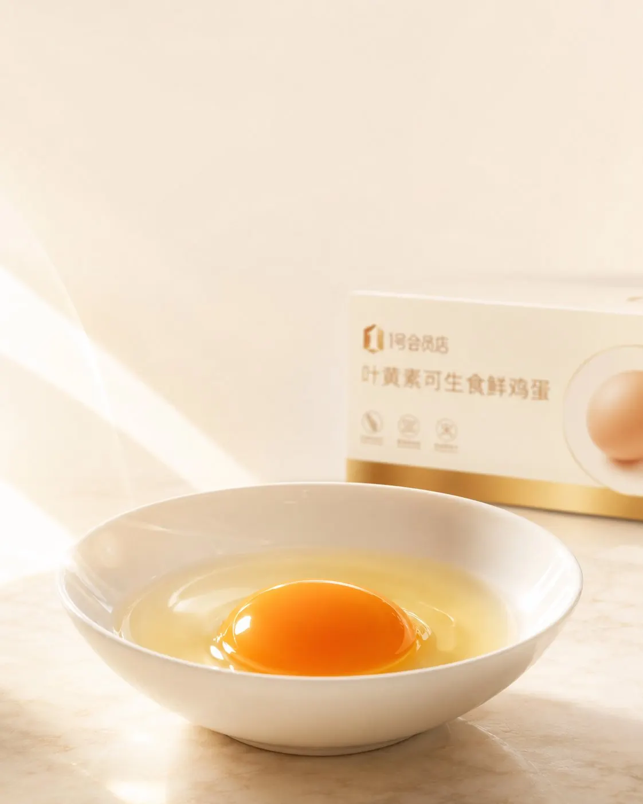 | 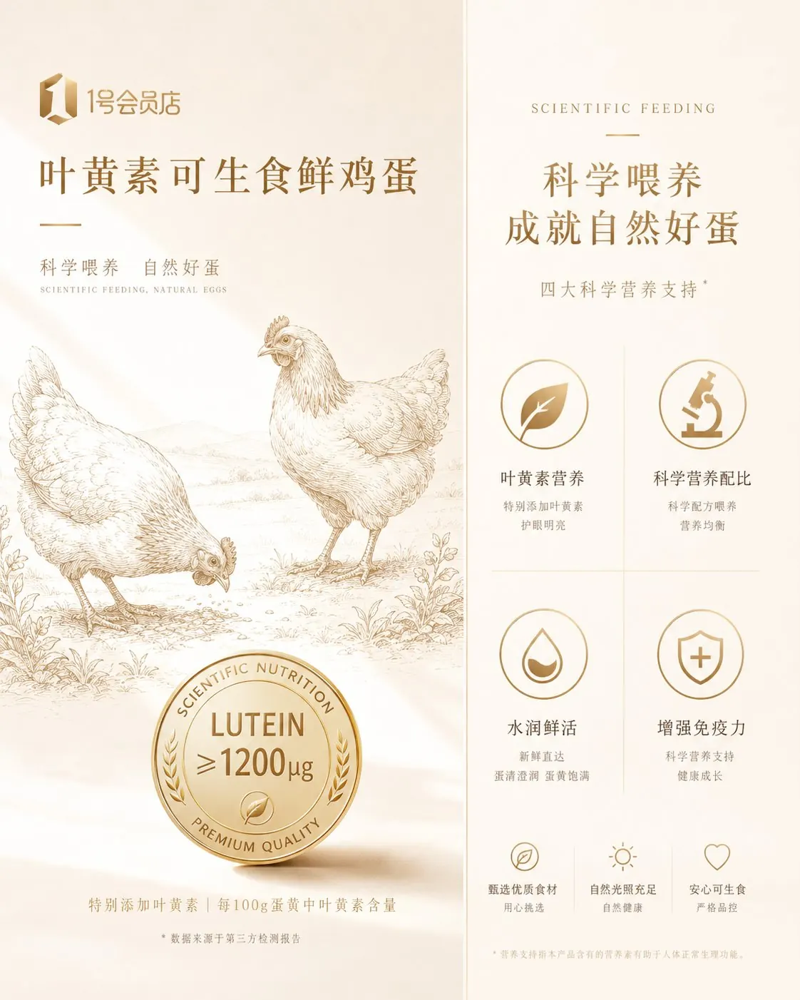 | 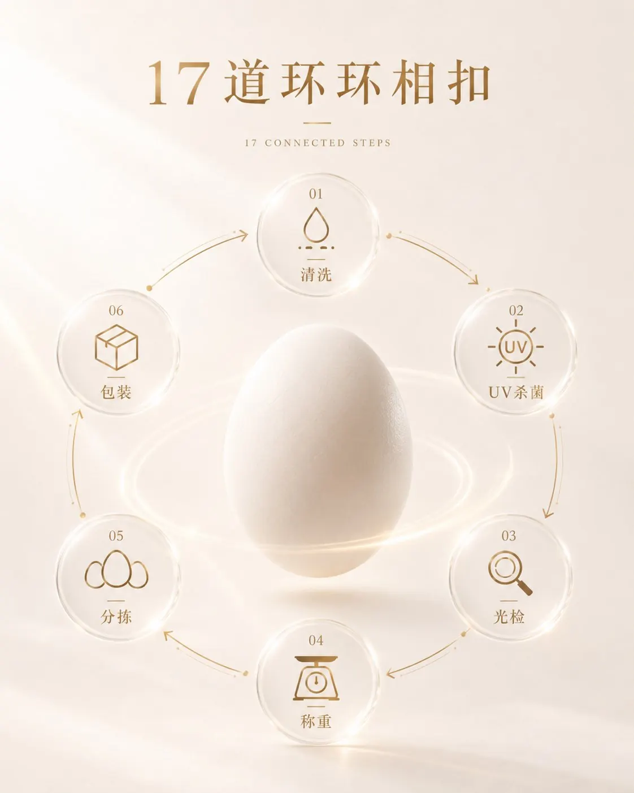 | 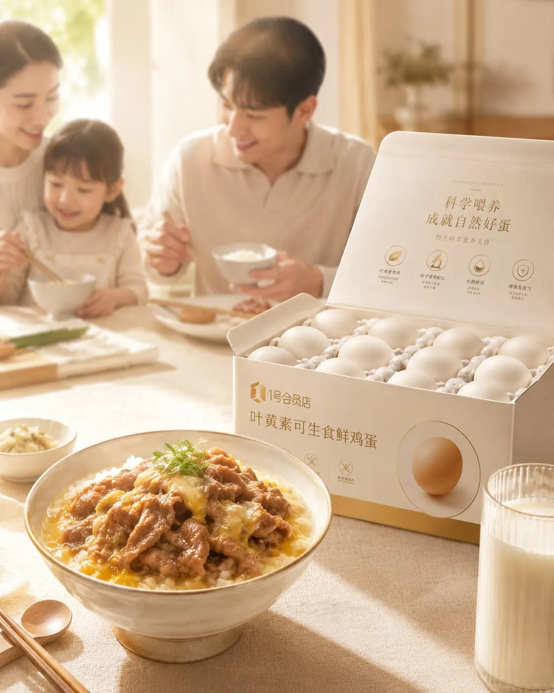 |

第一部分：商品文案策划商品标题主标题： 1号会员店 | 叶黄素可生食鲜鸡蛋 20枚装副标题： NSF认证/17道严选工序/叶黄素≥1200μg，每一枚都是科学与自然的馈赠。2. 核心卖点（USP）提炼【生食标准】 通过NSF认证，无沙门氏菌担忧，开启日式寿喜烧/温泉蛋自由。【营养高标】 每100g含叶黄素≥1200μg，科学喂养，不仅好口感，更护全家。【层层把关】 17道闭环工序，从选种、光照、净化水到杀菌，全程可追溯。【冷链新鲜】 2-6℃冷藏保鲜，珍珠棉深度防护，破损包赔。

《我的世界》方块风

| 预览 | 预览 |
| --- | --- |
| 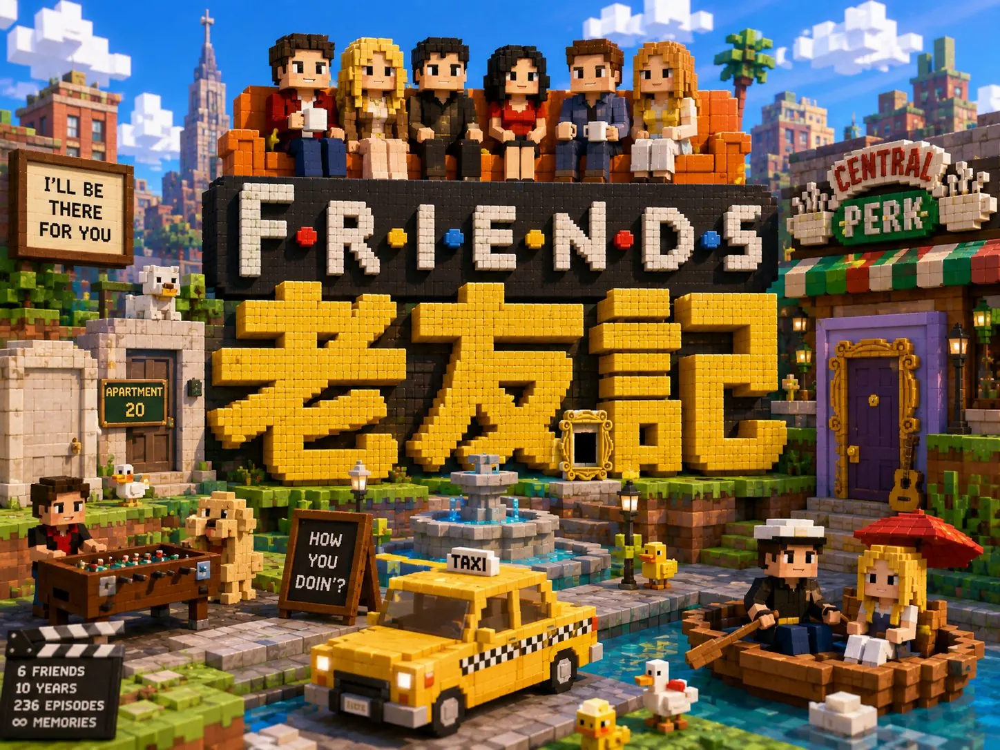 | 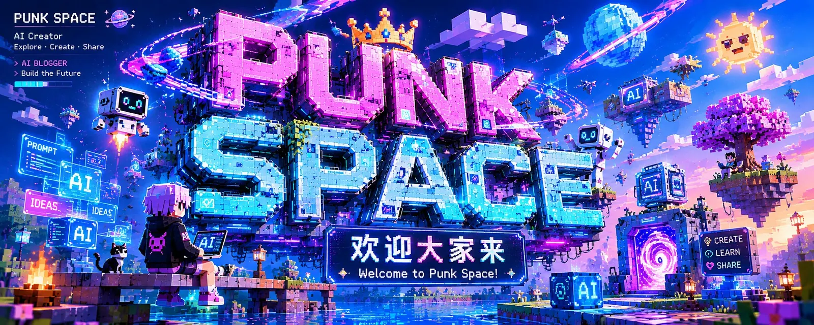 |

| 预览 | 预览 |
| --- | --- |
| 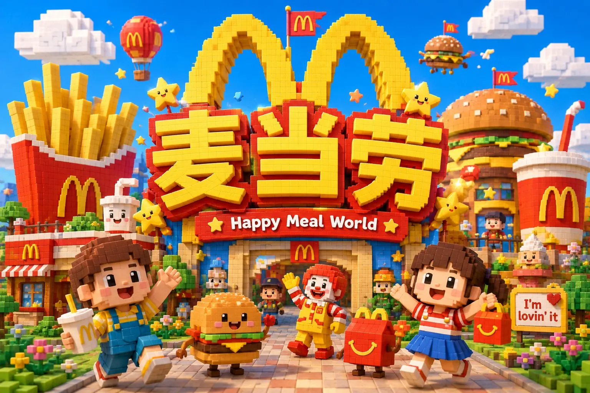 | 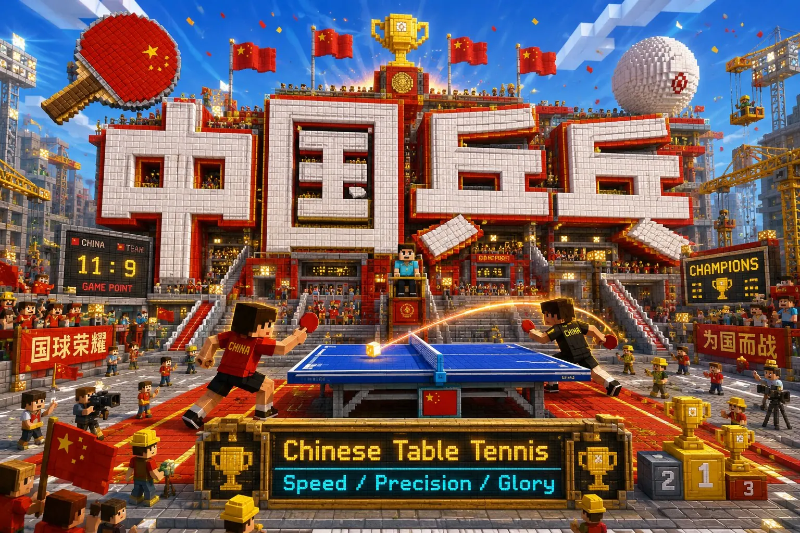 |

| 预览 | 预览 |
| --- | --- |
| 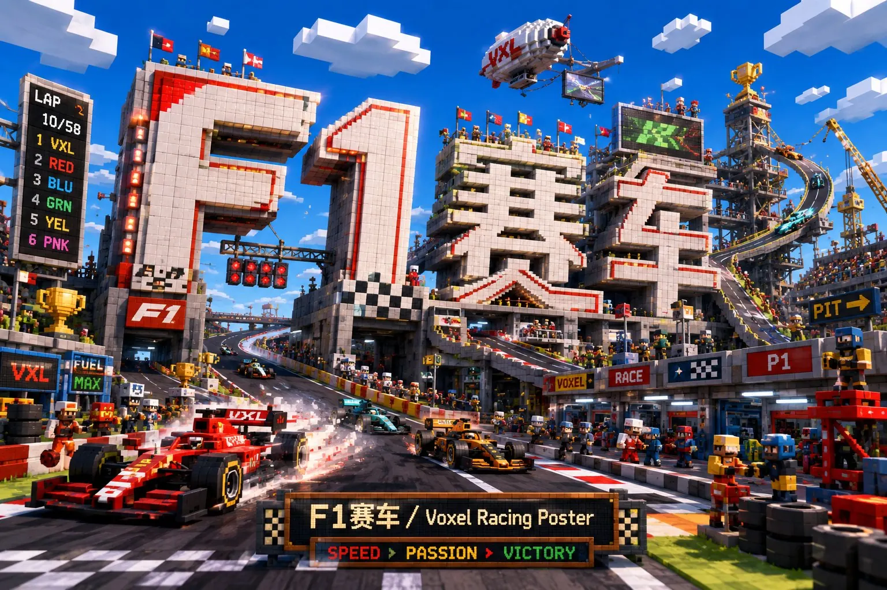 | 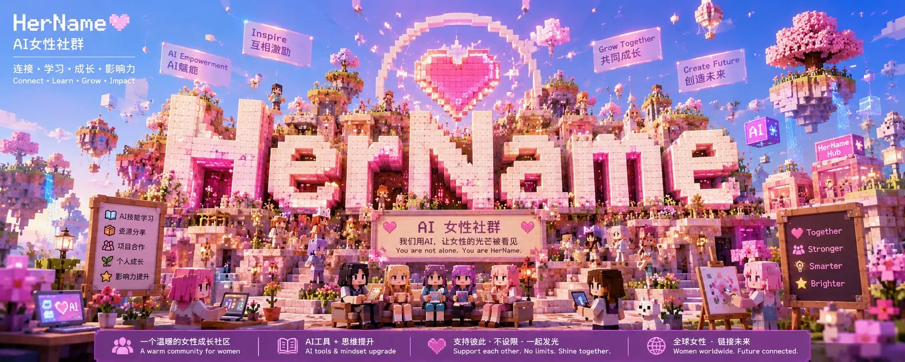 |

Plain Text你是一名顶级像素视觉导演、Minecraft 风格概念海报设计师、方块世界场景设计师、字体海报设计师、潮流封面设计师。你的任务不是简单生成一张《我的世界》风格插画，也不是把标题文字贴在画面上。请围绕我输入的主题，创作一张具有：“Minecraft 方块世界 + 高饱和明亮色彩 + 巨型主题文字重构 + 图像隐喻深度融合 + 游戏封面级构图 + 强传播感”的高级视觉海报。画面整体必须像一个由方块搭建出来的彩色世界。  主题文字必须成为这个世界的一部分，而不是后期叠加的普通文字。【用户输入】主题词 / 主标题：{{主题词}}副标题：{{副标题，可留空}}画幅比例：{{5:2 / 3:2 / 4:5 / 1:1}}语言：{{中文 / 英文 / 中英混排}}用途：{{X封面 / 海报 / 公众号封面 / 游戏风封面 / 头像背景}}可选补充语境：{{补充背景，可留空}}可选情绪倾向：{{快乐 / 冒险 / 童趣 / 热血 / 神秘 / 魔法 / 未来 / 成长 / 挖掘 / 探索，可留空}}可选禁用元素：{{不想出现的元素，可留空}}--------------------------------------------------一、总目标--------------------------------------------------请生成一张真正具有设计感的 Minecraft 方块世界海报。它必须同时满足以下三点：1. 画面必须具有鲜艳、明亮、治愈、游戏感强的方块世界氛围     使用蓝天、阳光、彩色方块、像素云、草地方块、建筑方块、矿石方块、玻璃方块、木头方块、发光方块等元素，形成清爽、明快、丰富但不杂乱的视觉效果。2. 主题文字必须被“方块化重构”     文字不能只是平面字幕。     主题词要像由大量立方体搭建出来的巨大建筑、城墙、道路、传送门、矿山、空岛、阶梯、桥梁、告示牌或地形结构。3. 图像隐喻必须服务主题     根据主题含义，自动选择最合适的 Minecraft 式视觉隐喻，让文字、人物、场景、道具之间形成一个完整的视觉句子。--------------------------------------------------二、核心机制：先理解主题，再决定画面--------------------------------------------------生成前，请先理解主题真正表达的内容，但不要输出分析过程，只输出最终画面。主题可能涉及：- AI / 提示词 / 技术 / 工具- 学习 / 教程 / 方法 / 入门- 创作 / 设计 / 灵感 / 审美- 金钱 / 副业 / 生意 / 增长- 游戏 / 冒险 / 探索 / 升级- 情绪 / 焦虑 / 破局 / 希望- 社群 / 内容 / 流量 / 传播- 城市 / 个人品牌 / 作品集 / 系统搭建你必须抓住主题里最有画面感的那一层，而不是只做字面装饰。--------------------------------------------------三、主题文字隐喻规则--------------------------------------------------主题文字必须成为画面第一视觉。请根据主题自动选择一种最合适的文字重构方式：1. 建筑式文字     把主题词搭建成巨大的方块建筑、城堡、塔楼、入口、纪念碑。2. 地形式文字     把主题词变成地面道路、山体、悬崖、峡谷、草地方块、矿洞入口。3. 传送门式文字     把主题词做成发光传送门，人物从文字中进入另一个世界。4. 挖掘式文字     主题词像矿石一样埋在地下，被角色挖掘出来，露出发光边缘和碎裂方块。5. 阶梯式文字     主题词被设计成一层层上升的方块台阶，象征成长、升级、路径、教程。6. 桥梁式文字     主题词横跨画面，像一座方块桥，连接两个区域，象征连接、方法、迁移、破局。7. 空岛式文字     主题词漂浮在天空，像由方块组成的天空岛、平台、云上建筑。8. 机关式文字     主题词像红石机关、按钮、轨道、活塞、电路系统，适合技术、AI、自动化、系统类主题。9. 城镇式文字     主题词被拆成彩色方块招牌、房屋立面、街区结构，适合生活方式、商业、小生意、社群类主题。10. 生长式文字     主题词从草地、树木、花朵、藤蔓、方块植物里生长出来，适合创作、成长、灵感、希望类主题。--------------------------------------------------四、图像隐喻自动匹配--------------------------------------------------请根据主题自动选择 1–3 个核心视觉锚点。如果主题偏 AI / 提示词 / 技术：优先使用：- 方块电脑- 像素终端- 发光代码方块- 红石电路- 数据流光块- AI 核心方块- 由提示词文字组成的传送门避免俗套机器人脸和廉价蓝紫科技城。如果主题偏教程 / 指南 / 方法：优先使用：- 方块地图- 路径线- 阶梯- 指路牌- 任务面板- 冒险路线- 从新手村走向远方城堡主题文字可变成道路、台阶、地图地形。如果主题偏创作 / 设计 / 审美：优先使用：- 彩色方块画布- 像素调色板- 方块工作台- 漂浮的视觉碎片- 方块字体稿- 海报缩略图方块主题文字可以像被搭建、拼接、上色、重构出来。如果主题偏财富 / 生意 / 增长：优先使用：- 方块金币- 绿宝石矿石- 商店村庄- 交易牌- 上升阶梯- 宝箱- 发光矿洞避免廉价金币堆，要更像游戏里的资源发现和升级。如果主题偏情绪 / 破局 / 希望：优先使用：- 黑暗矿洞中的光- 裂开的方块墙- 远处传送门- 小人物走向巨大文字入口- 云层后的太阳主题文字可成为出口、裂缝、门、光源。如果主题偏社群 / 内容 / 传播：优先使用：- 方块小人聚集- 像素气泡- 彩色告示牌- 扩散的信号方块- 方块城镇广场主题文字可成为中心广场、巨型招牌、舞台。--------------------------------------------------五、长标题自动提炼机制--------------------------------------------------当主题较长时，不要把整句都做成巨大文字。请自动拆分成三层文字系统：A层：主视觉巨型文字  提炼最有视觉张力的核心词，通常为 2–6 个中文字符，或 1–3 个英文单词。  它必须被方块化、建筑化、地形化，成为画面第一视觉。B层：完整主标题  保留用户输入的完整主题内容，以像素告示牌、任务面板、方块 UI、游戏菜单、小标题等形式出现。C层：副标题 / 标签信息  以小号像素字体出现，可放在角落、底部、路牌、背包栏、状态栏、任务栏中。如果主题很短，可以直接把完整主题做成巨大方块文字。  如果主题较长，必须提炼核心词做大字，完整标题作为辅助信息保留。  不能断章取义，不能偏题，不能让用户看不懂主题。--------------------------------------------------六、画面风格要求--------------------------------------------------整体风格必须接近：- Minecraft-inspired voxel world- colorful blocky game poster- bright voxel art- low-poly cube world- pixel block style- vibrant game cover- cubic typography- playful editorial poster- block-built 3D title- saturated sunny color palette- cinematic game composition画面必须具有以下特征：1. 所有主要物体都由方块、立方体、像素块构成  2. 色彩鲜艳，高饱和但不脏  3. 光线明亮，有阳光、柔和阴影、体积光、轻微景深  4. 氛围积极、清爽、有游戏探索感  5. 主体文字巨大、清晰、可读  6. 人物可以很小，用来制造尺度反差  7. 场景可以是草地、村庄、天空、矿洞、城堡、方块城市、空岛、传送门、工作台空间  8. 画面要有空间纵深，而不是平铺图标  9. 整体像游戏宣传海报，不像儿童贴纸，也不像普通插画--------------------------------------------------七、构图规则--------------------------------------------------画面必须有明确层级：第一层：巨型方块主视觉文字  第二层：围绕文字展开的主题隐喻场景  第三层：人物、道具、路径、信息栏、副标题等细节构图可自动选择：- 仰视巨型文字建筑- 俯视方块地图文字- 人物站在巨大文字前- 文字变成道路通向远方- 文字漂浮在空中成为空岛- 文字嵌入山体或矿洞- 文字作为传送门发光- 文字成为村庄中心广场- 文字被角色正在搭建或挖掘画面必须干净、有中心，不要塞满无意义元素。--------------------------------------------------八、文字设计规则--------------------------------------------------1. 主题文字必须准确，不得错字。  2. 中文文字要清晰可读，方块化但不能变成乱码。  3. 英文文字要使用粗壮像素字体或方块无衬线字体。  4. 主标题必须像真实存在于方块世界里的结构。  5. 字体边缘可以由小方块、彩色块、发光块、矿石块、草地方块构成。  6. 可加入轻微破损、搭建痕迹、台阶结构、阴影、反光、发光边缘。  7. 不能只是把普通字体贴在画面前方。--------------------------------------------------九、可选细节增强--------------------------------------------------可以加入少量增强游戏感的细节：- 像素太阳- 方块云朵- 彩色房屋- 草地方块- 发光矿石- 小方块人物- 工作台- 宝箱- 火把- 红石线路- 任务面板- 路牌- 方块树- 漂浮空岛- 像素粒子- 方块碎片- 彩色玻璃- 游戏 UI 状态栏这些元素只能服务主题，不能抢走主标题。--------------------------------------------------十、严格禁止--------------------------------------------------禁止出现以下问题：- 只生成普通 Minecraft 场景，没有主题文字重构- 文字只是平面贴图- 主题词不清晰、错字、乱码- 画面过度杂乱- 色彩脏乱、灰暗、压抑- 过度真实渲染，失去方块游戏感- 低质儿童玩具感- 只堆角色、房子、树，没有概念表达- 长标题整句全部放大导致拥挤- 图像隐喻和主题无关- 机械套模板- 廉价卡通封面感- 普通像素头像感- 文字太小- 主视觉不明确--------------------------------------------------十一、最终成图标准--------------------------------------------------最终画面必须达到：1. 一眼看到巨大的主题核心词  2. 主题文字像由方块世界真实搭建出来  3. 场景和文字共同表达主题隐喻  4. 色彩鲜艳、阳光、清爽、有游戏封面感  5. 有空间纵深和尺度反差  6. 适合发在 X、小红书、公众号封面或作品集展示  7. 任何人替换主题词后，都能自动生成不同但同样成立的方块世界海报请直接生成最终画面。  不要输出分析过程，不要输出解释文字。

## 治愈系文创产品

| 预览 | 预览 | 预览 | 预览 |
| --- | --- | --- | --- |
| 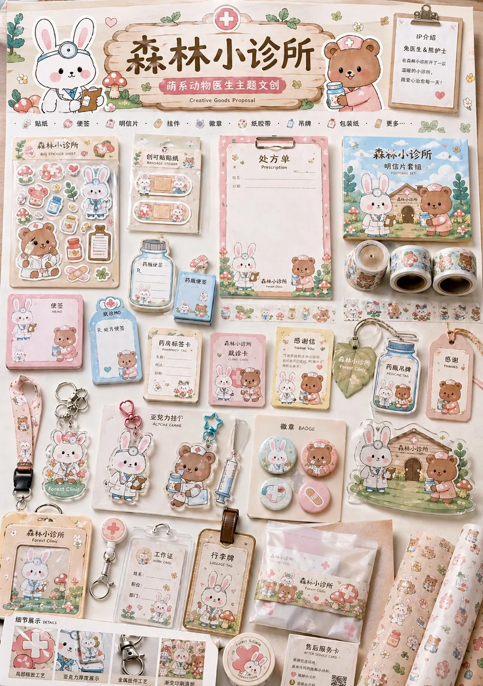 | 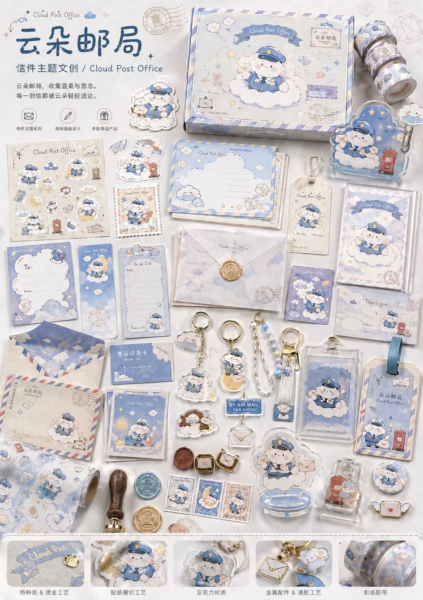 | 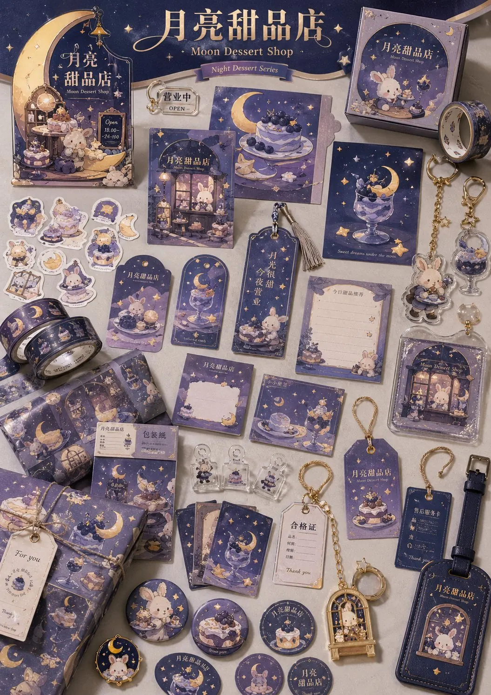 | 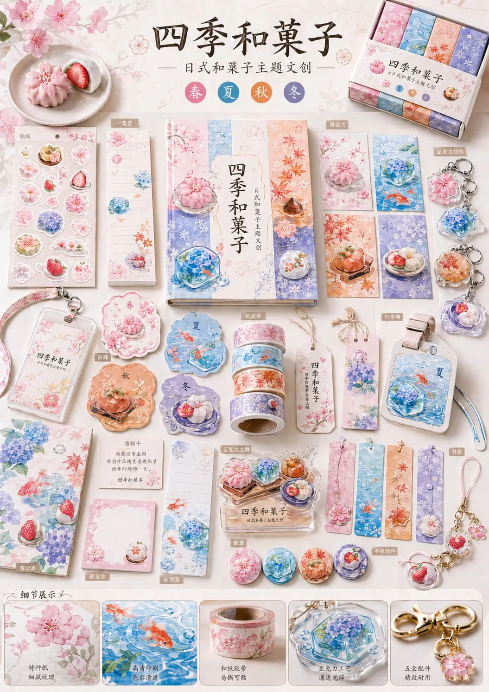 |

请生成一张“治愈系文创产品实物展示稿 / 文创套装设计提案板”，主题信息围绕：【文创名称】、【文创类型/分类】 自动展开。请根据这两个信息，自动提炼适合该主题的治愈系视觉设定，并延展成完整的系列文创产品方案。整体画面必须不是普通平面插画，而是更接近真实文创产品展示的俯拍平铺式设计稿，具有明显的实物感、材质感、层次感和可售卖周边的展示效果。整体默认采用治愈系、精致、软萌、统一的视觉风格，保留手绘感与文创感，但同时强化商品展示属性；画面应呈现为高完成度的产品 mockup 展示板，像真实印刷品、异形周边和小商品被整齐陈列在一个画面中。

整体配色默认采用更清晰、更明亮的治愈系方案，以奶油色、柔粉、雾蓝、浅紫、浅卡其、暖杏色等为辅色，并适当加入更明确的小面积亮色点缀来提升识别度和对比度，使颜色柔和但不灰暗、温柔但不发闷、清晰但不刺眼。请避免整体灰蒙蒙、发虚、对比不足的效果，颜色要干净、层次分明、边界清楚，同时保留治愈系文创特有的柔和氛围。整体质感默认包含纸张纹理、轻覆膜感、局部亮面、亚克力透明感、金属挂件感、贴纸切边感、印刷品边缘感和适度颗粒手绘质感，让插画与实物材质自然融合。避免背景过度米黄或者整体颜色米淡。

画面排版默认采用竖版高密度实物陈列板结构，以“主标题 + 主视觉产品 + 丰富单品陈列 + 局部细节拆解”的方式组织。整体以俯视平铺展示为主，产品之间要有明显的大小变化、错落摆放、遮挡关系、轻微重叠关系和自然阴影，体现真实桌面陈列感。请加入适度阴影、接触阴影、投射阴影和厚度边缘，使每个产品都像真实存在的物体，而不是贴在背景上的平面图层。允许少量产品略微倾斜摆放、堆叠摆放或局部露出，以增强真实感和丰富度。背景可以是浅色桌面、柔和纹样底板或轻装饰铺底，但必须服务于实物陈列，不要喧宾夺主。

请默认生成一整套丰富、多样化、具有异形设计感的治愈系文创产品，不要只生成吊牌、便签、书签这类单一纸品。产品线应默认包含并综合呈现：异形贴纸、切边贴纸、小卡、异形卡片、明信片、书签、便签、长条便签、标签卡、吊牌、包装卡、售后卡、封口贴、纸胶带、包装纸，以及更有周边感和异形感的产品，如钥匙扣、亚克力挂件、手机挂件、挂坠、吊饰、徽章、亚克力夹子、异形摆件、卡套、小挂牌、行李牌等。请根据主题自动选择适合的产品组合，并让产品之间有明显差异：既有规则矩形纸品，也有不规则裁切的异形单品；既有平面印刷物，也有透明、半透明、带金属配件或厚度边缘的小周边，整体形成更丰富、更高级、更完整的文创产品线。

请围绕同一主题建立统一的图案语言和视觉母体，让相同的核心图形、角色、符号、纹样、配色和装饰元素重复应用在不同产品上，形成强烈的系列感和品牌感。标题区、装饰文字、说明小字可以保留文创提案板的感觉，但文字以辅助氛围和丰富版面为主，不要过多占据主体。整体画面要体现“治愈系文创产品”的专业设计感、真实商品感和完整提案感，看起来像一套可直接上新、展示、发布、售卖的系列周边，而不是一张普通治愈插画。最终输出效果需满足：温柔治愈、颜色清晰、层次分明、材质真实、阴影自然、产品丰富、异形周边充足、实物感明显、整体精致高级、适合设计提案与社媒发布。
