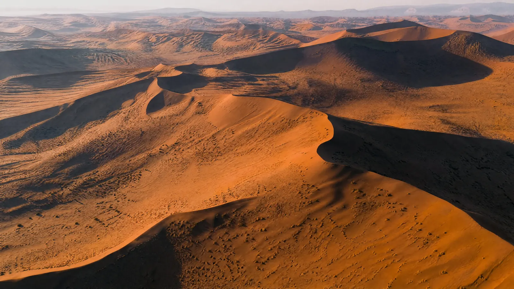
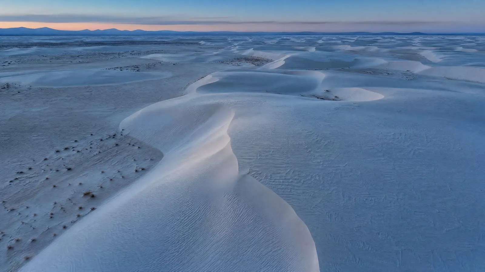
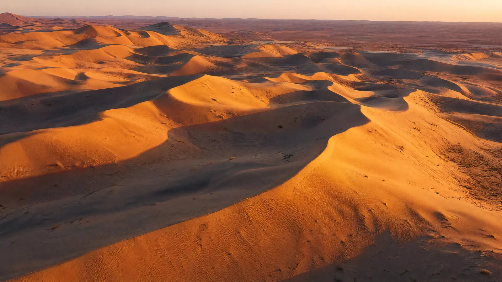
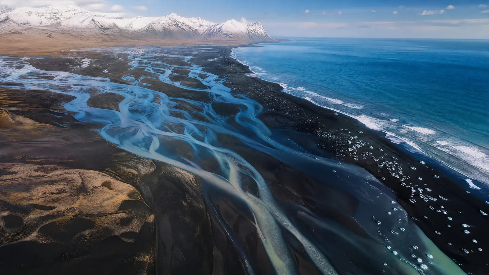
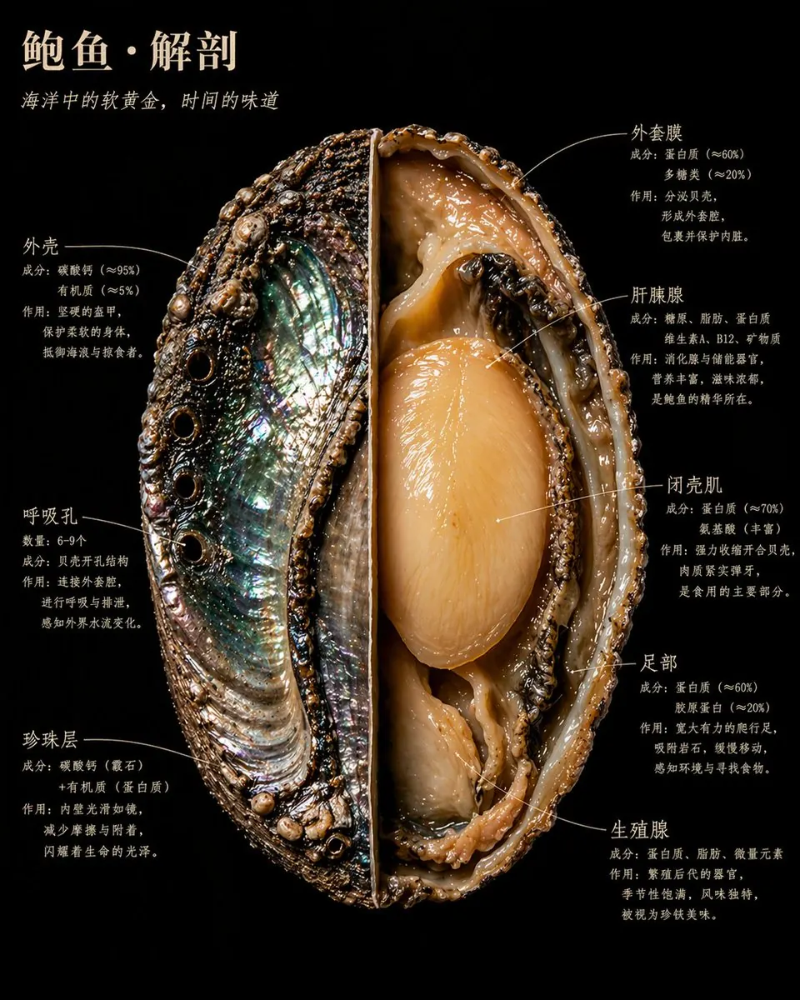

# 风景人文类

> 从《ChatGPT image2 提示词》导入并转换为适合 GitHub 浏览的版本。

原生4K风景

| 预览 | 预览 |
| --- | --- |
|  |  |

| 预览 | 预览 |
| --- | --- |
|  |  |

ChatGPT-Image2 4K图生成方法：

model: gpt-image-2

size: 3840x2160

quality: high

format: png

通过 GPT 图像 API 工作流生成。

示例命令：

## python image_gen.py generate \

## --model gpt-image-2 \

--prompt "Native 4K photorealistic aerial drone photo of red desert sand dunes at sunrise, high oblique view, wind-carved sand ripples, sharp realistic texture, no text, no watermark." \

--size 3840x2160 \

--quality high \

--output-format png \

--out output/imagegen/example.png

生成后可以在本地看到像素尺寸3840×2160的4K图。

ChatGPT-Image2 4K 图生成方法：

型号：GPT-IMAGE-2

尺寸：3840x2160

质量：高

格式：PNG

通过 GPT 图像 API 工作流生成。

示例命令：

## Python image_gen.py 生成 \

## --模型 GPT-image-2 \

——提示词“原生 4K 照片级真实空中无人机照片，红色沙漠沙丘日出时分，高斜视角，风雕刻的沙纹，清晰逼真纹理，无文字，无水印。”

——尺寸：3840x2160 \

——质量高 \

--输出格式 PNG \

--输出/图像生成/example.png

自然主义风格的食物标本横截面

一颗/一块/一枚【食物名称】,以博物学大师发现野外标本的方式解剖。

剖开、展开、固定--如同博物馆的珍贵藏品,

却以卡拉瓦乔为《国家地理》掌镜时的光线照亮。

每一个内部结构都以自身的材质真相发光。

截面锋利得近乎暴力。内部美丽得近乎神圣。

画面中呈现完整标本:

一半保持原状,展示【外表面描述:质感/颜色/纹理】;

另一半剖开至核心,【内部核心结构描述:最重要的1-2个内部视觉特征】清晰可见。

### 补充1-2句该食物最具视觉张力的横截面细节描述

背景:纯粹的黑丝绒。

【食物名称】悬浮其中,如同某件珍贵而危险的事物。

标注文字紧贴结构边缘,手写感衬线字体,绝不悬空飘浮。

画面包含以下标注,每处标注三行:第一行结构名称,第二行成分数据,第三行一句人话:

### 结构01名称

### 成分/数据说明

### 这个结构在做什么,为什么重要

### 结构02名称

### 成分/数据说明

### 这个结构在做什么,为什么重要

### 结构03名称

### 成分/数据说明

### 这个结构在做什么,为什么重要

### 结构04名称

### 成分/数据说明

### 这个结构在做什么,为什么重要

### 结构05名称

### 成分/数据说明

### 这个结构在做什么,为什么重要

### 结构06名称

### 成分/数据说明

### 这个结构在做什么,为什么重要

省略其他如果有继续保持这个格式

主标题,左上角,暖象牙白大写字体:

【食物名称】·解剖

斜体副标题紧随其下:

### 一句揭示这种食物本质的话,不超过15字

整体气质:奥杜邦博物插画×卡拉瓦乔光影×有史以来最美的科学摄影。

4K精度,标本照明,极致内部细节。

没有任何临床感,一切都鲜活。

写实风格,非示意图,非卡通,非简化图解。

每一种材质都有真实的物理质感:

粗糙的、光滑的、湿润的、干燥的、致密的、疏松的。
