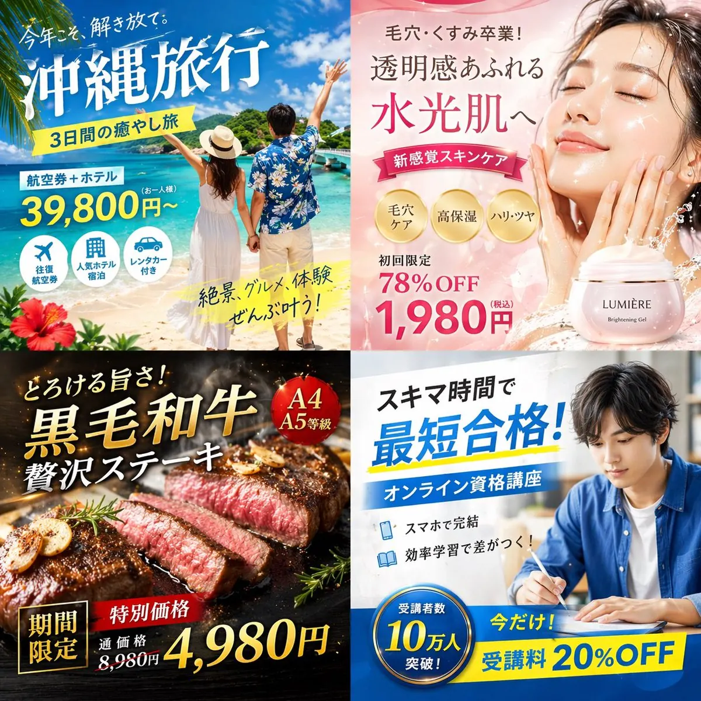
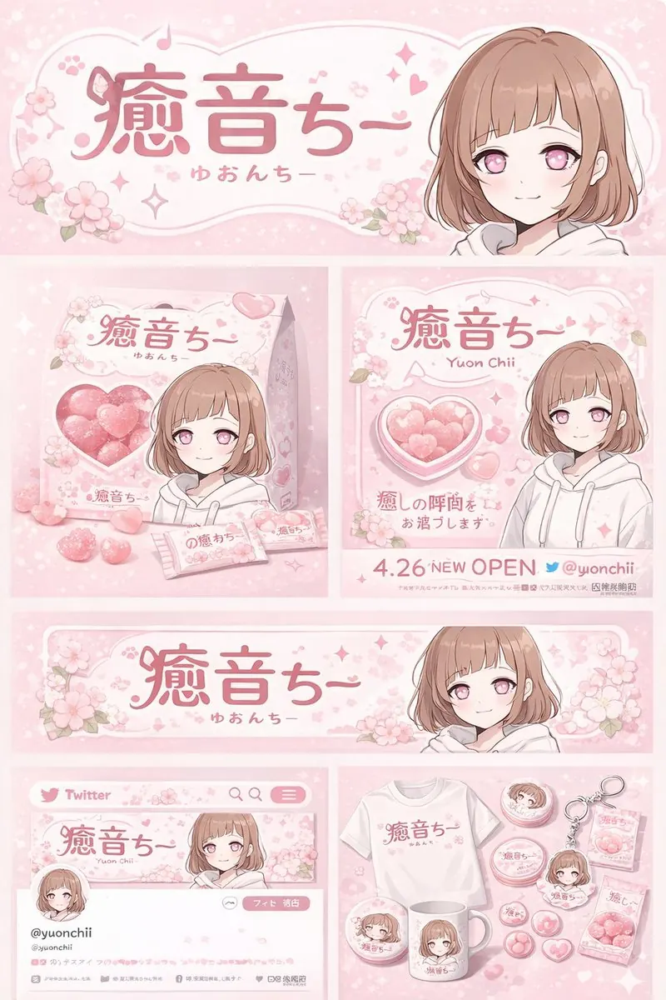
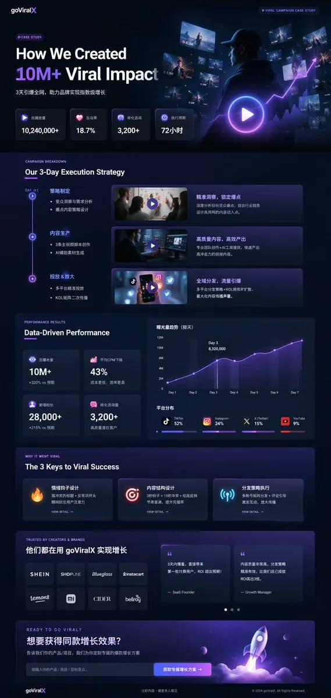
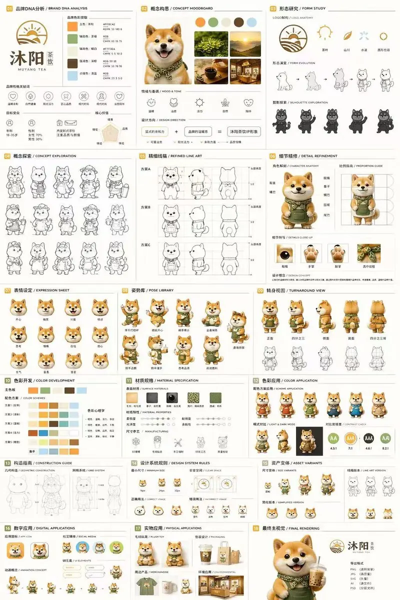

# 广告创意类

> 从《ChatGPT image2 提示词》导入并转换为适合 GitHub 浏览的版本。

## 四格日式数字广告横幅网格

Plain Text{  "type": "2x2 grid of Japanese digital advertisement banners",  "layout": {    "structure": "4 equal quadrants",    "quadrants": [      {        "position": "top-left",        "theme": "Travel",        "subject": "A couple holding hands on a white sand beach, looking out at turquoise ocean water under a bright blue sky.",        "elements": ["red hibiscus flower in bottom left corner"],        "text_labels": [          "今年こそ、解き放て。",          "{argument name=\"travel destination\" default=\"沖縄旅行\"}",          "3日間の癒やし旅",          "航空券+ホテル",          "39,800円〜",          "絶景、グルメ、体験 ぜんぶ叶う!"        ],        "icons": {          "count": 3,          "descriptions": ["airplane", "hotel building", "car"]        }      },      {        "position": "top-right",        "theme": "Skincare",        "subject": "Close-up portrait of a young woman with glowing, dewy skin, eyes closed, gently touching her cheeks.",        "elements": [          "soft pink gradient background",          "dynamic water splash effects",          "pink cosmetic jar labeled '{argument name=\"skincare product name\" default=\"LUMIÈRE\"} Brightening Gel'"        ],        "text_labels": [          "毛穴・くすみ卒業!",          "透明感あふれる",          "水光肌へ",          "新感覚スキンケア",          "初回限定 78%OFF",          "{argument name=\"discount price\" default=\"1,980円\"}"        ],        "badges": {          "count": 3,          "style": "gold circular",          "labels": ["毛穴ケア", "高保湿", "ハリ・ツヤ"]        }      },      {        "position": "bottom-left",        "theme": "Gourmet Food",        "subject": "Thick, sliced, medium-rare steak sizzling on a dark grill plate.",        "elements": [          "garlic chips",          "rosemary sprig",          "dark background with smoke and glowing embers"        ],        "text_labels": [          "とろける旨さ!",          "{argument name=\"food item\" default=\"黒毛和牛\"}",          "贅沢ステーキ",          "期間限定",          "特別価格",          "通常価格 8,980円",          "4,980円"        ],        "badges": {          "count": 1,          "style": "red circular",          "labels": ["A4 A5等級"]        }      },      {        "position": "bottom-right",        "theme": "Online Education",        "subject": "Young man in a blue shirt studying at a desk, writing in a notebook next to an open laptop.",        "elements": ["bright indoor lighting", "desk environment"],        "text_labels": [          "スキマ時間で",          "{argument name=\"education goal\" default=\"最短合格!\"}",          "オンライン資格講座",          "スマホで完結",          "効率学習で差がつく!",          "今だけ! 受講料 20%OFF"        ],        "badges": {          "count": 1,          "style": "blue circular",          "labels": ["受講者数 10万人 突破!"]        },        "icons": {          "count": 2,          "descriptions": ["smartphone", "open book"]        }      }    ]  }}

## 动漫角色品牌形象及周边产品设计板

Plain Text{  "type": "brand identity and merchandise design board",  "theme": {    "color_palette": "{argument name=\"theme color\" default=\"pastel pink\"} and white",    "motif": "{argument name=\"motif\" default=\"cherry blossoms\"} and pink hearts"  },  "character": {    "description": "anime girl with short brown bob hair, pink eyes, wearing a white hoodie, gentle smile"  },  "branding": {    "main_logo": "{argument name=\"character name\" default=\"癒音ちー\"}",    "sub_logo": "{argument name=\"character subtext\" default=\"ゆおんちー\"}"  },  "layout": {    "sections": [      {        "type": "header banner",        "position": "top",        "elements": ["large main logo", "sub logo", "cherry blossom graphics", "character portrait on the right"]      },      {        "type": "product packaging",        "position": "middle left",        "elements": ["1 square box with heart-shaped transparent window showing pink heart candies", "character illustration on box", "2 individual candy wrappers", "5 scattered heart candies"]      },      {        "type": "promotional poster",        "position": "middle right",        "elements": ["character portrait", "heart-shaped candy bowl", "main logo", "text '4.26 NEW OPEN'", "text '{argument name=\"social handle\" default=\"@yuonchii\"}'"]      },      {        "type": "horizontal web banner",        "position": "lower middle",        "elements": ["main logo", "cherry blossoms", "character portrait on the right"]      },      {        "type": "social media profile mockup",        "position": "bottom left",        "elements": ["header image with logo", "1 circular profile picture", "handle '{argument name=\"social handle\" default=\"@yuonchii\"}'", "1 follow button", "mock bio text"]      },      {        "type": "merchandise collection",        "position": "bottom right",        "count": 9,        "items": ["1 white t-shirt with logo", "1 white mug with character", "4 round pin badges", "1 acrylic keychain", "2 candy packets"]      }    ]  }}

## 深色模式营销案例研究 UI

Plain Text{  "type": "UI/UX landing page mockup",  "theme": "dark mode, sleek modern aesthetic, glassmorphism, {argument name=\"primary accent color\" default=\"neon purple and blue\"} glowing accents",  "header": {    "logo": "{argument name=\"brand name\" default=\"goViralX\"}",    "top_right_tag": "VIRAL CAMPAIGN CASE STUDY"  },  "layout": {    "sections": [      {        "name": "Hero",        "headline": "{argument name=\"hero headline\" default=\"How We Created 10M+ Viral Impact\"}",        "subheadline": "3天引爆全网, 助力品牌实现指数级增长",        "stats_row": {          "count": 4,          "labels": ["总播放量", "互动率", "转化咨询", "执行周期"],          "values": ["{argument name=\"main statistic\" default=\"10,240,000+\"}", "18.7%", "3,200+", "72小时"]        },        "visual": "cinematic shot of a person in a hoodie looking at glowing digital screens and graphs, large play button overlay"      },      {        "name": "Strategy",        "title": "Our 3-Day Execution Strategy",        "layout_type": "vertical timeline",        "steps_count": 3,        "elements_per_step": ["timeline node", "title", "bullet points", "video thumbnail with play button", "description box"]      },      {        "name": "Performance",        "title": "Data-Driven Performance",        "left_column": {          "stat_cards_count": 4,          "values": ["10M+", "43%", "28,000+", "3,200+"]        },        "right_column": {          "charts_count": 2,          "chart_1": "line graph showing 7-day growth peaking at Day 3",          "chart_2": "horizontal segmented bar chart showing platform distribution (TikTok 52%, Instagram 24%, X 15%, YouTube 9%)"        }      },      {        "name": "Keys to Success",        "title": "The 3 Keys to Viral Success",        "cards_count": 3,        "card_elements": ["glowing icon (fire, target, antenna)", "title", "description", "VIEW DETAIL link"]      },      {        "name": "Social Proof",        "title": "TRUSTED BY CREATORS & BRANDS",        "left_column": {          "logos_count": 8,          "grid": "2x4",          "brands": ["SHEIN", "SHOPLINE", "Blueglass", "instacart", "lemon8", "mi", "CIDER", "bellroy"]        },        "right_column": {          "testimonial_cards_count": 2,          "elements": ["quote", "author title (SaaS Founder, Growth Manager)"]        }      },      {        "name": "Call to Action",        "title": "READY TO GO VIRAL?",        "interactive_elements": ["text input field", "glowing button with text '{argument name=\"call to action text\" default=\"获取专属增长方案 ->\"}'"],        "visual": "3D render of a rocket ship taking off with purple and blue flames"      }    ]  }}

## 18 幅吉祥物品牌识别文档

Plain Text{  "type": "18-panel brand identity and character design document",  "brand": {    "name": "{argument name=\"brand name\" default=\"沐阳 MUYANG TEA\"}",    "industry": "{argument name=\"industry\" default=\"tea shop\"}",    "colors": ["{argument name=\"primary color\" default=\"yellow\"}", "{argument name=\"secondary color\" default=\"green\"}", "white", "brown", "dark green"]  },  "subject": "{argument name=\"character description\" default=\"3D rendered cute Shiba Inu mascot wearing a green apron\"}",  "layout": {    "grid": "3 columns by 6 rows",    "sections": [      {        "title": "01 品牌DNA分析 / BRAND DNA ANALYSIS",        "elements": ["logo", "5 color swatches", "6 icons", "target audience charts"]      },      {        "title": "02 概念构思 / CONCEPT MOODBOARD",        "elements": ["5 photo references", "4 mood icons", "design equation"]      },      {        "title": "03 形态研究 / FORM STUDY",        "elements": ["4 logo anatomy icons", "4 evolution steps", "4 silhouettes"]      },      {        "title": "04 概念探索 / CONCEPT EXPLORATION",        "elements": ["12 line-art character sketches"]      },      {        "title": "05 精细线稿 / REFINED LINE ART",        "elements": ["3 rows of front and side line art with proportion guides"]      },      {        "title": "06 细节精修 / DETAIL REFINEMENT",        "elements": ["2 full-body renders with labels", "4 circular close-ups"]      },      {        "title": "07 表情设定 / EXPRESSION SHEET",        "elements": ["11 3D rendered head expressions"]      },      {        "title": "08 姿势库 / POSE LIBRARY",        "elements": ["9 full-body 3D rendered poses"]      },      {        "title": "09 转身视图 / TURNAROUND VIEW",        "elements": ["5 full-body 3D renders", "5 matching line-art views"]      },      {        "title": "10 色彩开发 / COLOR DEVELOPMENT",        "elements": ["5 rows of 5-color palettes", "color psychology text"]      },      {        "title": "11 材质规格 / MATERIAL SPECIFICATION",        "elements": ["5 texture swatches", "property sliders", "4 manufacturing icons"]      },      {        "title": "12 色彩应用 / COLOR APPLICATION",        "elements": ["4 color variant renders", "2 light/dark renders", "4 contrast rating circles"]      },      {        "title": "13 构造指南 / CONSTRUCTION GUIDE",        "elements": ["2 line-art diagrams for geometry and grid"]      },      {        "title": "14 设计系统规则 / DESIGN SYSTEM RULES",        "elements": ["minimum size icons", "clear space diagram", "4 usage examples"]      },      {        "title": "15 资产变体 / ASSET VARIANTS",        "elements": ["3 size variants", "3 line-art variants", "3 simplified flat heads"]      },      {        "title": "16 数字应用 / DIGITAL APPLICATIONS",        "elements": ["1 app icon", "2 social avatars", "UI elements", "3-step animation cycle"]      },      {        "title": "17 实物应用 / PHYSICAL APPLICATIONS",        "elements": ["plush toy mockup", "packaging mockup", "merchandise mockup", "storefront mockup"]      },      {        "title": "18 最终主视觉 / FINAL RENDERING",        "elements": ["large high-res 3D render of mascot holding tea", "logo", "file format list"]      }    ]  }}
