# 知识信息类

> 从《ChatGPT image2 提示词》导入并转换为适合 GitHub 浏览的版本。

## 中国风x知识图鉴

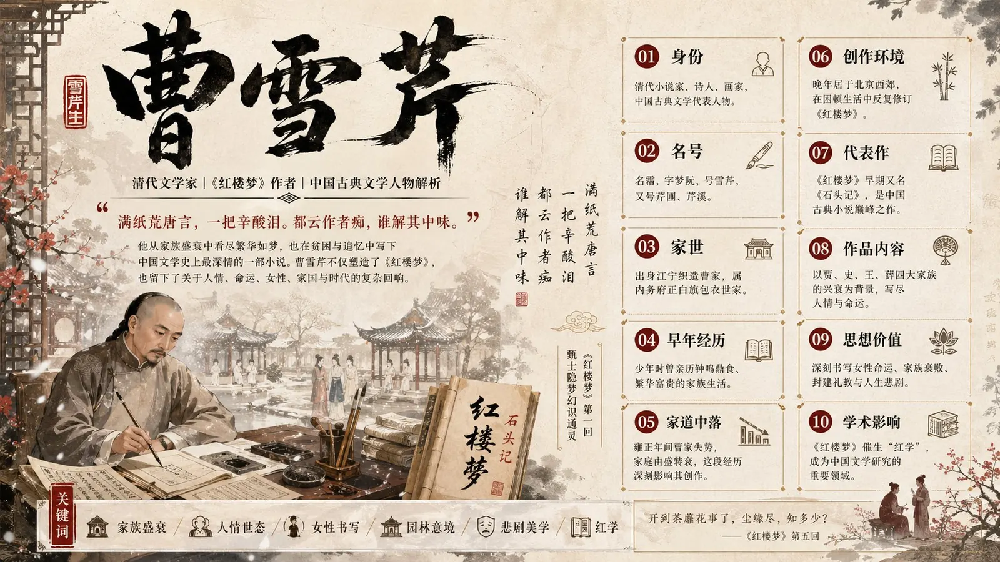

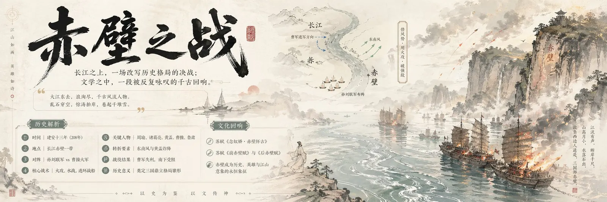

Plain Text生成一张具有诗意且视觉层次丰富的诗歌解析海报，风格与结构应根据用户提供的诗句、名词或地点进行定制，确保营造浓厚的文学氛围与艺术感。**核心要求**：1. **海报标题**：海报顶部应使用优雅且富有气势的手写大字，字形与整体风格相协调，展示用户提供的诗句或主题。字体设计应具有视觉冲击力，突出文字的情感和主题。2. **文字排版**：标题下方安排小字或小图形，展现与诗句相关的解析、背景介绍或象征性解释。排版要具备设计感，确保文字、图形的层次与节奏，增强视觉冲击力。3. **知识点**：根据用户提供的主题，整合5到10个相关知识点，并将其展示在海报中。这些知识点可通过文字、图标或图形形式呈现，内容可以涉及历史背景、文化内涵、诗歌分析等。4. **画面风格**：海报的风格需与输入的诗歌或主题相契合。色调、光影及图像风格要与诗歌的情感和意境一致。可能涉及自然景象、人物描绘、情感表达等元素，确保风格现代且富有文化深度。5. **视觉效果**：整体画面设计要具有强烈的视觉吸引力。背景、形状、插图等元素应分层次设计，避免画面过于拥挤或杂乱，使观众能够沉浸在诗意的视觉体验中。**用户输入变量**：- 主题：［填写诗句 / 诗题 / 诗人 / 名词 / 地点 / 意象］- 补充要求：［可选，说明希望突出的方向，例如“偏苍凉”“偏送别”“偏豪迈”“偏空灵”“偏知识性”“偏历史感”］- 知识点数量：［填写5至10个，不填写则智能生成］- 是否需要原诗全文：［是 / 否］- 是否需要作者与朝代信息：［是 / 否］- 语言风格：［简洁凝练 / 文学感强 / 学术感强 / 通俗易懂］- 海报比例：［竖版 9:16 / 横版 4:3 / 方版 1:1］

蜡笔风教案提示词

| 预览 | 预览 | 预览 | 预览 |
| --- | --- | --- | --- |
| 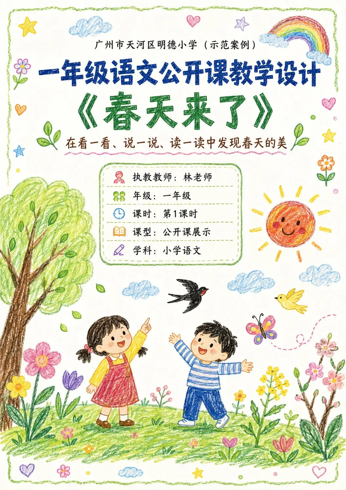 | 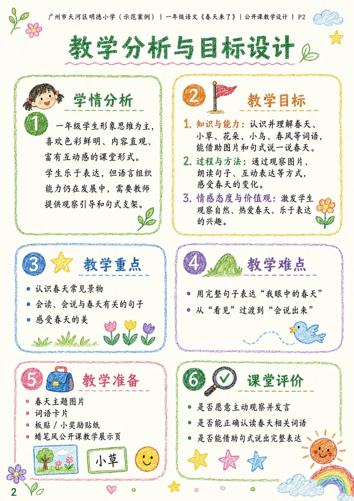 | 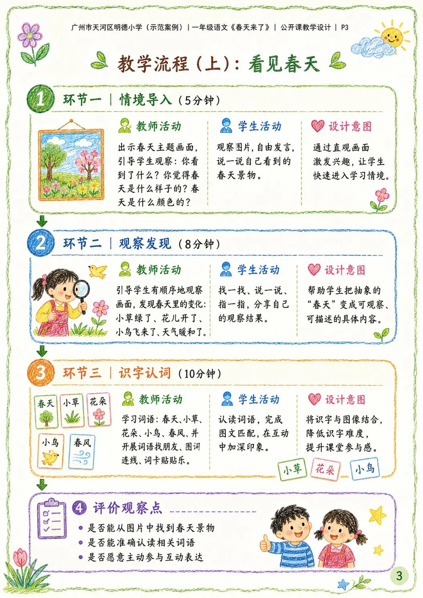 | 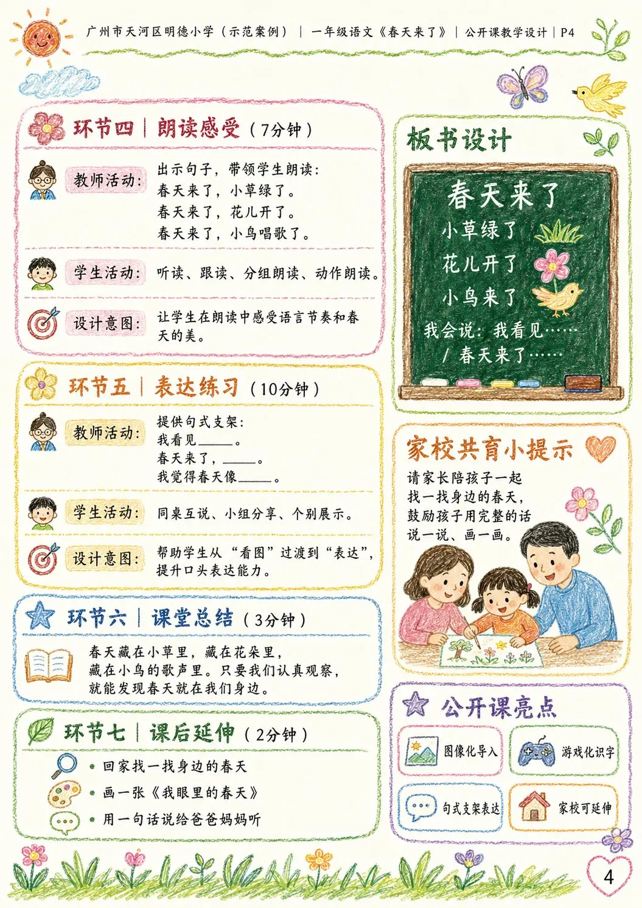 |

请根据用户提供的教案主题、教学信息与页面内容，生成一组「公开课蜡笔风可视化教案」图片。

### 任务目标

生成一组彼此风格统一、适合公开课展示的教案页面图片。

每张图片独立输出，不要拼成一张长图。

整体用于：小学低年级语文公开课展示、家长观摩、家委观摩、校长/教导主任查看，也适合作为可打印的展示型教案页面。

### 适用场景

小学低年级（优先一年级、二年级）

公开课 / 示范课 / 教学展示

学科优先：小学语文（也可扩展到数学、英语等）

风格不是幼稚涂鸦，也不是死板公文，而是“儿童蜡笔视觉 + 清晰教学逻辑 + 公开课展示感”

━━━━━━━━━━━━━━━━━━

一、输入方式（支持两种模式）

━━━━━━━━━━━━━━━━━━

### 模式A：用户手动填写内容

如果用户直接提供了学校、课题、教师、教学目标、教学流程等内容，请严格按照用户提供的内容进行编排。

### 模式B：用户上传原有教案 / 文档 / 文字内容

如果用户上传了原有教案内容，或贴出了完整教案文本，请先理解并提炼内容，再自动整理为适合多页展示的版本。

要求：

保留原教案核心教学逻辑

压缩冗长文字，提升可视化与展示感

优先提炼出：课题、目标、学情、重点难点、流程、板书、课后延伸、家校共育提示

不要机械照搬原文，要转化为适合展示页的编排语言

━━━━━━━━━━━━━━━━━━

二、输出数量规则（重要）

━━━━━━━━━━━━━━━━━━

### 默认输出数量

默认生成 4 张图片。

### 可自定义数量

如果用户明确指定生成数量，则按用户指定的数量执行。

例如：

1 张：做成单页浓缩版展示

2 张：封面 + 核心内容

3 张：封面 + 分析页 + 流程页

4 张：封面 + 分析页 + 流程上 + 流程下（推荐默认）

5 张及以上：在保持统一风格的前提下，进一步拆分为更细致的内容页

### 自动分配原则

如果用户指定的张数与内容量不完全匹配，请自动合理拆分内容，要求：

内容分配均衡

不要前面太空、后面太挤

每张图都应有清晰主题

封面页优先保留

张数较少时，适当合并内容

张数较多时，适当细分教学流程、板书设计、家校共育、亮点页等模块

━━━━━━━━━━━━━━━━━━

三、固定视觉规则

━━━━━━━━━━━━━━━━━━

### 画面比例

竖版，接近 A4 纸张比例。

建议比例：1000:1414 或相近比例。

### 整体风格

10岁左右儿童蜡笔手绘风 / 彩色蜡笔风 / 儿童手绘公开课教案风。

要求：

白色或暖白纸张背景

明显蜡笔笔触、儿童手绘质感

线条自然、略带稚拙感，但整体整洁清楚

色彩明亮温暖，以红、黄、蓝、绿、粉、橙等柔和蜡笔色为主

整体像“认真又有童趣的小学公开课展示页”

不能太花，也不能太简陋

要有可读性、展示感、层次感

不要做成幼儿园海报，也不要做成普通 Word 截图

### 版式要求

每页都要有清晰标题

封面页可以使用大标题

内页不要重复使用过大的封面式标题

内页顶部只保留小页眉或本页标题，不要过度占用正文空间

正文内容区域应尽量充足，突出信息量与教学逻辑

模块划分明确

信息层级清楚

文字可读性强

留白适中

装饰元素服务于内容，不可喧宾夺主

适合打印和展示

### 装饰元素

可适量使用儿童蜡笔风装饰元素：

小花、云朵、太阳、彩虹、星星、叶子、小鸟、蝴蝶、草地、爱心

可加入与课程主题相关的小插图

装饰应适量，分布自然，不要堆满整页

### 字体表现

中文标题可做成蜡笔手写感、儿童笔触感

正文要清楚易读

不要使用太花哨、太难识别的字形

不要大面积密密麻麻长段文字

━━━━━━━━━━━━━━━━━━

四、页面结构建议（默认 4P，可按数量调整）

━━━━━━━━━━━━━━━━━━

### 默认 4 张时，建议结构

P1 封面页

P2 教学分析与目标设计

P3 教学流程（上）

P4 教学流程（下）+ 板书设计 + 延伸

### 如果用户自定义数量，请按以下逻辑调整

1张时：

做成浓缩版总览页

包括：封面信息 + 教学目标 + 核心流程 + 亮点摘要

2张时：

第1张：封面 + 教学目标 / 学情 / 重难点

第2张：教学流程 + 板书设计 + 延伸

3张时：

第1张：封面

第2张：教学分析与目标设计

第3张：教学流程 + 总结延伸

4张时（默认推荐）：

第1张：封面页

第2张：教学分析与目标设计

第3张：教学流程（上）

第4张：教学流程（下）+ 板书设计 + 家校共育 + 公开课亮点

5张及以上时：

可进一步拆分为：

封面页

教学分析页

教学目标 / 重难点页

教学流程（上）

教学流程（下）

板书设计页

家校共育页

公开课亮点 / 总结页

━━━━━━━━━━━━━━━━━━

五、各类页面的内容要求

━━━━━━━━━━━━━━━━━━

### 封面页

内容包括：

学校名称（可写“XX市XX区XX小学（示范案例）”）

课程类型（如：一年级语文公开课教学设计）

课题名称（如：《春天来了》）

副标题 / 教学导语（1句）

执教教师

年级

课时

课型

学科

视觉要求：

封面视觉最完整、最抓人

可加入与课题主题相关的儿童蜡笔场景图

画面温暖、有童趣、有春天气息（或与课题匹配）

既像教案封面，也像公开课展示页

### 教学分析类页面

可包括：

学情分析

教学目标

教学重点

教学难点

教学准备

课堂评价

视觉要求：

每个模块可用独立圆角框 / 手绘边框承载

每个模块配简单小图标

逻辑清楚、适合展示

不要太拥挤

### 教学流程类页面

可包括：

环节名称

时间

教师活动

学生活动

设计意图

评价观察点（可选）

视觉要求：

可用竖向流程式 / 分段卡片式 / 时间轴式编排

每个环节有独立模块

可加相关小插图辅助理解

页面清楚、有节奏感

### 总结 / 延伸类页面

可包括：

课堂总结

课后延伸

板书设计

家校共育小提示

公开课亮点

视觉要求：

可分主次布局

板书设计可单独做右侧模块

家校共育与亮点可作为辅助展示模块

页面信息完整，但保持清爽

━━━━━━━━━━━━━━━━━━

六、内容编排原则

━━━━━━━━━━━━━━━━━━

如果用户给出的内容较长，请压缩为适合展示页阅读的表达

保留教师专业性，但不要太行政化、太公文化

语言要适合小学低年级公开课场景

要让老师、家长、校长都能看懂并感受到设计感

既要有儿童亲和力，也要有专业可信度

不是纯插画海报，而是“可视化教案 / 教学设计页”

每页信息要丰富但不杂乱

各页风格必须统一，像同一套系列作品

如果页数变多或变少，要自动重新平衡内容，不要机械套用 4 页模板

━━━━━━━━━━━━━━━━━━

七、如果用户没有提供完整内容，可按以下信息模板补齐

━━━━━━━━━━━━━━━━━━

请根据以下字段生成：

生成数量（可不填，默认4）：

学校名称：

年级：

学科：

课题名称：

执教教师：

课时：

课型：

副标题 / 教学导语：

教学目标：

学情分析：

教学重点：

教学难点：

教学准备：

教学流程：

板书设计：

课堂总结：

课后延伸：

家校共育提示：

公开课亮点：

如果用户没有填写完整，请根据课题自动合理补全，但要保持真实、自然、符合小学低年级公开课逻辑。

━━━━━━━━━━━━━━━━━━

八、生成要求总结

━━━━━━━━━━━━━━━━━━

请最终输出：

若用户未指定数量，则默认输出 4 张独立的竖版 A4 蜡笔风公开课教案图片

若用户指定数量，则按指定数量输出

风格统一

内容真实

排版清晰

适合公开课展示

适合家长、家委、校长、教导主任观看

不要过度装饰

不要太简陋

不要做成普通文档截图

要有“儿童蜡笔风 + 专业教学设计感”的平衡感

## 剖面科普图解绘本

| 预览 | 预览 | 预览 | 预览 |
| --- | --- | --- | --- |
| 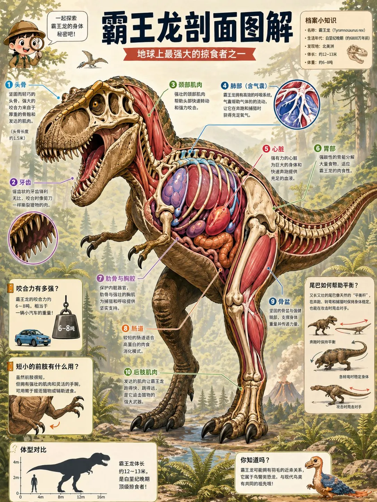 | 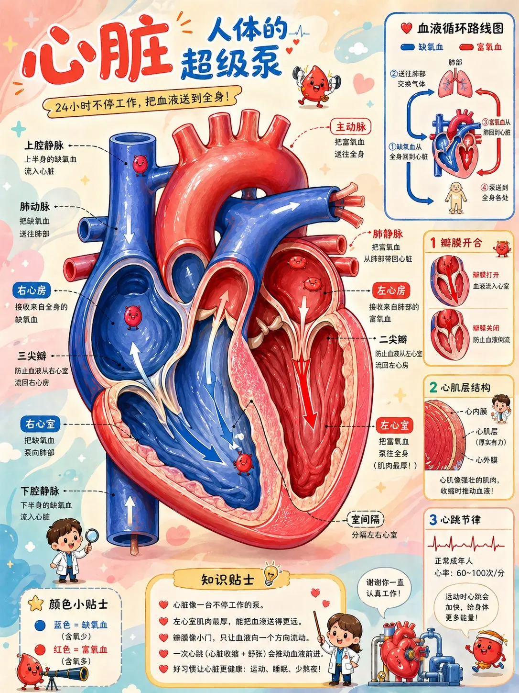 | 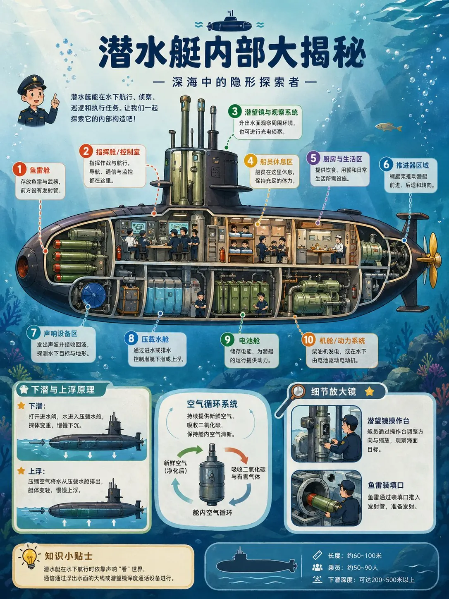 | 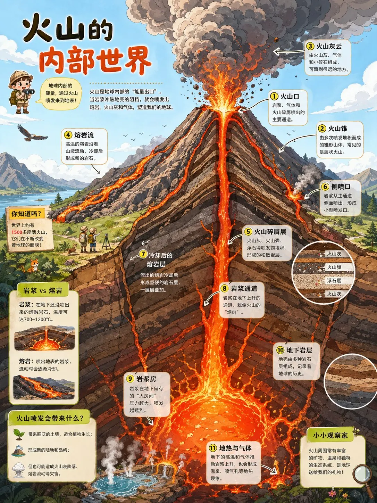 |

| 预览 | 预览 | 预览 | 预览 |
| --- | --- | --- | --- |
| 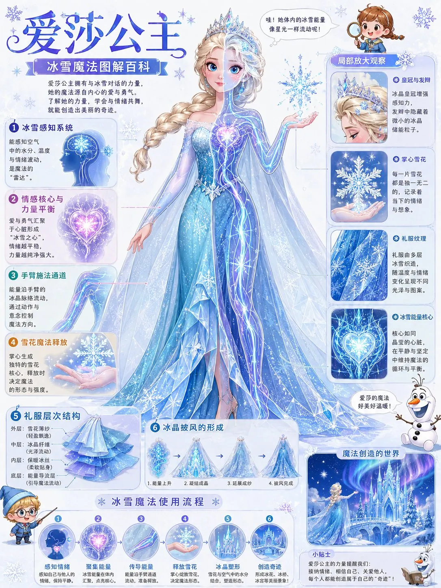 | 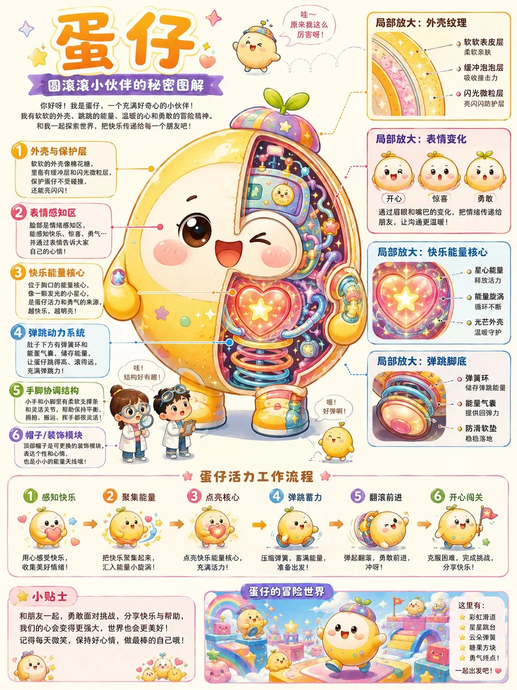 | 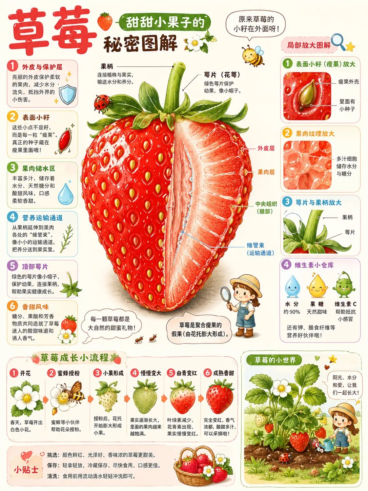 | 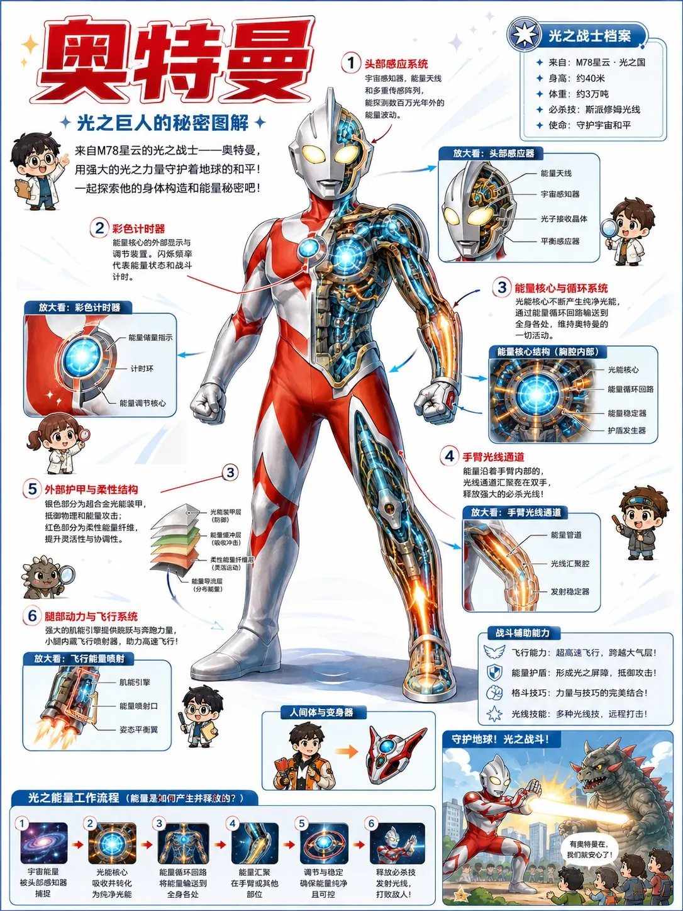 |

《剖面科普图解绘本》提示词：请根据【主题】创作一张高完成度、适合系列化发布的「剖面科普图解绘本 / Cutaway Educational Picture Book」风格插画。这不是普通插画，也不是单纯的写实结构图，而是一张结合“剖面展示 + 内部结构说明 + 功能分区图解 + 绘本质感 + 信息标注系统”的知识型视觉图。画面应让观者能够同时看见对象的外部形态、内部结构、层级关系、功能逻辑与关键知识点，既有图解说明感，又有生动有趣的绘本阅读体验。【输入主题】主题：【在这里填写主题，例如心脏 / 向日葵 / 巨龙 / 图书馆 / 火山 / 鲸鱼 / 城堡 / 潜水艇 / 魔法树】【自动理解规则】请不要机械照搬单一套路，而是根据【主题】自动判断最适合的图像表达方式，并完成以下自动补全：1. 自动判断主题更接近哪一类对象，例如人体、动物、植物、建筑空间、机械设备、交通工具、自然地理、幻想设定或其他类型。2. 自动判断最适合展示的内容重点，例如内部结构、功能分区、运作原理、生长过程、生态关系、层级系统、空间组织或能量流动。3. 自动判断最适合的受众理解层级，整体偏向“儿童可读 + 大众科普可看懂”的表达方式。4. 如果主题较宽泛，请自动聚焦最具代表性的核心对象或最适合剖面展示的典型形态。5. 如果主题本身不适合严格“解剖式剖面”，也可以采用“局部切开 / 半透明展示 / 分层展开 / 截面说明 / 内部空间揭示”等方式来表达。【画幅与构图】画幅比例固定为：3:4 竖版。整体构图应参考高质量剖面科普绘本或图解型插画的版式习惯，适合做成一张完整的竖版知识插画，适配小红书等内容平台的展示比例。画面主体应集中在画面中央，并充分利用竖版空间，让主体在纵向上形成更强的视觉聚焦。通过纵向延展、上下分层、主剖面居中、说明信息围绕主体分布的方式，让外部轮廓与内部结构同时清晰呈现。整体构图要清晰、饱满、平衡，主体明确，信息分区自然，视觉阅读路径顺畅，适合竖屏观看。【画面内容要求】整张图应尽量具备以下特征：1. 主题对象一眼可识别，外部轮廓清楚。2. 内部结构、内部空间或分层关系清晰可读，具有层级感和分区感。3. 重点区域应有明确功能含义或知识解释价值。4. 可加入适量的小人物、小动物、小角色或微型互动场景，增强趣味性与阅读感。5. 可加入箭头、编号、中文小标题、说明框、局部放大框、知识贴士等信息图解元素。6. 信息量丰富，但不能杂乱，要让观者第一眼被吸引，第二眼能看懂结构，第三眼还能继续发现细节。7. 要根据竖版版式优化信息布局，避免横向过度拉长导致主体松散。【视觉风格】整体采用高完成度的儿童科普绘本风格，兼具知识性、亲和力与可读性。风格应具有以下特点：- 清晰自然的手绘线条- 略带绘本感的轮廓与造型- 明亮、温和、干净的配色- 结构清楚但不过度工程化- 细节丰富但不堆砌- 画面有探索感、阅读感、观察乐趣- 风格介于“儿童绘本插画”和“图解说明图”之间- 保持绘本风格，但整体视觉要更干净、更现代、更清爽【材质与质感要求】保留绘本插画气质，但不要加入明显纸张材质效果。不要出现以下视觉特征：- 纸张纹理- 纸质压痕- 印刷噪点- 复古做旧肌理- 中间书页折痕- 翻页中缝- 纸面颗粒感过重- 泛黄纸感或旧书质感整体画面应更像“现代儿童科普绘本插画成稿”或“数字绘制的高质量绘本图解页”，而不是扫描出来的纸质书页。【版式与文字】整张图要有较强的“绘本页面 + 图解信息板”气质。文字标注不需要过多，但应自然、简洁、清楚，使用中文短标签或简短说明词组即可。标注系统应服务于理解，不要堆满整页，也不要抢掉主体视觉。文字与图形说明元素要和插画自然融合，形成统一的知识图解版式。【色彩建议】请根据主题自动匹配合适的主色调与辅助色，但整体保持以下倾向：- 明亮、柔和、易读- 主题突出，背景干净- 层次清晰，不脏不灰- 适合儿童认知和大众科普阅读- 可适度加入少量点缀色增强活力【禁止倾向】不要做成：- 纯医学教科书式写实图谱- 冰冷工业蓝图- 低幼幼儿简笔画- 普通海报插画而没有内部结构- 只有装饰感、缺少解释性的画面- 杂乱无章的信息堆砌- 赛博朋克式重光污染画面- 带有明显纸质扫描感、书页折痕或印刷肌理的旧书风效果【最终目标】让整张图看起来像一本高质量现代科普绘本中的精彩竖版图解页，又像一张值得反复观察的剖面知识插画。它既有知识性，也有美感；既有结构说明感，也有趣味阅读感；既适合儿童看，也能让成年人觉得高级、清晰、好看。整体画面应适合小红书竖版展示，视觉集中、信息清晰、风格统一、具有系列感。

## 导览式科普绘本

| 预览 | 预览 | 预览 | 预览 |
| --- | --- | --- | --- |
| 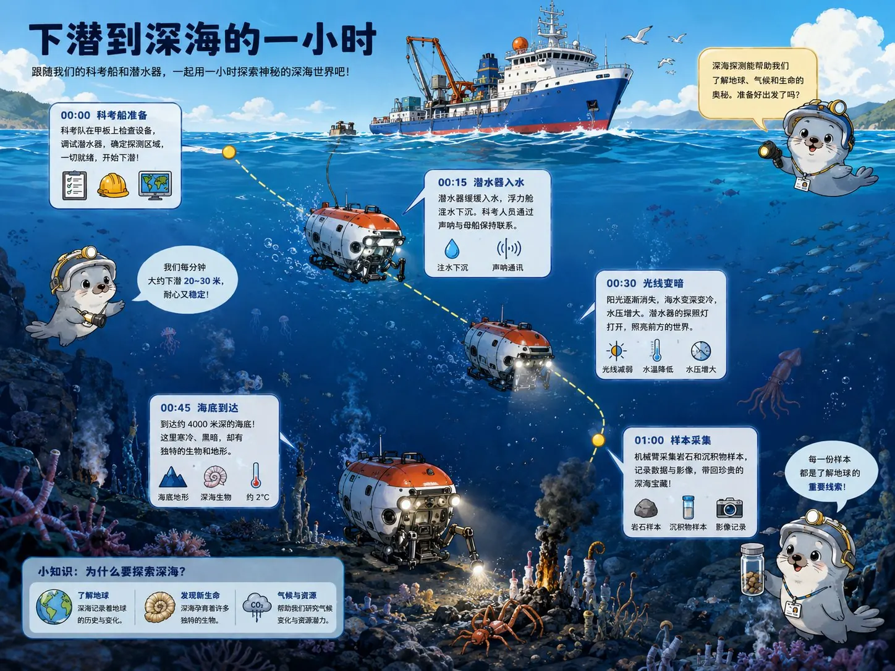 | 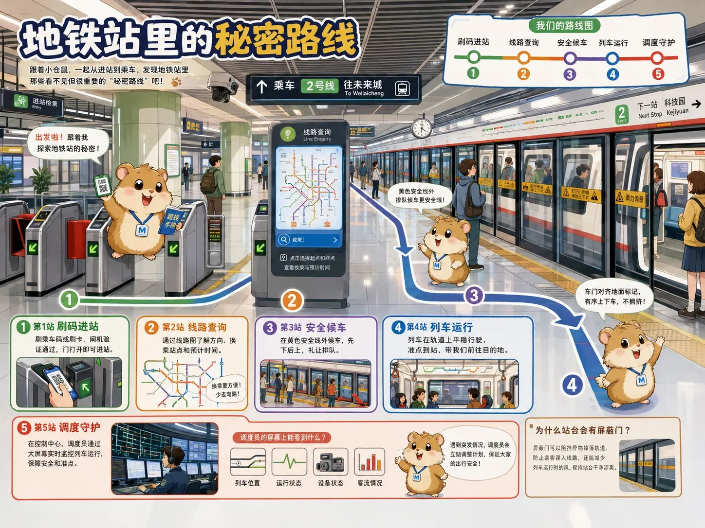 |  | 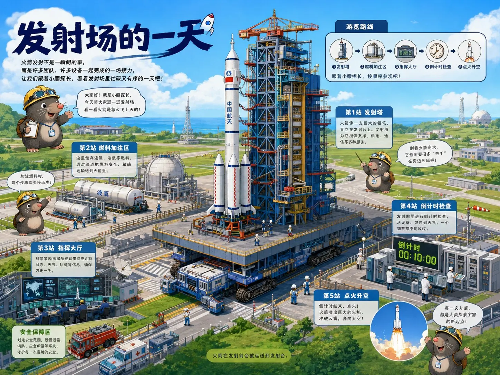 |

《导览式科普绘本》提示词：

请根据【主题】创作一张高完成度的「导览式科普绘本」风格插画。

这是一张结合“大型场景主视觉 + 导览路线 + 可爱导览 IP + 知识站点 + 儿童科普绘本质感”的场景导览式科普图解页。画面需要让观者像被带着参观一个复杂系统一样，边看边理解主题背后的运行逻辑、空间结构、流程关系和关键知识点。

### 基础设定

主题：【填写主题，例如发射场的一天 / 一个集装箱的旅行 / 地铁站里的秘密路线 / 下潜到深海的一小时 / 机场如何运转 / 医院急诊系统 / 智慧农场 / 消防站出警流程】

画幅比例：【4:3 横版】

主色调：【根据主题自动匹配，整体保持明亮、清爽、儿童友好】

风格方向：【现代儿童科普绘本 / 场景导览式图解 / 高完成度数字插画】

### 核心表达

请围绕【主题】设计一个完整的大型场景或复杂系统。画面中必须有一个明确的主视觉场景，例如大型设施、交通系统、科技装备、自然探索场景、城市公共系统或生产流程。主体要足够清晰、有规模感、有细节，能够成为第一眼的视觉中心。

画面不是单纯展示这个场景，而是要通过“导览路线”的方式组织信息。请设计一条清晰的参观路线、流程路线、时间线或空间动线，让读者可以沿着路线一步步理解这个系统是如何运行的。

### 导览 IP 设计

请为本图设计一个原创、可爱、亲和的导览小 IP。导览 IP 可以是小动物、小朋友、拟人化工具或其他适合主题的原创形象，但必须具有独立原创性，不要照搬任何参考图中的角色、动物形象、服装、配色或搭档关系。

导览 IP 的作用是：

开场介绍主题

指向关键知识点

引导读者顺着路线阅读

增加儿童绘本的陪伴感和趣味性

导览 IP 可以在画面中出现 2–3 次，但不要过度抢主视觉。角色应圆润、可爱、有表情、有动作，适合儿童科普绘本。

### 信息结构

画面中请设置 3–6 个“知识站点”，每个站点用简短中文标签和短说明表达。站点命名可以采用：

第1站｜xxx

第2站｜xxx

重点观察｜xxx

小知识｜xxx

为什么｜xxx

如何工作｜xxx

每个知识点都要围绕主题的核心运行逻辑展开，不要写空泛说明。文字要短、清楚、自然，避免长段落，适合儿童阅读。

### 画面模块

整张图建议包含以下模块：

顶部主标题区：清楚写出主题名称

开场导览区：导览 IP 引出主题

大型主场景区：展示主题系统的完整场景

导览路线区：用箭头、虚线、路径、时间节点或流程线串联知识点

知识站点区：用小信息框、导览牌、局部标注展示关键知识

小百科 / 小贴士区：补充一个有趣知识

收尾区：让导览 IP 做简短总结或引导

### 构图要求

画面采用 4:3 横版构图，整体像一本高质量儿童科普绘本的跨页，也像一张儿童科技馆导览图。画面需要有清晰的视觉重心：大型主场景占据主要空间，导览路线贯穿画面，知识模块自然分布在周围。信息丰富但不能杂乱，阅读路径要顺畅。

### 视觉风格

整体采用现代儿童科普绘本风格：

明亮、清爽、干净的色彩

清晰自然的手绘线条

高完成度数字插画质感

细节丰富但有秩序

可爱但不低幼

有科普图解感

有导览地图感

场景真实可信，但表达方式亲和

### 文字与标注

文字以中文为主，使用短标题、短标签、简短说明。不要生成大段复杂文字。信息框应像儿童科普书中的导览牌、知识卡片或小贴士。文字要尽量清晰、简洁、可读。

### 最终目标

让整张图像一页高质量的儿童科普绘本：孩子第一眼被可爱角色和大场景吸引，第二眼能顺着路线读懂系统如何运行，第三眼还能继续发现细节和知识点。画面要具有系列化潜力，方便后续替换不同主题继续创作同类型图片。

## 知识图鉴

| 预览 | 预览 |
| --- | --- |
| 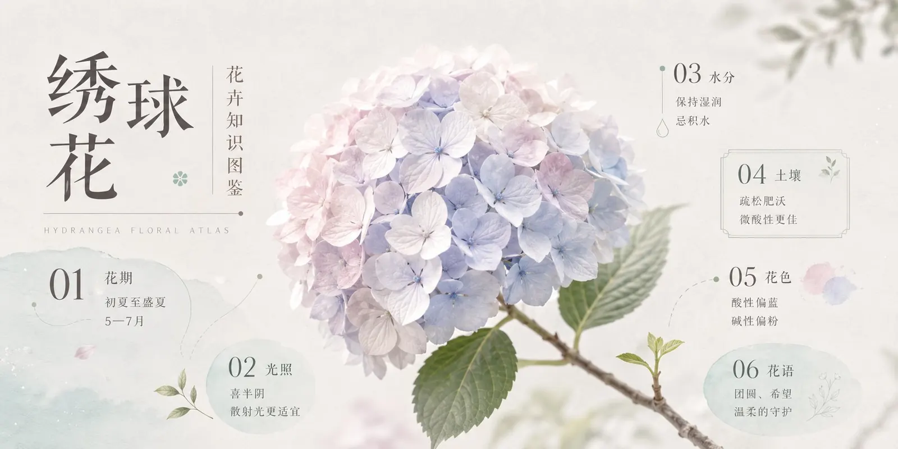 | 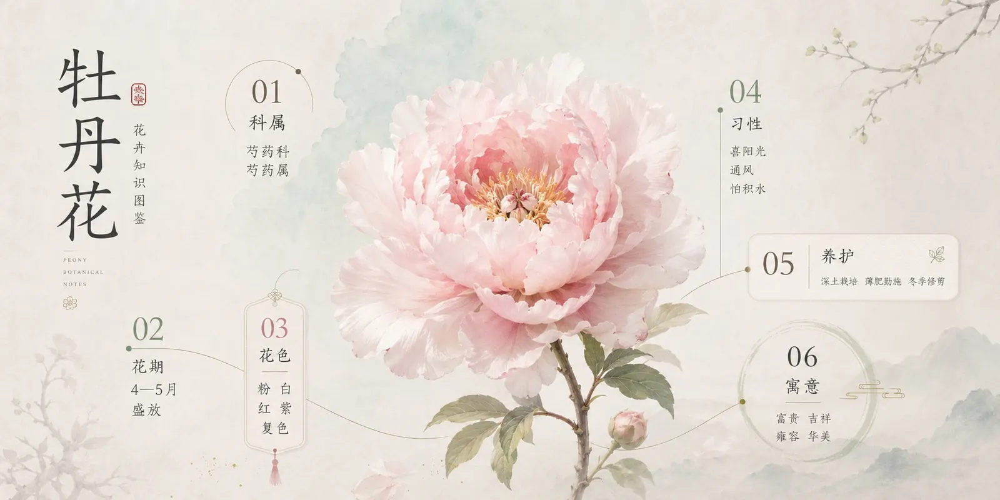 |

| 预览 | 预览 |
| --- | --- |
| 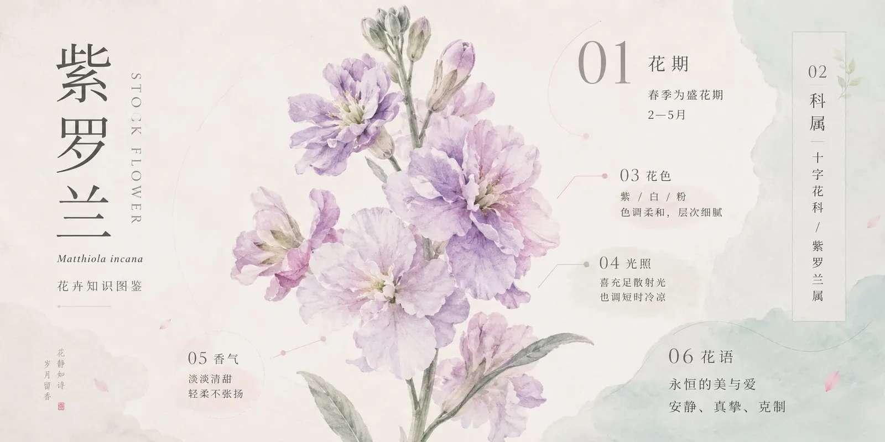 | 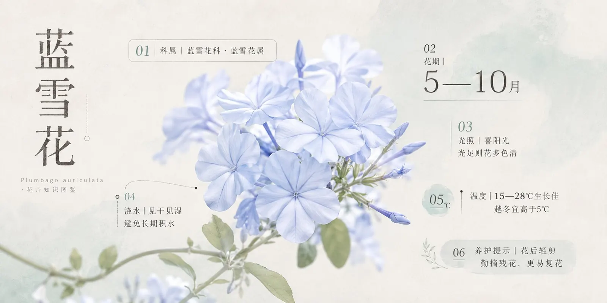 |

请以一种克制、清透、东方留白感的视觉语言，创作一张适用于 PPT、信息图、自媒体封面、知识卡片、名片或品牌视觉的画面。画面不追求装饰堆叠，而像一件安静生成的作品：信息被轻轻托起，空间有呼吸，视觉元素彼此避让又彼此牵引。

整体配色必须遵循低饱和、浅色、柔雾、近乎纸面的高级感。背景以极浅灰粉、暖白、淡米灰、雾白为主，不使用纯白死板背景；局部出现一块带有空气感的浅薄荷绿、冰蓝绿、淡青色或水雾色块，它不是标准硬边几何，而像被光稀释后的半透明平面。文字颜色使用灰黑、烟灰、深褐灰，不使用高饱和强色。点缀色可以来自自然物：嫩芽绿、枝干褐、花瓣白、浅粉，但必须轻、少、准。

构图采用非对称留白。主体不要居中压满，而是在画面中形成斜向生长、纵向呼吸或轻微偏移的关系。可以有一条自然枝干、柔软线条、植物、纤细曲线、云雾状形体、纸面纹理、淡淡投影或抽象数据轨迹作为视觉主线。它们像自然生长出来，而不是机械摆放。图形要轻盈、柔软、带微弱透明感和虚实层次，避免硬朗科技线框、标准图标模板、商业素材拼贴感。

文字排版是画面的骨架。标题可以纵排、竖向分布、分段留白，字距要疏朗，字号有节制但有仪式感。英文或辅助信息使用极细无衬线、大字距、小字号，像空气中的标注。正文信息不要堆满，适合被拆成短句、诗性短行、数据标签或信息节点。重要数字可以放大，但仍保持安静、优雅，不做电商式冲击。文字与图形之间要有互相成全的关系：文字像落在空间里的秩序，图像像托住信息的气息。

若用户输入的是知识、数据、观点或报告内容，请将其转化为一种轻量信息图：用少量线段、浅色块、微型标签、数字层级、纵向节奏、留白分组来组织信息。不要做传统表格，不要做密集流程图，不要做机械仪表盘。信息应该像被自然地安置在画面中，每一组文字都有自己的停顿和位置。

画面光感柔和，低对比，自然漫射光，带轻微景深与柔焦。可以有极淡阴影、纸张肌理、空气颗粒、半透明叠层。所有元素边缘都要克制，不要锐利过度，不要霓虹，不要赛博，不要高饱和渐变，不要厚重 3D，不要卡通，不要插画感过强。

最终画面应像同一位作者延展出的系列作品：安静、清浅、秩序感强，却不死板；信息明确，却不喧哗；有东方节气般的自然意象，也有现代信息设计的理性骨架。

请根据以下用户变量生成画面：

主题：

蓝雪花

用途：花卉知识图鉴

文字知识点：只要6个， 不同层级和呈现方案

中心构图，超大主体。

比例2:1

## 时尚风格指南信息图

| 预览 | 预览 | 预览 |
| --- | --- | --- |
| 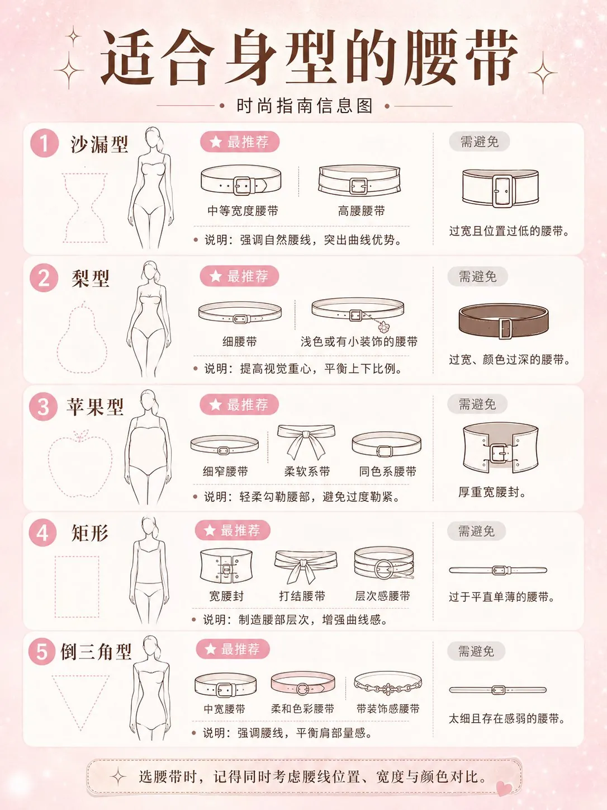 | 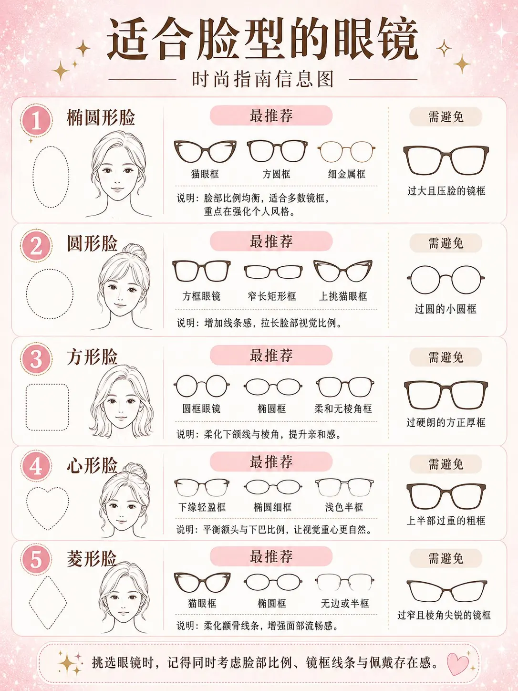 | 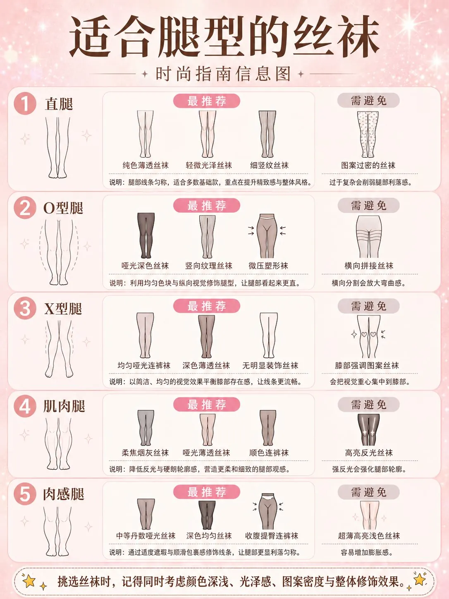 |

提示词：

请创建一张干净、实用的时尚指南海报，标题为「适合[身体部位与形状]的[时尚单品]」。布局：柔和的粉色闪亮背景，按不同类别清晰分行，覆盖[身体部位与形状]的各种组合（如脸型：椭圆形脸、圆形脸、方形脸、心形脸、菱形脸；体型：沙漏型、梨型、苹果型、矩形、倒三角型；头型：椭圆形头、圆头、方头；颈长：短颈、中等颈、长颈；肩型：窄肩、宽肩、溜肩）。每个部分包含特定身体部位形状的参考插图，并搭配最合适[时尚单品]款式的简洁线条艺术图标，以及文字标签。包含「最推荐」部分，并可选择性地加入「需避免」部分。风格：极简设计，中性棕色文字，柔和淡彩，清晰排版，直接生成图片。主题：「适合[身体部位与形状]的[时尚单品]时尚指南信息图」。

身体部分：脸型

时尚单品：眼镜

比例：3:4

## 中文高级知识架构信息图

| 预览 | 预览 |
| --- | --- |
| 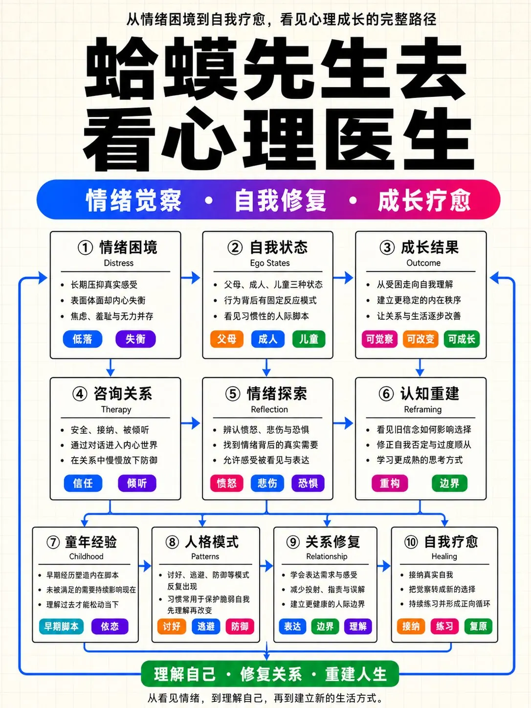 | 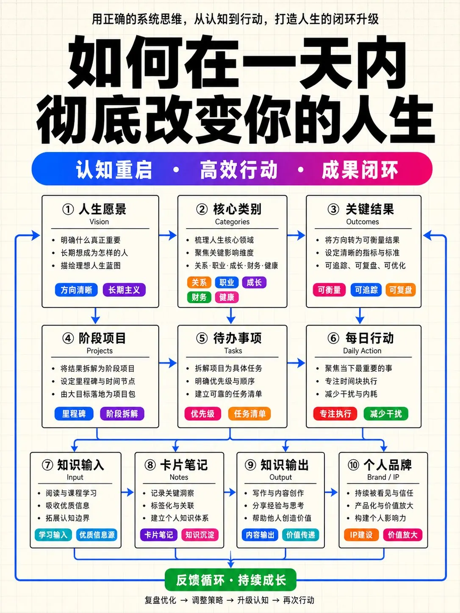 |

提示词：

请生成一张中文高级知识架构信息图，竖版 9:16 构图，整体视觉语言固定为：

浅米白网格纸背景 + 封面级超大黑体标题 + 高饱和蓝紫洋红渐变关键词胶囊条 + 白底黑边结构模块 + 模块内部多彩小胶囊标签 + 蓝色箭头闭环连接。

这不是普通流程图，也不是科技 UI 面板。请生成一张像高质量知识博主课程封面、知识付费系统图、方法论架构海报一样的高级信息图。整体必须克制、干净、强秩序，但局部彩色标签要足够醒目，让画面比普通黑白架构图更丰富、更有颜色层次。

━━━━━━━━━━━━━━━━

一、固定视觉风格

━━━━━━━━━━━━━━━━

背景

使用浅米白色网格纸背景。

背景带非常细、非常浅的灰色网格线。

禁止使用渐变背景。

禁止使用深色背景。

禁止大面积阴影、发光、毛玻璃、拟物卡片、科技 HUD、赛博 UI、花哨插画。

整体气质

结构极简、克制、理性、有秩序。

主体骨架为黑白结构。

色彩只用于关键词胶囊条、小标签、局部强调块、蓝色箭头。

不要把模块做成大面积彩色卡片。

不要做成商务 PPT 渐变风。

不要做成复杂思维导图。

不要做成普通流程图。

正确方向是：黑白结构骨架 + 局部高彩标签 + 蓝色连接线 + 封面级标题版式。

━━━━━━━━━━━━━━━━

二、顶部标题区固定布局

━━━━━━━━━━━━━━━━

顶部区域从上到下依次为：

顶部说明句

位于画面最上方。

居中排布。

使用黑色或深灰色小字。

内容由下方“内容”自动提炼，表达这张图的主题说明。

字重正常，不要太粗。

超大中文主标题

使用“顶部标题”变量作为主标题。

主标题必须是整张图最大的视觉元素。

使用超粗中文黑体、极高字重、强压迫感。

标题占据画面上方主要视觉面积。

标题不要细、不要小、不要轻飘。

标题可以分为 1-2 行，但必须保持封面级视觉冲击力。

横向高饱和渐变关键词胶囊条

位于主标题下方。

不是三个分离标签，而是一整条长横向圆角胶囊条。

胶囊条颜色必须从蓝色过渡到紫色，再过渡到洋红 / 紫红色。

胶囊条内部放 3 个核心关键词。

3 个关键词由“内容”自动提炼。

关键词使用白色粗体字。

关键词之间用白色圆点分隔。

这条渐变胶囊条是整张图第二视觉锚点，必须醒目、鲜艳、精致。

格式示意：

关键词一  ·  关键词二  ·  关键词三

━━━━━━━━━━━━━━━━

三、主体模块结构固定规则

━━━━━━━━━━━━━━━━

主体采用三层模块结构，严格对齐，等距排布：

第一层：3 个模块

第二层：3 个模块

第三层：4 个模块

总计 10 个白底黑边模块。

模块外观

所有模块必须是白色底。

使用黑色细描边。

使用极小圆角或近直角矩形。

不要大圆角。

不要柔和投影。

不要发光边框。

不要玻璃质感。

模块之间保持清晰间距和网格对齐。

每个模块内部统一包含

中文模块标题：中号偏粗，清晰醒目。

英文副标题：小号、较轻字重、灰黑色。

2-4 条短句内容：正常字重，简短、克制。

彩色小胶囊标签：根据语义自动插入，作为重点强调。

模块文字长度控制

中文模块标题控制在 2-6 个字。

英文副标题控制在 1-3 个英文单词。

每条正文控制在 6-14 个中文字。

小胶囊标签控制在 2-6 个字。

删除重复、空泛、过长表达，优先保留高信息密度短句。

━━━━━━━━━━━━━━━━

四、内容自动编排规则

━━━━━━━━━━━━━━━━

用户只提供“顶部标题”和一整段自然语言“内容”。不要要求用户手动拆模块。你必须自动完成理解、提炼、归类、压缩和标签化排版。

请按以下逻辑自动生成信息结构：

顶部说明句

从内容中提炼一句主题说明。

风格像知识博主封面小字。

简短、有概括力，不超过 22 个中文字。

渐变关键词条

从内容中提炼 3 个核心关键词。

每个关键词 2-5 个字。

必须高度概括，适合作为封面关键词。

使用白色圆点分隔。

第一层 3 个模块：战略层 / 认知层 / 结果层

优先承载：

愿景

目标

类别

核心判断

最终结果

系统价值

第二层 3 个模块：项目层 / 行动层 / 执行层

优先承载：

项目

行动

方法

任务

操作路径

执行机制

第三层 4 个模块：输入层 / 笔记层 / 输出层 / 品牌层

优先承载：

输入来源

信息整理

笔记沉淀

内容输出

产品化

品牌 / IP

放大传播

反馈闭环

如果内容中出现以下信息，优先做成彩色小胶囊标签，而不是普通正文：

分类

标签

来源

渠道

方法

工具

强调点

差异化

产品化

品牌化

增长

放大

IP

若原始内容信息不足

仍保持 3 + 3 + 4 的模块结构。

可以基于原文语义做合理概括。

不要编造具体数据、真实案例、人物、机构、年份、比例。

不确定的内容用抽象但具体的表达承接，例如“内容资产”“方法沉淀”“反馈优化”。

━━━━━━━━━━━━━━━━

五、模块内部彩色点缀规则

━━━━━━━━━━━━━━━━

整张图的丰富色彩感必须来自局部小标签，而不是大面积底色。

至少 5 个模块内部必须出现高饱和彩色小胶囊标签。

至少 3 类不同功能模块必须出现小胶囊标签。

小胶囊标签必须是圆角、高饱和、白字、尺寸精致。

推荐颜色池：

蓝色

紫色

洋红 / 紫红

红粉色

橙色

绿色

青蓝色

不同标签之间要有明显色彩变化，不要全部使用同一种蓝色。

标签使用建议：

分类类模块：多个不同颜色小胶囊横向排布。

来源类模块：蓝色、青蓝色、紫色标签。

方法类模块：红粉色或紫红色强调标签。

品牌 / 放大类模块：橙色或洋红色强调标签。

反馈 / 闭环类模块：绿色或青蓝色标签。

小胶囊标签示意：

「输入源」「标签化」「复用」「产品化」「IP 放大」

━━━━━━━━━━━━━━━━

六、蓝色箭头闭环规则

━━━━━━━━━━━━━━━━

箭头样式

所有箭头统一使用中高饱和蓝色。

线条清晰、利落、有存在感。

不要灰色箭头。

不要过粗。

不要杂乱缠绕。

箭头关系

箭头必须体现系统流动感，而不是静态表格。

从第一层流向第二层。

从第二层流向第三层。

第三层再通过回流箭头返回上层或顶部，形成闭环。

箭头数量可以较多，但必须整齐、克制、有秩序。

闭环逻辑

画面需要表达：

认知 / 目标 → 行动 / 执行 → 输入 / 输出 / 品牌 → 反馈 / 放大 → 回流优化

━━━━━━━━━━━━━━━━

七、文字层级与字重

━━━━━━━━━━━━━━━━

必须形成清晰层级，不要所有文字都一样粗。

字重从强到弱依次为：

主标题：最粗、最大、最强视觉冲击。

渐变关键词条文字：白色粗体，第二视觉层级。

模块中文标题：中号偏粗。

彩色小胶囊标签文字：中等偏粗。

模块正文：正常字重。

英文副标题：较轻字重。

禁止满版粗黑字。

禁止所有文字同一字号。

禁止正文抢主标题视觉权重。

━━━━━━━━━━━━━━━━

八、最终画面验收标准

━━━━━━━━━━━━━━━━

生成前请自检，最终画面必须同时满足以下标准：

是否有浅米白网格纸背景？

是否有居中顶部说明句？

是否有超大、超粗、封面级中文黑体主标题？

是否有一整条蓝紫洋红渐变关键词胶囊条？

渐变胶囊条内是否有 3 个白色粗体关键词，并用白色圆点分隔？

是否是三层结构，且模块数量为 3 + 3 + 4？

所有模块是否为白底、黑色细描边、小圆角或近直角？

是否至少 5 个模块内部有高饱和彩色小胶囊标签？

彩色标签是否包含蓝、紫、洋红、橙、绿、青蓝等多种变化？

是否使用蓝色箭头形成从上到下再回流的闭环系统？

整体是否克制、高级、有秩序，而不是花哨、科技、商务渐变或普通流程图？

如果某项不满足，请优先修正后再生成最终图像。

━━━━━━━━━━━━━━━━

九、禁止项

━━━━━━━━━━━━━━━━

禁止：

渐变背景

深色背景

大面积彩色卡片

大面积柔和阴影

毛玻璃

科技 UI

发光边框

拟物插画

复杂插画人物

普通商务 PPT 风

普通流程图风

思维导图风

所有模块同色

所有文字同粗

灰色箭头

缺少彩色小胶囊标签

缺少蓝色闭环箭头

缺少顶部渐变关键词条

━━━━━━━━━━━━━━━━

十、用户只需修改以下两个变量

━━━━━━━━━━━━━━━━

顶部标题：

### 在这里填写主标题

内容：

【在这里填写一整段自然语言内容。无需拆模块，无需写标签，无需写排版说明。请自动提炼顶部说明句、3 个关键词、三层 10 个模块、多彩小胶囊标签和蓝色箭头闭环结构。】

## 电视剧信息图

| 预览 | 预览 | 预览 |
| --- | --- | --- |
| 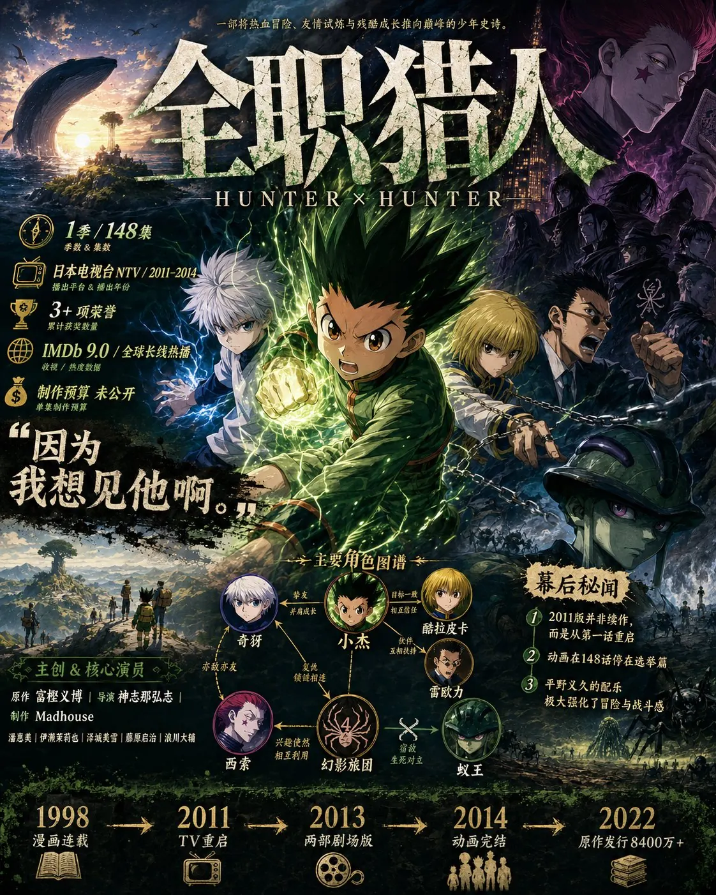 | 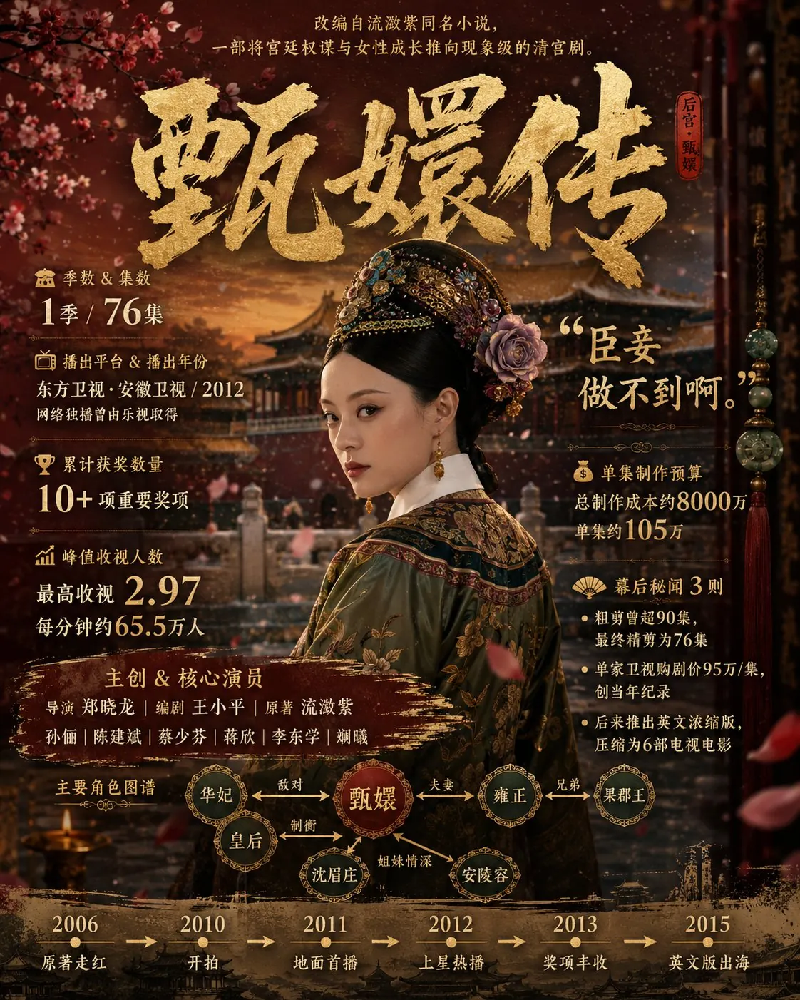 | 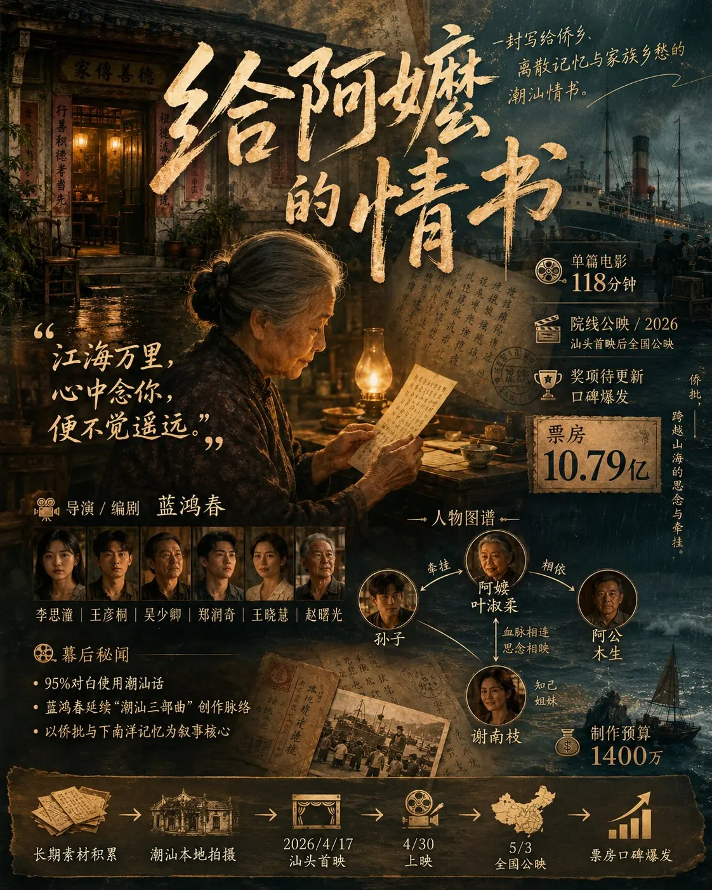 |

中文提示词：

在网上搜索 [剧名] 的详细信息，包括：制作历史、主演阵容、

集数、获奖记录、收视数据、经典台词、幕后花絮。

然后为 [剧名] 创作一张戏剧性编辑风格海报，

风格参照《国家地理》杂志特别报道——但主角是电视剧。

### 画面结构

以该剧最具辨识度的标志性场景/地点/画面作为满版出血背景，

从顶部铺展至底部，戏剧性灯光处理，

色调采用该剧的标志性配色方案进行调色。

### 版式要求

剧名以超大粗体字统治海报上半区，字体风格契合该剧视觉调性

文字与图形面板作为编辑叠加层自然漂浮于画面之上，

非杂志分栏布局，非方块信息格

所有元素有机叠加在满版背景图之上

### 信息内容模块（以叠加层形式呈现）

① 季数 & 集数

② 播出平台 & 播出年份

③ 累计获奖数量

④ 峰值收视人数

⑤ 经典台词——以大号引文格式突出呈现

⑥ 主创 & 核心演员面板

⑦ 主要角色图谱

⑧ 单集制作预算

⑨ 3个令人惊喜的幕后秘闻

⑩ 底部横贯全幅的制作时间轴

### 视觉风格

配色方案与情绪基调完全来源于该剧本身的视觉语言

让 [剧名] 自己决定一切

禁止：白色背景 / 杂志网格 / 方块分区

比例：4:5 竖版

### 质感定调

信息密集、触感丰富、电影质感、看一眼就知道是哪部剧。

## 史诗双曝人物志信息图

| 预览 | 预览 | 预览 |
| --- | --- | --- |
| 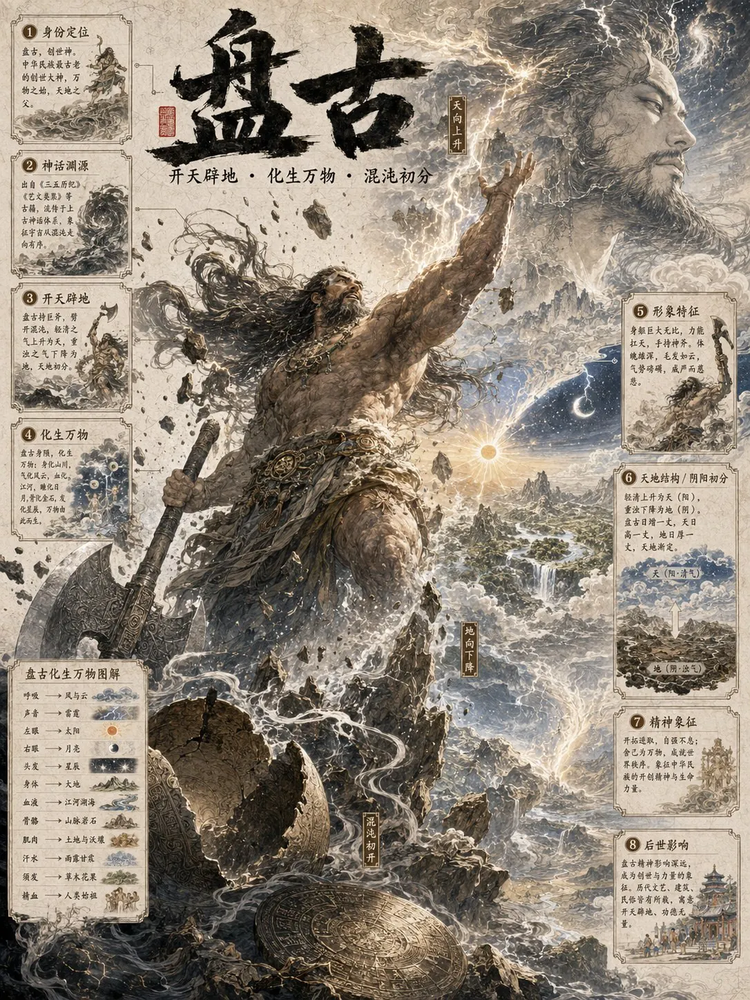 | 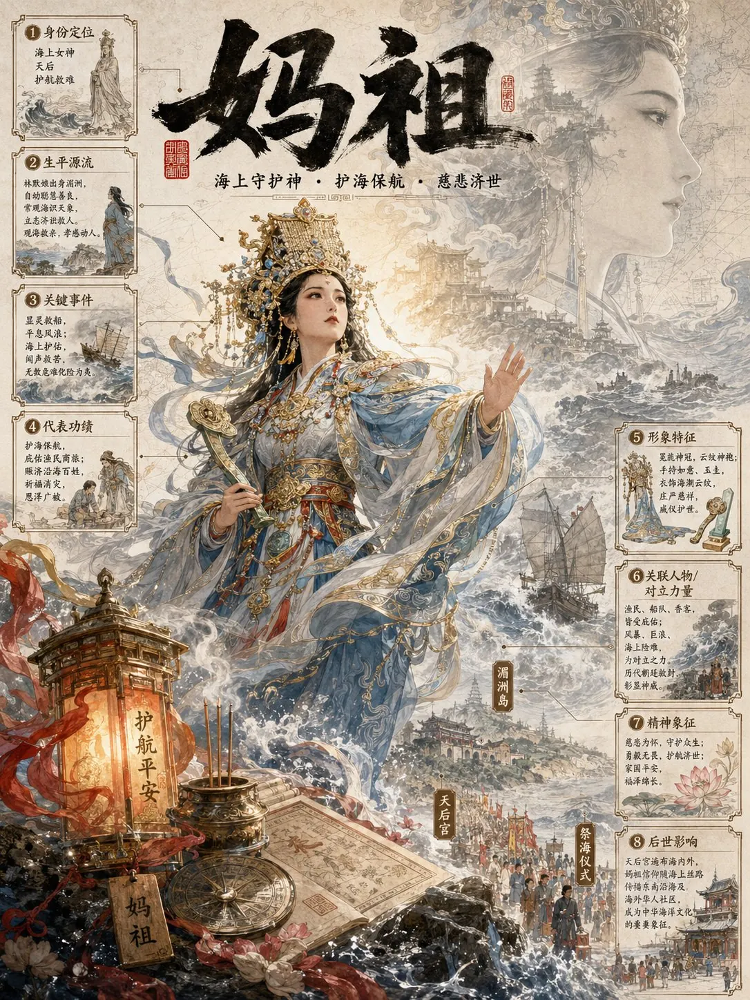 | 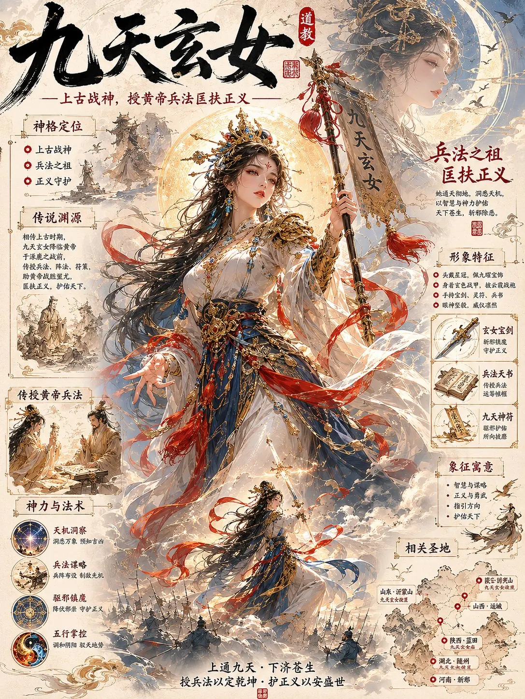 |

基于这套提示词打造了一套【史诗双曝人物志信息图】，宏大的史诗级叙事+双重曝光+前中后景三层空间，效果非常的炸裂！

提示词：

请为【人物姓名】创作一张史诗级中国风人物百科信息图封面。

重要原则：不要只做普通人物写真，也不要只套古风皮肤。画面必须先理解【人物姓名】的生平、神话职能、历史处境、关键事件与文化象征，并把这些内容转化为画面元素。每一个视觉元素都必须服务于人物故事，而不是随意装饰。

人物设定：

【人物姓名】：

【人物类型】：神话人物 / 历史人物 / 传奇人物 / 帝王 / 谋士 / 女仙 / 战神 / 才女 / 诗人 / 忠臣

【核心身份】：

【核心功绩】：

【关键事件】：

【主要冲突】：

【对立力量 / 关联人物】：

【代表器物】：

【核心场景】：

【精神关键词】：

【主色调】：

画面为竖版 3:4 构图，复古象牙白宣纸背景，不要太黄，纸张质感细腻，融合与人物相关的时代纹理、古籍纹理、山河地貌、星图、宫阙、战场、云海、海浪、祭坛、书斋、城楼或民间信仰场景。整体古雅、高级、庄重，但必须有强烈史诗感与电影级张力。

顶部中央写有巨大、厚重、有力量感的简体中文毛笔书法标题：“【人物姓名】”。书法要苍劲、浓墨、飞白明显，具有压迫感和历史感。标题旁点缀红色传统印章。副标题为清晰简体中文：“【核心身份】 · 【核心功绩】 · 【精神关键词】”。

构图必须采用以下三大结构：

第一，双重曝光神性投影。

右上角必须出现一张巨大、半透明、淡墨水彩风格的【人物姓名】侧脸幻影。这个侧脸不是普通肖像，而是人物命运、神性、精神意志或历史回声的投影。侧脸要与云雾、山河、火光、星图、古籍纹理或宫阙自然融合，形成“神性投影 / 命运投影”的效果。侧脸眼神要沉静、威严、悲悯或决绝，符合人物内核。

第二，强烈对角线动势。

画面必须形成从左下角到右上角的强对角线视觉冲击。左下角设置重要前景元素，例如【代表器物】、兵器、旗帜、宫灯、竹简、棋局、香炉、海浪、云气、火光、花瓣、红纱、战旗或祭器。视觉线条沿着人物衣袂、披帛、发丝、云雾、兵器、旗帜、光芒、烟尘一路冲向右上角的巨大侧脸幻影。人物身体姿态也要顺应这条斜向动势，不能正面呆站，不能平铺。

第三，前中后景压迫感。

画面必须有明显的前景、中景、后景三层空间。

前景：放置与人物关键事件有关的强叙事元素，例如云雾、战场残旗、宫灯、密信、竹简、兵书、棋盘、花瓣、海浪、祭器、香烟、破碎器物、火光或红纱。前景可以略微遮挡主体，制造空间压迫感和真实纵深。

中景：中央主体为【人物姓名】，高度写实、庄严、成熟、具有强烈人格魅力。人物服饰、姿态、表情必须符合其生平与身份。人物应手持或关联【代表器物】，并处在【关键事件】的核心瞬间，而不是普通摆拍。人物必须有强烈 3D pop-out 立体感，仿佛从宣纸、云雾、山河、战场、宫阙或历史风暴中跃然而出。

后景：远处必须出现与人物命运相关的宏大场景，例如【核心场景】、山河、军阵、宫阙、城楼、神山、星河、海潮、祭坛、书院、战火、民众、群像或历史人物剪影。后景可加入【对立力量 / 关联人物】的淡墨剪影或半透明巨影，形成压迫性的命运漩涡，但不能抢主角。

中央人物设定：

【人物姓名】应被塑造成具有历史厚重感与精神光辉的人物。面容成熟端庄，神情沉静坚定，目光有力量。服饰采用【主色调】，细节极其精致，包括传统纹样、织物层次、金属饰件、玉佩、发冠、步摇、流苏、披帛、甲胄、长袍、舞衣或神袍。衣袂、发丝、披帛、旗帜、烟尘、云气、花瓣、雪片、火光或海浪必须向画面外延展，强化 3D pop-out 效果。

画面四周设置 6 到 8 个有组织的信息模块。模块不是随便装饰，必须围绕人物生平和关键事件展开。每个模块有细边框、中文小标题、小插画和简短说明文字。模块标题根据人物自动生成，可包括：

身份定位

生平源流 / 神话渊源

关键事件

代表功绩

形象特征

## 关联人物 / 对立力量

## 精神象征

## 后世影响

模块排布要顺应主画面的对角线动势，不要机械平均。模块之间使用细密但优雅的引线、箭头、圆点、括号和标注线连接到中央人物、前景器物、后景人物剪影和右上角神性投影。所有文字必须是清晰可读的简体中文，不要乱码，不要英文。模块标题可用小号毛笔字或古籍标题风格，正文为清晰手写风中文注释。

画面必须有以下关键词：

双重曝光、右上角巨大半透明侧脸、神性投影、命运投影、左下到右上的强对角线、前景遮挡、中景主体、后景军阵 / 山河 / 宫阙 / 神境、电影级纵深、强明暗对比、3D pop-out、古典百科图鉴、精细水墨线稿、数字水彩、史诗人物志、信息丰富但不杂乱。

整体风格：

东方古典人物百科图鉴、中国神话人物志、历史人物信息图、精细水墨线稿、数字水彩、电影概念艺术、超高细节、丰富层次、庄严神圣、克制华丽、学术感与艺术感并重。

严格要求：

无品牌、无 logo、无水印、无现代元素、无英文文字、无乱码文字、不要过黄、不要廉价网游风、不要普通古装写真感、不要静态证件照感、不要构图平铺、不要人物太小、不要背景空泛、不要低俗暴露、不要恐怖血腥、不要过度性感化。文字清晰可读，竖版 3:4。

人物名称：妈祖

通用图解百科全书科学信息图

| 预览 | 预览 | 预览 |
| --- | --- | --- |
| 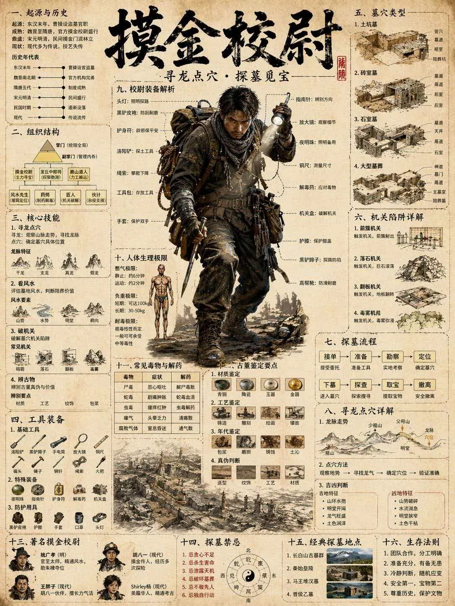 | 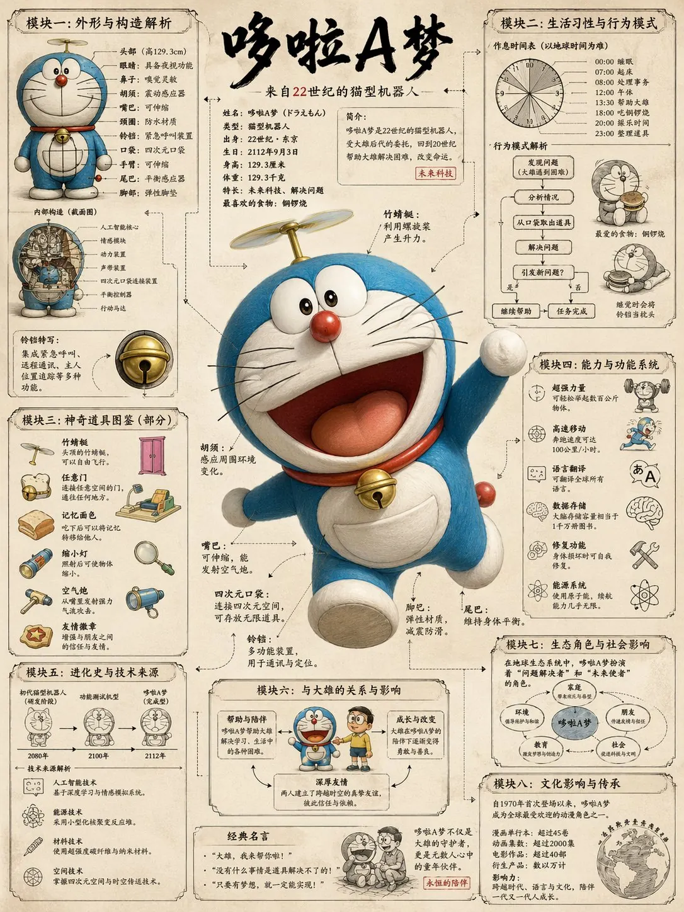 | 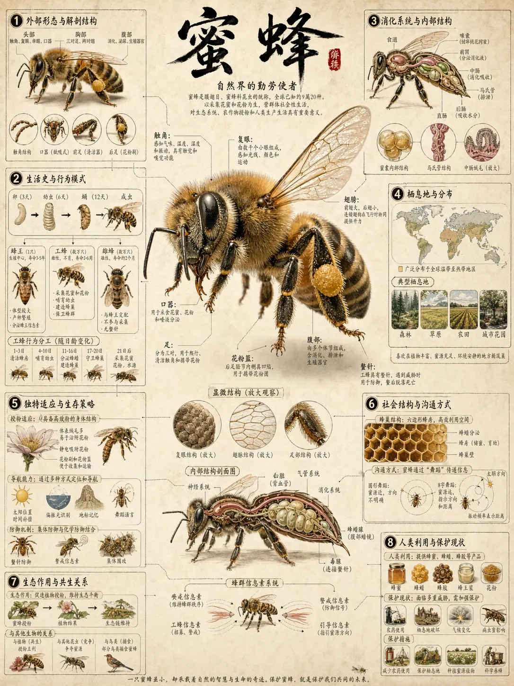 |

任务：生成一份高度详细、极其复杂且视觉效果惊艳的“通用图解科学信息图”，采用经典、无品牌（无标志）科学百科全书风格。

主题：从[人、植物或动物]中选择一个。

具体主题：[例如，巨型鱿鱼 / 达·芬奇 / 红杉树]。

风格：精美细致的科学插图，背景是复古的陈旧米色纸张。细腻的线条。极其复杂且专业。

关键视觉要求：

逼真的 3D 效果（核心主体）：位于“C 位”的中心主体必须以非凡的真实感和动态性呈现。营造一种戏剧性的深度感，角色、植物或动物似乎破格而出，跳跃或爆裂，朝观众冲来（类似变形 3D 或动态弹出效果，具有高精度的真实感）。

布局与战略空白：

中心主题：主导中心，周围有意设置“战略性空白”，以增强突出效果，使人物成为清晰的焦点。

周边模块：周围区域（左、右、上、下和角落）必须根据学科不同，设置6-8个高度有序的知识模块。应该有有序的密度感，而不是随意的杂乱。模块本身必须有清晰的边界、页眉和详尽的内容。

连接：利用复杂且逻辑的细引线、箭头、括号、虚线和小连接点网络，将中心图形与周围所有模块连接起来，并将模块本身相互连接成一个连贯的知识网络。

文本与注释（硬性要求——必须是清晰的中文）：

主标题：一大块、醒目且精美的书法体，书法体中写着特定主题的名称[例如“大王乌贼”]。

书法口音：散布在主内容和模块标题中，使用清晰的中文书法表示重要术语。

标准中文文本：所有其他描述性文本、手写笔记（大量清晰中文手写注释）、模块内容和注释必须为清晰易读的中文字符（简体中文），而非胡言乱语或不可辨认的符号。确保文本清晰度优先。

引导线注释：模块内的每一个小组件、细节、子模块、图表或插图都必须有详细的引导线注释（拟解剖图），以最大化专业性和教育价值。每个部件都应该有标签。

Subject-Specific Module Structure (Example for general reference):

学科特定模块结构（示例参考）：

A.对于人类来说：

模块1：解剖与骨骼结构（含放大剖面）

模块2：生理过程（例如循环/神经系统）

模块3：历史背景与时间线（关键成就）

模块4：主要贡献图（详细分解）

模块5：认知过程/心理洞察

模块6：遗传特征/进化

模块7：全球影响力与文化影响

第8模块：文化表征/遗产

B.对于动物：

模块1：完整外部草图与解剖（含显微镜放大细节圆形窗）

模块2：行为模式与生命周期（例如，交配/迁移，流程图风格）

模块3：消化与骨骼系统

模块4：栖息地与分布图（含环境细节）

模块5：独特适应（如伪装、狩猎工具）

模块6：进化历史与亲属

模块7：共生关系/生态系统角色

模块8：保护状况与人类互动

C. 植物：

模块1：完整植物素描与解剖（附放大叶片/根部细节）

模块2：光合作用与生命周期流程（附环境图标）

模块3：细胞结构（放大圆形视图）

模块4：药用特性/实用应用（如原提示）

模块5：环境适应/独特特征

模块6：分布图与环境背景

模块7：遗传变异与培养

模块8：历史用法与民间传说

整体构图：信息极为密集，分为 6-8 个结构化模块，但中央留出战略性空白，使主体的超现实人物得以突出。硬核、专业、学术，但由于动态的 3D 中心人物，视觉上极具吸引力。没有任何特定百科全书的品牌标识（例如，没有“DK”标志）。所有注释必须清晰可读。所有手写笔记必须清晰。中国书法的主要标题。画面比例：3：4。

主题内容：蜜蜂

## 手绘说明卡片

| 预览 | 预览 |
| --- | --- |
| 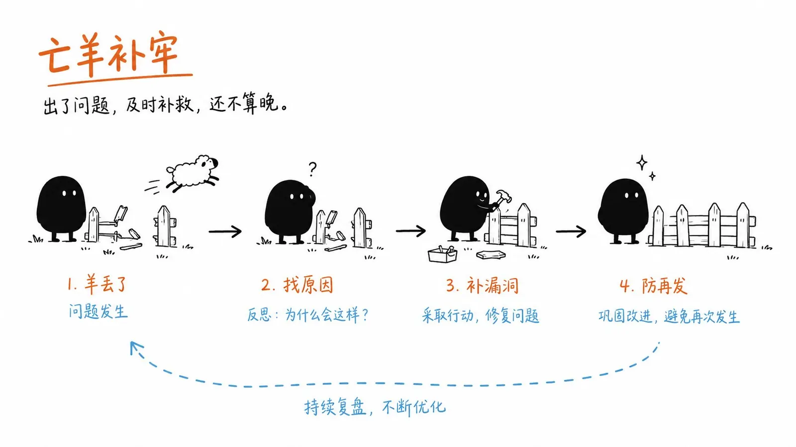 | 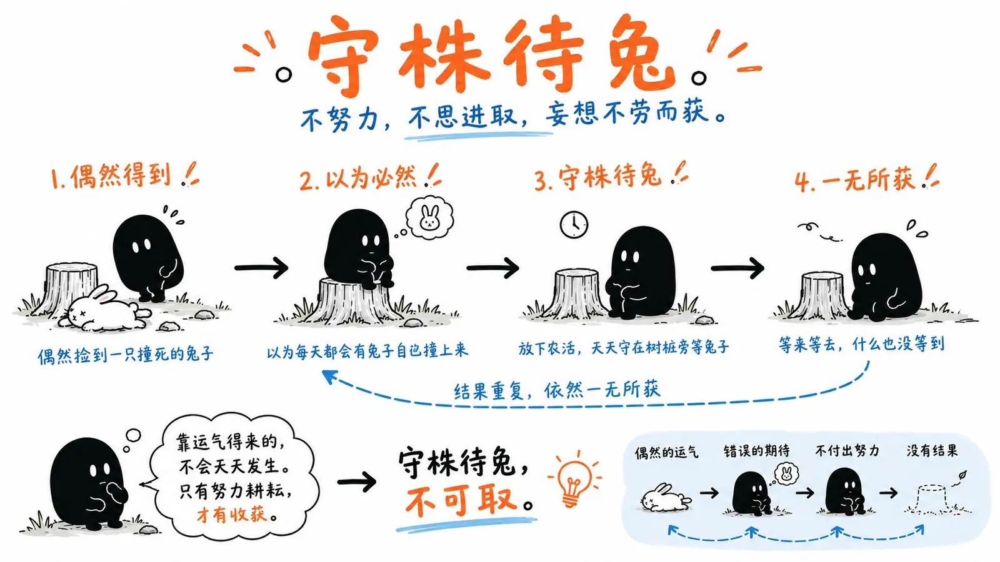 |

一张干净的手绘说明卡片，横版16:9比例，纯白背景（#FFFFFF）。【主角角色设计】一个可爱的圆润黑色blob小人——纯黑填充、白色圆点眼睛、小短腿、无明显手臂。身体轮廓有机自然、略微不对称，像一颗光滑的鹅卵石。角色仅通过全身姿态表达情绪，无面部表情细节。整张图中角色造型保持一致。【插画风格】- 干净的墨线线稿，带轻微手绘质感- 线宽统一偏细，线条不粗糙、不潦草- 笔触克制且有意图，像专业编辑插画师的工作稿- 物体造型简化至核心轮廓，比例略带可爱/Q版感- 物体不填色，仅保留轮廓线，偶尔加极浅灰色投影【配色系统（严格三色）】- 所有线条与角色填充：深黑色 #1A1A1A- 强调色①：暖橙色 #E8823A —— 仅用于关键词、核心标签、重要注释- 强调色②：天蓝色 #5BA4CF —— 仅用于次要说明、流程描述、回流箭头- 背景：纯白，无纹理【构图结构】横向从左到右的流程构图，3至5个视觉元素用手绘箭头串联。同时包含：实线方向箭头（黑色）+ 虚线弧形回流箭头（蓝色）。文字标签自由浮动在元素上方或下方，标签无背景框、无边框。元素之间保留充足留白。【文字风格】- 标签采用宽松的手写毛笔/马克笔风格- 橙色标签标注主要概念，蓝色标签标注辅助信息- 文字小而随意，基线略不平整，像用白板笔随手写上去的感觉【整体氛围】像一位聪明的中文内容创作者的说明卡片——干净、克制、极简，但充满个性。参考感：Notion极简风 × Q版插画 × 商业白板手绘。禁止出现：渐变色、装饰性投影、几何感过强的矢量完美线条、花哨边框、复杂背景。

信息图演示

| 预览 | 预览 |
| --- | --- |
| 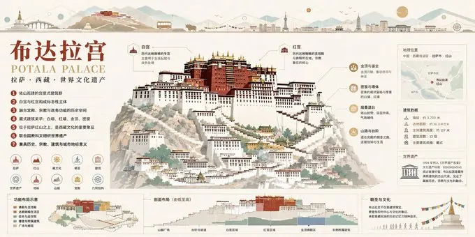 | 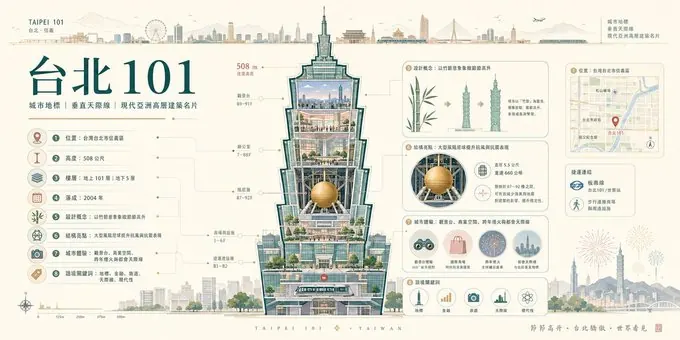 |

| 预览 | 预览 |
| --- | --- |
| 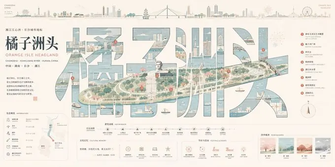 | 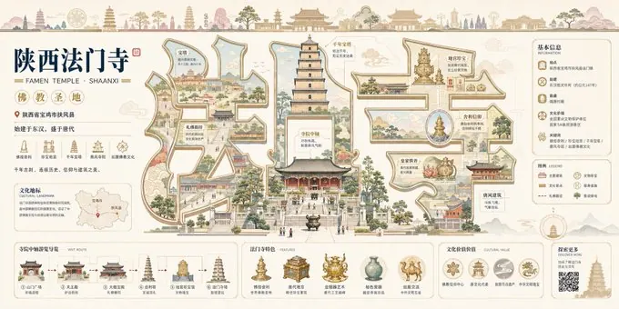 |

Plain Text生成一张超高分辨率、印刷级别、具有收藏价值且适用于信息图/演示的主题海报。用户会在结尾输入一个主题词，可以是城市、地点、人物、品牌、节日、文化概念、物件、情绪、建筑或任意名词，也可提供补充文本。画面以该主题词为核心，核心元素不是简单的文字，而是一个 **巨型容器化空间**，它可以吸纳和承载各种与主题相关的特色内容：建筑、街道、桥梁、河岸、树木、广场、符号、程序化几何、局部地图感、文化标识、信息点、图例、数据节点、注释或标签等。核心容器既可识别为主标题形状，也像一个视觉载体，将信息、符号与场景有机组织在内部。顶部可添加横向剪影式装饰带，由天际线、建筑轮廓、交通剪影、几何线条、抽象符号或程序化结构元素组成，与主体容器在色彩、节奏和气质上完全统一，形成完整的视觉张力。信息可环绕、嵌入或延展至容器周边，形成清晰层级：主信息—次级信息—补充信息，既可根据用户补充文本提炼信息，也可由 AI 自动生成相关知识点和视觉符号。整体风格兼具高端编辑设计、信息图设计、中世纪现代、瑞士平面设计与扁平几何插画气质。构图克制，留白讲究，线条准确，边缘利落，画面安静但具有吸引力，兼顾视觉冲击与信息可读性。核心容器和附属信息的层级清晰，远看抓住视线，近看能阅读细节，整体像收藏级海报与信息图的结合体。色彩逻辑建立在 **明亮、柔和、低饱和** 基础上，整体气质清透、轻盈、优雅、精致。主体色可采用奶白、雾粉、浅蓝、薄荷绿、砂岩、浅灰等色系，可适度延展至柔和杏色、鼠尾草绿、粉蜡橙、淡芥末、灰玫瑰、浅雾紫等相近色，所有元素服从统一色彩秩序。允许少量强调色作为视觉锚点，用于信息节点或符号提示，但不能破坏整体协调。暗部严格控制，只作为局部结构或节奏辅助。文字与符号必须专业、清晰、稳定，不出现乱码、破碎文字或随机符号。整体效果应达到博物馆级、收藏级和演示级统一完成度。若无额外要求，默认画幅比例为 2:1。主题词：橘子洲头
