# 插画类

> 从《ChatGPT image2 提示词》导入并转换为适合 GitHub 浏览的版本。

东方水墨水彩风

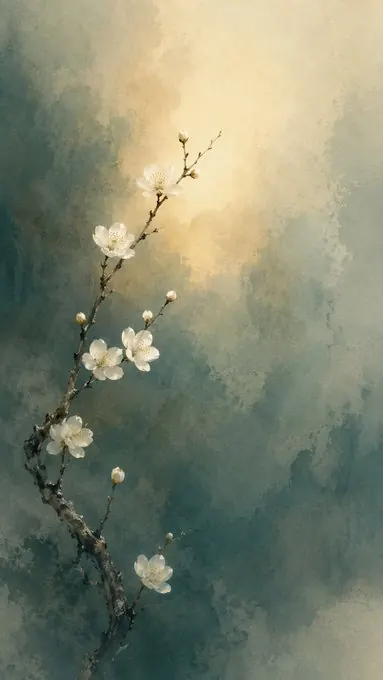

9:16竖幅，画面铺满，无边框，但主体不铺满，大量留白。东方水墨水彩风格，一枝单独

白梅从{梅枝起点}起势，向上呈{梅枝走势}，枝干为细瘦老枝，自然弯折，局部粗粝枯木

质感，姿态含蓄克制，不夸张。

枝头稀疏开放约{花朵数量}朵白梅，搭配{花苞数量}，花瓣洁白轻薄，柔和半透明，花心

细腻但不过度写实。背景为{背景主色}与{背景辅色}交融的雾化水墨水彩背景，带{材质

肌理}，低饱和，边界柔和。花枝后方有{光源位置}的含蓄暖色柔光，像薄雾中透出的微

光，不刺眼，不形成强烈舞台光。整体氛围{氛围关键词}，静谧空灵，古雅诗意。

负向提示词：

主体铺满画面，花枝过大，满版主体，粗壮树干，戏剧化扭曲，夸张造型，多枝梅花，整

棵梅树，花海，满屏花朵，花瓶，盆栽，红梅，粉梅，桃花，樱花，牡丹，人物，动物，

鸟，昆虫，建筑，山水远景，文字，题字，印章，边框，装饰图案，强烈舞台灯光，聚光

灯，高对比硬光，过曝光斑，强烈金色光束，高饱和颜色，纯黑背景，纯白背景，摄影写

实，3D渲染，卡通，动漫，厚重油画，杂乱背景，枝条过多，花朵过密，对称构图，中心

大花特写

变量：

{梅枝起点}：画面左下 / 画面右下 / 下方偏中

{梅枝走势}：轻微S形上升 / 自然弯折向上 / 斜向上舒展

{花朵数量}：5朵 / 7朵 / 9朵 / 10朵

{花苞数量}：少量圆润花苞 / 2-4枚花苞 / 几枚零星花苞

{背景主色}：深青绿 / 灰蓝绿 / 墨绿青 / 青绿灰蓝

{背景辅色}：暖褐 / 暗棕 / 柔和赭色 / 淡金雾光

{材质肌理}：宣纸肌理 / 绢本肌理 / 水彩纸纹 / 雾化纸本肌理

{光源位置}：花朵后方 / 枝干侧后方 / 中上部花枝后方

{氛围关键词}：清冷含蓄 / 安静雅致 / 空灵疏朗 / 低饱和东方意境

## 复古风格水彩旅行海报

| 预览 | 预览 |
| --- | --- |
| 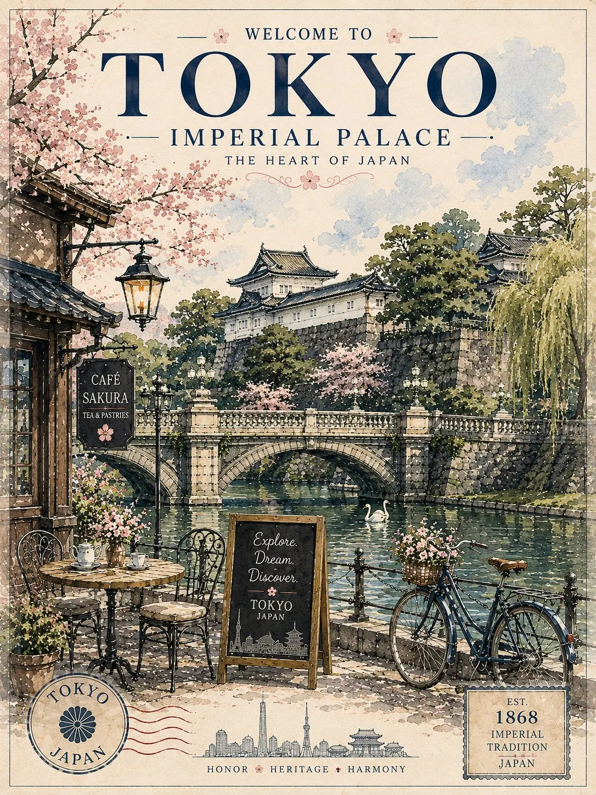 | 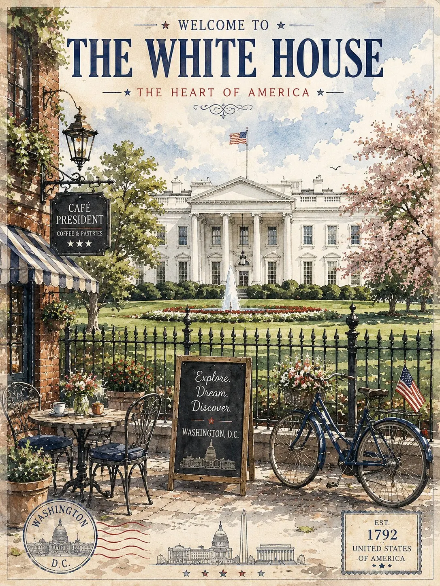 |

提示：

一块迷人的复古风格水彩旅行海报，描绘华盛顿特区白宫，采用精致的手绘都市素描美学。构图中标志性的白宫雄伟矗立于中央，周围环绕着郁郁葱葱的花园、优雅的喷泉、盛开的花树，以及远处的经典美国建筑。前景是一座温馨的历史风格咖啡馆露台，沿着宁静的大道坐落，摆放着锻铁椅子、小木桌、咖啡杯、复古灯笼和常春藤覆盖的砖墙。一辆经典的藏青色自行车，篮子里装满鲜花，停在装饰性的黑色铁栅栏旁，营造出宁静的生活方式氛围。

附近的喷泉池中柔和的倒影闪烁，小巧的美国国旗在微风中轻轻飘扬。蓬松的水彩云朵和小鸟点缀着明亮的蓝天。一块手绘的黑板牌子写着“探索。梦。发现。华盛顿。”顶部装饰性复古字体写着“欢迎来到白宫——美国之心”。额外的邮票图案、优雅的天际线条艺术，以及细腻的爱国星和红白蓝点缀，装饰着下角。

采用柔和的水彩洗涤、墨水草图轮廓、柔和色调、质感丰富的纸质纹理和优雅的旅行海报构图。氛围充满怀旧、梦幻、精致且温馨，融合了美国历史建筑与温馨的咖啡馆文化。细节丰富却通透，线条细腻，彩绘细腻，水彩质感逼真。竖版海报布局、电影化构图、极其细致的插画、高端复古旅游海报美学。

## 电影级韩流女偶像插画

| 预览 | 预览 |
| --- | --- |
| 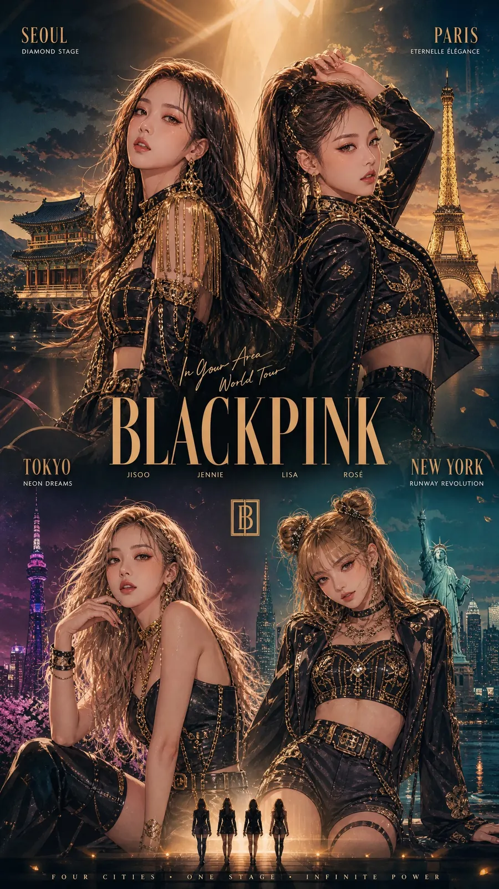 | 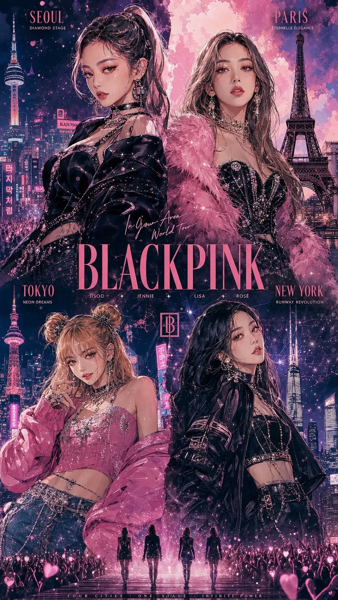 |

超时尚的电影级韩流女偶像插画，灵感源自全球流行组合的美学，描绘了四位气场强大的女偶像，她们个性鲜明，分别展现出热情、优雅、俏皮和神秘的气质。故事发生在首尔、巴黎、东京和纽约等标志性世界城市，并以超现实的蒙太奇手法呈现。高级时装舞台服装饰以水钻、皮革、丝绸、金属元素和超大廓形。水彩与墨水混合风格，并以粉色、黑色和电光紫的霓虹高光点缀。演唱会灯光、人群散景以及T台与舞台的融合构图。戏剧性的姿势、锐利的眼神、奢华的偶像气质、杂志封面般的造型、极其细致的面部刻画、电影级的灯光效果、爆款韩流美学，8K超高清插画。

## 城市微型比例模型

| 预览 | 预览 | 预览 | 预览 |
| --- | --- | --- | --- |
|  | 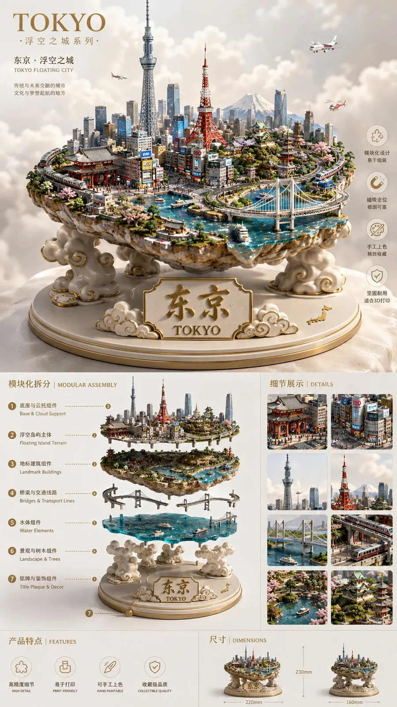 | 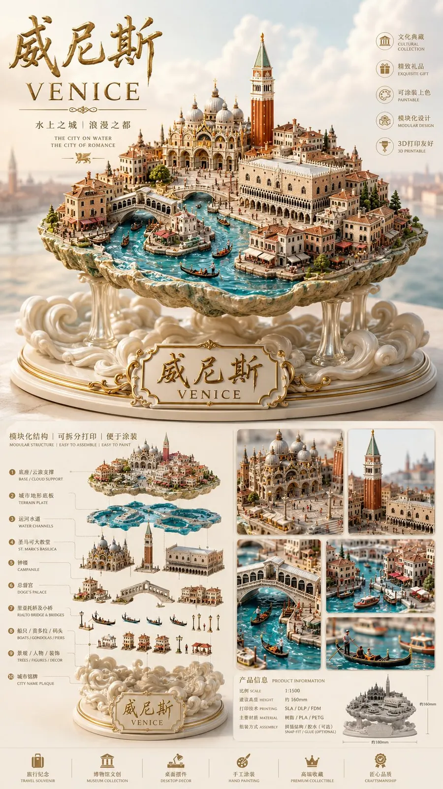 | 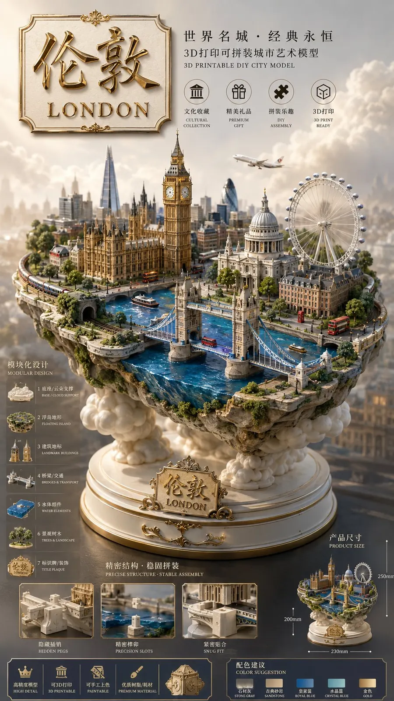 |

打造一个超细致、可生产、可 3D 打印的[城市名]微型比例模型，设计为高端商业收藏品、奢华旅行纪念品、博物馆礼品店产品及高端文化创意桌面雕塑。

该模型代表[城市名 CITY NAME]作为手工制作的漂浮岛屿城市立体模型，但必须设计出可实现真实 3D 打印的可行性。漂浮岛屿不应是纯粹不可能实现的奇幻对象;它应包括优雅的隐藏结构支撑系统，如云形底座支撑、透明柱状支撑，或集成的雕塑展示基座，使模型物理稳定、可打印、可组装且具商业制造性。

最终设计应呈现为高端 3D 打印产品概念，适用于 STL/OBJ 转换、树脂打印、高端 FDM 打印、后期处理、手工涂装、包装及商业零售。

标题 / 标志 / 排版：

标题“[中文城市名]”应以凸起或雕刻的 3D 书法浮雕牌出现在展示底座或上方构图上。中文书名必须采用优雅的传统书法风格，笔触流畅，笔触粗细对比，水墨画节奏富有艺术感，文字精致手工。它不能看起来像标准印刷字体或无衬线字体。

在其下方或旁边，用优雅的衬线式雕刻或凸起字体处理“[CITY NAME]”。排版应具备物理打印能力，笔画粗细可辨，且不得出现脆弱的浮动笔画。

核心地标：

[地标 1]：简化但易于识别的 3D 打印微缩模型解读

[地标2]：具有可制造细节的雕塑地标形态

[地标3]：标志性的文化或建筑特色，优化于微型生产

3D 打印需求：

整个设计必须防水、流管且视觉上适合 STL/OBJ 3D 打印

使用真实的壁厚、稳定的支撑逻辑和可打印的几何形状

避免超薄无支撑部件、脆弱的栏杆、不可能的悬挑、断开的漂浮细节和如毛发般的元素

所有微小元素都应简化到适合树脂打印，同时仍保持高端和细致

桥梁、塔楼、车辆、树木和建筑物应设有加固的接触点

模型应为模块化且可组装，且零件分离清晰：

显示基座 / 云支持基座

浮岛地形

地标性建筑

桥梁与交通线路

水元素

树木与景观细节

标题牌匾及装饰元素

使用隐藏的插销、插槽、插座、磁性连接器或键控组件逻辑

模型应适用于喷漆、抛光、打磨、底漆和商业包装

最终产品应足够真实，适合作为高端收藏品制造

微型城市元素：

雕刻地形高程，包括山脉、河流、森林、海岸线、城市区域和分层地貌

具有强烈视觉层次排列的标志性地标

微型道路、桥梁、铁路、隧道、港口和机场元素

微型汽车、船只、火车和飞机，设计为简化的可打印剪影

传统与现代建筑融合为一个连贯的微型世界

晶莹蓝色的水道，表现为光滑雕刻的河道或可填充树脂的区域

当地文化细节，如美食摊位、市场、传统工艺、街景、花园、寺庙、塔楼或滨水生活

微型人形雕像应具风格化、稳定且易于打印，不应过于纤细或脆弱

所有细节都应支持比例模型真实性，同时保持可制造性

商业产品设计：

模型应呈现高端零售产品，而不仅仅是插画。它应拥有豪华收藏展示底座、简洁的轮廓、强烈的城市身份、优雅的比例以及高的感知价值。该设计应适合商业销售，具体如下：

奢华旅行纪念品

博物馆文化产品

城市地标收藏品

桌面显示雕塑

限量版树脂模型

高级 3D 打印礼品

颜色 / 材质方向：

使用精致的优质材料处理：

温暖的象牙树脂或哑光陶瓷基底

细腻的金属金色或青铜装饰

河流和湖泊的晶蓝色半透明树脂效果

景观区的柔和自然绿地

石灰色、砂岩或珍珠白色建筑色调

可选的手绘地标亮点，灵感来自城市身份

COLOR PALETTE:

Main color: [主色调，体现城市气质]

Secondary color: [辅助色，体现自然/建筑/历史感]

Accent color: [强调色，用于地标、铭牌、水体或金属细节]

布局/展示：

将该物品呈现为一张高级产品可视化海报，采用9：16竖版构图。使用电影般的灯光、柔和的氛围云层、干净明亮的奢华背景和倾斜微缩小照片

日系手账风视觉卡片

| 预览 | 预览 | 预览 | 预览 |
| --- | --- | --- | --- |
| 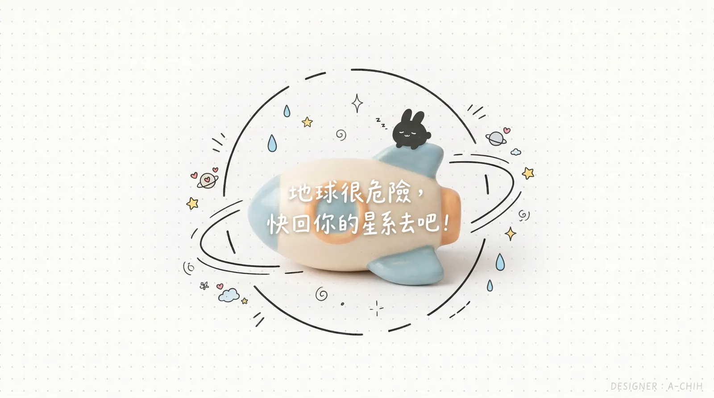 | 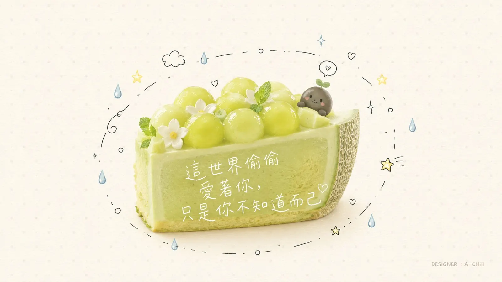 | 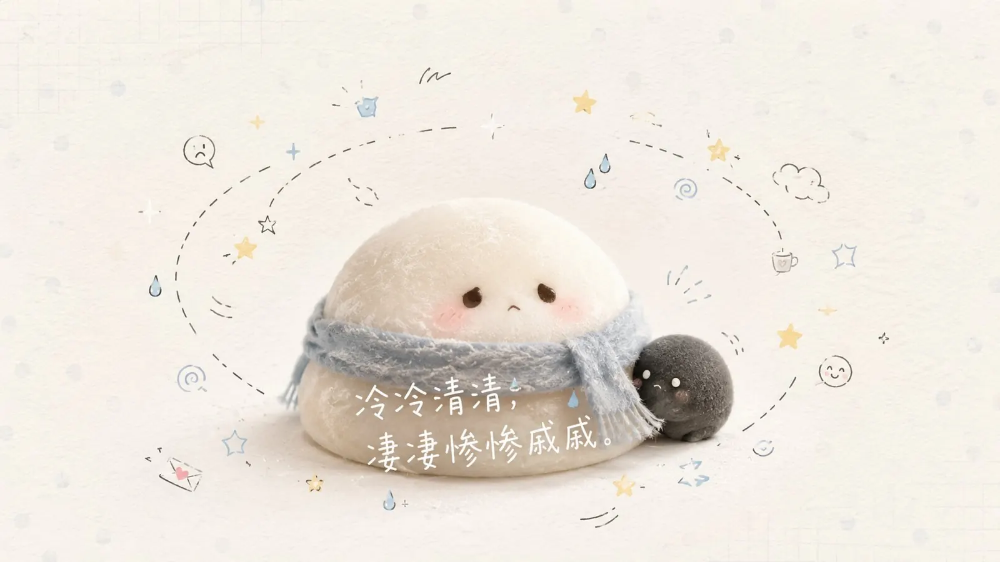 | 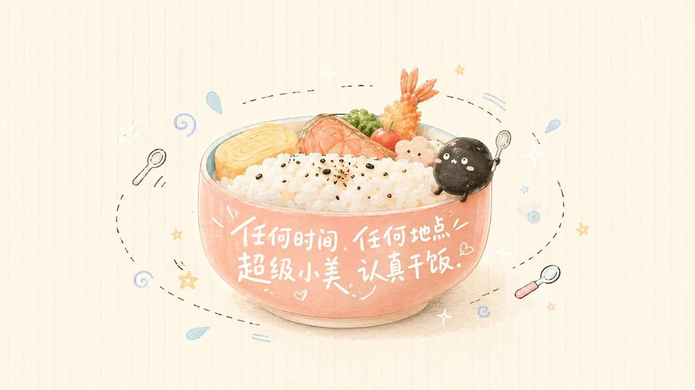 |

| 预览 | 预览 | 预览 |
| --- | --- | --- |
| 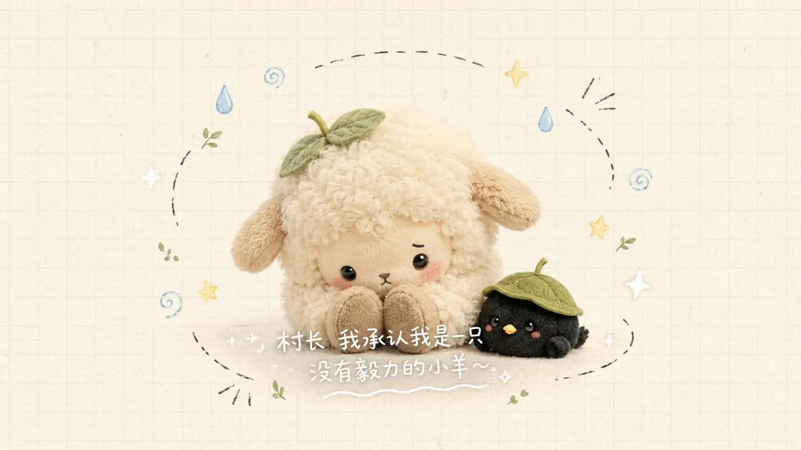 | 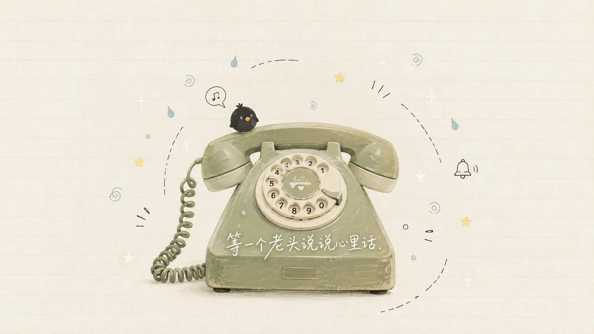 | 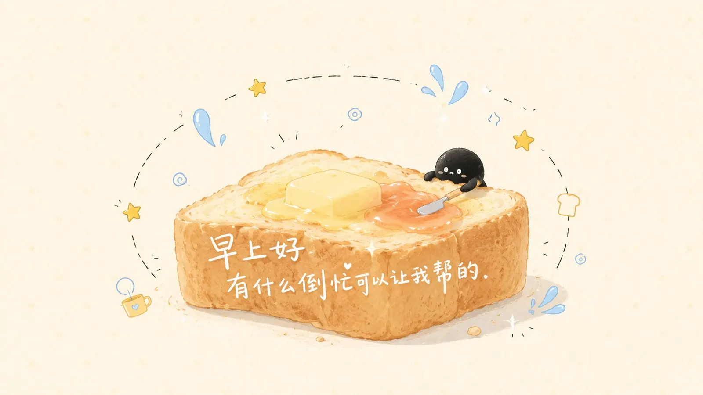 |

请将【主题】设计成一张温柔治愈的日系手账风视觉卡片。不要只画物品本身，而要把物品变成一个“情绪小宇宙”。

画面需要有一个清晰的核心主体：【主体物】，主体带有柔软真实的质感，可以是食物、物件、植物、人物配件或任何符合主题的核心符号。主体放在画面中心偏下，比例较大，像一个承载情绪的小舞台。

围绕主体添加手绘涂鸦系统：黑色断续弧线形成不完整的环绕轨道，浅蓝色水滴、黄色小星星、白色闪光、细小旋涡、短线条和迷你图标围绕主体轻轻漂浮。所有涂鸦元素要有“围绕主体运动”的感觉，而不是随机装饰。元素数量适中，保留大量呼吸空间。

加入一个极小但有记忆点的陪伴角色：【小角色】，可以趴在主体边缘、坐在主体上方或藏在主体旁边。它要简单、圆润、黑色或低饱和色，表情可爱，像偷偷陪伴用户的小生命。

在主体上或主体前方加入一句简短文案：【文案】，字体为白色手写风、轻盈、柔软、略带日记感，文字与主体自然融合，不要像海报标题一样生硬。

整体色彩采用低饱和、奶油感、轻纸感配色。主体颜色作为主色，背景为奶白色，加入极淡的规律圆点或细微纸张颗粒。辅助色只使用浅蓝、淡黄、浅灰、柔粉等轻柔色彩。画面不能厚重、不能高对比、不能商业广告感，要像一张被珍藏的心情贴纸。

最终效果：干净留白、温柔、可爱、轻盈、治愈，有手账纸张质感，有真实主体的触感，有手绘符号的灵动感，有小角色带来的故事感，有一句文案带来的情绪落点。

————————

本次主题是：俏皮文案配图

一行文案一次配图，也就是一次独立生成任务

确保每次生成，都是截然不同的色彩逻辑，排版逻辑， 字体逻辑，都中心构图

如下是每个画面的文案，忽略数字序列

Plain Text1. “早上好 有什么倒忙可以让我帮的.”2. “地球不好混.”3. “等一个老头说说心里话.”4. “乖乖穿上了裙子变成了乘乘.”5. “注意看 这个女人叫小美.”6. “今天不是Hello Kitty是HelloBaby.”7. “村长 我承认我是一只没有毅力的小羊～.”8. “等一个小天鹅的消息.”9. “我趣 芥么好康.”10. “任何时间 任何地点 超级小美 认真干饭.”

比例16:9

用途：适合成为电脑壁纸。

背景逻辑：淡色系纹理patterns逻辑。

## Pinterest 风格剪贴簿拼贴画

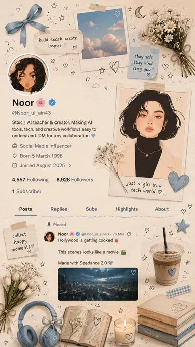

用柔和的米色和淡蓝色调，创作一个极具美感的 Pinterest 风格剪贴簿拼贴画。请使用提供的 X/Twitter 主页截图和动漫头像作为主要元素。将它们摆成梦幻般的俏皮情绪板布局，配有宝丽来相框、蓬松云朵照片、蓝色缎带蝴蝶结、白色郁金香、满天星花朵、书籍、美感蜡烛、冰咖啡、蓝色耳机、手写便签、涂鸦爱心、星星、月亮、花朵和闪光点。加上一些可爱的励志名言，比如“建造。教。创造。“激励”和“只是科技世界中♡的一个女孩”。柔软的纸质质感，撕裂的胶带片段，复古日记的美学，干净的构图，女性化且温馨的氛围，高度细致且逼真的剪贴簿材料，细腻的阴影，柔和的色彩和谐，适合 Instagram 和 Pinterest，高端美学设计，4K 画质。

## 童话版画式图像

| 预览 | 预览 |
| --- | --- |
| 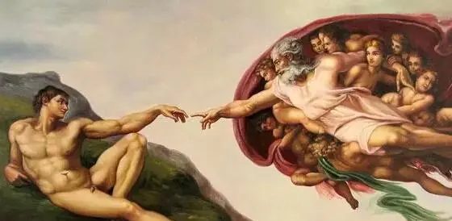 | 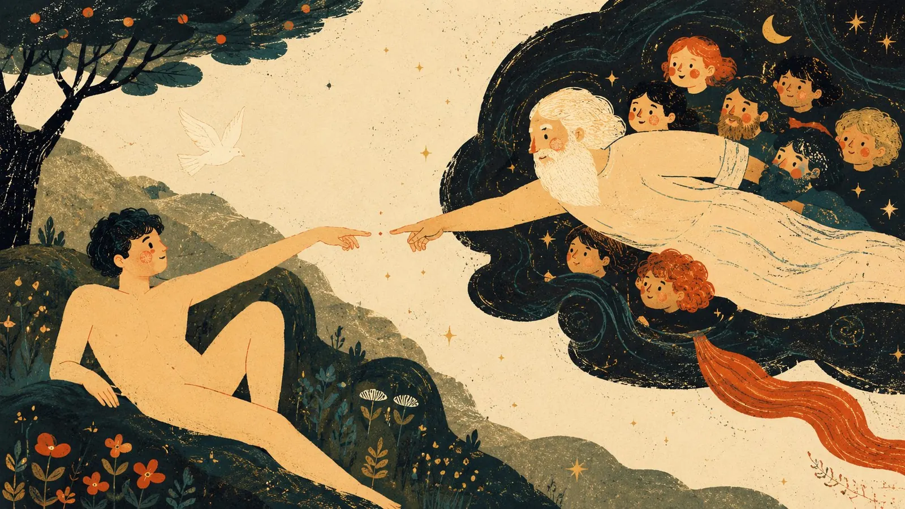 |

以输入图片的主体、动作和空间关系为核心，生成一张童话版画式图像。先从画面内容里提炼一个大面积低明度或高反差结构场，让它成为包裹主体的容器、路径、框架或密度层；主体以图形重绘替代照片式细节，被压缩成一两个清楚的大体块，用钝拙的剪影、略夸张的比例和少量关键边缘保留身份、动作、功能和情绪。最重要的信息只以小面积高饱和色块出现，集中在面部、姿态、路径、器物功能点、环境标识或叙事焦点上，并始终被深色结构或浅色负形压住，让画面鲜艳但不平均。背景从输入内容的空间和意义中生长出来，像故事发生的外壳一样切住主体边缘，形成遮挡、裁切、吞没和局部露出的结构叙事。色彩保持三层关系，大面积暗结构色负责重量和边界，适量浅色或留白负责呼吸，小面积高饱和情绪色负责读图路线和故事信号；色相随主题的情绪温度改变，但面积比例和明度秩序保持稳定。采用平面叙事透视，用俯视压缩、侧向移动、正面框架、路径引导、尺度跳跃或边缘裁切组织阅读，空间呈现绘本页面式平面层级。线条只在功能、路径、边界、纹理和识别处出现，保持稀疏、手绘、略不准的细线；所有色块保持平面，但边缘带干刷、颗粒、飞白、纸纹、喷点和轻微套印错位，像丝网印刷与粉蜡笔共同完成的手工图像。若需要文字，让文字成为画面里的小标识、物体面板或边缘注释，字形圆钝、粗细略不均、密度低，服从图形结构。整体保持低细节高识别、暗场包裹亮色信号、可爱叙事与厚重版画并存的同一作者语言。

## 梦幻的美学剪贴簿拼贴画

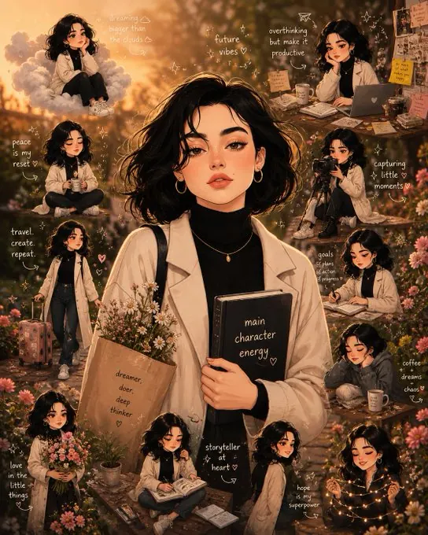

以上传女孩的肖像作为主角，创作一个高度细致梦幻的美学剪贴簿拼贴画。保留她的五官，短黑色波浪波波头、柔和雀斑、棕色眼睛、金色圈耳环、黑色高领毛衣和米色大衣。在中央放置一幅大型写实肖像，手持一本黑色日记，手写“主角能量”。

用多个可爱的 Q 版/卡通形象围绕她，场景不同：坐在云朵上做梦、用笔记本电脑工作、在笔记本上写目标、用相机拍照、安静地喝咖啡、带着粉色行李箱旅行、抱着鲜花、读书、绘画，以及用小彩灯微笑。在拼贴画中添加手写涂鸦、星星、爱心、闪光点、箭头、美学笔记、便利贴和励志名言。

背景：黄金时段的魔幻花园，温暖的夕阳余晖，电影化的散景灯，温馨的乡村氛围，柔和的花朵，梦幻般的景深。超细致的数字绘画，奇幻的故事书风格，柔和温暖的灯光，奇幻写实，Pinterest 美学，适合 Instagram 的愿景板，高度细致的面部，8K 画质，杰作，鲜艳色彩，魔幻氛围，优雅的女性能量。

## 纸本线描视觉作品

| 预览 | 预览 | 预览 | 预览 |
| --- | --- | --- | --- |
| 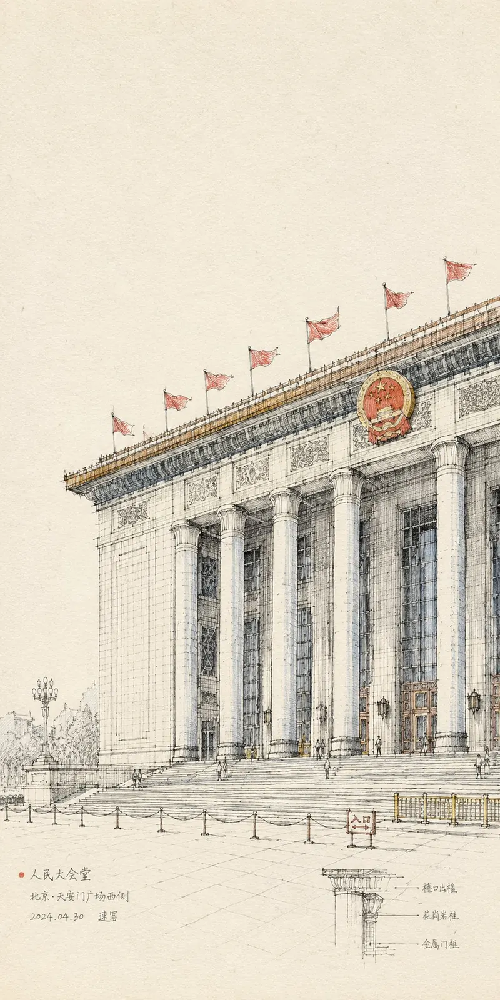 | 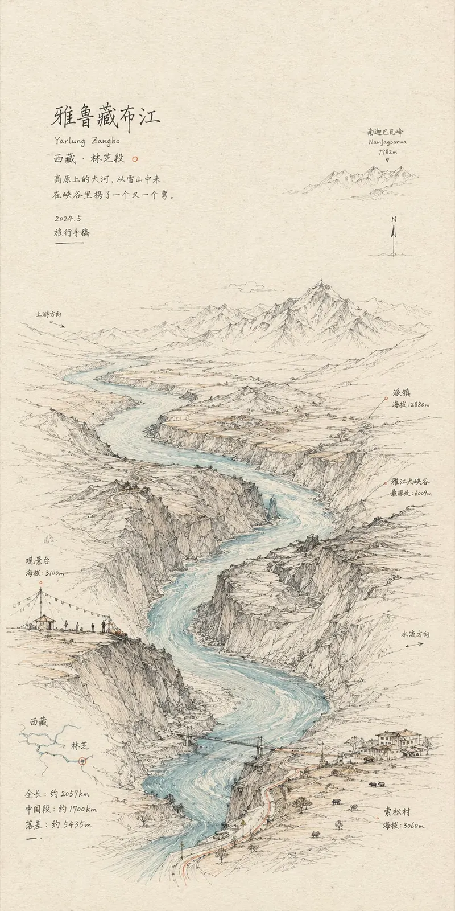 | 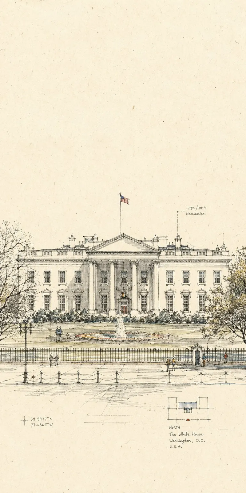 | 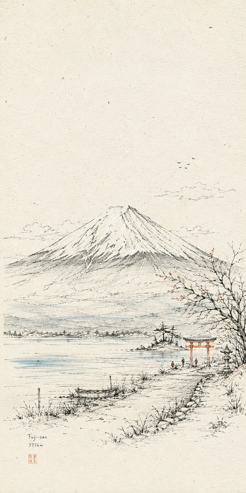 |

围绕具体主题内容生成一张纸本线描视觉作品，画面先由极细、略带手绘抖动的线条建立空间、主体轮廓、结构转折、路径和尺度关系，再让少数高纯度色面只进入最关键的识别平面、连接节点、情绪停顿和信息重心；色彩不是完整上色，而是像精确批注一样编辑注意力。整体以温暖米白纸场和黑色细线为最大视觉面积，纸纹、微小斑点和轻微扫描感要清晰存在，上方或外围保留充足空白，让主体像被放进一页旅行手稿中被观察。主要视觉重量收束在画面中部或中下部，主体周围保持可呼吸的纸面距离，构图由一个清晰锚点、低密度环境层和少量彩色节点组成。核心对象保持可识别的结构线、轮廓边缘、局部排线和压缩细节，先把主题拆成边缘、平面、路径、节点、尺度标记和语义环境，再决定哪些部位允许被色彩激活；非关键区域交给纸色和线稿，不做平均填色。细节沿结构边缘、开口、转角、连接处和运动路径聚集，开放区域保持纸面放空，线条方向服从对象语义，流动处用稳定平行线场，暗部用竖向或交叉排线，脆弱边缘用短促断线。体积、阴影和材质通过细排线、交叉线、平行线场和线密度变化完成，线条压在色面之上，色块边缘带轻微手工错位和纸纹渗透感。背景由主题自身的空间或信息环境生成，但只能作为低密度线稿记忆层出现，用轻轮廓、远近关系、稀疏标记和少量排线说明地点、时间、尺度或语义压力，背景比主体更轻、更少色、更低对比。色彩保持受控的冷暖角色分工：纸色与黑线压住全局，少量冷结构色建立空间和秩序，少量暖记忆色点亮入口、转折和情绪，最亮色只作为稀疏小节点停顿；当主题改变时，色相跟随主题语义微调，但面积层级、饱和集中、冷暖分工和点状高光必须稳定。画面中加入极小的人物、器物、符号或功能标记作为尺度噪点，用几笔线和点状色彩表现，使空间产生使用痕迹和生活温度，这些标记应小到只改变节奏而不成为主角。若需要文字，使用细窄、克制、低干扰的注记式字形，像建筑草图边注一样参与边界、路径和信息层级，保持留白完整。最终表面呈现钢笔线描、彩色铅笔或薄墨套色、细线压色、轻微套色偏差、纸纤维、扫描颗粒和手绘透视误差的完成度，既有准确结构，又有安静、开放、带现场记忆的手工质感。

本次主题：人民大会堂特写

比例1:2

用途： 手机壁纸

动漫×街头风插画

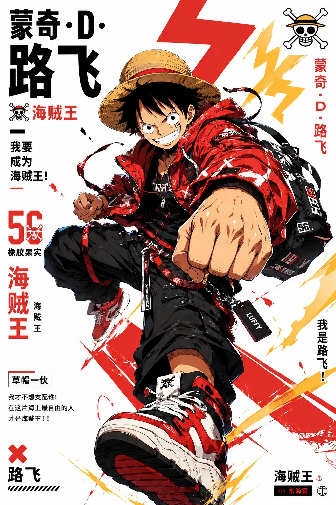

为{character_name}来自{franchise}创建风格化插画。

角色分析：

基于正典设定推导核心人格原型（如英雄、冷静、神秘、好斗）。

确定原始设计的标志色作为视觉主色调。

姿态与肢体语言：

英雄型：动感姿态、宽阔站姿、爆炸式运动

冷静型：平衡、放松姿势、最少运动

神秘型：低姿态、细微动作、锐利隐晦眼神

好斗型：前倾攻击姿势、明显张力、紧握拳头

面部表情：

精确匹配角色个性和情感基调。

艺术风格：

动漫×街头风×海报混合

干净线条、半扁平着色、高对比度

现代、极简、视觉冲击强

构图：

竖版格式({aspect_ratio})

主体偏离中心

强对角线视觉流

分层深度营造动感海报感

服装设计：

将原始服装重新想象为现代街头/科技服饰

保留可识别的角色身份元素

色彩调色板：

干净白色背景为主

标志色为主要亮点

添加补色或类似色调

调色板极简、大胆、高对比

背景：

抽象几何海报布局

有效利用负空间

融合角色色彩主题细微亮点

效果：

能量笔触、漆线、运动强调

效果应遵循角色能量和色彩身份

光影：

锐利方向光

清晰阴影

用标志色微妙发光

渲染质量：

超洁净矢量风格

## 海报级构图

## 4K分辨率、高细节

## 收藏艺术玩具美学

| 预览 | 预览 |
| --- | --- |
| 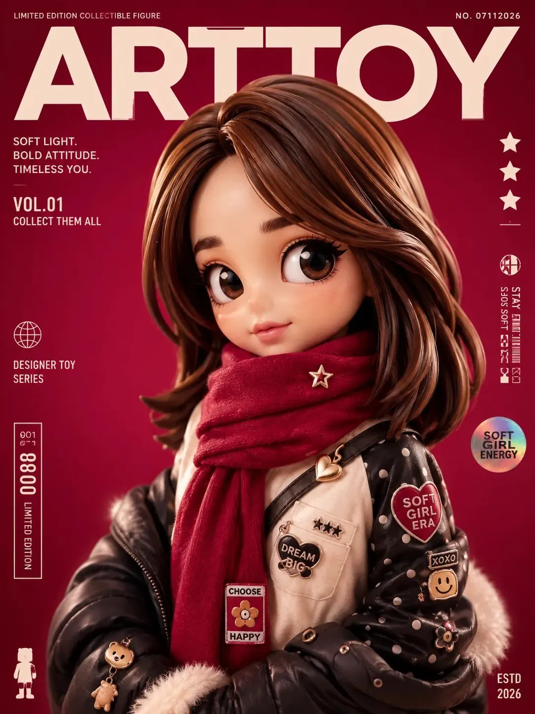 | 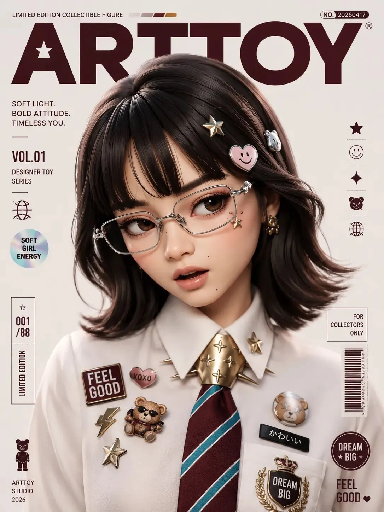 |

将输入图像转变为高端设计师收藏艺术玩具美学。保留主体的身份、姿势、构图和关键特征，但将所有内容重新诠释为高度细致的风格化乙烯基/树脂角色。 特点：可爱又精致的设计师玩具比例 大而富有表现力的眼睛带着细微的侧目态度 光滑抛光的皮肤和柔和的面部雕塑 高端 3D 渲染质量 超细致的材质和纹理 柔和的环境全局光照 工作室级光影配柔和光晕 略显夸张的面部比例 干净的玩具般表面处理 高级收藏手办外观 造型：添加俏皮的图形贴纸， 与主题个性相匹配的别针、补丁、吊饰、贴花 装饰细节应当感觉是精心策划和收藏品，而非随意 时尚和服饰应保持原始形象灵感，但提升为设计师玩具美学 丰富层次的材料如针织面料、光泽塑料、搪瓷别针、刺绣补丁、金属首饰和柔软纺织品 细腻的雀斑、质感细节，以及微表面瑕疵以求真实感 构图：居中肖像框架 杂志封面呈现 大胆超大字体 现代编辑版面 极简几何界面元素 限量版收藏包装设计语言 干净的视觉层级 奢华街头服饰玩具品牌美学 色彩系统：从服装中提取主导色彩 使用该颜色作为主要背景渐变 创造背景与衣橱之间的单色和谐 添加小的互补通过贴纸和配件点缀色彩 鲜艳但统一的调色板 渲染：超细致的 3D 角色渲染 Octane/Redshift/Cinema4D 质量 清晰对焦 高对比度 柔和景深 商业玩具摄影 奢侈品收藏照片 高级设计师艺术玩具美学 当代街头文化收藏品设计

## 中国名楼线描图鉴

| 预览 | 预览 | 预览 | 预览 |
| --- | --- | --- | --- |
| 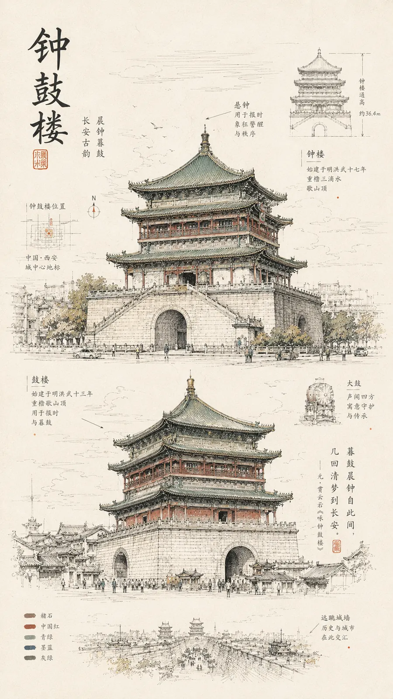 | 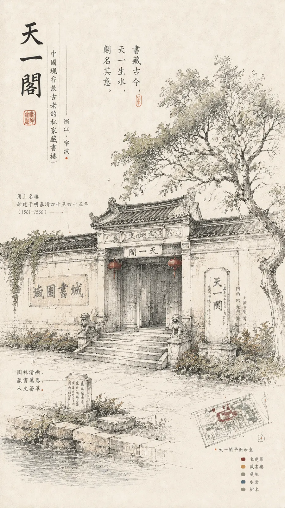 | 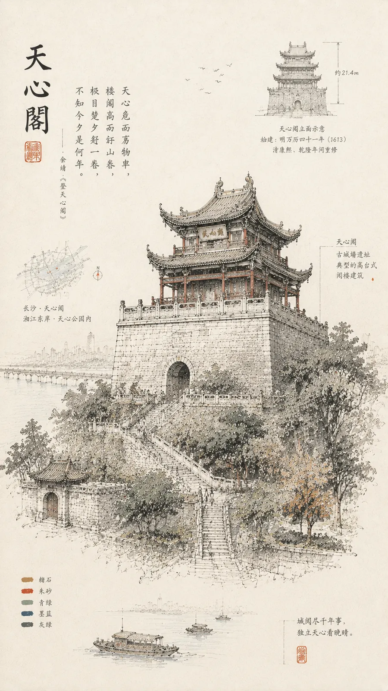 | 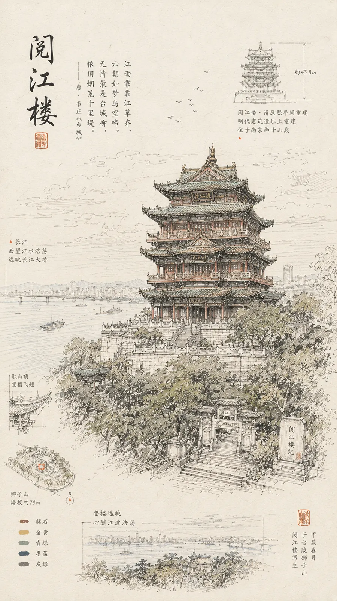 |
| 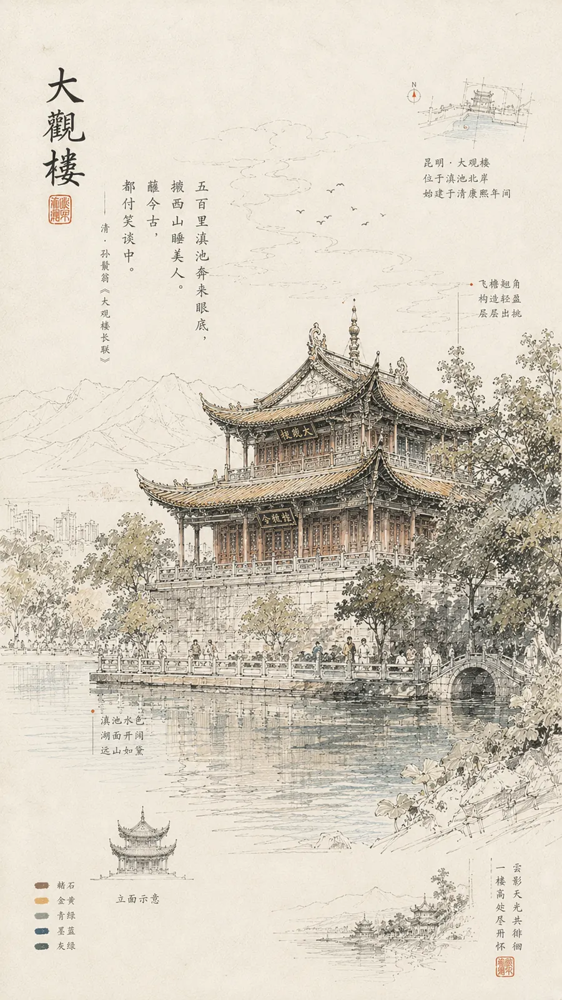 | 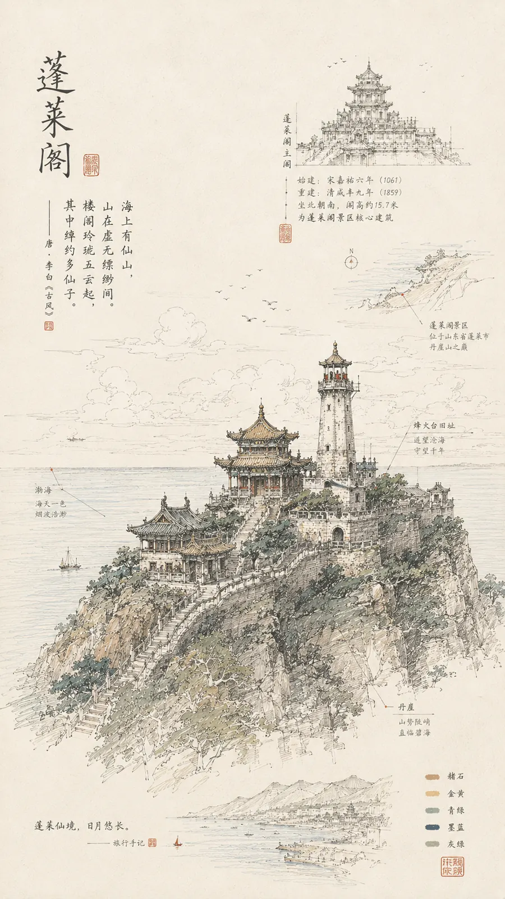 | 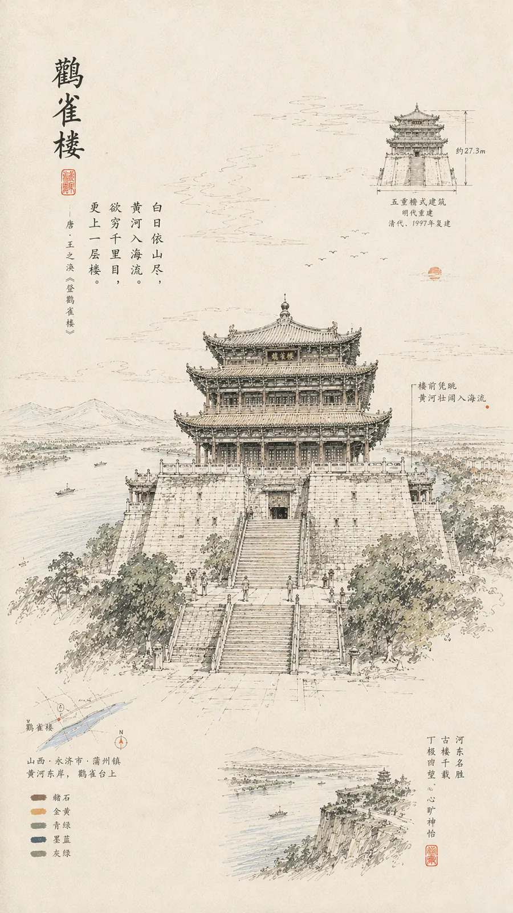 | 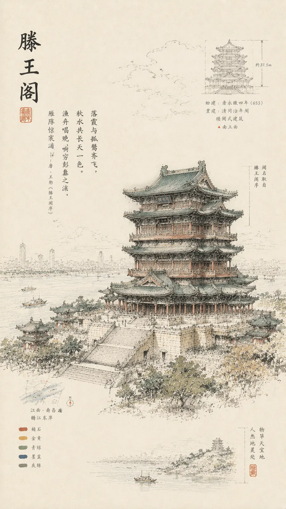 |
| 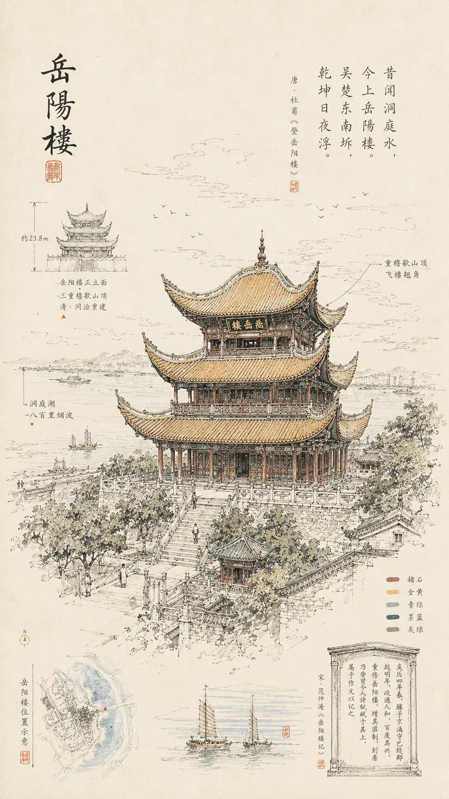 | 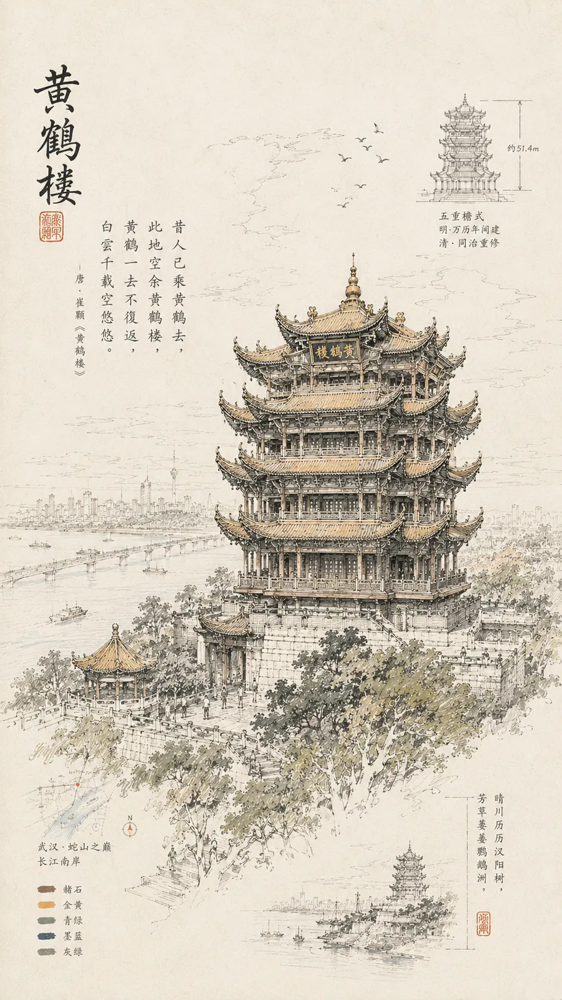 |  |  |

Plain Texta一、主题内容主题：【黄鹤楼】用途：手机壁纸文旅海报收藏插画文化视觉作品比例：9:16 竖版构图二、整体视觉风格围绕主题生成一张纸本线描视觉作品。整体采用：钢笔线描风格建筑手稿风格旅行笔记风格纸本插画风格文艺出版物美学博物馆图录风格复古印刷美学诗意留白构图画面呈现安静、克制、耐看的艺术气质。三、主体表现主体作为画面核心视觉。使用：极细黑色线条轻微手绘抖动感精准结构轮廓细密排线细节构建：轮廓关系建筑结构光影转折空间层次保持主体高度可识别。细节集中于：边缘转角开口结构连接处非重点区域适当简化。四、色彩系统整体以纸色与线稿为主。色彩仅用于：视觉焦点重要结构情绪入口光影停顿采用：赭石色中国红青绿色墨蓝色金黄色灰绿色少量点缀。避免大面积上色。五、背景处理背景仅作为环境记忆层。使用：稀疏线稿轻轮廓极简空间关系少量排线表现：天空云层山体树木城市环境周边建筑背景比主体更轻、更淡、更少色彩。保留大量留白。六、光影与质感通过线条密度塑造：体积阴影材质使用：平行排线交叉排线疏密变化表现空间层次。整体具有：纸张纤维质感扫描颗粒感轻微套色误差手工绘制痕迹呈现真实纸本艺术品效果。七、诗词与文字系统根据主题内容，自动匹配最相关的古诗词。优先选择：古诗古词名句若无合适诗词，则自动生成两句符合主题意境的短句。文字要求：小尺寸排版毛笔手写风细窄字体低干扰布局自然融入留白区域。如同画卷题跋。增强文化氛围与诗意表达。八、画面氛围整体呈现：安静感诗意感留白感历史感人文感收藏级质感仿佛一本旅行手稿中的珍贵页面。具有：东方审美文旅视觉气质出版物插画品质艺术壁纸观感九、最终强化词纸本线描艺术钢笔建筑手稿细线描绘纸张纹理复古印刷质感诗意留白少量点彩古诗题跋东方美学文旅插画博物馆图录风格旅行手稿风格高级艺术壁纸超精细细节高品质构图收藏级视觉作品8K超清画质

## 凌乱打圈线条轮廓风宠物插画

| 预览 | 预览 | 预览 | 预览 |
| --- | --- | --- | --- |
| 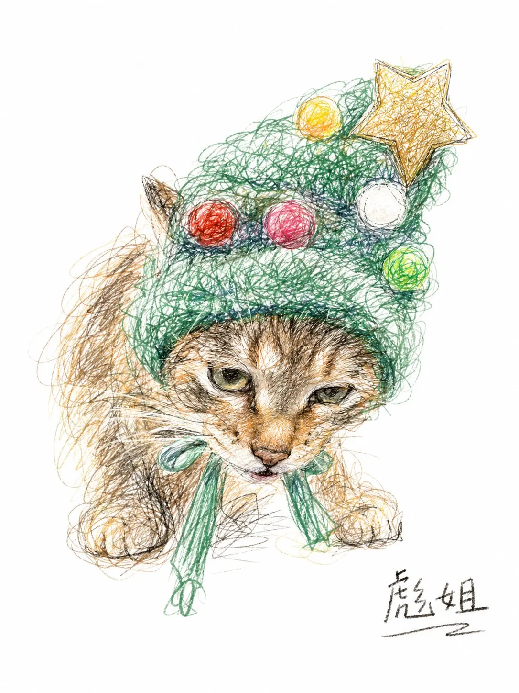 | 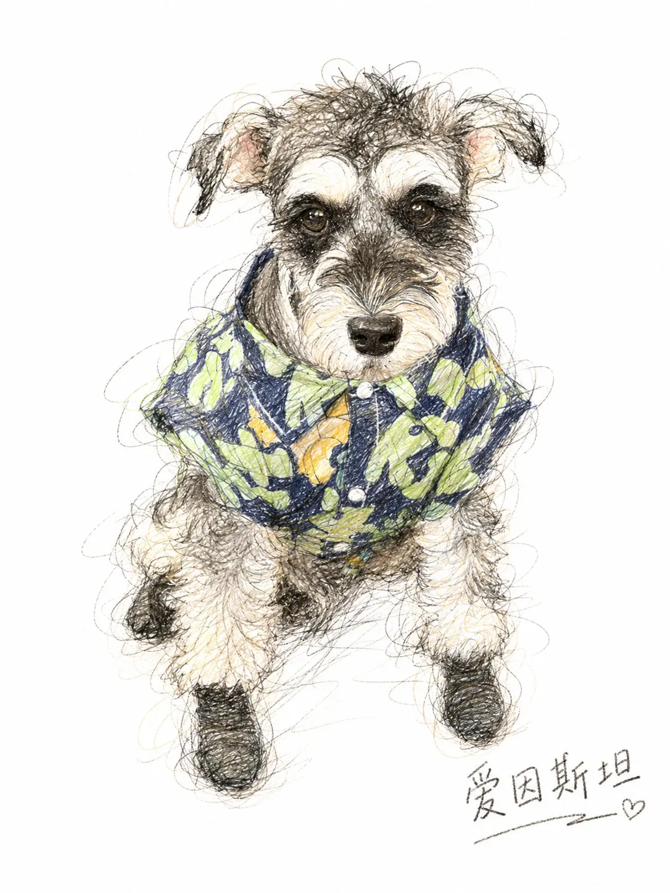 | 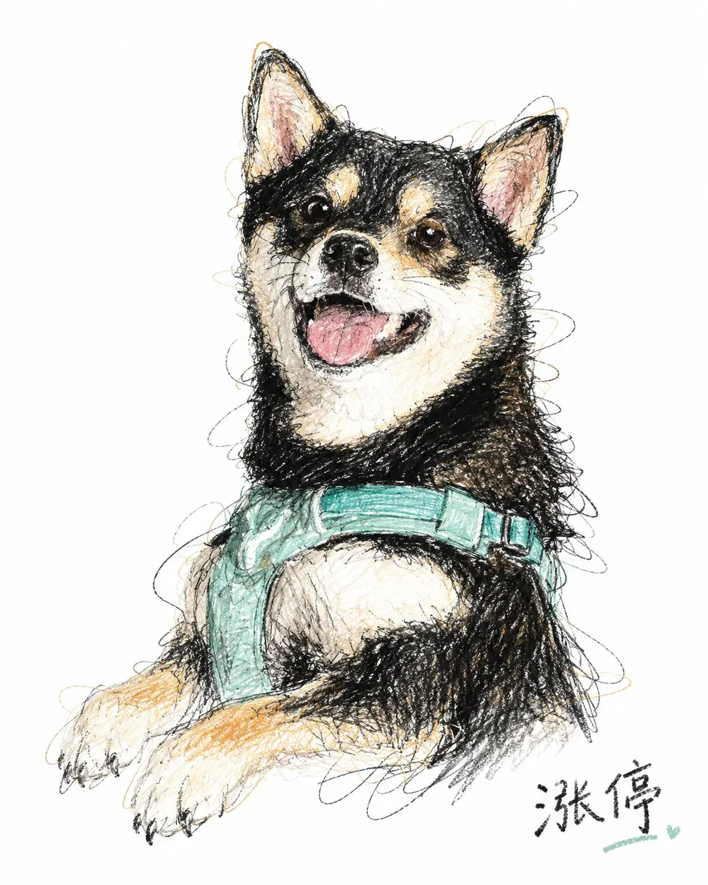 | 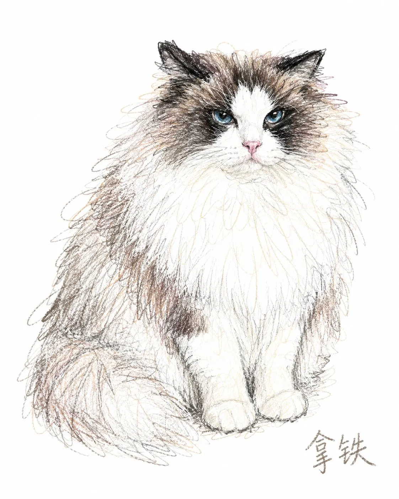 |

Plain Text请根据我上传的宠物照片，创作一张「凌乱打圈线条轮廓风宠物插画」。整体风格要求：只保留宠物主体，不要背景、不要家具、不要室内环境、不要道具杂物。画面为干净白底，主体居中或略偏中，保留充足留白。插画风格：使用蜡笔 / 彩铅 / 粗略手绘质感。线条必须是凌乱、潦草、打圈式的轮廓线，不要干净工整的描边。轮廓由大量松散、重复、轻微错位的线条组成，像随手画出的草稿线。颜色不要铺得太实，不要完整填色。颜色只用零散、轻薄、跳跃的笔触表现毛色、眼睛、鼻子、舌头、耳朵、爪垫等特征。要让大量白色纸面自然露出来，形成轻盈、透气、未完成感。主体要求：必须准确保留照片中宠物的核心特征，包括：宠物品种/体型/毛量/耳朵形状/脸型/眼神/毛色分布/标志性动作。如果照片中有张嘴、吐舌、抬爪、趴着、坐着、尾巴姿态等明显动作，需要保留。整体要像宠物本人，而不是泛泛的卡通动物。色彩要求：根据照片真实毛色进行轻量表达。黑色、灰色、棕色、白色、奶油色等毛色用凌乱线条和稀疏色块表现。眼睛、鼻子、舌头、耳朵内侧、爪垫等局部可以用更明确的颜色点亮。颜色必须松散、凌乱、有手绘痕迹，不要厚涂，不要油画感，不要写实填满。构图要求：宠物主体完整、清晰、有识别度。可以适度夸张宠物最可爱的特征，比如大眼睛、蓬松毛、耳朵、舌头、爪子。整体像一张高级宠物手绘签名头像，干净、可爱、有纪念感。文字要求：在右下角添加宠物名字：{{宠物名}}名字使用手写感字体，像铅笔或蜡笔随手签名。文字不要太大，不要抢主体。文字颜色以深灰、黑色或与宠物局部颜色呼应的淡色为主。可以加一条很随意的短下划线，但不要装饰过多。画幅比例：{{画幅比例，例如 4:5 / 1:1 / 3:4}}禁止：不要真实摄影风。不要厚重涂色。不要背景场景。不要复杂装饰。不要卡通贴纸感。不要矢量扁平风。不要过度精修。不要把颜色铺满。不要让线条太干净。不要把宠物画成完全不同的动物。

手工 3D 立体旅行插画

| 预览 | 预览 | 预览 | 预览 |
| --- | --- | --- | --- |
| 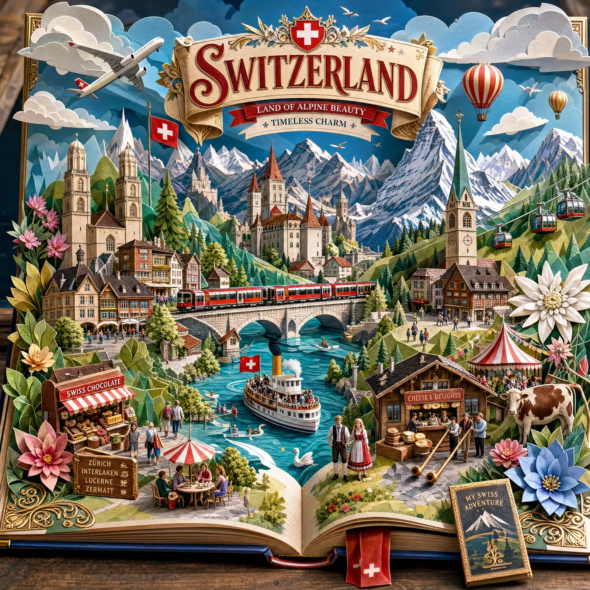 | 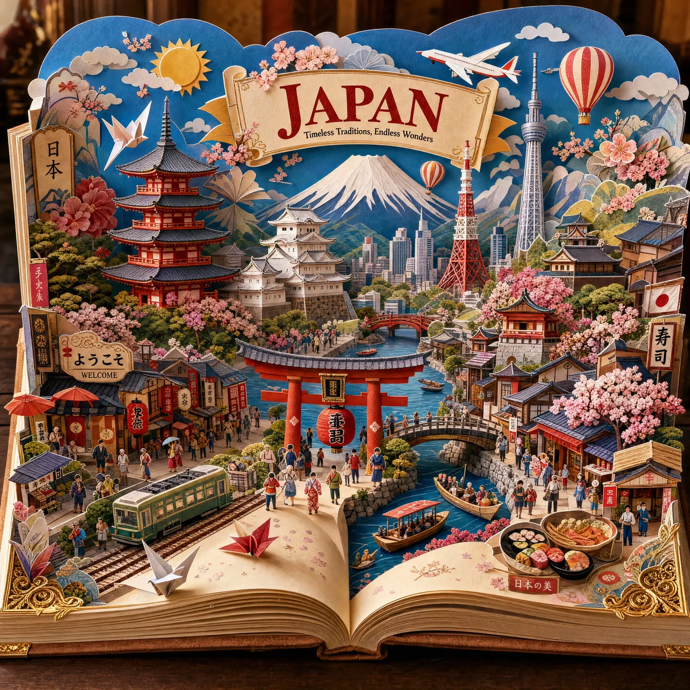 | 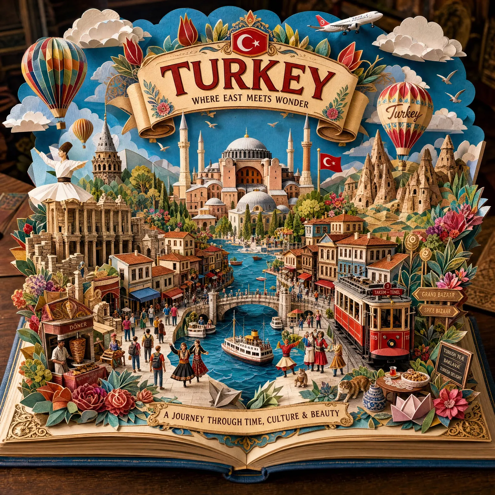 | 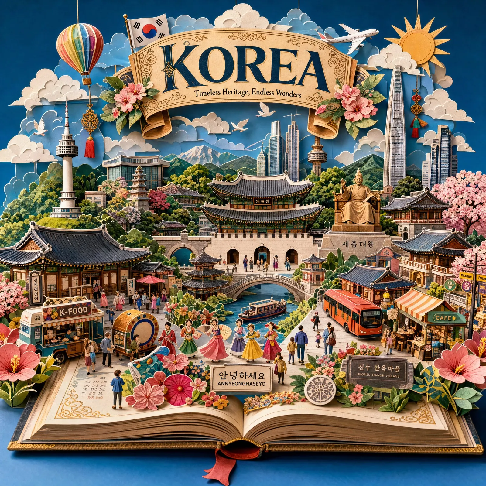 |

创作一幅超精细的手工 3D 立体立体故事书旅行插画，描绘[目的地]，并将其呈现在一本精美打开的复古书籍中。

场景应该看起来像一本高级收藏级的纸质立体书，整个目的地以层叠的微型立体模型形式从书页中升起。

## 风格

超精细的纸艺工艺 * 精巧的层叠剪纸结构 * 童话般的奇幻美学 * 鲜艳的旅行海报色彩 * 手工打造的微缩世界 * 高级儿童绘本插画 * 高度精细的3D立体弹出设计 * 奇幻、魔幻、温馨的氛围 * 清晰的焦点，博物馆级别的工艺 * 超逼真的纸张纹理 * 专业的旅行海报构图

作品

打开的书占据了整个画面。

页面中浮现出一个大型装饰性标题横幅，上面显示：

“[目的地]” “[标语]”

目的地展现出一个浓缩的微缩世界，其中包含：

最著名的地标 * 历史建筑 * 文化地标 * 传统街道 * 桥梁 * 河流 * 当地交通 * 本地花草树木 * 当地美食摊位和咖啡馆 * 观光游客 * 季节性装饰 * 当地野生动物 * 当地节日和传统

书页上的一切都应该像层叠的纸张结构一样自然地呈现出来。

背景

层叠纸制成的湛蓝天空 * 蓬松的纸云 * 飞行中的飞机 * 热气球 * 飞鸟 * 装饰性的纸太阳 * 漂浮的文化饰品

前景细节

小人自然互动 * 微缩市场 * 小船 * 当地商店 * 传统服饰 * 装饰花朵倾泻而下，点缀书页 * 饰以金色点缀的优雅书角 * 折纸装饰 * 复古旅行书美学

灯光

柔和的日光 * 温暖明快的氛围 * 纸张层间微妙的阴影层次 * 高度立体感 * 丰富的色彩对比

质量

超精细、杰作、8K、专业旅行插画、收藏级立体书、纸质立体模型、多层纸艺、神奇故事书世界、精巧的微缩建筑、奇幻旅游海报、沉浸式手工设计。

## 东方青绿色系插画

| 预览 | 预览 | 预览 | 预览 |
| --- | --- | --- | --- |
| 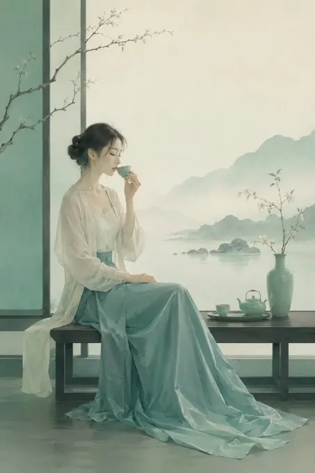 | 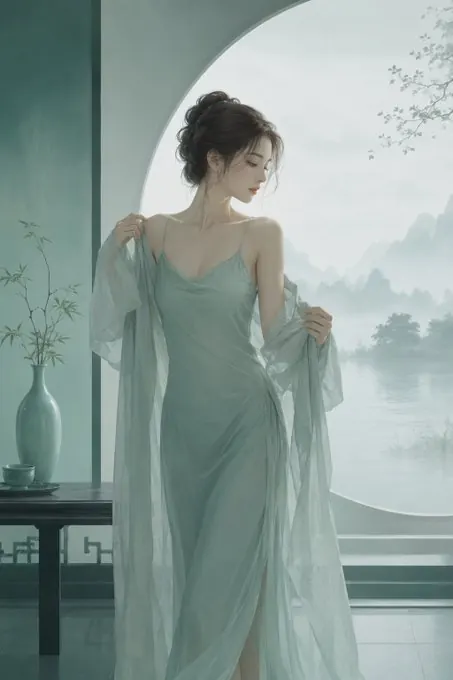 | 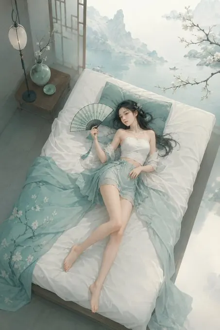 | 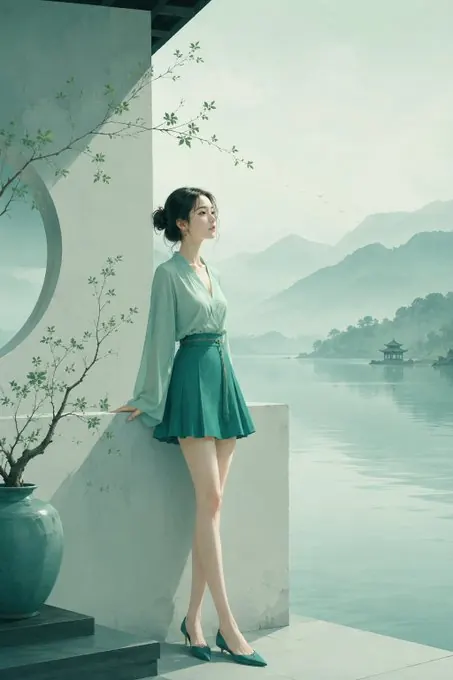 |

是东方青绿色系插画。 千年的国色，柔和的中式美学。 山色凝云，暮雨苍葭，最富诗意的颜色。 提示词：极简东方禅意半写实插画，主体为【xxx】，青绿色体系，桥梁对比，画面空灵静谧，大面积留白，带轻雾感、静止的空气感和朦胧远景层次，可结合极简空间、湖面、远山、器物、枝条等东方意境象。柔和漫射光，边缘洁净柔和，整体安静、克制、清冷、诗意。若有人物，须为半写实插画，若有正面或顶部，背影，则修长，神情平静，服装流畅。无文字，无水印，无摄影感，无3D感。

## 贴纸拼贴杂志封面风插画

| 预览 | 预览 |
| --- | --- |
| 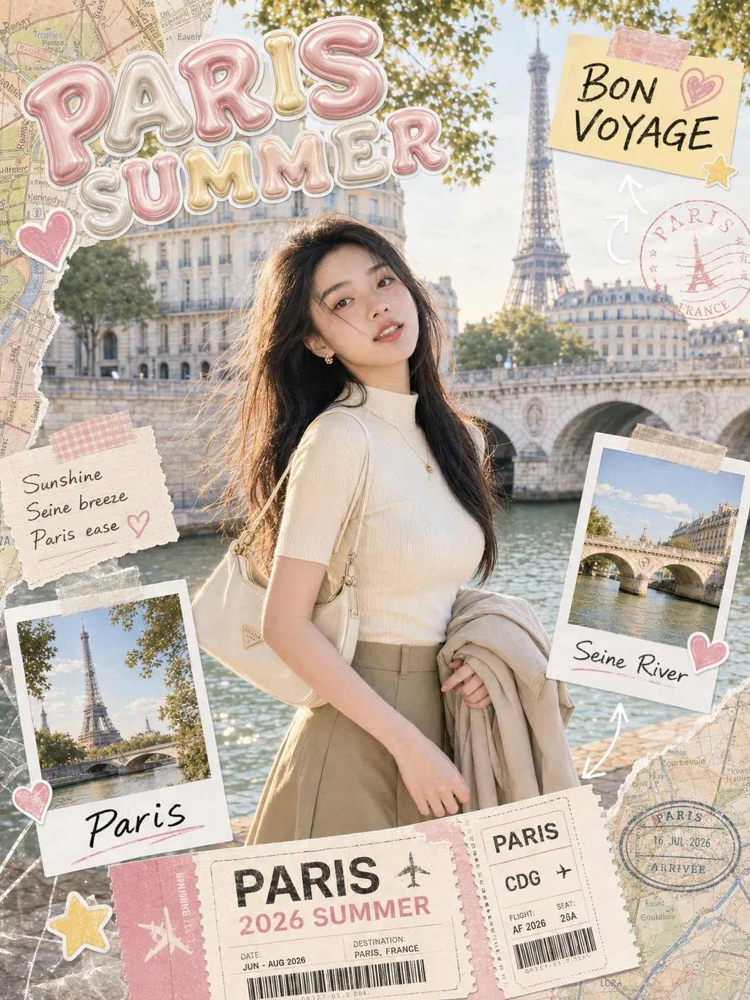 |  |

｛Y2K旅行手账海报风、贴纸拼贴杂志封面风插画，3:4竖版。画面主体是一位22-26岁中国年轻时尚女性，冷白皮，甜酷都市旅行感，鹅蛋脸，黑色长发微乱，头微仰直视镜头，眉毛微张，像朋友用iPhone随手抓拍。穿奶油米白高领中袖针织衫，浅卡其高腰A字短裙，奶油白单肩腋下包，手臂搭浅米色裙子，细金色项链和小金耳环。 人物左侧45度侧站，位于画面中间偏，半身到背构图，困倦清晰。背景为透亮浅色调巴黎塞纳河夏日场景：浅奶油色巴黎建筑、远身体埃菲尔塔、浅翡翠绿色河水、浅灰白石拱桥、树影和欧式河岸建筑。夕阳从左视角俯视，人物头发、近处、手臂、包包和裙边有浅金铁白色透明。 SUMMER”，浅粉+奶黄+珍珠白glossy 3D泡泡字。右上角浅黄色便利贴写“BON VOYAGE”。左下角巴黎拍立得写“巴黎”。右中部塞纳河石桥拍立得写“塞纳河”。底部旅行大概写“巴黎”“2026” SUMMER”并带花瓣。边缘扩展浅粉爱心、奶白色箭头、邮阶段、地图颗粒、半透明胶带。整体浅色、清透夏日、高级旅行日记封面感，纸张纹理、纸张颗粒、贴纸高光、拍立得白边。不要多人，不要儿童，不要欧美明星，不要背景，不要暗绿河水，不要乱码文字，不要贴脸，不要包包消失，不要套筒消失，不要背景手指轮廓，不要割裂。 3:4｝ 几乎没有区别的生图

## 漫画与现实融合插画

| 预览 | 预览 | 预览 |
| --- | --- | --- |
| 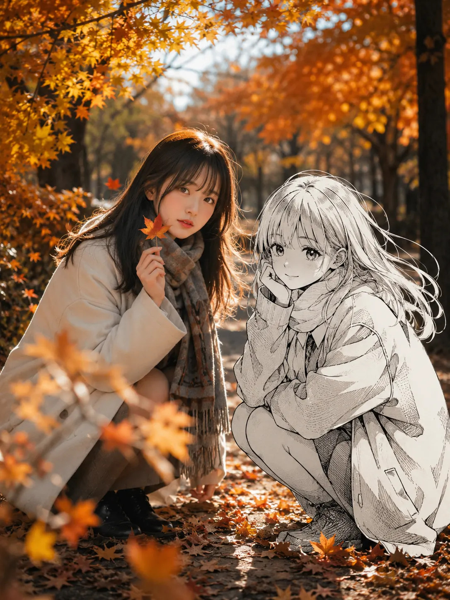 |  |  |

| 预览 | 预览 | 预览 | 预览 |
| --- | --- | --- | --- |
|  |  |  |  |

一张[现实世界地点]在[季节]的超写实照片，包含[环境细节]、电影级景深、自然光照和极致写实的细节。一幅[角色]的二维黑白漫画插图无缝融入场景，以干净的墨线、交叉阴影和富有表现力的面部特征绘制而成，不使用任何颜色。现实世界的光线、阴影和前景元素与二维角色自然互动，营造出逼真的景深，并在漫画线条和照片级写实环境之间形成强烈的对比。

复古爵士乐专辑封面

| 预览 | 预览 | 预览 | 预览 |
| --- | --- | --- | --- |
|  |  |  |  |

| 预览 | 预览 | 预览 | 预览 |
| --- | --- | --- | --- |
|  |  |  |  |

角色：【漩涡鸣人】

角色来源：【火影忍者】

画布尺寸：【3：4】

风格：流派：复古爵士乐专辑封面 Blue Note Records 灵感源自 1970 年代黑胶封面动漫人物肖像

氛围：精致的电影感、怀旧的深夜爵士乐、高级的、忧郁的氛围

品质：超精细的杰作，干净的插画，专业的专辑封面设计，线条锐利，无噪点，无胶片颗粒，无纹理叠加，无灰尘，无划痕。

构图：方形专辑封面，人物占据画面60%的面积；字体融入布局；左侧为唱片公司品牌标识和曲目列表；立体声标志；黑胶唱片美学

灯光：电影级灯光、柔和阴影、温暖的实景灯光、逼真的反射、立体氛围

颜色：有限的调色板，爵士俱乐部色调，深黑色、深海军蓝、琥珀色、金色、暖橙色、柔和奶油色

字体设计：巨型标题，优雅的衬线字体，复古唱片标签布局，简洁的平面设计

负面：模糊、低质量、胶片颗粒感强、噪点严重、水印、JPEG伪影、构图混乱、手部变形、多余手指

## 中国城市「国旗微缩景观」

| 预览 | 预览 | 预览 | 预览 |
| --- | --- | --- | --- |
|  |  |  |  |

ABAP中国城市「国旗微缩景观」通用提示词模板一、用户只需要输入城市名称：【 太原】核心标志建筑：【晋祠】二、AI 自动理解与补全规则请根据用户输入的【城市名称】和【核心标志建筑】，自动分析并合理补全以下内容：该城市最具代表性的城市气质与该地标适配的辅助建筑群该城市典型的自然地貌特征（如江河、湖泊、海岸、山丘、台阶、平原等）与城市文化匹配的传统元素（如石桥、灯笼、游船、园林、街巷、古建符号等）与城市发展匹配的现代元素（如摩天楼、城市天际线、地标建筑群、科技感建筑等）适合该城市的微缩人物活动场景（散步、观光、拍照、乘船、赏景等）整体画面的色彩倾向、空间层次和氛围表达要求自动做到：核心标志建筑必须作为画面中心主角其他建筑只能作为辅助，不可喧宾夺主不要机械堆砌建筑，要有主次和层次让画面既有民族符号感，又有城市旅游海报感保持中国国旗丝绸地貌这一核心创意不变三、通用完整提示词（可直接复制使用）请根据用户输入的【城市名称】与【核心标志建筑】，创作一幅超精细的中国城市主题微缩景观作品。整幅画面要巧妙融入一面巨大的飘逸中国国旗之中，并以电影级移轴微缩摄影风格呈现。画面核心设定巨大的中国国旗以红色丝绸面料铺展整个画面，丝绸自然起伏，形成如山丘、山谷、坡地般的微缩地貌。背景带有柔和虚化效果，并点缀若隐若现的金色五角星元素，营造出庄重而梦幻的氛围。在画面中心，矗立用户指定的**【核心标志建筑】，作为整个微缩世界的视觉焦点。该建筑必须以超高精度微缩模型**形式呈现，充分体现其结构特征、轮廓辨识度与城市象征意义。其周围围绕精致的道路、石阶、平台、绿地、广场或街区空间，并点缀微缩游客与城市生活场景。城市扩展内容请根据【城市名称】自动补充与之匹配的：代表性辅助建筑标志性城市天际线当地传统文化符号自然地形与水体元素旅游氛围场景如果该城市具有代表性的河流、湖泊、海湾、水道或湿地，请自然融入一条蜿蜒的蓝色水系，并根据城市气质加入传统石桥、现代桥梁、小船、游船或滨水步道等元素。如果该城市具有鲜明的山地、高差、坡道、古街、园林、城墙、台阶或历史街区特征，也应自然体现在丝绸微缩地形之中。如果该城市拥有突出的现代城市感，则应在远处或周边加入精致的现代摩天楼群、地标塔楼或未来感建筑，形成传统与现代并存的和谐画面。人物与氛围加入许多微缩小人物，在道路、桥梁、建筑周围和观景区域中活动，例如：散步拍照观景乘船游览驻足欣赏道路两侧可布置温暖的灯笼、路灯或节庆照明，强化梦幻、温暖、富有旅游吸引力的城市氛围。视觉风格与镜头语言整体采用：略微抬高的俯视角度电影级移轴摄影风格浅景深选择性对焦柔和散景逼真的微缩模型质感超真实丝绸纹理精细建筑工艺温暖金色光线鲜艳但高级的红、蓝、金配色照片级微缩世界质感高端旅游海报美学8K 超高细节震撼视觉冲击力电影叙事感与民族自豪感兼具最终目标让整幅作品呈现出一种将：中国国旗象征城市地标传统文化现代建筑旅游氛围民族情感完美融合的视觉效果。画面必须精致、震撼、梦幻、庄重，像一张超高端中国城市文旅微缩海报。四、极简版模板（适合你后续批量直接使用）你也可以直接保存这个更短的版本：请根据用户输入的【城市名称】和【核心标志建筑】，生成一幅中国城市主题的微缩景观海报。整幅画面巧妙融入一面巨大的飘逸中国国旗之中，红色丝绸形成起伏山丘与山谷，背景虚化并点缀金色五角星。用户指定的【核心标志建筑】作为画面中心主角，以超精细微缩模型形式呈现；周围自动补充该城市的代表性辅助地标、现代天际线、传统文化元素、道路、水系、桥梁和旅游场景。加入微缩游客、灯笼照明、小船、广场、街区或观景空间，形成兼具中国传统文化、现代城市气质、旅游海报感与民族自豪感的梦幻画面。采用略微抬高视角、移轴摄影、浅景深、选择性对焦、柔和散景、逼真丝绸纹理、超真实微缩工艺、温暖金色光线、鲜艳高级的红蓝金色彩、8K 超高细节、电影叙事感与震撼视觉冲击力。

## 街头涂鸦壁画

| 预览 | 预览 |
| --- | --- |
|  |  |

| 预览 | 预览 |
| --- | --- |
|  |  |

一张超写实的全景街头照片，展现了拉丁美洲某城市一面巨大的混凝土墙上的一幅巨型动漫涂鸦壁画。天空湛蓝，阳光强烈，喷漆色彩鲜艳饱和，黑色轮廓粗犷，墙面纹理逼真。照片采用24毫米广角纪实摄影技术拍摄。壁画以动感十足的动漫涂鸦风格描绘了[角色]。站在壁画前的是一位涂鸦艺术家本人，她将[角色]重新塑造为一位成熟的现实女性，身着她自己设计的都市街头服饰，手持喷漆罐和滚筒，手上和衣服上沾满了颜料。壁画的风格必须与她的脸型、发型、色彩、服饰图案和个性完美契合，让人一眼就能看出这幅巨型动漫壁画是她亲手创作的。构图明亮清晰，近乎全景，营造出地道的拉丁美洲街头艺术氛围。

中文谐音成语手绘小画

| 预览 | 预览 | 预览 | 预览 |
| --- | --- | --- | --- |
|  |  |  |  |

| 预览 | 预览 | 预览 | 预览 |
| --- | --- | --- | --- |
|  |  |  |  |

ABAP中文谐音成语手绘小画｜参考图风格版｜通用生成提示词请生成一张 竖版手绘插画小画。一、用户只需要填写这里主题成语：【如鱼得睡】例如：【如鱼得睡】【心想事橙】【一鹿平安】【莓有烦恼】【马上有钱】【柿柿如意】【蕉个朋友】【好柿发生】二、总任务请围绕用户填写的【主题成语】，生成一张 温暖、幽默、可爱、带一点冷幽默感的中文谐音成语手绘小画。这不是复杂商业插画，也不是精致绘本封面，而是一张：轻松有趣的小画带中文谐音梗趣味有一点幽默和会心一笑的感觉有单页插画 / zine 小画 / 手工卡片感适合小红书、朋友圈、壁纸、卡片、表情图传播三、风格必须参考我提供的示例图（重点）请严格参考我提供的图片风格来执行整体视觉语言，但不要照搬画面内容。风格关键词：米白色粗糙纸张背景黑色手绘线条勾勒线条略有抖动感、粗糙感、手作感彩色部分像 蜡笔 / 油画棒 / 彩铅 / 粉蜡笔 混合上色配色克制，主要使用：黑色米白浅蓝 / 中蓝朱红 / 橘红少量灰色大面积留白画面像手工印刷的小海报有一点童趣，但不是低幼儿童画有一点笨拙、轻松、幽默、自然的质感整体像独立插画师画的小卡片 / 小海报 / 小杂志内页版式参考特点：可以加入 不规则黑色手绘边框可以加入少量 手写英文单词或小标签可以加入简洁的装饰符号：小圆点小短线小涂抹痕迹小纸条小下划线小角标整体版面简洁，不拥挤四、核心生成逻辑（非常重要）你不能只是把用户输入的成语原样写出来。你需要先理解这个成语的 谐音梗、真实来源成语、字面联想 和 适合转译成什么画面，再完成插画设计。你需要自动完成以下步骤：1）理解谐音趣味例如：【如鱼得睡】来自“如鱼得水”，重点转译为“鱼睡得很舒服”【心想事橙】来自“心想事成”，重点转译为“橙子 + 愿望成真”【一鹿平安】来自“一路平安”，重点转译为“小鹿 + 平安感”【莓有烦恼】来自“没有烦恼”，重点转译为“草莓 + 轻松无忧”【柿柿如意】来自“事事如意”，重点转译为“柿子 + 顺利如意”2）自动决定主体根据成语内容，自动判断最适合作为主角的是：一只小动物一个拟人化水果一个拟人化植物一个日常小物件一组简单的小角色互动一个极简但好笑的小情境3）自动增加画面内容除了主角本身，还要补充少量合适的小细节，例如：小道具小纸片小标签小气泡小动作线小水波小叶子小桌面小影子小批注小贴纸感元素这些内容要让画面更完整，但不能堆满。五、画面内容生成规则请根据用户填写的【主题成语】，自动生成一个最适合的幽默小场景。你需要自动决定：主体是什么主体在做什么主体是什么姿态主体表情如何是否需要道具是否需要地面 / 水面 / 桌面 / 小纸片 / 小影子是否加入少量英文辅助词是否加入少量装饰性手写标注画面内容原则：画面必须 一眼就能看懂这个谐音梗主体必须清楚明确整体要简单，但不能太空画面有轻松感和故事感要有一点冷幽默让人看到会想保存六、构图要求画面为 竖版。整体构图参考这种逻辑：主体占画面中心或偏下位置四周保留较多留白周围可以有少量辅助元素可加入手绘黑色边框，增强卡片感画面像一张独立小海报 / 单页小画不做复杂背景，不做大场景透视画面应简洁平衡，阅读轻松七、文字规则画面中必须出现用户填写的【主题成语】。主文字要求：主成语作为画面核心文字可以放在 右侧竖排，也可以根据构图放在上方或左侧字体风格要像 手写字 / 毛笔字 / 手绘标题字文字清晰，不能太花要和画面风格统一辅助文字要求：可以酌情加入 少量手写英文小词，像参考图那样，起到点缀作用。例如：sleep welllittle waveslow dreamtiny napstay calmgrow slow注意：英文只是辅助装饰，不要喧宾夺主不要加太多不要像正规海报文案一样复杂八、色彩要求整体色彩要像参考图一样克制、简洁、轻松。主色建议：米白背景黑色线条浅蓝 / 中蓝橘红 / 朱红少量灰色 / 浅棕色色彩执行原则：颜色不要太多不要高饱和不要荧光色不要渐变科技感不要过度精致上色保留手工涂抹痕迹看起来像手绘材料自然上色九、情绪要求整张图的情绪应根据成语自动判断，但总体方向是：可爱放松轻松安静呆萌会心一笑有一点一本正经的幽默感有一点“冷笑话式温柔”十、示例理解方式（帮助AI理解）如果主题成语是【如鱼得睡】画面可以理解为：一条胖胖的小鱼安稳地躺着睡觉，可以躺在浅浅的水波里，也可以像躺在小枕头上一样漂浮在水面。鱼的身体圆滚滚，表情很安稳，眼睛闭着，嘴边冒出小气泡。身上可以盖一条小被子，或者搭一条画着小鱼图案的小毯子。周围可以有轻轻的水波线、小叶子、小“Zzz”睡眠符号，或一张小纸条写着类似“sleep slow”之类的小英文。整体画面安静、幽默、轻松，像一幅手绘小卡片。画面中写上“如鱼得睡”。如果主题成语是【心想事橙】画面可以理解为：一个圆滚滚的小橙子拟人化地站着或坐着，神情满足，身边围绕一些小星星、小愿望符号、小纸条，表达“愿望实现”的轻松喜悦感。整体像一张有点俏皮的小画。如果主题成语是【一鹿平安】画面可以理解为：一只小鹿安静地站着、散步或回头看，动作温柔，身边点缀小草、小风线、小路或小包裹，传递“平安顺利”的感觉。整体温暖安静。十一、禁止项请不要出现以下问题：不要做成复杂大场景不要做成商业海报不要做成精致3D渲染不要过度写实不要画得太满不要太花哨不要高饱和不要赛博朋克不要强设计海报感不要儿童识字卡式低幼风不要复杂排版不要过度精美到失去手绘拙趣不要让主体过小看不清不要让文字太难认十二、最终输出目标最终请生成一张：竖版手绘插画中文谐音成语主题小画参考我提供图片的风格语言米白粗糙纸张背景黑色手绘线条少量蓝色与红色点缀有边框 / 小卡片 / 小海报感简洁留白温暖、幽默、可爱带一点冷幽默适合收藏与传播

## 儿童故事书风格的手绘插画

| 预览 | 预览 | 预览 | 预览 |
| --- | --- | --- | --- |
|  |  |  |  |

ABAP请将上传的照片 完整转换 成一幅 100%儿童故事书风格的手绘插画。整张画面中的所有人物、动物、植物、背景、装饰元素都必须统一为儿童绘本插画风格，不能保留任何写实摄影感或半写实人脸。一、参考照片的使用方式（非常重要）上传照片 只用于参考以下内容：人物之间的数量关系人物的大致站位 / 亲密关系 / 互动氛围母亲与孩子的动作关系整体构图服装颜色搭配不要保留真实照片质感。不要保留写实五官、真实皮肤纹理、真实光影、真实摄影细节。必须把照片中的人物彻底转化成儿童绘本里的卡通角色。二、人物风格要求（重点强化）请将母亲和孩子都画成 超可爱、超萌、统一风格的儿童插画角色：大而闪亮的眼睛圆润柔和的脸型红润脸颊简洁可爱的五官小巧鼻子和嘴巴表情快乐、温暖、天真头身比例略偏Q版，但保留自然亲子感人物线条柔和、轮廓简洁整体是 儿童绘本角色，不是写真人物，不是半写实插画人物必须强调：人物必须完全卡通化人物必须彻底绘本化人物不能像真人转手绘人物不能保留写实脸人物不能出现半写实韩系插画脸人物、动物、背景必须风格统一整张图看起来必须像一本专业儿童故事书内页插画三、姿势与构图保留照片中人物的 亲密家庭构图和温馨互动感。整体构图保持和原图相似的稳定感与温暖感。如果你希望继续沿用你原本的设定，也可以保留：母亲和孩子手牵手比划“V”字手势站在两只友善微笑的大象前但必须整体转化为绘本插画语言，不能有写实痕迹。四、场景改造将原本写实场景替换成一个 充满奇思妙想的奇幻丛林冒险世界。画面中加入：两只可爱、友善、微笑的大象热带树叶龟背竹叶五彩缤纷的花朵活泼蜿蜒的藤蔓爱心星星漩涡阳光涂鸦手绘装饰图案欢快的丛林小装饰大象要求：圆润体态微笑表情红润脸颊可爱大眼睛温柔亲切像儿童绘本里的动物角色不要真实大象质感五、整体画风要求整张图必须是：儿童故事书插画风儿童房墙画风可爱贴纸风教育故事书风趣味旅行明信片风统一的手绘绘本风格超萌、温馨、富有童趣专业儿童绘本插画质感符合 Pinterest 审美材质表现：柔和水粉质感丰富马克笔细节手绘涂鸦装饰简洁轮廓柔和曲线轻松活泼的手绘笔触明亮白色背景点缀彩色装饰图案六、色彩要求使用丰富而温暖的粉彩配色，整体鲜艳但柔和，充满童趣。主色建议：翠绿色绿松石色黄色粉色紫色橙色珊瑚色天蓝色温暖奶油色整体色彩明亮、温馨、治愈、富有童话感。七、最终效果要求最终画面必须满足：整张图所有元素统一为儿童插画人物也必须是儿童绘本角色，不是写实人物不能出现真人感、照片感、半写实感背景、角色、大象、植物、装饰全部统一手绘化画面要像高质量儿童绘本成品页欢乐、温馨、治愈、奇幻、冒险感并存细节丰富、超萌、适合做儿童故事书插画额外加强版限制词（建议你附在最后）你可以把下面这段直接追加到提示词最后，专门防止人物变成半写实：重要限制：所有人物必须彻底儿童绘本化、卡通化、手绘化。不能出现真实人脸、半写实五官、照片转插画效果、韩系半写实插画脸、真实皮肤质感、真实摄影光影。整张图必须从人物到背景全部统一为儿童故事书插画风格。如果写实感与绘本感冲突，必须优先保证绘本感。宁可更卡通、更童趣，也不要任何写实残留。

## 极简粉彩涂鸦插画

| 预览 | 预览 | 预览 |
| --- | --- | --- |
|  |  |  |

可爱的极简粉彩涂鸦插画，可爱角色与可爱的动物伙伴并肩站立，灵感来自现代日本文具艺术和儿童图画书，干净的矢量线条，柔和的奶油色背景，柔和的粉彩调色板（粉色、蓝色、薄荷、薰衣草、黄色），简单的几何图形，小彩纸点和漂浮装饰元素，圆润角色设计配宽大毛衣，宽裤子， 运动鞋、眼镜、平静表情、动物伙伴变体，包括骆马、熊、钝口螈、兔子、猫、狐狸、或奇幻生物，温馨的风景背景配海滨木板路、湖畔村庄、山城或奇幻自然景观、平面设计、浓密轮廓、迷人俏皮的美学、对称构图、全身姿势、可爱的友谊主题、高度细致的矢量插画、贴纸般的外观、儿童图书艺术风格， 柔和的阴影，干净的负空间，鲜艳而温柔的色彩，Pinterest 上的热门话题，可爱而健康的氛围，4K，杰作。

## 宫廷景泰蓝风角色 / 场景 / 道具设定海报

| 预览 | 预览 | 预览 | 预览 |
| --- | --- | --- | --- |
|  |  |  |  |
|  |  |  |  |

ABAP宫廷景泰蓝风角色 / 场景 / 道具设定海报｜通用生成提示词｜3:4竖版请生成一张 3:4 竖版高级设定海报。一、用户只需要填写这里出处名称：【诛仙】角色名称：【】场景名称：【】道具名称：【】示例：出处名称：【凡人修仙传】角色名称：【韩立】场景名称：【可不填】道具名称：【可不填】或：出处名称：【陆小凤传奇】角色名称：【陆小凤】场景名称：【紫禁之巅】道具名称：【灵犀一指】或：出处名称：【黄飞鸿】角色名称：【黄飞鸿】场景名称：【宝芝林】道具名称：【折扇】或：出处名称：【天龙八部】角色名称：【可不填】场景名称：【燕子坞】道具名称：【可不填】或：出处名称：【诛仙】角色名称：【张小凡】场景名称：【青云门】道具名称：【烧火棍】二、生成总任务请围绕用户填写的【出处名称】，以及用户填写的【角色名称 / 场景名称 / 道具名称】，生成一张 高级东方设定海报。整体风格固定为：宫廷景泰蓝配色 + 高级工笔画 + 中国水墨融合风格这不是普通影视海报，不是现代商业宣传图，不是写实剧照，也不是普通游戏立绘，而是一张：东方美学设定海报角色 / 场景 / 道具视觉设定图高级文化感主视觉工笔画与水墨融合的艺术设定稿适合小红书、公众号、角色卡、设定集、影视小说解读、收藏海报的视觉作品三、输入理解规则（重点）请先根据用户填写内容，自动判断本次生成重点。1）如果填写了【角色名称】则以 角色 为画面核心。你需要自动理解该角色的：出处背景身份设定性格气质所属时代 / 世界观经典服饰特征武器 / 法器 / 随身物标志性姿态精神气质角色的代表性视觉记忆点角色必须符合原出处设定，不要随意改成陌生人，不要乱改身份，不要强行现代化。角色可采用：正面立像半身设定图全身设定图侧身回望持物姿态站在代表性场景中与道具或符号形成呼应如果角色是核心，必须优先突出：身份感气质感故事感时代感原作辨识度2）如果填写了【场景名称】则以 场景 为重要视觉部分或主导部分。你需要自动理解该场景的：时代属性建筑风格空间氛围环境元素光影状态情绪张力与角色 / 故事的关系该场景在原作中的象征意义场景可以表现为：宫殿山门洞府古城江湖客栈水榭竹林药铺书房战场仙山街市神秘遗迹民国街巷电影经典空间玄幻宗门空间场景不能只是普通背景，必须有：空间层次时代氛围东方叙事感文化设定感3）如果填写了【道具名称】则以 道具 为重要设定元素。你需要自动理解该道具的：用途材质所属人物所属故事象征意义文化属性与角色或场景的关系在原作中的视觉标识度道具可以作为：主视觉中心前景特写角色手持物悬浮式设定展示器物工笔图放置于案几 / 锦盒 / 石台 / 卷轴 / 云气之中道具必须：精致可辨识有设定感不能只是普通物件4）如果某项没有填写如果用户没有填写角色、场景或道具中的某一项，则 自动忽略该项，不要强行补全。例如：只填写出处 + 角色 → 生成角色设定海报只填写出处 + 场景 → 生成场景设定海报只填写出处 + 道具 → 生成道具设定海报填写角色 + 场景 → 角色与场景融合填写角色 + 道具 → 角色与道具融合填写角色 + 场景 + 道具 → 三者融合成完整设定主视觉四、画面内容生成规则请根据【出处名称】自动理解其：世界观时代背景文化气质人物关系视觉体系美术特征故事氛围然后根据填写项自动决定画面结构。你需要自动判断：本图是 角色主导 / 场景主导 / 道具主导主视觉放在哪里角色、场景、道具如何建立联系前景 / 中景 / 远景分别放什么是否需要云气、山水、花枝、器物、兵器、卷轴、灯影、楼阁、灵气、墨迹等辅助元素整体更偏武侠、仙侠、宫廷、江湖、奇幻、古典、民国、悬疑还是史诗叙事感画面必须有清晰主次关系，不要平均堆元素。五、整体固定风格整体视觉必须始终保持：宫廷景泰蓝配色高级工笔画中国水墨融合宣纸肌理细腻描线局部描金水墨晕染景泰蓝纹样宫廷纹样东方留白艺术收藏海报感高级文化设定感视觉语言可以包括：工笔人物工笔服饰纹样工笔器物工笔建筑水墨山水水墨云气细金线勾勒金粉点缀祥云纹、回纹、缠枝纹、莲纹克制的景泰蓝边饰画面不能完全变成古画，也不能像普通剧照。要像一张 高级东方角色设定海报。六、角色表现要求如果画面中出现角色，请严格保持：角色服饰符合出处设定姿态符合人物性格表情有情绪，不呆板角色气质与原作一致不要无意义美化不要改成陌生人脸不要过度网红脸不要廉价游戏立绘感不要塑料3D感角色可以艺术化，但必须保留：身份感气质感故事感标志性动作或符号原作辨识度七、场景表现要求如果画面中出现场景，场景必须具备：空间层次时代气氛建筑细节情绪光影水墨空气感与角色 / 道具的关系场景不能只是背景板，必须成为叙事的一部分。八、道具表现要求如果画面中出现道具，请将其表现得像一件 高级设定器物。道具需要具备：明确形态材质细节象征意义与出处关联工笔器物感视觉辨识度道具可根据内容自动判断为：兵器法器扇子卷轴玉佩令牌古籍药瓶灯具剑匣箭囊乐器符箓香炉其他关键器物九、宫廷景泰蓝配色整体配色固定在景泰蓝体系内，但根据题材自动微调。基础主色：景泰蓝孔雀蓝青金石蓝松石绿墨绿群青宣纸米白象牙白暗金色米金色深墨黑辅助色可少量加入：朱砂红胭脂红古铜色玉白月白赭石烟灰蓝暗紫冷银色色彩要求：高级克制华贵但不俗有矿物颜料感有宫廷器物感不要高饱和廉价国潮不要现代糖果色不要满屏红金十、构图要求画幅比例固定为 3:4 竖版。构图可根据内容自动选择：角色居中立像角色偏右 / 偏左，另一侧留白题字场景横向展开后进行竖版构图整合道具前景特写 + 远景空间上方标题，下方主体圆形景泰蓝纹样包裹主体对角线构图层叠递进构图卷轴式构图构图必须：高级留白充足主次清晰不杂乱有海报感有收藏感十一、文字排版要求画面中必须出现 中文主标题。主标题使用规则：如果填写了角色名称 → 主标题优先使用角色名如果没有角色，只填写场景名称 → 主标题使用场景名如果只有道具名称 → 主标题使用道具名如果只填写出处名称 → 主标题使用出处名可加入辅助文字：出处名称角色身份场景注释道具说明一句短句文案请自动生成一句简短、高级、有东方气质的中文短句。文案风格可参考：「一身入江湖，万象归心」「风起处，故人未远」「器有形，意无尽」「一卷山河，半生风骨」「刀光入墨，侠气成章」「人间有影，江湖无声」「一念成局，天地皆棋」文字风格要求：中国书法字高级东方衬线字体少量竖排小字小型红色印章极细金线辅助排版不要现代广告大字，不要卡通字，不要英文大标题。十二、材质与质感要求整体画面需要具备：宣纸质感水墨晕染工笔线描局部描金景泰蓝珐琅感矿物颜料层次轻微纸张颗粒克制光影古典器物反光东方留白呼吸感不要：现代塑料质感低质3D电商海报感普通影视剧照感廉价游戏立绘感AI过度光滑感十三、禁止项不要出现以下问题：不要脱离出处设定不要把角色改成陌生人不要乱改时代背景不要强行现代化不要低质国潮风不要卡通Q版不要普通剧照风不要电商海报风不要满屏红金不要复杂信息排版不要让文字遮挡主体不要让装饰抢走角色 / 场景 / 道具不要廉价网游风不要缺少留白不要缺少故事感十四、最终输出目标最终请生成一张：3:4 竖版高级设定海报用户只需填写出处、角色、场景或道具AI 自动理解出处设定并补全画面可用于电视剧、电影、小说、动漫、游戏等内容保持宫廷景泰蓝配色保持高级工笔画与中国水墨融合风格角色有气质场景有空间道具有设定感画面具备东方美学、留白、文化感、收藏感适合小红书、公众号、角色卡、设定集、影视小说视觉解读使用

复古双色图鉴插画风

| 预览 | 预览 | 预览 | 预览 |
| --- | --- | --- | --- |
|  |  |  |  |

| 预览 | 预览 | 预览 | 预览 |
| --- | --- | --- | --- |
|  |  |  |  |

ABAP最终版万能提示词（详细完整版）复古双色图鉴插画风｜最终版万能提示词｜竖版3:4请生成一张 竖版 3:4 的 复古双色图鉴插画风 作品。一、用户只需要填写这里主题：【风经过的桥】例如：【森林信使】【迷路的旅人】【月光指南针】【海边小屋】【冬日花园】【一封没有寄出的信】【风经过的桥】【会发光的果园】【乌鸦邮差】【梦里的灯塔】【旅人的行囊】【一个人的小船】【神秘草药铺】【湖边守夜人】【春天的旧车站】二、生成目标请根据我填写的【主题】，自动理解最适合的画面内容，并生成一张具有 复古双色图鉴插画风 气质的成品图。这张图不是现代商业插画，不是写实绘画，不是3D渲染，也不是扁平矢量海报。它应该像：一本旧故事书里的插图一页奇幻图鉴 / 民俗图录 / 童话设定页一张文艺出版社风格的旧书页海报一张带有手工印刷感、双色限色、粗糙笔触、安静留白的插画作品整体画面必须呈现出一种：安静、神秘、文艺、旧书页、手作感、收藏感、低饱和、克制高级 的气质。三、风格锁定要求（最重要）请严格参考我提供的参考图的 画风语言，但 不要复制参考图中的具体内容。也就是说：你只能参考以下风格特征：双色限色印刷感粗糙、不平滑的手绘线条像蜡笔、干墨、拓印、木刻、丝网印一样的笔触质感大面积留白米白 / 旧纸 / 奶油纸背景图鉴式、样本式、边页插图式构图复古、安静、带书卷气的气质不要照搬参考图中的那四个具体对象。不要直接画巫师、戒指、霍比特小屋、披风小人。不要把参考图当成内容参考，只把它当成 画风母版。四、核心视觉风格要求整张图必须具备以下特点：1）限色风格整张图严格采用 双色限色 的视觉系统。推荐默认配色：深蓝色墨绿色背景固定为：米白色旧纸色奶油纸色整体色彩必须克制、低饱和、有旧印刷感。禁止高饱和。禁止五颜六色。禁止鲜艳卡通配色。禁止商业插画常见的明亮渐变色。2）线条与笔触质感线条不能太光滑，不能现代矢量化，必须有明显手作感。线条要求：粗糙微微抖动有毛边有摩擦感有颗粒感像干墨笔、蜡笔、木刻刀痕、拓印或老式丝网印刷留下的痕迹可以接受轻微：墨色不均匀线条断续局部压印感局部错版感印刷损耗感不要：平滑矢量线稿数码漫画线条精致厚涂边缘现代插画光滑轮廓3）纸张与背景质感背景必须是：米白旧纸色奶油色纸面微微泛黄的旧书页感温和干净的大留白底背景可有非常轻微的：纸张纹理旧印刷颗粒轻微压痕感温柔纸面噪点但不要做得太脏。不要旧报纸那种强烈污渍感。不要做成破旧垃圾风。重点是 文艺、克制、像保存良好的旧书页。五、内容理解规则（自动判断）请根据我输入的【主题】自动决定最合适的表现对象。这套风格可以用于任何方向，不局限于参考图中的内容。你可以根据主题，自动选择最适合的主体类型，主体可以是：人物角色小动物植物小建筑场景片段象征物件文学隐喻物奇幻生物民俗图腾小型交通工具自然元素梦境意象一组图鉴式样本例如：如果主题偏人物，就生成 图鉴式人物插画如果主题偏物件，就生成 文艺象征物插画如果主题偏地点，就生成 小型场景设定图如果主题偏抽象情绪，就自动转译为 最具文学感的象征画面重点不是写实还原，而是把主题转译成 像旧书图鉴中的一个样本或一页插图。六、构图规则画布比例必须为：竖版 3:4构图要求：画面不能拥挤必须有大面积留白主体不要铺满整张图主体可以居中、偏下、偏左、偏右，但要有呼吸感画面像一页图鉴、一页插图、一页旧书内页主体通常为单个或少量元素即使是多个元素，也要疏朗分布，不要堆满常见可选构图方式：方案A：单主体构图一个主体，独立呈现在纸面中，四周留白很多。适合角色、道具、建筑、小场景。方案B：主主体 + 少量辅助元素一个主主体，旁边带少量小型辅助元素。适合设定图或海报。方案C：图鉴式分散排布2—4个相互关联的小元素，像样本一样疏朗分布。适合系列小插图、目录页、图录页。方案D：带标题的小型文艺海报主体偏小，留白较大，带克制的标题文字，像文艺书封或章节页。适合封面、海报、品牌插画。七、气质与叙事要求整张图要有以下气质：文艺安静温柔神秘像旧童话像旅行手账像传说边页像一页被收藏下来的插图有轻微幻想感有图鉴 / 标本 / 设定感不要太热闹。不要太现代。不要太商业。不要过度设计。不要追求复杂大场面。重点是：克制、简洁、耐看、像书里的东西。八、适度文字规则（可自动添加，也可不加）如果画面适合加入文字，可以自动加入少量排版文字，但必须非常克制。可加入的文字内容：主题中文标题极简英文副标题小型图鉴编号一句极短的说明文字一两个注释小标签文字风格必须像：老书封图鉴标签章节标题文艺出版社版式字体感觉应偏：简洁衬线体旧书标题感细窄印刷体图鉴标注体注意：文字不是必须如果加入，必须很克制不要做成商业海报大标题不要做成电商促销文案不要用现代广告字不要用花字、炫技字体、卡通字体九、适合输出的成品类型（自动理解）请把最终画面理解为以下其中一种最适合的成品形式：文艺插画海报图鉴页角色设定页场景设定页道具图录页章节封面页文创包装插画页系列收藏卡母版旧书边页式插画海报生成时请根据主题自动选择最适合的形式，但必须统一保持这套 复古双色图鉴插画风。十、禁止项（必须严格避免）禁止出现以下问题：不要复制参考图中的四个具体对象不要写实不要3D不要厚涂不要现代扁平商业插画不要高饱和卡通风不要动漫风不要电商海报感不要赛博科技感不要复杂大透视场景不要过满构图不要过度装饰不要现代矢量图标感不要塑料质感不要照片感不要UI界面风不要太花哨不要做成品牌大促页不要出现和参考图过于相似的具体人物、房子、戒指等元素十一、最终执行目标最终生成的画面应该让人一眼觉得：这像是一页来自某本不存在的旧图鉴、奇幻设定集、旅行手记、童话书或民俗手册中的插画。它有 双色限色的复古印刷感、粗糙笔触、米白旧纸背景、大面积留白、克制又高级的文艺气质。

## 高饱和夏日俯视生活插画

| 预览 | 预览 | 预览 | 预览 |
| --- | --- | --- | --- |
|  |  |  |  |
|  |  |  |  |

ABAP高饱和俯视生活方式插画风｜最终版万能提示词请根据我填写的【主题】，生成一张3：4高饱和俯视生活方式插画风 的成品图。一、用户只需要填写这里主题：【夏日下午的咖啡】例如：【夏日下午的咖啡】【一只猫的午睡】【城市书摊】【海边的白色雨伞】【柠檬汽水】【失眠的夜晚】【一个人的早餐】【复古网球日】【雨后便利店】【春天的花店门口】【草莓蛋糕】【黄色自行车】【节日礼物】【露台晚餐】【旅途中的行李箱】二、生成目标请根据【主题】自动理解最适合的画面内容，并生成一张具有以下特征的高完成度插画作品：高视角 / 俯视或半俯视构图强烈夏日阳光感或明确方向性的自然光高饱和但不廉价的色彩平面化色块明确、干净、利落的硬边阴影带轻微颗粒 / 网点 / 印刷质感生活方式杂志感 / 复古广告感 / 商业海报感构图简洁，留白充足，具有现代编辑感这不是写实摄影，不是3D渲染，不是普通卡通插画，也不是厚涂绘画。它应该像：一本生活方式杂志的封面插画一个夏日品牌广告主视觉一张高级活动海报一张适合放标题的商业KV一组极具生活感的俯拍场景插画三、风格锁定要求（最重要）请严格参考参考图的 画风语言，但 不要复制参考图中的具体内容。也就是说：只能参考以下风格特征：高视角俯拍 / 半俯拍大面积统一底面高饱和色彩关系明亮日光与清晰投影简化但准确的物体造型平面化构图轻微颗粒印刷质感干净的留白和商业插画排版感夏日、松弛、生活方式、杂志化氛围不要照搬参考图中的野餐垫、草坪、酒瓶、西瓜、人物姿势等具体内容。不要把参考图当成“内容模板”，只把它当成 风格模板。四、核心视觉风格要求1）构图视角画面必须优先采用：俯视视角高视角半俯视轻微斜俯拍整体像从高处看向主体，让画面看起来像一个被摆放在平面舞台上的视觉场景。禁止：正面平视大头照普通证件照构图过于电影式低机位仰视复杂透视大场景2）大面积单一底面画面最好有一个占比很大的“统一底面”，形成强烈风格记忆点。这个底面不一定非要是草地，可以根据主题自动变化为最适合的材质，例如：草坪沙地海滩雪地木地板水泥地游泳池边地面露台地面桌面地毯操场屋顶路面白色纸面彩色纯色地面要求：底面面积大尽量整洁颜色统一适合留白让主体像被陈列在一个视觉舞台上3）色彩系统整体色彩要：高饱和明亮有夏日感或明确情绪感色块清晰强烈但不杂乱有复古广告插画气质常见适合的色彩关键词：草绿柠檬黄宝蓝白色西瓜红橙色深海军蓝奶油白亮红天空蓝沙色阳光金黄如果主题不适合夏日绿地，也可以根据主题自动切换色盘，但仍要保持：高明度、高辨识度、色彩关系简洁、视觉干净。禁止：脏灰泥色过多莫兰迪灰雾感过重低对比浑浊配色霓虹赛博朋克杂乱无章的综合色块4）光影要求光影是这个风格最关键的部分之一。必须具备：强烈单一光源明确投影方向硬边阴影阳光照射后的投影块面感阴影可以拉长，也可以较短，但必须清晰利落整体应像：晴天下午正午阳光夏日户外明亮室内侧光强光照下的广告插画场景阴影作用：增强空间感增强画面设计感强化“像海报”的视觉效果禁止：没有影子的平涂光影模糊不清灰蒙蒙无方向感的光过于写实柔光摄影感5）造型语言主体可以是任何内容，但必须被转译成这种风格的画面语言：边缘干净造型简化比例明确细节足够但不堆砌有平面设计感有轻微编辑插画感像杂志插画或品牌海报里的物件人物可以出现，但不要追求复杂面部细节。重点在：姿态服装色块与环境的关系与物件的组合阴影与构图6）颗粒与质感画面可以带有轻微：印刷颗粒网点感细腻噪点轻微复古广告纸张质感插画表面纹理但不要：做成油画肌理做成粗糙厚涂做成3D塑料质感做成照片滤镜感目标是：平面插画 + 复古印刷感 + 商业海报精致度五、内容理解规则（自动判断）请根据【主题】自动决定最合适的表现方式。这套风格不局限于野餐、露营。它可以表现任何主题，只要把主题转译成适合这种视觉系统的场景。你可以根据主题自动选择最适合的主体形式，例如：如果主题是“产品”就生成 产品主视觉海报感场景比如饮料、香水、鞋子、包、书、相机、花束、礼盒、玩具等。如果主题是“食物”就生成 极简生活方式食品场景比如早餐、甜品、饮品、水果、餐桌、下午茶、便当等。如果主题是“人物”就生成 人物与少量场景道具组合的俯视生活方式插画比如一个人在屋顶读书、一个人在泳池边晒太阳、朋友坐在地毯上聊天等。如果主题是“地点”就生成 高视角场景感海报比如天台、公园、泳池边、球场、便利店门口、露台、庭院、海边、街角等。如果主题是“情绪”就生成 情绪被物件化 / 场景化的生活方式画面例如：主题【孤独】可以是空地上只有一把椅子和一杯饮料主题【等待】可以是空站台上一只行李箱和影子主题【快乐】可以是高饱和水果、彩色桌布、轻松人物组合主题【假期】可以是泳池边、凉鞋、书、帽子和饮品的组合如果主题是“抽象概念”请自动把它转译成最适合的可视化场景，不要生硬抽象化。六、构图规则构图必须有以下特征：画面简洁主体不要塞满保留明显留白区域主体可以集中在一侧、角落、中间偏下、偏左或偏右画面整体要有“版式感”看起来适合加标题、Slogan、品牌名推荐构图方式：方案A：单主体 + 大留白适合海报、品牌KV、情绪主题、产品主视觉方案B：主主体 + 少量辅助物件适合生活方式插画、产品海报、内容封面方案C：多人 / 多物件小组场景适合活动海报、节日海报、社交主题、聚会主题方案D：对象被陈列在大平面上适合杂志封面、产品平铺感、品牌广告七、适合自动生成的成品类型请根据主题自动理解最终更适合以下哪类成品图：活动海报品牌KV产品海报杂志封面插画广告主视觉生活方式插画公众号头图小红书封面图社交媒体配图文创海报节日插画夏日系列插画商业插画横幅八、文字处理规则（可加可不加）如果主题适合加文字，可以自动加入少量排版文字。但文字必须非常克制，偏海报 / 品牌KV风格。可加入：中文主标题英文副标题一句极短slogan小型编号或标签极简日期 / 品牌活动字样文字风格应偏：现代无衬线杂志标题风广告海报式排版清爽、干净、精简不要：花哨字效书法字体卡通字体电商促销风大量文案堆砌九、适合这个风格的气质关键词整张图应该呈现出以下至少一部分气质：夏日松弛明亮清爽编辑感广告感年轻生活方式轻复古都市休闲假日感现代感干净有设计感有消费吸引力十、禁止项（必须严格避免）不要复制参考图里的具体野餐内容不要只会画草地野餐不要照片写实风不要3D渲染风不要低幼卡通风不要厚涂插画不要赛博朋克不要复杂脏乱背景不要高密度杂乱物件堆满不要阴影缺失不要灰蒙蒙无精神的画面不要构图过满不要人物大特写脸部主导不要普通电商白底产品图不要把参考图内容照搬一遍十一、最终执行目标最终画面必须让人一眼感觉到：这是一张具有 高饱和俯视生活方式插画风 的成品图。它有：高视角构图大面积留白平面化色块强烈阳光投影干净底面商业海报气质复古杂志感强视觉记忆点而且无论【主题】是什么，都要把它转译成这套统一的视觉系统，而不是局限在野餐、露营、草地这些表层内容里。

童话绘本感城市插画

| 预览 | 预览 | 预览 |
| --- | --- | --- |
|  |  |  |

| 预览 | 预览 | 预览 | 预览 |
| --- | --- | --- | --- |
|  |  |  |  |
|  |  |  |  |

ABAP话绘本感城市海报｜最终版万能提示词｜3:4竖版请根据我输入的【城市名称】，生成一张 3:4 竖版童话绘本感城市海报。一、用户只需要填写这里城市名称：【北京】例如：【北京】【上海】【广州】【成都】【重庆】【西安】【苏州】【杭州】【武汉】【厦门】【南京】【长沙】【洛阳】【天津】【青岛】二、生成目标请根据我输入的【城市名称】，自动生成一张具有 童话绘本感、手作插画感、温柔旅行海报感 的城市主题海报。画面必须包含：该城市最具代表性的 标志性建筑 / 城市地标城市名称标题一句符合这座城市气质的 短文案留有适度呼吸感和留白文字与画面风格统一，像绘本封面或故事书标题这不是写实旅游海报，不是商业地产海报，不是现代扁平矢量设计。它应该像：一本儿童绘本里的城市篇章封面一张会讲故事的城市旅行插画海报一张文艺、温柔、童话感的城市纪念海报三、风格锁定要求（最重要）请严格参考参考图的 画风语言，但 不要复制参考图中的具体内容。也就是说，你只能学习这些风格特征：Q版、可爱、简化的造型方式温柔的儿童绘本气质手绘感线条蜡笔 / 彩铅 / 水彩 / 干刷混合质感米白色纸张背景带颗粒、带笔触、带手作温度的上色方式温暖、柔和、治愈、轻童话的整体氛围适度留白构图像一本绘本封面或故事书页不要照搬参考图中的巫师、戒指、小屋、小男孩等具体内容。只参考画风，不参考画面对象。四、画面内容要求请根据输入的【城市名称】自动选择最有辨识度的 城市标志性建筑 作为主画面核心。要求：标志性建筑必须一眼能体现该城市特征建筑可以经过绘本化、童话化处理不需要绝对写实，但要保留辨识度可以搭配一两个与城市气质相关的小元素整体不要太复杂，不要堆砌景点例如可以自动理解为：北京：故宫、天坛、胡同、红墙、飞檐上海：东方明珠、外滩、梧桐街道广州：广州塔、骑楼、珠江气质成都：熊猫、宽窄巷子、茶馆、安逸感重庆：洪崖洞、山城、轻轨、江边夜色西安：钟楼、城墙、大雁塔、长安气质杭州：西湖、断桥、雷峰塔苏州：园林、拱桥、窗棂、小巷厦门：鼓浪屿、海边、老别墅、榕树感武汉：黄鹤楼、长江大桥、江城气质如果合适，可以加入：一位小小的旅人角色一只小动物一朵云、一盏灯、一棵树、一列小车与城市气质呼应的小物件但这些只能作为点缀，主角仍然应是城市本身。五、构图要求画布比例：竖版 3:4构图要求：画面不要太满要适度留白主体集中明确可以偏中间、偏下或偏上构图画面有书封感、海报感不要信息堆叠不要把太多景点塞进同一张图建议构图方式：方案A：单一主地标构图一个最核心的地标作为主体，周围有少量点缀元素。适合大多数城市。方案B：主地标 + 少量辅助城市元素主地标为中心，旁边加入少量城市符号。适合气质更丰富的城市海报。方案C：绘本封面式构图主体偏下，标题偏上，画面留白较多。适合更文艺的城市系列。六、色彩要求整体色彩必须参考这种绘本风格，采用：米白纸张底色青绿色 / 森林绿 / 墨绿暖黄色 / 金黄色柔和蓝绿色奶油白少量珊瑚粉 / 腮红橘柔和棕色整体色彩气质：温柔治愈童话自然文艺不刺眼不要现代荧光色不要高饱和商业广告色允许根据不同城市气质略微调整色调，但整体必须统一保持 温暖绘本感。七、线条与质感要求线条必须是：手绘感微微抖动柔软不规整有温度有轻微草稿感质感必须像：彩铅蜡笔水彩干刷纸面摩擦感手工上色痕迹不要：现代矢量描边过于锐利的建筑线稿3D质感光滑商业插画感写实厚涂八、文字设计要求画面中必须自动加入文字，且文字需要与画面保持同一风格。必须包含：1）城市名称主标题中文城市名为主字号较大清晰可读像绘本封面标题2）可选英文副标题可自动加英文城市名比中文小用作辅助排版3）一句短文案根据城市气质自动生成一句简短、温柔、有故事感的短句。例如风格可以类似：北京：把旧时光，轻轻藏进红墙与树影里。上海：风从江边吹来，也吹过每一盏旧灯。成都：在慢一点的日子里，连风都像在喝茶。杭州：水光与桥影之间，藏着最温柔的春天。重庆：山城的灯火，总像童话晚一点亮起。苏州：小桥轻轻弯下去，像一页旧梦。要求：文案短有诗意有城市气质不要写成长段不要广告口吻不要过度文艺得难懂九、文字风格要求文字视觉必须与插画一致：像绘本标题像手写故事书封面可以略带手写感温柔、清晰、自然颜色与画面统一不要现代广告字体不要科技字体不要粗黑促销字不要电商文案风文字颜色建议：深绿墨绿暖棕金黄柔和蓝绿排版要与画面自然融合，但必须保证一眼可读。十、最终海报气质要求最终海报必须呈现出以下感觉：像一本城市童话绘本的封面像一张有故事感的旅行插画海报有温度有想象力有城市辨识度有适度留白有柔和手作感可爱但不幼稚文艺但不冷淡适合做系列城市海报十一、禁止项不要写实旅游宣传图不要现代商业地产海报感不要3D不要厚涂不要现代扁平矢量风不要赛博朋克不要高饱和旅游广告色不要复杂拥挤全景不要把所有景点堆在一起不要复制参考图中的人物和物件不要把画面塞满不要让文字风格和画风割裂不要做成普通旅游打卡海报

## 儿童绘本封面 / 故事封面

| 预览 | 预览 | 预览 | 预览 |
| --- | --- | --- | --- |
|  |  |  |  |

ABAP儿童绘本封面 / 故事封面｜最终版提示词适用场景儿童绘本封面睡前故事封面童话栏目封面故事海报亲子阅读封面提示词温暖手绘童话绘本风｜儿童绘本封面｜最终版提示词请根据我输入的【主题】，生成一张 竖版 3:4 的 儿童绘本封面 / 故事封面插画。一、用户只需要填写这里主题：【风把帽子吹走了】例如：【会发光的小屋】【月亮忘记回家了】【森林里的邮差】【风把帽子吹走了】【春天藏在口袋里】【小熊的第一场雨】【会唱歌的茶壶】【窗台上的小森林】二、生成目标请根据【主题】自动理解最适合的故事画面，并生成一张完整的儿童绘本封面插画。这不是写实海报，不是商业广告图，不是厚涂插画，也不是3D渲染。它必须像一本温暖、可爱、轻幻想的儿童故事书封面。整体风格必须严格呈现：温暖手绘童话绘本风松散自然的手绘线条蜡笔 / 彩铅 / 水彩混合质感奶油纸底色与纸张颗粒感柔和温暖的配色圆润可爱的角色与物体造型轻幻想、治愈、温柔、有故事感的气质三、风格锁定要求只参考参考图的画风语言，不要复制参考图中的具体内容。不要直接画参考图里的巫师、戒指、小屋、小男孩。只能参考以下内容：手绘绘本感松散蜡笔线条水彩与彩铅叠色质感温暖柔和配色可爱童话角色造型温柔幻想氛围纸张底色与颗粒感四、画面内容要求请围绕【主题】自动生成一个最适合作为绘本封面的童话画面。画面可以包含：一个主角一个童话场景少量关键道具一点轻幻想元素清晰的故事气氛如果主题偏人物，就用人物 + 场景做封面。如果主题偏道具，就让道具成为故事核心，并搭配角色或环境。如果主题偏场景，就让场景成为故事舞台，并加入可爱的叙事细节。如果主题偏抽象情绪，请自动把它转化成最适合儿童绘本的故事画面。五、构图要求画布比例：竖版 3:4画面要有封面感主体明确留白适中不要过满有清晰视觉中心可以是单主角，也可以是主角 + 小场景画面要像一本真正能出版的故事书封面六、色彩要求整体色彩以温暖柔和为主，推荐：草绿松石绿暖黄奶油白浅橙雾蓝柔和棕色少量粉红点缀不要高饱和荧光色。不要赛博风。不要复杂综合色。不要脏灰。整体应呈现“温暖、治愈、绘本、童话”的色彩关系。七、文字要求请自动加入适合封面的文字排版：中文主标题：根据【主题】自动生成或直接使用主题可选一行很短的小副标题字体感觉要像儿童绘本标题手写感、柔和、简洁、可爱不要商业广告字不要电商促销字不要过于复杂花哨文字必须与画面融合，像真正的绘本封面。八、禁止项不要写实不要3D不要厚涂不要现代商业海报风不要赛博朋克不要复制参考图具体角色和场景不要过度复杂背景不要冷硬科技感不要大促销视觉不要成熟成人向时尚海报感九、最终目标最终画面应该像一本真正的儿童故事书封面：温暖、手绘、可爱、治愈、轻幻想、有故事感。

童话角色设定 / 单角色海报

| 预览 | 预览 | 预览 |
| --- | --- | --- |
|  |  |  |

| 预览 | 预览 | 预览 |
| --- | --- | --- |
|  |  |  |

奇幻小场景 / 小空间插画

亲子内容封面 / 成长故事封面

节日儿童海报

## 文创贴纸 / 手账插画 / 小图系列

## 手绘钢笔素描插画

| 预览 | 预览 |
| --- | --- |
|  |  |

创作一幅精致的现代日式生活方式插画，营造温馨舒适的生活氛围。艺术风格：手绘钢笔素描插画，线条纤细而富有表现力，轮廓自然流畅，简约的编辑风格，柔和的水彩晕染，微妙的纸张纹理，优雅的留白，速写本美学，现代日式独立插画风格，轻盈通透的构图，现代咖啡馆艺术风格，情感温暖而亲切。人物：两位年轻成年人，面部特征柔和简洁，表情自然。穿着休闲宽松的服装，肢体语言轻松自在，互动真实自然，展现日常生活的坦诚瞬间。面部以纤细的线条勾勒，而非追求细节写实。环境：舒适的室内场景，例如咖啡馆、公寓、工作室、书店、厨房角落或创意工作空间。包含木制家具、咖啡杯、室内植物、书架、书籍、窗户、柔和的装饰细节和小型日常用品。环境应给人以温馨舒适却又不失整洁之感。构图：全身或四分之三身像。人物自然坐姿，彼此相对。平衡的非对称布局。大面积的留白。通过姿态和氛围而非动作来讲述故事。编辑插画的构图。平视视角。色彩：仅使用柔和低饱和度的颜色：• 灰蓝色 • 暖奶油色 • 柔和米色 • 浅灰色 • 鼠尾草绿 • 暖棕色 • 米白色。仅添加一个小小的点缀色元素，例如红色袜子、红色鞋子、红色马克杯或红色小物件。光线：柔和的自然光透过窗户照射进来。柔和的环境光。没有强烈的阴影。营造温暖、平和、宁静的氛围。渲染：极简的阴影。稀疏的细节。水彩风格的颜色填充在精致的墨线轮廓内。略带未完成的素描质感。高质量的插画，保留了可见的手绘瑕疵。柔和的边缘和微妙的纹理。氛围：舒适、安静、怀旧、平和、亲密、温馨、日常的幸福、慢生活、咖啡馆文化、深思熟虑的对话、温柔的人际交往。避免使用动漫截图、漫画分镜、赛璐珞着色、数码绘画、超写实主义、照片级写实主义、3D渲染、光滑表面、鲜艳饱和的色彩、电影特效、戏剧化的光照、过多的细节、锐利的轮廓、浓重的阴影以及复杂的背景。场景：[场景描述] 最终图像应呈现出一种高级日式生活方式插画的质感，如同艺术画册、咖啡馆杂志、设计期刊或独立速写本中的作品。

## 韩式涂鸦插画

| 预览 | 预览 | 预览 | 预览 |
| --- | --- | --- | --- |
|  |  |  |  |

根据[主题]创作一幅简洁可爱的韩式涂鸦插画。风格：手绘涂鸦卡通，极简主义信息图，干净的黑色墨线轮廓，略带不规则的线条，扁平化的二维构图，极简线条艺术，大面积的留白，仅使用柔和温暖的粉彩色调。场景：围绕[主题]设计一个温馨的日常场景，主角是一位年轻的韩国女性。使用简洁的背景，仅包含与主题相关的必要物品和道具。人物：可爱的简化比例，极简的面部特征，淡淡的微笑，自然的姿态，简单的休闲装扮，克制的涂鸦风格。构图：竖版 3:4 比例，平视视角，主体位于画面一侧或下方，另一侧留出大片空白，布局简洁通透。物品：极简的涂鸦风格道具，例如书籍、咖啡杯、植物、雨伞、标牌、云朵、爱心、便签、窗户等。文字：在空白处添加少量手写英文文字。氛围：平静、舒适、温暖、安静、可爱。避免：水彩画风格、动漫风格、写实光影、电影渲染、复杂透视、高细节、密集构图、豪华海报风格、油画质感、过度渲染的人物。

## 个人发型分析卡

| 预览 | 预览 |
| --- | --- |
|  |  |

完整保留参考图女生五官、脸型、五官比例、发型和原生长相，准备适合发型，只更换不同发型；生成3:4.竖版个人发型分析卡，浅米白色倾约背景干净，顶部文宇“个人发型分析卡”，副标题文字“找到最适合你的发型，提升颜值与气质”：右上角设置三个图标识：金色皇冠代表“最适合”，灰色叉号代表“不推荐”，整体为规整4行4列16等分方形人像网格，每灰色格子展示式右发型，从左到、从上到下依次为：1.长直发2.侧分发3.八字刘海4.空气刘海5.法刘海6.齐刘海7.锁骨发8.内扣短发9.波波头10.齐肩卷发11.大平原12.韩系慵懒卷 13.日系短发14.高马尾15.低丸子头16.露额造型每个方格顶点标注自然数字和造型名称，底部配一条小字统一评价，并配合图例；统一柔和淡妆对应柔和室内化妆品光，高清真人写真轮廓，皮肤细腻通透；中间底部增加浅灰色预计综合建议文字框，中间带五角星图标，内部文字面部造型与造型建议；整体排版工整、视线清哳、人像无重塑、文字瑕疵，美发形象评测图鉴风格。

## 人物黑色手绘涂鸦

| 预览 | 预览 |
| --- | --- |
|  |  |

生成一张竖版 4:5 纯四宫格图片，只包含 2x2 四个分镜画面，不要出现任何标题、说明文字、提示词正文、底部说明区，不要教程排版。主题是“数据焦虑小人”。每格都是同一位年轻亚洲女性创作者，坐在明亮温暖的极简工作桌前，穿米白色针织衫，桌上有笔记本电脑、手机、咖啡、笔记本和笔，真实生活方式摄影质感，自然光，干净背景。每格加入同一个极简黑色手绘涂鸦小人，圆脑袋、点眼睛、直线嘴、粗马克笔线条，像直接画在真实照片表面上。第一格：她刚发布完作品，轻松放下手机，准备继续工作，涂鸦小人从手机边缘探头，只出现少量刷新箭头和 +1。第二格：她忍不住看向手机，涂鸦小人趴在手机上疯狂刷新，旁边有少量手写“再看一眼…”“99+”和循环箭头。第三格：她伸手想把手机倒扣，涂鸦小人抱住手机边缘不让她翻过去，手机屏幕里有黑色涂鸦漩涡，几条涂鸦线轻轻缠住她的手指。第四格：她终于把手机倒扣，轻轻用笔记本盖住手机，涂鸦小人被压在手机边缘只露出半个脑袋和一只手，她转身回到电脑前继续创作，表情轻松释然。四格故事递进清晰，真人保持超真实摄影质感，涂鸦保持平面手绘感，整体幽默、治愈、有共鸣。只允许出现极少量手写涂鸦字，不要长段文字，不要印刷体，不要水印，不要 logo，不要底部说明，不要多余边框。

## 12格矩阵写真

| 预览 | 预览 |
| --- | --- |
|  |  |

以图片为唯一参考基准，在同一场景下生成12格分镜矩阵，采用3种机位高度X4种景其他固定逻辑。保持主体、环境、服装或产品设计、光线方向、、姿势、色调及整体风格与画面1完全一致。不重新设计场景，不增加道具、人物、动作或剧情素，画面之间仅允许机位高度和取景距离发生变化。按排列的3行4列排列12个镜头三行机位高度分别为：平视时间中性视角、低角度仰拍、高别角度俯拍。四列景分别为：远景、中景、亮点、超突出。 1、远景：表演主体与环境的空间关系 2、中景：表演姿势肢体语言与空间互动 3、重点：聚焦面部、上半身或关键动作区域 4、超突出：突出表现力的细节，如、手部、武器、姿势纹理或其他重要的局部平视镜头稳定、监听；仰拍镜头增强气场、力量感或紧张感；俯拍镜头营造空间俯视感、脆弱感或视线控制感。

## 复古怀旧全身工作室肖像照

| 预览 | 预览 |
| --- | --- |
|  |  |

一张全身工作室肖像，一个年轻英俊的东亚女人坐在温暖的黄色背景前的地板上。她穿着复古超大芥末黄色绞花针织开衫、飘逸花卉中长裙和奶油色蕾丝边袜子。她轻轻地抱着一个复古、毛茸茸的史努比毛绒玩具，看起来有点远离镜头，带着梦幻、怀旧的表情。背景装饰着异想天开的手绘橙色和棕色涂鸦和文字，包括“VINTAGE SOUL”、“CLAIRE”、老式盒式磁带和星星，具有复古电影相册或独立杂志封面的风格。灯光柔和且扩散，营造出温暖、怀旧的电影摄影美感。使用与上传图像完全相同的面孔，没有任何改动，100% 不变。摘下她的耳环。 NanoBanana中文提示词：一张东亚年轻的全身工作室肖像照，她坐在黄色背景前面的地板上。她身着一件复古轮廓的芥末黄绞花针织开衫，搭配一条飘逸的碎花中长裙，脚米白色蕾丝镶边袜子。温柔地拥抱一个复古毛绒史努比偶，目光微微对着镜头，神暖梦幻又带着怀旧感。背景装饰有俏皮的菱形与棕色浣熊及文字，包括“VINTAGE” SOUL”（复古灵魂）、“CLAIRE”（克莱尔）、老式胶带和星星等元素，风格类似于复古相册或独立杂志封面。光线柔和且均匀，营造出温暖怀旧的胶片摄影美感。预设需与上传图片完全一致，不得修改，100%保持原样。达到她的耳环。

## 夏日游乐场写真

| 预览 | 预览 | 预览 | 预览 |
| --- | --- | --- | --- |
|  |  |  |  |
|  |  |  |  |

| 预览 | 预览 | 预览 | 预览 |
| --- | --- | --- | --- |
|  |  |  |  |

单张照片改图｜明亮夏日游乐场青春写真海报｜最终详细版提示词

请基于 用户上传的1张人物照片 进行创作。

一、核心任务

保留上传照片中人物本人的 身份特征与真实感，包括但不限于：

五官特征

脸型轮廓

眼睛形状与神态

鼻子、嘴巴、眉眼比例

长发特征

整体气质

年轻自然的真实感

原本的人物辨识度

必须让成图看起来仍然是 同一个人，不能换脸，不能变成陌生模特，不能把人物做成动漫脸、网红假脸或塑料脸。

在保留人物真实五官和气质的前提下，将人物自然融入一个 明亮夏日感的户外游乐场新场景 中，整体做成：

日系青春杂志写真 + 活力海报 + 彩色社论大片感

二、人物保留要求（最高优先级）

上传照片仅用于锁定人物本人特征。生成时必须重点保留：

真实脸部结构

原始五官比例

长发长度、发量、发丝感觉

年轻、自然、有生命力的气质

人物的真实皮肤质感

自然不僵硬的神情

人物不能过度美颜，不能磨皮过重，不能塑料皮肤，不能生成明显AI假脸。

脸部要有真实细节，但整体仍然保持青春杂志般的清爽与高级感。

三、原图信息保留规则（非常重要）

虽然场景会升级为“夏日游乐场青春海报”，但仍然必须 尽可能保留上传原图的核心视觉结构：

保留原图人物的动作状态

保留原图的肢体姿势

保留原图大致构图

保留原图镜头角度

保留原图视线关系

保留原图的情绪氛围

保留原图人物在画面中的位置关系

也就是说：

不是重新设计一个完全无关的新动作，而是让人物以原图姿态，置身于更加鲜明、青春、明亮、色彩强烈的游乐场场景中。

如果用户上传的是以下这类动作，也必须尽量保留原动作逻辑，例如：

坐在地上拉住绿色管道

倒挂在游乐设施上

从蓝色洞口探出

坐在金属滑梯里

躺在草地上

穿梭在橙色立柱间

躺在滑梯上

从滑梯洞口倒挂挥手

从圆形滑梯出口爬出

若用户实际上传的动作不同，则以 上传照片原本动作 为准，不要强行改动作。

四、场景设定

整体场景设定为：

明媚夏日的户外彩色游乐场

场景中可以包含以下元素，并根据原图构图自然安排：

蓝色橡胶地面

绿色管道/攀爬设施

金属滑梯

游乐设施结构

圆形洞口

橙色立柱

草地

夏日自然光

开阔的户外空间

轻微风感

童趣但不幼稚的空间氛围

场景要有强烈的色彩对比和青春生命力，重点突出：

蓝

黄

绿

红

尤其是：

蓝色地面

绿色设施

金属滑梯

红色鞋子

要形成醒目鲜艳、明亮清爽的视觉关系。

五、人物造型设定

人物服装统一改为青春感强、颜色鲜明的夏日搭配：

上身：黄色短袖衬衫

下身：亮蓝色宽松长裙或亮蓝色阔腿裤

袜子：白色短袜

鞋子：红色复古运动鞋

发型：保留原本长发特征

头发装饰：加入 可爱的彩色小发夹

注意：

穿搭要青春、自然、日常、有元气

不要性感化

不要暴露

不要成人化过头

不要夜店感

不要成熟时装大片那种冷艳路线

整体要更像：

夏日少女 / 日系青春写真 / 校园感生活杂志 / 活力海报人物

六、人物状态与情绪要求

人物表情要：

自然开心

真实放松

微笑或轻松愉快

有青春感

有生活感

不刻意

不僵硬

不假笑

不空洞

人物整体状态要传达：

青春活力

自由感

轻盈感

生命力

活泼微笑

自然状态下的可爱

明媚感

夏天的呼吸感

头发可以有轻微被风吹起的动态感，增强画面的自由感和瞬间感。

七、整体视觉风格

整体画面风格定义为：

明亮夏日写真 + 日系青春杂志封面 + 活力社论海报

风格关键词：

明媚夏日游乐场

青春活力

自由精神

色彩缤纷的社论海报

杂志封面风格

动感运动感

自然光

胶片般柔和

高饱和但不脏

鲜艳蓝黄红调色板

清新青春感

真实人物写真感

活泼但高级

画面明亮通透

生活化与时尚感并存

质感要求：

像日系青春杂志写真

像年轻生活方式海报

真实脸部

柔和胶片感

轻微颗粒感可接受

但不能过重复古

画面要通透

不能灰暗

不能脏

不能压抑

八、画面排版与文字设计

在画面四周加入 自然融合的英文排版文字，形式像青春杂志封面、艺术海报、俏皮社论视觉。

文字风格要求

文字排版风格可以混合以下感觉：

手写风

粗糙笔刷字

粉笔感字体

撕裂感自由字形

自由排版

杂志边角标语

涂鸦式标题

不完全规整但有设计感

文字颜色

以：

白色

明黄色

为主。

可少量辅助颜色呼应画面，但不要压过人物主体。

文字内容可从以下英文词组中选择搭配

WILD JOY

PLAY LOUD

LIVING IN COLOR

FREE ENERGY

HELLO SUN

JUMP INTO JOY

FULL OF LIFE

BRIGHT CHAOS

SLIDE INTO FUN

SPARK JOY

LIFE MOVES

PLAYFUL HEART

FALL FOR LIFE

NO GRAVITY

WILD SPIRIT

MOVE FREE

HAPPY CHAOS

PURE MOTION

SHINE ON

ALIVE NOW

WAVE BRIGHT

SEE YOU SMILE

OUT TO PLAY

LIFE IS NOW

排版原则

文字只是辅助气氛，不要喧宾夺主

不能遮挡人物五官

不能破坏原图动作关系

不能把画面变成纯文字海报

字体排布要有呼吸感

与人物和游乐场空间自然融合

像青春杂志封面边角标题与手写涂鸦结合

额外小装饰

可加入少量：

小星星

爱心

箭头

笑脸

涂鸦感生命线条

小波浪线

小圆点

小太阳符号

这些元素要俏皮轻盈，不可堆满。

九、镜头与光线要求

镜头感觉偏：

青春杂志抓拍

自然生活感拍摄

动态瞬间感

轻微广角或贴近人物的自由构图

像在夏天户外随手捕捉到的漂亮瞬间

光线要求：

明亮自然光

像晴天或高亮阴天

光线柔和但鲜明

整体通透

有日系杂志的空气感

不要暗调

不要阴郁

不要夜景感

十、成图目标总结

最终效果必须像：

把用户本人放进一个色彩鲜艳、青春明亮、真实又好看的夏日游乐场写真海报里。

画面应同时具备：

本人真实五官

原图动作与情绪

明亮夏日游乐场场景

青春活力穿搭

杂志封面式英文排版

高级但轻松的生命力

自然抓拍感

清新自由感

十一、负面限制（必须执行）

请严格避免以下问题：

不要改变人物身份

不要换脸

不要把人物变成陌生人

不要丢失五官辨识度

不要把长发改短

不要破坏原图动作逻辑

不要把原图户外场景改成室内

不要黑暗风

不要哥特风

不要性感化

不要暴露

不要僵硬硬表情

不要塑料皮肤

不要过度磨皮

不要过度美颜

不要动漫化

不要二次元脸

不要AI感重

不要水印

不要小红书水印

不要文字乱码

不要错别字英文乱序

不要多手指

不要多肢体

不要肢体变形

不要脸部崩坏

不要低清晰度

不要模糊

不要结构崩坏

不要脏乱背景

不要把游乐场变成其他无关场景

不要阴沉压抑色调

不要过于商业电商海报感

## 复古梦幻玫瑰肖像

| 预览 | 预览 |
| --- | --- |
|  |  |

真人摄影，复古梦幻玫瑰肖像，90年代日系写真与胶片杂志内页风景，浅景深柔焦、高光略过曝、低到大众洪水度。横向近景突出构图，镜头贴近对面人物，女性肖像位于画面中部，三分之二侧脸表示右方，视线看向画外右侧；前景与脸旁有米白、淡粉、粉橘红色玫瑰虚实交错，玫瑰为辅助视线，不能压过脸，背景为大面积深黑蓝虚化暗部。年轻女性清秀温和五官，黑发被白色宽檐钩织蕾丝帽半遮住，肩颈线条细窄、手指纤细，一只手在下方轻扶玫瑰花茎靠近下巴。肤色为冷白到粉象牙白，受阳光处偏暖白，眉毛略带忧郁；脸颊自然微红，眼神干燥，眉眼平缓，眉毛稍张开，唇面有柔亮反光，表情安静、若有所思、略带忧郁。造型为白色钩织棉线蕾丝帽，帽檐孔洞纹理且柔软弯折，帽侧插米白和粉橘玫瑰，多层珍珠项链贴合颈线并有细小圆润反光，裸肩区域简洁。右前部强烈自然发光鼻梁、脸颊、阳光肩部和花瓣，暖白硬高光与柔和包围，冷暗背景衬托暖亮脸部；形成真实皮肤外观、面膜颗粒、轻微扫描感、边缘柔化，真实光影摄影海报感

童趣线描情绪插画风

| 预览 | 预览 | 预览 | 预览 |
| --- | --- | --- | --- |
|  |  |  |  |
|  |  |  |  |

请根据我输入的【主题】，生成一张极简线描情绪海报插画。

【主题】：今天很好

请自动根据主题生成画面内容、中文主标题、英文标题、小标题、装饰文字和画面元素。

画面比例：竖版 3:4。

整体风格参考：

极简线描情绪插画风、现代儿童书线稿风、北欧感扁平插画、手绘生活方式海报、艺术手账插画、轻童趣但不低幼。

画面要求：

使用大面积米白色纸张背景，主体人物居中或偏中下方，四周保留充足留白。画面不要拥挤，不要复杂大场景。根据主题自动生成一个轻松、有情绪、有生活感的画面，可以是人物独处、散步、骑车、抱花、发呆、看云、吹风、喝咖啡、坐着、站着、拥抱自己、与朋友同行、与小动物互动等。

线条要求：

使用黑色细线描边，线条要有手绘感和轻微抖动感，像钢笔线稿或儿童绘本线描。轮廓清晰但不要太工整，五官简单，动作自然，人物比例可以略微童趣化，但不要变成低幼卡通。

色彩要求：

整体以米白背景和黑色线稿为主，只使用少量高饱和彩色块作为视觉重点。配色包括红橙色、宝蓝色、草绿色、明黄色、粉色。颜色要明快、干净、现代，有艺术感。不要全画面铺满颜色，彩色只用于帽子、衣服、裤子、花束、气球、船帆、自行车、植物盆等重点元素。

人物要求：

人物表情自然、安静、轻松，可以带一点可爱、发呆、温柔、自由、松弛的情绪。人物不要写实，不要网红脸，不要3D，不要厚涂。脸部可以保持白色留白，只用线条表现五官。

背景元素：

根据主题加入少量线描背景元素，例如植物、花束、热气球、船、小房子、自行车、咖啡杯、路灯、窗户、云朵、星星、树叶、墙砖、海浪、风线等。背景元素主要用黑色线条表现，少量彩色点缀，不要抢主体。

文字要求：

请根据主题自动生成并放入画面文字：

中文主标题：2—8个字，简短有情绪。

英文标题：根据中文主标题生成自然英文。

小标题：一句轻轻的情绪旁白。

装饰文字：加入少量小字，例如 DAILY MOOD / SOFT DAY / LITTLE JOY / SLOW LIFE / FEELING NOTE / TODAY IS OK / KEEP GOING / FREE HEART。

文字风格：

标题使用简洁手写感中文字体或轻松复古无衬线字体，英文使用细长大写字母或手账感字体。文字要清晰可读，放在画面顶部、底部或留白处，不要遮挡人物脸部和主体动作。排版要轻盈、有呼吸感，不要商业大字报。

整体氛围：

轻松、明快、温柔、自由、有童真但不幼稚，像一本现代儿童绘本、一张艺术手账页、一张生活方式情绪海报。

禁止：

不要写实摄影，不要3D，不要厚涂，不要复杂阴影，不要商业广告感，不要高饱和满屏色彩，不要赛博朋克，不要暗黑风，不要复杂背景，不要人物僵硬，不要文字乱码，不要过度精修。

南法手绘油画生活方式

| 预览 | 预览 | 预览 |
| --- | --- | --- |
|  |  |  |

| 预览 | 预览 | 预览 |
| --- | --- | --- |
|  |  |  |

南法手绘油画生活方式海报｜通用版

你只需要填写这里

【周末在家】：

例如：

### 周末在家

### 夏天的房间

### 一个人看海

### 窗边发呆

### 植物很多的下午

### 慢慢生活

### 带狗晒太阳

完整提示词

请根据我输入的【主题】，生成一张 3:4 竖版 的 生活方式海报插画。

整体风格采用：

明亮手绘油画生活方式插画风 / 南法旅居感 / 地中海度假气质 / 粗笔触手工绘画感 / 艺术家生活画册风格。

整张画面需要像一本关于生活与旅行的艺术画册插图，具有：

手绘感

粗笔触

丙烯或油画棒般的质感

轻微速写线条

明亮自然光

松弛生活感

温柔留白

画面叙事感

慢生活与度假感

请围绕【主题】自动生成最匹配的生活场景。

画面可以表现为：

一个人在房间里发呆

坐在阳台看海

靠窗坐着

躺在床上

与狗或猫相处

在客厅、厨房、露台、院子、海边、花园或小镇角落停留

喝咖啡

看书

晒太阳

等风吹进来

在房间里休息

在假日空间里安静生活

画面风格要求

整体必须是 手绘油画插画感，不是摄影，不是3D，不是厚重商业插画。

请强化以下特点：

明显可见的粗笔触

颜料涂抹感

轻微不规则线条

手工绘画的自然感

局部保留画布气息

有艺术家手绘速写本质感

不是高度精修的商业质感

保留生活的松弛与自然

色彩要求

整体使用：

地中海蓝

清新绿色

奶油白

陶土橙

柔和黄色

少量珊瑚红

色彩明亮但不刺眼，像阳光照在颜料上。

画面要清新、松弛、温暖、通透。

避免灰暗、压抑、脏色、赛博色。

场景与主体要求

根据【主题】自动决定场景。

场景可以是：

海边露台

蓝色门窗的房间

充满植物的客厅

阳光洒进来的卧室

南法小屋

度假感庭院

街角咖啡空间

海岸公寓

花园角落

慢生活厨房

主体可以是：

一位安静的人

一个人与宠物

一个人与植物

一个人与窗景

少量生活物件

人物状态要自然：

发呆

远望

放空

休息

思考

晒太阳

吹风

看海

坐着

躺着

靠着

轻松走动

人物不需要刻意看镜头，不要商业摆拍感。

画面细节

请根据主题，适量加入生活方式元素，例如：

蓝色门窗

白墙

海岸线

红瓦屋顶

阳台

绿植

盆栽

藤椅

木椅

咖啡杯

书本

地毯

帽子

小狗

小猫

花瓶

台灯

海风

远山

车子

果树

画框

这些细节要自然，不要堆满。

构图要求

竖版 3:4

构图完整，适合做海报

主体明确

画面有呼吸感

场景叙事感强

不要拥挤

不要太空

保持艺术画册般的美感

画面氛围

整体氛围应围绕【主题】自动调节，但始终保持：

温柔

放松

生活感

旅居感

度假感

安静

明亮

具有慢生活气质

禁止事项

不要：

摄影写实

3D建模

商业广告感

电商海报感

高饱和脏乱配色

暗黑压抑氛围

复杂拥挤背景

过于精致的时尚大片感

人物僵硬摆拍

过度锐利

赛博朋克

科技感

漫画卡通低幼风

人物情绪生活方式

| 预览 | 预览 | 预览 | 预览 |
| --- | --- | --- | --- |
|  |  |  |  |
|  |  |  |  |

人物情绪生活方式海报｜情绪表达更强

你只需要填写这里

【今天想安静一点】：

例如：

### 今天想安静一点

### 慢一点也没关系

### 一个人也很好

### 把心放轻

### 风会带走疲惫

完整提示词

请根据我输入的【主题】，生成一张 3:4竖版 的 人物情绪生活方式海报插画。

整体采用：

明亮手绘油画人物情绪海报风 / 生活方式插画风 / 艺术画册风。

以人物情绪为核心，场景为辅助。

请围绕【主题】自动生成最匹配的画面，例如：

一个人坐在房间里发呆

坐在椅子上托腮

躺着看窗外

站在阳台上

在床边休息

抱着膝盖坐着

看海

和狗待在一起

一个人在房间里慢慢放空

整体画面强调：

情绪松弛

安静感

留白

粗笔触

手工感

温柔明亮

生活的停顿时刻

人物不要摆拍，不要精致时尚大片感。

像一张 有情绪的生活方式艺术海报。

## 东方幻想眼艺术眼神

| 预览 | 预览 |
| --- | --- |
|  |  |

以眼部专门参考图作为唯一人物眼睛，生成一张3:4四屏构图东方幻想眼艺术眼神写真。四个画面分别代表中国传统四象：青龙、朱雀、白虎、玄武。整体风格：东方神话美学×高级美妆广告×超现实艺术摄影。保持人体真实眼睛结构，高清微距摄影，真实皮肤纹理，精致睫毛，细腻眼妆，不改变眼型比例。四屏人物眼睛保持同一同一，同一角度，同一构图。第一屏：青龙·东方春生眸子呈现绿色青翡翠眼正面虹膜，形态仿佛天然东方玉石。膜内部隐藏微型东方虹山水世界：青龙盘于旋云雾之间，青竹、桃花、流水扁眼底。睫毛化作细长竹叶与青色羽纹，眼角有细小桃花花瓣飘落。 画面中央加入：“青龙”白色东方篆刻艺术字体。整体：青绿色调，清雅、灵动、生命感。第二屏：朱雀·炽焰盛夏眼眸呈现赤金色琥珀边框。画面中央加入：“青龙”白色东方篆刻艺术字体。造型中央加入：“朱雀”白色鎏金东方艺术字体。整体：红金色调，华丽、热烈、严肃。第三幅画面：白虎·金秋肃杀眼眸呈现金黄色琥珀孔。虹膜内部是一片东方淡暖日森林：白虎轮廓于金色山林之间，枫叶、古树、金色尘埃疏忽。睫毛融合白色虎纹与秋叶纹理，眉眼之间有银色白色纹路若隐若现。 画面中央加入：“白虎”白色水墨艺术字体。整体：金黄、银白、深棕色调，神秘、白色。第四屏：玄武·冰雪玄境眼眸呈现冰蓝色水晶表面。虹膜内部是一片东方冰雪世界：玄武神兽沉睡于冰川冰川，雪山、冰晶、寒雾眼底。画面中央加入：“玄武”白色书法艺术字体。整体：冰蓝、银白色调，冷峻、纯净、空灵。统一画面要求四屏排列，像高级艺术展览海报。背景为极简东方留白空间，加入淡淡水墨纹理、云雾、金属雕饰。文字设计：东方篆刻字体，白色半艺术透明字，不要现代商业字体。 摄影：微距摄影、超逼真的皮肤纹理、电影般的灯光、奢华的美容活动、8K 细节、高级时尚编辑。 禁止： 卡通风格、动漫眼睛、夸张变形眼球、低质量CG、塑料皮肤、错误文字、额外眼睛。 比例： 3:4 生成图片

## 清新复古治愈生活插画

| 预览 | 预览 | 预览 | 预览 |
| --- | --- | --- | --- |
|  |  |  |  |
|  |  |  |  |

| 预览 | 预览 | 预览 | 预览 |
| --- | --- | --- | --- |
|  |  |  |  |
|  |  |  |  |

清新复古治愈生活插画海报｜只填主题版｜最终通用提示词

你只需要填写这里

【主题】：

### 慢慢生活

例如：

### 慢慢生活

### 周末在家

### 一个人看海

### 窗边发呆

### 今天也很好

### 夏天的小店

### 城市街角

### 绿色厨房

### 拍一张照片

### 带花回家

### 风吹过的下午

### 生活有一点甜

### 安静一下

### 海边散步

### 小店门口的花

### 把日子过轻一点

完整提示词

请根据我输入的【主题】，生成一张 3:4竖版 的 清新复古治愈生活插画海报。

整张画面不是普通商业插画，也不是厚重油画或写实摄影，而是一张具有：

韩系复古生活感、粉彩手绘质感、夏日治愈气息、安静日常氛围、轻海报感、可用于小红书封面 / 手机壁纸 / 明信片 / 日历插画 / 情绪海报 的高完成度插画作品。

一、核心风格定位

整体风格采用：

清新复古手绘日常插画风 / 韩系粉彩生活插画风 / 治愈系城市生活海报风 / 轻蜡笔粉彩插画风 / 夏日慢生活画册风

整张画面必须重点呈现以下视觉语言：

明亮柔和的粉彩色调

牛油果绿、晴空蓝、奶油白为核心色彩

轻微蜡笔 / 粉笔 / 色铅笔质感

纸张颗粒感

柔和低对比的复古空气感

生活化场景

安静、温柔、松弛、治愈的日常氛围

留白感

像一本生活画册里的插图或一张适合收藏的情绪海报

整体观感像：

被阳光晒过的生活片段 + 复古粉彩手绘插画 + 治愈系生活方式海报。

二、自动理解规则（重要）

请根据输入的【主题】，自动判断最适合的画面类型，不要机械套模板。

如果主题更偏人物情绪

例如：

### 安静一下】、【今天也很好】、【拍一张照片】、【一个人也很好

则自动生成：

人像情绪插画 / 治愈系情绪海报

以人物为主，场景为辅

强调人物神态、姿势、情绪和留白感

如果主题更偏空间与居家

例如：

### 周末在家】、【绿色厨房】、【窗边发呆】、【植物很多的下午

则自动生成：

室内空间插画 / 小红书生活方式封面

以空间氛围和生活物件为主

强调房间、窗户、桌面、植物、器物与阳光感

如果主题更偏街景与小店

例如：

### 夏天的小店】、【城市街角】、【花店门口】、【街边咖啡馆

则自动生成：

城市街角 / 小店插画

强调建筑外立面、招牌、门窗、花草和街景细节

像一张治愈系城市生活海报

如果主题更偏风景与生活方式

例如：

### 一个人看海】、【海边散步】、【风吹过的下午】、【慢慢生活

则自动生成：

生活方式插画 / 手机壁纸 / 明信片 / 日历插画

强调风景、人物与空间关系

气质清新、安静、有旅行感

如果主题更偏文案型情绪表达

例如：

### 生活有一点甜】、【把日子过轻一点】、【今天也很好

则自动生成：

治愈系情绪海报 / 小红书封面感插画

画面与简短文字共同成立

文案轻、短、自然、有余味

三、画面主体要求

请根据【主题】自动决定最适合的主体。

主体可以是：

一位人物

一个人与空间

一间房间 / 一个生活角落

一家小店 / 一栋街角房子

一个安静的城市片段

一处海边 / 窗边 / 阳台 / 餐桌 / 花店 / 门口 / 小院

要求：

主体明确

画面不要杂乱

保持生活感与场景感

不要复杂宏大叙事

重点表达“日常片段感”

让画面像生活中被温柔记录下来的一个瞬间

四、人物要求（如画面中有角色）

如果主题适合加入人物，则人物应：

年轻感、自然感、生活感

动作松弛，不摆拍

表情安静、温柔、轻松、发呆、若有所思

可看镜头，也可不看镜头

不做夸张情绪

不做时尚大片感

不做网红感浓重的人像

保持插画人物的柔和感与亲切感

人物可呈现的状态包括但不限于：

靠窗坐着

托腮发呆

拿相机

散步

看海

坐在桌边

抱花

喝咖啡

站在门口

一个人静静待着

五、场景要求

根据【主题】自动匹配最合适的生活场景。

可自动选择的场景包括但不限于：

室内空间类

绿色厨房

窗边餐桌

阳光房间

有植物的客厅

安静卧室

书桌一角

早餐桌

小厨房

有杯子和花的空间角落

城市街角 / 小店类

花店门口

咖啡馆门口

小街转角

老房子外立面

治愈系小商店

夏日街边

白墙绿窗小屋

有花的街道门口

风景 / 生活方式类

海边

窗外远景

阳台

公园边

夏天街景

蓝天下的房屋

小镇一角

安静的海岸线

六、风格与笔触要求

整张画面必须强化以下手绘风格特征：

柔和手绘插画感

轻粉彩 / 蜡笔 / 色铅笔质感

局部带一点纸张摩擦与刮擦感

轻微颗粒感

边缘可稍微不规则

色块干净但不完全平滑

保留手工绘画温度

不做3D

不做厚重油画

不做过度精修商业插画

整体应像：

画在带轻微纹理纸张上的复古生活插图。

七、色彩要求（重点）

整体配色必须以清新、明亮、柔和为主。

核心颜色建议自动围绕以下体系展开：

牛油果绿

薄荷绿

抹茶绿

晴空蓝

海盐蓝

奶油白

米白

桃粉

柔黄

淡橙

浅珊瑚色

少量深绿或灰蓝用于平衡

色彩气质要求：

明亮但不刺眼

柔和但不发灰

清新复古

轻微粉彩化

夏天感

治愈感

不脏乱

不高饱和刺眼

不暗黑压抑

色彩关系更接近：

阳光下的牛油果绿 + 晴空蓝 + 奶油白 + 少量花朵暖色点缀。

八、光影与滤镜感

整张图的光影和滤镜感应偏向：

晴天自然光

柔和日光

低对比度

轻微复古褪色感

柔和空气感

纸张颗粒感

淡淡旧印刷质感

温柔发亮但不过曝

没有强烈戏剧阴影

有一种夏天午后被阳光轻轻晒过的感觉

整体像：

复古粉彩纸张滤镜 + 明亮生活气息 + 柔和夏日空气感。

九、画面细节要求

请根据主题，适量加入生活感细节，用来增强氛围，但不要堆满。

可以包括但不限于：

花瓶

雏菊

杯子

盘子

桌布

窗框

门牌

小招牌

花箱

阳台

电线

小路

相机

帽子

海浪

树木

植物

书本

台灯

窗外风景

小摆件

花盆

木椅

栅栏

这些细节必须自然，不可喧宾夺主。

十、文案与文字要求（自动生成）

请根据【主题】自动生成并排版简短文字，文字要轻、短、自然，与画面匹配。

需要自动生成：

1）中文主标题

2—8个字

简短

温柔

有情绪感

可直接使用输入主题，也可微调优化

2）小标题 / 副文案

一句简短旁白

像生活随笔或情绪记录

不要鸡汤堆砌

不要太长

要和画面自然融合

例如文案气质可参考：

慢一点，也很好。

阳光刚好，心情也刚好。

把今天过得轻一点。

有些安静，是生活送来的礼物。

风吹进来的时候，烦恼也轻了一点。

普通的一天，也会发光。

3）装饰小字（可选）

可加入少量英文或轻装饰小字，例如：

SLOW DAY

LITTLE JOY

SUMMER NOTE

DAILY MOMENT

SOFT LIGHT

WEEKEND MOOD

CALM INSIDE

SMALL HAPPINESS

如果画面已经足够完整，也可以只保留中文标题，或完全不加英文。

十一、文字排版要求

文字排版整体要克制、轻盈、自然。

要求：

不要大字报

不要商业广告感

不要文字太多

不要遮挡主体关键部位

可放在上方、下方、左侧或留白区域

保持海报感与呼吸感

字体可理解为：

清爽手写感

轻复古无衬线

文艺感细体字

整体像：

小红书生活封面 + 情绪卡片 + 插画海报 的结合。

十二、构图要求

画面比例固定为：

3:4 竖版

构图要求：

适合海报 / 小红书封面 / 壁纸 / 明信片

主体明确

留白充足

层次清楚

视觉重心稳定

画面不要拥挤

不要信息过满

既有生活感，也有海报感

画面应呈现：

安静

柔和

清爽

轻松

治愈

慢生活感

## 夏日感

## 收藏感

## 十三、适用方向（自动兼容）

这版提示词生成结果应自动适配以下用途气质：

人像情绪插画

室内空间插画

城市街角 / 小店插画

小红书生活方式封面

治愈系情绪海报

手机壁纸

明信片插画

日历插画

系列生活方式视觉图

十四、禁止事项

请严格避免以下问题：

不要摄影写实感

不要3D建模感

不要厚重油画风

不要电商海报感

不要赛博朋克

不要高饱和脏乱色彩

不要暗黑压抑氛围

不要过度复杂背景

不要人物僵硬摆拍

不要网红精修感

不要杂乱文字

不要低幼卡通感过强

不要失去“清新复古、明亮治愈、生活日常、粉彩手绘”的核心气质

## 彩色铅笔儿童故事书插画

| 预览 | 预览 | 预览 | 预览 |
| --- | --- | --- | --- |
|  |  |  |  |

一幅温馨的手绘儿童故事书插画，采用柔和的水彩晕染和细腻的彩色铅笔纹理。充满奇思妙想的斯堪的纳维亚风格故事书艺术，手工纸的质感，清晰可见的铅笔笔触，柔和的颗粒感，温馨的田园风美学，以及令人怀念的童年氛围。可爱的角色拥有圆圆的脸庞、小小的蓝色圆点眼睛、粉嫩的脸颊、小巧的鼻子、温柔的笑容、蓬松的棕色头发，比例简洁可爱，身穿宽松舒适的针织毛衣和柔和的粉彩色系服装。画面捕捉了日常生活中关于爱、家庭、友谊、旅行和团聚的温馨瞬间。人物们肩并肩站着，脸上洋溢着自然的笑容，怀里抱着满满的篮子、手提袋和野餐篮，里面装着精美插画的日常珍宝：书籍、日记本、明信片、老式相机、折叠地图、旅行纪念品、鲜花、郁金香、面包、牛奶、饼干、果酱、茶叶、水果、蔬菜、三明治、馅饼、野餐毯、包装好的礼物、信件、围巾、雨伞、雨靴、毛绒兔子、贝壳、小玩具和各种精致的小纪念品。每件物品都以丰富的手工细节单独绘制，层次分明，自然流畅。背景采用简约的粉彩色调，留白充足。柔和的奶油色、天蓝色、腮红色、鼠尾草绿、薰衣草紫、暖米色和低调的大地色系交织在一起。柔和的自然光线，淡淡的阴影，平静的构图，温馨的家庭氛围，舒适的生活方式插画，温暖人心的情感，北欧儿童绘本美学，水彩故事书插画，细节丰富，画面极致干净，杰作品质，4K分辨率，竖屏9:16比例。负面提示：写实，照片级写实，动漫，漫画，3D渲染，CGI，强烈对比，暗色调，霓虹色，恐怖，文字，logo，水印，模糊，多余的手指，变形的手，裁剪的身体，杂乱的构图。

## 古怪扁平卡通肖像

| 预览 | 预览 | 预览 | 预览 |
| --- | --- | --- | --- |
|  |  |  |  |

一幅竖版的古怪扁平卡通肖像，描绘了[人类]，他有着高耸的几何形头部、细长的脖子、超大的圆形眼睛、小嘴巴和面无表情的[表情]，身着[服装]，[动物]像一顶活生生的帽子一样栖息在他的头发上。干净的黑色轮廓线，扁平的色彩填充，简单的面部形状，动物皮毛或皮肤上稀疏的素描笔触，充满趣味的超现实主义角色设计，大胆的图形[调色板]配色。背景：[风景]，以简化的形状绘制，清晰的景深，小型环境道具和清晰的卡通透视。清晰的数字插画，海报式的竖版构图，无写实主义，无3D渲染，无绘画式阴影，宽高比为4:5。

## 日系柔光动画治愈海报

| 预览 | 预览 | 预览 |
| --- | --- | --- |
|  |  |  |

| 预览 | 预览 | 预览 |
| --- | --- | --- |
|  |  |  |

@创建图片 日系柔光动画治愈海报｜只填主题版｜最终通用提示词 你只需要填写这里  【主题】： 【风吹过的下午】  例如：  【风吹过的下午】 【夏天的小镇】 【雪后村庄】 【有光的房间】 【做陶艺的女孩】 【窗边披萨】 【森林里的鹿】 【黄昏厨房】 【海边车站】 【山脚下的早晨】 【旧屋里的阳光】 【晚饭前的光】 【一个人的手作时间】 【蓝色远方】 【生活发光的瞬间】  完整提示词  请根据我输入的【主题】，生成 1 张 3:4 竖版 的 日系柔光动画治愈海报。  这不是普通插画，也不是写实摄影，更不是商业海报。 而是一张具有 日系动画电影感、治愈场景氛围、柔和光影、清透空气感、轻梦幻日常感、故事感构图 的高完成度视觉作品。  整张画面要像：  一帧来自温柔动画电影里的画面，被单独做成了一张可以收藏的治愈系海报。  一、核心风格定位  整体风格采用：  日系动画电影背景风 / 治愈系动画场景插画 / 柔光电影感海报 / 清透夏日空气感插画 / 轻奇幻日常视觉 / 温柔生活故事感插画  画面必须重点呈现：  清透蓝天、柔和暖光、空气感、细腻场景、温柔高光、轻微光晕、梦幻但不过度夸张的氛围。  整体观感要接近：  高质量动画电影截图 + 治愈系壁纸 + 生活故事海报 + 温柔梦幻场景插画。  不要做成：  写实摄影、3D建模、厚重油画、低幼卡通、赛博朋克、商业广告图、廉价AI发光图、普通二次元立绘。  二、自动理解规则  请根据输入的【主题】，自动判断最适合的画面内容，不要机械重复同一种场景。  1）如果主题偏自然 / 远方 / 季节  例如：  【风吹过的下午】 【雪后村庄】 【山脚下的早晨】 【蓝色远方】 【春天的花瓣】  则自动生成：  山坡、小镇、乡间小路、雪后村庄、海边、森林、远山、蓝天、花瓣、微风、树影等自然场景。  重点表达：  开阔、安静、清透、治愈、像动画电影里的旅行片段。  2）如果主题偏人物 / 日常 / 情绪  例如：  【做陶艺的女孩】 【一个人的手作时间】 【有光的房间】 【旧屋里的阳光】 【晚饭前的光】  则自动生成：  人物在生活空间里的安静瞬间。 可以是做陶艺、整理花、靠窗发呆、坐在房间里、做饭、看书、手作、照顾植物、站在窗边。  人物要求：  年轻感、自然感、温柔感，表情轻松安静，不夸张，不做时尚摆拍。 重点通过光影、动作和空间氛围表达情绪。  3）如果主题偏室内 / 食物 / 静物  例如：  【窗边披萨】 【黄昏厨房】 【夏日汽水】 【午后的面包】 【一桌晚餐】  则自动生成：  窗边、餐桌、厨房、木桌、食物、饮料、杯子、纸盒、阳光、窗外城市或天空。  食物要有动画电影里的诱人质感，但不要电商广告感。 重点表现：  黄昏暖光、生活气息、日常幸福感。  4）如果主题偏动物 / 轻奇幻  例如：  【森林里的鹿】 【发光的白猫】 【湖边小狗】 【树下的小鸟】 【月光下的兔子】  则自动生成：  动物置于自然、森林、草地、湖边、树下、晨光或月光环境中。 动物不需要拟人，但要有灵性、安静、温柔凝望的感觉。  重点表达：  自然灵气、安静梦幻、轻微童话感。  5）如果主题偏城市 / 小镇 / 旅行  例如：  【夏天的小镇】 【海边车站】 【雨后街道】 【小镇的午后】 【便利店的黄昏】  则自动生成：  日系动画感城市街角、小镇道路、车站、便利店、旧屋、木屋、街道、窗户、远处天空和电线。  画面要有生活痕迹，但不要杂乱。 重点表达：  日常里有一点梦幻，普通场景被光照亮。  三、画面主体要求  请根据【主题】自动选择一个清晰主体。  主体可以是：  一处场景、一位人物、一只动物、一组食物、一间房间、一条街道、一座小镇、一扇窗、一段山路、一个生活瞬间。  要求：  主体明确，画面完整。 不要元素堆满。 不要复杂叙事。 让观众一眼能感受到主题情绪。 画面要像“故事发生前一秒”或“故事刚刚安静下来的瞬间”。  四、构图要求  画面比例固定为：  3:4 竖版  构图要求：  主体可居中、偏左或偏右，但画面必须稳定。 可以使用窗户、道路、树影、屋檐、桌面、山坡、光束作为视觉引导。 画面要有前景、中景、远景层次。 保留适度天空、窗外、地面或墙面留白，让画面有呼吸感。  构图整体要像：  动画电影分镜中的一帧，而不是普通插图摆拍。  五、光影要求  光影是整张图的重点。  必须表现：  柔和自然光、温暖逆光、侧光、窗边光、夕阳光、天空散射光、轻微光晕、柔焦高光、空气中的微粒感。  可以加入：  漂浮花瓣、尘埃光点、柔和 lens flare、阳光光束、窗边反光、远景空气透视。  光线要求：  明亮但不刺眼。 温暖但不油腻。 高光柔和，有 bloom glow。 阴影不要死黑，保持蓝紫或青蓝的动画阴影感。 不要强商业灯光，不要HDR，不要过度锐化。  六、色彩要求  整体色彩以 清透蓝色空气 + 暖橙阳光 + 柔粉点缀 + 自然木色/绿色 为核心。  常用色彩包括：  天空蓝、湖蓝、青蓝、浅蓝紫、远山蓝、夕阳橙、蜜桃粉、柔暖金、草地绿、木屋棕、陶土色、樱花粉、旧墙蓝绿、奶油白。  色彩关系要求：  蓝色负责空气感和空间感。 暖橙色负责情绪和光感。 粉色负责温柔和梦幻感。 绿色和木色负责自然生活感。  整体要：  清透、明亮、柔和、治愈、有动画滤镜感。 不要灰暗、不要脏色、不要高饱和霓虹、不要赛博朋克色彩。  七、质感要求  整张图应是高完成度数字动画插画质感。  要求：  线条干净，场景细节细腻。 色块过渡柔和。 局部有动画赛璐璐阴影。 光影层次清晰。 背景有精致动画美术感。 不要明显蜡笔纸张质感，不要厚涂笔触，不要粗糙低完成度。  整体质感应接近：  高质量日系动画电影背景美术 / 治愈系动画场景 / 精致数字绘景插画。  八、文字规则：可加可不加  请根据【主题】自动判断是否需要添加文字。  如果画面情绪已经足够完整，可以不加文字。 如果加文字，必须非常克制、高级、简短，不要像普通社交媒体大字报。  可添加文字内容： 中文主标题 2—8个字，可直接使用主题，也可根据主题轻微优化。 英文短句 一句简短、高级、诗意的英文小句。 装饰小字 可选，1—3个英文词即可。 九、文字风格要求  如果加入文字，文字必须：  放在天空、墙面、窗边、画面边缘等干净区域。 不遮挡主体。 字数少。 字体轻盈、克制、清晰。 像动画电影海报或生活杂志封面的小标题。  中文字体感觉：  细宋体、轻手写感、文艺无衬线、柔和字幕感。  英文字体感觉：  细体无衬线、大写小字、字距舒展、电影字幕感。  文字颜色：  暖白、浅米色、浅蓝灰、低透明白、柔和深蓝灰。  不要粗黑大标题，不要花字，不要电商广告字，不要土味文案。  十、高级文案语感参考  如果需要加中文文案，可参考：  风吹过的时候，时间慢了一点。 有光进来的地方，生活就安静下来。 普通的一天，也会悄悄发光。 晚风很轻，心也慢慢安静。 把今天留在阳光里。 远方很蓝，生活很轻。 在光里，慢慢生活。 这一刻，刚刚好。  如果需要加英文短句，可参考：  A quiet moment in the light. Where the day turns soft. The wind knows where to go. A small story under the sky. Light stays a little longer. Somewhere the world feels gentle. A warm pause before evening. The day glows softly here. Stillness in a blue afternoon. A little light, a little dream.  装饰小字可选：  SOFT DAY BLUE HOUR GENTLE LIGHT SUMMER AIR QUIET STORY AFTERGLOW SLOW MOMENT TINY DREAM  十一、整体氛围要求  无论主题是什么，整张图都要保持：  治愈、温柔、明亮、清透、安静、轻梦幻、日系动画电影感、生活故事感、柔光空气感。  画面要让人感觉：  生活很普通，但这一刻被光照得很美。 有一点梦幻，但仍然像真实生活。 安静、有故事、适合保存、适合做壁纸和封面。  十二、禁止事项  请严格避免：  不要写实摄影。 不要3D建模。 不要欧美厚重幻想风。 不要赛博朋克。 不要低幼卡通。 不要普通二次元立绘。 不要人物大头占满画面。 不要商业广告感。 不要电商产品图。 不要强烈HDR。 不要阴影死黑。 不要过度霓虹。 不要文字太大太多。 不要土味鸡汤文案。 不要复杂拼贴。 不要画面杂乱。 不要失去“日系动画电影感 + 柔光空气感 + 治愈生活故事”的核心气质。

## 复古漫画潮流情绪

| 预览 | 预览 | 预览 | 预览 |
| --- | --- | --- | --- |
|  |  |  |  |
|  |  |  |  |

@创建图片 复古漫画潮流情绪海报｜只填主题版｜最终通用提示词  你只需要填写这里  【主题】 【今天不想解释】  例如：  【今天不想解释】 【情绪过载】 【周末不营业】 【海浪来过以后】 【蓝色酒吧】 【躺在下午里】 【厨房实验】 【精神出走】 【乱一点也没关系】 【把烦恼丢进海里】 【一间情绪维修店】 【生活变成漫画页】 【不想上班】 【世界太吵了】 【我先发会儿呆】  完整提示词  请根据我输入的【主题】，生成 1 张 3:4 竖版 的 复古漫画潮流情绪海报。  用户只提供【主题】即可，你需要自动理解主题情绪，并生成最匹配的：  画面主体 场景内容 情绪氛围 构图方式 短文案（可加可不加） 整体色彩关系  这不是普通商业海报，也不是写实摄影，也不是低幼卡通。 而是一张具有以下特征的高完成度插画海报：  复古独立漫画感 粗粝手绘线稿感 高饱和但克制的有限配色 青蓝 + 奶黄 + 珊瑚粉 / 橙色 的强视觉色彩 旧纸张 / 丝网印刷 / risograph 质感 潮流杂志插图感 有态度的情绪表达 强设计感、强画面冲击力、强收藏感  整张图要像：  一张来自独立漫画杂志、潮流视觉画册、复古印刷海报或青年文化专辑封面的插画作品。  一、核心风格定位  整体风格采用：  复古漫画插画风 / 独立杂志手绘海报风 / 粗线涂鸦速写风 / 高饱和有限色块插画风 / 潮流情绪视觉海报风  画面必须重点呈现以下视觉语言：  黑色或深色手绘墨线 线条自由、不规整、带轻微抖动 有重复描线、飞线、草稿线、涂鸦痕迹 大面积高饱和色块 强烈但统一的配色对比 复古印刷感、纸张颗粒感、轻微脏点与磨损感 有情绪、有态度、有一点荒诞感或青年感 不是精修商业插画，而是保留手绘张力和“未完成感”的高级视觉  整体观感更接近：  复古漫画封面 潮流品牌视觉海报 音乐专辑插图 独立杂志内页插画 青年文化图像海报  而不是：  写实照片 3D 建模 低幼卡通 柔和治愈绘本 水彩风 日系柔光动画 高级极简海报 普通电商广告图 二、自动理解规则（非常重要）  请根据输入的【主题】，自动决定最适合的画面方向，不要机械重复同一种场景。  1）如果主题偏【情绪 / 心理状态 / 自我表达】  例如：  【今天不想解释】 【情绪过载】 【精神出走】 【世界太吵了】 【我先发会儿呆】 【别叫我清醒】  则自动生成：  更强烈的情绪海报画面 可以有人物，也可以没有人物 人物姿态可松弛、疲惫、放空、站立、坐着、躺着、凝视远方 可以带一点夸张隐喻，如海浪、漂浮物、碎片、杂乱空间、变形场景、反常比例等 整体更偏“表达情绪的漫画封面”  重点表达：  态度感、孤独感、放空感、反叛感、松弛感、内心戏感。  2）如果主题偏【生活方式 / 空间 / 室内场景】  例如：  【周末不营业】 【蓝色酒吧】 【厨房实验】 【一间情绪维修店】 【客厅不收拾了】 【今天在家发霉】  则自动生成：  室内空间类插画 可表现酒吧、厨房、工作台、实验室、客厅、书桌、小店、咖啡角、地下室工作间等 物品可以适度丰富，但要有设计秩序 画面像一个被情绪占领的生活空间  重点表达：  潮流生活感、青年感、混乱但有审美、空间叙事感。  3）如果主题偏【自然 / 海边 / 远方 / 抽象场景】  例如：  【海浪来过以后】 【把烦恼丢进海里】 【蓝色尽头】 【日落以前】 【去风里站一会儿】  则自动生成：  海浪、天空、云、日落、远方、悬崖、荒野、岸边、风景空间 可加入很小的人物作为情绪锚点 构图更具海报性与象征性 场景可以偏开阔，具有强烈视觉冲击  重点表达：  自由感、孤独感、浪漫感、哲思感、视觉张力。  4）如果主题偏【人物状态 / 青年角色】  例如：  【今天躺平】 【不想营业】 【我的周末】 【发呆的人】 【没有安排的一天】  则自动生成：  单个人物为主的插画海报 可表现人物躺着、坐着、喝酒、发呆、戴墨镜、靠着家具、半倚半躺、站在空间中央等 人物不需要精致偶像感，而要有生活感、酷感、松弛感  重点表达：  青年文化气质、轻废感、态度感、时髦插画感。  5）如果主题偏【物件 / 概念 / 趣味场景】  例如：  【一台坏掉的情绪机器】 【实验中的快乐】 【一杯蓝色心情】 【会发光的柜台】 【把生活调成粉蓝色】  则自动生成：  更偏概念海报 用物件、装置、空间、柜台、实验器材、酒瓶、家具、波浪、灯具等做画面主角 可适度加入荒诞和幽默感 场景可以有一点超现实，但不要做成奇幻游戏概念图  重点表达：  创意感、图形感、概念感、独立海报感。  三、画面主体要求  请根据【主题】自动决定一个清晰的主视觉主体。  主体可以是：  一个人物 一个空间 一组物件 一个室内场景 一片海浪或风景 一个吧台 / 实验台 / 厨房 / 客厅 / 小店 一个具有情绪象征意味的场景装置  要求：  主体明确 画面有中心 不要信息平均铺开 第一眼就有视觉冲击 第二眼能看到线稿细节 第三眼能感受到主题情绪 四、构图要求  画面比例固定为：  3:4 竖版  构图要求：  适合做海报、封面、潮流视觉图、专辑封面、社交媒体主图 主体可居中，也可偏左偏右，但必须稳定 构图可以较满，但不能乱 允许局部有裁切感，增强海报冲击力 可以有轻微“镜头贴近感” 画面可以像漫画封面、杂志内页、专辑视觉  可采用的构图方式：  单主体海报构图 室内正面构图 半场景横向切入改成竖版重组 人物斜躺 / 倚靠构图 海浪 / 云层包围式构图 柜台 / 工作台 / 房间正视图构图 场景 + 小人物的情绪比例构图  要求整体具有：  海报感、设计感、冲击感。  五、线条风格要求（重点）  整张图必须强化以下线稿特征：  黑色或深蓝黑色墨线 自由、不规则、带速写感 线条有轻微抖动 可有重复描线 可有飞线、草稿线、探索性线条 局部有少量排线或刮擦感 不追求干净无瑕，而追求张力和手感  线条气质应为：  粗粝、直接、松弛、带情绪、带手绘力度。  不要：  日漫精细赛璐璐轮廓 水彩速写轻淡钢笔线 机械制图线 粗黑卡通描边 过于光滑的商业线稿 六、色彩要求（重点）  整体色彩采用 高饱和但数量有限 的配色逻辑。  核心推荐配色体系：  主色 青蓝 湖蓝 绿松石蓝 电光蓝 复古浅蓝 背景基底色 奶油黄 旧纸黄 暖黄色 浅米黄 点缀色 珊瑚粉 玫粉 桃粉 橙色 柔暖橙 辅助色 少量白色 少量深灰蓝 少量暖棕 少量植物绿（可选）  色彩关系要求：  青蓝是主视觉色 奶黄负责大背景和纸张感 珊瑚粉 / 橙色负责情绪点缀 深色用于线稿和少量结构加重 颜色鲜明但不能花乱 一张图尽量控制在 3—5 个主要色彩方向内  整体气质要像：  青蓝大色块 + 奶黄背景 + 珊瑚粉点缀 + 黑色线稿 的复古潮流漫画海报。  不要：  灰脏低饱和 霓虹赛博朋克综合色 彩虹式胡乱堆色 过度写实光影综合色 甜腻少女配色 七、质感与滤镜要求  整张图必须带有以下质感：  旧纸张感 轻微颗粒 丝网印刷感 risograph / 独立印刷感 色块边缘可轻微不均匀 可有少量脏点、印刷瑕疵、磨损感 局部可有色块轻微错位感 画面不必极度干净，要保留“手工印刷”的高级粗糙感  整体更接近：  复古海报纸 + 漫画印刷页 + 独立艺术杂志视觉  不要：  光滑塑料质感 数码喷枪感 油亮插画感 纯矢量扁平图标感 厚涂油画感 八、光影要求  这组风格不是靠真实光影取胜，而是靠 色块与线条 形成视觉张力。  光影要求：  用有限色块表现明暗 可有适度局部高光 阴影不必复杂写实 允许带一点印刷式、图形化明暗关系 可有戏剧性构图，但不要做电影级写实灯光 局部可以通过黄底、蓝块、粉色反差形成“假性光感”  整体光影气质：  图形化、漫画化、设计化，而非真实摄影化。  九、文案规则（可加可不加）  请根据【主题】自动判断是否需要加文字。  如果不加文字  也必须让画面本身足够完整，像一张能独立成立的海报。  如果加文字  必须遵守以下规则：  文字少 文字高级 文字克制 不要大字报 不要鸡汤 不要口号感过重 不要商业广告语 不要土味社交平台文案  可自动生成：  1）中文主标题 2—8 个字 可直接用主题，也可轻微优化。  2）英文短句 1 句简短、克制、略带诗意的高级英文短句。  3）可选装饰小字 1—3 个词即可。  十、高级文案语感要求  如果需要加中文文案，语气应更接近：  情绪海报标题 独立杂志页眉 音乐专辑副标题 青年文化视觉文案  中文文案参考气质：  今天不解释。 情绪正在涨潮。 周末暂停营业。 让风把我带走一点。 乱一点，也没关系。 蓝色刚好适合今天。 生活先别来烦我。 我先和世界断联一会儿。 今天适合沉下去。 把心事倒进海里。  英文短句参考气质：  Let the noise drift away. A little chaos, a little calm. Blue holds the day together. Somewhere between tide and thought. Nothing urgent, nothing loud. The room keeps my silence. A slow collapse into color. Light, mess, and a quiet mind. The world can wait a while. Soft ruin, bright mood.  装饰小字可选：  SLOW BREAK BLUE MOOD QUIET NOISE OFF DUTY LATE TIDE INNER STATIC SMALL CHAOS AFTER WAVE 十一、文字排版要求  如果加文字，排版必须：  放在干净区域 不遮挡主体核心 字数少 层级清楚 整体有杂志感、专辑封面感、独立海报感  文字风格可以理解为：  轻复古无衬线 手写速记感小字 独立杂志标题感 文艺但克制  文字颜色建议：  深蓝黑 柔灰黑 暖白 深青蓝 柔和奶白  不要：  粗黑标题 大面积口号字 花体字 电商促销字 彩虹描边字 满屏排版 十二、整体氛围要求  无论输入什么【主题】，整张图都必须始终保持：  潮流 有态度 有设计感 有手绘张力 有一点青年文化气质 有一点独立杂志感 有一点漫画封面感 有一点荒诞 有一点幽默 有一点情绪表达 鲜明、抓眼、值得收藏  整体像：  一张把情绪、生活、空间或想象，用高饱和有限配色和粗粝墨线，做成的复古漫画潮流海报。  十三、禁止事项  请严格避免以下问题：  不要写实摄影感 不要 3D 建模感 不要低幼卡通 不要柔光治愈绘本风 不要日系动画电影风 不要水彩风 不要高级极简旅行海报风 不要过度赛博朋克 不要电商广告感 不要奢侈品海报感 不要画面配色过多过乱 不要脏乱无秩序 不要过于精修干净 不要失去手绘痕迹 不要失去黑色墨线的核心 不要失去“青蓝 + 奶黄 + 珊瑚粉 + 复古印刷质感”的核心气质

现代水彩与墨水素描手绘旅行海报

| 预览 | 预览 |
| --- | --- |
|  |  |

为{{CITY_NAME}}创建一个高级的手绘旅行海报，采用现代水彩与墨水素描相结合的风格设计。

这张海报应该像一本优雅的旅行杂志封面或值得收藏的旅游目的地艺术作品。

设计要求：

顶部使用大号手写字体书写“{{CITY_NAME}}”。

下方用较小的红色手写字体书写标语“{{TAGLINE}”。

背景中要有该城市最著名的地标，完美地位于中央位置，仿佛高耸于天际线之上。

周围环绕着可识别的城市建筑，使用松散的建筑风格墨水素描与柔和的水彩色调相结合。

前景中，有一位时尚的旅行者正在人行横道上行走，同时抬头欣赏着地标建筑，表现出对它的赞叹之情。

旅行者穿着色彩与城市相呼应的时尚现代服装。

包含一些普通城市生活的细节。生活中的出行方式包括行人、出租车、自行车、有轨电车等，具体取决于所在城市。

• 街道上应设有清晰的视线引导线，将人们的目光引向地标建筑。

• 保持简约的构图风格，在画面顶部留出足够的空白区域。艺术风格：

• 自由奔放的水彩画风格

• 富有表现力的黑色墨线勾勒

• 城市素描风格

• 柔和的水彩渐变效果

• 手工绘制的纹理效果

• 轻盈的纸张质感

• 建筑插图风格

• 简洁的色彩调色板，辅以一些突出的色彩

• 旅游海报风格

照明效果：

• 柔和的晨光或金色的午后光线

• 温暖的氛围感

• 柔和的阴影效果

• 远处建筑物周围略带朦胧的效果

构图：

• 纵向海报布局（2:3 的比例）

• 地标位于中心位置

• 旅行者位于画面的下三分之一处

• 道路方向性强，形成明显的引导线

• 平衡良好的负空间设计

• 对称的视觉流程

色彩调色板：

• 温暖的象牙色背景

• 柔和灰蓝色的建筑元素

• 黑色墨线勾勒的轮廓

• 一种基于城市特色的主色调，用于服装或车辆等元素

字体设计：

• 城市名称使用粗体字，采用黑色手工绘制的字体

• 标语部分采用随意的手写红色字体

• 其他文字使用简洁明了的字体简洁的布局，没有额外的文本内容。

质量方面：

• 超精细的水彩纹理效果

• 高品质的插画风格

• 清晰的墨迹笔触

• 专业的旅行海报设计

• 高分辨率的可打印艺术作品

• 无 logo、无水印、无边框，无 AI 生成的伪影效果"

}

## 复古热带治愈插画

| 预览 | 预览 | 预览 | 预览 |
| --- | --- | --- | --- |
|  |  |  |  |
|  |  |  |  |

| 预览 | 预览 | 预览 | 预览 |
| --- | --- | --- | --- |
|  |  |  |  |
|  |  |  |  |

@创建图片 古热带治愈生活插画｜只填主题版｜最终通用提示词 你只需要填写这里  【主题】 【植物陪我过周末】  例如：  【植物陪我过周末】 【今天适合慢下来】 【窗边的安静时光】 【一个人的下午茶】 【骑车去看花】 【在自己的世界里发呆】 【被绿意包围的房间】 【工作结束以后】 【夏天住进了家里】 【花开的时候】 【安静做喜欢的事】 【周末不赶时间】 【阳光照进工作室】 【生活正在慢慢变好】 【晚风经过小花园】  完整提示词  请根据我输入的【主题】，生成 1张3:4竖版 的 复古热带治愈生活插画。  用户只需要提供【主题】即可，你需要自动理解主题的含义与情绪，并自动生成最匹配的：  画面主体 人物或无人物场景 空间环境 人物动作与状态 植物和花卉元素 生活化小物件 色彩关系 光线氛围 构图方式 情绪表达  最终成图中 不要添加任何文字。  这不是普通卡通插画，不是写实摄影，也不是商业广告海报，而是一张具有以下特征的高完成度治愈系插画：  复古平面插画气质 热带植物装饰感 青绿色与珊瑚橙的有限配色 日常生活方式感 柔和、安静、温暖的治愈情绪 轻微旧印刷和纸张颗粒质感 画面丰富但有秩序 适合做壁纸、封面、生活方式配图和系列插画  整张画面要像：  一本复古生活杂志里最温柔的一页，把人物、植物和普通生活画成一幅明亮而安静的治愈插画。  一、核心风格定位  整体风格采用：  复古热带生活插画风 / 现代平面商业插画风 / 植物系治愈插画风 / 轻复古印刷画册风 / 都市生活方式插画风  画面必须重点呈现以下视觉语言：  深青绿、孔雀蓝绿或柔和蓝绿色作为主色 珊瑚橙、桃粉、暖黄作为局部点缀 奶油白、柔和米色平衡整体色彩 图形化、装饰化的大叶植物与花卉 简洁自然的人物造型 平面色块与少量柔和阴影 轻微纸张颗粒和复古印刷感 丰富但不杂乱的生活空间 温柔、松弛、有生命力的情绪氛围  整体观感更接近：  高品质复古插画画册 + 热带植物生活方式视觉 + 治愈系杂志插图。  而不是：  写实摄影 日系动画电影 水彩绘本 3D建模 厚重油画 低幼儿童卡通 高饱和商业促销海报 赛博朋克插画 二、自动理解规则  请根据输入的【主题】，自动判断最适合的画面内容，不要机械重复人物站在花丛前，也不要每张图都使用同一种房间或动作。  1. 主题偏人物情绪与独处状态  例如：  【今天适合慢下来】 【在自己的世界里发呆】 【一个人的下午茶】 【工作结束以后】 【周末不赶时间】  则自动生成：  一位人物作为视觉主体 人物坐着、靠着、喝茶、看书、发呆、听音乐、整理花朵或静静休息 周围加入植物、花卉、书籍、杯子、灯具或生活小物 人物神态平静、自然、放松 用姿态、空间和色彩表达安静情绪  重点表达：  独处不是孤独，而是一种舒服、柔软、有边界的生活状态。  2. 主题偏室内生活与居家空间  例如：  【植物陪我过周末】 【窗边的安静时光】 【被绿意包围的房间】 【夏天住进了家里】 【阳光照进工作室】  则自动生成：  客厅、书房、工作室、窗边、餐桌、植物房或生活角落 大叶植物、盆栽、花瓶、书架、桌灯、挂画、杯子、书本等 可有人物，也可以让空间本身成为主角 物件数量适中，形成丰富而有秩序的生活画面 强调植物与空间共同生长的感觉  重点表达：  家是一个被植物、阳光和喜欢的物件慢慢填满的地方。  3. 主题偏工作、创作与兴趣  例如：  【安静做喜欢的事】 【属于自己的工作室】 【画画的下午】 【写完今天的故事】 【灵感慢慢长出来】  则自动生成：  插画工作室、书桌、编辑室、花艺桌、手作空间或创作角落 人物可以画画、写字、剪纸、整理照片、做花艺、阅读或使用电脑 加入画具、纸张、书本、相机、剪刀、花瓶、便签、文件夹等 空间具有轻微杂物感，但要保持审美秩序  重点表达：  专注、热爱、创造和一个人认真生活的满足感。  4. 主题偏城市出行与户外生活  例如：  【骑车去看花】 【晚风经过小花园】 【夏日城市散步】 【去街角买一束花】 【下班以后慢慢回家】  则自动生成：  骑自行车、散步、经过街角、小花园、公园、小店或住宅街道 可加入自行车、花篮、手提袋、小路、矮墙、花丛、树影和远处建筑 人物动作轻松自然，不做夸张运动姿态 植物和花卉仍然是重要的视觉组成  重点表达：  普通的出门和回家，也可以成为轻松温柔的生活片段。  5. 主题偏关系、陪伴与交流  例如：  【一起吃顿饭】 【有你在就很好】 【朋友来家里的下午】 【慢慢聊到天黑】 【一起照顾这些花】  则自动生成：  2—3位人物自然相处 可以聊天、喝茶、吃饭、整理植物、看书或共同做一件小事 人物关系自然亲近，不做夸张拥抱和舞台式互动 通过距离、眼神、姿态和物件表达陪伴感  重点表达：  温暖、默契、陪伴和日常关系中的小幸福。  6. 主题偏自然、花卉或无人物氛围  例如：  【花开的时候】 【晚风经过小花园】 【夏天的叶子】 【一屋子的绿色】 【雨后的植物】  则可以不加入人物，自动生成：  花园、阳台、窗边植物、热带叶片、花卉组合或植物空间 将植物作为主要视觉主体 加入少量家具、灯具、窗户、书本或生活器物作为尺度参照 避免做成纯植物图鉴或普通花纹  重点表达：  植物在安静生长，空间也因此变得柔软。  三、画面主体要求  请根据【主题】自动选择一个明确的核心主体。  核心主体可以是：  一位人物 两位自然相处的人物 一间被植物包围的房间 一个创作工作台 一处窗边生活角落 一辆载着花的自行车 一张下午茶桌 一片小花园 一组具有生活感的植物和器物  要求：  一张图只设置一个主要视觉中心 主体清楚、尺寸适中 不要所有元素平均分布 植物负责包围、衬托和组织画面 生活物件负责增强故事感 第一眼能看见主体 第二眼能发现生活细节 整体始终保持温柔、治愈和松弛 四、人物风格要求  如果画面需要人物，人物采用：  现代复古平面插画人物风格。  人物特征：  成年人物 身形自然、比例协调 五官简化但不低幼 眼睛自然，可以略带插画化放大，但不要夸张动漫感 面部轮廓柔和 发型简洁、有生活感 表情平静、温柔、专注或轻微微笑 姿态自然，不僵硬摆拍  人物可以是：  年轻女性 年轻男性 中年人物 老年人物 情侣 朋友 家人 独居生活者 创作者或普通城市居民  不要每次都固定为同一种年轻女性形象。  服装应根据主题自动匹配，可采用：  简洁衬衫 针织上衣 宽松长裤 连衣裙 工作服 轻便外套 带少量花纹的复古服饰  服装颜色与整体青橙体系协调，不要复杂品牌图案。  五、植物与花卉要求  植物是这套风格的重要视觉语言，但要根据主题自然使用。  可加入：  龟背竹 芭蕉叶 海芋 棕榈叶 蕨类 大型盆栽 小型桌面植物 图形化花朵 雏菊 波斯菊 郁金香 大丽花 抽象叶片与枝条  植物画法要求：  图形化 装饰化 色块清晰 保留叶脉和形状变化 不追求植物摄影般的绝对写实 大叶植物与小花形成尺寸对比 可作为前景、背景或画面边框，但不能遮挡主体关键部位  不要每张图都堆满热带植物。根据主题决定植物数量和密度。  六、生活物件要求  请根据主题自动加入少量相关物件。  可使用：  书本 文件夹 杯子 花瓶 画框 台灯或吊灯 相机 电话 书架 画架 画笔 收音机 茶壶 自行车 手提袋 桌椅 便签 小型储物盒 陶瓷器皿 日常办公用品  要求：  物件与主题相关 数量适中 形成生活痕迹 不要为了丰富而堆满无关物品 不出现可读品牌、Logo或乱码文字 七、构图要求  画面比例固定为：  3:4竖版  构图要求：  只生成一张完整独立图片 主体可居中、偏左或偏右，但整体平衡 可使用植物、家具、窗框、书架或桌面形成自然框景 保留适当的视觉呼吸空间 画面可以较丰富，但必须层级明确 前景、中景、背景关系清楚 不要拼贴成多个独立画框 不要杂志网格或多图展示效果 不要上下分栏 不要多场景同时出现  适合采用：  单人物环境肖像构图 室内正面场景构图 窗边侧景构图 工作台生活构图 自行车或散步的侧面构图 植物包围式构图 无人物空间静物构图 八、色彩要求  整体色彩采用 复古青橙有限配色体系，但需要比商业广告参考图更柔和、更治愈。  核心主色 孔雀蓝绿 深青绿 蓝绿色 柔和墨绿 湖水青 灰调松石绿 暖色点缀 珊瑚橙 桃粉 暖杏色 蜜橙色 柔和暖黄 陶土红 平衡色 奶油白 米白 暖灰 柔和黑 浅木色 淡肤色  色彩关系要求：  青绿色作为空间或背景主色 珊瑚橙、桃粉和暖黄用于花朵、灯具、服装或关键物件 奶油白负责留白和平衡 深色只用于轮廓和少量结构 控制在3—6个主要色彩方向 色彩鲜明但不刺眼 保留复古热带气质，同时降低商业广告的攻击性  不要：  霓虹色 彩虹综合色 大红大紫 灰暗脏绿 全画面高饱和 过多撞色 赛博朋克配色 九、光影要求  这套风格以平面色块为主，但仍需要柔和的生活光感。  可以表现：  柔和窗边日光 下午的暖光 阴天均匀散射光 台灯或吊灯的局部暖光 树叶之间的柔和光斑 清晨或黄昏的轻微暖色环境光  光影要求：  不使用强烈摄影级明暗 不要死黑阴影 不要高HDR 使用柔和色块表现体积 光线要服务于安静、治愈的生活氛围 不要廉价发光特效或梦幻光粒泛滥 十、笔触与质感要求  整张图采用：  平面色块 + 轻手绘纹理 + 复古印刷颗粒 的混合质感。  需要呈现：  色块边缘略带手工不规则感 轻微纸张纹理 细腻颗粒 少量丝网印刷或旧画册印刷感 局部轻微色彩套印偏差 柔和哑光质感 保留画面手工温度  要求：  质感清晰但不要脏 不要严重磨损 不要仿旧过度 不要像油画厚涂 不要光滑塑料数码感 不要真实照片滤镜化 十一、文字规则  最终成图中 不要添加任何文字。  严格执行：  不要中文标题 不要英文标题 不要副文案 不要装饰小字 不要编号 不要Logo 不要二维码 不要水印 不要边框 不要品牌名称 不要模拟杂志页眉 不要参考图中的拼贴版式与广告条幅  【主题】只用于指导画面内容与情绪，不在图片中直接显示。  十二、整体氛围要求  无论输入什么【主题】，整张图始终要保持以下气质：  治愈 温暖 松弛 复古 文艺 有生命力 有生活气息 有植物感 鲜明但不吵闹 丰富但不杂乱 都市但不冰冷 独处但不孤独 适合保存和长期观看  整体像：  一张复古生活画册中的独立插画，人物在植物与喜欢的物件之间，安静地过着自己的日子。  十三、禁止事项  请严格避免以下问题：  不要添加任何文字 不要Logo、水印、二维码和品牌元素 不要拼图 不要网格 不要多图合集 不要杂志作品集展示页 不要广告横幅 不要写实摄影 不要3D建模 不要厚重油画 不要水彩绘本感 不要日系动画电影风 不要低幼卡通 不要人物大头特写 不要人物僵硬站立 不要每张图都固定年轻女性 不要每张图都固定室内工作室 不要无关植物堆满画面 不要高饱和商业促销感 不要画面杂乱无层次 不要出现乱码文字 不要照搬参考图的拼贴排版 不要失去“复古青橙配色 + 热带植物装饰 + 治愈生活方式插画”的核心气质

## 怪趣潮流漫画角色

| 预览 | 预览 | 预览 | 预览 |
| --- | --- | --- | --- |
|  |  |  |  |
|  |  |  |  |

| 预览 | 预览 | 预览 | 预览 |
| --- | --- | --- | --- |
|  |  |  |  |
|  |  |  |  |

怪趣潮流漫画角色海报｜只填主题版｜最终通用提示词 你只需要填写这里  【主题】 【今天不想上班】  例如：  【今天不想上班】 【社交电量不足】 【脑子离线中】 【周末不营业】 【情绪怪怪的】 【一条鱼的班味人生】 【外星人也想放假】 【我只是看起来正常】 【不想解释】 【今天有点丧但很酷】 【世界太吵了】 【怪可爱的星期一】 【灵魂正在加载】 【上班使我变形】 【假装很稳定】  完整提示词  请根据我输入的【主题】，生成 1 张 3:4 竖版 的 怪趣潮流漫画角色海报。  用户只需要提供【主题】即可，你需要自动理解主题情绪，并生成最匹配的：  角色形象、怪趣设定、拟人化方式、服装穿搭、动作姿态、表情状态、装饰元素、简短文案、色彩关系、构图方式和整体氛围。  这不是普通卡通插画，也不是写实人物肖像，而是一张具有：  怪趣潮流感 复古独立漫画感 街头涂鸦感 动物 / 怪物拟人角色设计 高饱和橙黄色背景 黑色手绘线稿 丑萌、荒诞、幽默、有态度的年轻视觉  的高完成度角色海报。  整体像：  一张来自独立漫画杂志、潮流贴纸包、滑板文化海报或怪趣IP角色设定集的插画作品。  一、核心风格定位  整体风格采用：  怪趣潮流插画风 / 复古漫画角色风 / 街头涂鸦角色设计 / 动物拟人IP插画 / 独立杂志封面风 / 潮流贴纸海报风  画面必须重点呈现以下视觉语言：  高饱和橙黄色大背景 黑色手绘漫画线稿 平面色块 粗细变化明显的涂鸦线条 动物头、怪物头或外星人头与人类身体结合 日常潮流穿搭 幽默、荒诞、反差萌的角色状态 少量漂浮装饰符号 复古印刷颗粒与纸张质感 简单背景，主体强烈  整体观感更接近：  潮流品牌角色海报、怪趣头像、表情包角色、滑板贴纸、独立漫画插画。  而不是：  写实摄影、3D建模、精致日漫、儿童绘本、水彩风、厚涂油画、高级极简海报、温柔治愈插画。  二、自动理解规则  请根据输入的【主题】，自动判断最适合的角色与画面，不要机械重复同一种动物或同一种姿势。  1）如果主题偏【打工人 / 上班 / 疲惫】  例如：  【今天不想上班】 【上班使我变形】 【一条鱼的班味人生】 【灵魂正在加载】  则自动生成：  鱼头、章鱼头、鸟头、狗头、外星人头或怪物头的拟人角色。 角色穿着衬衫、西装外套、工装夹克、领带、背包或运动鞋。 姿态可以是骑车通勤、站着发呆、拎公文包、低头走路、打电话、摊手或身体微微变形。  重点表达：  疲惫、荒诞、幽默、打工人的精神状态，但不要过度阴暗。  2）如果主题偏【社交 / 情绪 / 内心状态】  例如：  【社交电量不足】 【情绪怪怪的】 【世界太吵了】 【不想解释】 【假装很稳定】  则自动生成：  怪物头、外星人头、长颈鹿头、鱼头、猫头、鸟头等拟人角色。 角色可以戴耳机、抱着自己、双手插兜、眼神放空、身体周围漂浮闪电、星星、小符号、乱码感小图形。 表情要怪趣、有点冷、有点幽默，不恐怖。  重点表达：  情绪外化、内心戏、反差萌、年轻人的精神状态。  3）如果主题偏【周末 / 放松 / 不营业】  例如：  【周末不营业】 【外星人也想放假】 【今天有点丧但很酷】 【怪可爱的星期一】  则自动生成：  穿潮流休闲装的动物或怪物拟人角色。 可以骑自行车、滑板、坐着喝饮料、戴墨镜、背包出门、躺着发呆、听音乐。 整体要更松弛、更幽默、更有街头感。  重点表达：  不想被打扰、轻松、好玩、无厘头、有态度。  4）如果主题偏【个性 / 头像 / IP设定】  例如：  【我只是看起来正常】 【脑子离线中】 【怪可爱的我】 【今天换个物种生活】  则自动生成：  单个完整角色为主体，背景极简，角色造型更有记忆点。 头部可以是鱼、长颈鹿、猫、狗、青蛙、鸟、外星人、蘑菇、机器人、怪物等。 身体穿搭要有潮流感，比如夹克、风衣、卫衣、休闲裤、运动鞋、斜挎包、耳机等。  重点表达：  头像感、IP感、贴纸感、独立角色设计感。  三、角色主体要求  画面中必须有一个清晰的主角色。  角色可以是：  动物拟人角色 怪物拟人角色 外星人角色 鱼头人身角色 长颈鹿头人身角色 鸟头人身角色 猫狗头人身角色 奇怪但可爱的原创生物  要求：  角色完整出现 主体居中或略微偏中 占画面主要视觉面积 头部造型有记忆点 身体穿搭现代、有街头感 不要过于恐怖 不要血腥 不要恶心 怪但要可爱，荒诞但要有审美  整体角色气质：  丑萌、松弛、幽默、酷、有点不正常但很可爱。  四、人物与穿搭规则  角色虽然可以是动物头或怪物头，但身体要像日常城市青年。  穿搭可以包括：  夹克 风衣 卫衣 宽松衬衫 休闲裤 牛仔裤 运动鞋 背包 斜挎包 围巾 耳机 墨镜 领带 工装裤  要求：  服装有潮流感 颜色与整体配色协调 可以有少量图案，但不要出现品牌Logo 不要过度复杂 不要太可爱低幼 不要像儿童动画角色  五、动作与表情要求  根据主题自动设计动作。  可选动作包括：  骑自行车 站着发呆 双手插兜 打电话 拎包通勤 滑板 摊手 抱着咖啡 戴耳机听歌 背包走路 站在原地放空 被小符号围绕 身体轻微夸张变形  表情要求：  有点无语 有点疲惫 有点冷幽默 有点怪 有点酷 有一点反差萌  不要：  夸张大笑 恐怖表情 攻击性姿态 血腥暴力 过度可怜或悲惨  六、背景与装饰元素  背景以大面积纯色为主。  背景主色必须优先使用：  亮橙黄 芒果橙 复古黄色 南瓜黄 暖黄色  背景要求：  干净 平面 不复杂 不做真实场景 不添加透视空间 不出现复杂建筑或室内环境 让角色像贴纸一样突出  可以加入少量漂浮装饰符号：  星星 闪电 小鸟 小鱼 水滴 小线条 彩带 烟雾 感叹号 小涂鸦符号 情绪小图形  要求：  数量适中 围绕角色自然分布 增强趣味和情绪 不要喧宾夺主 不要变成杂乱图案背景  七、色彩要求  整体色彩采用：  高饱和橙黄色背景 + 黑色手绘线稿 + 蓝粉紫绿等角色点缀色  主色：  亮橙黄 芒果橙 南瓜黄 复古暖黄  线稿色：  黑色 深墨色 深蓝黑  角色点缀色：  湖蓝 亮蓝 粉色 紫色 橙色 草绿 黄色 白色 少量红色  色彩关系要求：  背景色强烈统一 黑色线稿清晰有力 角色颜色鲜明但不乱 整体像复古漫画印刷品 颜色数量控制在 4—7 种以内 强视觉冲击，但保持角色可读性  不要：  灰暗低饱和 高级冷淡风 水彩淡色 霓虹赛博风 脏乱综合色 过度渐变  八、线条与笔触要求  线条必须是：  黑色手绘漫画线稿 街头涂鸦感线条 独立漫画式线条  线条特点：  粗细变化明显 轻微抖动 不完全规整 有手绘感 局部有细碎装饰线 衣服褶皱、鳞片、毛发、纹理可用线条表现 整体清晰有力度  不要：  过于精细的日漫线条 机械矢量线 干净无瑕的商业图标线 水彩淡线 厚重油画笔触  九、质感与滤镜要求  整张图需要带有：  复古印刷质感 轻微纸张颗粒 漫画杂志印刷感 贴纸插画质感 平面色块质感 轻微做旧但不脏  画面应像：  印刷在潮流杂志、贴纸纸张或滑板文化海报上的怪趣角色插画。  不要：  真实摄影质感 3D塑料质感 油亮数码感 过度磨皮 复杂光影 高端奢侈品广告滤镜  十、文字规则  请根据【主题】自动判断是否加入简短文字。  可以加入：  中文短标题 英文短句 小型情绪标语 少量手写涂鸦字  文字要求：  必须简短 有趣 有态度 像贴纸或漫画标题 不要太大面积 不要商业促销语 不要长文案 不要乱码  中文文案示例气质：  今天不营业 脑子离线中 社交电量不足 我只是看起来正常 上班使我变形 别吵我发呆  英文短句示例气质：  OFF DUTY LOW BATTERY BRAIN OFFLINE WEIRD BUT FINE NOT TODAY STILL LOADING TOO MUCH NOISE  如果画面已经足够完整，也可以不加文字。  十一、构图要求  画面比例固定为：  3:4 竖版  构图要求：  单个角色为主视觉 角色完整清晰 主体居中或略偏中 背景简洁 装饰符号围绕角色 整体像头像海报、贴纸封面或潮流角色卡 不要多图拼贴 不要网格 不要复杂场景 不要多个主角平均分布  适合做：  头像、贴纸、表情包、IP角色海报、潮流封面、小红书情绪封面。  十二、整体氛围要求  无论输入什么【主题】，整张图始终保持以下气质：  怪趣 潮流 幽默 荒诞 丑萌 街头感 年轻感 有态度 像独立漫画 像贴纸角色 有强烈识别度  整体像：  一张把当代年轻人的精神状态变成怪趣拟人角色的复古漫画海报。  十三、禁止事项  请严格避免以下问题：  不要写实摄影 不要3D建模 不要日系精致动漫 不要儿童绘本风 不要水彩风 不要厚重油画 不要高级极简风 不要温柔植物治愈风 不要复杂场景 不要多图合集 不要拼图 不要网格 不要恐怖血腥 不要恶心怪物 不要低质AI感 不要乱码文字 不要品牌Logo 不要水印 不要失去“亮橙黄背景 + 黑色涂鸦线稿 + 怪趣拟人角色”的核心风格。

## 黑白黄极简办公插画

| 预览 | 预览 | 预览 | 预览 |
| --- | --- | --- | --- |
|  |  |  |  |
|  |  |  |  |

黑白黄极简办公插画｜只填主题版｜最终通用提示词 你只需要填写这里  【主题】 【灵感正在发生】  例如：  【灵感正在发生】 【高效工作的早晨】 【属于自己的工作室】 【今天也在认真生活】 【安静地做喜欢的事】 【加班后的灵感时刻】 【桌前的一点专注】 【设计师的日常】 【思考中的下午】 【一个人的办公时光】 【把想法慢慢画出来】 【创作正在进行】 【忙碌但有秩序】 【在工作里找到热爱】 【认真做事的人】  完整提示词  请根据我输入的【主题】，生成 1张3:4竖版 的 黑白黄极简办公商业插画。  用户只需要提供【主题】即可，你需要自动理解主题情绪，并生成最匹配的：  画面主体 人物或无人物场景 空间环境 人物动作与状态 办公 / 创作相关物件 构图方式 色彩关系 光线氛围 整体情绪表达  最终成图中不要添加任何文字。  这不是写实摄影，不是彩色厚涂插画，也不是复杂海报设计。 而是一张具有以下特征的高完成度商业插画：  黑白线稿为主 明黄色局部点缀 白底留白感 极简现代感 办公 / 创作 / 工作室氛围 专业、干净、轻松、有设计感 适合做封面、配图、知识类视觉、职场类插画  整张画面要像：  一张现代商业杂志里关于“工作、创作、专注、知识、设计、生活方式”的高质感极简插画。  一、核心风格定位  整体风格采用：  黑白线稿商业插画风 / 极简办公场景插画风 / 现代创作者工作室插画风 / 知识感配图风 / 白底黄点缀手绘插画风  画面必须重点呈现以下视觉语言：  白色或浅灰白背景 黑色或深灰黑线稿 少量明黄色局部点缀 干净利落的线条结构 极简而有秩序的空间 人物自然、专业、专注 办公与创作相关小物件 商业插画感 轻微手绘感 留白清晰，画面不拥挤  整体观感更接近：  商业杂志插图 企业官网插画 职场内容封面 设计师 / 建筑师 / 创作者视觉插图 知识类账号配图 现代办公美学插画  而不是：  写实摄影 厚涂油画 水彩风 日漫风 治愈系植物海报 高饱和彩色广告图 复杂拼贴海报 儿童绘本风 3D建模图 二、自动理解规则  请根据输入的【主题】，自动判断最适合的画面内容，不要每张图都重复同样的人物姿势或桌面场景。  1）如果主题偏【工作 / 办公 / 效率】  例如：  【高效工作的早晨】 【忙碌但有秩序】 【认真做事的人】 【一个人的办公时光】  则自动生成：  一位人物或一个办公场景作为主体 办公桌、电脑、文件、台灯、咖啡杯、笔记本、椅子、书架等 人物正在工作、记录、打电话、整理资料、看电脑或专注思考 氛围干净、有秩序、专业但不压抑  重点表达：  专注、效率、理性、现代职场感。  2）如果主题偏【创作 / 灵感 / 设计】  例如：  【灵感正在发生】 【把想法慢慢画出来】 【创作正在进行】 【属于自己的工作室】  则自动生成：  设计师、插画师、建筑师、写作者、创作者等形象 工作室或创作桌面场景 图纸、草图、画架、书籍、文件夹、台灯、参考资料、植物、小摆件等 人物处于思考、绘制、记录、整理灵感的状态  重点表达：  创意、思考、热爱、专注与创作者气质。  3）如果主题偏【安静 / 思考 / 个人状态】  例如：  【思考中的下午】 【安静地做喜欢的事】 【今天也在认真生活】 【桌前的一点专注】  则自动生成：  更安静的单人物场景或无人物工作空间 桌面、窗边、台灯、书本、植物、椅子、手稿、杯子等 构图更留白，画面更克制 人物神态平静，动作自然，不夸张  重点表达：  安静、专注、松弛、清醒、有自我节奏。  4）如果主题偏【专业 / 知识 / 职业感】  例如：  【设计师的日常】 【在工作里找到热爱】 【专业地表达自己】 【工作也是一种创作】  则自动生成：  更明确的职业形象 可能是设计师、建筑师、顾问、创作者、编辑、讲师、策划等 场景更有专业属性，但不过度复杂 画面强调清晰、理性、现代、可信赖  重点表达：  专业感、知识感、职业气质、现代工作方式。  三、画面主体要求  请根据【主题】自动选择一个清晰的主体。  主体可以是：  一位站立的人物 一位坐在桌前工作的人物 一位正在绘图 / 书写 / 思考的人物 一张工作桌 一个创作工作室角落 一个现代办公场景 一个书桌与灯具组成的空间 一处带有工作痕迹的安静环境  要求：  一张图只保留一个主要视觉中心 主体清晰 第一眼就能看明白主题氛围 画面简洁 不要元素平均分布 不要过满 不要杂乱堆砌 四、人物风格要求  如果画面中需要人物，人物采用：  现代简洁商业插画人物风格。  人物特点：  成年人物 比例自然协调 五官简化但有辨识度 气质专业、平静、自然 发型简洁利落 服装现代日常，适合办公或创作环境 姿态自然，避免僵硬摆拍  人物可以是：  年轻女性 年轻男性 中年创作者 建筑师 设计师 知识工作者 办公人群 自由职业者  不要：  低幼卡通人物 夸张漫画脸 复杂写实肖像 过度时尚大片感 夸张肢体动作 五、空间与物件要求  根据主题自动加入适量相关元素，例如：  办公桌 台灯 / 吊灯 电脑 / 笔记本 咖啡杯 文件夹 书本 图纸 画板 相框 墙面便签 收纳盒 电话 植物 椅子 书架 桌面小工具  要求：  物件与主题相关 数量适中 体现工作或生活痕迹 有轻微空间氛围 不做繁杂装饰 不出现品牌Logo 不出现可读文字 不要信息过载 六、构图要求  画面比例固定为：  3:4竖版  构图要求：  只生成一张完整独立图片 不拼图 不网格 不分栏 画面干净稳定 主体可居中、偏左或偏右，但要平衡 保留适当留白 适合做封面和配图 线条和黄色点缀形成清晰视觉重心  适合构图方式包括：  单人物环境肖像构图 桌前工作构图 工作室室内构图 窗边或桌边侧面构图 正面办公空间构图 单人+桌面+灯具的经典极简构图 七、色彩要求  整体色彩必须采用：  黑白灰为主 + 明黄色局部点缀。  色彩结构建议：  主背景色 白色 米白偏冷白 浅灰白 线稿与结构色 黑色 深灰黑 少量灰色阴影 重点点缀色 明黄色 暖黄色 芥末黄 柠檬黄 柔和太阳黄  黄色适合点缀在：  衣服 灯光 椅子 杯子 小装饰 桌面文件 画框 小面积图形重点  要求：  画面整体仍以黑白灰为主 黄色只做重点提亮 不要大面积综合色 不要蓝绿红紫混合 不要高饱和商业撞色 不要做成彩色海报 八、线条与质感要求  线条必须呈现：  干净利落的黑色手绘线稿 轻微速写感 结构清楚 商业插画感 有少量粗细变化 不要太机械 不要太潦草  质感要求：  轻微数字手绘感 轻微纸面感或印刷感 干净清爽 哑光感 不要厚重颗粒 不要过度做旧 不要脏乱  不要：  水彩晕染 油画笔触 过强AI塑料感 摄影写实质感 光滑3D质感 复杂特效 九、光影要求  虽然整体是平面插画，但要保留轻微空间光感。  可以表现为：  柔和室内日光 台灯暖光 吊灯局部暖光 均匀办公环境光 窗边轻光感  要求：  光感服务于空间与情绪 黄色可以同时承担“光”的感觉 不做强对比电影打光 不做重阴影压迫感 不做夸张高光反射  整体氛围应为：  清爽、专业、平静、轻松。  十、整体氛围要求  无论输入什么【主题】，整张图始终保持以下气质：  干净 现代 专业 理性 有设计感 有知识感 轻松不压抑 极简但不单薄 有生活痕迹 有创作者 / 办公者气质  整体像：  一张属于现代工作与创作生活的高质量商业插画。  十一、文字规则  最终成图中不要添加任何文字。  严格要求：  不要中文标题 不要英文标题 不要说明文字 不要标语 不要品牌名 不要Logo 不要二维码 不要水印 不要海报字排版  【主题】只用于指导画面内容和氛围，不在画面中直接显示。  十二、禁止事项  请严格避免以下问题：  不要写实摄影 不要3D建模 不要复杂拼贴 不要多图合集 不要网格版式 不要杂志拼版 不要高饱和彩色插画 不要厚涂油画风 不要水彩风 不要低幼卡通 不要日漫风 不要复杂背景堆满 不要过度装饰 不要杂乱桌面 不要出现可读文字 不要出现品牌Logo 不要失去“白底 + 黑线 + 黄色点缀 + 现代办公商业插画”的核心风格

## 世界杯

## 现代高端足球海报

| 预览 | 预览 | 预览 | 预览 |
| --- | --- | --- | --- |
|  |  |  |  |

风格与艺术指导：极简的编辑美学，以排版为主导的构图，现代高端海报设计，简洁的当代视觉效果，微妙的复古氛围，高对比度的叙事手法，奢华的品牌品质。专为 2026 年国际足联世界杯的视觉呈现和庆祝活动而设计。使用主题的官方颜色和视觉识别。主要对象：一张主肖像搭配一张辅助姿势，动态的情感，高度写实的细节，英雄般的构图，强有力的视觉叙事。布局与构图：9:16 竖版海报构图，特色包括：一张主肖像、一张辅助姿势、多层叠加的巨型字体、极简纹理背景、环绕主体的文字、充足的间距、强烈的视觉层次感、层次分明的构图、微妙的几何元素。字体：超大号的窄体无衬线字体、竖排字母、强烈的编辑层次感、大写字母、极简的辅助说明文字、充足的间距。景深与光照：戏剧性的光照、清晰的高光、编辑阴影、电影般的对比度、高级哑光渲染、高细节真实感。其他细节：纹理背景、微妙的做旧叠加、多层文字遮罩、编辑构图、平衡的构图、现代高级美学。配色：使用人物的官方颜色和标识，同时保持简洁高级的外观。品质：超高分辨率、Behance 品质设计、Pinterest 流行美学、高级编辑真实感、奢华品牌品质、16K 高清渲染。为克里斯蒂亚诺·罗纳尔多制作。

## 球星涂鸦插画

| 预览 | 预览 | 预览 | 预览 |
| --- | --- | --- | --- |
|  |  |  |  |
|  |  |  |  |

将这张照片变成一幅混乱有趣的涂鸦插画，故意画得凌乱不堪、技巧粗糙，就像是用廉价的马克笔、蜡笔或破旧的毡笔在纸上快速绘制的一样。创作夸张的面部特征，使其比例失调，眼睛大小不一，头部过大，身体过小，笑容歪斜，人体结构笨拙，但仍然要保留人物的辨识度。使用粗糙的儿童素描线条、颤抖的手绘笔触、清晰可见的涂鸦、重叠的轮廓、偶然的痕迹以及场景周围的随机涂鸦。添加一个简单的卡通风格背景，其中包含画得不好的建筑物、树木、云朵、街道元素以及不均匀的透视。着色应显得随意且不完美，笔触纹理清晰可见，填充区域不均匀，带有蜡笔的质感、马克笔晕染和不规则的阴影。添加一些有趣的瑕疵，例如划掉的线条、未完成的细节、随机的箭头、小字、星星、漩涡和抽象的涂鸦。整体美感应体现幽默、随性、手工感、活力、滑稽和刻意粗糙，如同儿童素描本与荒诞网络迷因艺术的混合体。注重纹理细节，纸张纹理清晰可见，构图不对称，取景略显怪异，涂鸦式的混乱感，以及原始的素描能量。

## 世界杯烟雾国家标志宣传海报

| 预览 | 预览 | 预览 |
| --- | --- | --- |
|  |  |  |

| 预览 | 预览 | 预览 |
| --- | --- | --- |
|  |  |  |

A hyper-realistic cinematic campaign poster for [COUNTRY]. Thick [COLOR1] and [COLOR2] smoke erupts from the streets and forms a colossal [NAME OR SIGN] national symbol inspired by [COUNTRY] above the crowd. Below, thousands of [NATIONALITY] supporters celebrate in a city square with flags in [FLAG_COLORS], scarves and flares.  Dramatic evening stadium lights cut through the smoke, premium sports campaign, powerful composition, sharp realistic crowd detail,    NEGATIVE: official logos, real player likenesses, incorrect flag, messy text, cartoon smoke, distorted faces, watermark.

## 球员半身壁纸

| 预览 | 预览 | 预览 |
| --- | --- | --- |
|  |  |  |

| 预览 | 预览 | 预览 |
| --- | --- | --- |
|  |  |  |

[球员] 代表 [国家] 出战，半身像，看向别处，戏剧性的球队配色边缘光，漂浮的余烬，氛围烟雾，高端体育营销活动风格，照片级逼真的皮肤纹理，带有球队徽章的精细球衣，左侧巨大的垂直字体显示球员姓氏，“FIFA WORLD CUP 2026”字样位于底部中心附近，奢华的编辑摄影，AAA 游戏关键视觉质量，虚幻引擎 5 渲染，超清晰对焦，高对比度，8K 杰作，智能手机壁纸构图，人物占据画面 90%。构图：竖屏手机壁纸（9:16 比例）胸部以上肖像，占据画面 85-90% 的面积。人物位于画面中心略偏右的位置。极近的视角，视觉冲击力强。头部略微侧转，看向镜头外。表情英勇、自信、专注。光线：戏剧性的电影级轮廓光。来自相机左侧的强烈队色逆光。柔和的暖色调主光照亮面部细节。深邃的阴影，高对比度。立体感十足的氛围和微妙的薄雾。高级影棚摄影品质。人物细节：超逼真的皮肤纹理。锐利的眼神，自然的眼神光。高度精细的发丝。照片级的面部特征。极其干净利落的专业运动员形象。逼真的面料褶皱和缝线。球衣：带有赞助商标志的新款足球服。高级面料纹理。精细的队徽。逼真的赞助商和徽章压纹。微妙的反光高光。比赛日精英美学。背景：从深黑色到深队色的渐变。氛围烟雾和薄雾。漂浮的余烬颗粒。电影级景深。极简的干扰元素。人物始终是画面中最亮的焦点。字体布局：左侧醒目的竖排姓氏。右侧较小的名字。顶部：球队名称和位置位于左下角附近；社交媒体账号位于底部中央；现代简洁的运动字体；粗体字，与灯光色调相匹配；配色方案：深黑色、球队颜色、深色球队颜色、暖色调肤色、高对比度电影级调色；质量：虚幻引擎5品质，8K超高清细节，体育营销活动级品质；高级海报设计；清晰对焦；照片级渲染；专业调色；屡获殊荣的体育摄影美学；宽高比：9:16；始终在2026年FIFA世界杯的背景下生成球员，使用与球员所在国家相符的官方国家队颜色、球衣和赛事氛围。

根据这个提示词帮我出一版小红书标题和正文，标题控制再20字以内

## 巨星主打海报

| 预览 | 预览 | 预览 | 预览 |
| --- | --- | --- | --- |
|  |  |  |  |
|  |  |  |  |

《巨星主打海报》提示词：

请根据以下用户输入，创作一张高完成度的「足球巨星破框档案海报」。

### 用户输入

主题人物：【球员姓名】

版本：【国家队 / 俱乐部】

核心动作：【动作类型】

人物关键词：【关键词】

主色调：【主色调】

身份标签：【身份标签】

画幅比例：【3:4 竖版】

这不是普通足球海报，也不是普通球星写真，而是一张以「中央超写实足球巨星主视觉 + 足球与前脚强烈破框冲击 + 两侧暗色半透明档案面板 + 底部轻量生涯时间线」为核心结构的现代足球巨星主打海报。整张图必须具备超写实人物质感、强烈立体冲击、现代体育广告感、收藏级设计感、轻量化档案感和鲜明系列化风格。最重要的是，画面的主角不是大字标题，也不是巨大号码，而是「球员本人 + 足球 + 前脚冲出画面」这一瞬间。

中央人物必须是完整或接近完整身体比例的超写实足球巨星主视觉，具有极强的真实感、体积感、力量感和明星辨识度。人物必须采用现实主义、电影级、摄影级、超写实风格表现，包括真实面部结构、清晰五官与眼神、真实皮肤与肌肉细节、真实球衣、球袜、球鞋、护腿板材质、真实动作张力、真实球场受光与光影层次、真实运动摄影质感。禁止水彩感、插画感、卡通感、软糯模糊绘制感、过度游戏立绘感、AI 塑料皮肤感、肢体结构错误、人脸糊化或失真。中央人物必须优先于所有文字、数字、背景和信息面板。

整张图的最高优先级，是让“足球 + 前脚”形成仿佛要踢出屏幕的视觉冲击。足球必须是最靠近镜头的前景爆点之一，前脚明显比后脚更往前，不能让两条腿同样都在前面，必须形成清晰的前后纵深关系，让观者第一眼感受到球和这一脚正在冲出画面。足球与前脚必须比文字和号码更醒目，足球、鞋底、鞋钉、小腿前端必须具有真实材质细节。焦点层级必须是：足球第一，前脚 / 鞋底 / 鞋钉 / 小腿前端第二，球员脸部第三，身体整体动作第四，两侧暗面板与轻量档案文字第五，背景数字与装饰信息最后。

镜头语言建议采用低机位、偏近景、轻微广角、强透视、强近大远小关系、运动摄影凝固瞬间、真实景深，但不要让脸部糊掉。足球必须清晰、真实、有纹理、有受光；前脚必须清晰、真实、有鞋底和鞋钉细节；球员脸部必须清晰可辨识；后腿、背景和四周信息可以适度弱化。不要把画面做成极端鞋底广告式特写，要保留完整动作逻辑：球 → 脚 → 腿 → 身体 → 脸。整张图不是单纯追求夸张，而是在真实的运动视觉中传达强烈冲击力。

动作必须是这张图的灵魂，要求姿态帅气、动作有爆发力、有强烈空间感、具有球员个人风格、适合破框呈现、身体运动链条合理，不能像静态摆拍。可根据主题人物和核心动作表现出不同气质：力量型强调爆发、腾空、重击和压迫感；灵性型强调低重心、控制、穿透和流动感；技术型强调曲线、变向、节奏和创造力；速度型强调纵深、冲刺、风切和压缩空间。动作必须真实、合理、有运动链条，不能出现肢体结构不自然的问题。

画面左右两侧必须保留暗色半透明档案面板，这是整张海报的重要系列化元素。面板应为深色半透明、现代玻璃感或亚克力感，低调、有质感，可带轻微发光边缘。左右两侧都可以有面板，内容要轻、薄、克制，不得遮挡中央人物的核心动作，不得遮挡足球和前脚，不得抢走主视觉注意力。面板可包含球员身份标签、生涯节点、国家队高光、俱乐部阶段、关键荣誉、技术特点关键词、代表性纪录、小型时间线节点。面板只是档案氛围，不是主角，视觉权重必须低于人物、足球、前脚和脸部。

海报可以出现球员中文姓名和号码，但它们必须是辅助识别信息，不能成为画面主视觉。中文姓名必须字号适中或偏小，不能横跨整张海报，不能压过人物动作，不能比足球和前脚更醒目，建议放在侧边暗面板、底部信息区或上方克制位置。字体应为现代中文无衬线，干净、利落、有体育品牌感。号码只能作为辅助视觉元素，不要做成巨大亮眼主标题，不要占据画面中央，不要压过人物身体，不要抢足球和前脚的视觉焦点。号码推荐处理为低透明度背景压印、暗纹水印、面板中的小型编号、人物后方若隐若现的低对比数字，或与暗面板融合，而不是高亮浮在最前面。整体文字权重建议：中央人物与动作 70% - 80%，两侧面板与文字信息 15% - 20%，姓名和号码 5% - 10%。绝对禁止巨大人名占据画面上半部分、巨大号码成为第一视觉、数字比人物更醒目、文字遮挡足球 / 前脚 / 脸部 / 身体动作、海报变成姓名号码展示图。

海报文字全部使用中文，不要使用英文标题、英文说明或英文标签。可搭配中文副标题与标签，字体风格为现代感中文字体、高级无衬线标题感、干净利落、有体育品牌感，不使用历史书法、不使用过度复古字体、不使用夸张综艺字体。文字必须清晰，但不能喧宾夺主。

围绕人物四周可以布置 4 到 8 个轻量化信息碎片。信息碎片不是厚重卡片，而是现代体育档案感的轻质信息模块，应呈现半透明玻璃感 / 亚克力感，轻薄、悬浮、多朝向、有轻微发光边缘，退到画面中后景，不同角度错落排布，更像高级数据面板，而不是普通说明框。整体必须更轻、更远、更克制，并且给中央动作让位。信息碎片可包含生涯重要节点、国家队高光、俱乐部生涯、奖杯荣誉、纪录数据、关键比赛瞬间、球员特点关键词、代表性成就。所有文字内容统一使用中文，信息碎片不可过多、不可拥挤、不可影响破框冲击。

底部设置一条轻量化生涯时间线 / 荣誉时间线，要求轻、简、精致，采用细线结构、小节点标记和中文节点说明，不压画面、不抢人物动作、不做成厚重信息栏、不出现过大年份或过大数字。底部时间线只作为收藏级档案感补充，可表现出道节点、关键转会、荣誉巅峰、国家队高光、洲际赛事高光或传奇纪录。

背景应为现代体育环境，可使用球场夜景、聚光灯、模糊看台、草坪纹理、速度感光线、少量现代数据网格、轻微粒子、草屑飞溅、高级冷灰或主色调氛围。背景必须克制，不能过于杂乱，所有背景元素都要为“足球和前脚的冲屏感”服务。背景不能抢人物，不要过度明亮，不要过多复杂图案，不要让文字墙占据主画面，不要让号码成为背景主角，不要让数据面板压住动作线。

整张图必须建立以下视觉关系：中央人物真实、厚重、清晰、立体；足球与前脚最具冲击力，最有破框感；球员脸部清晰，保证明星辨识度；两侧暗面板保留，但轻盈、透明、现代、退后；姓名和号码存在，但必须缩小、弱化、辅助化；背景只负责氛围，不抢动作；作品像现代体育收藏海报，而不是普通赛事宣传海报；既有冲击力，也有高级完成度；系列感来自版式结构和暗面板，不来自巨大名字和号码。

若不同要求发生冲突，请优先保证以下顺序：足球与前脚必须形成强烈冲屏感；中央人物必须高度写实、现实主义、清晰有辨识度；动作必须完整、真实、帅气；人物动作和破框足球必须比姓名、号码更醒目；画面必须协调，不能因夸张前景而破坏整体完成度；前景足球、前脚、脸部都要清晰；两侧暗色面板必须保留，但不得干扰核心动作；姓名和号码必须缩小、弱化、辅助化；所有文字必须使用中文；整张图必须像一张完整的现代足球巨星收藏海报，而不是局部视觉实验图。

## 电影级奇幻足球传奇海报

| 预览 | 预览 | 预览 |
| --- | --- | --- |
|  |  |  |

创作一张[球员姓名]的超精细电影级奇幻足球传奇海报，竖版 9:16 构图。画面上半部分是一张巨大的逼真侧脸肖像，球员的成长历程中的多个场景巧妙地融入神秘的水彩烟雾剪影之中。球员身着国家队球衣，走向一座闪耀着金色光芒的世界杯奖杯，奖杯矗立在通往天界之门的古老天梯之上。史诗般的中世纪城堡、漂浮王国、巍峨群山、神圣寺庙、残垣断壁的竞技场、瀑布、巨龙、迷雾、闪耀的粒子以及奇幻的景观环绕着这条道路。球员庆祝、领衔和比赛的多个动作姿势也巧妙地融入到构图中。柔和的金银色光影，神圣的氛围，立体雾气，电影般的景深，水彩墨迹飞溅，奇幻概念艺术，精细的细节，情感丰富的故事，传奇英雄之旅，梦幻般的现实主义，杰作海报设计，屡获殊荣的数字绘画，超逼真的面部，高度精细的纹理，史诗般的规模，强烈的对比，8K，奇幻体育艺术作品，高级电影海报品质。

Q版球星海报

| 预览 | 预览 | 预览 | 预览 |
| --- | --- | --- | --- |
|  |  |  |  |
|  |  |  |  |

| 预览 | 预览 | 预览 | 预览 |
| --- | --- | --- | --- |
|  |  |  |  |
|  |  |  |  |

## 足球梦幻超现实插画

| 预览 | 预览 | 预览 |
| --- | --- | --- |
|  |  |  |

梦幻般的足球主题超现实主义插画，巨大的粉色足球场耸立在色彩斑斓的欧洲城市景观之上，俯瞰视角，充满活力的翠绿色球场，成千上万的迷你观众，华丽的建筑，盛开的超大牡丹和花卉图案环绕着场景，足球传奇人物在神奇的花海中追逐足球，动感十足的动作姿势，肌肉发达的足球运动员的腿部特写运球，复古图案的足球，柔和的粉色天空，大胆的蓝绿色对比，浪漫的植物元素与运动能量的融合，绘画般的笔触，复古海报的美学，异想天开的奇幻世界，高度精细的花卉，电影般的构图，丰富的纹理，鲜艳的色彩，富有表现力的光影，体育类艺术作品，超现实主义体育奇幻，当代插画，新艺术风格的花卉图案，怀旧的足球文化，杰作，超精细，8K，在 Behance 和 ArtStation 上热门。

饮料食品

## 明亮清透的冷饮画面

| 预览 | 预览 |
| --- | --- |
|  |  |

| 预览 | 预览 |
| --- | --- |
|  |  |

围绕任意清爽饮品主题生成一张明亮清透的商业广告画面：核心视觉是一个近距离放大的透明冷饮主形体，承载主题饮品、冰块、凝露和半透明液体层次，主体从下方或中部升起并占据最大视觉重量；上方让主题食材或符号以巨幅切面形式被近距离裁入背景，像一轮发光的清爽顶棚，形成先读大切面、再读冰饮主体、再读微缩人物的路径。主形体边缘挂接一条由主题材料派生的卷曲装饰带或片状附着物，制造动势和识别点；安排度假感微缩人物停靠在冰块、杯沿、主题切片上，像进入饮品世界的尺度标记，人物体量很小但姿态清晰，增加夏日玩乐感。左侧或空白区域放置粗重无衬线标题、价格与简短卖点信息，字形厚实圆润、字距开阔、层级清楚，文字只承担信息节奏，不抢主视觉。色彩从饮品的食材、口味、季节与品牌情绪中提取，映射为大面积高明度浅底、透明发光的主体色、少量更深的信息色和局部清晰强调色，保持明亮轻快、清透干净、色阶分明的关系；饱和度清爽但不过脏，暗部也要干净通风。整体质感偏真实广告摄影与微缩场景拼贴结合，玻璃、冰块、液体、果肉或主题材料都要有湿润高光、细小气泡、冷凝纹理和清晰边缘，背景柔和通透，避免普通饮品静物或杂乱夏日插画。

——————

应援竖图: 做竖版 9:16，百香果气泡饮主题，适合音乐节当天发朋友圈和粉丝群。

画面内容: 巨大百香果切面在上方，透明杯里有冰块、果籽、气泡和金黄色饮品，杯侧带一条卷曲果壳薄片。

文字放入画面: SUMMER LIVE、今晚见，副标题写 20:00 主舞台集合。

人群小细节: 几个成人微缩观众站在冰块和杯沿上举小灯牌，氛围热闹但保持清爽干净。

## 餐饮新品主打海报

| 预览 | 预览 | 预览 | 预览 |
| --- | --- | --- | --- |
|  |  |  |  |

《餐饮新品主打海报》提示词：

请根据用户上传的食物图片，创作一张高完成度、适合社交媒体发布和餐饮品牌推广使用的「美食英雄说明书海报 / Food Hero Explainer Poster」。

### 用户输入

品牌名：【填写品牌名】

品牌副标题 / Slogan：【填写一句简短口号】

产品名：【填写产品名】

产品类别：【快餐 / 主食 / 饮品 / 甜品 / 地方菜 / 烘焙 / 轻食 / 其他】

左侧成分清单：【填写 4–6 个主要成分，每个成分附一句简短说明】

右侧卖点清单：【填写 4–5 个营养或产品卖点，每个卖点附一句简短说明】

价格：【填写价格】

价格单位：【每份 / 每杯 / 每盒 / PER SERVING / PER CUP / PER BOX】

按钮文案：【立即下单 / 立即购买 / 现在下单 / ORDER NOW / BUY NOW】

底部引导语：【如：更多新品｜优惠活动｜品牌动态 / 获取新品与优惠信息 / 更多福利请关注】

底部平台图标组合：【如：抖音 + 小红书 + 视频号 + 公众号；或 抖音 + 小红书 + 美团 + 大众点评】

底部搜索引导：【如：全平台搜索：品牌名 / 搜索品牌名：XXXX】

主色点缀：【例如橙色 / 红色 / 金黄色 / 绿色 / 草莓粉 / 黑金橙】

画幅比例：【竖版 2:3】

### 核心参考规则

Image A 是用户上传的主食物参考图，也是本次海报的核心主视觉依据。

必须严格保留这道食物的类型、主体外观、整体结构、核心摆盘方式、主要食材表现、色泽倾向和真实质感。

不要把这道菜替换成别的食物，不要重新生成另一种不同的菜品，不要改成另一种摆盘逻辑，不要让食物失真。

可以在保持主体一致的前提下，适度优化打光、清晰度、阴影层次、空间感和商业摄影质感，使其更像高级餐饮广告中的专业美食摄影，但不能改变产品本身。

重点是：保留原菜品识别度，只升级海报包装、版式设计与整体视觉呈现。

### 整体定位

这不是普通菜单图，也不是单纯美食摄影，而是一张融合「高端餐饮品牌广告 + 美食主视觉 + 成分说明 + 卖点信息栏 + 价格转化区」的商业促销海报。

整体气质应呈现 premium、clean、modern、polished、appetizing、realistic、professional food advertisement，适合新品推广、外卖平台展示、品牌宣传、社媒发布和餐厅单品广告。

### 背景与整体风格

使用柔和的暖米白、奶油白、浅暖 beige 作为背景，整体干净简洁，有轻微高级纸面质感或柔和棚拍空间感。

画面要留白舒服、排版均衡、视觉清爽，体现现代餐饮品牌感、轻奢菜单感和高完成度商业广告感。

不要使用复杂背景，不要装饰过度，不要廉价感，不要杂乱色彩干扰主体。

### 版式结构

采用稳定的竖版中心构图，信息分区清晰，主次分明，整体阅读路径自然：

顶部品牌区

顶部居中放置简洁品牌 logo / 小图标

下方是品牌名

再下方是一句品牌副标题 / slogan

可加入一条细小精致的分隔线或短装饰线

整体简洁、现代、具有品牌识别度

中上部标题区

使用大号粗体标题展示【产品名】

标题位于主菜上方居中位置

字体厚重、醒目、现代、有高级商业广告感

颜色建议为深咖啡色、深棕黑色或近黑色

可加入少量与主色点缀一致的小型装饰线、短划线或强调符号

标题必须清晰有冲击力，是画面的第一视觉焦点之一

中央主视觉区

Image A 对应的食物是整张图的核心主角

主菜放置在画面中央，尺寸大、视觉占比高、主导性强

食物必须呈现高质量商业美食摄影质感：真实、诱人、清晰、细节丰富、极具食欲

保留原有食物类型与基本摆盘逻辑，只优化灯光、细节、层次和精致感

可以在食物底部或周边加入少量相关辅料作点缀，例如蔬菜、香草、果片、酱汁元素等，但不可喧宾夺主

不要生成难看、失真、廉价、过度 AI 感的食物效果

左侧成分说明区

设置标题：INGREDIENTS 或 成分亮点

垂直排列 4–6 个成分模块

每个模块包含：真实小食材图 + 成分名称 + 一句极简短说明

小食材图建议为干净抠图式商业摄影风格，带轻微阴影

使用细虚线箭头、弧形箭头或简洁引导线与主菜建立关联

信息简短清楚，不要写成大段说明

左侧模块整体要精致、有秩序，不能杂乱堆叠

右侧卖点说明区

设置标题：NUTRITIONAL BENEFITS / PRODUCT BENEFITS / 产品卖点

使用简洁统一的圆形图标 + 卖点标题 + 一句短说明

垂直排列 4–5 个卖点模块

图标风格要统一、现代、简洁，不要复杂花哨

卖点可以围绕：高蛋白、富含维生素、补充能量、口感丰富、清爽解腻、饱腹满足、轻负担、真材实料等方向表达

表达偏商业营销卖点，不要使用夸张医疗功效或治疗化表述

右侧模块应清晰易读，但不能压过中央主菜的视觉权重

底部价格与转化区

底部居中设置 PRICE 或 价格 标题

价格使用醒目的大号字体，放在深色 brush-stroke / 粗刷痕风格底板上

价格需要非常清晰突出，货币单位准确

下方补充价格单位，例如 PER SERVING / 每份

再下方加入现代圆角描边按钮，按钮文案为【按钮文案】

按钮应简洁、有点击感、具有商业转化感

整体要形成明确的购买引导，但不要太像低端促销传单

最底部中国化社交引导区

不要使用 “Follow Us”

不要使用 Instagram、Facebook、TikTok 这类海外社交平台逻辑，除非用户明确要求

不要同时出现“平台 logo + 平台文字名称”的双重展示

不要重复显示平台名字

底部只保留简洁的三层结构：

1）一行中文引导语

2）一排小尺寸平台图标

3）一行中文搜索提示

第一行使用中文引导语，例如：【底部引导语】

第二行仅展示 3–4 个中国常见平台的小尺寸 logo 图标，不再重复写平台文字名称

平台图标从【底部平台图标组合】中选择，例如：

抖音、小红书、视频号、公众号、美团、大众点评

推荐优先组合：

A. 抖音 + 小红书 + 视频号 + 公众号（更适合品牌宣传与内容传播）

B. 抖音 + 小红书 + 美团 + 大众点评（更适合本地生活与门店转化）

平台图标应小尺寸、统一风格、简洁排布，可采用单色深色、低饱和风格或简化品牌识别风格

图标只作为底部精致点缀，不要过大，不要抢眼，不要影响整体高级感

第三行使用中文搜索引导，例如：【底部搜索引导】

不使用 @账号，不做复杂说明，不重复平台名字

整体效果应简洁、精致、本地化、可信，像真实中国餐饮品牌海报底部的轻量收尾信息

### 色彩控制

整体底色以暖白 / 米白 / 奶油白为主，营造干净高级、温暖有食欲的基调。

主文字颜色以深棕、深咖啡、近黑为主，形成高对比阅读感。

点缀色使用【主色点缀】，统一用于 logo 细节、装饰线、按钮元素、标题小装饰、局部强调等。

食物本身的天然颜色必须成为画面的核心视觉色彩来源，整体既统一又有层次感，不能灰脏或廉价。

### 质感要求

主食物必须具备 premium food photography 的质感：

sharp details

rich colors

realistic texture

natural highlights

believable shadows

appetizing presentation

polished commercial finish

### 质感要求

主食物必须具备 premium food photography 的质感：

细节清晰

色彩丰富的

逼真的纹理

自然亮点

可信的阴影

诱人呈现

抛光商业表面处理

整体海报要像真实餐饮品牌会发布的高端促销海报，而不是普通 AI 拼贴图或低端菜单页。

### 文字与信息密度

画面需要有一定信息量，但必须控制清晰度与可读性。

所有小字都应短、准、清楚，不要过长。

左侧成分说明和右侧卖点说明都应简洁有力，避免堆字。

标题、价格、按钮、品牌名必须清晰醒目。

不要出现乱码、错字、错误价格、错误品牌名、错乱英文或不自然文案。

### 限制要求

不要替换上传的食物。

不要生成另一种菜。

不要改变食物的本质外观和识别特征。

不要让左右信息区抢走中央主菜的视觉主导地位。

不要过度堆砌小字。

不要使用混乱字体。

不要出现乱码、错字、错误价格或错误品牌名。

不要让图标风格杂乱不统一。

不要做成低端菜单、廉价传单或过度模板化的海报。

不要出现 ugly AI-looking food。

不要让底部社交区域过于复杂，不要重复展示平台信息，不要让底部比价格区更抢眼。

最终输出一张具有强商业感、高食欲感、高完成度、版式平衡、品牌识别清晰、适合中国本地餐饮品牌宣传使用的竖版 2:3 高级餐饮产品促销海报。

## 西瓜青柠饮料广告海报


Plain TextCreate a premium modern beverage promotional poster for We Drink.TOPIC:Watermelon Pink + Lime Green Refresh CampaignSTYLE & ART DIRECTION:Modern energetic beverage advertisingYouthful commercial brandingSplit-color background compositionBright refreshing summer aestheticMinimal dynamic layoutHigh-contrast drink advertisement styleInstagram-ready beverage promotionPremium fast-moving commercial designMAIN SUBJECT:Two large ultra-realistic cold beverages positioned prominently in the center.Drink 1:A vibrant watermelon pink drink in a transparent plastic cup with visible ice cubes, condensation droplets, and a fresh watermelon garnish.Drink 2:A bright lime green drink in a matching transparent cup with visible ice cubes, condensation droplets, and a lime slice garnish.Additional elements:Floating ice cubes around the compositionDynamic water splash effectsSoft realistic shadows beneath each cupPremium glossy liquid texturesTiny fruit slices suspended in motionLAYOUT & COMPOSITION:Diagonal split-color backgroundLeft side: watermelon pink gradientRight side: lime green gradientLarge bold headline at the top center: "SIP THE FRESHNESS"Two hero drinks centered prominentlyProduct descriptions placed beside each cupPromotional price section near the bottom-leftWe Drink logo and small branding elements at the bottomFloating ice cubes and splash effects around the drinksSpacious modern commercial hierarchyTEXT & TYPOGRAPHY:Bold oversized sans-serif typographyYouthful rounded commercial fontsWhite typography accentsSupporting text: "Watermelon Burst" and "Lime Rush"Promotional price: Only $3.99Tagline: "Freshness in Every Sip"DEPTH & LIGHTING:Soft glossy studio lightingBright refreshing reflectionsRealistic beverage highlightsFloating commercial depthSoft ambient shadowsPremium condensation texture lightingEXTRA DESIGN DETAILS:Floating ice cubesWater splash particlesGlossy gradientsModern promotional badgesFruit slices and dropletsMinimal energetic decorative elementsCOLOR PALETTE:Watermelon Pink (#FF4F87)Lime Green (#A8FF2A)White typographySoft transparent highlightsQUALITY:Ultra-realistic beverage photography, premium advertising composition, Behance-quality commercial poster, high-resolution, sharp focus, photorealistic textures, professional brand campaign aesthetic.

## 高端快餐广告海报

| 预览 | 预览 |
| --- | --- |
|  |  |

主题：一款高端快餐广告海报，推广[产品类型/食品/快消品]，采用超大字体排版、简洁的商业构图和现代简约的品牌美学。风格与艺术指导：简约的商业广告美学、高端快消品宣传设计、快餐品牌视觉效果、现代社交媒体海报构图、简洁的影棚广告风格、Pinterest热门食品宣传美学、Behance风格的高端字体海报、醒目的几何品牌系统、以产品为中心的极简商业设计、高对比度的美食摄影。

主要内容：两份[产品]的高级托盘/容器，斜置于画面中，展现酥脆细腻的食物质感、专业的商业食品造型、影棚拍摄的真实感、动态的非对称布局、高端快消品展示品质、高细节纹理渲染、诱人的商业外观。

布局与构图：保持与参考相同的构图结构：品牌标识居中置于顶部，上层托盘斜置于左上角，下层托盘斜置于右下角，超大字体融入产品后方及产品之间，大号裁剪字母延伸至画面外，强烈的留白平衡，编辑风格的非对称构图，清晰的视觉节奏，动态的锯齿形视线引导，优质的间距层级。

字体：超粗几何无衬线字体，超大裁剪文本构图，实心填充与轮廓填充相结合，大号编辑字体，以最少的文字呈现最大的视觉冲击力，现代快消品字体层级，简洁的现代品牌风格，字体作为构图元素发挥作用。

景深与光线：专业商业影棚灯光，柔和逼真的阴影，干净的顶光，高细节纹理增强，清晰的表面高光，优质的食品摄影景深，极简的柔和灰色阴影投射，奢华的广告照明风格。

额外设计细节：极简干净的背景，精致的纸托盘品牌标识，高端包装设计，海报式的平衡感，巧妙的留白运用，高级商业写实风格，现代社交媒体营销美学，极简的图形杂乱，清晰的产品分离，简洁的广告效果。

配色方案：主品牌色为主色调，高对比度的暖色调食品，干净的白色/浅灰色背景，极简的色彩控制，品牌一致的字体颜色，大胆的现代色块设计。品质：超高分辨率商业渲染，8K 高级广告品质，Behance 级别的宣传展示，Pinterest 热门快消品美学，专业的编辑构图，奢华的商业海报写实风格，高端字体整合，屡获殊荣的广告艺术指导。

## 餐饮门店开业海报

| 预览 | 预览 | 预览 | 预览 |
| --- | --- | --- | --- |
|  |  |  |  |

《门店开业海报组》通用提示词：

请为一家本地生活门店生成一套“门店开业营销海报”，共 4 张图片。

### 重要要求

必须生成 4 张图片。

这 4 张图片要分别独立生成，不要把 4 张海报合并在同一张图里。

不要做四宫格，不要做拼贴图，不要做案例展示板，不要做演示 demo 图。

每一张都是一张完整、独立、可单独发布的开业营销海报。

4 张图要属于同一个品牌系统，保持统一的品牌调性、统一的色彩体系、统一的字体气质、统一的视觉风格，但每张图的内容重点不同。

海报内容要适合本地生活门店宣传，强调“开业、促销、福利、吸引到店、促进转化”。

### 基础信息

店铺名称：【店铺名称】

门店类型：【门店类型，例如：柠檬茶店 / 炸鸡小吃店 / 糖水甜品店 / 臭豆腐夜市店 / 早餐店 / 烧烤店 / 花店 / 美甲店】

品牌副标题：【品牌副标题，例如：手打柠檬茶 / 现炸鸡柳 / 手作糖水 / 夜市小吃】

主营产品：【主营产品，例如：暴打柠檬茶 / 现炸鸡柳 / 芋泥绵绵冰 / 长沙臭豆腐】

辅助产品：【辅助产品，例如：青提冰茶 / 薯条 / 双皮奶 / 小串 / 饮品】

核心卖点：【核心卖点，例如：现打鲜果 / 现点现炸 / 真材实料 / 外酥里嫩 / 手工现做 / 解渴降温 / 越臭越香】

价格信息：【价格信息，例如：￥7.9起 / ￥9.9起 / ￥12.8起 / ￥10元/份】

活动时间：【活动时间，例如：7月1日-7月7日试营业】

正式开业时间：【正式开业时间，例如：7月8日正式开业】

促销政策1：【促销政策1，例如：满12元送小料 / 满15元送薯条 / 满10元送小串】

促销政策2：【促销政策2，例如：满20元第二杯半价 / 满25元送可乐 / 满20元送饮品】

互动活动：【互动活动，例如：转盘抽奖 / 买1送1 / 第二份半价 / 消费抽奖】

地址信息：【地址信息】

主色调：【主色调，例如：柠檬黄+绿色 / 红色+金黄 / 芋紫色+奶白 / 黑绿+橙色】

辅助色：【辅助色，例如：米白 / 黑色 / 深棕 / 橙色 / 焦糖色】

风格关键词：【风格关键词，例如：本地生活促销风、烟火气、开业感、强转化、醒目、热闹、食欲感、年轻感、街头感】

### 整体视觉要求

整体风格为“本地生活门店开业营销海报”风格，强调高完成度、强视觉冲击、强信息传达、强促销转化。画面要适合门店开业、试营业、朋友圈推广、社群传播、小红书、本地生活团购图、外卖平台图等使用场景。

整体视觉特点：

中文标题醒目、有冲击力

产品主视觉突出，食物或商品要诱人、清晰、有质感

价格数字明显

活动信息清楚

氛围热闹，有开业感和福利感

版面丰富但不杂乱

适度加入标签、贴纸、爆炸框、价格章、活动章、箭头、图标等增强促销感

风格统一，但 4 张图要各自承担不同营销任务

### 4张图的分工要求

第1张：爆品主视觉海报

目的：负责吸睛，突出门店主打产品。

内容要求：

大标题突出【主营产品】

产品画面必须是主视觉中心，表现出最诱人的状态

强调【核心卖点】

显示【价格信息】

可加一句短促销文案，例如“现做现卖”“真材实料”“一口上头”“清爽解渴”

适合做首图，视觉冲击最强

第2张：福利活动海报

目的：负责告诉用户“现在来能占什么便宜”。

内容要求：

明确写出【活动时间】和【正式开业时间】

突出【促销政策1】和【促销政策2】

使用大数字、大标签、大优惠块

让用户一眼看懂活动门槛和赠送内容

海报整体更偏“福利说明 + 门店通知”

第3张：开业氛围海报

目的：负责制造开业气氛和传播感。

内容要求：

突出“开业”“新店开张”“正式营业”等氛围

标题可以更有情绪和感染力，例如“热辣开业”“清爽开喝”“甜蜜开张”“真香开业”

画面更强调门店气氛、产品特写、动态感、食欲感或生活感

保留产品、价格或核心卖点信息

这张图既要有促销感，也要更像一张“适合传播的主氛围海报”

第4张：互动机制海报

目的：负责增强参与感、裂变感和转化。

内容要求：

突出【互动活动】

可加入转盘、抽奖、买赠、套餐福利、优惠券等视觉模块

奖励内容可围绕产品券、折扣券、赠品券、加料券、套餐券等展开

让用户感受到“到店就有参与感”和“消费更划算”

### 画面要求

每张图都必须是竖版单张海报，建议比例为 4:5。

每张图独立完整，不能是局部，不能拼成一套图。

每张图都要有明显的主标题、产品图、价格/活动区、辅助卖点、说明信息。

4 张图风格统一，但版式和重点不同，避免重复。

中文尽量清晰准确，避免乱码。

不要照搬已有参考案例，不要复制其他品牌名和样式，要根据填写的信息生成独立原创设计。

如果是餐饮类，产品必须表现得真实诱人，具有食欲感、热气、油光、冰感、层次感等；如果是非餐饮门店，也要突出商品或服务的核心卖点和视觉焦点。

### 输出要求

请直接输出 4 张独立海报：

图1：爆品主视觉海报

图2：福利活动海报

图3：开业氛围海报

图4：互动机制海报

再次强调：

4 张图片必须独立生成

不要合并成一张图

不要做四宫格

不要做拼贴

每张图都要可以单独拿去发

## 单品促销

| 预览 | 预览 |
| --- | --- |
|  |  |

| 预览 | 预览 |
| --- | --- |
|  |  |

围绕具体主题内容生成一张竖版高质量印刷视觉，整体像克制而亲切的品牌菜单页。画面先建立大面积温暖纸色底，保留宽松边距和可呼吸的空白；再从主题的来源、路径、材料关系或情绪温度中推导出一块软边不规则的结构色场，让它像主题的抽象地形一样贯穿主要画面区域，承担背景、阅读路线和语义统一，而不是普通装饰。核心对象以干净摄影剪贴或真实材质贴纸的方式压在结构色场前，轮廓清楚，局部跨出色场边缘，只保留最能识别主题的材质、高光、纹理和形体，阴影轻到像印在纸面上。结构色约占画面的次要大面积，底色仍然最多，主体最亮或最具材质感的部分成为视觉焦点；色相可随主题变化，但必须保持温和底色、主题结构色、主体材料色和少量情绪点之间的低噪声层级。文字、数字、小图标和注释使用结构色同源的单色系统，标题厚实圆润、友好可读，关键数字简洁醒目，说明文字细小规整，像菜单注释一样靠近对应主体形成节点，不用边框卡片和多色标签。信息群沿着结构色场的路径分布，让视线从一个主体节点自然移动到下一个节点，并在空白区域用一句短促收束语完成阅读。可在安静角落放置一个小型线性标志或符号，尺度克制，颜色同源，用来确认主题语义。整体表面保持低对比印刷感：平涂色干净，纸面温柔，抠图边缘清晰，只有轻微接触阴影，不做复杂场景、厚重 3D、强渐变或促销式堆叠；让背景场、真实主体、单色文字和大空白共同形成同一作者处理过的清爽品牌秩序。

——————

本次主题： 青柠檬茶 促销海报

要求：至少4个亮点，吸引人，能激发人参与的冲动和想法

比例3:4

极简主义的食品广告海报

| 预览 | 预览 |
| --- | --- |
|  |  |

提示：一张极简主义的食品广告海报，采用现代意大利风格，融合日式布局美学，保持原有构图结构：两块大圆润垂直几何色块斜向排列，食物摄影与俯视视角。

左上方块是一道主菜：新鲜宽面，配松露奶油和帕尔马干酪，置于轻盈陶瓷盘上，配以薄片黑松露、橄榄油和微型蔬菜，餐厅服务高端。

右下角是第二道主角菜：慢炖炖牛膝配藏红花烩饭，置于哑光深色盘子上，配以浓郁酱汁、意大利面和新鲜香草，现代作家的意大利料理。漂浮的配菜和器具整齐地摆放在每道菜周围：复古餐具、亚麻餐巾、迷迭香和百里香枝条、樱桃番茄、帕尔马干酪片、涂有橄榄油的迷你炖锅、新鲜手工佛卡夏、橄榄和香料。现代意大利风格的大字体排在右上角，文字完全用俄语：餐厅名称、菜品名称和价格。

每道菜旁边都会标注小文字标注价格。Airy 编辑采用负空间系统，采用柔和的商业粉彩色调，色调包括奶油色、赤陶、橄榄色、鼠尾草色和石墨色。清晰的不对称视觉层级，高端餐厅品牌美学，电影般的柔和阴影，现代化的海报菜单呈现。

页脚中的微妙签名自然融入了构图底部。纯粹的垂直构图，极其细致，高端品牌形象，逼真的美食造型，柔和的电影灯光，意大利美食编辑海报设计，极简主义。文本完全为俄语。

## 几何立体主义美食海报

| 预览 | 预览 | 预览 |
| --- | --- | --- |
|  |  |  |

创作一张风格化几何立体主义美食海报，展示受奢华美食编辑和当代餐厅品牌启发的标志性现代阿尔及利亚菜肴构图。采用现代抽象矢量插画风格，灵感来源于优质 Behance 和 Dribbble 艺术作品。展示优雅的阿尔及利亚美食元素，如蒸粗麦粉、mechoui 羊肉、rechta、chakchouka、薄荷茶、传统陶器、橄榄油质地以及精致的北非餐桌美学。构图应聚焦于一个电影般的上菜时刻：蒸粗麦粉冒出的蒸汽、戏剧性的羊肉雕刻或倒茶动作。使用碎片化的几何形状、锐利的棱角线、层叠的深度、动态阴影、精致的金色和陶土色调、奶油色、黑色、橄榄绿以及温暖的沙漠灵感色彩。将传统阿尔及利亚遗产与未来感十足的奢华餐厅呈现相结合。干净的奢华背景，高度细致的矢量纹理，高级海报构图，编辑灯光，现代字体空间，极具美感的烹饪艺术，对称平衡，戏剧性透视，高端美食品牌风格，4K。

## 自然清新的餐饮海报

| 预览 | 预览 |
| --- | --- |
|  |  |

自然清新的餐饮海报设计风格，一幅以"绿野轻食"为品牌的夏日轻体主题宣传海报， 背景是地中海风格餐桌场景，铺着纯白色亚麻桌布、新鲜香草盆栽、 天然木质餐具等自然元素。 画面中央是一碗精美的藜麦牛油果沙拉，沙拉呈现丰富的色彩层次， 翠绿的牛油果片、橙红的圣女果、金黄的藜麦、紫色的紫甘蓝， 淋上清新的柠檬油醋汁，顶部点缀着坚果碎和可食用花朵。 周围巧妙点缀着新鲜的罗勒叶、有机蔬菜、冷榨橄榄油瓶等元素， 营造出健康清爽的轻食生活氛围。 文字排版设计： 画面顶部用手写风格的大字突出"轻盈一夏 自然好味"，下方配有英文"SUMMER LIGHT BOWL"； 右侧标注品牌信息"绿野轻食 GREEN FIELD"，下方有标语"有机食材 × 低卡高营养"； 产品旁边用弧形排列的灵动小字标注"超级食物能量碗"； 画面显眼位置用大号、富有手写粗犷感的字体展示"350卡路里 20g优质蛋白"； 底部有品牌重复"绿野轻食 GREEN FIELD"和宣传语"每日新鲜现做 吃出健康好身材"； 画面中设置金色徽章样式的"有机认证 零添加"标识，强化健康感。 整体色调以清新的绿色和白色为主，搭配活力的彩虹色系和原木色调， 营造出健康清爽、夏日轻体的轻食氛围，光影柔和自然，质感丰富。
