# 设计类

> 从《ChatGPT image2 提示词》导入并转换为适合 GitHub 浏览的版本。

## 温馨中式角色设计海报

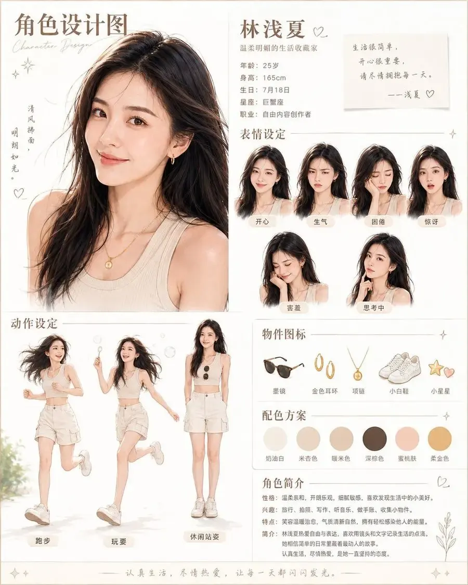

目标：为 {argument name="character name" default="林浅夏"} 创建一张简洁、温馨的米色系中式角色设计海报。她是一位温柔的生活方式博主，海报需结合大尺寸时尚肖像、表情包、动作展示、物品图标、配色方案及个人简介。

画布：竖版肖像海报，比例约为 4:5，采用米白色纸张背景，配有浅米色细边框、精致的金棕色线条分割，点缀微小的闪光和爱心涂鸦，呈现柔和的编辑类杂志排版。使用暖奶油色、棕褐色、桃色和咖啡色调，搭配优雅的手写体装饰。

布局：将海报分为左侧大尺寸肖像栏和右侧较窄的信息栏，左下方放置动作展示区，右下方堆叠简介和配色方案区。保持充足的留白和细线条分割。

左上角标题区：添加大号中文标题「角色设计图」，并配以小号草书英文副标题“Character Design”。在肖像旁，添加竖排诗意文字「清风拂面，明朗如光。」以及小爱心和星星涂鸦。

主肖像：展示一张 {argument name="age" default="25"} 岁年轻东亚女性的腰部以上肖像，留着 {argument name="hair style" default="深棕黑色长波浪卷发，略显凌乱"}，肤色自然温暖，淡妆，佩戴小巧金耳环、精致金吊坠项链，身穿奶油色罗纹无袖背心。她面向前方，光线柔和自然，气质优雅从容，采用写实时尚摄影风格，并带有淡淡的水彩柔光感。

右上方资料块：放置大号名字「林浅夏」及一颗小爱心。下方书写「温柔明朗的生活收藏家」。包含 5 行个人资料：「年龄：25岁」、「身高：165cm」、「生日：7月18日」、「星座：巨蟹座」、「职业：自由内容创作者」。添加一张便签式引言卡片，写着：「生活很简单，开心很重要，请尽情拥抱每一天。——浅夏♡」。

表情区：添加标题「表情设定」，排列 6 个相同的女性头像，分两行展示，每个头像配有圆角米色标签。6 个标签分别为：「开心」、「生气」、「困倦」、「惊讶」、「害羞」、「思考中」。保持发型、服装和身份一致，仅改变面部表情和轻微的头部姿态。

动作区：添加标题「动作设定」，展示 3 个全身动作，人物身穿奶油色短款背心、米色短裤、小白鞋，头发自然披散。3 个动作标签为：「跑步」（充满活力地慢跑）、「玩耍」（跳跃或玩泡泡）、「休闲站姿」（放松站立，手持墨镜）。运用轻盈的动态感、清爽的夏日风格，并在玩耍动作周围添加小泡泡细节。

物品图标区：添加标题「物件图标」，在一行内展示 5 个小巧的插画图标，标签分别为：「墨镜」（黑色墨镜）、「金色耳环」（金圈耳环）、「项链」（金吊坠项链）、「小白鞋」（白色运动鞋）、「小星星」（小星星和爱心挂饰）。

配色方案区：添加标题「配色方案」，展示 6 个圆形色块，标签分别为：「奶油白」、「米杏色」、「暖米色」、「深棕色」、「蜜桃肤」、「柔金色」。配色应在视觉上对应奶油白、米色、暖棕褐、深棕、桃色肤色和柔金色。

简介区：添加标题「角色简介」，配以小爱心和植物线条画。包含简洁的中文简介，分为四行：「性格：温柔亲和，开朗乐观，细腻敏感，喜欢发现生活中的小美好。」、「兴趣：旅行、拍照、写作、听音乐、做手账、收集小物件。」、「特点：笑容温暖治愈，气质清新自然，拥有轻松感染他人的能量。」、「简介：林浅夏热爱自由与表达，喜欢用镜头和文字记录生活的点滴。她相信简单的日常里藏着最动人的故事。认真生活，尽情热爱，是她一直坚持的态度。」

页脚：添加一条细装饰线，居中书写句子「认真生活，尽情热爱，让每一天都闪闪发光。」，两端配以小闪光符号。

视觉风格：柔和写实的角色设定海报，优雅的中式生活杂志美学，暖色日光，精致的米色排版，水彩与写实摄影的微妙融合，构图简洁，无生硬阴影，无多余角色，无多余标签，无水印。

创意广告

| 预览 | 预览 | 预览 | 预览 |
| --- | --- | --- | --- |
| 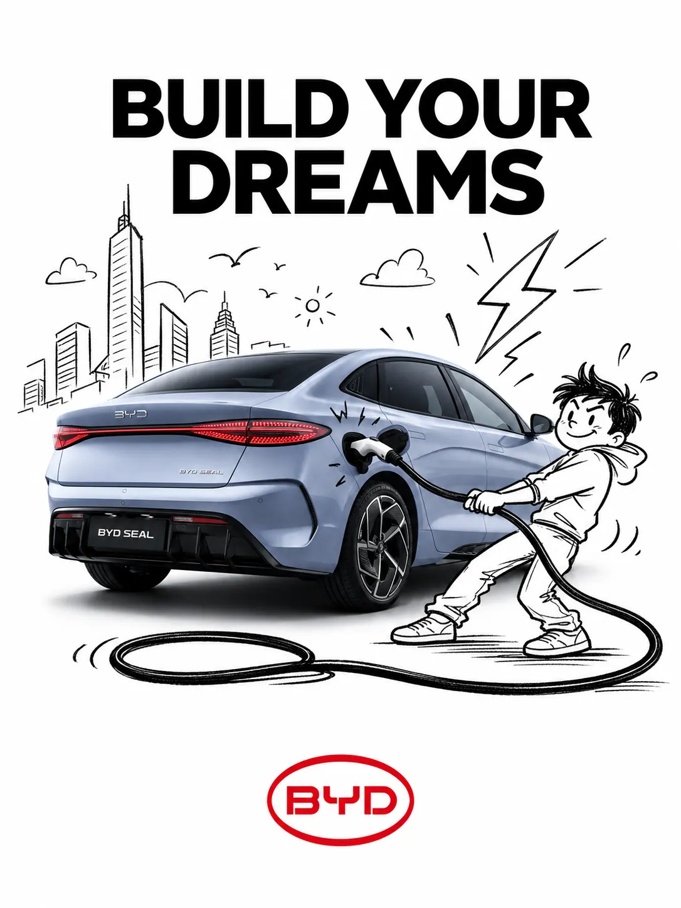 | 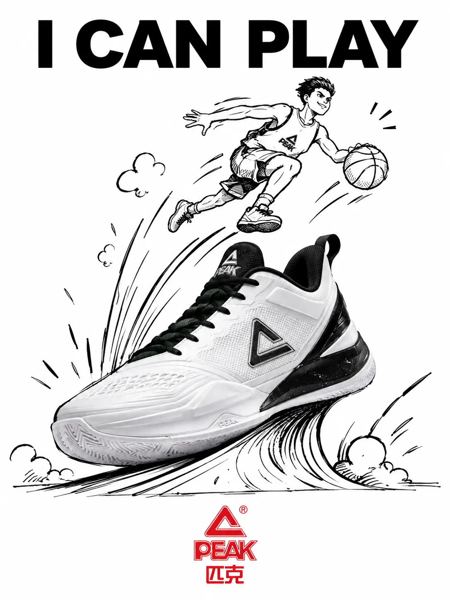 | 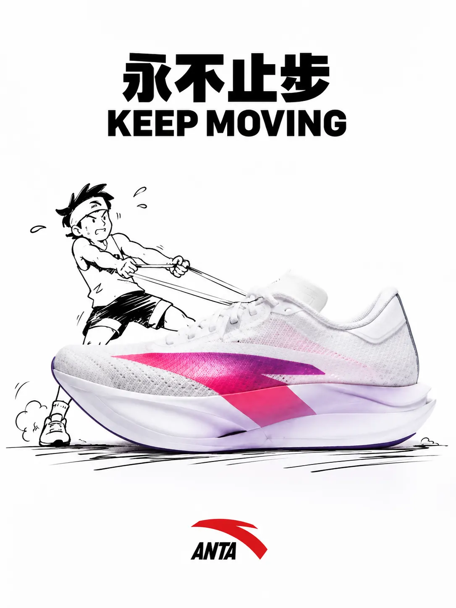 | 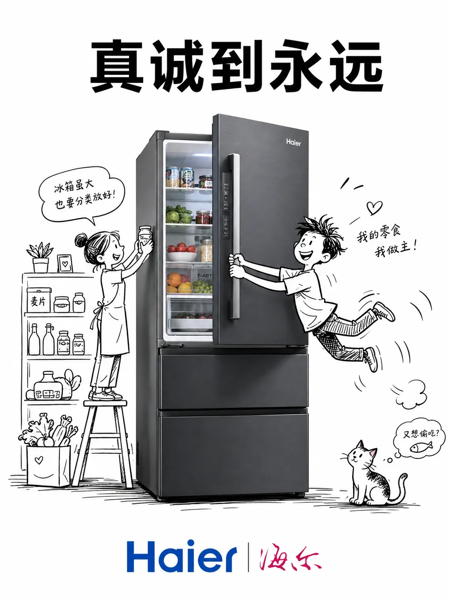 |
| 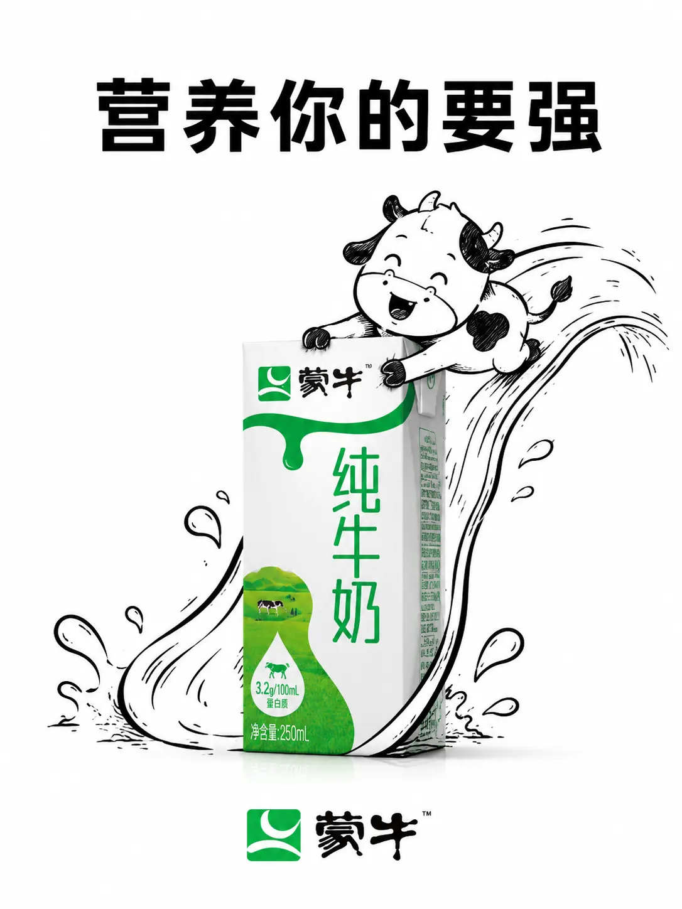 |  |  |  |

| 预览 | 预览 | 预览 | 预览 |
| --- | --- | --- | --- |
| 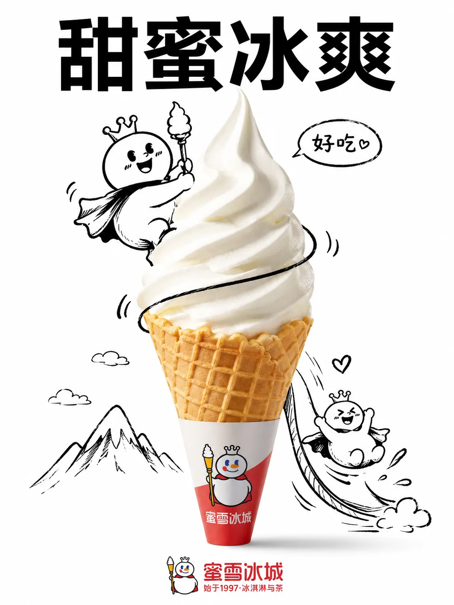 | 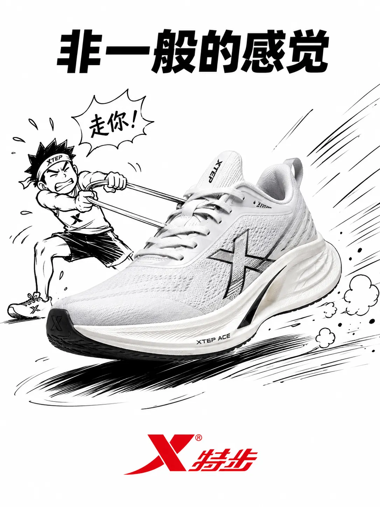 | 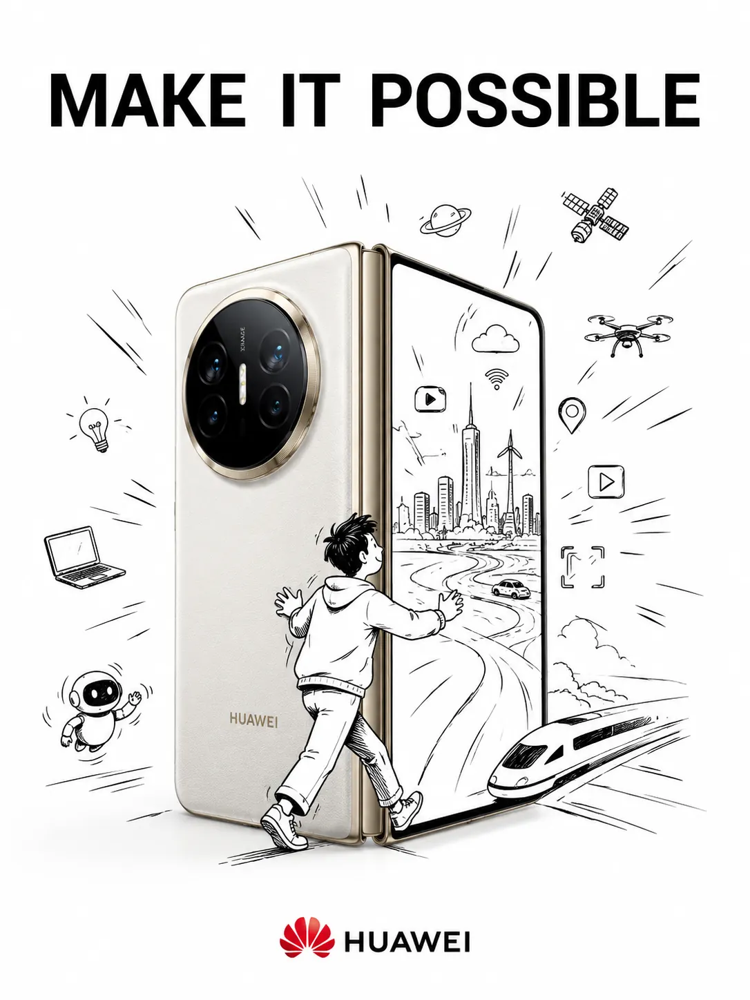 | 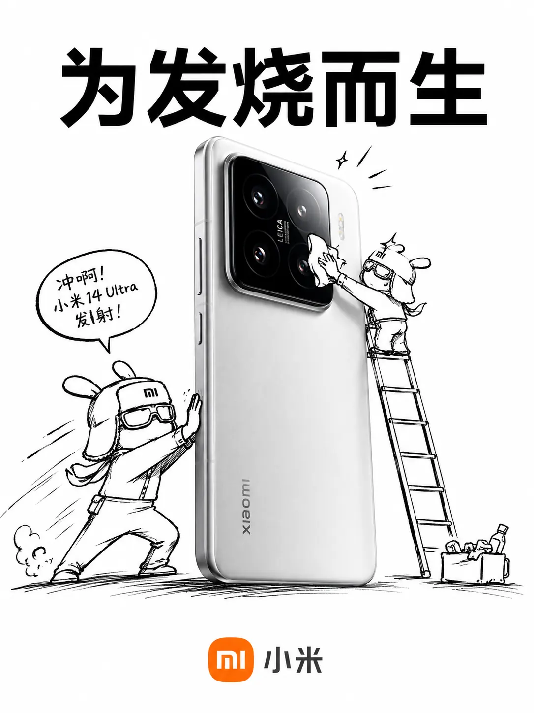 |
| 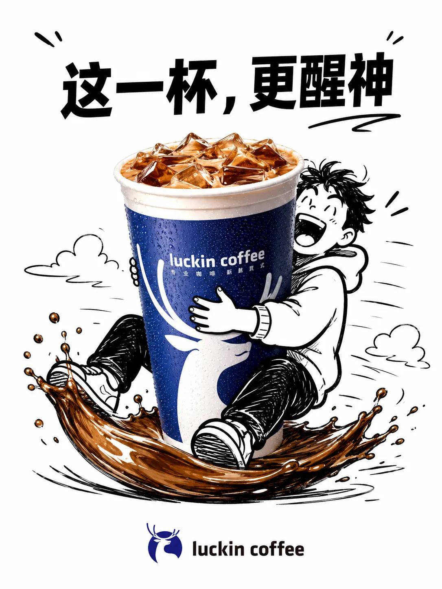 |  |  |  |

ABAP创意合成品牌广告生成提示词（品牌名直填版）请生成一张创意合成品牌广告图。一、用户只需要填写品牌名称：【蒙牛】二、AI 自动理解与补全规则请根据用户填写的【品牌名称】，自动分析并补全以下内容，不需要用户额外提供：1）自动识别品牌核心信息自动判断并优先选择该品牌最具代表性的视觉元素，包括但不限于：品牌最有辨识度的代表性产品品牌常见的包装形式 / 外观特征 / 材质细节品牌经典广告语 / slogan品牌标准Logo品牌典型色彩系统品牌整体调性与气质2）自动选择最适合的产品如果该品牌拥有多个产品线，请优先选择：最经典最知名最容易被用户一眼识别最适合做创意广告表现的那一个产品作为主视觉主体。例如可自动理解为：饮料 / 食品品牌 → 选择最有代表性的瓶装、杯装、零食包装等美妆品牌 → 选择口红、香水、粉底、护肤品等明星单品科技品牌 → 选择手机、耳机、电脑、相机等代表产品服饰运动品牌 → 选择球鞋、服饰、包袋等典型单品快消品牌 → 选择最有品牌识别度的包装产品3）自动设计卡通互动场景请根据品牌产品特征，自动生成一个聪明、有趣、自然、具有传播感的手绘互动场景。要求这个场景必须满足：卡通角色与真实产品产生明确互动场景动作自然，不生硬有创意，有轻松幽默感符合品牌调性让人一眼停留，具有“广告创意感”例如可自动理解为：爬上瓶身推动包装盒抱着产品在产品上休息把产品当作道具使用和产品做出拟人化互动围绕产品产生一个巧妙的小剧情三、画面生成要求请生成一张：3:4 竖版构图纯净白色背景专业影棚灯光画面清晰锐利高对比度极简构图视觉重点明确的创意品牌广告图。四、核心视觉形式画面主体必须是：1）真实产品摄影一件该品牌的真实感产品出现在画面中央或视觉核心位置。产品必须呈现为：真实商业摄影质感清晰、锐利、质感好包装、材质、颜色、外观特征准确有品牌辨识度像专业广告拍摄一样干净利落2）手绘黑色墨线卡通插画在真实产品周围，加入黑色手绘线描风格的卡通元素。插画风格要求：简洁有表现力黑色线稿少量阴影像随手画出的创意草图不是复杂插画，而是轻松、聪明、醒目的 doodle 风格3）真实产品与插画无缝融合最重要的是：真实产品与手绘卡通要像存在于同一个世界卡通角色要自然与产品发生关系不能像简单贴上去必须做到视觉上自然、巧妙、融合度高五、版式要求顶部文案在画面顶部，加入该品牌的广告语 / slogan。要求：使用简洁醒目的无衬线粗体字字体干净利落排版高级与整体广告气质统一如果品牌有广为人知的经典 slogan，可优先采用经典表达；如果没有非常明确的固定 slogan，可根据品牌调性自动生成一句简洁有力、像品牌广告语一样的话。底部 Logo在画面底部加入该品牌的真实 Logo。要求：保持品牌原有标准色彩保持原有比例保持原有造型不变形不乱改结构位置稳定清晰，形成品牌收尾六、整体风格要求整体视觉必须呈现出以下特征：真实产品摄影 + 黑色手绘涂鸦艺术创意巧妙幽默有记忆点极简但不单调有品牌传播感有杂志级广告质感有社交媒体“停留感”像当下流行的创意品牌广告设计最终效果要让人感觉：这是一个高完成度、聪明、有趣、极简、很适合传播的品牌创意广告。
